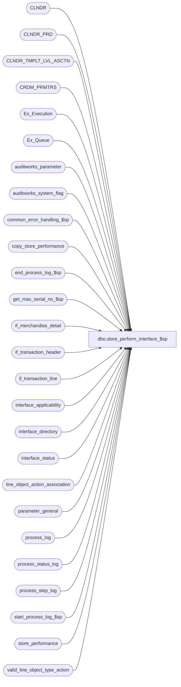

# dbo.store_perform_interface_$sp

**Database:** auditworks  
**Server:** bedrockdb01  

## Architecture Diagram



## Table Dependencies

| Referenced Table |
|---|
| CLNDR |
| CLNDR_PRD |
| CLNDR_TMPLT_LVL_ASCTN |
| CRDM_PRMTRS |
| Ex_Execution |
| Ex_Queue |
| auditworks_parameter |
| auditworks_system_flag |
| common_error_handling_$sp |
| copy_store_performance |
| end_process_log_$sp |
| get_max_serial_no_$sp |
| if_merchandise_detail |
| if_transaction_header |
| if_transaction_line |
| interface_applicability |
| interface_directory |
| interface_status |
| line_object_action_association |
| parameter_general |
| process_log |
| process_status_log |
| process_step_log |
| start_process_log_$sp |
| store_performance |
| valid_line_object_type_action |

## Stored Procedure Code

```sql
create proc [dbo].[store_perform_interface_$sp] AS

/* Proc name: store_performance_interface_$sp
** Description: To build store_performance base table.  Uses data 
**		from interface ( interface_id = 24 ).
               Batched by 2000 transactions max.
** Called by susm every few minutes.

NOTE:  This unicode version is suitable for both SA5.0 and SA5.1

HISTORY
Date     Name          Def# Desc
Mar09,15 Phu          94727 Support all calendars
Jan19,15 Phu          51493 Support Gregorian calendar
Jan10,12 Paul        132256  Raise error 201612 if all weeks have not been defined in the CRDM calendar
Sep22,10 Vicci       115670  Also, instead of inserting store_performance with zeros then updating it, just insert it with
			    the right values.
Jun29,10 Vicci       117088 Move creation of #store_type_detail and #store_detail outside loop to avoid Msg 2714
Jun29,10 Vicci       115670 Set store to originating store if G/L set to be fed originating store.  Otherwise,
			    set store to fulfillment store (or to source store if fulfillment store not provided 
			    or provided but it is an order delivery return, or to transaction store if neither 
			    fulfillment nor source provided) in order to handle case of shipments/pickups.  
			    Same logic as mew_sales_export_$sp.
			    Also, soft-code timing of recognition of orders, layaways, etc to be based on interface applicability.
Aug14,07 Paul       DV-1363 apply 81895 to SA5
Nov06,06 Paul         74790 read CRDM_PRMTRS to get CLNDR_ID
Oct25,06 Phu          77931 Fix outer join for SQL 2005 Mode 90.
Jan25,05 Seb        DV-1203 apply 47390, 29561 to SA5,
                            Added scaleout logic to insert modified store/dates to the table copy_store_performance
Sep02,04 David      DV-1129 Handle line_object_type 23 (PLU subtotal discounts)
May12,04 David      DV-1071 Use new Calendar table.
Jan12,07 Vicci        81895 Support sale following loan, sale following rental, repair pickup, alteration pickup
Jan19,05 Vicci        47390 Handle "sale for pickups" and "order pickups" (line actions 137, 144, 157, 142, 147, 160)
Jul15,04 Vicci        29561 Handle line_object_type 23 (PLU subtotal discounts)
May07,02 Winnie     1-CNQSH correct the calculation for discount net sales and net return amount.
Nov13,01 Winnie	     8846 R3 Error handling, add logic to log process_log.
Jul16,01 Vicci	     8281 Support delivery line-actions; correct discount actions missing 
			    from where clause.
Jan30,01 Paul          7272 changed log message for compatibility with new smartload
Jan30,01 Paul          7271 added call to get_max_serial_no_$sp
Sep29,00 Phu           6796 Correct Error 2714: object named #entry_no already existed
Mar30,00 Phu           6158 Remove alias name attached to column being updated for MS SQL compatibility
Sep14,99 Sebastiano    4796 Change related to new interface method
Jul28,99 Louise M.     3602 Fixed code that calculates the number of merchandise transactions
Apr08,99 Sebastiano    4467 properly handle voids
Aug07,98 Daphna        3541
Apr16,97 Yin           Author

*/

DECLARE
	@count                          int,
	@completed_workload		numeric(12,0),
	@current_date			smalldatetime,
	@errmsg 				nvarchar(255),
	@errno 				int,
	@first_batch			tinyint,
	@from_date			datetime,
	@loop_flag			smallint,
	@last_posting_datetime		datetime,
	@max_serial_no			numeric(14,0),
	@min_serial_no			numeric(14,0),
	@object_id			int,
	@rows				int,
	@row_count			int,
	@scaleout_flag			int,
	@to_date				smalldatetime,
	@transaction_count 		int,
	@object_name			nvarchar(255),
	@process_name			nvarchar(100),
	@process_log_entry 		tinyint,
	@process_timestamp		float,
	@process_no			smallint,
	@posting_in_progress		tinyint,
	@operation_name			nvarchar(100),
	@message_id			int,
	@clndr_id			binary(16),
	@lvl_week			binary(16),
	@retail_calendar		tinyint

SELECT
	@transaction_count = 0,
	@process_name = 'store_perform_interface_$sp',
	@message_id = 201068,
	@process_log_entry = 0,
	@process_no = 270,
	@rows = 0,
	@loop_flag = 0,
	@retail_calendar = 0

IF EXISTS (SELECT interface_id
	     FROM interface_status
	    WHERE interface_id = 24
	    AND (last_retrieval_datetime < last_posting_datetime 
	           OR posting_in_progress <> 0))
  SELECT @rows = 1

IF @rows = 0
  RETURN

SELECT @clndr_id = par_bin_value
FROM auditworks_parameter
WHERE par_name = 'store_performance_calendar'
SELECT @errno = @@error
IF @errno <> 0
BEGIN
  SELECT @errmsg = 'Unable to select par_bin_value for store_performance_calendar',
         @object_name = 'auditworks_parameter',
         @operation_name = 'SELECT'
  GOTO error
END

IF @clndr_id is null
BEGIN
  SELECT @clndr_id = PRMTR_VAL_BIN
  FROM CRDM_PRMTRS
  WHERE PRMTR_NAME = 'GL_PSTNG_CLNDR_ID'

  SELECT @errno = @@error, @rows = @@rowcount
  IF @rows = 0 AND @errno = 0
    SELECT @errno = 201612
  IF @errno <> 0
  BEGIN
    SELECT @errmsg = 'Unable to select value for GL_PSTNG_CLNDR_ID parameter name',
           @object_name = 'CRDM_PRMTRS',
           @operation_name = 'SELECT'
    GOTO error
  END
END

IF NOT EXISTS (select 1 from CLNDR c inner join CLNDR_TMPLT_LVL_ASCTN a on c.CLNDR_TMPLT_ID = a.CLNDR_TMPLT_ID
               where c.ACTV > 0 AND c.CLNDR_ID = @clndr_id )
BEGIN
  SELECT @errmsg = 'There is no active calendar type defined in auditworks_parameter and CRDM_PRMTRS',
         @object_name = 'auditworks_parameter/CRDM_PRMTRS',
         @operation_name = 'SELECT',
         @errno = 201665
  GOTO error
END

SELECT @lvl_week = par_bin_value
FROM auditworks_parameter
WHERE par_name = 'clndr_lvl_week'

SELECT @errno = @@error
IF @errno <> 0
BEGIN
  SELECT @errmsg = 'Unable to select week level type id',
         @object_name = 'auditworks_parameter',
         @operation_name = 'SELECT'
  GOTO error
END

/* Verify that the CRDM calendar has been defined and that clndr_lvl_week has been correctly configured */

SELECT @retail_calendar = 0
IF EXISTS(
  SELECT 1
    FROM CLNDR_PRD
   WHERE CLNDR_ID = @clndr_id
     AND CLNDR_LVL_TYPE_ID = @lvl_week)
  SELECT @retail_calendar = 1
SELECT @errno = @@error
IF @errno != 0
BEGIN
    SELECT @errmsg = 'Unable to find any rows in CRDM calendar for the week level. Verify clndr_lvl_week parameter name in auditworks_parameter.',
           @object_name = 'CLNDR_PRD',
          @operation_name = 'SELECT'
    GOTO error
END

SELECT @scaleout_flag = CONVERT(int,flag_numeric_value)
  FROM auditworks_system_flag
 WHERE flag_name = 'scaleout_flag'

SELECT @rows = @@rowcount, @errno = @@error
IF @errno != 0
  BEGIN
    SELECT @errmsg = 'Failed to select scaleout_flag from auditworks_system_flag',
           @object_name = 'auditworks_system_flag',
          @operation_name = 'SELECT'
  GOTO error
  END

IF @rows = 0
  BEGIN
    SELECT @errmsg = 'Invalid setup. Missing scaleout_flag.',
	   @object_name = 'auditworks_system_flag',
	   @operation_name = 'SELECT'
    GOTO error
  END

CREATE TABLE #count_date (
        transaction_date smalldatetime,
        transaction_count int)

SELECT @errno = @@error
IF @errno != 0
  BEGIN
   SELECT @errmsg = 'Unable to create temp table #count_date',
          @object_name = '#count_date',
          @operation_name = 'CREATE'
   GOTO error
  END

CREATE TABLE #store_detail (
       transaction_date 		smalldatetime 	not null,
       store_no 			int		not null,
       gross_sales_amount 		money		not null,
       gross_discountable_amount	money		not null,
       gross_sales_units 		real 		not null,
       gross_sales_qty 			real 		not null,
       discount_sales_amount 		money 		not null,
       discount_charge_amount 		money 		not null,
       net_sales_amount 		money 		not null,
       net_return_amount 		money 		not null,
       net_fee_amount 			money 		not null,
       first_date_of_week		smalldatetime	null )
SELECT @errno = @@error
IF @errno <> 0
BEGIN
  SELECT @errmsg = 'Unable to create table #store_detail',
  	 @object_name = '#store_detail',
  	 @operation_name = 'CREATE'
  GOTO error
END

CREATE TABLE #store_type_detail (
       transaction_date 		smalldatetime 	not null,
       store_no 			int		not null,
       merch_sale_multiplier		int		not null,
       gross_sales_amount 		money		not null,
       gross_discountable_amount	money		not null,
       gross_sales_units 		real 		not null,
       transaction_qty 			real 		not null,
       discount_sales_amount 		money 		not null,
       discount_charge_amount 		money 		not null,
       net_sales_amount 		money 		not null,
       net_return_amount 		money 		not null,
       net_fee_amount 			money 		not null)
SELECT @errno = @@error
IF @errno <> 0
BEGIN
  SELECT @errmsg = 'Unable to create table #store_type_detail',
         @object_name = '#store_type_detail',
         @operation_name = 'CREATE'
  GOTO error
END
		
SELECT @object_id = object_id
  FROM interface_directory
 WHERE interface_id = 24

SELECT @errno = @@error
IF @errno != 0
  BEGIN
   SELECT @errmsg = 'Unable to select from interface_directory',
          @object_name = 'interface_directory',
          @operation_name = 'SELECT'
   GOTO error
  END

SELECT @last_posting_datetime = last_posting_datetime
  FROM interface_status
 WHERE interface_id = 24

SELECT @errno = @@error
IF @errno != 0
  BEGIN
   SELECT @errmsg = 'Unable to select last_posting_datetime from interface_status',
          @object_name = 'interface_directory',
          @operation_name = 'SELECT'
   GOTO error
  END

WHILE 1=1
  BEGIN
	SELECT @min_serial_no = ISNULL(MAX(to_serial_no),0) + 1
	  FROM Ex_Execution
	 WHERE queue_id = 24

	SELECT @errno = @@error
	IF @errno != 0
	 BEGIN
	   SELECT @errmsg = 'Unable to select from Ex_Execution',
	          @object_name = 'Ex_Execution',
	          @operation_name = 'SELECT'
	   GOTO error
	  END

	EXEC get_max_serial_no_$sp 24, @min_serial_no, 2000, @max_serial_no OUTPUT

	SELECT @errno = @@error
	IF @errno != 0
	  BEGIN
	   SELECT @errmsg = 'Unable to exec get_max_serial_no_$sp',
	          @object_name = 'get_max_serial_no_$sp',
	          @operation_name = 'EXECUTE'
	   GOTO error
	  END

	IF @max_serial_no = 0
	  BREAK

/* for the void_multiplier field, a 1 adds to the total count of merchandise transactions 
 and a -1 decreases this total count by 1.  This number is derived from the 
 interface_control_flag, field key_2 with possible values of 10,20, or 30 and the 
 transaction_void_flag with possible values of 0 or 8.
 10 and 0 = 1  10 and 8  = -1   20 and 0 = -1  20 and 8 = 1  30 and 0 = 1  30 and 8 = -1
*/ 

	SELECT  ith.if_entry_no,
		ith.store_no,
		ith.transaction_date,
		ith.transaction_category,
		void_multiplier
		 = SIGN(COS(SIGN(iic.key_2*ith.transaction_void_flag) + 1 )) * SIGN(COS(SIGN(ABS(20-iic.key_2)) + 1)) * -1 ,
		gross_sales_flag = 0
	 INTO #entry_no
	 FROM Ex_Queue iic, if_transaction_header ith
	WHERE iic.queue_id = 24
	  AND iic.serial_no >= @min_serial_no
	  AND iic.serial_no <= @max_serial_no
	  AND iic.key_1 = ith.if_entry_no
	  AND ith.transaction_void_flag IN (0,8)

	SELECT @errno = @@error,
		@rows = @@rowcount

	IF @errno <> 0
		BEGIN
		SELECT @errmsg = 'Unable to build temp table #entry_no',
		       @object_name = '#entry_no',
	               @operation_name = 'INSERT'
		GOTO error
		END
	
	IF @rows = 0
	 BEGIN -- handle all voids case
	    INSERT Ex_Execution (
		   queue_id,
		   object_id,
		   execution_id,
		   from_serial_no,
		   to_serial_no)
	    VALUES (24,
		   @object_id,
		   0,
		   @min_serial_no,
		   @max_serial_no)

	   SELECT @errno = @@error
	   IF @errno <> 0
	    BEGIN
		SELECT @errmsg = 'Unable to INSERT Ex_Execution NO_ROWS',
		       @object_name = 'Ex_Execution',
	               @operation_name = 'INSERT'		
		GOTO error
	    END

	   DROP TABLE #entry_no

	   SELECT @errno = @@error
	   IF @errno <> 0
	    BEGIN
		SELECT @errmsg = 'Unable to drop table #entry_no',
		       @object_name = '#entry_no',
	               @operation_name = 'DROP'		  
		GOTO error
	    END

	   CONTINUE
	 END

	IF @rows > 0 AND @loop_flag = 0 
	BEGIN
	  SELECT @first_batch = completed_flag,
	         @completed_workload = completed_workload
	    FROM process_status_log
	   WHERE process_no = @process_no

          SELECT @errno = @@error
          IF @errno <> 0
            BEGIN
              SELECT @errmsg = 'Unable to select completed_flag from process_status_log ',
     	             @object_name = 'process_status_log',
		     @operation_name = 'SELECT'
		GOTO error
	    END

	  IF @first_batch IS NULL
          BEGIN
              INSERT process_status_log
 	             (process_no,
                      process_start_time,
                      expected_workload,
                      completed_workload,
                      completed_flag,
                      abort_requested,
                      transaction_qty)
	      VALUES (@process_no,
                      getdate(),
                      1,
                      0,
                      0,
                      0,
                      0)   
    
              SELECT @errno = @@error
	      IF @errno <> 0
	        BEGIN
	          SELECT @errmsg = 'Unable to insert process_status_log (initial)',
	                 @object_name = 'process_status_log',
		         @operation_name = 'INSERT'
		   GOTO error
		END

    INSERT process_step_log
      		       (process_no,
		        stream_no,
		        process_step_no,
		        process_step_start_time,
		        expected_workload,
			completed_workload)
		 VALUES (@process_no,
			 1,
			 64,
			 getdate(),
			 1,
			 0)	    	

		 SELECT @errno = @@error
		 IF @errno <> 0
		   BEGIN
		     SELECT @errmsg = 'Unable to insert process_step_log ',
		            @object_name = 'process_step_log',      
			    @operation_name = 'INSERT'
		      GOTO error
		    END          
          END -- IF @first_batch IS NULL

          ELSE IF @first_batch = 1
            BEGIN 
              UPDATE process_status_log
                 SET completed_flag = 0,
	             expected_workload = 1,
	             completed_workload = 0,
	             transaction_qty = 0,
	             process_start_time = getdate()
	       WHERE process_no = @process_no
	         AND completed_flag = 1

              SELECT @errno = @@error
	      IF @errno <> 0
	        BEGIN
	          SELECT @errmsg = 'Unable to update process_status_log (initial)',
	                 @object_name = 'process_status_log',
		         @operation_name = 'UPDATE'
     	          GOTO error
	        END

                UPDATE process_step_log
	           SET process_step_start_time = getdate(),
	               expected_workload = 1,
	               completed_workload = 0,
	               process_step_no = 64
	         WHERE process_no = @process_no
	           AND stream_no = 1
           
	        SELECT @errno = @@error
	        IF @errno <> 0
	          BEGIN
		    SELECT @errmsg = 'Unable to update process_step_log (initial)',
		  	   @object_name = 'process_step_log',
			   @operation_name = 'UPDATE'
		    GOTO error
		  END          
              END -- ELSE IF @first_batch = 1

            IF @first_batch = 1 OR @first_batch IS NULL
            BEGIN
                SELECT @completed_workload = 0

                SELECT @current_date = CONVERT(smalldatetime, convert(nchar,getdate(),112)) 
                IF (SELECT trickle_polling_flag FROM parameter_general) = 0
                  BEGIN
                    IF (SELECT datepart(hh,getdate())) > = 12
                      SELECT @from_date = dateadd(hh,12,dateadd(dd, -7, @current_date)),             
                                 @to_date = dateadd(hh,12,dateadd(dd, -6, @current_date))
                    ELSE 
		      SELECT @from_date = dateadd(hh,12,dateadd(dd, -8, @current_date)),             
                               @to_date = dateadd(hh,12,dateadd(dd, -7, @current_date))
                  END                                             
                ELSE
                  SELECT @from_date = dateadd(dd,-7, @current_date),
                           @to_date = dateadd(dd,-6, @current_date) 

                SELECT @row_count = SUM(transaction_count)
                  FROM process_log
                 WHERE process_start_time >= @from_date
                   AND process_start_time < @to_date
                   AND process_no = @process_no

		SELECT @errno = @@error
		IF @errno <> 0
		  BEGIN
		    SELECT @errmsg = 'Unable to select from process_log ',
			   @object_name = 'process_log',
			   @operation_name = 'SELECT'
		   GOTO error
		  END          

                IF @row_count IS NULL OR @row_count = 0
                  SELECT @row_count = 1

                UPDATE process_status_log
		   SET expected_workload = @row_count
   	         WHERE process_no = @process_no

		  SELECT @errno = @@error
		  IF @errno <> 0
		    BEGIN
		      SELECT @errmsg = 'Unable to update process_status_log for expected_workload',
		             @object_name = 'process_status_log',
 		             @operation_name = 'UPDATE'
		      GOTO error
		    END          

                UPDATE process_step_log
	           SET expected_workload = @row_count
	         WHERE process_no = @process_no
	           AND stream_no = 1

		SELECT @errno = @@error
	        IF @errno <> 0
	          BEGIN
	            SELECT @errmsg = 'Unable to update process_step_log for expected_workload',
	                   @object_name = 'process_step_log',
 	                   @operation_name = 'UPDATE'
	            GOTO error
   	          END          
          END -- IF @first_batch = 1 OR @first_batch IS NULL
	END -- IF @rows > 0 AND @loop_flag = 0 

        SELECT @loop_flag = 1

	IF @process_log_entry = 0 AND @rows >0 
	  BEGIN
	    EXEC start_process_log_$sp @process_no, @process_timestamp OUTPUT, @errmsg OUTPUT

	    SELECT @errno = @@error
	    IF @errno <> 0
	    BEGIN
	      IF @errmsg IS NULL
               SELECT @errmsg = 'Unable to execute start_process_log_$sp'
	      SELECT @object_name = 'start_process_log_$sp',
	             @operation_name = 'EXECUTE'
	     GOTO error
	    END

 	    SELECT @process_log_entry = 1
	  END	

	SELECT @transaction_count = @transaction_count + @rows,
	       @count = @rows

	TRUNCATE TABLE #store_detail
	SELECT @errno = @@error
	IF @errno <> 0
	BEGIN
	  SELECT @errmsg = 'Unable to truncate table #store_detail',
		 @object_name = '#store_detail',
	         @operation_name = 'TRUNCATE'
	  GOTO error
        END

	TRUNCATE TABLE #store_type_detail
	SELECT @errno = @@error
	IF @errno <> 0
	BEGIN
	  SELECT @errmsg = 'Unable to truncate table #store_type_detail',
		 @object_name = '#store_type_detail',
	         @operation_name = 'TRUNCATE'
          GOTO error
        END
        
	INSERT #store_type_detail (
		transaction_date,
		store_no,
		merch_sale_multiplier,
		gross_sales_amount,
		gross_discountable_amount,
		gross_sales_units,
		transaction_qty,
		discount_sales_amount,
		discount_charge_amount,
		net_sales_amount,
		net_return_amount,
		net_fee_amount)
	SELECT
		ti.transaction_date,
	        CASE WHEN (l.line_action <> 99 AND COALESCE(m.fulfillment_store_no, m.source_store_no, ti.store_no) <> ti.store_no) /* NB since S/A does not have G/L account segment lookup for fulfillment store if it doesn't match that in header merch must attribute to originating store */
	                  OR ( COALESCE(m.fulfillment_store_no, m.source_store_no, ti.store_no) <> m.originating_store_no
               	               AND(1 - ( ABS( SIGN(COALESCE(lookup_segment1, 0) - 14) * SIGN(COALESCE(lookup_segment2, 0) - 14)*
                                              SIGN(COALESCE(lookup_segment3, 0) - 14) * SIGN(COALESCE(lookup_segment4, 0) - 14)*
                                              SIGN(COALESCE(lookup_segment5, 0) - 14) * SIGN(COALESCE(lookup_segment6, 0) - 14)*
                            SIGN(COALESCE(lookup_segment7, 0) - 14) * SIGN(COALESCE(lookup_segment8, 0) - 14) ) )) = 1)
                     THEN COALESCE(m.originating_store_no, ti.store_no)
                     ELSE CASE WHEN l.line_action = 99 THEN ti.store_no ELSE COALESCE(m.fulfillment_store_no, m.source_store_no, ti.store_no) END
                END store_no,
                ti.void_multiplier * CASE WHEN l.line_object_type = 1 and v.default_db_cr_none = -1 THEN 1 ELSE 0 END merch_sale_multiplier,
		gross_sales_amount = COALESCE(SUM(CASE WHEN l.line_object_type = 1 AND v.default_db_cr_none = -1 
		                                  THEN l.gross_line_amount * voiding_reversal_flag
		                                  ELSE 0 END), 0),
		gross_discountable_amount = COALESCE(SUM(CASE WHEN l.line_object_type = 1 AND v.default_db_cr_none = -1 AND a.discountable_group <> 0
		                                         THEN l.gross_line_amount * voiding_reversal_flag
		                                         ELSE 0 END), 0) 
		                            + 
					    COALESCE(SUM(CASE WHEN l.line_object_type = 2 AND a.discountable_group <> 0
					                 THEN v.default_db_cr_none * -1 * l.gross_line_amount * l.voiding_reversal_flag
					                ELSE 0 END), 0),
		gross_sales_units = COALESCE(SUM(CASE WHEN l.line_object_type = 1 AND v.default_db_cr_none = -1
		                                 THEN COALESCE(m.units, 1) * l.voiding_reversal_flag
		                                 ELSE 0 END), 0),
		COUNT (DISTINCT ti.if_entry_no) transaction_count,
		discount_sales_amount = COALESCE(SUM(CASE WHEN l.line_object_type = 1 AND v.default_db_cr_none = -1
		                                     THEN l.pos_discount_amount * l.voiding_reversal_flag
		                                     ELSE 0 END), 0) 
		                        +
				        COALESCE(SUM(CASE WHEN l.line_object_type in (16, 17, 18, 19, 22, 23) 
				                          AND v.default_db_cr_none = 1 AND l.db_cr_none = 1
				                     THEN l.gross_line_amount * l.voiding_reversal_flag
				                     ELSE 0 END), 0),
		discount_charge_amount = COALESCE(SUM(CASE WHEN l.line_object_type = 2 
		                                      THEN l.pos_discount_amount * l.voiding_reversal_flag * v.default_db_cr_none * -1
		                                      ELSE 0 END), 0),
		net_sales_amount =  COALESCE(SUM(CASE WHEN l.line_object_type = 1 AND v.default_db_cr_none = -1
		                                 THEN (l.gross_line_amount - l.pos_discount_amount) * l.voiding_reversal_flag
		                                 ELSE 0 END), 0)
				    -
				    COALESCE(SUM(CASE WHEN l.line_object_type in (16, 17, 18, 19, 22, 23) 
				                      AND v.default_db_cr_none = 1 AND l.db_cr_none = 1
				                 THEN l.gross_line_amount * l.voiding_reversal_flag
				                 ELSE 0 END), 0),
		net_return_amount = COALESCE(SUM(CASE WHEN l.line_object_type = 1 AND v.default_db_cr_none = 1
		                                 THEN (l.gross_line_amount - l.pos_discount_amount) * l.voiding_reversal_flag
		                                 ELSE 0 END), 0)
				    -
				    COALESCE(SUM(CASE WHEN l.line_object_type in (16, 17, 18, 19, 22, 23) 
				                      AND v.default_db_cr_none = -1 AND l.db_cr_none = -1
				                 THEN l.gross_line_amount * l.voiding_reversal_flag
				                 ELSE 0 END), 0),
		net_fee_amount = COALESCE(SUM(CASE WHEN l.line_object_type = 2 
		                              THEN (l.gross_line_amount - l.pos_discount_amount) * v.default_db_cr_none * l.voiding_reversal_flag * -1
		                              ELSE 0 END), 0)
          FROM #entry_no ti
               INNER JOIN if_transaction_line l
                  ON ti.if_entry_no = l.if_entry_no
	         AND l.line_object_type IN ( 1, 2, 16, 17, 18, 19, 22, 23 )
	   	 AND l.line_void_flag = 0
               INNER JOIN line_object_action_association a
                  ON ti.transaction_category = a.transaction_category
 	         AND l.line_object = a.line_object
	         AND l.line_action = a.line_action
               INNER JOIN interface_applicability ia
                  ON ia.interface_id = 24
                 AND ti.transaction_category = ia.transaction_category
	   	 AND l.line_object = ia.line_object 
	         AND l.line_action = ia.line_action 
               INNER JOIN valid_line_object_type_action v
                  ON l.line_action = v.line_action
	   	 AND l.line_object_type = v.line_object_type
	       LEFT OUTER JOIN if_merchandise_detail m
	          ON l.if_entry_no = m.if_entry_no
	   	 AND l.line_id = m.line_id 
         GROUP BY
			ti.transaction_date,
			CASE WHEN (l.line_action <> 99 AND COALESCE(m.fulfillment_store_no, m.source_store_no, ti.store_no) <> ti.store_no) /* NB since S/A does not have G/L account segment lookup for fulfillment store if it doesn't match that in header merch must attribute to originating store */
	                          OR ( COALESCE(m.fulfillment_store_no, m.source_store_no, ti.store_no) <> m.originating_store_no
               	                       AND(1 - ( ABS( SIGN(COALESCE(lookup_segment1, 0) - 14) * SIGN(COALESCE(lookup_segment2, 0) - 14)*
                                                      SIGN(COALESCE(lookup_segment3, 0) - 14) * SIGN(COALESCE(lookup_segment4, 0) - 14)*
                                                      SIGN(COALESCE(lookup_segment5, 0) - 14) * SIGN(COALESCE(lookup_segment6, 0) - 14)*
                                                      SIGN(COALESCE(lookup_segment7, 0) - 14) * SIGN(COALESCE(lookup_segment8, 0) - 14) ) )) = 1)
                             THEN COALESCE(m.originating_store_no, ti.store_no)
                             ELSE CASE WHEN l.line_action = 99 THEN ti.store_no ELSE COALESCE(m.fulfillment_store_no, m.source_store_no, ti.store_no) END
                        END,
                        ti.void_multiplier * CASE WHEN l.line_object_type = 1 and v.default_db_cr_none = -1 THEN 1 ELSE 0 END 
	
	SELECT @errno = @@error
	IF @errno <> 0
		BEGIN
		SELECT @errmsg = 'Unable to insert table #store_type_detail',
		       @object_name = '#store_type_detail',
	               @operation_name = 'INSERT'
		GOTO error
		END

	CREATE TABLE #check_dup_store_date (
		transaction_date 	smalldatetime 	not null,
		store_no 		int		not null,
		dup_transaction_date 	smalldatetime	null,
		dup_store_no 		int		null)

	SELECT @errno = @@error
	IF @errno <> 0
	 BEGIN
	   SELECT @errmsg = 'Unable to create table #check_dup_store_date',
		  @object_name = '#check_dup_store_date',
	          @operation_name = 'CREATE'
	   GOTO error
	 END

	INSERT #store_detail (
		transaction_date,
		store_no,
		gross_sales_amount,
		gross_discountable_amount,
		gross_sales_units,
		gross_sales_qty,
		discount_sales_amount,
		discount_charge_amount,
		net_sales_amount,
		net_return_amount,
		net_fee_amount)
	SELECT  transaction_date,
		store_no,
		SUM(gross_sales_amount),
		SUM(gross_discountable_amount),
		SUM(gross_sales_units),
		SUM(transaction_qty * merch_sale_multiplier),
		SUM(discount_sales_amount),
		SUM(discount_charge_amount),
		SUM(net_sales_amount),
		SUM(net_return_amount),
		SUM(net_fee_amount)
           FROM #store_type_detail
          GROUP BY transaction_date,
 		store_no
	SELECT @errno = @@error
	IF @errno <> 0
		BEGIN
		SELECT @errmsg = 'Unable to insert table #store_detail',
		       @object_name = '#store_detail',
	               @operation_name = 'INSERT'
		GOTO error
		END

	IF @scaleout_flag = 1
	BEGIN
	  INSERT INTO #check_dup_store_date (
		 transaction_date,
		 store_no,
		 dup_transaction_date,
		 dup_store_no)
	  SELECT DISTINCT e.transaction_date, e.store_no, c.transaction_date, c.store_no
	    FROM #entry_no e LEFT JOIN copy_store_performance c ON (e.store_no = c.store_no AND e.transaction_date = c.transaction_date)

	  SELECT @errno = @@error
	  IF @errno <> 0
	   BEGIN
	     SELECT @errmsg = 'Unable to INSERT table #check_dup_store_date',
		    @object_name = '#check_dup_store_date',
	            @operation_name = 'INSERT'
	   GOTO error
	   END
	END

	BEGIN TRAN

	UPDATE store_performance
	SET 
		net_sales_amount = 
			s.net_sales_amount + sd.net_sales_amount,
		gross_discountable_amount =
			s.gross_discountable_amount + sd.gross_discountable_amount,
		gross_sales_units = 
			s.gross_sales_units + sd.gross_sales_units,
		gross_sales_qty = 
			s.gross_sales_qty + sd.gross_sales_qty,
		discount_amount = 
			s.discount_amount + sd.discount_sales_amount + sd.discount_charge_amount,
		net_return_amount = 
			s.net_return_amount + sd.net_return_amount,
		net_fee_amount = 
			s.net_fee_amount + sd.net_fee_amount,
		net_sales_return_amount = 
			s.net_sales_return_amount + sd.net_sales_amount - sd.net_return_amount,
		units_per_transaction = 
			(s. gross_sales_units + sd.gross_sales_units) / 
			(s.gross_sales_qty + sd.gross_sales_qty + 
			(1 - ABS (SIGN (s.gross_sales_qty + sd.gross_sales_qty)))),
		net_sales_avg = 
			(s. net_sales_amount + sd.net_sales_amount) / 
			(s.gross_sales_qty + sd.gross_sales_qty + 
			(1 - ABS (SIGN (s.gross_sales_qty + sd.gross_sales_qty)))),
		discount_pct = 
			(s.discount_amount + sd.discount_sales_amount + sd.discount_charge_amount) /
			(s.gross_discountable_amount + sd.gross_discountable_amount +
			(1 - ABS (SIGN (s.gross_discountable_amount + sd.gross_discountable_amount)))) 
			* 100,
		net_return_pct = 
			(s.net_return_amount + sd.net_return_amount) /
			(s.net_sales_amount + sd.net_sales_amount + 
			(1 - ABS (SIGN (s.net_sales_amount + sd.net_sales_amount)))) * 100,
		net_fee_pct = 
			(s.net_fee_amount + sd.net_fee_amount) / 
			(s.net_sales_amount + sd.net_sales_amount +
			(1 - ABS (SIGN (s.net_sales_amount + sd.net_sales_amount)))) * 100,
		net_revenue_amount = 
			s.net_revenue_amount + sd.net_sales_amount + sd.net_fee_amount - sd.net_return_amount
	FROM store_performance s, #store_detail sd
	WHERE s.store_no = sd.store_no
	  AND s.transaction_date = sd.transaction_date

	SELECT @errno = @@error,
		@rows = @@rowcount
	IF @errno <> 0
		BEGIN
		SELECT @errmsg = 'Unable to update table store_performance',
		       @object_name = 'store_performance',
	               @operation_name = 'UPDATE'
		GOTO error
		END

	IF @rows >= 1
	  BEGIN
	   DELETE #store_detail
	   FROM #store_detail sd, store_performance s
	   WHERE sd.store_no = s.store_no
	     AND sd.transaction_date = s.transaction_date

	   SELECT @errno = @@error
	   IF @errno <> 0
		BEGIN
		SELECT @errmsg = 'Unable to delete table #store_detail',
		       @object_name = '#store_detail',
	               @operation_name = 'DELETE'
		GOTO error
		END
	  END

    IF @retail_calendar = 1
	BEGIN
	  UPDATE #store_detail
	  SET first_date_of_week = (SELECT CONVERT(SMALLDATETIME, convert(nvarchar, c.STRT_DATE_TIME, 101))
				       FROM CLNDR_PRD c
				      WHERE c.CLNDR_ID = @clndr_id
				        AND c.CLNDR_LVL_TYPE_ID = @lvl_week
				        AND s.transaction_date >= c.STRT_DATE_TIME
				        AND s.transaction_date < c.END_DATE_TIME )
	  FROM #store_detail s
	  SELECT @errno = @@error
	  IF @errno <> 0
	  BEGIN
	    SELECT @errmsg = 'Unable to update table #store_detail (first_date_of_week)',
	           @object_name = '#store_detail',
	           @operation_name = 'UPDATE'
	    GOTO error
	  END
	END
    ELSE
	BEGIN
  	  UPDATE #store_detail
	  SET first_date_of_week = (SELECT CONVERT(SMALLDATETIME, convert(nvarchar, c.STRT_DATE_TIME, 101))
                                    FROM CLNDR_PRD c
                                    WHERE c.CLNDR_ID = @clndr_id
                                    AND c.CLNDR_LVL_TYPE_ID IN (0xB1F84D94F5024FAF87D77531148D4AF3, 0x521FB22176524C32AB485425FCCBC9CF)
                                    AND s.transaction_date >= c.STRT_DATE_TIME
                                    AND s.transaction_date < c.END_DATE_TIME )
	  FROM #store_detail s
	  SELECT @errno = @@error
	  IF @errno <> 0
	  BEGIN
	    SELECT @errmsg = 'Unable to set first date of the month in table #store_detail',
                   @object_name = '#store_detail',
                   @operation_name = 'UPDATE'
            GOTO error
	  END
	END

	IF EXISTS (SELECT 1 FROM #store_detail WHERE first_date_of_week IS NULL)
	BEGIN
	  SELECT @object_name = '#store_detail',
	         @operation_name = 'UPDATE',
		 @errno = 201612
	  IF @retail_calendar = 1
	    SELECT @errmsg = 'Unable to find dates for week level in CRDM calendar in order to set first_date_of_week.'
	  ELSE
	    SELECT @errmsg = 'Unable to find dates for month level in CRDM calendar in order to set first_date_of_week.'
	  GOTO error	
	END

	INSERT store_performance (
	       store_no,
	       transaction_date,
	       first_date_of_week,
	       net_sales_amount,	       	/* merchandise sales net of disc. */
	       gross_discountable_amount,
	       gross_sales_units,	       /* units sold */
	       gross_sales_qty,	       	/* number of merchandise sales */
	       discount_amount,
	       net_return_amount,
	       net_fee_amount,
	       net_sales_return_amount,	/* merchandise sales net of disc. & return */
	       units_per_transaction,
	       net_sales_avg,	       	/* average net merchandise sales transaction amount*/
	       discount_pct,	       	/* disc. of gross sales & charges % */
	       net_return_pct,	       	/* net merchandise return % */
	       net_fee_pct,	       	/* net fee % */
	       net_revenue_amount)	       /* net revenue amount */
	SELECT store_no,
	       transaction_date,
	       first_date_of_week,
	       net_sales_amount,
	       gross_discountable_amount,
	       gross_sales_units,
	       gross_sales_qty,
	       discount_sales_amount + discount_charge_amount,
	       net_return_amount,
	       net_fee_amount,
	       net_sales_amount - net_return_amount,
	       gross_sales_units / (gross_sales_qty + (1 - ABS(SIGN(gross_sales_qty)))),
	       net_sales_amount / (gross_sales_qty + (1 - ABS(SIGN(gross_sales_qty)))),
	       (discount_sales_amount + discount_charge_amount) / (gross_discountable_amount + (1 - ABS(SIGN(gross_discountable_amount)))) * 100,
	       net_return_amount / (net_sales_amount + (1 - ABS(SIGN(net_sales_amount)))) * 100,
	       net_fee_amount / (net_sales_amount + (1 - ABS(SIGN(net_sales_amount)))) * 100,
	    net_sales_amount + net_fee_amount - net_return_amount
	  FROM #store_detail
	SELECT @errno = @@error
	IF @errno <> 0
	BEGIN
	  SELECT @errmsg = 'Unable to insert into table store_performance',
		 @object_name = 'store_performance',
	         @operation_name = 'INSERT'
	  GOTO error
	END

	IF @scaleout_flag = 1
	BEGIN
	  INSERT INTO copy_store_performance (
		 store_no,
		 transaction_date)
	  SELECT store_no,
		 transaction_date
	    FROM #check_dup_store_date
	   WHERE dup_transaction_date IS NULL

	  SELECT @errno = @@error
	  IF @errno <> 0
	   BEGIN
	     SELECT @errmsg = 'Unable to insert table copy_store_performance',
		    @object_name = 'copy_store_performance',
	            @operation_name = 'INSERT'
	     GOTO error
	   END
	END

	INSERT Ex_Execution (
		queue_id,
		object_id,
		execution_id,
		from_serial_no,
		to_serial_no)
	VALUES (24,
		@object_id,
		0,
		@min_serial_no,
		@max_serial_no)

	SELECT @errno = @@error
	IF @errno <> 0
		BEGIN
		SELECT @errmsg = 'Unable to insert Ex_Execution',
		       @object_name = 'Ex_Execution',
	               @operation_name = 'INSERT'
		GOTO error
		END

	UPDATE process_status_log
	   SET completed_workload = @completed_workload + @transaction_count,
	       transaction_qty =  transaction_qty + @count
	 WHERE process_no = @process_no

        SELECT @errno = @@error
	IF @errno <> 0
	  BEGIN
	    SELECT @errmsg = 'Unable to update process_status_log for completed_workload',
		   @object_name = 'process_status_log',
		   @operation_name = 'UPDATE'
	    GOTO error
	  END          

	UPDATE process_step_log
	   SET completed_workload =  @completed_workload + @transaction_count,
	       process_step_start_time = getdate()
         WHERE process_no = @process_no
           AND stream_no = 1

	    SELECT @errno = @@error    
	    IF @errno <> 0
	      BEGIN
	        SELECT @errmsg = 'Unable to update process_step_log for completed_workload',
	               @object_name = 'process_step_log',
	               @operation_name = 'UPDATE'
	        GOTO error
	      END          

	COMMIT TRAN

	DROP TABLE #entry_no

	SELECT @errno = @@error
	IF @errno <> 0
		BEGIN
		SELECT @errmsg = 'Unable to drop table #entry_no',
		       @object_name = '#entry_no',
	               @operation_name = 'DROP'
		GOTO error
		END


	DROP TABLE #check_dup_store_date

	SELECT @errno = @@error
	IF @errno <> 0
		BEGIN
		SELECT @errmsg = 'Unable to drop table #check_dup_store_date',
		       @object_name = '#check_dup_store_date',
	               @operation_name = 'DROP'
		GOTO error
		END

	END /* while 1=1 i.e. more rows to interface*/

	UPDATE interface_status
	  SET last_retrieval_datetime = getdate()
	WHERE interface_id = 24
		AND (last_retrieval_datetime < last_posting_datetime
			OR posting_in_progress <> 0)

	SELECT @errno = @@error
	IF @errno <> 0
		BEGIN
		SELECT @errmsg = 'Unable to update table interface_status',
		       @object_name = 'interface_status',
	               @operation_name = 'UPDATE'
		GOTO error
		END

	SELECT @posting_in_progress = posting_in_progress
	  FROM interface_status
	 WHERE interface_id  = 24

	SELECT @errno = @@error    
	IF @errno <> 0
	  BEGIN
	    SELECT @errmsg = 'Unable to select posting_in_progress from interface_status',
	           @object_name = 'interface_status',
	           @operation_name = 'SELECT'
	    GOTO error
	  END          

	IF @posting_in_progress <> 1
	  BEGIN
	    UPDATE process_status_log
	       SET completed_flag = 1,
		   expected_workload =1,
		   completed_workload = 1
	     WHERE process_no = @process_no

  	    SELECT @errno = @@error    
	    IF @errno <> 0
	      BEGIN
	        SELECT @errmsg = 'Unable to update process_status_log for completed_flag',
	               @object_name = 'process_status_log',
	               @operation_name = 'UPDATE'
	        GOTO error
	      END          

	    UPDATE process_step_log
	       SET process_step_no = 99,
	           expected_workload = 1,
	           completed_workload = 1,
	           process_step_start_time = getdate()
	      FROM interface_status
	     WHERE process_no = @process_no
	       AND stream_no = 1

	    SELECT @errno = @@error    
	    IF @errno <> 0
	      BEGIN
	        SELECT @errmsg = 'Unable to update process_step_log to step_no 99',
	               @object_name = 'process_step_log',
	               @operation_name = 'UPDATE'
	        GOTO error
	      END          
	  END
	ELSE
	  BEGIN
	    UPDATE process_step_log
	       SET process_step_no = -1,
	           process_step_start_time = getdate()
	     WHERE process_no = @process_no
	       AND stream_no = 1

	    SELECT @errno = @@error    
	    IF @errno <> 0
	      BEGIN
	        SELECT @errmsg = 'Unable to update process_step_log to step_no -1',
	               @object_name = 'process_step_log',
	               @operation_name = 'UPDATE'
	        GOTO error
	      END          
	  END

	DROP TABLE #count_date
        SELECT @errno = @@error
        IF @errno <> 0
          BEGIN
            SELECT @errmsg = 'Unable to drop table #count_date',
	           @object_name = '#count_date',
	           @operation_name = 'DROP'		  
	    GOTO error
	  END

	DROP TABLE #store_detail
	SELECT @errno = @@error
	IF @errno <> 0
		BEGIN
		SELECT @errmsg = 'Unable to drop table #store_detail',
		       @object_name = '#store_detail',
	               @operation_name = 'DROP'
		GOTO error
		END

	DROP TABLE #store_type_detail
	SELECT @errno = @@error
	IF @errno <> 0
		BEGIN
		SELECT @errmsg = 'Unable to drop table #store_type_detail',
		       @object_name = '#store_type_detail',
	               @operation_name = 'DROP'
		GOTO error
		END

	IF @process_log_entry = 1
	  BEGIN  
		EXEC end_process_log_$sp @process_no, @process_timestamp, @transaction_count
	   
		SELECT @errno = @@error
	
		IF @errno <> 0
		BEGIN
		  SELECT @errmsg = 'Unable to execute end_process_log_$sp',
		         @object_name = 'end_process_log_$sp',
	                 @operation_name = 'EXECUTE'
		  GOTO error
		END	
	  END

IF @transaction_count >= 1
  PRINT ':LOG => Store Performance Posting'

RETURN

error:   /* Common error handler */
	  	  
	  EXEC common_error_handling_$sp @process_no, @errno, @errmsg, 0, @message_id, 
  	    @process_name, @object_name, @operation_name, 1, 1, 
  	    @process_log_entry, @process_timestamp, @transaction_count
	  
	RETURN
```

