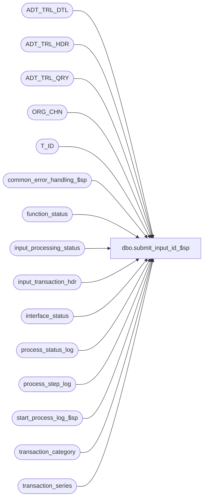

# dbo.submit_input_id_$sp

**Database:** auditworks  
**Server:** bedrockdb01  

## Architecture Diagram



## Table Dependencies

| Referenced Table |
|---|
| ADT_TRL_DTL |
| ADT_TRL_HDR |
| ADT_TRL_QRY |
| ORG_CHN |
| T_ID |
| common_error_handling_$sp |
| function_status |
| input_processing_status |
| input_transaction_hdr |
| interface_status |
| process_status_log |
| process_step_log |
| start_process_log_$sp |
| transaction_category |
| transaction_series |

## Stored Procedure Code

```sql
create proc dbo.submit_input_id_$sp   @process_id	                binary(16),
  @user_id                      int,
  @input_id			numeric(12,0), 
  @process_start_time		datetime  OUTPUT,
  @errmsg			nvarchar(255) OUTPUT
  
  
AS

/* Name: submit_input_id_$sp
   Desc: Make appropriate audit_trail and process_log entries.
     Called by rec_float_load_$sp.
   
          Possible @status values are:    
         -2 = Input ID reserved, 
         -1 = Input Table load requested, 
          0 = Input Table load in progress, 
          1 = Input data available for Edit

HISTORY:
Date     Name         Defect# Desc
Jul29,14 Vicci      TFS-79457 Avoid Error:8152 Message:String or binary data would be truncated on ADT_TRL_DTL insert when running with 
                              compatibility mode 80.  In this mode, when faced with a COALESCE of a nvarchar field with a char field and an append of the @sep, 
                              MSSQL pads the COLESCE result with trailing blanks to the max possible length of the concatenation.
Feb18,14 Vicci         149581 Fix nonsense audit-trail logging that appeared to have been cut-&-pasted in from the rec_verificiation_$sp proc at some point
                              in the past but never adjusted.
Feb28,12 Vicci         133336 Handle the fact that for imports the user_id will be null.
Jan18,12 Vicci         132439 Remove references to CRDM user-defined string datatypes from S/A since CRDM is not changing them to support unicode.
Sep05,06 Tim          DV-1342 Uplift 73485 to SA5
Mar29,05 Paul         DV-1218 insert to new audit trail
Sep15,04 IanK         DV-1146 Change user_name to user_id
Apr29,04 Maryam       DV-1071 Receive @process_id and @user_name and pass it to 
                              the common_error_handling_$sp
Jun14,06 Vicci          73485 Only be clean up function status for function completed
Aug14,03 Winnie         11627 Correctly update input_processing_status 
Jun04,03 Winnie	         9250 Media Reconciliation enhancements.	

*/

   
DECLARE
 @next_tran_no			int,
 @cashier_no			int,
 @errno				int,
 @message_id			int,
 @max_tran_no			int,
 @no_of_tran			int,
 @object_name			nvarchar(255),
 @operation_name		nvarchar(100),
 @process_name			nvarchar(100),
 @process_no			smallint,
 @process_timestamp		float,
 @register_no			smallint,
 @rows				int,
 @sep				nvarchar(1),
 @store_no			int,
 @transaction_series		nchar(1),
 @transaction_category		smallint,
 @transaction_category_desc	nvarchar(255),
 @status 			smallint,
 @file_name			nvarchar(255),
 @TBL_NAME_HDR			nvarchar(255),
 @TBL_NAME_DTL			nvarchar(255),
 @TBL_KEY_RSRC_NAME_HDR		nvarchar(255),
 @TBL_KEY_RSRC_NAME_DTL		nvarchar(255),
 @ENTRY_ID			T_ID

  SELECT @process_name = 'submit_input_id_$sp',
         @message_id = 201068,
         @status = 1,
         @sep = NCHAR(12), -- audit trail seperator
         @TBL_NAME_HDR = 'input_processing_status',
         @TBL_KEY_RSRC_NAME_HDR = 'TK_TRAN_BATC_INPU_ID_FOR_TRAN_CATE',
         @TBL_NAME_DTL = 'input_transaction_hdr',
         @TBL_KEY_RSRC_NAME_DTL = 'TK_STOR_NO_WORK_NO_BUSI_DATE_TRAN_SERI_TRAN_NO' 
  
  SELECT @process_no = process_no,
  	 @process_start_time = process_start_datetime
    FROM input_processing_status
   WHERE input_id = @input_id
     AND processing_message IS NULL --
  SELECT @errno = @@error,
         @rows = @@rowcount
  IF @errno != 0 
  BEGIN
    SELECT @errmsg = 'Failed to select from input_processing_status',
           @object_name = 'input_processing_status',
           @operation_name = 'SELECT'
    GOTO error
  END  

  IF @rows = 0
  BEGIN
    SELECT @errno = 201650, 
           @message_id = 201650,
           @errmsg = 'Invalid input_id - not found in input_processing_status',
           @process_no = ISNULL(@process_no, 73)
    GOTO error
  END

  SELECT @transaction_category = MIN(h.transaction_category)
    FROM input_transaction_hdr h
  WHERE input_id = @input_id
  SELECT @errno = @@error
  IF @errno != 0
  BEGIN
    SELECT @errmsg = 'Failed to select transaction_category from input_transaction_hdr.',
           @object_name = 'input_transaction_hdr',
           @operation_name = 'SELECT'
    GOTO error
  END 

  SELECT @transaction_category_desc = c.description + ' (' + convert(nvarchar, c.transaction_category) + ')'
    FROM transaction_category c
 WHERE c.transaction_category = @transaction_category
  SELECT @errno = @@error
  IF @errno != 0
  BEGIN
    SELECT @errmsg = 'Failed to select from transaction_category.',
           @object_name = 'transaction_category',
           @operation_name = 'SELECT'
    GOTO error
  END 

  SELECT @ENTRY_ID = NEWID()

  BEGIN TRAN

  UPDATE interface_status 
     SET last_posting_datetime = @process_start_time, 
         immediate_posting_requested = 1 
   WHERE interface_id = 29

   SELECT @errno = @@error
   IF @errno != 0 
   BEGIN
    SELECT @errmsg = 'Failed to update last_posting_datetime in interface_status ',
       @object_name = 'interface_status',
            @operation_name = 'UPDATE'
     GOTO error
   END  

  INSERT ADT_TRL_HDR (
	ENTRY_ID,
	ENTRY_DATE_TIME,
	USER_ID,
	APP_ID,
	ROOT_TBL_NAME,
	ROOT_TBL_KEY,
	ROOT_TBL_KEY_RSRC_NAME,
	ROOT_TBL_KEY_RSRC_PRMS,
	FNCTN_NUM,
	ADT_CMNT)
  SELECT
	@ENTRY_ID,
	getdate(),
	@user_id,
	300,
	@TBL_NAME_HDR,
	CONVERT(nvarchar, @input_id) + @sep + CONVERT(nvarchar, @transaction_category),
	@TBL_KEY_RSRC_NAME_HDR,
	CONVERT(nvarchar, @input_id) + @sep + @transaction_category_desc,
	@process_no,
	null
  SELECT @errno = @@error
  IF @errno <> 0
    BEGIN
      SELECT @errmsg = 'Unable to insert audit trail header.',
             @object_name = 'ADT_TRL_HDR',
             @operation_name = 'INSERT'
      GOTO error
    END

  --Note:  RTRIM required to support compatibility mode 80 which pads COALESCE of char and nvarchar with trailing blanks.
  INSERT ADT_TRL_DTL (
		ENTRY_ID,
		TBL_NAME,
		TBL_KEY,
		TBL_KEY_RSRC_NAME,
		TBL_KEY_RSRC_PRMS,
		ACTN_CODE,
		CLMN_NAME,
		OLD_VAL,
		NEW_VAL)
  SELECT @ENTRY_ID,
	 @TBL_NAME_DTL,
	 convert(nvarchar, h.store_no) + @sep + convert(nvarchar, h.register_no) + @sep + convert(nvarchar, h.entry_date_time, 106) + @sep 
	   + h.transaction_series + @sep + convert(nvarchar, h.transaction_no),
	 @TBL_KEY_RSRC_NAME_DTL,
	 SUBSTRING(COALESCE(ORG_CHN_NAME + ' (' + convert(nvarchar, h.store_no) + ')', convert(nvarchar, h.store_no)) + @sep + convert(nvarchar, h.register_no) 
	   + @sep + convert(nvarchar, h.entry_date_time, 106) + @sep + RTRIM(COALESCE(s.description + ' (' + h.transaction_series + ')', h.transaction_series)) 
	   + @sep + convert(nvarchar, h.transaction_no), 1, 255),
	'A',
	'transaction_category', -- listing transactions
	null,
	h.transaction_category
   FROM input_transaction_hdr h WITH (NOLOCK)
        LEFT OUTER JOIN ORG_CHN o WITH (NOLOCK)
          ON h.store_no = o.ORG_CHN_NUM
        LEFT OUTER JOIN transaction_series s WITH (NOLOCK)
          ON h.transaction_series = s.transaction_series
  WHERE h.input_id = @input_id
  SELECT @errno = @@error
  IF @errno <> 0
	    BEGIN
	      SELECT @errmsg = 'Unable to insert audit trail detail.',
	             @object_name = 'ADT_TRL_DTL',
	             @operation_name = 'INSERT'
	      GOTO error
	    END

  INSERT ADT_TRL_QRY (
	 ENTRY_ID,
	 QRY_KEY_NUM,
	 KEY_PART_VAL_1,
	 KEY_PART_VAL_2,
	 KEY_PART_VAL_3,
	 KEY_PART_VAL_4,
	 KEY_PART_VAL_5,
	 KEY_PART_VAL_6,
	 KEY_PART_VAL_7)
  SELECT @ENTRY_ID,
	 301,		--S/A TM
	 convert(nvarchar, h.store_no),
	 convert(nvarchar, h.register_no),
	 convert(nvarchar, h.entry_date_time, 106),
	 convert(nvarchar, h.till_no),
	 convert(nvarchar, h.transaction_no),
	 h.transaction_series,
	 convert(nvarchar, h.cashier_no)
    FROM input_transaction_hdr h WITH (NOLOCK)
   WHERE h.input_id = @input_id
  SELECT @errno = @@error
  IF @errno <> 0
    BEGIN
      SELECT @errmsg = 'Unable to insert audit trail query.',
             @object_name = 'ADT_TRL_QRY',
             @operation_name = 'INSERT'
      GOTO error
    END

  DELETE function_status 
   WHERE (user_id = @user_id 
          OR (user_id IS NULL AND @user_id IS NULL))
     AND process_id =  @process_id
     AND function_no = @process_no  --defect 73485      
  SELECT @errno = @@error
  IF @errno != 0 
  BEGIN
    SELECT @errmsg = 'Failed to delete from function_status ',
           @object_name = 'function_status',
           @operation_name = 'DELETE'
    GOTO error
  END  

  SELECT @file_name = CONVERT(nvarchar, @input_id)   
      
  EXEC start_process_log_$sp @process_no, 
                              @process_timestamp OUTPUT, 
                              @errmsg OUTPUT, 
                              1, 
                              @process_start_time, 
                              @file_name

  SELECT @errno = @@error
  IF @errno != 0
  BEGIN
    IF @errmsg IS NULL /* then */
      SELECT @errmsg = 'Failed to execute stored proc start_process_log_$sp. '
    SELECT @object_name = 'start_process_log_$sp',
           @operation_name = 'EXECUTE'
    GOTO error
  END
   
  UPDATE process_status_log
     SET expected_workload = expected_workload + 1
   WHERE process_no = @process_no
    
  SELECT @errno = @@error, @rows = @@rowcount
  IF @errno != 0
    BEGIN
      SELECT @errmsg = 'Failed to increment expected workload ',
             @object_name = 'process_status_log',
             @operation_name = 'UPDATE'
      GOTO error
    END
   
  IF @rows = 0 
    BEGIN
      INSERT INTO process_status_log (
         	  process_no, 
    		  process_start_time, 
    		  expected_workload, 
    		  completed_workload, 
    		  completed_flag,
    		  abort_requested, 
    		  transaction_qty )
          VALUES (@process_no,
                  @process_start_time,
                  1,
                  0,
                  0,
                  0,
                  0)
      SELECT @errno = @@error
      IF @errno != 0
        BEGIN
          SELECT @errmsg = 'Failed to insert 1st entry in process_status_log for current process_no ',
                 @object_name = 'process_status_log',
                 @operation_name = 'INSERT'
          GOTO error
        END        
    END -- if new entry in process_status_log
  ELSE
    BEGIN
      UPDATE process_status_log
         SET completed_flag = 0,
             process_start_time = @process_start_time                       
       WHERE process_no = @process_no
         AND completed_flag = 1
    
      SELECT @errno = @@error
      IF @errno != 0
      BEGIN
        SELECT @errmsg = 'Failed to set completed_flag and process_start_time ',
               @object_name = 'process_status_log',
               @operation_name = 'UPDATE'
        GOTO error
      END
    END -- existing entry
  
  INSERT INTO process_step_log (
     	      process_no, 
  	      stream_no,
  	      process_step_no,
  	      process_step_start_time,
  	      expected_workload, 
  	      completed_workload )
      VALUES (@process_no,
              @input_id,
              0,
              @process_start_time,
              1,
              0)  

  SELECT @errno = @@error
  IF @errno != 0
    BEGIN
      SELECT @errmsg = 'Failed to insert entry for current process_no/input_id ',
             @object_name = 'process_step_log',
             @operation_name = 'INSERT'
      GOTO error
    END        

  UPDATE input_processing_status
     SET status = @status
   WHERE input_id = @input_id
     AND status != @status

   SELECT @errno = @@error
   IF @errno != 0
   BEGIN
     IF @errmsg IS NULL /* then */
       SELECT @errmsg = 'Failed to update status from input_processing_status '
     SELECT @object_name = 'input_processing_status',
            @operation_name = 'UPDATE'
     GOTO error
   END
 COMMIT  

RETURN

error:

	EXEC common_error_handling_$sp @process_no, @errno, @errmsg, 0, @message_id, 
	@process_name, @object_name, @operation_name, 0, 1, 0, null, 0, null, null, 
	null, null, null, null, 0, @process_id, @user_id

	RETURN
```

