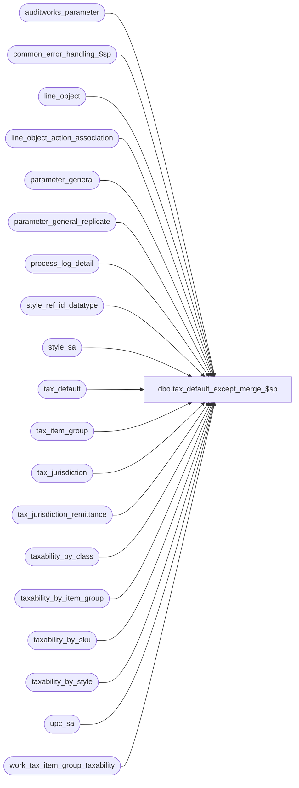

# dbo.tax_default_except_merge_$sp

**Database:** auditworks  
**Server:** bedrockdb01  

## Architecture Diagram



## Table Dependencies

| Referenced Table |
|---|
| auditworks_parameter |
| common_error_handling_$sp |
| line_object |
| line_object_action_association |
| parameter_general |
| parameter_general_replicate |
| process_log_detail |
| style_ref_id_datatype |
| style_sa |
| tax_default |
| tax_item_group |
| tax_jurisdiction |
| tax_jurisdiction_remittance |
| taxability_by_class |
| taxability_by_item_group |
| taxability_by_sku |
| taxability_by_style |
| upc_sa |
| work_tax_item_group_taxability |

## Stored Procedure Code

```sql
create proc dbo.tax_default_except_merge_$sp ( @errmsg	nvarchar(255) OUTPUT,
  @merge_type 	smallint = 3, 	-- -1:  if rebuild is required, merge tax default, taxability by item group including historical entries and save results under process_id -1.
  				--  0:  merge tax default, taxability by item group (only including history if called by UI, i.e. if @init_work_tb <>0;
  				--  1:  merge tax default and taxability by item group, class;
				--  2:  merge tax default, taxability by item group, class and style;
				--  3:  merge tax default, taxability by item group, class, style and sku;
				-- set to 0 when called directly by PB/old-CRDM or export_coal_taxruleassign_$sp, 
				--       -1 when called by sales_tax_calc_$sp, mass_auto_revalidate_$sp and tax_dflt_except_merge_ui_$sp, 
				--        3 when called by tax_item_group_generation_$sp
  @process_id   int = null,  --do not change datatype:  set to spid when called directly by PB/CRDM or by export_coal_taxruleassign_$sp
  @init_work_tb tinyint = 0, --set to 1 when called by PB/CRDM and sale-tax-calc
  @source_process nvarchar(100) = null)  --TM 

AS


/* PROC NAME:   tax_default_except_merge_$sp
**
** DESCRIPTION: Called by tax_item_group_generation_$sp, tax_dflt_except_merge_ui_$sp, export_coal_taxruleassign_$sp, mass_auto_revalidate_$sp and sales_tax_calc_$sp.
** 		Merges tax_default and taxability_by_class, style, sku, item-group information.
**              Assumes contiguous tax-default entries, but supports taxability_by_class, 
** 		style, sku, item-group entries being non-contiguous.
**		Produces #class_taxability, #style_taxability, #sku_taxability for exception class/style/sku only (but lists rates codes for all jurisdiction/levels for these class/style/sku, considering both exceptions and defaults)
**		Produces work_tax_item_group_taxability for both exception and default item-groups
**		Auto-corrects integrities in tax-item-group / line-object cross-references.
**		Entries in work_tax_item_group_taxability with a process_id of -1 are the semi-permanent entries saved
**              to avoid rebuilding unless parameter_general_replicate.last_item_grp_taxability_mod indicates this is required.
**    REFERENCE temp tables created by calling procedure
**		declare @errmsg nvarchar(255), @merge_type tinyint, @process_id int, @init_work_tb tinyint
**		select @merge_type = 1, @process_id = @@spid, @init_work_tb = 1
**		exec tax_default_except_merge_$sp @errmsg, @merge_type, @process_id, @init_work_tb
**		select * from #class_taxability
**	  NOTES This is a process must run following any tax master change affecting a tax item group's taxability to explode the tax item-group identification information stored by line-object, class, style and sku in combination with the taxability information stored at those same levels and at tax-item-group level as well into taxability information by tax item group id, tax jurisdiction, tax level, effective date.  
		1) It is an unavoidably lengthy process since each tax item group for each tax jurisdiction must be evaluated one at a time (given that each default/exception taxability definition may have overlapping and intersecting effective-date ranges), but once a retailer has completed their first tax import, subsequent delta files should rarely involve changes to a tax item group's taxability given that the list of tax-jurisdictions in which a customer operates and the types of merchandise they sell should be reasonably static.  Normally "delta" files would be expected to only include tax-rate changes, and these do no impact a tax-item-group's taxability.  You would have to take a look at what type of information they included in their delta files to analyze whether or not taxability changes were actually required in their scenario.
		2) The length of time taken to do this processing is dependent on the number of stores a retailer has and how many different types of merchandise they sell from a taxability perspective.  By "from a taxability perspective" what I mean is that a simple clothing retailer would be expected to have about 3 tax-item groups, whereas a department store might have 100. I do not know Tumi so I can't comment on their particular case, but a typical retailer with about 500 stores and selling a variety of merchandise extending beyond just clothing would be expected to end up with about 200,000 rows, whereas services has indicated that some Vertex retailers have about 5 million, which would imply that either they have thousands of stores or that their tax configuration is misdefined.  By "misdefined" I mean that either their tax jurisdictions do not represent the distinct tax-authorities for a locations in which they have a place of business, or their tax-item-groups do not represent the list of types of merchandise subject to distinct tax laws which they sell.
		3) Retailers on who do not yet have fixes such as defect 145144 that avoids the merge being run by both manual transaction functions and the edit simultaneously might benefit from upgrading, but it may not buy them much:  this can be determined by looking at the trace information for the process in the process_log_detail table.  This process log detail may provide other clues that could be informative.
		4) It is unlikely that the processing itself could be made much speedier given the "single row processing" constraint faced, but enhancements to limit the number of jurisdictions and/or tax-item-groups re-examined by the process to those impacted by the configuration changes made might be possible.  Whether or not this would provide improvement depends on the nature of the configuration changes, so this would have to be analyzed first.
**
**
** PROGRESS MONITORING:
	SELECT d.process_id, SUM(d.work_done) work_done, SUM(e.work_estimate) work_estimate, 100.00 * SUM(d.work_done) / SUM(e.work_estimate) percent_complete
	FROM ( SELECT COUNT(1) work_estimate
	         FROM taxability_by_item_group  WITH (NOLOCK)
	        UNION ALL
	       SELECT COUNT(1) work_estimate
	         FROM tax_default  WITH (NOLOCK) )e
	      LEFT OUTER JOIN (SELECT process_id, COUNT(1) work_done
	                         FROM work_tax_item_group_taxability WITH (NOLOCK)
	                        GROUP BY process_id ) d
	       ON 1=1
	GROUP BY d.process_id
**

HISTORY:
Date     Name         Def#  Desc
Jun17,14 Vicci   TFS-75199  If called by Coalition export, 
                            a) don't execute the merge if the entries for process_id -1 are already up to date, instead just
                               copy the effective ones over.
                            b) if the edit execution of the rebuild has been disabled, then do a merge_type -1 (including history) instead of
                               a merge_type 0 then draw the effective work table entries from there, since a merge_type -1 will eventually have
                               to run and this avoids the duplication of effort.
Feb07,14 Vicci      149810  Exclude inactive jurisdictions.
Jul10,13 Vicci      145144  To avoid timeouts, if called by PB/CRDM and the 'disable_manual_tax_merge' parameter is on, don't run, just copy the -1 rows
                            into the current spid.  Going forward (CRDM version associated with S/A UI version 5.1.000.018), CRDM will be calling 
                            tax_dflt_except_merge_ui_$sp instead.
Feb15,13 Vicci      141812  Check whether it needs to run or not BEFORE creating temp tables, cleaning up dead processes, etc.
                            Only clean up work-table entries for dead processes that are more than 1 day old.
                            Also clean up work-table entries for any processes (other than -1) that are more than 5 days old.
Jan07,13 Vicci      140866  Added trace logging to process_log_detail.
Oct05,12 Vicci      138821  Handle scenario where taxability_by_item_group exception exists which is effective for only 1 date (from=until) and that
                            effective_from_date is the same as that in tax_default, by doing @prior_effective_until_date >= @effective_from_date
                            instead of @prior_effective_until_date > @effective_from_date when deciding to bump up the effective-from-date of the row being
                            evaluated to the prior row's effective-until + 1.
Sep04,12 Vicci      138076  Clean up temporary entries under current spid after copying them into process_id -1 in the case of merge-type -1.
Nov16,11 Paul       131244  change datatype of @merge_type to smallint to avoid error when value is negative, corrected error traps,
				use fast_forward hints
Oct17,11 Vicci      130464  Handle merge_type = -1 by saving a copy of the derived tax item group taxability under process_id -1 to avoid its being rebuilt unless necessary.
Aug29,11 Vicci      129426  If merge-type = 0 and @init_work_tb 0 (called by export_coal_taxruleassign_$sp) don't bother doing expired assignments.
Feb28,11 Vicci      125199  Handle possibility of tax-exception having been defined for gift cards/certificates.
Feb25,11 Vicci       73212  Re-apply 70648/73212 lost when 104042 was submitted.
Aug15,08 Paul       104042  make join compatible with SQL 2005
Sep14,06 David Ch    70648  Uplift 73212 Handle gift certificates
Jan09,06 Vicci	   68918  Author
*/

DECLARE
	@errno		        	int,
	@function_no			tinyint,
	@message_id			int,
	@object_name			nvarchar(255),
	@operation_name			nvarchar(100),
	@process_name			nvarchar(100),
	@cursor_open			tinyint,
	@today				datetime,
	@last_item_grp_taxability_mod 	datetime,
	@now				datetime,
	@rows				int,  
	@line_object			 smallint,
	@source_code			 nvarchar(10),
	@class_code			 int,
	@style_reference_id		 style_ref_id_datatype,
	@sku_id				 numeric(14,0),
	@tax_item_group_id		 numeric(10,0),
        @upc_lookup_division		 tinyint,
        @tax_jurisdiction		 nchar(5),
        @tax_level			 tinyint,
        @effective_from_date		 smalldatetime,
        @effective_until_date		 smalldatetime,
        @tax_rate_code			 tinyint,
        @par_value			 nvarchar(4),
        @prior_class_code		 int,
	@prior_style_reference_id	 style_ref_id_datatype,
	@prior_sku_id			 numeric(14,0),
	@prior_tax_item_group_id	 numeric(10,0),	
	@prior_upc_lookup_division	 tinyint,
        @prior_tax_jurisdiction		 nchar(5),
        @prior_tax_level		 tinyint,
        @prior_effective_from_date	 smalldatetime,
        @prior_effective_until_date	 smalldatetime,
        @prior_tax_rate_code		 tinyint,
        @prior_source_code		 nvarchar(10),
        @include_history		 tinyint

SELECT @process_id = ISNULL(@process_id, @@spid), 
       @process_name = 'tax_default_except_merge_$sp',
       @function_no = 209,
       @cursor_open = 0,
       @message_id = 201068,
       @today = CONVERT(datetime, CONVERT(nvarchar, getdate(), 101)),
       @now = getdate(),
	@prior_class_code = 0,
	@prior_style_reference_id = 0,
	@prior_sku_id= 0,
	@prior_tax_item_group_id = 0,
	@prior_upc_lookup_division = 0,
	@prior_tax_jurisdiction = '-----',
	@prior_tax_level = 0,
	@prior_effective_from_date = null,
	@prior_effective_until_date = null,	
	@prior_tax_rate_code = 0,
	@prior_source_code = null

IF @source_process IS NULL AND @merge_type = 0 
BEGIN
  IF @init_work_tb = 1
    SELECT @source_process = 'TM'
  ELSE
    SELECT @source_process = 'EXPORT'
END
    
IF @source_process = 'EXPORT'
BEGIN
  SELECT @include_history = 1,  --this is a change from old behaviour so that the merge results can be shared.  The history will be removed from the work table under the current process_id before returning
         @merge_type = -1
END
ELSE
BEGIN
  SELECT @include_history = 1
END

IF @merge_type = -1 OR (@source_process = 'TM' AND @merge_type = 0)
BEGIN 
  SELECT @last_item_grp_taxability_mod = last_item_grp_taxability_mod
FROM parameter_general_replicate
  SELECT @errno = @@error, @rows = @@rowcount
  IF @errno != 0
  BEGIN
    SELECT @errmsg = 'Failed to determine the last time the tax item group taxability was impacted by tax TM',
           @object_name = 'parameter_general_replicate',
  	   @operation_name = 'SELECT'
    GOTO error
  END

  IF @last_item_grp_taxability_mod IS NULL
  BEGIN
    IF @rows = 0
    BEGIN
      INSERT INTO parameter_general_replicate(
             activity_minute_interval,
             ap_bank_code,
             ap_company_no,
             archive_days_retained,
             audit_trail_days,
             auto_upc_correction,
             calculate_employee_discount,
             check_after_midnight_trans,
             concurrent_dayend_processes,
             concurrent_edit_processes,
             current_day_autoaccept_time,
             date_format_string,
             dayend_batch_store_dates,
             dayend_delayed_days,
             default_gl_company_no,
             dummy_upc_no,
             earliest_live_date,
             employee_no_length_adj,
             employee_purchase_days,
             extended_archive_days_retained,
             flash_budget_detail,
             gl_account_segment_qty,
             glc_as_of_period_qty,
             glc_export_used,
             glc_postable_used,
             ignore_missing_registers,
             journal_entry_description,
             max_transaction_no,
             media_category_statistics_days,
             media_reconciliation_days,
             min_edit_batch_size,
             min_transaction_date,
             object_action_lookup_flag,
             polling_retention_days,
             prev_day_cutoff_time,
             process_log_days,
             register_activity_am_pm,
             register_activity_days,
             register_activity_exclude_zero,
             register_activity_user_amounts,
             retain_class_code,
             sa_company_name,
             sa_company_no,
             set_employee_no_from_account,
             sku_lookup_method,
             sos_cash_days,
             sos_credit_days,
             store_performance_days,
             sts_internal_1,
             sts_internal_2,
             subledger_detail_periods,
             subledger_periods,
             sv_exception_line_view_id,
             sv_exception_merch_view_id,
             sv_exception_trans_view_id,
             tax_days,
             tax_override_lookup,
             tax_periods,
             transaction_no_length,
             transaction_zero_flag,
             trickle_polling_flag,
             upc_lookup_source,
             update_smartload,
             verify_attachments,
             if_lookup_rebuild_flag,
             if_lookup_rebuild_request,
             media_rec_rebuild_request,
             last_item_grp_taxability_mod)
      SELECT activity_minute_interval,
             ap_bank_code,
             ap_company_no,
             archive_days_retained,
             audit_trail_days,
             auto_upc_correction,
             calculate_employee_discount,
             check_after_midnight_trans,
             concurrent_dayend_processes,
             concurrent_edit_processes,
             current_day_autoaccept_time,
             date_format_string,
             dayend_batch_store_dates,
             dayend_delayed_days,
             default_gl_company_no,
             dummy_upc_no,
             earliest_live_date,
             employee_no_length_adj,
             employee_purchase_days,
             extended_archive_days_retained,
             flash_budget_detail,
             gl_account_segment_qty,
             glc_as_of_period_qty,
             glc_export_used,
             glc_postable_used,
             ignore_missing_registers,
             journal_entry_description,
             max_transaction_no,
 media_category_statistics_days,
             media_reconciliation_days,
             min_edit_batch_size,
             min_transaction_date,
             object_action_lookup_flag,
             polling_retention_days,
             prev_day_cutoff_time,
             process_log_days,
             register_activity_am_pm,
             register_activity_days,
             register_activity_exclude_zero,
             register_activity_user_amounts,
             retain_class_code,
             sa_company_name,
             sa_company_no,
             set_employee_no_from_account,
             sku_lookup_method,
             sos_cash_days,
             sos_credit_days,
             store_performance_days,
             sts_internal_1,
             sts_internal_2,
             subledger_detail_periods,
             subledger_periods,
             sv_exception_line_view_id,
             sv_exception_merch_view_id,
             sv_exception_trans_view_id,
             tax_days,
             tax_override_lookup,
             tax_periods,
             transaction_no_length,
             transaction_zero_flag,
             trickle_polling_flag,
             upc_lookup_source,
             update_smartload,
             verify_attachments,
             if_lookup_rebuild_flag,
             getdate(),
             getdate(),
             getdate()
        FROM parameter_general
       WHERE NOT EXISTS (SELECT 1 FROM parameter_general_replicate)
      SELECT @errno = @@error
      IF @errno != 0
      BEGIN
        SELECT @errmsg = 'Failed to create a system flag allowing the last time the tax item group taxability was impacted by tax TM to be determined',
               @object_name = 'parameter_general_replicate',
  	       @operation_name = 'INSERT'
        GOTO error
      END
    END  --IF @rows = 0 i.e. no system flag existed

    UPDATE parameter_general_replicate
       SET last_item_grp_taxability_mod = @now
     WHERE last_item_grp_taxability_mod IS NULL
    SELECT @errno = @@error
    IF @errno != 0     
    BEGIN
      SELECT @errmsg = 'If the last time the tax item group taxability was impacted by tax TM is not known, then assume it has just been modified',
             @object_name = 'parameter_general_replicate',
  	     @operation_name = 'UPDATE'
      GOTO error
    END

    SELECT @last_item_grp_taxability_mod = last_item_grp_taxability_mod
      FROM parameter_general_replicate
    SELECT @errno = @@error
    IF @errno != 0
    BEGIN
      SELECT @errmsg = 'Failed to re-determine the last time the tax item group taxability was impacted by tax TM',
             @object_name = 'parameter_general_replicate',
  	     @operation_name = 'SELECT'
      GOTO error
    END
  END  --IF @last_item_grp_taxability_mod IS NULL
END --IF @merge_type = -1 OR (@source_process = 'TM' AND @merge_type = 0)

IF COALESCE(@source_process, '?') <> 'EXPORT' AND @merge_type = -1  AND (SELECT MIN(posting_datetime) FROM work_tax_item_group_taxability WHERE process_id = -1) >= @last_item_grp_taxability_mod
BEGIN
  RETURN  --no rebuild required and no export waiting for data
END

INSERT into process_log_detail(         
       process_no, 
       process_name, 
       process_info_type, 
       process_info_number,
       process_info_string) 
VALUES(@function_no, 
       @process_name, 
       db_name() + '@merge_type', 
       @merge_type,
       '@process_id:  ' + convert(nvarchar, @process_id) + ', @init_work_tb:  ' + convert(nvarchar, @init_work_tb) + ', @source_process:  ' + COALESCE(@source_process, '') ) 
SELECT @errno = @@error
IF @errno <> 0
BEGIN
  SELECT @errmsg = 'Unable to log input parameter for call to merge',
         @object_name = 'process_log_detail',
         @operation_name = 'INSERT'      
  GOTO error
END

DELETE work_tax_item_group_taxability
 WHERE process_id = @process_id
SELECT @errno = @@error
IF @errno <> 0
BEGIN
  SELECT @errmsg = 'Failed to clean work-table',
         @object_name = 'work_tax_item_group_taxability',
         @operation_name = 'DELETE'
  GOTO error
END

IF (  @source_process = 'TM' AND @merge_type = 0 --i.e. called by PB/old-CRDM
      AND (   EXISTS (SELECT *
                        FROM auditworks_parameter
                       WHERE par_name = 'disable_manual_tax_merge'  --i.e. disabled
                         AND par_value = '1')
           OR
              (SELECT MIN(posting_datetime) FROM work_tax_item_group_taxability WHERE process_id = -1) >= @last_item_grp_taxability_mod  --i.e. no new changes
          )
   )
   OR
   (  @source_process = 'EXPORT'  --i.e. called by coalition export
      AND (SELECT MIN(posting_datetime) FROM work_tax_item_group_taxability WHERE process_id = -1) >= @last_item_grp_taxability_mod  --i.e. no new changes
   )
   
BEGIN
  INSERT into work_tax_item_group_taxability(
         process_id,
         tax_item_group_id,
         tax_jurisdiction,
         tax_level,
         effective_from_date,
         effective_until_date,
         tax_rate_code,
         source_code,
         posting_datetime)
  SELECT @process_id,
         tax_item_group_id,
         tax_jurisdiction,
         tax_level,
         effective_from_date,
         effective_until_date,
         tax_rate_code,
         source_code,
         @now
    FROM work_tax_item_group_taxability
   WHERE process_id = -1
     AND (   @source_process = 'TM'
          OR effective_until_date IS NULL
          OR effective_until_date >= @today )         
  SELECT @errno = @@error, @rows = @@rowcount
  IF @errno != 0
  BEGIN
    SELECT @errmsg = 'Failed to make a copy of the semi-permanent entries under the spid passed in by the UI',
           @object_name = 'work_tax_item_group_taxability',
           @operation_name = 'INSERT'
    GOTO error
  END

  INSERT into process_log_detail(         
       process_no, 
       process_name, 
       process_info_type, 
       process_info_number,
       process_info_string) 
  VALUES(@function_no, 
       @process_name, 
       db_name() + ' Merge skipped. Prior merge results copied to current spid instead.', 
       @rows,
       '@process_id:  ' + convert(nvarchar, @process_id) + ', @init_work_tb:  ' + convert(nvarchar, @init_work_tb))
  SELECT @errno = @@error 
  IF @errno <> 0
  BEGIN
    SELECT @errmsg = 'Unable to log merge completion',
           @object_name = 'process_log_detail',
           @operation_name = 'INSERT'      
    GOTO error
  END
  
  RETURN
END

-- creating temp tables first to minimize recompilation
IF @init_work_tb = 1
BEGIN
  CREATE TABLE #tax_item_group(
  	 tax_item_group_id	      numeric(10,0) not null, 
	 line_object		      smallint null, 
	 exception_flag		      tinyint not null)
  SELECT @errno = @@error
  IF @errno != 0
  BEGIN
    SELECT @errmsg = 'Failed to create temp table from merge proc to receive list of tax-item-group and whether or not they are associated with exceptions',
           @object_name = '#tax_item_group',
           @operation_name = 'CREATE'
    GOTO error
  END
END --IF @init_work_tb = 1

CREATE TABLE #work_class_taxability(
source_code		      nvarchar(10),
class_code                    int not null,
upc_lookup_division           tinyint not null,
tax_jurisdiction              nchar(5) not null,
tax_level                     tinyint not null,
effective_from_date           smalldatetime not null,
effective_until_date          smalldatetime null,
tax_rate_code                 tinyint not null)

CREATE TABLE #work_sku_taxability(
source_code		      nvarchar(10),
sku_id            	      numeric(14,0) not null,
upc_lookup_division           tinyint not null,
tax_jurisdiction              nchar(5) not null,
tax_level                     tinyint not null,
effective_from_date           smalldatetime not null,
effective_until_date          smalldatetime null,
tax_rate_code                 tinyint not null)

CREATE TABLE #work_item_group_taxability(
source_code		      nvarchar(10),
tax_item_group_id             numeric(10,0) not null,
tax_jurisdiction              nchar(5) not null,
tax_level                     tinyint not null,
effective_from_date           smalldatetime not null,
effective_until_date          smalldatetime null,
tax_rate_code                 tinyint not null)

SELECT CONVERT(nvarchar(10), NULL) as source_code, style_reference_id, upc_lookup_division, 
       tax_jurisdiction, tax_level, effective_from_date, effective_until_date, tax_rate_code 
  INTO #work_style_taxability
  FROM taxability_by_style
 WHERE style_reference_id = -9999  --to handle style_ref_id_datatype

INSERT into process_log_detail(         
       process_no, 
       process_name, 
       process_info_type, 
       process_info_number,
       process_info_string )
SELECT @function_no, 
       @process_name, 
       db_name() + ' work_tax_item_group_taxability cleanup count for dead processes', 
       count(1),
       'for process_id:  ' + convert(nvarchar, process_id)
  FROM work_tax_item_group_taxability
 WHERE process_id > 0
   AND (posting_datetime IS NULL OR posting_datetime < dateadd(dd, -1, @now))  --Note:  this should not be required but has been added because of SR: 1-258956271 mystery with process considered dead when it wasn't.
   AND (   posting_datetime < dateadd(dd, -5, @now)
        OR process_id NOT IN (SELECT spid
                             FROM master.dbo.sysprocesses
	 		   WHERE db_name(dbid) = db_name()))
 GROUP BY process_id
SELECT @errno = @@error
IF @errno <> 0
BEGIN
  SELECT @errmsg = 'Unable to log number of rows for dead processes cleaned up by the merge',
         @object_name = 'process_log_detail',
         @operation_name = 'INSERT'      
  GOTO error
END

DELETE work_tax_item_group_taxability
 WHERE process_id > 0
   AND (posting_datetime IS NULL OR posting_datetime < dateadd(dd, -1, @now))  --Note:  this should not be required but has been added because of SR: 1-258956271 mystery with process considered dead when it wasn't.
   AND (   posting_datetime < dateadd(dd, -5, @now)
        OR process_id NOT IN (SELECT spid
                             FROM master.dbo.sysprocesses
	 		   WHERE db_name(dbid) = db_name()))
SELECT @errno = @@error
IF @errno <> 0
BEGIN
  SELECT @errmsg = 'Failed to clean up other left-behind-following-abort work-table entries',
         @object_name = 'work_tax_item_group_taxability',
         @operation_name = 'DELETE'
  GOTO error
END

UPDATE line_object
   SET tax_item_group_id = NULL
 WHERE tax_item_group_id IS NOT NULL
   AND tax_item_group_id NOT IN (SELECT tax_item_group_id
                                   FROM tax_item_group)
SELECT @errno = @@error
IF @errno != 0
BEGIN
  SELECT @errmsg = 'Failed to repair line-object / tax-item-group assignment integrities',
         @object_name = 'line_object',
         @operation_name = 'UPDATE'
  GOTO error
END

UPDATE tax_item_group
   SET line_object = NULL
 WHERE line_object IS NOT NULL
   AND line_object NOT IN (SELECT line_object
                             FROM line_object)
SELECT @errno = @@error
IF @errno != 0
BEGIN
  SELECT @errmsg = 'Failed to repair tax-item-group / line-object assignment integrities',
         @object_name = 'tax_item_group',
         @operation_name = 'UPDATE'
  GOTO error
END

UPDATE line_object
   SET tax_item_group_id = NULL
  FROM tax_item_group t
 WHERE line_object.tax_item_group_id = t.tax_item_group_id
   AND t.line_object IS NOT NULL
   AND t.line_object <> line_object.line_object
SELECT @errno = @@error
IF @errno != 0
BEGIN
  SELECT @errmsg = 'Failed to remove conflicting line-object / tax-item-group assignments',
         @object_name = 'line_object',
         @operation_name = 'UPDATE'
 GOTO error
END

SELECT @par_value = substring(par_value, 1, 4)
  FROM auditworks_parameter p
 WHERE p.par_name = 'tax_item_group_auto_gen_object'

IF ISNUMERIC(@par_value) = 1 
  SELECT @line_object = convert(smallint, @par_value)
  
IF NOT EXISTS (SELECT 1 
                 FROM line_object o
            WHERE o.line_object = @line_object
                  AND o.line_object_type = 1)
BEGIN
  SELECT @line_object = NULL
END

IF @line_object IS NULL
BEGIN
	SELECT @line_object = MIN(x.line_object)
	  FROM line_object_action_association x, line_object o
	 WHERE x.line_object_type = 1
	   AND x.line_action = 1
	   AND x.active_flag <> 0
	   AND x.line_object = o.line_object
	   AND o.tax_item_group_id IS NOT NULL
	SELECT @errno = @@error
	IF @errno != 0
	BEGIN
	  SELECT @errmsg = 'Failed to determine which merchandise line-object to use as default based on its association with a tax-item-group and a sold action',
	         @object_name = 'line_object_action_association',
	         @operation_name = 'SELECT'
	  GOTO error
	END
END

IF @line_object IS NULL
BEGIN
	SELECT @line_object = MIN(line_object)
	  FROM line_object_action_association
	 WHERE line_object_type = 1
	   AND line_action = 1
	   AND active_flag <> 0
	SELECT @errno = @@error
	IF @errno != 0
	BEGIN
	  SELECT @errmsg = 'Failed to determine which merchandise line-object to use as default based on its association with a sold action',
	         @object_name = 'line_object_action_association',
	   @operation_name = 'SELECT'
	  GOTO error
	END
END

IF @line_object IS NULL
BEGIN
	SELECT @line_object = MIN(line_object)
	  FROM line_object
	 WHERE line_object_type = 1
	   AND active_flag <> 0
	SELECT @errno = @@error
	IF @errno != 0
	BEGIN
	  SELECT @errmsg = 'Failed to determine which merchandise line-object to use as default',
	         @object_name = 'line_object_action_association',
	         @operation_name = 'SELECT'
	  GOTO error
	END
END

IF @line_object IS NULL
BEGIN
  SELECT @errno = 202513,
         @errmsg = 'No merchandise line object has been defined.  Default taxability cannot be determined',
         @object_name = 'line_object',
         @operation_name = 'SELECT'
  GOTO error
END

/*  ***********************************  TAX ITEM GROUP merge ********************************* */

SELECT @prior_tax_item_group_id = 0,
	 @prior_tax_jurisdiction = '-----',
	 @prior_tax_level = 0,
	 @prior_effective_from_date = null,
	 @prior_effective_until_date = null,	
	 @prior_tax_rate_code = 0,
	 @prior_source_code = null


INSERT INTO #tax_item_group(tax_item_group_id, line_object, exception_flag)
SELECT t.tax_item_group_id, o.line_object, 0 
  FROM tax_item_group t
  LEFT JOIN line_object o ON (t.line_object = o.line_object)

SELECT @errno = @@error
IF @errno != 0
BEGIN
  SELECT @errmsg = 'Failed to build a list of item-groups and the line-object which provides their default',
         @object_name = '#tax_item_group',
         @operation_name = 'INSERT'
  GOTO error
END

UPDATE #tax_item_group
   SET exception_flag = 1
 WHERE tax_item_group_id IN (SELECT x.tax_item_group_id
                               FROM taxability_by_item_group x, tax_jurisdiction j
                              WHERE (@include_history = 1 OR x.effective_until_date IS NULL OR x.effective_until_date >= @today)
                                AND x.tax_jurisdiction = j.tax_jurisdiction
                                AND j.active_flag = 1)
SELECT @errno = @@error
IF @errno != 0
BEGIN
  SELECT @errmsg = 'Failed set exception_flag (sold)',
         @object_name = '#tax_item_group',
         @operation_name = 'UPDATE'
  GOTO error
END

UPDATE #tax_item_group
   SET line_object = (SELECT MIN(o.line_object)
                        FROM line_object o, line_object_action_association x
                        WHERE o.line_object = x.line_object
                          AND x.line_action = 1
                          AND #tax_item_group.tax_item_group_id = o.tax_item_group_id)
 WHERE #tax_item_group.line_object IS NULL

SELECT @errno = @@error
IF @errno != 0
BEGIN
  SELECT @errmsg = 'Failed determine which line-objects associated with an action of sold will provide the default taxability for each item-group',
         @object_name = '#tax_item_group',
         @operation_name = 'UPDATE'
  GOTO error
END

UPDATE #tax_item_group
   SET line_object = (SELECT MIN(o.line_object)
                        FROM line_object o
                        WHERE #tax_item_group.tax_item_group_id = o.tax_item_group_id)
 WHERE line_object IS NULL

SELECT @errno = @@error
IF @errno != 0
BEGIN
  SELECT @errmsg = 'Failed determine which line-objects will provide the default taxability for each item-group',
         @object_name = '#tax_item_group',
         @operation_name = 'UPDATE'
  GOTO error
END

UPDATE #tax_item_group
   SET line_object = @line_object
 WHERE line_object IS NULL
SELECT @errno = @@error
IF @errno != 0
BEGIN
  SELECT @errmsg = 'Failed to set the default line-object provide the default taxability for each item-group',
         @object_name = '#tax_item_group',
         @operation_name = 'UPDATE'
  GOTO error
END

INSERT INTO #work_item_group_taxability(source_code, --E=exception, F=default
				   tax_item_group_id,
			           tax_jurisdiction,
			           tax_level,
			           effective_from_date,
	                           effective_until_date,
			           tax_rate_code)
SELECT 'F',
       g.tax_item_group_id,
       d.tax_jurisdiction,
       d.tax_level,
       d.effective_from_date,
       d.effective_until_date,
       d.tax_rate_code
  FROM tax_jurisdiction j, tax_default d, #tax_item_group g
 WHERE j.tax_jurisdiction = d.tax_jurisdiction
   AND j.active_flag = 1
   AND d.line_object = g.line_object
   AND g.exception_flag = 1
   AND (@include_history = 1 OR d.effective_until_date IS NULL OR d.effective_until_date >= @today)
UNION
SELECT 'F', 
       g.tax_item_group_id,
       d.tax_jurisdiction,
       d.tax_level,
       '01/01/1970',
       null,
       0 --tax_rate_code
  FROM tax_jurisdiction j, #tax_item_group g, tax_jurisdiction_remittance d, line_object o
 WHERE j.tax_jurisdiction = d.tax_jurisdiction
   AND j.active_flag = 1
   AND g.exception_flag = 1
   AND g.line_object = o.line_object
   AND o.line_object_type = 4   
SELECT @errno = @@error
IF @errno != 0
BEGIN
  SELECT @errmsg = 'Failed to build a list of the default taxability of item-groups for which tax-exceptions exist',
         @object_name = '#work_item_group_taxability',
         @operation_name = 'INSERT'
  GOTO error
END

INSERT INTO #work_item_group_taxability(source_code, --F=default, E=exception
				   tax_item_group_id,
			           tax_jurisdiction,
			           tax_level,
			           effective_from_date,
	                           effective_until_date,
			           tax_rate_code)
SELECT 'E',
       x.tax_item_group_id,
       x.tax_jurisdiction,
       x.tax_level,
       x.effective_from_date,
       x.effective_until_date,
       x.tax_rate_code
  FROM tax_jurisdiction j, taxability_by_item_group x
 WHERE j.tax_jurisdiction = x.tax_jurisdiction
   AND j.active_flag = 1
   AND (@include_history = 1 OR x.effective_until_date IS NULL OR x.effective_until_date >= @today)
SELECT @errno = @@error
IF @errno != 0
BEGIN
  SELECT @errmsg = 'Failed to build a list of the taxability exceptions for item-groups for which tax-exceptions exist',
         @object_name = '#work_item_group_taxability',
         @operation_name = 'INSERT'
  GOTO error
END


DECLARE item_group_tax_processing_cursor CURSOR FAST_FORWARD
 FOR
SELECT source_code, 
       tax_item_group_id,
       tax_jurisdiction,
       tax_level,
       effective_from_date,
       effective_until_date,
       tax_rate_code
  FROM #work_item_group_taxability
 ORDER BY   tax_item_group_id, tax_jurisdiction, tax_level, effective_from_date, source_code 
SELECT @errno = @@error
IF @errno != 0
BEGIN
  SELECT @errmsg = 'Failed to declare item_group taxability cursor',
         @object_name = '#work_item_group_taxability',
         @operation_name = 'SELECT'
  GOTO error
END

OPEN item_group_tax_processing_cursor
SELECT @cursor_open = 10

 FETCH item_group_tax_processing_cursor
  INTO @source_code, 
       @tax_item_group_id,
       @tax_jurisdiction,
       @tax_level,
       @effective_from_date,
       @effective_until_date,
       @tax_rate_code

SELECT @errno = @@error
IF @errno != 0
BEGIN
  SELECT @errmsg = 'Failed to fetch item_group taxability cursor',
         @object_name = 'item_group_tax_processing_cursor',
         @operation_name = 'FETCH'
  GOTO error
END

 WHILE @@fetch_status = 0 
 BEGIN
   IF @prior_effective_from_date IS NOT NULL
   BEGIN
     IF @prior_tax_item_group_id <> @tax_item_group_id 
        OR @prior_tax_jurisdiction <> @tax_jurisdiction
        OR @prior_tax_level <> @tax_level
     BEGIN
       INSERT INTO work_tax_item_group_taxability(process_id, 
              tax_item_group_id,
	      tax_jurisdiction,
	      tax_level,
	      effective_from_date,
	      effective_until_date,
	      tax_rate_code,
	      source_code,
	      posting_datetime)
       VALUES (@process_id, 
       	       @prior_tax_item_group_id,
 	       @prior_tax_jurisdiction,
     	       @prior_tax_level,
     	       @prior_effective_from_date,
     	       @prior_effective_until_date,
	       @prior_tax_rate_code,
	       @prior_source_code,
	       @now)

        SELECT @errno = @@error
        IF @errno != 0
        BEGIN
          SELECT @errmsg = 'Failed to log default item-group taxability entry for prior div/item_group/jur/level',
                 @object_name = 'work_tax_item_group_taxability',
                 @operation_name = 'INSERT'
          GOTO error
        END

       SELECT @prior_effective_from_date = NULL

     END --if different item_group/jur/level
     ELSE --else of if different item_group/jur/level (i.e. if same)
     BEGIN
       IF @prior_effective_from_date < @effective_from_date
       BEGIN
         INSERT INTO work_tax_item_group_taxability(process_id, 
                tax_item_group_id,
	        tax_jurisdiction,
	        tax_level,
	        effective_from_date,
	        effective_until_date,
	        tax_rate_code,
	        source_code,
	        posting_datetime)
         VALUES (@process_id, @prior_tax_item_group_id,
     	         @prior_tax_jurisdiction,
    	         @prior_tax_level,
     	         @prior_effective_from_date,
     	         DATEADD(dd, -1, @effective_from_date),
	         @prior_tax_rate_code,
	         @prior_source_code,
	         @now)
         SELECT @errno = @@error
         IF @errno != 0
         BEGIN
           SELECT @errmsg = 'Failed to log default item_group taxability entry of current item_group/jur/level',
                  @object_name = 'work_tax_item_group_taxability',
                  @operation_name = 'INSERT'
           GOTO error
         END

       END --IF @prior_effective_from_date < @effective_from_date
       IF @effective_until_date IS NOT NULL 
	  AND (@prior_effective_until_date > @effective_until_date
	         OR @prior_effective_until_date IS NULL)
	  SELECT @prior_effective_from_date = DATEADD(dd, 1, @effective_until_date)
        ELSE
	  SELECT @prior_effective_from_date = NULL
     END --else of if different div/item_group/jur/level (i.e. if same)
   END --if @prior_effective_from_date IS NOT NULL
   
IF @source_code = 'E'
   BEGIN
     INSERT INTO work_tax_item_group_taxability(process_id,
     				   tax_item_group_id,
			           tax_jurisdiction,
			           tax_level,
			           effective_from_date,
	                           effective_until_date,
			           tax_rate_code,
			           source_code,
			           posting_datetime)
     VALUES (@process_id,
     	     @tax_item_group_id,
             @tax_jurisdiction,
             @tax_level,
             @effective_from_date,
             @effective_until_date,
             @tax_rate_code,
             'E',
             @now )     
     SELECT @errno = @@error
     IF @errno != 0
     BEGIN
       SELECT @errmsg = 'Failed to log item_group taxability exception entry',
              @object_name = 'work_tax_item_group_taxability',
              @operation_name = 'INSERT'
       GOTO error
     END

     IF @prior_effective_from_date IS NULL
       SELECT @prior_effective_until_date = @effective_until_date
     ELSE 
    BEGIN
       IF @prior_effective_until_date > @effective_until_date 
          OR (@prior_effective_until_date IS NULL AND @effective_until_date IS NOT NULL)
         SELECT @prior_effective_from_date = DATEADD(dd, 1, @effective_until_date)
       ELSE
         SELECT @prior_effective_from_date = NULL
     END  --else of IF @prior_effective_from_date IS NULL
   END --if @source_code = 'E'xception
   ELSE --else of if @source_code = 'E'xception (i.e. default)
   BEGIN
     IF (@prior_effective_until_date >= @effective_from_date 
         OR @prior_effective_until_date IS NULL)
        AND @tax_jurisdiction = @prior_tax_jurisdiction
        AND @tax_level = @prior_tax_level
        AND @tax_item_group_id = @prior_tax_item_group_id
	  SELECT @prior_effective_from_date = DATEADD(dd, 1, @prior_effective_until_date)
     ELSE
       SELECT @prior_effective_from_date = @effective_from_date
 
     IF @prior_effective_from_date < @effective_until_date OR @effective_until_date IS NULL
       SELECT @prior_effective_until_date = @effective_until_date
     ELSE 
       SELECT @prior_effective_from_date = NULL
       
     SELECT @prior_tax_rate_code = @tax_rate_code,
            @prior_source_code = @source_code
   END --else of if @source_code = 'E'xception (i.e. default)      
	
   SELECT @prior_tax_item_group_id = @tax_item_group_id,
     	  @prior_tax_jurisdiction = @tax_jurisdiction,
     	  @prior_tax_level = @tax_level
     		       
 FETCH item_group_tax_processing_cursor
  INTO @source_code, 
       @tax_item_group_id,
       @tax_jurisdiction,
       @tax_level,
       @effective_from_date,
       @effective_until_date,
       @tax_rate_code

   IF @@fetch_status <> 0 AND @prior_effective_from_date IS NOT NULL
   BEGIN
     INSERT INTO work_tax_item_group_taxability(process_id, 
              tax_item_group_id,
	      tax_jurisdiction,
	      tax_level,
	      effective_from_date,
	      effective_until_date,
	      tax_rate_code,
	      source_code,
	      posting_datetime)
     VALUES (@process_id,
     	     @prior_tax_item_group_id,
     	     @prior_tax_jurisdiction,
     	     @prior_tax_level,
     	     @prior_effective_from_date,
             @prior_effective_until_date,
	     @prior_tax_rate_code,
	     @prior_source_code,
	     @now)
     SELECT @errno = @@error, @prior_effective_from_date = NULL
     IF @errno != 0
     BEGIN
       SELECT @errmsg = 'Failed to log default item_group taxability entry for last item_group/jur/level',
              @object_name = 'work_tax_item_group_taxability',
              @operation_name = 'INSERT'
       GOTO error
     END

   END

 END /* while not end of cursor */

CLOSE item_group_tax_processing_cursor
DEALLOCATE item_group_tax_processing_cursor 
SELECT @cursor_open = 0

INSERT INTO work_tax_item_group_taxability(process_id, 
       tax_item_group_id,
       tax_jurisdiction,
       tax_level,
       effective_from_date,
       effective_until_date,
       tax_rate_code,
       source_code,
       posting_datetime)
SELECT @process_id, 
       g.tax_item_group_id,
       d.tax_jurisdiction,
       d.tax_level,
       d.effective_from_date,
       d.effective_until_date,
       d.tax_rate_code,
       'F',
       @now
  FROM #tax_item_group g, tax_default d, tax_jurisdiction j
 WHERE g.exception_flag = 0
   AND g.line_object = d.line_object
   AND (@include_history = 1 OR d.effective_until_date IS NULL OR d.effective_until_date >= @today)
   AND d.tax_jurisdiction = j.tax_jurisdiction
   AND j.active_flag = 1
SELECT @errno = @@error
IF @errno != 0
BEGIN
  SELECT @errmsg = 'Failed to add item-groups without tax-exceptions to the item-group taxability table',
         @object_name = '#work_item_group_taxability',
         @operation_name = 'INSERT'
  GOTO error
END

INSERT INTO work_tax_item_group_taxability(process_id, 
       tax_item_group_id,
       tax_jurisdiction,
       tax_level,
       effective_from_date,
       effective_until_date,
       tax_rate_code,
       source_code,
       posting_datetime)
SELECT @process_id, 
       g.tax_item_group_id,
       d.tax_jurisdiction,
       d.tax_level,
       '01/01/1970',
       null,
       0, --tax_rate_code
       'F',
       @now
FROM #tax_item_group g, tax_jurisdiction_remittance d, line_object o, tax_jurisdiction j
 WHERE g.exception_flag = 0
   AND g.line_object = o.line_object
   AND o.line_object_type = 4
   AND d.tax_jurisdiction = j.tax_jurisdiction
   AND j.active_flag = 1   
SELECT @errno = @@error
IF @errno != 0
BEGIN
  SELECT @errmsg = 'Failed to add item-groups for gift certificates without tax-exceptions to the item-group taxability table',
         @object_name = '#work_item_group_taxability',
         @operation_name = 'INSERT'
  GOTO error
END


/*  ***********************************  CLASS merge ********************************* */

IF @merge_type > 0
BEGIN

SELECT DISTINCT x.upc_lookup_division, x.class_code, convert(numeric(10,0), null) as tax_item_group_id
  INTO #exception_class
  FROM taxability_by_class x, tax_jurisdiction j
  WHERE x.tax_jurisdiction = j.tax_jurisdiction
   AND j.active_flag = 1
SELECT @errno = @@error
IF @errno != 0
BEGIN
  SELECT @errmsg = 'Failed to build a list of classes for which tax-exceptions exist',
  @object_name = '#exception_class',
         @operation_name = 'INSERT'
  GOTO error
END

INSERT INTO #work_class_taxability(source_code, --E=exception, F=default
				   class_code,
			           upc_lookup_division,
			           tax_jurisdiction,
			           tax_level,
			           effective_from_date,
	                           effective_until_date,
			           tax_rate_code)
SELECT 'F',
       d.class_code,
       d.upc_lookup_division,
       d.tax_jurisdiction,
       d.tax_level,
       d.effective_from_date,
       d.effective_until_date,
       d.tax_rate_code
  FROM tax_default d, #exception_class x, tax_jurisdiction j
 WHERE d.line_object = @line_object
   AND d.tax_jurisdiction = j.tax_jurisdiction
   AND j.active_flag = 1
SELECT @errno = @@error
IF @errno != 0
BEGIN
  SELECT @errmsg = 'Failed to build a list of the default taxability of classes for which tax-exceptions exist',
         @object_name = '#work_class_taxability',
         @operation_name = 'INSERT'
  GOTO error
END

INSERT INTO #work_class_taxability(source_code, --F=default, E=exception
				   class_code,
			           upc_lookup_division,
			           tax_jurisdiction,
			           tax_level,
			           effective_from_date,
	                           effective_until_date,
			           tax_rate_code)
SELECT 'E',
       x.class_code,
       x.upc_lookup_division,
       x.tax_jurisdiction,
       x.tax_level,
       x.effective_from_date,
       x.effective_until_date,
       x.tax_rate_code
  FROM taxability_by_class x, tax_jurisdiction j
 WHERE x.tax_jurisdiction = j.tax_jurisdiction
   AND j.active_flag = 1
SELECT @errno = @@error
IF @errno != 0
BEGIN
  SELECT @errmsg = 'Failed to build a list of the taxability exceptions for classes for which tax-exceptions exist',
         @object_name = '#work_class_taxability',
         @operation_name = 'INSERT'
  GOTO error
END


DECLARE class_tax_processing_cursor CURSOR FAST_FORWARD
 FOR
SELECT source_code, 
       class_code,
       upc_lookup_division,
       tax_jurisdiction,
       tax_level,
       effective_from_date,
       effective_until_date,
       tax_rate_code
  FROM #work_class_taxability
 ORDER BY   class_code, upc_lookup_division, tax_jurisdiction, tax_level, effective_from_date, source_code 

OPEN class_tax_processing_cursor
SELECT @errno = @@error
IF @errno != 0
BEGIN
  SELECT @errmsg = 'Failed to open class taxability cursor',
         @object_name = '#work_class_taxability',
         @operation_name = 'OPEN'
  GOTO error
END

SELECT @cursor_open = 1

 FETCH class_tax_processing_cursor
  INTO @source_code, 
       @class_code,
       @upc_lookup_division,
       @tax_jurisdiction,
       @tax_level,
       @effective_from_date,
       @effective_until_date,
       @tax_rate_code

SELECT @errno = @@error
IF @errno != 0
BEGIN
  SELECT @errmsg = 'Failed to fetch class taxability cursor',
         @object_name = 'class_tax_processing_cursor',
         @operation_name = 'FETCH'
  GOTO error
END

 WHILE @@fetch_status = 0 
 BEGIN
  IF @prior_effective_from_date IS NOT NULL
   BEGIN
     IF @prior_class_code <> @class_code 
        OR @prior_upc_lookup_division <> @upc_lookup_division
        OR @prior_tax_jurisdiction <> @tax_jurisdiction
        OR @prior_tax_level <> @tax_level
  BEGIN
	INSERT INTO #class_taxability(
              class_code,
	      upc_lookup_division,
	      tax_jurisdiction,
	      tax_level,
	      effective_from_date,
	      effective_until_date,
	      tax_rate_code,
	      source_code)
	VALUES (@prior_class_code,
     	       @prior_upc_lookup_division,
     	       @prior_tax_jurisdiction,
     	       @prior_tax_level,
     	       @prior_effective_from_date,
     	       @prior_effective_until_date,
	       @prior_tax_rate_code,
	       @prior_source_code)

	SELECT @errno = @@error, @prior_effective_from_date = NULL
	IF @errno != 0
	BEGIN
	  SELECT @errmsg = 'Failed to log default class taxability entry for prior div/class/jur/level',
	         @object_name = '#class_taxability',
	         @operation_name = 'INSERT'
	  GOTO error
	END

     END --if different div/class/jur/level
     ELSE --else of if different div/class/jur/level (i.e. if same)
     BEGIN
       IF @prior_effective_from_date < @effective_from_date
       BEGIN
         INSERT INTO #class_taxability(
                class_code,
	        upc_lookup_division,
	        tax_jurisdiction,
	        tax_level,
	        effective_from_date,
	        effective_until_date,
	        tax_rate_code,
	        source_code)
         VALUES (@prior_class_code,
     	         @prior_upc_lookup_division,
     	         @prior_tax_jurisdiction,
     	         @prior_tax_level,
     	         @prior_effective_from_date,
     	         DATEADD(dd, -1, @effective_from_date),
	         @prior_tax_rate_code,
	         @prior_source_code)
	SELECT @errno = @@error
	IF @errno != 0
	BEGIN
	  SELECT @errmsg = 'Failed to log default class taxability entry of current div/class/jur/level',
	         @object_name = '#class_taxability',
	         @operation_name = 'INSERT'
	  GOTO error
	END

       END --IF @prior_effective_from_date < @effective_from_date
       IF @effective_until_date IS NOT NULL 
	  AND (@prior_effective_until_date > @effective_until_date
	         OR @prior_effective_until_date IS NULL)
	  SELECT @prior_effective_from_date = DATEADD(dd, 1, @effective_until_date)
        ELSE
	  SELECT @prior_effective_from_date = NULL
     END --else of if different div/class/jur/level (i.e. if same)
   END --if @prior_effective_from_date IS NOT NULL
   
   IF @source_code = 'E'
   BEGIN
     INSERT INTO #class_taxability(class_code,
	  		           upc_lookup_division,
			        tax_jurisdiction,
			           tax_level,
			           effective_from_date,
	                           effective_until_date,
			           tax_rate_code,
			           source_code)
     VALUES (@class_code,
             @upc_lookup_division,
             @tax_jurisdiction,
             @tax_level,
             @effective_from_date,
	     @effective_until_date,
             @tax_rate_code,
             'E' )     
	SELECT @errno = @@error
	IF @errno != 0
	BEGIN
	  SELECT @errmsg = 'Failed to log class taxability exception entry',
	         @object_name = '#class_taxability',
	         @operation_name = 'INSERT'
	  GOTO error
	END

     IF @prior_effective_from_date IS NULL
       SELECT @prior_effective_until_date = @effective_until_date
     ELSE 
       IF @prior_effective_until_date > @effective_until_date 
          OR (@prior_effective_until_date IS NULL AND @effective_until_date IS NOT NULL)
         SELECT @prior_effective_from_date = DATEADD(dd, 1, @effective_until_date)
       ELSE
         SELECT @prior_effective_from_date = NULL
       
   END --if @source_code = 'E'xception
   ELSE --else of if @source_code = 'E'xception (i.e. default)
   BEGIN
     IF (@prior_effective_until_date >= @effective_from_date 
         OR @prior_effective_until_date IS NULL)
	AND @tax_jurisdiction = @prior_tax_jurisdiction
        AND @tax_level = @prior_tax_level
        AND @upc_lookup_division = @prior_upc_lookup_division
        AND @class_code = @prior_class_code
       SELECT @prior_effective_from_date = DATEADD(dd, 1, @prior_effective_until_date)
     ELSE
       SELECT @prior_effective_from_date = @effective_from_date
 
     IF @prior_effective_from_date < @effective_until_date OR @effective_until_date IS NULL
       SELECT @prior_effective_until_date = @effective_until_date
     ELSE 
       SELECT @prior_effective_from_date = NULL
       
     SELECT @prior_tax_rate_code = @tax_rate_code,
            @prior_source_code = @source_code
   END --else of if @source_code = 'E'xception (i.e. default)      
	
   SELECT @prior_class_code = @class_code,
     	  @prior_upc_lookup_division = @upc_lookup_division,
     	  @prior_tax_jurisdiction = @tax_jurisdiction,
     	  @prior_tax_level = @tax_level
     		       
 FETCH class_tax_processing_cursor
  INTO @source_code, 
       @class_code,
       @upc_lookup_division,
       @tax_jurisdiction,
       @tax_level,
       @effective_from_date,
       @effective_until_date,
       @tax_rate_code

   IF @@fetch_status <> 0 AND @prior_effective_from_date IS NOT NULL
   BEGIN
     INSERT INTO #class_taxability(
              class_code,
	      upc_lookup_division,
	      tax_jurisdiction,
	      tax_level,
	      effective_from_date,
	      effective_until_date,
	      tax_rate_code,
	      source_code)
     VALUES (@prior_class_code,
     	     @prior_upc_lookup_division,
     	     @prior_tax_jurisdiction,
     	     @prior_tax_level,
     	     @prior_effective_from_date,
             @prior_effective_until_date,
	     @prior_tax_rate_code,
	     @prior_source_code)
	SELECT @errno = @@error, @prior_effective_from_date = NULL
	IF @errno != 0
	BEGIN
	  SELECT @errmsg = 'Failed to log default class taxability entry for last div/class/jur/level',
	         @object_name = '#class_taxability',
	         @operation_name = 'INSERT'
	  GOTO error
	END

   END

 END /* while not end of cursor */

CLOSE class_tax_processing_cursor
DEALLOCATE class_tax_processing_cursor 
SELECT @cursor_open = 0

END --IF @merge_type > 0


/*  ***********************************  STYLE merge ********************************* */

IF @merge_type > 1
BEGIN
  SELECT @prior_class_code = 0,
	 @prior_style_reference_id = 0,
	 @prior_upc_lookup_division = 0,
	 @prior_tax_jurisdiction = '-----',
	 @prior_tax_level = 0,
	 @prior_effective_from_date = null,
	 @prior_effective_until_date = null,	
	 @prior_tax_rate_code = 0,
	 @prior_source_code = null

  SELECT DISTINCT t.upc_lookup_division, t.style_reference_id, s.class_code, 'D' as default_source
    INTO #exception_style
    FROM taxability_by_style t, style_sa s, tax_jurisdiction j
   WHERE t.style_reference_id = s.style_reference_id
     AND t.upc_lookup_division = s.upc_lookup_division
     AND t.tax_jurisdiction = j.tax_jurisdiction
     AND j.active_flag = 1
  SELECT @errno = @@error
  IF @errno != 0
  BEGIN
    SELECT @errmsg = 'Failed to build a list of styles for which tax-exceptions exist',
           @object_name = '#exception_style',
           @operation_name = 'INSERT'
    GOTO error
  END

  INSERT INTO #work_style_taxability(source_code, --F=default, E=exception
				     style_reference_id,
			             upc_lookup_division,
			             tax_jurisdiction,
			             tax_level,
			             effective_from_date,
	                             effective_until_date,
			             tax_rate_code)
  SELECT 'E',
         x.style_reference_id,
         x.upc_lookup_division,
         x.tax_jurisdiction,
         x.tax_level,
         x.effective_from_date,
         x.effective_until_date,
         x.tax_rate_code
    FROM taxability_by_style x, tax_jurisdiction j
   WHERE x.tax_jurisdiction = j.tax_jurisdiction
     AND j.active_flag = 1
    
  SELECT @errno = @@error
  IF @errno != 0
  BEGIN
    SELECT @errmsg = 'Failed to log style taxability exceptions',
           @object_name = '#work_style_taxability',
           @operation_name = 'INSERT'
    GOTO error
  END

  INSERT INTO #work_style_taxability(source_code, --E=exception, F=default
				     style_reference_id,
			             upc_lookup_division,
			             tax_jurisdiction,
			             tax_level,
			             effective_from_date,
	  			    effective_until_date,
			             tax_rate_code)
  SELECT c.source_code + 'C',
         s.style_reference_id,
         s.upc_lookup_division,
         c.tax_jurisdiction,
         c.tax_level,
         c.effective_from_date,
         c.effective_until_date,
         c.tax_rate_code
    FROM #exception_style s, #class_taxability c
   WHERE s.class_code = c.class_code
     AND s.upc_lookup_division = c.upc_lookup_division
  SELECT @errno = @@error
  IF @errno != 0
  BEGIN
    SELECT @errmsg = 'Failed to log style taxability defaults based on class exceptions',
           @object_name = '#work_style_taxability',
           @operation_name = 'INSERT'
    GOTO error
  END
   
  UPDATE #exception_style
     SET default_source = 'C'
   WHERE class_code * 1000 + upc_lookup_division IN (SELECT class_code * 1000 + upc_lookup_division
 						     FROM #exception_class) 
  SELECT @errno = @@error
  IF @errno != 0
  BEGIN
    SELECT @errmsg = 'Failed to mark which styles defaults were based on class exceptions',
           @object_name = '#exception_style',
           @operation_name = 'UPDATE'
    GOTO error
  END

  INSERT INTO #work_style_taxability(source_code, --E=exception, F=default
				     style_reference_id,
			             upc_lookup_division,
			             tax_jurisdiction,
			             tax_level,
			             effective_from_date,
	                             effective_until_date,
			             tax_rate_code)
  SELECT 'F',
         d.style_reference_id,
         d.upc_lookup_division,
         d.tax_jurisdiction,
         d.tax_level,
         d.effective_from_date,
         d.effective_until_date,
         d.tax_rate_code
    FROM tax_default d, #exception_style x, tax_jurisdiction j
   WHERE d.line_object = @line_object
     AND x.default_source <> 'C'
     AND d.tax_jurisdiction = j.tax_jurisdiction
     AND j.active_flag = 1
  SELECT @errno = @@error
  IF @errno != 0
  BEGIN
    SELECT @errmsg = 'Failed to log style taxability defaults',
           @object_name = '#work_style_taxability',
           @operation_name = 'INSERT'
    GOTO error
  END

  DECLARE style_tax_processing_cursor CURSOR FAST_FORWARD
      FOR
   SELECT source_code, 
          style_reference_id,
          upc_lookup_division,
          tax_jurisdiction,
          tax_level,
          effective_from_date,
          effective_until_date,
          tax_rate_code
    FROM #work_style_taxability
   ORDER BY   style_reference_id, upc_lookup_division, tax_jurisdiction, tax_level, effective_from_date, source_code 
  SELECT @errno = @@error
  IF @errno != 0
  BEGIN
    SELECT @errmsg = 'Failed to defined style taxability processing cursor',
           @object_name = '#work_style_taxability',
           @operation_name = 'SELECT'
   GOTO error
  END

  OPEN style_tax_processing_cursor
  SELECT @cursor_open = 2

   FETCH style_tax_processing_cursor
    INTO @source_code, 
         @style_reference_id,
         @upc_lookup_division,
         @tax_jurisdiction,
         @tax_level,
         @effective_from_date,
         @effective_until_date,
         @tax_rate_code
  SELECT @errno = @@error
  IF @errno != 0
  BEGIN
    SELECT @errmsg = 'Failed to fetch style tax processing cursor',
           @object_name = 'style_tax_processing_cursor',
           @operation_name = 'FETCH'
    GOTO error
  END

   WHILE @@fetch_status = 0 
   BEGIN
     IF @prior_effective_from_date IS NOT NULL
     BEGIN
       IF @prior_style_reference_id <> @style_reference_id 
        OR @prior_upc_lookup_division <> @upc_lookup_division
        OR @prior_tax_jurisdiction <> @tax_jurisdiction
     OR @prior_tax_level <> @tax_level
     BEGIN
       INSERT INTO #style_taxability(
              style_reference_id,
	      upc_lookup_division,
	      tax_jurisdiction,
	      tax_level,
	      effective_from_date,
	      effective_until_date,
	      tax_rate_code,
	      source_code)
       VALUES (@prior_style_reference_id,
     	       @prior_upc_lookup_division,
     	       @prior_tax_jurisdiction,
     	       @prior_tax_level,
     	       @prior_effective_from_date,
     	       @prior_effective_until_date,
	       @prior_tax_rate_code,
	       @prior_source_code)
	SELECT @errno = @@error, @prior_effective_from_date = NULL
	IF @errno != 0
	  BEGIN
	    SELECT @errmsg = 'Failed to log style taxability defaults for prior div/style/jur/level',
	           @object_name = '#style_taxability',
	           @operation_name = 'INSERT'
	    GOTO error
	  END

     END --if different div/style/jur/level
     ELSE --else of if different div/style/jur/level (i.e. if same)
     BEGIN
       IF @prior_effective_from_date < @effective_from_date
      BEGIN
         INSERT INTO #style_taxability(
                style_reference_id,
	        upc_lookup_division,
	        tax_jurisdiction,
	        tax_level,
	        effective_from_date,
	        effective_until_date,
	        tax_rate_code,
	      source_code)
         VALUES (@prior_style_reference_id,
     	         @prior_upc_lookup_division,
     	         @prior_tax_jurisdiction,
     	         @prior_tax_level,
     	        @prior_effective_from_date,
     	         DATEADD(dd, -1, @effective_from_date),
	         @prior_tax_rate_code,
	         @prior_source_code)
	 SELECT @errno = @@error
	 IF @errno != 0
	  BEGIN
	    SELECT @errmsg = 'Failed to log style taxability defaults for current div/style/jur/level',
	           @object_name = '#style_taxability',
	           @operation_name = 'INSERT'
	    GOTO error
	  END

       END --IF @prior_effective_from_date < @effective_from_date
       IF @effective_until_date IS NOT NULL 
	  AND (@prior_effective_until_date > @effective_until_date
	         OR @prior_effective_until_date IS NULL)
	  SELECT @prior_effective_from_date = DATEADD(dd, 1, @effective_until_date)
        ELSE
	  SELECT @prior_effective_from_date = NULL
     END --else of if different div/style/jur/level (i.e. if same)
   END --if @prior_effective_from_date IS NOT NULL
   
   IF @source_code = 'E'
   BEGIN
     INSERT INTO #style_taxability(style_reference_id,
	  		           upc_lookup_division,
			           tax_jurisdiction,
			           tax_level,
			           effective_from_date,
	                           effective_until_date,
			           tax_rate_code,
			           source_code)
     VALUES (@style_reference_id,
             @upc_lookup_division,
             @tax_jurisdiction,
             @tax_level,
             @effective_from_date,
             @effective_until_date,
             @tax_rate_code,
             'E' )     
	SELECT @errno = @@error
	IF @errno != 0
	  BEGIN
	    SELECT @errmsg = 'Failed to log style taxability exceptions',
	           @object_name = '#style_taxability',
	           @operation_name = 'INSERT'
	    GOTO error
	  END

     IF @prior_effective_from_date IS NULL
       SELECT @prior_effective_until_date = @effective_until_date
     ELSE 
   IF @prior_effective_until_date > @effective_until_date 
          OR (@prior_effective_until_date IS NULL AND @effective_until_date IS NOT NULL)
         SELECT @prior_effective_from_date = DATEADD(dd, 1, @effective_until_date)
       ELSE
         SELECT @prior_effective_from_date = NULL
     
   END --if @source_code = 'E'xception
   ELSE --else of if @source_code = 'E'xception (i.e. default)
   BEGIN
     IF (@prior_effective_until_date >= @effective_from_date 
         OR @prior_effective_until_date IS NULL)
        AND @tax_jurisdiction = @prior_tax_jurisdiction
        AND @tax_level = @prior_tax_level
        AND @upc_lookup_division = @prior_upc_lookup_division
        AND @style_reference_id = @prior_style_reference_id
       SELECT @prior_effective_from_date = DATEADD(dd, 1, @prior_effective_until_date)
     ELSE
       SELECT @prior_effective_from_date = @effective_from_date
 
     IF @prior_effective_from_date < @effective_until_date OR @effective_until_date IS NULL
       SELECT @prior_effective_until_date = @effective_until_date
     ELSE 
       SELECT @prior_effective_from_date = NULL
       
     SELECT @prior_tax_rate_code = @tax_rate_code,
            @prior_source_code = @source_code
   END --else of if @source_code = 'E'xception (i.e. default)      
	
   SELECT @prior_style_reference_id = @style_reference_id,
     	  @prior_upc_lookup_division = @upc_lookup_division,
     	  @prior_tax_jurisdiction = @tax_jurisdiction,
   	  @prior_tax_level = @tax_level
     		       
   FETCH style_tax_processing_cursor
    INTO @source_code, 
         @style_reference_id,
         @upc_lookup_division,
@tax_jurisdiction,
         @tax_level,
         @effective_from_date,
         @effective_until_date,
         @tax_rate_code

   IF @@fetch_status <> 0 AND @prior_effective_from_date IS NOT NULL
   BEGIN
     INSERT INTO #style_taxability(
    style_reference_id,
	      upc_lookup_division,
	      tax_jurisdiction,
	      tax_level,
	      effective_from_date,
	      effective_until_date,
	      tax_rate_code,
	      source_code)
     VALUES (@prior_style_reference_id,
     	     @prior_upc_lookup_division,
     	     @prior_tax_jurisdiction,
     	     @prior_tax_level,
     	     @prior_effective_from_date,
             @prior_effective_until_date,
	     @prior_tax_rate_code,
	     @prior_source_code)
	SELECT @errno = @@error, @prior_effective_from_date = NULL
	IF @errno != 0
	  BEGIN
	    SELECT @errmsg = 'Failed to log style taxability defaults for last div/style/jur/level',
	           @object_name = '#style_taxability',
	           @operation_name = 'INSERT'
	    GOTO error
	  END

   END

 END /* while not end of cursor */

CLOSE style_tax_processing_cursor
DEALLOCATE style_tax_processing_cursor 
SELECT @cursor_open = 0

END --IF @merge_type > 1

/*  ***********************************  SKU merge ********************************* */

IF @merge_type > 2
BEGIN
  SELECT @prior_class_code = 0,
	 @prior_style_reference_id = 0,
	 @prior_sku_id = 0,
	 @prior_upc_lookup_division = 0,
	 @prior_tax_jurisdiction = '-----',
	 @prior_tax_level = 0,
	 @prior_effective_from_date = null,
	 @prior_effective_until_date = null,	
	 @prior_tax_rate_code = 0,
	 @prior_source_code = null

  SELECT DISTINCT t.upc_lookup_division, t.sku_id, u.style_reference_id, u.class_code, 'D' as default_source
 INTO #exception_sku
    FROM taxability_by_sku t, upc_sa u, tax_jurisdiction j
   WHERE t.sku_id = u.sku_id
     AND t.upc_lookup_division = u.upc_lookup_division
     AND t.tax_jurisdiction = j.tax_jurisdiction
     AND j.active_flag = 1
  SELECT @errno = @@error
  IF @errno != 0
  BEGIN
    SELECT @errmsg = 'Failed to build a list of SKU for which tax-exceptions exist',
           @object_name = '#exception_sku',
           @operation_name = 'INSERT'
    GOTO error
  END
  INSERT INTO #work_sku_taxability(source_code, --F=default, E=exception
				   sku_id,
			           upc_lookup_division,
			     tax_jurisdiction,
			           tax_level,
			           effective_from_date,
	                           effective_until_date,
			           tax_rate_code)
  SELECT 'E',
         x.sku_id,
         x.upc_lookup_division,
         x.tax_jurisdiction,
         x.tax_level,
         x.effective_from_date,
         x.effective_until_date,
         x.tax_rate_code
    FROM taxability_by_sku x, tax_jurisdiction j
   WHERE x.tax_jurisdiction = j.tax_jurisdiction
     AND j.active_flag = 1
  SELECT @errno = @@error
  IF @errno != 0
  BEGIN
    SELECT @errmsg = 'Failed to build list of sku taxability exceptions',
           @object_name = '#work_sku_taxability',
          @operation_name = 'INSERT'
    GOTO error
  END

  INSERT INTO #work_sku_taxability(source_code, --E=exception, F=default
				   sku_id,
			           upc_lookup_division,
			           tax_jurisdiction,
			           tax_level,
			           effective_from_date,
			           effective_until_date,
			           tax_rate_code)
  SELECT c.source_code + 'S',
         s.sku_id,
         s.upc_lookup_division,
         c.tax_jurisdiction,
         c.tax_level,
         c.effective_from_date,
         c.effective_until_date,
         c.tax_rate_code
    FROM #exception_sku s, #style_taxability c
   WHERE s.style_reference_id = c.style_reference_id
     AND s.upc_lookup_division = c.upc_lookup_division
  SELECT @errno = @@error
  IF @errno != 0
  BEGIN
    SELECT @errmsg = 'Failed to build list of sku taxability defaults based on style exceptions',
           @object_name = '#work_sku_taxability',
           @operation_name = 'INSERT'
    GOTO error
  END
   
  UPDATE #exception_sku
     SET default_source = 'S'
   WHERE style_reference_id * 1000 + upc_lookup_division IN (SELECT style_reference_id * 1000 + upc_lookup_division
 						               FROM #exception_style) 
  SELECT @errno = @@error
  IF @errno != 0
  BEGIN
    SELECT @errmsg = 'Failed to mark which sku taxability defaults were based on style exceptions',
           @object_name = '#exception_sku',
           @operation_name = 'UPDATE'
    GOTO error
  END

  INSERT INTO #work_sku_taxability(source_code, --E=exception, F=default
				   sku_id,
			           upc_lookup_division,
			           tax_jurisdiction,
			           tax_level,
			           effective_from_date,
	                           effective_until_date,
			           tax_rate_code)
  SELECT c.source_code + 'C',
         s.sku_id,
         s.upc_lookup_division,
         c.tax_jurisdiction,
         c.tax_level,
         c.effective_from_date,
         c.effective_until_date,
         c.tax_rate_code
    FROM #exception_sku s, #class_taxability c
   WHERE s.default_source <> 'S'
     AND s.class_code = c.class_code
     AND s.upc_lookup_division = c.upc_lookup_division
  SELECT @errno = @@error
  IF @errno != 0
  BEGIN
    SELECT @errmsg = 'Failed to build list of sku taxability defaults based on class exceptions',
           @object_name = '#work_sku_taxability',
           @operation_name = 'INSERT'
    GOTO error
  END
   
  UPDATE #exception_sku
     SET default_source = 'C'
   WHERE class_code * 1000 + upc_lookup_division IN (SELECT class_code * 1000 + upc_lookup_division
 						     FROM #exception_class) 
  SELECT @errno = @@error
  IF @errno != 0
  BEGIN
    SELECT @errmsg = 'Failed to mark which sku taxability defaults were based on class exceptions',
           @object_name = '#exception_sku',
           @operation_name = 'UPDATE'
    GOTO error
  END

  INSERT INTO #work_sku_taxability(source_code, --E=exception, F=default
				   sku_id,
			           upc_lookup_division,
			           tax_jurisdiction,
			           tax_level,
        			   effective_from_date,
	                           effective_until_date,
			           tax_rate_code)
  SELECT 'F',
         d.sku_id,
         d.upc_lookup_division,
         d.tax_jurisdiction,
         d.tax_level,
         d.effective_from_date,
         d.effective_until_date,
         d.tax_rate_code
    FROM tax_default d, #exception_sku x, tax_jurisdiction j
   WHERE d.line_object = @line_object
     AND x.default_source NOT IN ('C', 'S')
     AND d.tax_jurisdiction = j.tax_jurisdiction
     AND j.active_flag = 1
  SELECT @errno = @@error
  IF @errno != 0
  BEGIN
    SELECT @errmsg = 'Failed to build list of sku taxability defaults',
           @object_name = '#work_sku_taxability',
          @operation_name = 'INSERT'
    GOTO error
  END

  DECLARE sku_tax_processing_cursor CURSOR FAST_FORWARD
      FOR
   SELECT source_code, 
          sku_id,
          upc_lookup_division,
          tax_jurisdiction,
          tax_level,
          effective_from_date,
          effective_until_date,
          tax_rate_code
    FROM #work_sku_taxability
   ORDER BY sku_id, upc_lookup_division, tax_jurisdiction, tax_level, effective_from_date, source_code 
  SELECT @errno = @@error
  IF @errno != 0
  BEGIN
    SELECT @errmsg = 'Failed to defined SKU taxability processing cursor',
           @object_name = '#work_sku_taxability',
           @operation_name = 'SELECT'
   GOTO error
  END

  OPEN sku_tax_processing_cursor
  SELECT @cursor_open = 3

   FETCH sku_tax_processing_cursor
    INTO @source_code, 
         @sku_id,
         @upc_lookup_division,
         @tax_jurisdiction,
         @tax_level,
         @effective_from_date,
         @effective_until_date,
         @tax_rate_code
  SELECT @errno = @@error
  IF @errno != 0
  BEGIN
    SELECT @errmsg = 'Failed to fetch sku taxability processing cursor',
           @object_name = 'sku_tax_processing_cursor',
           @operation_name = 'FETCH'
    GOTO error
  END

   WHILE @@fetch_status = 0 
   BEGIN
     IF @prior_effective_from_date IS NOT NULL
     BEGIN
      IF @prior_sku_id <> @sku_id 
        OR @prior_upc_lookup_division <> @upc_lookup_division
        OR @prior_tax_jurisdiction <> @tax_jurisdiction
        OR @prior_tax_level <> @tax_level
     BEGIN
       INSERT INTO #sku_taxability(
  sku_id,
	      upc_lookup_division,
	      tax_jurisdiction,
	      tax_level,
	      effective_from_date,
	      effective_until_date,
	      tax_rate_code,
	      source_code)
       VALUES (@prior_sku_id,
     	       @prior_upc_lookup_division,
     	       @prior_tax_jurisdiction,
     	       @prior_tax_level,
     	       @prior_effective_from_date,
     	       @prior_effective_until_date,
	       @prior_tax_rate_code,
	       @prior_source_code)

	SELECT @errno = @@error, @prior_effective_from_date = NULL
	IF @errno != 0
	  BEGIN
	    SELECT @errmsg = 'Failed to log sku taxability for prior sku/div/jur/level',
	           @object_name = '#sku_taxability',
	           @operation_name = 'INSERT'
	    GOTO error
	  END
     END --if different div/sku/jur/level
     ELSE --else of if different div/sku/jur/level (i.e. if same)
     BEGIN
       IF @prior_effective_from_date < @effective_from_date
       BEGIN
         INSERT INTO #sku_taxability(
                sku_id,
	        upc_lookup_division,
	        tax_jurisdiction,
	        tax_level,
	        effective_from_date,
	        effective_until_date,
	        tax_rate_code,
	        source_code)
         VALUES (@prior_sku_id,
     	         @prior_upc_lookup_division,
     	         @prior_tax_jurisdiction,
     	         @prior_tax_level,
     	         @prior_effective_from_date,
     	         DATEADD(dd, -1, @effective_from_date),
	         @prior_tax_rate_code,
	         @prior_source_code)
	  SELECT @errno = @@error
	  IF @errno != 0
	  BEGIN
	    SELECT @errmsg = 'Failed to log sku taxability for current sku/div/jur/level',
	           @object_name = '#sku_taxability',
	           @operation_name = 'INSERT'
	    GOTO error
	  END

       END --IF @prior_effective_from_date < @effective_from_date
       IF @effective_until_date IS NOT NULL 
	  AND (@prior_effective_until_date > @effective_until_date
	         OR @prior_effective_until_date IS NULL)
	  SELECT @prior_effective_from_date = DATEADD(dd, 1, @effective_until_date)
        ELSE
	  SELECT @prior_effective_from_date = NULL
     END --else of if different div/sku/jur/level (i.e. if same)
   END --if @prior_effective_from_date IS NOT NULL
   
  IF @source_code = 'E'
   BEGIN
     INSERT INTO #sku_taxability(sku_id,
	  		   upc_lookup_division,
			         tax_jurisdiction,
			         tax_level,
			         effective_from_date,
	                         effective_until_date,
			         tax_rate_code,
			         source_code)
     VALUES (@sku_id,
             @upc_lookup_division,
       @tax_jurisdiction,
             @tax_level,
             @effective_from_date,
             @effective_until_date,
             @tax_rate_code,
             'E' )     
    SELECT @errno = @@error
    IF @errno != 0
	  BEGIN
	    SELECT @errmsg = 'Failed to log sku taxability exception',
	          @object_name = '#sku_taxability',
		  @operation_name = 'INSERT'
	    GOTO error
	  END

     IF @prior_effective_from_date IS NULL
       SELECT @prior_effective_until_date = @effective_until_date
     ELSE 
    IF @prior_effective_until_date > @effective_until_date 
          OR (@prior_effective_until_date IS NULL AND @effective_until_date IS NOT NULL)
         SELECT @prior_effective_from_date = DATEADD(dd, 1, @effective_until_date)
       ELSE
         SELECT @prior_effective_from_date = NULL
       
   END --if @source_code = 'E'xception
   ELSE --else of if @source_code = 'E'xception (i.e. default)
   BEGIN
     IF (@prior_effective_until_date >= @effective_from_date 
         OR @prior_effective_until_date IS NULL)
        AND @tax_jurisdiction = @prior_tax_jurisdiction
        AND @tax_level = @prior_tax_level
        AND @upc_lookup_division = @prior_upc_lookup_division
        AND @sku_id = @sku_id
       SELECT @prior_effective_from_date = DATEADD(dd, 1, @prior_effective_until_date)
     ELSE
       SELECT @prior_effective_from_date = @effective_from_date
 
     IF @prior_effective_from_date < @effective_until_date OR @effective_until_date IS NULL
       SELECT @prior_effective_until_date = @effective_until_date
     ELSE 
       SELECT @prior_effective_from_date = NULL
       
     SELECT @prior_tax_rate_code = @tax_rate_code,
            @prior_source_code = @source_code
   END --else of if @source_code = 'E'xception (i.e. default)      
	
   SELECT @prior_sku_id = @sku_id,
     	  @prior_upc_lookup_division = @upc_lookup_division,
     	  @prior_tax_jurisdiction = @tax_jurisdiction,
     	  @prior_tax_level = @tax_level
     		       
   FETCH sku_tax_processing_cursor
    INTO @source_code, 
         @sku_id,
 @upc_lookup_division,
         @tax_jurisdiction,
         @tax_level,
         @effective_from_date,
         @effective_until_date,
         @tax_rate_code

   IF @@fetch_status <> 0 AND @prior_effective_from_date IS NOT NULL
   BEGIN
     INSERT INTO #sku_taxability(
              sku_id,
	      upc_lookup_division,
	      tax_jurisdiction,
	      tax_level,
	      effective_from_date,
	      effective_until_date,
	      tax_rate_code,
	      source_code)
     VALUES (@prior_sku_id,
     	     @prior_upc_lookup_division,
     	     @prior_tax_jurisdiction,
     	     @prior_tax_level,
     	     @prior_effective_from_date,
             @prior_effective_until_date,
	     @prior_tax_rate_code,
	     @prior_source_code)

	SELECT @errno = @@error, @prior_effective_from_date = NULL
	IF @errno != 0
	  BEGIN
	    SELECT @errmsg = 'Failed to log sku taxability for last sku/div/jur/level',
	           @object_name = '#sku_taxability',
	           @operation_name = 'INSERT'
	    GOTO error
	  END
   END

 END /* while not end of cursor */

CLOSE sku_tax_processing_cursor
DEALLOCATE sku_tax_processing_cursor 
SELECT @cursor_open = 0

END --IF @merge_type > 2

IF @init_work_tb = 1
BEGIN
  DROP TABLE #tax_item_group
  SELECT @errno = @@error
  IF @errno != 0
  BEGIN
    SELECT @errmsg = 'Failed to drop temp table from merge proc',
           @object_name = '#tax_item_group',
           @operation_name = 'DROP'
    GOTO error
  END
END --IF @init_work_tb = 1

IF @merge_type = -1
BEGIN 
  BEGIN TRANSACTION
    DELETE work_tax_item_group_taxability
     WHERE process_id = -1
    SELECT @errno = @@error
    IF @errno != 0
    BEGIN
      SELECT @errmsg = 'Failed to remove semi-permanent entries from work-table',
             @object_name = 'work_tax_item_group_taxability',
             @operation_name = 'DELETE'
      GOTO error
    END
    
    INSERT into work_tax_item_group_taxability(
           process_id,
           tax_item_group_id,
           tax_jurisdiction,
           tax_level,
           effective_from_date,
           effective_until_date,
           tax_rate_code,
           source_code,
           posting_datetime)
    SELECT -1,
           tax_item_group_id,
           tax_jurisdiction,
           tax_level,
           effective_from_date,
           effective_until_date,
           tax_rate_code,
           source_code,
           @now
      FROM work_tax_item_group_taxability
     WHERE process_id = @process_id
    SELECT @errno = @@error
    IF @errno != 0
    BEGIN
      SELECT @errmsg = 'Failed to make a semi-permanent copy of the entries just rebuilt for future reference',
             @object_name = 'work_tax_item_group_taxability',
             @operation_name = 'INSERT'
      GOTO error
    END
  COMMIT

  DELETE work_tax_item_group_taxability
   WHERE process_id = @process_id
     AND ( COALESCE(@source_process, '?') <> 'EXPORT' OR effective_until_date < @today)  --in the case of the Export, keep the work table entries still in effect.
  SELECT @errno = @@error
  IF @errno <> 0
  BEGIN
 SELECT @errmsg = 'Failed to clean table work_tax_item_group_taxability for merge-type -1' ,
           @object_name = 'work_tax_item_group_taxability',
           @operation_name = 'DELETE'      
      GOTO error
  END        
END --IF @merge_type = -1

IF @merge_type = -1 AND COALESCE(@source_process, '?') <> 'EXPORT'
BEGIN
  SELECT @rows = COUNT(1)
    FROM work_tax_item_group_taxability
   WHERE process_id = @process_id
  SELECT @errno = @@error
  IF @errno <> 0
  BEGIN
    SELECT @errmsg = 'Failed to verify that work_tax_item_group_taxability is empty as it should be' ,
           @object_name = 'work_tax_item_group_taxability',
           @operation_name = 'SELECT'      
      GOTO error
  END        
END
ELSE
BEGIN
  SELECT @rows = null
END

INSERT into process_log_detail(         
       process_no, 
       process_name, 
       process_info_type, 
       process_info_number,
       process_info_string) 
VALUES(@function_no, 
       @process_name, 
       db_name() + ' Merge completed.  ' + CASE WHEN @merge_type = -1 AND COALESCE(@source_process, '?') <> 'EXPORT' THEN ' work_tax_item_group_taxability rows = ' ELSE ' ' END, 
       @rows,
       '@process_id:  ' + convert(nvarchar, @process_id) + ', @init_work_tb:  ' + convert(nvarchar, @init_work_tb))
SELECT @errno = @@error
IF @errno <> 0
BEGIN
  SELECT @errmsg = 'Unable to log merge completion',
         @object_name = 'process_log_detail',
         @operation_name = 'INSERT'      
  GOTO error
END

RETURN

error:   /* Common error handler. */

	IF @cursor_open = 1
	  BEGIN
	    CLOSE class_tax_processing_cursor
            DEALLOCATE class_tax_processing_cursor 
	  END

	IF @cursor_open = 2
	  BEGIN
	    CLOSE style_tax_processing_cursor
            DEALLOCATE style_tax_processing_cursor 
	  END

	IF @cursor_open = 3
	  BEGIN
	    CLOSE sku_tax_processing_cursor
            DEALLOCATE sku_tax_processing_cursor 
	  END

	IF @cursor_open = 10
	  BEGIN
	    CLOSE item_group_tax_processing_cursor
            DEALLOCATE item_group_tax_processing_cursor 
	  END

	EXEC common_error_handling_$sp @function_no, @errno, @errmsg, 0, @message_id, 
	@process_name, @object_name, @operation_name, 0
	RETURN
```

