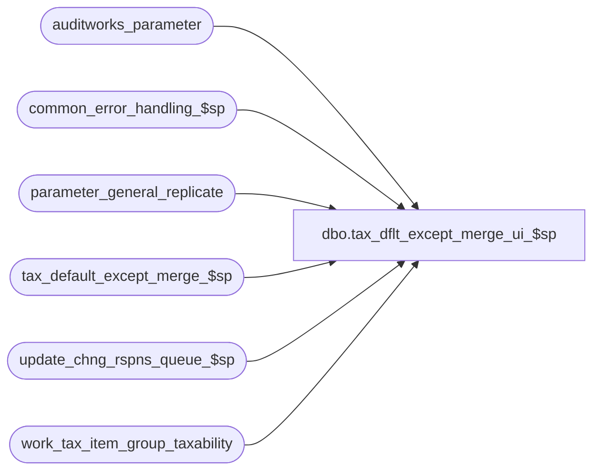

# dbo.tax_dflt_except_merge_ui_$sp

**Database:** auditworks  
**Server:** bedrockdb01  

## Architecture Diagram



## Table Dependencies

| Referenced Table |
|---|
| auditworks_parameter |
| common_error_handling_$sp |
| parameter_general_replicate |
| tax_default_except_merge_$sp |
| update_chng_rspns_queue_$sp |
| work_tax_item_group_taxability |

## Stored Procedure Code

```sql
create proc dbo.tax_dflt_except_merge_ui_$sp ( @process_id                   binary(16),
  @user_id                      int,
  @as_of_datetime 	        datetime OUTPUT)

AS

/* 
Proc name : tax_dflt_except_merge_ui_$sp
Desc	    : Called by CRDM TM as of S/A UI release 5.1.000.018.
            Executes tax_default_except_merge_$sp if the execution of the merge from the UI has not been disabled (as it would if the files are too big)
            and otherwise returns the date as of which the merged data is up to date and issues a merge request to be picked up by the SUSM revalidation
            process.

HISTORY:  
Date     Name           Def# Desc
Oct07,14 Vicci     TFS-87015 Since 'TAX_DEFAULT_EXCEPT_MERGE' reference is too big to fit in code_description.alpha_code, use 'TAX_DFLT_EXCPT_MERGE' instead.
Jun27,14 Vicci     TFS-75199 Don't return as-of-date if tables are already up to date since otherwise a "missing changes since as-of-date" message gets displayed in UI.
Jul10,13 Vicci        145144 Author
*/


DECLARE
  @errmsg		nvarchar(2000),
  @errno		int,
  @function_no		tinyint,
  @message_id		int,
  @object_name		nvarchar(255),
  @operation_name	nvarchar(100),
  @process_name		nvarchar(100),
  @log_error_flag 	tinyint,

  @merge_type 		smallint,
  @db_spid   		int,
  @init_work_tb   	tinyint,
  @source_process 	nvarchar(100),
  @last_item_grp_taxability_mod datetime

SET NOCOUNT ON

SELECT @errmsg             	= NULL,
       @function_no         	= 0,  --TM
       @process_name		= 'tax_dflt_except_merge_ui_$sp',
       @message_id 		= 201068,
       @log_error_flag		= 0,  -- not called by smartload
       @merge_type		= -1,
       @db_spid 		= @@spid,
       @init_work_tb 		= 1,
       @source_process 		= 'TM', 
       @log_error_flag		= 0  -- not called by smartload

IF NOT EXISTS (SELECT 1
                 FROM auditworks_parameter
	          WHERE par_name = 'disable_manual_tax_merge'
	            AND par_value = '1')
BEGIN
  EXEC tax_default_except_merge_$sp @errmsg OUTPUT, @merge_type, @db_spid, @init_work_tb, @source_process
  SELECT @errno = @@error
  IF @errno != 0
  BEGIN
    IF @errmsg IS NULL /* then */
      SELECT @errmsg = 'Failed to determine taxability of tax-item-groups and populate work_tax_item_group_taxability'
    SELECT @object_name = 'tax_default_except_merge_$sp',
           @operation_name = 'EXECUTE'
    GOTO error
  END
END
ELSE
BEGIN
  SELECT @as_of_datetime = MIN(posting_datetime) 
    FROM work_tax_item_group_taxability 
   WHERE process_id = -1
  SELECT @errno = @@error
  IF @errno != 0
  BEGIN
    SELECT @errmsg = 'Unable to determine when the default/exception merge was last run.'
    GOTO error
  END
  
  IF @as_of_datetime IS NULL
    SELECT @as_of_datetime = '01/01/1970'
  
  SELECT @last_item_grp_taxability_mod = last_item_grp_taxability_mod 
    FROM parameter_general_replicate 
  SELECT @errno = @@error
  IF @errno != 0
  BEGIN
    SELECT @errmsg = 'Unable to determine when the configuration change affecting item group taxability took place.'
    GOTO error
  END

  IF @last_item_grp_taxability_mod IS NULL
    SELECT @last_item_grp_taxability_mod = getdate()
  
  IF @as_of_datetime < @last_item_grp_taxability_mod
  BEGIN 
    EXEC update_chng_rspns_queue_$sp 'TAX_DFLT_EXCPT_MERGE' 
    SELECT @errno = @@error
    IF @errno != 0
    BEGIN
      SELECT @errmsg = 'Unable to execute update_chng_rspns_queue_$sp.'
      GOTO error
    END
  END
  ELSE
  BEGIN
    SELECT @as_of_datetime = NULL
  END
END  
SET NOCOUNT OFF
RETURN


error:   /* Common error handler */

     IF @@trancount > 0
		ROLLBACK TRANSACTION

     SET NOCOUNT OFF

     EXEC common_error_handling_$sp @function_no, @errno, @errmsg, 0, @message_id,
                @process_name, @object_name, @operation_name, @log_error_flag, 1,
          0, null, 0, null, null, null, null, null, null, 0, @process_id, @user_id

     RETURN
```

