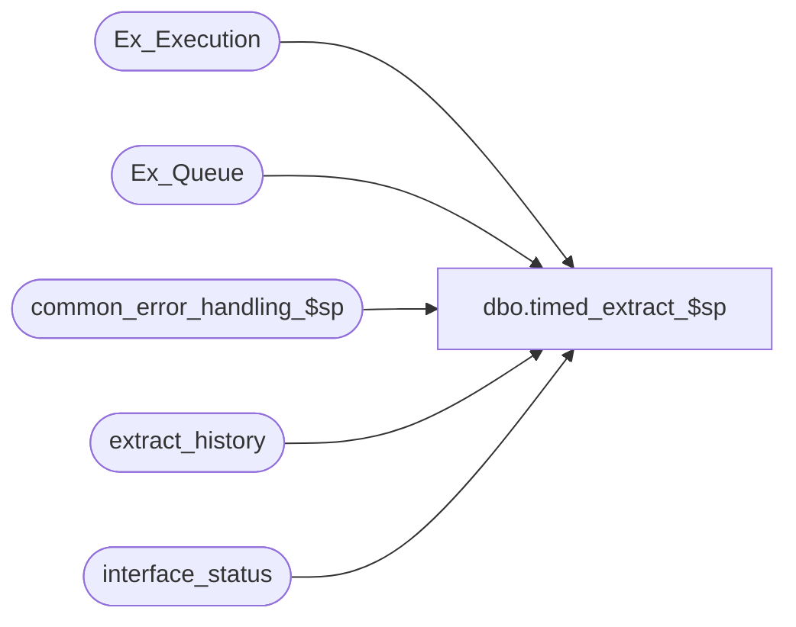

# dbo.timed_extract_$sp

**Database:** auditworks  
**Server:** bedrockdb01  

## Architecture Diagram



## Table Dependencies

| Referenced Table |
|---|
| Ex_Execution |
| Ex_Queue |
| common_error_handling_$sp |
| extract_history |
| interface_status |

## Stored Procedure Code

```sql
create proc dbo.timed_extract_$sp 

       
@QueueID int, 
@object_id int = 0

AS

/* 
PROC NAME: timed_extract_$sp
     DESC: To provide application logic to SmartLook interface
             that need to implement timed extraction of data files.
           Called by SmartLook exports.
  HISTORY:
Date	 Name       Def# Desc
Jan05,11 Paul     105313 Use unicode datatypes
May17,02 Paul    1-CD0IX added R3 error handling
Feb26,02 Paul       8860 pass back return value
Oct24,01 Paul       8860 change last_extract variable to tinyint,
			 store date-time in variables in case proc runs near midnight
Sep04,01 Winnie     8572 Change the order of input parameter for smartlook 4.0
			  and the extract date format to 6. Removed unnecessary order by.
Jun11,01 Winnie     8065 create new procedures to be used in generating smartview Exports

*/

DECLARE

  @cursor_open		int,
  @count_flag		int,
  @current_date		nchar(9),
  @current_time		nchar(5),
  @edit_complete	int,
  @errno		int,
  @errmsg		nvarchar(255),
  @last_extract		tinyint,
  @max_serial_no	int,
  @max_processed	int,
  @min_extract_time	nvarchar(5),
  @posting_in_progress	int,
  @return_value		int,
  @time_now		nvarchar(5),
  @message_id		int,
  @object_name		nvarchar(255),
  @process_name		nvarchar(100),
  @operation_name	nvarchar(100)

SELECT @process_name = 'timed_extract_$sp',
	@message_id = 201068

/* looks for today's date only, will return up to 2 rows */

SELECT @count_flag = 0,
       @edit_complete = 0,
       @max_serial_no = 0,
       @max_processed = 0,
       @return_value = 0,
       @current_date = CONVERT(nchar(9),getdate(),6),
       @current_time = CONVERT(nchar(5),getdate(),8)

DECLARE extract_history_crsr CURSOR
FOR
SELECT last_extract, MIN(extract_time)
  FROM extract_history
 WHERE extract_date = @current_date
   AND extract_time <= @current_time
   AND queue_id = @QueueID
   AND actual_time IS NULL   
 GROUP BY last_extract
FOR READ ONLY
       
OPEN extract_history_crsr

SELECT @errno = @@error
IF @errno != 0 
BEGIN
  SELECT @errmsg = 'Failed to open extract_history_crsr',
         @object_name = 'extract_history_crsr',
         @operation_name = 'OPEN'
   GOTO error
END

SELECT @cursor_open = 1,
       @time_now = @current_time

WHILE 1 = 1
BEGIN
  FETCH extract_history_crsr INTO
        @last_extract,
        @min_extract_time
  
  IF @@fetch_status <> 0
  BREAK
    
  IF @count_flag > 0 
  BREAK
    
  IF @last_extract < 1
  BEGIN
    SELECT @return_value = 1 -- Unconditional extract
    
    UPDATE extract_history
       SET actual_time = @time_now
     WHERE extract_date = @current_date
       AND extract_time = @min_extract_time
       AND queue_id = @QueueID
       AND actual_time IS NULL
     SELECT @errno = @@error
  IF @errno != 0 
    BEGIN
      SELECT @errmsg = 'Failed to update extract_history (1)',
         @object_name = 'extract_history',
         @operation_name = 'UPDATE'
      GOTO error
    END 
  END
  
  -- i_last_extract < 1
  ELSE
  BEGIN
  -- i_last_extract = 1 (indictates that this is the 
  -- last extract of the session)
  -- Here, we only extract once polling is completed...
  
    SELECT @posting_in_progress = posting_in_progress
      FROM interface_status
     WHERE interface_id = @QueueID
     
    SELECT @errno = @@error
    IF @errno != 0 
    BEGIN
      SELECT @errmsg = 'Failed to select from interface_status',
         @object_name = 'interface_status',
         @operation_name = 'SELECT'
      GOTO error
    END 
    
    IF @posting_in_progress IN (2,3)
      SELECT @edit_complete = 1
    ELSE 
      SELECT @edit_complete = 0
            
    -- If Edit Phase 2 has begun...
    IF @edit_complete = 1
      BEGIN
      -- We only extract if there is no more data to process
        SELECT @max_serial_no = MAX(serial_no)
          FROM Ex_Queue
         WHERE queue_id = @QueueID
                
        SELECT @errno = @@error
     IF @errno != 0 
        BEGIN
          SELECT @errmsg = 'Failed to set MAX(serial_no) from Ex_Queue',
	         @object_name = 'Ex_Queue',
	         @operation_name = 'SELECT'
          GOTO error
        END 
        
        SELECT @max_processed = ISNULL(MAX(to_serial_no),0)
          FROM Ex_Execution
         WHERE queue_id = @QueueID
       
       SELECT @errno = @@error
       IF @errno != 0 
       BEGIN
         SELECT @errmsg = 'Failed to select MAX(to_serial_no) from Ex_Execution',
       	         @object_name = 'Ex_Execution',
	         @operation_name = 'SELECT'
         GOTO error
       END      
       
       IF @max_serial_no <= @max_processed
       BEGIN
         SELECT @return_value = 1 -- Okay to Extract, all data processsed
              
         UPDATE extract_history
            SET actual_time = @time_now
          WHERE extract_date = @current_date
            AND extract_time = @min_extract_time
            AND queue_id = @QueueID
            AND actual_time IS NULL
            
     SELECT @errno = @@error
        IF @errno != 0 
          BEGIN
            SELECT @errmsg = 'Failed to update extract_history (2)',
                @object_name = 'extract_history',
	        @operation_name = 'UPDATE'
            GOTO error
          END      
       END -- IF @max_serial_no <= @max_processed
       
   END -- IF @edit_complete = 1
   END -- NOT @last_extract < 1
   
   SELECT @count_flag =  @count_flag + 1
END -- WHILE 1 = 1

CLOSE extract_history_crsr
DEALLOCATE extract_history_crsr
RETURN @return_value

error:   /* Common error handler. */
	IF @cursor_open <> 0
	BEGIN
	  CLOSE extract_history_crsr
	  DEALLOCATE extract_history_crsr
	END

	EXEC common_error_handling_$sp 251, @errno, @errmsg, 0, @message_id, 
	  @process_name, @object_name, @operation_name
	RETURN 0
```

