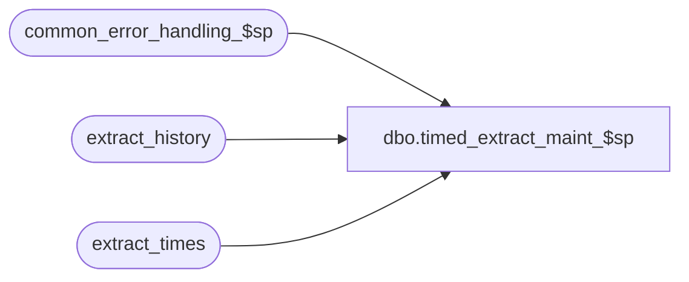

# dbo.timed_extract_maint_$sp

**Database:** auditworks  
**Server:** bedrockdb01  

## Architecture Diagram



## Table Dependencies

| Referenced Table |
|---|
| common_error_handling_$sp |
| extract_history |
| extract_times |

## Stored Procedure Code

```sql
create proc dbo.timed_extract_maint_$sp 

   
@QueueID	int,
@object_id 	int = 0

AS

/* 
PROC NAME: timed_extract_maint_$sp
     DESC: To automatically populate extract_history table on a daily basis
             with standard extract times held in the extract_times reference table.
           Called by SmartLook exports.
  HISTORY:
Date	 Name       Def# Desc
Jan05,11 Paul     105313 Use unicode datatypes
May17,02 Paul    1-CD0IX added R3 error handling
Oct24,01 Paul       8860 change @last_extract to tinyint, put current date in a variable
Sep04,01 Winnie     8572 Change the extract date format to 6.
Jun11,01 Winnie     8065 create new procedures to be used in generating smartview Exports
*/


DECLARE

  @cursor_open		int,
  @current_date		nchar(9),
  @errno		int,
  @errmsg		nvarchar(255),
  @return_value		int,
  @extract_QueueID	int,
  @extract_time		nvarchar(5),
  @last_extract		tinyint,
  @message_id		int,
  @object_name		nvarchar(255),
  @process_name		nvarchar(100),
  @operation_name	nvarchar(100)

SELECT @process_name = 'timed_extract_maint_$sp',
	@message_id = 201068,
	@return_value = 0,
	@current_date = CONVERT(nchar(9),getdate(),6)

-- purge table of old date

DELETE extract_history
 WHERE DATEDIFF(dd,extract_date,getdate()) > 7
 
SELECT @errno = @@error
IF @errno != 0 
BEGIN
  SELECT @errmsg = 'Failed to delete from extract_history',
         @object_name = 'extract_history',
         @operation_name = 'DELETE'
  GOTO error
END

DECLARE extract_times_crsr CURSOR
FOR
SELECT queue_id, extract_time, last_extract
  FROM extract_times
ORDER BY queue_id, extract_time
FOR READ ONLY

OPEN extract_times_crsr
SELECT @errno = @@error
IF @errno != 0 
BEGIN
  SELECT @errmsg = 'Failed to open extract_times_crsr',
         @object_name = 'extract_times_crsr',
         @operation_name = 'OPEN'
  GOTO error
END

SELECT @cursor_open = 1

WHILE 1 = 1
BEGIN
  FETCH extract_times_crsr 
   INTO @extract_QueueID, @extract_time, @last_extract
   
  IF @@fetch_status <> 0
  BREAK
  
  INSERT INTO extract_history
  VALUES (@extract_QueueID,
  	  @current_date,
          @extract_time,
          NULL,
          @last_extract)
            
  SELECT @errno = @@error
  IF @errno != 0 AND @errno != 2601
  BEGIN
    SELECT @errmsg = 'Failed to insert into extract_history',
         @object_name = 'extract_history',
         @operation_name = 'INSERT'
    GOTO error
  END
  
  END -- WHILE 1 = 1

CLOSE extract_times_crsr
DEALLOCATE extract_times_crsr
RETURN    
  
error:   /* Common error handler. */

	IF @cursor_open <> 0
	BEGIN
	  CLOSE extract_times_crsr
	  DEALLOCATE extract_times_crsr
	END

	EXEC common_error_handling_$sp 251, @errno, @errmsg, 0, @message_id, 
	  @process_name, @object_name, @operation_name
	RETURN
```

