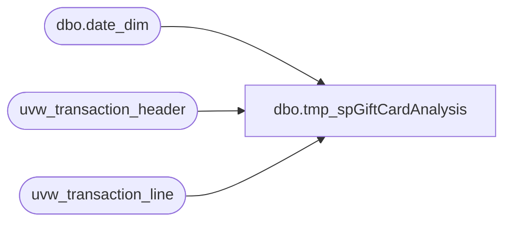

# dbo.tmp_spGiftCardAnalysis

**Database:** auditworks  
**Server:** bedrockdb01  

## Architecture Diagram



## Table Dependencies

| Referenced Table |
|---|
| dbo.date_dim |
| uvw_transaction_header |
| uvw_transaction_line |

## Stored Procedure Code

```sql
-------------This is it!-----------------------------------------------------------
--ALTER
CREATE 
PROCEDURE [dbo].[tmp_spGiftCardAnalysis] 

@GiftCardBeginRange numeric(28,0) = null, 
@GiftCardEndRange numeric(28,0) = null, 
@ActivationStartDate datetime,
@ActivationEndDate datetime,
@RedemptionStartDate datetime,
@RedemptionEndDate datetime,
@GiftCardType varchar(50)

AS
SET NOCOUNT ON
/*--********************************************--********************************************--********************************************
										NON-AV TRANSACTIONS
--********************************************--********************************************--********************************************/

IF (Object_ID('tempdb..##non_av_activations') IS NOT NULL) DROP TABLE  ##non_av_activations

SELECT  CardType = 
case when @GiftCardBeginRange is not null and isnumeric(tl.reference_no) = 1 and 
     cast(tl.reference_no as numeric(28,0)) between @GiftCardBeginRange and @GiftCardEndRange then @GiftCardType
 --    when @GiftCardActivationValue is not null then @GiftCardType 
else 'Unclassified' end
, th.store_no, th.register_no, th.transaction_no, th.transaction_date, d.date_key, d.fiscal_year,
d.fiscal_quarter,d.fiscal_period, d.fiscal_week, th.transaction_void_flag,th.tender_total, tl.line_void_flag,
tl.gross_line_amount, tl.line_object, tl.line_action,th.transaction_id, tl.reference_no  
  INTO ##non_av_activations  
-- FROM auditworks..transaction_header th with (nolock)  join  auditworks..transaction_line tl with (nolock) on 
FROM auditworks..uvw_transaction_header th with (nolock)  join  auditworks..uvw_transaction_line tl with (nolock) on 
th.transaction_id = tl.transaction_id join
 dbo.date_dim d with (nolock) on 
th.transaction_date = d.actual_date
where 
 th.transaction_void_flag = 0
  and tl.line_void_flag <> 1 
   and th.transaction_date between @ActivationStartDate and @ActivationEndDate
   and 
   (( line_object = 404  -- Gift Card Activations
     and line_action = 1 )
     or  
	 (line_object = 633  -- Gift Card Activations
     and line_action = 12))


create index ix_g##non_av_activations_compositekey on ##non_av_activations (transaction_id,date_key,store_no,CardType)

--create index ix_g##non_av_activations_CardType on ##non_av_activations (CardType)
-- --go 

IF (Object_ID('tempdb..##non_av_redemptions') IS NOT NULL) DROP TABLE  ##non_av_redemptions

SELECT  CardType = 
case when @GiftCardBeginRange is not null and isnumeric(tl.reference_no) = 1 and 
     cast(tl.reference_no as numeric(28,0)) between @GiftCardBeginRange and @GiftCardEndRange then @GiftCardType
 --    when @GiftCardActivationValue is not null then @GiftCardType 
else 'Unclassified' end
, th.store_no, th.register_no, th.transaction_no, th.transaction_date, d.date_key, d.fiscal_year,
d.fiscal_quarter,d.fiscal_period, d.fiscal_week, th.transaction_void_flag,th.tender_total, tl.line_void_flag,
tl.gross_line_amount, tl.line_object, tl.line_action,th.transaction_id, tl.reference_no  
  INTO ##non_av_redemptions  
-- FROM auditworks..transaction_header th with (nolock)  join  auditworks..transaction_line tl with (nolock) on 
--th.transaction_id = tl.transaction_id join
FROM auditworks..uvw_transaction_header th with (nolock)  join  auditworks..uvw_transaction_line tl with (nolock) on 
th.transaction_id = tl.transaction_id join
 dbo.date_dim d with (nolock) on 
th.transaction_date = d.actual_date
where 
   th.transaction_void_flag = 0
  and tl.line_void_flag <> 1 
  and th.transaction_date between @RedemptionStartDate and @RedemptionEndDate 
  and 
   (
( tl.line_object = 404  and tl.line_action = 2  ) -- Gift Card Redemptions
            or  
	 (tl.line_object = 633  and tl.line_action = 25 )-- Gift Card redemptions
     )


--create index ix_g##non_av_SameTrans_CardType on ##non_av_SameTrans (CardType)

IF (Object_ID('tempdb..##non_av_CardTypeTransactions') IS NOT NULL) DROP TABLE  ##non_av_CardTypeTransactions --##non_av_transactions1

--##non_av_SameTrans

select * into ##non_av_CardTypeTransactions
from ##non_av_activations with (nolock)
where CardType = @GiftCardType
union 
select * from ##non_av_redemptions  with (nolock) 
where CardType = @GiftCardType


create index ix_g##non_av_CardTypeTransactions_compositekey on ##non_av_CardTypeTransactions (transaction_id,date_key,store_no,CardType)
--##non_av_SameTrans

IF (Object_ID('tempdb..##non_av_SameTrans') IS NOT NULL) DROP TABLE  ##non_av_SameTrans

select t2.* 
into ##non_av_SameTrans
from ##non_av_CardTypeTransactions t1 with (nolock) 
join ##non_av_activations t2 with (nolock) on 
t1.transaction_id = t2.transaction_id and
t1.date_key = t2.date_key and
t1.store_no = t2.store_no 
where 
t1.CardType = @GiftCardType and 
t2.CardType <> @GiftCardType 
union all 
select t2.* 
--into ##non_av_transactions2
from ##non_av_CardTypeTransactions t1 with (nolock) 
join ##non_av_redemptions t2 with (nolock) on 
t1.transaction_id = t2.transaction_id and
t1.date_key = t2.date_key and
t1.store_no = t2.store_no 
where 
t1.CardType = @GiftCardType and 
t2.CardType <> @GiftCardType 


IF (Object_ID('tempdb..##non_av_transactions') IS NOT NULL) DROP TABLE  ##non_av_transactions

select * 
into ##non_av_transactions
from ##non_av_CardTypeTransactions with (nolock) 
union
select * from ##non_av_SameTrans with (nolock) 

/*--~~~~~~~~~~~~~~~~~~~~~~~~~~~~~~~~~~~~~~~~~~~~~~~~~~~~~~~~~~~~~~~~~~~~~~~~~~~~~~~~~~~~~~~~~~~~~~~~~~~~~~~~~~~~~~~~~~~~
/*--********************************************--********************************************--********************************************
										AV TRANSACTIONS
--********************************************--********************************************--********************************************/

IF (Object_ID('tempdb..##av_activations') IS NOT NULL) DROP TABLE  ##av_activations

SELECT  CardType = 
case when @GiftCardBeginRange is not null and isnumeric(tl.reference_no) = 1 and 
     cast(tl.reference_no as numeric(28,0)) between @GiftCardBeginRange and @GiftCardEndRange then @GiftCardType
 --    when @GiftCardActivationValue is not null then @GiftCardType 
else 'Unclassified' end
, th.store_no, th.register_no, th.transaction_no, th.transaction_date, d.date_key, d.fiscal_year,
d.fiscal_quarter,d.fiscal_period, d.fiscal_week, th.transaction_void_flag,th.tender_total,tl.line_void_flag,
 tl.gross_line_amount, tl.line_object,tl.line_action,th.av_transaction_id transaction_id,tl.reference_no
  INTO ##av_activations 
-- FROM  auditworks..av_transaction_header th with (nolock) join auditworks..av_transaction_line tl with (nolock) on 
-- th.av_transaction_id = tl.av_transaction_id join

FROM auditworks..uvw_transaction_header th with (nolock)  join  auditworks..uvw_transaction_line tl with (nolock) on 
th.transaction_id = tl.transaction_id  
--and th.transaction_id = tl.transaction_id 
join dbo.date_dim d with (nolock) on 
th.transaction_date = d.actual_date 
where 
  th.transaction_void_flag = 0
  and tl.line_void_flag <> 1 
   and th.transaction_date between @ActivationStartDate and @ActivationEndDate
   and 
   (( line_object = 404  -- Gift Card Activations
     and line_action = 1 )
     or  
	 (line_object = 633  -- Gift Card Activations
     and line_action = 12))

create index ix_g##av_activations_compositekey on ##av_activations (transaction_id,date_key,store_no,CardType)

--create index ix_g##av_activations_CardType on ##av_activations (CardType)


IF (Object_ID('tempdb..##av_redemptions') IS NOT NULL) DROP TABLE ##av_redemptions 


SELECT  CardType = 
case when @GiftCardBeginRange is not null and isnumeric(tl.reference_no) = 1 and 
     cast(tl.reference_no as numeric(28,0)) between @GiftCardBeginRange and @GiftCardEndRange then @GiftCardType
 --    when @GiftCardActivationValue is not null then @GiftCardType 
else 'Unclassified' end
, th.store_no, th.register_no, th.transaction_no, th.transaction_date, d.date_key, d.fiscal_year,
d.fiscal_quarter,d.fiscal_period, d.fiscal_week, th.transaction_void_flag,th.tender_total,tl.line_void_flag,
 tl.gross_line_amount, tl.line_object,tl.line_action,th.av_transaction_id transaction_id,tl.reference_no
  INTO ##av_redemptions  
 FROM  auditworks..av_transaction_header th with (nolock) join auditworks..av_transaction_line tl with (nolock) on 
 th.av_transaction_id = tl.av_transaction_id join
 dbo.date_dim d with (nolock) on 
th.transaction_date = d.actual_date 
where 
   th.transaction_void_flag = 0
  and tl.line_void_flag <> 1 
  and th.transaction_date between @RedemptionStartDate and @RedemptionEndDate 
  and 
   (
( tl.line_object = 404  and tl.line_action = 2  ) -- Gift Card Activations
            or  
	 (tl.line_object = 633  and tl.line_action = 25 )-- Gift Card redemptions
     )

-- create index ix_g##av_SameTrans_CardType on ##av_SameTrans (CardType)


IF (Object_ID('tempdb..##av_CardTypeTransactions') IS NOT NULL) DROP TABLE ##av_CardTypeTransactions 

select * into ##av_CardTypeTransactions
from ##av_activations with (nolock)
where CardType = @GiftCardType
union 
select * from ##av_redemptions  with (nolock) 
where CardType = @GiftCardType


create index ix_g##av_CardTypeTransactions_compositekey on ##av_CardTypeTransactions (transaction_id,date_key,store_no,CardType)


IF (Object_ID('tempdb..##av_SameTrans') IS NOT NULL) DROP TABLE  ##av_SameTrans

select t2.* 
into ##av_SameTrans
from ##av_CardTypeTransactions t1 with (nolock) 
join ##av_activations t2 with (nolock) on 
t1.transaction_id = t2.transaction_id and
t1.date_key = t2.date_key and
t1.store_no = t2.store_no 
where 
t1.CardType = @GiftCardType and 
t2.CardType <> @GiftCardType 
union all 
select t2.* 
--into ##av_transactions2
from ##av_CardTypeTransactions t1 with (nolock) 
join ##av_redemptions t2 with (nolock) on 
t1.transaction_id = t2.transaction_id and
t1.date_key = t2.date_key and
t1.store_no = t2.store_no 
where 
t1.CardType = @GiftCardType and 
t2.CardType <> @GiftCardType 


IF (Object_ID('tempdb..##av_transactions') IS NOT NULL) DROP TABLE  ##av_transactions

select * 
into ##av_transactions
from ##av_CardTypeTransactions with (nolock) 
union
select * from ##av_SameTrans with (nolock) 

--~~~~~~~~~~~~~~~~~~~~~~~~~~~~~~~~~~~~~~~~~~~~~~~~~~~~~~~~~~~~~~~~~~~~~~~~~~~~~~~~~~~~~~~~~~~~~~~~~~~~~~~~~~~~~~~~~~~~*/

IF (Object_ID('tempdb..##all_transactions') IS NOT NULL) DROP TABLE  ##all_transactions

select * into ##all_transactions
from ##non_av_transactions  
--union
--select * from ##av_transactions

--select * from ##all_transactions

--******************wip***************************************************************************************
IF (Object_ID('tempdb..##all_activations') IS NOT NULL) DROP TABLE  ##all_activations

select * into ##all_activations
from ##all_transactions   
where 
(line_object = 404 and line_action = 1)  
 or
(line_object = 633 and line_action = 12) 


IF (Object_ID('tempdb..##all_redemptions') IS NOT NULL) DROP TABLE  ##all_redemptions

select * into ##all_redemptions
from ##all_transactions   
where 
(line_object = 404 and line_action = 2)  
 or
(line_object = 633 and line_action = 25) 

--select * from ##AllGiftCard_Activations

--******************Output stats***************************************************************************************

/*
--Q1: How many gift cards of the types were activated? 
*/

--select top 1 * from ##all_transactions

select 'Store Total Activations' as ReportName, cast(store_no as varchar(50)) store_no, CardType,
 count(distinct reference_no) TotalGiftCardsActivated ,count(distinct transaction_id) TransactionCount
from ##all_activations with (nolock)
-- and r.store_no = 991 -- 277
where CardType = @GiftCardType
--and store_no = 2003 
group by store_no,  CardType 
order by store_no ,CardType
-- --go 


/*
--Q2: How many gift cards of the types were redeemed? 
*/

--select top 1 * from ##all_redemptions

select 'Store Total Redemptions' as ReportName, cast(store_no as varchar(50)) store_no, CardType,
 count(distinct reference_no) TotalGiftCardsRedeemed ,count(distinct transaction_id) TransactionCount
from ##all_redemptions with (nolock)
-- and r.store_no = 991 -- 277
where CardType = @GiftCardType
--and store_no = 2003 
group by store_no,  CardType 
order by store_no ,CardType
-- --go 


/*
--Q3: How many gift cards were activated and Redeemed on the same day? 
--Same activation and redemption day Store Totals
*/


----Q3a) Same activation and redemption day Store Totals/Summary

select 'Store Total Same Day Redemption' as ReportName, cast(r.store_no as varchar(50)) store_no, r.CardType,  
count(distinct r.reference_no) SameDayRedemptionGiftCardCount,
count(distinct r.transaction_id) SameDayRedemptionTransCount
from 
##all_activations a with (nolock) join 
##all_redemptions r with (nolock)
on 
 r.reference_no = a.reference_no  and 
 r.date_key = a.date_key 
--where a.store_no = 2003 
group by r.store_no, r.CardType
--go


----Q3b) Details of Activations (Same day activation and redemption)
select 'Activation Details'  as ReportName,
cast(a.store_no as varchar(50)) store_no
, a.transaction_date
,cast(a.register_no as varchar(50)) register_no
,cast(a.transaction_no as varchar(50)) transaction_no
,cast(a.transaction_id as varchar(50)) transaction_id
,a.CardType
,a.reference_no
,a.gross_line_amount
,a.tender_total
,cast(a.fiscal_year as varchar(4)) fiscal_year
,cast(a.fiscal_quarter as varchar(2)) fiscal_quarter
,cast(a.fiscal_period as varchar(2)) fiscal_period
,cast(a.fiscal_week as varchar(2)) fiscal_week
,cast(a.line_object as varchar(8)) line_object
,cast(a.line_action as varchar(8)) line_action
from 
##all_activations a with (nolock) join 
##all_redemptions r with (nolock) on 
 a.reference_no = r.reference_no   
 and a.date_key = r.date_key
--where a.store_no = 2003 
group by a.CardType, a.store_no, a.register_no, a.transaction_no, a.transaction_date, a.fiscal_year,
a.fiscal_quarter, a.fiscal_period, a.fiscal_week, a.transaction_void_flag, a.tender_total, a.line_void_flag,
a.gross_line_amount, a.line_object, a.line_action,a.transaction_id, a.reference_no 
order by a.reference_no


----Q3c) Details of Redemptions (Same day activation and redemption)

select 'Redemption Details' as ReportName,
cast(r.store_no as varchar(50)) store_no
, r.transaction_date
,cast(r.register_no as varchar(50)) register_no
,cast(r.transaction_no as varchar(50)) transaction_no
,cast(r.transaction_id as varchar(50)) transaction_id
,r.CardType
,r.reference_no
,r.gross_line_amount
,r.tender_total
,cast(r.fiscal_year as varchar(4)) fiscal_year
,cast(r.fiscal_quarter as varchar(2)) fiscal_quarter
,cast(r.fiscal_period as varchar(2)) fiscal_period
,cast(r.fiscal_week as varchar(2)) fiscal_week
,cast(r.line_object as varchar(8)) line_object
,cast(r.line_action as varchar(8)) line_action
from 
##all_activations a with (nolock) join 
##all_redemptions r with (nolock) on 
 a.reference_no = r.reference_no   
 and a.date_key = r.date_key
-- where r.store_no = 2003 
group by r.CardType, r.store_no, r.register_no, r.transaction_no, r.transaction_date, r.fiscal_year,
r.fiscal_quarter, r.fiscal_period, r.fiscal_week, r.transaction_void_flag, r.tender_total, r.line_void_flag,
r.gross_line_amount, r.line_object, r.line_action,r.transaction_id, r.reference_no 
order by r.reference_no


--Q4: Multiple Redemptions on single transaction


--Q4a) Multiple Redemptions on same transaction - Store Totals/Summary

select 'Trans with Multiple Redems Store Totals' as ReportName,
cast(store_no as varchar(50)) store_no, 
count(distinct r.transaction_id) MultipleRedemptions_TransCount, count(distinct r.reference_no) GiftCardsRedemeed
from 
##all_redemptions r 
where 
-- r.store_no = 2003 and
 transaction_id in 
(select transaction_id 
from ##all_redemptions  with (nolock) where
transaction_id in 
(select transaction_id from ##all_redemptions with (nolock) where CardType = @GiftCardType )
group by transaction_id having count(distinct reference_no) > 1)
group by store_no
--go

----Q4b) Multiple Redemptions on same transaction - Transaction_ID Totals/Summary

select 'Trans with Multiple Redems' as ReportName,
cast(r.store_no as varchar(50)) store_no
,cast(r.transaction_no as varchar(50)) transaction_no
,cast(r.transaction_id as varchar(50)) transaction_id
, count(distinct r.reference_no) GiftCardsRedemeed,
 sum(r.gross_line_amount) total_gross_line_amount,r.tender_total
from 
##all_redemptions r 
where 
-- r.store_no = 2003 and
 transaction_id in 
(select transaction_id 
from ##all_redemptions  with (nolock) where
transaction_id in 
(select transaction_id from ##all_redemptions with (nolock) where CardType = @GiftCardType) 
group by transaction_id having count(distinct reference_no) > 1)
group by store_no,r.transaction_id,r.transaction_no,r.tender_total
--go


----Q4c) Multiple Redemptions on same transaction - Details

select 'Multiple Redems Trans Details' as ReportName,
cast(r.store_no as varchar(50)) store_no
, r.transaction_date
,cast(r.register_no as varchar(50)) register_no
,cast(r.transaction_no as varchar(50)) transaction_no
,cast(r.transaction_id as varchar(50)) transaction_id
,r.CardType
,r.reference_no
,r.gross_line_amount
,r.tender_total
,cast(r.fiscal_year as varchar(4)) fiscal_year
,cast(r.fiscal_quarter as varchar(2)) fiscal_quarter
,cast(r.fiscal_period as varchar(2)) fiscal_period
,cast(r.fiscal_week as varchar(2)) fiscal_week
,cast(r.line_object as varchar(8)) line_object
,cast(r.line_action as varchar(8)) line_action
from 
##all_redemptions r 
where 
-- r.store_no = 2003 and
 transaction_id in 
(select transaction_id --,count(distinct reference_no) NoOfGiftCards
from ##all_redemptions  with (nolock) where
transaction_id in 
(select transaction_id from ##all_redemptions  with (nolock) where CardType  = @GiftCardType)
group by transaction_id having count(distinct reference_no) > 1)
group by r.CardType, r.store_no, r.register_no, r.transaction_no, r.transaction_date, r.fiscal_year,
r.fiscal_quarter, r.fiscal_period, r.fiscal_week, r.transaction_void_flag, r.tender_total, r.line_void_flag,
r.gross_line_amount, r.line_object, r.line_action,r.transaction_id, r.reference_no 
order by r.store_no,r.transaction_no, r.reference_no


----Q5a) Sales Details of transactions with Activations 
select 'Activation Sales Details by Transaction'  as ReportName,
cast(a.store_no as varchar(50)) store_no
, a.transaction_date
,cast(a.register_no as varchar(50)) register_no
,cast(a.transaction_no as varchar(50)) transaction_no
,cast(a.transaction_id as varchar(50)) transaction_id
,count(distinct a.reference_no) NoOfGCActivated
,sum(a.gross_line_amount) TtlAmtGCActivated
,a.tender_total
,a.tender_total - sum(a.gross_line_amount) [gaap_sale (TenderTotal - TtlAmtGCActivated)]
,cast(a.fiscal_year as varchar(4)) fiscal_year
,cast(a.fiscal_quarter as varchar(2)) fiscal_quarter
,cast(a.fiscal_period as varchar(2)) fiscal_period
,cast(a.fiscal_week as varchar(2)) fiscal_week
,cast(a.line_object as varchar(8)) line_object
,cast(a.line_action as varchar(8)) line_action
from 
##all_activations a with (nolock) 
group by  
a.store_no, a.register_no, a.transaction_no, a.transaction_date, a.fiscal_year,a.tender_total,
a.fiscal_quarter, a.fiscal_period, a.fiscal_week, a.transaction_void_flag, a.tender_total, a.line_void_flag,
a.line_object, a.line_action,a.transaction_id 
order by a.store_no,a.transaction_date, a.transaction_no


----Q5b) Sales Details of transactions with redemptions 
select 'Redemption Sales Details by Transaction'  as ReportName,
cast(r.store_no as varchar(50)) store_no
, r.transaction_date
,cast(r.register_no as varchar(50)) register_no
,cast(r.transaction_no as varchar(50)) transaction_no
,cast(r.transaction_id as varchar(50)) transaction_id
,count(distinct r.reference_no) NoOfGCRedeemed
,sum(r.gross_line_amount) TtlAmtGCRedeemed
,r.tender_total
,r.tender_total - sum(r.gross_line_amount) [GC_lift (TenderTotal - TtlAmtGCRedeemed)]
,cast(r.fiscal_year as varchar(4)) fiscal_year
,cast(r.fiscal_quarter as varchar(2)) fiscal_quarter
,cast(r.fiscal_period as varchar(2)) fiscal_period
,cast(r.fiscal_week as varchar(2)) fiscal_week
,cast(r.line_object as varchar(8)) line_object
,cast(r.line_action as varchar(8)) line_action
from 
 ##all_redemptions r with (nolock)  
group by 
r.store_no, r.register_no, r.transaction_no, r.transaction_date, r.fiscal_year,r.tender_total,
r.fiscal_quarter, r.fiscal_period, r.fiscal_week, r.transaction_void_flag, r.tender_total, r.line_void_flag,
r.line_object, r.line_action,r.transaction_id 
order by r.store_no,r.transaction_date, r.transaction_no


SET ANSI_NULLS OFF
--go
SET --QUOTED_IDENTIFIER OFF
--go
```

