# dbo.transaction_modify_$sp

**Database:** auditworks  
**Server:** bedrockdb01  

## Architecture Diagram

```mermaid
flowchart LR
    SP["dbo.transaction_modify_$sp"]
    Ex_Queue(["Ex_Queue"]) --> SP
    T_ID(["T_ID"]) --> SP
    archive_adjustment(["archive_adjustment"]) --> SP
    audit_status(["audit_status"]) --> SP
    auditworks_parameter(["auditworks_parameter"]) --> SP
    auditworks_system_flag(["auditworks_system_flag"]) --> SP
    common_error_handling__sp(["common_error_handling_$sp"]) --> SP
    delete_if_details__sp(["delete_if_details_$sp"]) --> SP
    discount_detail(["discount_detail"]) --> SP
    exception_post__sp(["exception_post_$sp"]) --> SP
    exception_reason(["exception_reason"]) --> SP
    exception_rule(["exception_rule"]) --> SP
    function_status(["function_status"]) --> SP
    if_rejection_reason(["if_rejection_reason"]) --> SP
    if_transaction_header(["if_transaction_header"]) --> SP
    interface_control(["interface_control"]) --> SP
    interface_directory(["interface_directory"]) --> SP
    interface_status(["interface_status"]) --> SP
    issue_list(["issue_list"]) --> SP
    line_note(["line_note"]) --> SP
    line_object_action_association(["line_object_action_association"]) --> SP
    merchandise_detail(["merchandise_detail"]) --> SP
    modify_interface__sp(["modify_interface_$sp"]) --> SP
    pwork_plu(["pwork_plu"]) --> SP
    rec_manual__sp(["rec_manual_$sp"]) --> SP
    sa_rejection_reason(["sa_rejection_reason"]) --> SP
    store_audit_status(["store_audit_status"]) --> SP
    tax_exception_transaction(["tax_exception_transaction"]) --> SP
    tran_id_datatype(["tran_id_datatype"]) --> SP
    transaction_header(["transaction_header"]) --> SP
    transaction_line(["transaction_line"]) --> SP
    transaction_validate__sp(["transaction_validate_$sp"]) --> SP
    trno(["trno"]) --> SP
    update_if_reject_memo__sp(["update_if_reject_memo_$sp"]) --> SP
    verify_register__sp(["verify_register_$sp"]) --> SP
    work_control_interfaces(["work_control_interfaces"]) --> SP
    work_delete_detail(["work_delete_detail"]) --> SP
    work_interface_control(["work_interface_control"]) --> SP
    work_rejection_reason(["work_rejection_reason"]) --> SP
    work_tax_exception_trans(["work_tax_exception_trans"]) --> SP
```



## Table Dependencies

| Referenced Table |
|---|
| Ex_Queue |
| T_ID |
| archive_adjustment |
| audit_status |
| auditworks_parameter |
| auditworks_system_flag |
| common_error_handling_$sp |
| delete_if_details_$sp |
| discount_detail |
| exception_post_$sp |
| exception_reason |
| exception_rule |
| function_status |
| if_rejection_reason |
| if_transaction_header |
| interface_control |
| interface_directory |
| interface_status |
| issue_list |
| line_note |
| line_object_action_association |
| merchandise_detail |
| modify_interface_$sp |
| pwork_plu |
| rec_manual_$sp |
| sa_rejection_reason |
| store_audit_status |
| tax_exception_transaction |
| tran_id_datatype |
| transaction_header |
| transaction_line |
| transaction_validate_$sp |
| trno |
| update_if_reject_memo_$sp |
| verify_register_$sp |
| work_control_interfaces |
| work_delete_detail |
| work_interface_control |
| work_rejection_reason |
| work_tax_exception_trans |

## Stored Procedure Code

```sql
CREATE proc  [dbo].[transaction_modify_$sp] 
@process_id			binary(16),
@user_id  			int, 
@transaction_id			tran_id_datatype,
@errmsg				nvarchar(2000) OUTPUT,
@ENTRY_ID			T_ID,
@function_no			tinyint = 100,
@function_status		tinyint = 1,
@rec_process_id			numeric(12,0) = NULL -- NULL unless recovering halted process.

AS

/*
  Proc Name: transaction_modify_$sp
  Desc: Modify a transaction.
  Called by front end and function_cleanup_$sp. 
  FRONT END will lock store-reg-date and insert a row into function_status before calling this proc.
  See util_tran_modify_$sp for simulating call to transaction modify that UI would have done.
  Unicode version.

HISTORY:
Date     Name        Defect# Action
Sep20,18 Kiri      DAOM-3629 Add alphanumeric coupon codes support to pos_discount_serial_no
May26,16 Vicci      DAOM-730 Verify register status even when trickling in:  otherwise status may be downgraded to 100 inappropriately.
Jul22,15 Daphna       131151 Expand the length of the column for tender total and amounts
Sep05,14 Vicci        139695 Add unit_of_measure logging and take it into account when validating transaction balance.
Sep05,14 Vicci     TFS-76395 Take line note 9106 (serial# override) into account.
Sep23,13 Vicci        146826 Expand @errmsg since expanded in modify_interface_$sp.
Aug23,13 Vicci        146198 Set pos_discount_serial_no in same manner as Edit when not already set manually by auditor, 
                             to compensate for UI no longer doing so as of S/A 5.0
Oct19,12 Vicci        121947 Call validation for post-voiding transactions as well, to avoid losing S/A rejection reason 17 (post voided trans not found) on resave.
Aug22,12 Vicci        137795 Remove SET NOCOUNT OFF from after the call to the common error handling to avoid @@error being reset before the calling proc can see it.
Mar03,11 Vicci        125568 delete work_tax_exception_trans table used for restores once done with it.
Aug17,10 Paul         120039 delete work_interface_control moved here from modify_interface_$sp to support error recovery scenarios
Jul16,10 Vicci        119562 Remove transactions that have been post-voided from list of pre-audit tax-exception transactions.
May28,10 Vicci        118199 Handle transaction void reason being modified but remaining void:  ensure that interfaces 
		             which care about voids are fed. Re-introduce logic from transaction_void_$sp that is needed
		             by DV-1286 to handle posting void/un-void as modificiation (not new) and that doesn't happen 
		             when UI just calls transaction_modify_$sp.
Mar31,10 Vicci        115530 Port a bit of Oracle fix to handle recovery of status >= 10 when I/F table 
			     entries have already been cleaned up, but most was already handled in MSSQL.
Oct16,08 Paul       1-3YDOA1 prevent error during recovery when copy_transaction_id is already null
Nov02,07 Paul          93800 Avoid error on recovery (if if_transaction_header row already cleaned up)
Aug21,07 Paul          90644 Correctly set store_audit_status after modifying a non-tendered transaction.
Jul12,07 Paul          89108 corrected logic for voiding transactions, report error if passed in parameters are incorrect
Apr03,07 Phu           83599 GLC trans mod did not update cust_liability table.
Jan25,07 Paul          82449 store @defer_old in function_status for error recovery purposes, remove temp table
Jan18,07 Tim         DV-1351 Apply 77947 to SA5
Jul05,05 Paul        DV-1239 pass @transaction_id to exception_post_$sp
Jun27,05 Paul        DV-1286 set interface_control_flag = 30 to avoid double posting, improve performance, remove begin tran
Apr28,05 Paul        DV-1234 expand transaction_id to use tran_id_datatype
Jan10,05 Paul        DV-1191 add nocount and locking hints
Dec02,04 Paul        DV-1181 look at ACTV in exception_rule
Nov15,04 Paul        DV-1167 remove reference to media rec tran id
Sep15,04 IanK        DV-1146 Use user_id
Sep02,04 David       DV-1129 Apply 29561 to SA5
Jul30,04 David/Paul  DV-1071 Remove update of audit trail, pass @ENTRY_ID, add recovery logic.
Apr20,04 Maryam      DV-1071 Pass in @process_id and @user_id as mandatory parameters.
Apr15,04 Sab	     DV-1068 Remove old media rec code
Oct24.06 Daphna      77947   Ensure correct flag passed to modify_interfaces_$sp when txn is voided and there are
                             IF having interface_voided_transactions = 1
Jul15,04 Vicci       29561   Handle line_object_type 23 (PLU subtotal discounts)
Mar10,04 Maryam      23597   Remove the call to Glc_$sp. fix the where clause when selecting
                             from media_parameter_selection. Make sure the code related to old media rec
                             will not run when we are running new media rec. Set the audit_staus to 100 unconditionally
                             call verify_store_status_$sp.Do not call verify_register_$sp for new media rec in trickle audit environment
Jun19,03 Paul        1-KX549 call new media rec, call verify_register_$sp
Jan30,03 Winnie	        5815 update audit_trail_detail when modifying a promotion transaction.
Nov29,02 HenryW      1-GD3BY To correctly set sa_rejection_flag in trxn header.
Aug03,02 Paul        1-E7L7M populate key_11 in Ex_Queue with entry_date_time
AUG02,02 Daphna      1-EIRG1 reset voiding_reversal_flag (orig in transaction_validate_$sp)
                             when old void flag = 8 or new void flag = 8
Jun04,02 Sab	     1-DFVAH When modifying a trans with exceptions, revalidate the exceptions_verified flag in audit_status
MAY09,02 Daphna      1-CVA8P When @bal_cashier <> @old_cashier ensure @bal_cashier_no = 0
                              In order to reevaluate all cashiers in media rec 	
APR19,02 Daphna      1-CE89X Pass @bal_cashier_no in call to media_reconciliation_$sp
Mar12,02 ShuZ        1-8UTS3 Set line_modified_flag to 1 when transaction_void_flag modified
   from zero to 8
Jan31,02 Winnie	     1-8RFSL When unvoiding a transaction, need to feed it back to pre_audit_interface.
Jan30,02 David C     1-9DI2T Lay foundation for archive transaction modification; 
                              Change function_status values to 0,1,10,20,30,40,50.
Dec18,01 Winnie	        8927 calculate the correct amount for plu_price
Dec17,01 Daphna         8850 Ensure media_reconciliation is correctly updated/inserted for
                              change of cashier.    
Dec04,01 David C     1-9ATXP Move call to cust_liability_edit_$sp to modify_interface_$sp AND
                              change code for New error handling.
Nov19,01 Henry 	    	8961 Retrofit def 8780 to 2.46.25+.
Sep26,01 Maryam         8780 Properly set valid_qty.
Aug30,01 David C        8584 Call cust_liability_edit_$sp for R3 customer liability
Aug15,01 Daphna	    	8207 set @old_cashier = 0 when bal by reg and bal by store,                             
				 pass @bal_register_no in call to petty_cash_$sp
				 pass @bal_register_no in call to calc_drawer_discrepancy_$sp
Jul10,01 Paul		8277 Save @media_rec_tran_id to function_status
Jun15,01 Paul		7584 Check for modified cashier_no if bal by cashier or reg/cashier
Mar21,01 DavidM	    	7447 correctly calculate petty cash when cashier/store balancing
Mar20,01 Phu		7501 Use system function to retrieve user name
Dec15,00 Paul		7117 pass function_no to media_reconciliation_$sp
Dec12,00 Paul		7109 set audit_status = 100
Dec04,00 Phu		7011 Call calc_drawer_discrepancy_$sp to re-calculate drawer discrepancy
Nov20,00 Maryam 	6795 tax_override_flag is no longer used. Do not set the flag.
Sep21,00 Maryam         6729 Set the tax_override_flag  if there exists any tax_override_detail
                              for the transaction with a tax_category other than 0.   
Jun08,00 Vicci		6410 Replaced call to glc_$sp with call to Glc_$sp
Jun07,00 Daphna         5894 REFIX: When adding or voiding 'count' lines set 
                              @media_rec_tran_id = 7 (count and declare) to ensure recalc
May30,00 Vicci		6389 Don't do petty cash if void;  remove I/F hold logic;
                              simplify call to modify_interface_$sp
Apr13,00 Paul	        6168 avoid select * in exists
Mar30,00 Phu	        6158 Remove alias name attached to column being updated for MS SQL compatibility
Feb04,00 Daphna F       4671 include line_action 56 (balance forward) in defn of petty cash txn	
Jan31,00 Daphna F       5894 ensure media_count_flag reflects any changes made to txn
			       	     (adding or voiding 'count' lines)
Jan28,00 Daphna F	5598 delete from petty_cash_rec if old txn is petty cash, exec
			               petty_cash_$sp (new) if new txn is petty cash, exec calc_drawer_discepancy_$sp
			 if old was petty and new was not
			               Ensure store-date unlocked before returning from proc
Dec22,99 Daphna F	5458 prevent error 0  	
Sep30,99 Daphna F	5299 If orig txn has line-actions 245,246,247 set @media_rec_tran_id
       to -2,-3,-4,-7 for call to media_reconciliation, if not, pass
                              new txn's transaction_id to media_reconciliation_$sp
Sep30,99 Daphna F	5412 Set copy_transaction_id  to NULL after deleting orig txn from
			      if_tables.	
Sep22,99 Daphna F	5410 Definition of Petty Cash txn include line_object_type = 21
		              (store funds)
Sep10,99 Paul		5282 speed improvement - avoid call to update_if_reject_memo_$sp
Jul28,99 Daphna F	5026 added call to delete_if_details_$sp instead of
			     deleting if_transaction_header and setting off trigger
Jun07,99 Louise M.	4526 Added logic to bypass media rec when store is trickling in.
Mar17,99 Mat C		 n/a Added @function_no to parameters of modify_interface_$sp
Feb05,99 Mat C		  ?? Added @function_no as a parameter
Feb04,99 Paul S	          ?? last modified
Jan07,97 Sebastiano V 	 n/a Creation
*/

DECLARE
  @cashier_no				int,  -- used in media rec insert
  @column_name				nvarchar(30),
  @copy_transaction_id	        	tran_id_datatype,
  @count				tinyint,
  @date_reject_id	        	tinyint,
  @declare				tinyint,
  @defer_new		  	      	tinyint,
  @defer_old		   	   	tinyint,
  @effective_date			smalldatetime,
  @entry_date_time			datetime,
  @errno		        	int,
  @exception_flag	        	tinyint,
  @exceptions_verified	        	tinyint,
  @if_rejection_flag	        	tinyint,
  @in_out_both_flag			tinyint, 
  /*           @in_out_both_flag values: 1=in (add, modify/void an sa reject, move invalid reg/date)
                2=out (delete)
     3=in and out (modify/void/move)
  */
  @interface_out		        tinyint,
  @interface_in		        	tinyint,
  @line_object                     	int,
  @message_id				int,
  @min_exception_type			tinyint,
  @min_media_rec_key               	int,
  @object_name				nvarchar(255),
  @old_column_name			nvarchar(30),
  @old_if_rejection_flag        	tinyint,
  @old_sa_rejection_flag        	tinyint,
  @old_exception_flag	  		tinyint,
  @old_transaction_void_flag	   	smallint,
  @operation_name			nvarchar(100),
  @pickup_loan_amount              	money,
  @process_name				nvarchar(100),
  @recovery_flag			tinyint,
  @register_no		        	smallint,
  @rows			        	int,
  @store_no			        int,
  @transaction_category		     	tinyint,
  @transaction_date		  	smalldatetime,
  @transaction_no	  	        trno,
  @transaction_series			nchar(1),
  @transaction_void_flag	        smallint,
	@del_rows			int,
        @expired_issue_rows		int,
        @date_time_retrieval            datetime,
        @min_transaction_date           smalldatetime,
        @auto_verify_dayend_issues      tinyint

SET NOCOUNT ON

SELECT @process_name = 'transaction_modify_$sp',
       @message_id = 201068,
       @column_name = 'delete reference_no',
       @old_column_name = 'reference_no',
       @in_out_both_flag = 3,
       @if_rejection_flag = 0,
       @recovery_flag = 0,
       @defer_old = 0,
       @min_exception_type = NULL,
       @del_rows = 0,
       @expired_issue_rows = 0 

SELECT transaction_id, line_id, gross_line_amount, net_amount
    INTO #calc_plu -- create empty temp table from template table with user defined data types
   FROM pwork_plu WITH (NOLOCK)

SELECT @errno = @@error
IF @errno != 0
  BEGIN
    SELECT @errmsg         = 'Failed to create temp table #calc_plu',
  @object_name    = '#calc_plu',
           @operation_name = 'CREATE'
    GOTO error
  END

-- Read current values

SELECT @copy_transaction_id = copy_transaction_id,
	@transaction_category = transaction_category,
	@transaction_void_flag = transaction_void_flag,
	@store_no = store_no,
	@register_no = register_no,
	@transaction_date = transaction_date,
	@date_reject_id = date_reject_id,
	@old_sa_rejection_flag = sa_rejection_flag,
	@old_if_rejection_flag = if_rejection_flag,
	@transaction_no = transaction_no,
	@transaction_series = transaction_series,
	@entry_date_time = entry_date_time,
	@exception_flag = exception_flag
  FROM transaction_header WITH (NOLOCK)
 WHERE transaction_id = @transaction_id

SELECT @errno = @@error, @rows = @@rowcount
IF @errno != 0 OR @rows = 0
BEGIN
  SELECT @errmsg = 'Failed to select from transaction_header',
         @object_name = 'transaction_header',
         @operation_name = 'SELECT'
  GOTO error
END

  -- read original values before frontend/proc changed them.
  -- this row may no longer exist in a delayed error recovery scenario
  -- since it could have already been cleaned up after interface posting (when @status >= 10) 

SELECT 	@old_transaction_void_flag = transaction_void_flag, -- needed for interface logic
	@old_exception_flag = exception_flag -- needed to bump exception_qty
  FROM if_transaction_header WITH (NOLOCK)
 WHERE if_entry_no = @copy_transaction_id
SELECT @errno = @@error, @rows = @@rowcount
IF @errno != 0
  BEGIN
    SELECT @errmsg = 'Failed to select from if_transaction_header',
         @object_name = 'if_transaction_header',
         @operation_name = 'SELECT'
    GOTO error
  END

IF @rows = 0
BEGIN
  SELECT @old_transaction_void_flag = @transaction_void_flag,
	 @old_exception_flag = @exception_flag
  IF EXISTS (SELECT 1
	       FROM exception_reason
              WHERE transaction_id = @transaction_id)
    SELECT @old_exception_flag = 1
END

IF @function_status > 1 -- error recovery when called by function_cleanup_$sp
BEGIN
   SELECT @recovery_flag = 1

   SELECT @defer_old = ISNULL(tracking_id,0)
     FROM function_status WITH (NOLOCK)
    WHERE process_id = @process_id
      AND user_id = @user_id
      AND function_no = @function_no

   SELECT @errno = @@error
   IF @errno != 0
   BEGIN
     SELECT @errmsg = 'Failed to select @defer_old',
	@object_name = 'function_status',
	@operation_name = 'SELECT'
     GOTO error
   END

   -- When @function_status < 40, the @old_sa_rejection_flag, @old_if_rejection_flag can still be set
   -- by reading transaction_header (above) because they were not changed in header yet
   -- and those original values are not needed after @function_status is bumped to 40

   -- need to set any flags that are needed when @function_status >= 40
   IF @function_status >= 40
     SELECT @if_rejection_flag = @old_if_rejection_flag -- setting to modified value in tran header

END -- If @function_status > 1

IF @function_status = 1 -- not error recovery
BEGIN
  --Since coupon-triggered promotions have a promo number logged in the format 9999999999999999:PromoName for Coalition (146198)
  UPDATE discount_detail
     SET pos_discount_serial_no = CASE WHEN CHARINDEX(':', ln.line_note) BETWEEN 1 AND 21 
          			       THEN SUBSTRING(ln.line_note, 1, CHARINDEX(':', ln.line_note) - 1)
			               ELSE SUBSTRING(ln.line_note, 1, 20) END
    FROM line_note ln
   WHERE discount_detail.transaction_id = @transaction_id
     AND ln.transaction_id = @transaction_id
     AND ln.note_type = 9006  --Coupon/Promotion type
     AND ln.line_note IS NOT NULL
     AND ln.line_id = discount_detail.applied_by_line_id
     AND discount_detail.pos_discount_serial_no IS NULL
  SELECT @errno = @@error
  IF @errno != 0
  BEGIN
    SELECT @errmsg = 'Failed to set pos_discount_serial_no base on note-type 9006',
           @object_name = 'discount_detail',
           @operation_name = 'UPDATE'
    GOTO error
  END

  --Since discount_detail attachments (and therefore their pos_discount_serial_no) are lost if the line is voided and unvoided.
  UPDATE discount_detail
     SET pos_discount_serial_no = SUBSTRING(ln.line_note, 1, 20)
    FROM line_note ln
   WHERE discount_detail.transaction_id = @transaction_id
     AND ln.transaction_id = @transaction_id
     AND ln.note_type = 9106  --Discount serial# override
     AND ln.line_id = discount_detail.applied_by_line_id
  SELECT @errno = @@error
  IF @errno != 0
  BEGIN
    SELECT @errmsg = 'Failed to override pos_discount_serial_no base on note-type 9106',
           @object_name = 'discount_detail',
           @operation_name = 'UPDATE'
    GOTO error
  END

  UPDATE transaction_line
     SET unit_of_measure = x.unit_of_measure
    FROM line_object_action_association x
   WHERE transaction_line.transaction_id = @transaction_id
     AND x.transaction_category = @transaction_category
     AND x.line_object = transaction_line.line_object
     AND x.line_action = transaction_line.line_action
     AND COALESCE(transaction_line.unit_of_measure, 1) <> COALESCE(x.unit_of_measure, 1)
  SELECT @errno = @@error
  IF @errno != 0
  BEGIN
    SELECT @errmsg = 'Failed to set unit_of_measure on behalf of UI',
	   @object_name = 'transaction_line',
	   @operation_name = 'unit_of_measure'
    GOTO error
  END 

  
-- DEF: 1-EIRG1: reset voiding_reversal_flag
  IF @transaction_void_flag = 8
  BEGIN
    /*  If voiding reversal then set voiding reversal_flag = -1 if not already set. */ 
    UPDATE transaction_line
       SET voiding_reversal_flag = -1
     WHERE transaction_id = @transaction_id
       AND voiding_reversal_flag != -1

    SELECT @errno = @@error
    IF @errno != 0
    BEGIN
      SELECT @errmsg = 'set voiding_reversal_flag = -1',
             @object_name = 'transaction_line',
             @operation_name = 'UPDATE'
      GOTO error
    END
  END
  ELSE  -- @transaction_void_flag <> 8
    /* if old txn was voiding reversal and new is not, set voiding _reversal_flag = 1 */
    IF @old_transaction_void_flag = 8
    BEGIN
      UPDATE transaction_line
         SET voiding_reversal_flag = 1
       WHERE transaction_id = @transaction_id
         AND voiding_reversal_flag != 1

    SELECT @errno = @@error
      IF @errno != 0
      BEGIN
        SELECT @errmsg = 'set voiding_reversal_flag =1',
	      @object_name = 'transaction_line',
	      @operation_name = 'UPDATE'
        GOTO error
      END
    END -- IF @old_transaction_void_flag = 8

  SELECT @defer_old = MIN(deferred)
    FROM if_rejection_reason WITH (NOLOCK)
   WHERE transaction_id = @transaction_id

  IF @defer_old IS NULL /* then */
    SELECT @defer_old = 0

  IF @defer_old > 0 -- save in case error occurs after old rows have been removed from if_rejection_reason
    BEGIN
      UPDATE function_status
       SET tracking_id = @defer_old
      WHERE process_id = @process_id
        AND user_id = @user_id
        AND function_no = @function_no

      SELECT @errno = @@error
      IF @errno != 0
      BEGIN
	SELECT @errmsg = 'Failed to store @defer_old',
		@object_name = 'function_status',
		@operation_name = 'UPDATE'
        GOTO error
      END
    END   

  /* Sales Audit Reject Criteria Validation */
  IF @transaction_void_flag IN (0, 5, 8)
  BEGIN
    EXEC transaction_validate_$sp @process_id, @user_id, @transaction_id, @errmsg OUTPUT

    SELECT @errno = @@error
    IF @errno != 0
    BEGIN
      IF (@errmsg IS NULL OR @errmsg = '')
        SELECT @errmsg = 'Failed to execute stored procedure transaction_validate'
      SELECT @object_name = 'transaction_validate_$sp',
             @operation_name = 'EXECUTE'
      GOTO error
    END
  END
  
  /*  Unvoiding transaction is equivalent to modifying all its lines.
      Voiding transaction is equivalent to modifying all its lines */
  IF ( (@transaction_void_flag IN (0,8)
     AND @old_transaction_void_flag NOT IN (0,8))
  OR (@transaction_void_flag NOT IN (0,8)
     AND @old_transaction_void_flag IN (0,8)) 
  OR (@transaction_void_flag = 8 AND @old_transaction_void_flag =0))
  BEGIN
    UPDATE transaction_line
       SET line_modified_flag = 1
     WHERE transaction_id = @transaction_id
       AND line_modified_flag = 0

    SELECT @errno = @@error
    IF @errno != 0
    BEGIN
        SELECT @errmsg = 'Failed to update transaction_line (line_modifed_flag)',
               @object_name = 'transaction_line',
               @operation_name = 'SELECT'
	GOTO error
    END
  END

  INSERT #calc_plu
       (transaction_id,
        line_id,
        gross_line_amount,
        net_amount)
  SELECT transaction_id,
       line_id,
       gross_line_amount,
       gross_line_amount - pos_discount_amount
    FROM transaction_line WITH (NOLOCK)
   WHERE transaction_id = @transaction_id
     AND line_object_type = 1
     AND line_modified_flag = 1

  SELECT @rows = @@rowcount,
         @errno = @@error
  IF @errno != 0
  BEGIN
    SELECT @errmsg         = 'Failed to insert temp table #calc_plu',
           @object_name    = '#calc_plu',
           @operation_name = 'INSERT'
    GOTO error
  END

  IF @rows > 0
  BEGIN
    UPDATE merchandise_detail
       SET plu_price = CONVERT(NUMERIC(18,4), (c.gross_line_amount
             - (SELECT ISNULL(SUM(d.pos_discount_amount),0)
                  FROM discount_detail d WITH (NOLOCK)
                 WHERE m.transaction_id = d.transaction_id
                   AND m.transaction_id = c.transaction_id
                   AND m.line_id = d.line_id
                   AND m.line_id = c.line_id
                   AND d.pos_discount_level in (22, 23))) / m.units),
	  sold_at_price = CONVERT(NUMERIC(18,4), net_amount / m.units),
	  ticket_price = CONVERT(NUMERIC(18,4),c.gross_line_amount / m.units)			                         
      FROM  #calc_plu c WITH (NOLOCK), merchandise_detail m
     WHERE  m.transaction_id = c.transaction_id
       AND  m.line_id = c.line_id

    SELECT @errno = @@error
    IF @errno != 0
    BEGIN
      SELECT @errmsg = 'Failed to update merchandise_detail (plu_amount)',
             @object_name = 'merchandise_edit',
             @operation_name = 'UPDATE'          
      GOTO error
    END
  END -- If @rows > 0

  /* Will set the interface flags accordingly */
  SELECT @interface_out = 0, 
         @interface_in = 0

  IF (@old_transaction_void_flag IN (0,8) AND @old_sa_rejection_flag = 0)
  BEGIN
    SELECT @interface_out = 1 -- old version of txn valid and not void
    
    IF @transaction_void_flag NOT IN (0,8) --valid transaction has been voided
    BEGIN
      ---Start cleanup tax exceptions  (this code cut & pasted from sales_tax_exceptions_$sp)
      DELETE tax_exception_transaction
       WHERE av_transaction_id = @transaction_id
      SELECT @errno = @@error, @del_rows = @@rowcount
      IF @errno <> 0
      BEGIN
        SELECT @errmsg = 'Failed to delete tax_exception_transaction table previously logged',
               @object_name = 'tax_exception_transaction',
    	       @operation_name = 'DELETE'
        GOTO error
      END  
    
      IF @del_rows > 0 --from tax_exception_transaction reset
      BEGIN
        SELECT @date_time_retrieval = flag_datetime_value
          FROM auditworks_system_flag
         WHERE flag_name = 'min_tax_issue_date'   
        SELECT @errno = @@error
        IF @errno <> 0
        BEGIN
          SELECT @errmsg = 'Failed to select prior flag_datetime_value.',
	         @object_name = 'auditworks_system_flag',
	         @operation_name = 'SELECT'
          GOTO error
        END

        IF @date_time_retrieval IS NOT NULL
        BEGIN 
          UPDATE issue_list
            SET verified = 1,
                 verified_by_user_id = NULL, -- system   
                 verified_date = getdate()
           WHERE store_no = @store_no
             AND transaction_date = @transaction_date
             AND issue_list.issue_type = 1
             AND issue_list.verified = 0
             AND issue_list.transaction_date >= @date_time_retrieval         
          SELECT @errno = @@error, @expired_issue_rows = @@rowcount 
          IF @errno <> 0
          BEGIN
            SELECT @errmsg = 'Failed to reset issue_list.',
  	           @object_name = 'issue_list',
	           @operation_name = 'UPDATE'
            GOTO error
          END

          IF @expired_issue_rows > 0 
          BEGIN
            SELECT @min_transaction_date = MIN(transaction_date)
              FROM issue_list
             WHERE issue_type = 1
               AND verified = 0
               AND transaction_date >= @date_time_retrieval         
            SELECT @errno = @@error
            IF @errno <> 0
            BEGIN
              SELECT @errmsg = 'Failed to update issue_list.',
  	             @object_name = 'issue_list',
	             @operation_name = 'SELECT'
              GOTO error
            END

            UPDATE auditworks_system_flag
               SET flag_datetime_value = @min_transaction_date
             WHERE flag_name = 'min_tax_issue_date'
            SELECT @errno = @@error
            IF @errno <> 0
            BEGIN
              SELECT @errmsg = 'Failed to update auditworks_system_flag.',
  	             @object_name = 'auditworks_system_flag',
	             @operation_name = 'UPDATE'
              GOTO error
            END
          END  --IF @expired_issue_rows > 0 
        END --IF @date_time_retrieval IS NOT NULL  

        SELECT @auto_verify_dayend_issues = CONVERT(tinyint, par_value)
          FROM auditworks_parameter
         WHERE par_name = 'auto_verify_dayend_issues'
        SELECT @errno = @@error
        IF @errno <> 0
        BEGIN
          SELECT @errmsg = 'Unable to select auto_verify_dayend_issues from auditworks_parameter.',
       @object_name = 'auditworks_parameter',
                 @operation_name = 'SELECT'
          GOTO error
        END

        SELECT @auto_verify_dayend_issues = ISNULL(@auto_verify_dayend_issues, 0)

        SELECT @date_time_retrieval = getdate()
        
        INSERT issue_list (
               issue_type,
               store_no,
               transaction_date,
               detection_datetime,
               tax_level,
               tax_amount_collected,
               tax_amount_expected,
               verified)
        SELECT 1,
               @store_no,
               @transaction_date,
               @date_time_retrieval,
               tx.tax_level,
               SUM(tx.tax_amount_collected),
               SUM(tx.tax_amount_expected),
               SIGN(@auto_verify_dayend_issues)
          FROM tax_exception_transaction tx WITH (NOLOCK)
         WHERE tx.store_no = @store_no
           AND tx.transaction_date = @transaction_date
           AND tx.discrepancy_flag = 1
         GROUP BY tx.tax_level
        SELECT @errno = @@error
        IF @errno <> 0
        BEGIN
          SELECT @errmsg = 'Failed to rebuild issue_list. Pre-audit.',
  	         @object_name = 'issue_list',
	         @operation_name = 'INSERT'
          GOTO error
        END
       END --IF @del_rows > 0
      ---end cleanup tax exceptions  
      
    END  --transaction has been voided
  END

  IF @interface_out = 0 AND @old_transaction_void_flag NOT IN (0,8) 
  BEGIN 
    IF EXISTS (SELECT 1 
                 FROM interface_directory WITH (NOLOCK)
                WHERE update_timing > = 1
                  AND interface_voided_transactions = 1)
    BEGIN
     IF @transaction_void_flag IN (0,8) 
       SELECT @interface_out = 2
     ELSE
       SELECT @interface_out = 1
    END  --ELSE of IF any interfaces care about voids
  END  --IF old transaction was void

  IF @transaction_void_flag IN (0,8) 
    SELECT @interface_in = 1 -- new version not void
  ELSE
  BEGIN
    IF EXISTS (SELECT 1   -- do we need to post any IF that care about voids
                 FROM interface_directory WITH (NOLOCK)
                WHERE update_timing > = 1
                  AND interface_voided_transactions = 1)
      SELECT @interface_in = 1
  END   
  
  IF (@interface_out + @interface_in) > 0 /* if a reversal-out or correction-in must be posted to the interfaces */
  BEGIN
    EXEC modify_interface_$sp @process_id, @user_id, @transaction_id, @errmsg OUTPUT, @function_no, 
                              @interface_in, @interface_out, @function_status 

    SELECT @errno = @@error
   IF @errno != 0
    BEGIN
      IF (@errmsg IS NULL OR @errmsg = '')
	  SELECT @errmsg = 'Failed to execute stored procedure modify_interface_$sp'
      SELECT @object_name = 'modify_interface_$sp',
             @operation_name = 'EXECUTE'
      GOTO error
    END
     
    /* 1-9DI2T: If system crash after this point, transaction has to rollforward as modify_interface_$sp 
       has already posted R3 customer liability. IF status = 10, Function_cleanup_$sp will call
       transaction_modify_$sp again, and modify_interface_$sp will NOT post interface_id 28 again. */

    SELECT @function_status = 10

    UPDATE function_status
       SET status = @function_status, -- 10
           ENTRY_ID = @ENTRY_ID
     WHERE process_id = @process_id
AND user_id = @user_id
       AND function_no = @function_no
    SELECT @errno = @@error, @rows = @@rowcount
    IF @errno != 0 OR @rows = 0
    BEGIN
      SELECT @errmsg = 'Failed to set status to 10',
             @object_name = 'function_status',
             @operation_name = 'UPDATE'
      GOTO error
    END
  END   /* reversal out or correction-in required */
  ELSE  --ELSE of IF reversal out or correction-in required, i.e. transaction was void, still is, and no interface wants voids
  BEGIN
    SELECT @function_status = 40
    UPDATE function_status
       SET status = @function_status,
           ENTRY_ID = @ENTRY_ID
     WHERE process_id = @process_id
 AND user_id = @user_id
       AND function_no = @function_no
    SELECT @errno = @@error, @rows = @@rowcount
    IF @errno != 0 OR @rows = 0
    BEGIN
      SELECT @errmsg = 'Failed to set status to 40 for void transactions',
             @object_name = 'function_status',
             @operation_name = 'UPDATE'
      GOTO error
    END
  END  -- ELSE of IF reversal out or correction-in required 
END -- IF @function_status = 1

IF @function_status = 10 -- rollforward starts here
BEGIN
  SELECT @effective_date = @transaction_date

  SELECT @effective_date = av_transaction_date
    FROM archive_adjustment WITH (NOLOCK)
   WHERE adjustment_transaction_id = @transaction_id
  
  SELECT @errno = @@error
  IF @errno != 0
  BEGIN
    SELECT @errmsg = 'Failed to select av_transaction_date',
           @object_name = 'archive_adjustment',
           @operation_name = 'SELECT'
    GOTO error
  END

  IF @effective_date IS NULL /* then */
    SELECT @effective_date = @transaction_date

  /* If this tran previously fed any interfaces and was then voided and now unvoided, then set control flag to 30
     for such interfaces (instead of 10) to avoid double posting to interfaces that don't want corrections */
  UPDATE work_control_interfaces
    SET interface_control_flag = 30
    FROM work_control_interfaces c, interface_control ic WITH (NOLOCK)
   WHERE c.process_id = @process_id
     AND c.interface_control_flag = 10
     AND ic.transaction_id = @transaction_id
     AND c.interface_id = ic.interface_id
     AND ic.interface_status_flag = 98 -- interface was fed before this tran was voided in back office 

  SELECT @errno = @@error
 IF @errno != 0
    BEGIN
     SELECT @errmsg = 'Failed to update work_control_interfaces (98)',
	@object_name = 'work_control_interfaces',
	@operation_name = 'UPDATE'
     GOTO error
    END

  BEGIN TRANSACTION

  IF @transaction_void_flag NOT IN (0,8) AND @old_transaction_void_flag IN (0,8) AND @old_sa_rejection_flag = 0  --if voiding a previously valid transaction
  BEGIN
    UPDATE interface_control
       SET interface_status_flag = 98
      FROM interface_directory d WITH (NOLOCK)
     WHERE interface_control.transaction_id = @transaction_id
       AND interface_control.interface_status_flag = 1
       AND interface_control.interface_id = d.interface_id
       AND d.interface_voided_transactions = 0
    SELECT @errno = @@error
    IF @errno != 0
    BEGIN
      SELECT @errmsg = 'Failed to UPDATE interface_control for voided transaction',
             @object_name = 'interface_control',
             @operation_name = 'UPDATE'
      GOTO error
    END
  END 

  /* re-evaluate interface control using the type 'c' rows from work_control_interfaces */

  DELETE FROM interface_control
   WHERE transaction_id = @transaction_id
     AND (interface_status_flag <> 98 
          OR interface_id IN (SELECT interface_id
                                FROM work_control_interfaces WITH (NOLOCK)
                               WHERE process_id = @process_id
                                 AND type = 'c'
                                 AND entry_no = @transaction_id))
SELECT @errno = @@error
  IF @errno != 0
  BEGIN
    SELECT @errmsg = 'Failed to DELETE on interface_control',
           @object_name = 'interface_control',
           @operation_name = 'DELETE'
    GOTO error
  END

  INSERT interface_control (
	transaction_id, interface_id, interface_status_flag)
  SELECT entry_no, interface_id, interface_control_flag
    FROM work_control_interfaces WITH (NOLOCK)
   WHERE process_id = @process_id
     AND type = 'c'

  SELECT @errno = @@error
  IF @errno != 0
  BEGIN
    SELECT @errmsg = 'Failed to insert interface_control',
           @object_name = 'interface_control',
           @operation_name = 'INSERT'
    GOTO error
  END

  INSERT Ex_Queue (
		queue_id, -- interface_id
    		key_1, --if_entry_no
		key_2, --interface_control_flag
		key_9, -- effective_date
		key_10, -- interface_posting_date
		key_11) -- entry_date_time
  SELECT interface_id,
	entry_no,
	interface_control_flag,
	@effective_date,
	getdate(),
	@entry_date_time
    FROM work_control_interfaces WITH (NOLOCK)
   WHERE process_id = @process_id
     AND type IN ('i', 'o')

  SELECT @errno = @@error
  IF @errno != 0
  BEGIN
    SELECT @errmsg = 'Failed to insert Ex_Queue',
           @object_name = 'Ex_Queue',
           @operation_name = 'INSERT'
    GOTO error
  END

  SELECT @function_status = 20
 
  UPDATE function_status
     SET status = @function_status -- 20
   WHERE process_id = @process_id
     AND user_id = @user_id
     AND function_no = @function_no

  SELECT @errno = @@error
  IF @errno != 0
  BEGIN
    SELECT @errmsg = 'Failed to update function_status (status = 20)',
           @object_name = 'function_status',
           @operation_name = 'UPDATE'
    GOTO error
  END

  COMMIT TRANSACTION
END -- IF @function_status = 10


IF @function_status = 20
BEGIN
  UPDATE interface_status
     SET last_posting_datetime = getdate()
 FROM interface_directory id WITH (NOLOCK), interface_status st
   WHERE update_timing = 1
     AND st.interface_id = id.interface_id

  SELECT @errno = @@error
  IF @errno != 0
  BEGIN
    SELECT @errmsg = 'Failed to update interface_status',
           @object_name = 'interface_status',
           @operation_name = 'UPDATE'
    GOTO error
  END

  SELECT @function_status = 30

  UPDATE function_status
     SET status = @function_status -- 30
   WHERE process_id = @process_id
     AND user_id = @user_id
     AND function_no = @function_no

  SELECT @errno = @@error
  IF @errno != 0
  BEGIN
    SELECT @errmsg = 'Failed to update function_status (status = 30)',
           @object_name = 'function_status',
           @operation_name = 'UPDATE'
    GOTO error
  END
END -- IF @function_status = 20


IF @function_status = 30
BEGIN

  IF @old_sa_rejection_flag = 1
    SELECT @in_out_both_flag = 1

  EXEC rec_manual_$sp @function_no, @process_id, @rec_process_id, @in_out_both_flag, @errmsg OUTPUT,
    @recovery_flag, @user_id, @ENTRY_ID, @transaction_id

  SELECT @errno = @@error
  IF @errno != 0
  BEGIN
    IF (@errmsg IS NULL OR @errmsg = '')
	SELECT @errmsg = 'Failed to execute rec_manual_$sp'
    SELECT @object_name = 'rec_manual_$sp',
          @operation_name = 'EXECUTE'
    GOTO error
  END

  /* Re-evaluate sa_reject_qty, if_reject_qty, exception_qty, valid_qty */
  UPDATE if_rejection_reason
     SET deferred = wr.deferred
    FROM if_rejection_reason r, work_rejection_reason wr WITH (NOLOCK)
   WHERE wr.if_entry_no = @copy_transaction_id
     AND r.transaction_id = @transaction_id
     AND r.line_id = wr.line_id
     AND r.if_reject_reason = wr.if_reject_reason

  IF EXISTS(SELECT 1 FROM if_rejection_reason WITH (NOLOCK)
	     WHERE transaction_id = @transaction_id)
    SELECT @if_rejection_flag = 1

  SELECT @defer_new = MIN(deferred)
    FROM if_rejection_reason WITH (NOLOCK)
   WHERE transaction_id = @transaction_id

  IF @defer_new IS NULL /* then */
    SELECT @defer_new = 0

  /* Re-evaluate exception reasons */
  DELETE FROM exception_reason
   WHERE transaction_id = @transaction_id

  SELECT @errno = @@error
  IF @errno != 0
  BEGIN
    SELECT @errmsg = 'Failed to DELETE on exception_reason',
           @object_name = 'exception_reason',
           @operation_name = 'DELETE'
    GOTO error
  END

  INSERT exception_reason (
	transaction_id, line_id, violated_exception_rule, verified, exception_type )
  SELECT transaction_id, line_id, exception_reason, 0, er.exception_type 
    FROM transaction_line tl WITH (NOLOCK), line_object_action_association lo, exception_rule er 
  WHERE transaction_id = @transaction_id
     AND tl.line_object = lo.line_object
     AND tl.line_action = lo.line_action
     AND transaction_category = @transaction_category
     AND exception_reason IS NOT NULL  
   AND @transaction_void_flag IN (0,8)
     AND line_void_flag = 0 
     AND lo.exception_reason = er.exception_rule 
     AND er.exception_type >= 1
     AND er.ACTV = 1

  SELECT @errno = @@error
  IF @errno != 0
  BEGIN
    SELECT @errmsg = 'Failed to insert exception_reason',
           @object_name = 'exception_reason',
           @operation_name = 'INSERT'
	GOTO error
  END

  EXEC exception_post_$sp @process_id, @user_id, @errmsg OUTPUT, @transaction_id

  SELECT @errno = @@error
  IF @errno != 0
  BEGIN
    IF @errmsg IS NULL /* then */
      SELECT @errmsg = 'Failed to execute stored procedure exception_post_$sp'
    SELECT @object_name = 'exception_post_$sp',
           @operation_name = 'EXECUTE'
    GOTO error
  END

  SELECT @min_exception_type = MIN(exception_type)
    FROM exception_reason WITH (NOLOCK)
   WHERE transaction_id = @transaction_id

  SELECT @errno = @@error
  IF @errno != 0
  BEGIN
    SELECT @errmsg = 'Failed to select exception_type',
	@object_name = 'exception_reason',
	@operation_name = 'SELECT'
    GOTO error
  END

  SELECT @exception_flag = 0 -- determine whether transaction is now an exception

  IF @min_exception_type = 1
    SELECT @exception_flag = 1 -- guided audit exception
  ELSE
    IF @min_exception_type = 0 -- some ad-hoc exceptions exist so need to check whether type 1 also exists
	BEGIN
	  IF EXISTS(SELECT 1 FROM exception_reason WITH (NOLOCK)
				WHERE transaction_id = @transaction_id AND exception_type = 1)
		SELECT @exception_flag = 1 -- guided audit exception
	END

  IF @exception_flag = 1
    SELECT @exceptions_verified = 0
  ELSE
    BEGIN
      IF @old_exception_flag <> @exception_flag
        SELECT @exceptions_verified = ISNULL(MIN(verified),0)
          FROM transaction_header th WITH (NOLOCK), exception_reason e WITH (NOLOCK)
         WHERE store_no = @store_no
           AND register_no = @register_no
           AND transaction_date = @transaction_date
           AND date_reject_id = @date_reject_id
           AND th.transaction_id = e.transaction_id
      ELSE
        SELECT @exceptions_verified = exceptions_verified
          FROM audit_status WITH (NOLOCK)
         WHERE store_no = @store_no
           AND register_no = @register_no
          AND sales_date = @transaction_date
           AND date_reject_id = @date_reject_id
    END -- else of @exception_flag = 1

  BEGIN TRANSACTION

  UPDATE transaction_line
     SET line_modified_flag = 0,
         exception_flag = 0
   WHERE transaction_id = @transaction_id
     AND (line_modified_flag != 0 OR exception_flag = 1)
 
  SELECT @errno = @@error
  IF @errno != 0
  BEGIN
    SELECT @errmsg = 'Failed to reset line flags',
           @object_name = 'transaction_line',
           @operation_name = 'UPDATE'
    GOTO error
  END

  IF @exception_flag = 1 -- guided audit exceptions exist
  BEGIN
	UPDATE transaction_line
	  SET exception_flag = 1
	 FROM transaction_line tl, exception_reason er WITH (NOLOCK)
	WHERE tl.transaction_id = @transaction_id
	  AND tl.transaction_id = er.transaction_id
	  AND tl.line_id = er.line_id
	  AND er.exception_type = 1

	SELECT @errno = @@error
	IF @errno != 0
	  BEGIN
	    SELECT @errmsg = 'Failed to set exception_flag',
	           @object_name = 'transaction_line',
	           @operation_name = 'UPDATE'
	    GOTO error
	  END
  END

  UPDATE transaction_header
     SET exception_flag = @exception_flag,
         sa_rejection_flag = SIGN(date_reject_id),
         if_rejection_flag = @if_rejection_flag,
         edit_progress_flag = 0,
         last_modified_date_time = getdate(),
         updated_by_user_id = @user_id
   WHERE transaction_id = @transaction_id

  SELECT @errno = @@error
  IF @errno != 0
  BEGIN
    SELECT @errmsg = 'Failed to UPDATE on transaction_header',
           @object_name = 'transaction_header',
           @operation_name = 'UPDATE'
   GOTO error
  END

  /* Unconditionally set audit_status to 100 and then re-evaluate */
  UPDATE audit_status
     SET sa_reject_qty = sa_reject_qty - @old_sa_rejection_flag,
         if_reject_qty = if_reject_qty - @old_if_rejection_flag + 
			 @if_rejection_flag + @defer_old - @defer_new,
         exception_qty = exception_qty - @old_exception_flag + @exception_flag,
         valid_qty = valid_qty + @old_sa_rejection_flag,
         exceptions_verified = @exceptions_verified,
         audit_status = 100  --OK to do this even for trickle-audit since store/date locked and not visible yet.
   WHERE store_no = @store_no
     AND register_no = @register_no
     AND sales_date = @transaction_date
     AND date_reject_id = @date_reject_id

  SELECT @errno = @@error
  IF @errno != 0
  BEGIN
    SELECT @errmsg = 'Failed to UPDATE on audit_status',
           @object_name = 'audit_status',
           @operation_name = 'UPDATE'
    GOTO error
  END

  EXEC verify_register_$sp @process_id, @user_id, @store_no, @register_no, @transaction_date, @date_reject_id, @errmsg OUTPUT, 1
  SELECT @errno = @@error
  IF @errno != 0
    BEGIN
      IF (@errmsg IS NULL OR @errmsg = '')
        SELECT @errmsg = 'Failed to execute stored procedure verify_register_$sp'
      SELECT @object_name = 'verify_register_$sp',
             @operation_name = 'EXECUTE'
      GOTO error
  END

  SELECT @function_status = 40

  UPDATE function_status
     SET status = @function_status
   WHERE process_id = @process_id
     AND user_id = @user_id
     AND function_no = @function_no

  COMMIT TRANSACTION
END -- IF @function_status = 30


IF @function_status = 40
BEGIN

  DELETE from sa_rejection_reason
   WHERE transaction_id = @transaction_id

  SELECT @errno = @@error
  IF @errno != 0
  BEGIN
    SELECT @errmsg = 'Failed to DELETE on sa_rejection_reason',
         @object_name = 'sa_rejection_reason',
         @operation_name = 'DELETE'
    GOTO error
  END

  IF @if_rejection_flag = 1
  BEGIN
    EXEC update_if_reject_memo_$sp @process_id, @user_id, @store_no, @register_no, @transaction_date,
		@date_reject_id, @transaction_id , @errmsg = @errmsg OUTPUT

    SELECT @errno = @@error
    IF @errno != 0
    BEGIN
      SELECT @errmsg = 'Failed to execute stored procedure update_if_reject_memo_$sp',
             @object_name = 'update_if_reject_memo_$sp',
             @operation_name = 'EXECUTE'
      GOTO error
    END
  END -- if @if_rejection_flag = 1

  /* Will delete copied orig copied transaction if not used as 'correct out' for interface */
  IF NOT EXISTS (SELECT 1 FROM Ex_Queue WITH (NOLOCK)
                 WHERE key_1 = @copy_transaction_id)
  BEGIN
    DELETE work_delete_detail
     WHERE process_id = @process_id

    SELECT @errno = @@error
    IF @errno != 0
    BEGIN
      SELECT @errmsg = 'Failed to DELETE work_delete_detail',
             @object_name = 'work_delete_detail',
             @operation_name = 'DELETE'
      GOTO error
    END

    IF @copy_transaction_id IS NOT NULL -- safety check for error recovery
    BEGIN
	 INSERT work_delete_detail (process_id, transaction_id)
	    VALUES (@process_id, @copy_transaction_id)   
   
	    SELECT @errno = @@error
	    IF @errno != 0
	    BEGIN
	      SELECT @errmsg = 'Failed to POPULATE work_delete_detail',
	       @object_name = 'work_delete_detail',
	             @operation_name = 'INSERT'
	      GOTO error
	    END
    END   

    EXEC delete_if_details_$sp @process_id, @user_id
  
    SELECT @errno = @@error
    IF @errno != 0
    BEGIN
      SELECT @errmsg = 'Failed to exec delete_if_details_$sp',
             @object_name = 'delete_if_details_$sp',
           @operation_name = 'EXECUTE'
      GOTO error
    END
  END /* orig copied transaction not used as 'correct out' for interface*/

  UPDATE transaction_header
     SET copy_transaction_id = NULL,
         last_modified_date_time = getdate(),--repeat since status 30 update would have been skipped if trans was void and still is
         updated_by_user_id = @user_id  
   WHERE transaction_id = @transaction_id
 SELECT @errno = @@error
  IF @errno != 0
  BEGIN
    SELECT @errmsg = 'Failed to UPDATE transaction_header: copy_transaction_id = NULL',
           @object_name = 'transaction_header',
           @operation_name = 'UPDATE'
    GOTO error
  END

  -- clean up rows that were needed to rollback the transaction
  DELETE work_interface_control
   WHERE process_id = @process_id

  SELECT @errno = @@error
  IF @errno != 0
  BEGIN
    SELECT @errmsg = 'Failed to clean up work_interface_control',
           @object_name = 'work_interface_control',
           @operation_name = 'DELETE'
    GOTO error
  END

  DELETE work_tax_exception_trans
   WHERE process_id = @process_id
  SELECT @errno = @@error
  IF @errno != 0
  BEGIN
    SELECT @errmsg = 'Unable to delete work_tax_exception_trans',
  	   @object_name = 'work_tax_exception_trans',
	  @operation_name = 'DELETE'
    GOTO error
  END

  DELETE work_rejection_reason
   WHERE if_entry_no = @copy_transaction_id

  SELECT @errno = @@error
  IF @errno != 0
  BEGIN
    SELECT @errmsg = 'Failed to DELETE on work_rejection_reason',
           @object_name = 'work_rejection_reason',
      @operation_name = 'DELETE'
    GOTO error
  END

  DELETE work_control_interfaces
   WHERE process_id = @process_id

  SELECT @errno = @@error
  IF @errno != 0
  BEGIN
    SELECT @errmsg = 'Failed to DELETE on work_control_interfaces',
           @object_name = 'work_control_interfaces',
           @operation_name = 'DELETE'
    GOTO error
  END

  UPDATE store_audit_status
     SET update_in_progress = 0,
         process_id         = @process_id
   WHERE store_no       = @store_no
     AND sales_date     = @transaction_date
     AND date_reject_id = @date_reject_id

  SELECT @errno = @@error
  IF @errno != 0
  BEGIN
    SELECT @errmsg = 'Failed to update (unlock) store_audit_status',
          @object_name = 'store_audit_status',
      @operation_name = 'UPDATE'
    GOTO error
  END

  DELETE FROM function_status
   WHERE process_id = @process_id
     AND user_id = @user_id
     AND function_no = @function_no

  SELECT @errno = @@error
  IF @errno != 0
  BEGIN
    SELECT @errmsg = 'Failed to DELETE on function_status',
	   @object_name = 'function_status',
	   @operation_name = 'DELETE'
    GOTO error
  END

END -- IF @function_status = 40

DROP TABLE #calc_plu

SET NOCOUNT OFF
RETURN

error:   /* Common error handler. */
	DROP TABLE #calc_plu

	SET NOCOUNT OFF

	EXEC common_error_handling_$sp @function_no, @errno, @errmsg, 0, @message_id, 
	@process_name, @object_name, @operation_name, 0, 1, 0, null, 0, null, null, null,
	  null, null, null, 0, @process_id, @user_id

	RETURN
```

