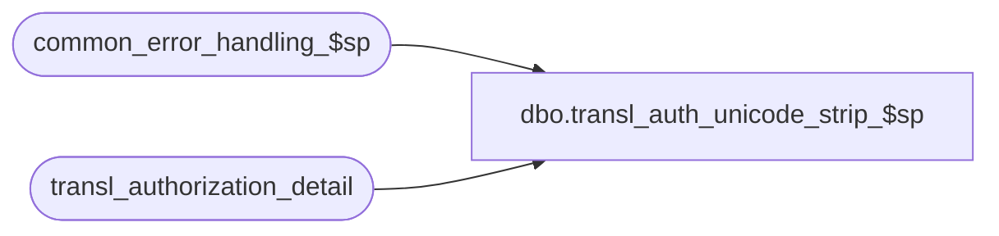

# dbo.transl_auth_unicode_strip_$sp

**Database:** auditworks  
**Server:** bedrockdb01  

## Architecture Diagram



## Table Dependencies

| Referenced Table |
|---|
| common_error_handling_$sp |
| transl_authorization_detail |

## Stored Procedure Code

```sql
CREATE proc [dbo].[transl_auth_unicode_strip_$sp] @edit_process_no tinyint = 1
AS
/* 
PROC NAME: transl_auth_unicode_strip_$sp
     DESC: This may be called by transl_pre_processing_$sp if activated as a hook via auditworks_parameter
           Replaces ÿ with ++ to emulate the MS SQL Server bulk-copy behaviour when faced with unicode charactes to be loaded into a database table without unicode support.
           Required by clients upgrading from S/A 5.0 to S/A 5.1 who do wish to allow unicode characters to feed correctly into the authorization attachment's approval message.
           
 HISTORY: 
Date      Name          Def# Desc
Feb04,16 Vicci    TFS-155689 Replaces occurrences of Uncertainty Sign � with ÿ in authorization attachment approval message.
Jun12,15 Vicci    TFS-125317 Replaces occurrences of FileSeparator with 1 Space, ª with -¬, Ç with +ç in authorization attachment approval message.           
Jun09,15 Vicci    TFS-125317 Replaces occurrences of ÿ with ++ in authorization attachment approval message.

*/

DECLARE  
  @errno                        int,
  @errmsg                       nvarchar(2000),
  @errmsg2			nvarchar(2000),
  @message_id			int,
  @object_name			nvarchar(255),
  @operation_name		nvarchar(100),
  @process_no			smallint,
  @process_name			nvarchar(100),
  @process_id                   binary(16),
  @user_id			int;
--
SELECT @process_no   = 290,  
       @process_name = 'transl_auth_unicode_strip_$sp',
       @message_id   = 201068,       
       @process_id = newid(),
       @user_id = -1;

BEGIN TRY
  --For clients with code-page/Translate-Type 1252 pollfiles that used to get mangled by bcp in 5.0 and that no longer do in 5.1 but that want them to continue to be mangled in 5.1 so they don't have to change their Settlement export
  SELECT @errmsg = 'Failed to replace code-page-1252 extended characters in approval_message with ++. ',
         @operation_name = 'UPDATE',
         @object_name = 'transl_authorization_detail';
  UPDATE transl_authorization_detail
     SET approval_message = replace(replace(replace(replace(approval_message, N'ÿ', '++'), N'ª', '-¬'), CHAR(28), ' '), N'Ç', N'+ç');

  --For clients with Unicode/Translate-Type 1 pollfiles that used to get read as code-page-1252 characters in early 5.1 translates but that get read according to Translate-Type config (i.e. as unicode characters) in 5.1 tranlstes, but that want them to continue to read as Code-Page 1252 even though they are configured as Unicode so they don't have to change their Settlement export nor correct their Translate TYpe configuration
  --Since these clients want the ÿ, this is done AFTER replacement above.
  SELECT @errmsg = 'Failed to replace unicode characters in approval_message with code-page-1252 characters.  ',
         @operation_name = 'UPDATE',
         @object_name = 'transl_authorization_detail';
  UPDATE transl_authorization_detail
     SET approval_message = replace(approval_message, N'�', N'ÿ' COLLATE latin1_general_bin);
RETURN;
END TRY

BEGIN CATCH
  SELECT @errno = ERROR_NUMBER();
  IF @errmsg2 IS NULL
  BEGIN
    SELECT @errmsg2 = @process_name + ':  ' + COALESCE(@errmsg, '') + ERROR_MESSAGE() + ' Line: ' + CONVERT(nvarchar, ERROR_LINE());
  END;
  SELECT @errmsg = @errmsg2;  

  EXEC common_error_handling_$sp @process_no, @errno, @errmsg2, 0, @message_id, @process_name, @object_name, @operation_name, 1, @edit_process_no,
       0, null, 0, null, null, null, null, null, null, 0, @process_id, @user_id;
  
  RETURN;
END CATCH;
```

