# dbo.transl_auto_complete_order_06012016_$sp

**Database:** auditworks  
**Server:** bedrockdb01  

## Architecture Diagram

```mermaid
flowchart LR
    SP["dbo.transl_auto_complete_order_06012016_$sp"]
    ORG_CHN(["ORG_CHN"]) --> SP
    ORG_CHN_APLCTN_USG(["ORG_CHN_APLCTN_USG"]) --> SP
    auditworks_parameter(["auditworks_parameter"]) --> SP
    authorization_detail(["authorization_detail"]) --> SP
    av_authorization_detail(["av_authorization_detail"]) --> SP
    av_customer(["av_customer"]) --> SP
    av_customer_detail(["av_customer_detail"]) --> SP
    av_discount_detail(["av_discount_detail"]) --> SP
    av_line_note(["av_line_note"]) --> SP
    av_merchandise_detail(["av_merchandise_detail"]) --> SP
    av_stock_control_detail(["av_stock_control_detail"]) --> SP
    av_tax_detail(["av_tax_detail"]) --> SP
    av_tax_override_detail(["av_tax_override_detail"]) --> SP
    av_transaction_header(["av_transaction_header"]) --> SP
    av_transaction_line(["av_transaction_line"]) --> SP
    av_transaction_line_link(["av_transaction_line_link"]) --> SP
    code_description(["code_description"]) --> SP
    common_error_handling__sp(["common_error_handling_$sp"]) --> SP
    cust_liab_auto_compl_line(["cust_liab_auto_compl_line"]) --> SP
    cust_liability(["cust_liability"]) --> SP
    cust_liability_detail(["cust_liability_detail"]) --> SP
    cust_liability_detail_history(["cust_liability_detail_history"]) --> SP
    cust_liability_reference_type(["cust_liability_reference_type"]) --> SP
    customer(["customer"]) --> SP
    customer_detail(["customer_detail"]) --> SP
    discount_detail(["discount_detail"]) --> SP
    line_note(["line_note"]) --> SP
    line_object(["line_object"]) --> SP
    line_object_action_association(["line_object_action_association"]) --> SP
    line_object_action_attachment(["line_object_action_attachment"]) --> SP
    line_object_action_lookup(["line_object_action_lookup"]) --> SP
    line_object_lookup(["line_object_lookup"]) --> SP
    merchandise_detail(["merchandise_detail"]) --> SP
    parameter_general(["parameter_general"]) --> SP
    sku_sa(["sku_sa"]) --> SP
    stock_control_detail(["stock_control_detail"]) --> SP
    tax_detail(["tax_detail"]) --> SP
    tax_override_detail(["tax_override_detail"]) --> SP
    tax_subtotal_line_object(["tax_subtotal_line_object"]) --> SP
    transaction_header(["transaction_header"]) --> SP
    transaction_line(["transaction_line"]) --> SP
    transaction_line_link(["transaction_line_link"]) --> SP
    transl_authorization_detail(["transl_authorization_detail"]) --> SP
    transl_customer(["transl_customer"]) --> SP
    transl_customer_detail(["transl_customer_detail"]) --> SP
    transl_discount_detail(["transl_discount_detail"]) --> SP
    transl_geninfo_detail(["transl_geninfo_detail"]) --> SP
    transl_line_note(["transl_line_note"]) --> SP
    transl_merchandise_detail(["transl_merchandise_detail"]) --> SP
    transl_payroll_detail(["transl_payroll_detail"]) --> SP
    transl_pos_tax_detail(["transl_pos_tax_detail"]) --> SP
    transl_post_void_detail(["transl_post_void_detail"]) --> SP
    transl_return_detail(["transl_return_detail"]) --> SP
    transl_special_order_detail(["transl_special_order_detail"]) --> SP
    transl_stock_control_detail(["transl_stock_control_detail"]) --> SP
    transl_tax_override_detail(["transl_tax_override_detail"]) --> SP
    transl_transaction_hdr(["transl_transaction_hdr"]) --> SP
    transl_transaction_line(["transl_transaction_line"]) --> SP
    transl_transaction_line_link(["transl_transaction_line_link"]) --> SP
    trno(["trno"]) --> SP
    unit_datatype(["unit_datatype"]) --> SP
    upc_sa(["upc_sa"]) --> SP
    valid_line_object_type_action(["valid_line_object_type_action"]) --> SP
    work_auto_complete_fees(["work_auto_complete_fees"]) --> SP
    work_auto_complete_trans_dtl(["work_auto_complete_trans_dtl"]) --> SP
    work_auto_complete_trans_hdr(["work_auto_complete_trans_hdr"]) --> SP
    work_auto_complete_trans_line(["work_auto_complete_trans_line"]) --> SP
    work_cust_liab_auto_compl_line(["work_cust_liab_auto_compl_line"]) --> SP
```



## Table Dependencies

| Referenced Table |
|---|
| ORG_CHN |
| ORG_CHN_APLCTN_USG |
| auditworks_parameter |
| authorization_detail |
| av_authorization_detail |
| av_customer |
| av_customer_detail |
| av_discount_detail |
| av_line_note |
| av_merchandise_detail |
| av_stock_control_detail |
| av_tax_detail |
| av_tax_override_detail |
| av_transaction_header |
| av_transaction_line |
| av_transaction_line_link |
| code_description |
| common_error_handling_$sp |
| cust_liab_auto_compl_line |
| cust_liability |
| cust_liability_detail |
| cust_liability_detail_history |
| cust_liability_reference_type |
| customer |
| customer_detail |
| discount_detail |
| line_note |
| line_object |
| line_object_action_association |
| line_object_action_attachment |
| line_object_action_lookup |
| line_object_lookup |
| merchandise_detail |
| parameter_general |
| sku_sa |
| stock_control_detail |
| tax_detail |
| tax_override_detail |
| tax_subtotal_line_object |
| transaction_header |
| transaction_line |
| transaction_line_link |
| transl_authorization_detail |
| transl_customer |
| transl_customer_detail |
| transl_discount_detail |
| transl_geninfo_detail |
| transl_line_note |
| transl_merchandise_detail |
| transl_payroll_detail |
| transl_pos_tax_detail |
| transl_post_void_detail |
| transl_return_detail |
| transl_special_order_detail |
| transl_stock_control_detail |
| transl_tax_override_detail |
| transl_transaction_hdr |
| transl_transaction_line |
| transl_transaction_line_link |
| trno |
| unit_datatype |
| upc_sa |
| valid_line_object_type_action |
| work_auto_complete_fees |
| work_auto_complete_trans_dtl |
| work_auto_complete_trans_hdr |
| work_auto_complete_trans_line |
| work_cust_liab_auto_compl_line |

## Stored Procedure Code

```sql
create proc [dbo].[transl_auto_complete_order_06012016_$sp] AS
/* 
PROC NAME: transl_auto_complete_order_$sp
     NOTE: Changes made to this procedure should also be applied to reval_auto_complete_order_$sp
     DESC: Determines whether any transactions require auto-completion-from-order-item-SKU-lookup (presence of line_object = -5)
           If so, looks up the item's price, tax, discounts, ship-to-customer, etc and adds this information to the order.
           It then force balances the result against payment-applied in the case of a shipment or against order cancelled
           in the case of a cancellation.  In the latter case a payment-returned / tender credit is also auto-generated.
           Assumes (requirement) that transl discount not given.
           Assumes sku_id is given in pos_identifier for all items shipped, INCLUDING GIFT CARDS OTHER NON-MERCH (122171).
           Assumes reference_no is unique by chain (no key_store_no).
           Assumes pre-audit tax.
           Assumes all quantitites of a given SKU for a given order are subject to same price and taxation.
           Uses most recently posted (based on transaction_id) order for an item as basis for the auto-completion of its
            fulfillment or cancellation in terms of price and taxation.
           Assumes customer liability order tracking is in use and that history detail is being tracked.
           Uses "optimistic" approach namely does not attempt to prevent anomaly whereby an attempt to fulfill/cancel 
            same item multiple times is erroneous made, since C/L I/F Rejection should catch that later.
           Assumes 1 order per transaction (otherwise any header level attachments from original transaction would have to be moved to line level)
           Assumes customer information exists on item order transaction (even if it is an add-one).
           Repeats non-header customer information on each line.
           Relies on validations defined in configuration (mandatory merchandise_detail attachments, C/L validation) to 
            trap and reject issues, does not attempt to ensure payments were actually made, for example.
           Assumes that deposit/payment made at time item is ordered.
           Refunds payments on credit card if any otherwise books to object 615 (mail check for enterprise express) on
           assumption implementor with remap if necessary.
           
           Assumes that if linked-fees are to be auto-completed then the linked fee is only linked to 1 item in the original order.

           CALLED by edit_load_input_$sp and by transl_pre_processing_$sp.        
           
WIPWIP: probably need a few new transl indexes...
WIPWIPWIP:  also need to handle order return auto-completion at some point.

Please ensure that the proc script contains the following at the top in order to support scaleout:
SET ANSI_NULLS ON
SET ANSI_WARNINGS ON
 
HISTORY
Date       Name     Defect# Desc
May22,15  Vicci  TFS-122962 Log subtotal discount Coupon redemptins each on a separate line with its own coupon# specified 
                            (instead of merged together on one line with no coupon#.)
May12,15  Vicci  TFS-121230 Set @current_flag to 0 not 1 for auto-complete of fee tax from archive.
Feb16,15  Vicci  TFS-105890 Handle possibility of bad item data (invalid UPC and alpha POS ID) in auto-completion request.
Oct22,14  Vicci   TFS-81700 Copy merchandise attachment cost field from transl to work and back.  
                            Note:  cost at time of original order not relevant to fulfillment, nor even for cancellation where it should be treated like returns (new cost) for consistency.
Aug29,14  Vicci   TFS-81973 Correct handling of customer auto-completion to avoid dropping customer attachments when different roles came from different attachment styles (header vs line vs line link).
Aug27,14  Vicci   TFS-82676 Treat NULL lookup_pos_code as blank.
Mar24,14  Phu 150877 Fix duplicate key insert error in work_auto_complete_trans_line table.
Sep24,13  Vicci      146826 Take pos_identifier_type into account when more than 1 has been defined, and support SQL 2012.
Jul18,13  Vicci    1-4B5RFZ In the case where some of the fulfillment items for the transaction sent by ES have a valid SKU while others have an invalid
                            SKU and the transaction is therefore marked as not having been auto-completed and becoming a S/A reject, do not leave the
                            original order transaction items marked as being used by the current auto-completion process.
                            In the case where all items on the original order have already been marked as having being used by prior auto-completion processes,
                            still make an attempt to split lines with same SKU but different potential prices found in the current transaction.
Jan30,13  Vicci      141501 Join to header customer (cqh) base on cqh.line_id not cq.line_id.  
                            In the case of an order being placed in one store but sourced/picked up in another, the 
                            source/fulfillment store is logged on the order create (and controls tax) but missing on
                            the order cancellation (which poses a problem if the cancellation transaction comes from
                            ES or a store other than the fulfillment store), so auto-complete that information as well.
Oct18,12  Vicci      139068 Avoid Error 3936 Cannot insert the value NULL into column 'originating_transaction_id' by handling case where a markup has
                            been applied to a $0.00 fee in the original order create.
Oct16,12  Vicci      138933 If no deposit was originally taken (free merch ordered) and the current value of the delivery/cancellation is 0, 
                            then don't try to create a payment applied/order cancelled line.
Sep13,12  Vicci      138105 Don't delete Shipment Information (such as tracking ID), i.e. that associated with line-object 9003 line.
May16,12  Vicci      134811 Log transaction_date to cust_liab_auto_compl_line to support partitioning.
Jan19,12  Vicci      132481 Remove usage of data length function for substring extraction from unicode strings since it returns a length
                            of double that corresponding to the character positions within the string in the case of nvarchar and nchar data types.
May10,11  Vicci    1-46WV8T Log encrypted reference numbers to encrypted_reference_no, not to reference_no.
Dec15,10  Vicci      123492 Ensure that the item markdown is given its own line when it is processed after a subtotal discount for the same item and there aren't any other items.
Dec08,10  Vicci      122171 Don't merge lines with same sku_id but different serial numbers.
Dec07,10  Vicci      122171 Exclude fees identified with a sku_id in the original order from the "recognize upon
                            first shipment" process:  assume they will be explicitly fulfilled/cancelled by ES.
Dec02,10  Vicci      122171 Log attachments associated with linked-fees
Nov24,10  Vicci      122171 Auto-complete LINKED fees (like gift wrapping) when merch is delivered/cancelled, 
                            not lump sum upon first shipment (the way we do for shipping fees).
Nov19,10  Vicci      122171 Correct lookup of type UPC to also function when product ID is found in POS Identifier field;
			    Retain ref-type/refno attachment (gift cards) and serial# attachments.  Auto-complete gift-cards
			    as though they were merch (pre-requisite:  merch attachment for gift card in original transaction).
Sep17,10  Vicci      120863 Split completion lines if the units exceed those available on any line of the order create from archive.
Sep17,10  Vicci      120863 Split completion lines if the units exceed those available on any line of the order create from current.
Sep17,10  Vicci      120863 Don't merge completion lines if they don't have the same source/fulfillment store_no.
Sep17,10  Vicci      120863 Initialize @originating_line_id
Sep17,10  Vicci      120863 Ensure tax for correct fee line for the order is selected.
Sep17,10  Vicci      120863 Handle scenario where order create had 1 line with mutiple units and an extended price
                            which is not evenly divisible by the number of units in question (resulting in a unit price
                            with a fraction of a cent) and the fulfillment transaction lists the units on separate lines
                            resulting in a penny rounding difference.
Sep02,10  Vicci      120547 Handle scenario where order created has 2 lines at different prices for the same SKU with 
                            multiple units on each and the pickup transaction has 3 lines for the same SKU with units
  different than those originally ordered.
May25,10  Vicci      118118 If there is more than 1 item markdown on the same item, the second one get applied to the wrong item because
                            @applied_to_line_id was being set to item_line_id (although underlying transl_ line_id had been updated) instead
                            of leaving it set to previous value.
Apr30,10  Vicci      117518 When auto-completing orders, ensure that the line-note originally attached to the discount lines of the order create
                            are copied to the order completion.
Mar24,10  Vicci      116604 Ensure work_auto_complete_trans_line table line object is adjusted BEFORE its item_line_id 
			    stops matching that in the transl_transaction_line table, i.e. before the latter's line_id is 
			    changed by the discount inserts.
Mar22,10  Vicci      116604 Since some clients want to log even payment refund against original store, log the C/L attachment for tender lines 
                            generated by ES auto-completions.
			    For transactions originating from POS this is not possible since a transaction may have a mixture of orders or may include
			    regular sales and have only 1 tender line covering all.
Mar16,10  Vicci      116604 Log originating store number to stock-control-detail attachment to allow for Subledger posting to correct G/L account.
Mar16,10  Vicci      116421 Support merchandise attachment on fees.
Mar08,10  Vicci      116421 Take into account the fact the original merch line object sent in the auto-complete transaction
                            may since have been remapped as a result of looking up the orginal order when looking up the
                            taxed line-object for tax subtotalling purposes.
Mar04,10  Vicci      116421 Allow tax subtotalling to be configurable. Dave Henning / Richard Bosworth mandated this for Vitamin Shoppes despite multiple tax line-objects
                            for the same tax-level not being supported in the Subledger Posting if any tax-related G/L segment lookups
                            or tax-stripping is in use.
Mar02,10  Vicci	     116271 Avoid duplicate on insert error (transaction lines from which fees originated) by setting row-id.
Mar01,10  Paul       116271 Set @process_no
Feb26,10  Vicci      116271 When fees are to be recognized, recognize their associated tax as well (do fee assessment before tax assessment).
Oct07,09  Vicci      109078 Do not log any tax transaction line if the tax amount is $0.00.
Oct06,09  Vicci      109078 Work around issue of client config not using real reference type for credit-card/house-card
                            by interpreting user-defined reference-types as credit cards too if they are associated
                            with a known system-defined card-type in the authorization attachment.
Oct02,09  Vicci      109078 Remove cldh.SKU from GROUP BY, handle case where completion transactions that caused cust_liab_auto_compl_line
                            entries for order transaction have since been voided/deleted and entries are therefore obsolete through usage of
     new last_auto_completion_datetime field.
Oct01,09  Vicci     109078 In the even that more that 1 order exists in a transaction and only 1 of the 2 was successfully auto-completed
                            only mark the correct auto-completion request as being successful.
                      Handle corruption in merchandise master tables (multiple SKU_ID for same POS_IDENTIFIER) by giving preference to
                            whichever SKU_ID was used in the previous order on lookup.
Sep08,2009 Vicci     109078 Ensure that auto-completion logic is only applied to for the specific reference number identified in the request.
Aug14,2009 Vicci     109078 Change merchandise line-object in order completion transactions to match that of the original order.
Jun11,2009 Vicci     109078 Clean up transaction bearing auto-complete request before beginning auto-completion;
                            Set not_found flag to true by default in case no items to be auto-completed exist in transaction with request.
                            Support not receiving SKU in POS ID.
                            Ensure that fees aren't recognized twice if more that 1 shipment transaction for same order is in same batch.
                            Don't log a payment refund tender line if POS already has.
May26,2009 Vicci     109078 Make upc_no match that of original transaction since multiple UPC may exist for same SKU but C/L needs them to match.
Apr07,2009 Vicci     109078 Author
*/

DECLARE
  @cursor_open			tinyint,
  @errno                        int,
  @errmsg                       nvarchar(2000),
  @message_id			int,
  @object_name			nvarchar(255),
  @operation_name		nvarchar(100),
  @process_no			smallint,
  @process_id			binary(16),
  @process_name			nvarchar(100),
  @current_rows			int,
  @cleanup_rows			int,
  @archive_rows			int,
  @rows_to_complete		int,
  @rows_found			int,
  @refund_rows			int,
  @sql_command 			nvarchar(4000),
  @store_no			int,
  @register_no		        smallint,
  @entry_date_time		datetime,
  @transaction_series		nchar(1),
  @transaction_no		trno,
  @line_object			smallint,
  @order_line_object		smallint,
  @pmt_line_object		smallint,
  @originating_tender_line_tran nchar(20),
  @line_action			tinyint,
  @reference_no			nvarchar(20),
  @reference_type 		tinyint,
  @gross_line_amount		money,
  @max_line_id			numeric(5,0),
  @prior_store_no		int,
  @prior_register_no		smallint,
  @prior_entry_date_time	datetime,
  @prior_transaction_series	nchar(1),
  @prior_transaction_no		trno,
  @prior_item_line_id		numeric(5,0),
  @prior_item_level_flag	tinyint, 
  @prior_line_object		smallint,
  @prior_applied_by_line_id	numeric(5,0),
  @prior_orig_applied_by_line_id numeric(5,0),
  @item_line_id			numeric(5,0),
  @item_level_flag		tinyint,
  @pos_discount_level		tinyint,
  @pos_discount_serial_no	nvarchar(20),
  @applied_by_line_id		numeric(5,0),
  @applied_to_line_id		numeric(5,0),
  @line_adj			smallint,
  @sort_key			smallint,
  @tender_line_id 		numeric(5,0),
  @tender_transaction_id 	numeric(14,0),
  @current_flag			tinyint,
  @lookup_pos_code		nvarchar(500),
  @trace_msg			nvarchar(500),
  @object_action_lookup_first   smallint,
  @unused_line_id		numeric(5,0),
  @original_applied_by_line_id  numeric(5,0),
  @originating_transaction_id	numeric(14,0),
  @originating_line_id          numeric(5,0), 
  @row_id			numeric(20,0), 
  @sku_id			numeric(14,0), 
  @reference_no_length		tinyint,
  @rows				int,
  @units			unit_datatype,
  @auto_completion_datetime	datetime,
  @originating_store_no		int,
  @originating_transaction_date	smalldatetime,
  @min_unit_originating_line_id nvarchar(30),  --format:  units_outstanding/line_id
  @rows_to_merge		int,
  @units_available		unit_datatype,
  @max_row_id			numeric(20,0),
  @min_row_id			numeric(20,0),
  @next_row_id			numeric(20,0),
  @line_split_so_repeat		tinyint,
  @new_item_line_id		numeric(5,0),
  @unit_ratio			unit_datatype,
  @multiple_pos_id_types_exist	tinyint,
  @errmsg2			nvarchar(2000);


/*

CREATE TABLE work_auto_complete_fees(process_id int not null, reference_no nvarchar(20) not null, reference_type tinyint not null, line_object smallint not null)

*/


IF NOT EXISTS (SELECT 1 FROM line_object where line_object = -5 and active_flag = 1)
  RETURN;

SELECT @process_id = @@spid,
       @process_name = 'transl_auto_complete_order_$sp',
       @message_id = 201068,
       @object_action_lookup_first = 0,
       @auto_completion_datetime = getdate(),
       @process_no = 1,
   @rows_to_merge = 0,
       @operation_name = 'SELECT'; 

BEGIN TRY

SELECT @errmsg = 'Failed to determine if multiple POS Identifier Types have been defined. ',
       @object_name = 'code_description';
SELECT @multiple_pos_id_types_exist = CASE WHEN COUNT(1) > 1 THEN 1 ELSE 0 END
  FROM code_description
 WHERE code_type = 68
   AND code > 0  --(don't count the 'please log what has been given in the pos_identifier field to the upc_no field instead' request)
   AND code <> 100  --(C/L ref# reassignment)
   AND active_flag = 1;

SELECT @errmsg = 'Failed to create temp table. ',
       @object_name = '#merge_auto_complete_line',
       @operation_name = 'CREATE TABLE';
CREATE TABLE #merge_auto_complete_line (
       process_id binary(16) not null,
       store_no int not null,
       register_no smallint not null,
       entry_date_time datetime not null,
       transaction_series nchar(1) not null,
       transaction_no int not null,
       reference_no nvarchar(20) not null,
       reference_type tinyint not null,
       line_action tinyint not null,
       source_store_no int null, 
       fulfillment_store_no int null,
       originating_transaction_id numeric(14,0) not null,
       originating_line_id numeric(5,0) not null,
       current_flag tinyint not null,
       sum_units numeric(15,4) not null,
       min_row_id numeric(20,0) not null,
       serial_no	nvarchar(80) null);

SELECT @errmsg = 'Failed to clean up list of transactions to be auto-completed. ',
       @object_name = 'work_auto_complete_trans_hdr',
       @operation_name = 'DELETE';
DELETE work_auto_complete_trans_hdr
 WHERE process_id = @process_id;

SELECT @errmsg = 'Failed to clean up list of transaction items to be auto-completed. ',
       @object_name = 'work_auto_complete_trans_dtl';
DELETE work_auto_complete_trans_dtl
 WHERE process_id = @process_id;

SELECT @errmsg = 'Failed to clean up list of transaction items which may be be auto-completed. ',
       @object_name = 'work_auto_complete_trans_line';
DELETE work_auto_complete_trans_line
WHERE process_id = @process_id;

SELECT @errmsg = 'Failed to clean up list of auto-completed fees. ',
       @object_name = 'work_auto_complete_fees';
DELETE work_auto_complete_fees
WHERE process_id = @process_id;

--Defect 1-4B5RFZ
SELECT @errmsg = 'Failed to clean up list of which of multiple lines for same sku/order were used in this run. ',
       @object_name = 'work_cust_liab_auto_compl_line';
DELETE work_cust_liab_auto_compl_line
WHERE process_id = @process_id;

SELECT @errmsg = 'Failed to find list of transactions to be auto-completed. ',
       @object_name = 'work_auto_complete_trans_hdr',
       @operation_name = 'INSERT';
INSERT INTO work_auto_complete_trans_hdr(
       process_id, store_no, register_no, entry_date_time, transaction_series, transaction_no, 
       transaction_category, reversal_sign, not_found_flag, reference_no)
SELECT DISTINCT @process_id, 
       h.store_no, h.register_no, h.entry_date_time, h.transaction_series, h.transaction_no, 
       h.transaction_category, CASE WHEN h.trans_void_flag = 8 THEN -1 ELSE 1 END as reversal_sign, 1, l.reference_no 
  FROM transl_transaction_line l  WITH (NOLOCK)
       INNER JOIN transl_transaction_hdr h WITH (NOLOCK)
          ON h.store_no = l.store_no
         AND h.register_no = l.register_no
         AND h.entry_date_time = l.entry_date_time
         AND h.transaction_series = l.transaction_series
         AND h.transaction_no = l.transaction_no
         AND h.trans_void_flag in (0,8)     
 WHERE l.line_void_flag = 0
   AND l.line_object = -5;
SELECT @rows_found = @@rowcount;

IF @rows_found < 1
  RETURN;

SELECT @trace_msg = NCHAR(13) + NCHAR(10) + ':LOG && transl_auto_complete_order_$sp rows found: ' + convert(nvarchar, @rows_found) + ' ' + CONVERT(nchar, getdate(), 8);
PRINT @trace_msg;

SELECT @errmsg = 'Failed to update lookup_store. ',
       @object_name = 'transl_transaction_line',
       @operation_name = 'UPDATE'; 
UPDATE transl_transaction_line
   SET lookup_store = rd.return_from_store
  FROM work_auto_complete_trans_hdr w WITH (NOLOCK), 
 transl_return_detail rd WITH (NOLOCK), 
       ORG_CHN_APLCTN_USG ss,
       transl_transaction_line tl, ORG_CHN c
 WHERE w.process_id = @process_id
   AND w.store_no = rd.store_no
   AND w.register_no = rd.register_no
   AND w.entry_date_time = rd.entry_date_time
   AND w.transaction_series = rd.transaction_series
   AND w.transaction_no = rd.transaction_no
   AND rd.return_from_store IS NOT NULL  
   AND rd.return_from_store = ss.ORG_CHN_NUM 
   AND ss.APLCTN_ID = 300
   AND ss.VLDTY = 1
   AND ss.ORG_CHN_NUM = c.ORG_CHN_NUM
   AND c.ACTV = 1
   AND rd.store_no = tl.store_no
   AND rd.register_no = tl.register_no
   AND rd.entry_date_time = tl.entry_date_time
   AND rd.transaction_no = tl.transaction_no
   AND rd.transaction_series = tl.transaction_series
   AND (rd.line_id = tl.line_id OR rd.line_id = 0);

SELECT @errmsg = 'Failed to update lookup_store from line link. ';
UPDATE transl_transaction_line
   SET lookup_store = return_from_store
  FROM work_auto_complete_trans_hdr w, 
       transl_return_detail rd WITH (NOLOCK),
       transl_transaction_line_link k WITH (NOLOCK),
       ORG_CHN_APLCTN_USG ss,
       transl_transaction_line tl,
       ORG_CHN c 
 WHERE w.process_id = @process_id
   AND w.store_no = rd.store_no
   AND w.register_no = rd.register_no
   AND w.entry_date_time = rd.entry_date_time
   AND w.transaction_series = rd.transaction_series
   AND w.transaction_no = rd.transaction_no
   AND rd.return_from_store IS NOT NULL  
   AND rd.return_from_store = ss.ORG_CHN_NUM 
   AND ss.APLCTN_ID = 300
   AND ss.VLDTY = 1
   AND ss.ORG_CHN_NUM = c.ORG_CHN_NUM
   AND c.ACTV = 1
   AND k.store_no = rd.store_no
   AND k.register_no = rd.register_no
   AND k.entry_date_time = rd.entry_date_time
   AND k.transaction_no = rd.transaction_no
   AND k.transaction_series = rd.transaction_series
   AND k.linked_line_id = rd.line_id   
   AND k.store_no = tl.store_no
   AND k.register_no = tl.register_no
   AND k.entry_date_time = tl.entry_date_time
   AND k.transaction_no = tl.transaction_no
   AND k.transaction_series = tl.transaction_series
   AND k.line_id = tl.line_id; 

SELECT @errmsg = 'Failed to determine sequence of lookups. ',
       @object_name = 'auditworks_parameter',
       @operation_name = 'SELECT';
IF EXISTS (SELECT 1
             FROM auditworks_parameter
            WHERE par_name = 'object_action_lookup_first'
              AND par_value = '1')
  SELECT @object_action_lookup_first = 1
 
SELECT @object_name = 'transl_transaction_line',
       @operation_name = 'UPDATE';

IF @object_action_lookup_first = 0
BEGIN
  SELECT @errmsg = 'Failed to update transl_transaction_line (line_object_adjusment). ';
  UPDATE transl_transaction_line
     SET line_object = lol.line_object,
         line_object_adjustment = 0
    FROM work_auto_complete_trans_hdr w WITH (NOLOCK), transl_transaction_line tl, line_object_lookup lol
   WHERE w.process_id = @process_id
     AND w.store_no = tl.store_no
     AND w.register_no = tl.register_no
     AND w.entry_date_time = tl.entry_date_time
     AND w.transaction_series = tl.transaction_series
     AND w.transaction_no = tl.transaction_no
     AND (tl.line_object + tl.line_object_adjustment) = lol.lookup_line_object
     AND ISNULL(lookup_store,tl.store_no) = lol.store_no;
END;  --IF @object_action_lookup_first = 0

/* If parameter object_action_lookup_flag is on, updates line_object and 
   line_action in transl_transaction_line with those found in 
 line_object_action_lookup table */
IF (SELECT object_action_lookup_flag FROM parameter_general) != 0 
BEGIN
  SELECT @errmsg = 'Failed to update transl_transaction_line (line_object,' + ' line_action) via line_object_action_lookup table. ';
  UPDATE transl_transaction_line
     SET line_object = loal.line_object,
         line_action = loal.line_action,
         line_object_adjustment = 0
    FROM work_auto_complete_trans_hdr w WITH (NOLOCK), 
         transl_transaction_line tl,
         line_object_action_lookup loal   
   WHERE w.process_id = @process_id
     AND w.store_no = tl.store_no
     AND w.register_no = tl.register_no
     AND w.entry_date_time = tl.entry_date_time
     AND w.transaction_series = tl.transaction_series
     AND w.transaction_no = tl.transaction_no
     AND tl.line_action = loal.lookup_line_action
     AND tl.line_object = loal.lookup_line_object
     AND COALESCE(tl.lookup_pos_code, ' ') = loal.lookup_pos_code
     AND loal.lookup_code_type = 0; -- for pos lookup

  IF EXISTS (SELECT lookup_code_type FROM line_object_action_lookup WHERE lookup_code_type = 1)  -- for upc lookup
  BEGIN
    SELECT @errmsg = 'Failed to update transl_transaction_line (line_object,' + ' line_action) via line_object_action_lookup table transl_merchandis_detail. ';
    UPDATE transl_transaction_line
       SET line_object = loal.line_object,
           line_action = loal.line_action,
           line_object_adjustment = 0,
           lookup_pos_code = CONVERT(nvarchar(20),ml.upc_no)
      FROM work_auto_complete_trans_hdr w WITH (NOLOCK), 
           transl_merchandise_detail ml WITH (NOLOCK),
           transl_transaction_line tl,
           line_object_action_lookup loal
     WHERE w.process_id = @process_id
       AND w.store_no = tl.store_no
       AND w.register_no = tl.register_no
       AND w.entry_date_time = tl.entry_date_time
       AND w.transaction_series = tl.transaction_series
       AND w.transaction_no = tl.transaction_no
       AND tl.store_no = ml.store_no
       AND tl.register_no = ml.register_no
       AND tl.entry_date_time = ml.entry_date_time
       AND tl.transaction_no = ml.transaction_no
       AND tl.transaction_series = ml.transaction_series
       AND tl.line_id = ml.line_id
       AND tl.line_action = loal.lookup_line_action
       AND tl.line_object = loal.lookup_line_object
       AND loal.lookup_pos_code = CASE WHEN ml.upc_no > 0 THEN CONVERT(nvarchar(20), ml.upc_no) ELSE ml.pos_identifier END --122171
       AND loal.lookup_code_type = 1; 
  END; --IF EXISTS (SELECT lookup_code_type FROM line_object_action_lookup WHERE lookup_code_type = 1)  -- for upc lookup

  IF EXISTS (SELECT lookup_code_type FROM line_object_action_lookup WHERE lookup_code_type = 2)  -- for pos_deptclass lookup
  BEGIN
    SELECT @errmsg = 'Failed to update transl_transaction_line (line_object,' + ' line_action) via line_object_action_lookup table transl_merchandis_detail. ';
    UPDATE transl_transaction_line
       SET line_object = loal.line_object,
           line_action = loal.line_action,
           line_object_adjustment = 0,
           lookup_pos_code = CONVERT(nvarchar(20),ml.pos_deptclass)
      FROM work_auto_complete_trans_hdr w WITH (NOLOCK), 
           transl_merchandise_detail ml WITH (NOLOCK),
           transl_transaction_line tl WITH (NOLOCK),
           line_object_action_lookup loal
     WHERE w.process_id = @process_id
       AND w.store_no = tl.store_no
       AND w.register_no = tl.register_no        
       AND w.entry_date_time = tl.entry_date_time
       AND w.transaction_series = tl.transaction_series
       AND w.transaction_no = tl.transaction_no
       AND tl.store_no = ml.store_no
       AND tl.register_no = ml.register_no
       AND tl.entry_date_time = ml.entry_date_time
       AND tl.transaction_no = ml.transaction_no
       AND tl.transaction_series = ml.transaction_series
       AND tl.line_id = ml.line_id
       AND tl.line_action = loal.lookup_line_action
       AND tl.line_object = loal.lookup_line_object        
       AND loal.lookup_pos_code = CONVERT(nvarchar(20), pos_deptclass)
       AND loal.lookup_code_type = 2;
  END;  --IF EXISTS (SELECT lookup_code_type FROM line_object_action_lookup WHERE lookup_code_type = 2)  -- for pos_deptclass lookup
END;  --IF (SELECT object_action_lookup_flag FROM parameter_general) != 0 

IF @object_action_lookup_first = 1
BEGIN
  SELECT @errmsg = 'Failed to update transl_transaction_line (line_object_adjusment) second. ';
  UPDATE transl_transaction_line
     SET line_object = lol.line_object,
         line_object_adjustment = 0
    FROM work_auto_complete_trans_hdr w WITH (NOLOCK), 
         transl_transaction_line tl, line_object_lookup lol
   WHERE w.process_id = @process_id
     AND w.store_no = tl.store_no
     AND w.register_no = tl.register_no
     AND w.entry_date_time = tl.entry_date_time
    AND w.transaction_series = tl.transaction_series        
     AND w.transaction_no = tl.transaction_no
     AND (tl.line_object + tl.line_object_adjustment) = lol.lookup_line_object
     AND ISNULL(lookup_store,tl.store_no) = lol.store_no
END;  --IF @object_action_lookup_first = 1

--If the Translate has requested an auto-completion of a POS order transaction, first remove any information provided 
--by POS other than the refund tender if any, the auto-complete request line itself, and the merch fulfilled/cancelled lines.
--Note that for the most part line-object-type cannot be used since most line-objects provided will be -3=based on lookup
SELECT @errmsg = 'Failed to find list of transaction lines to be deleted prior to commencing auto-completion process. ',
       @object_name = '#auto_complete_cleanup',
       @operation_name = 'CREATE';
SELECT del.store_no, del.register_no, del.entry_date_time, del.transaction_series, del.transaction_no, del.line_id, COALESCE(sign(m.line_id), 0) merch_flag 
  INTO #auto_complete_cleanup
  FROM transl_transaction_line auto WITH (NOLOCK)
       INNER JOIN transl_transaction_line del WITH (NOLOCK)
          ON auto.store_no = del.store_no
         AND auto.register_no = del.register_no
         AND auto.entry_date_time = del.entry_date_time
         AND auto.transaction_series = del.transaction_series
         AND auto.transaction_no = del.transaction_no
         AND del.line_object <> 9003  --138105:  keep shipment info line
       LEFT OUTER JOIN transl_merchandise_detail m WITH (NOLOCK)
          ON del.store_no = m.store_no
         AND del.register_no = m.register_no
         AND del.entry_date_time = m.entry_date_time
         AND del.transaction_series = m.transaction_series
         AND del.transaction_no = m.transaction_no
         AND del.line_id = m.line_id
       LEFT OUTER JOIN line_object o
         ON del.line_object = o.line_object
 WHERE auto.line_void_flag = 0
   AND auto.line_object = -5
   AND auto.reference_no IS NOT NULL
   AND (auto.reference_no = del.reference_no 
        OR (o.line_object_type = 14 AND del.line_id <= auto.line_id))  --e.g. shipping/billing address
   AND del.line_object <> -5
   AND (o.line_object_type <> 6 OR o.line_object_type IS NULL);
SELECT @cleanup_rows = @@rowcount;

IF @cleanup_rows > 0
BEGIN
  SELECT @errmsg = 'Failed to clean up transl_transaction_line prior to commencing auto-completion process. ',
         @object_name = 'transl_transaction_line',
         @operation_name = 'DELETE';
  DELETE transl_transaction_line
    FROM #auto_complete_cleanup del
   WHERE transl_transaction_line.store_no = del.store_no
     AND transl_transaction_line.register_no = del.register_no
     AND transl_transaction_line.entry_date_time = del.entry_date_time
     AND transl_transaction_line.transaction_series = del.transaction_series
     AND transl_transaction_line.transaction_no = del.transaction_no
     AND transl_transaction_line.line_id = del.line_id
     AND del.merch_flag = 0;

  SELECT @errmsg = 'Failed to clean up transl_merchandise_detail prior to commencing auto-completion process. ',
         @object_name = 'transl_merchandise_detail';
  DELETE transl_merchandise_detail
    FROM #auto_complete_cleanup del
   WHERE transl_merchandise_detail.store_no = del.store_no
     AND transl_merchandise_detail.register_no = del.register_no
     AND transl_merchandise_detail.entry_date_time = del.entry_date_time
     AND transl_merchandise_detail.transaction_series = del.transaction_series
     AND transl_merchandise_detail.transaction_no = del.transaction_no
     AND transl_merchandise_detail.line_id = del.line_id
     AND del.merch_flag = 0

  SELECT @errmsg = 'Failed to clean up transl_authorization_detail prior to commencing auto-completion process. ',
         @object_name = 'transl_authorization_detail';
  DELETE transl_authorization_detail
    FROM #auto_complete_cleanup del
   WHERE transl_authorization_detail.store_no = del.store_no
     AND transl_authorization_detail.register_no = del.register_no
     AND transl_authorization_detail.entry_date_time = del.entry_date_time
     AND transl_authorization_detail.transaction_series = del.transaction_series
     AND transl_authorization_detail.transaction_no = del.transaction_no
     AND transl_authorization_detail.line_id = del.line_id

  SELECT @errmsg = 'Failed to clean up transl_stock_control_detail prior to commencing auto-completion process. ',
         @object_name = 'transl_stock_control_detail';
  DELETE transl_stock_control_detail
    FROM #auto_complete_cleanup del
   WHERE transl_stock_control_detail.store_no = del.store_no
     AND transl_stock_control_detail.register_no = del.register_no
     AND transl_stock_control_detail.entry_date_time = del.entry_date_time
     AND transl_stock_control_detail.transaction_series = del.transaction_series
     AND transl_stock_control_detail.transaction_no = del.transaction_no
     AND (transl_stock_control_detail.line_id = del.line_id 
     OR transl_stock_control_detail.line_id = 0)
     AND (merch_flag = 0 OR display_def_id NOT IN (53, 68));  --122171 retain ref-type/refno info (gift cards) and 138105 shipment info (such as tracking ID)

  SELECT @errmsg = 'Failed to clean up transl_line_note prior to commencing auto-completion process. ',
         @object_name = 'transl_line_note';
  DELETE transl_line_note
    FROM #auto_complete_cleanup del
   WHERE transl_line_note.store_no = del.store_no
     AND transl_line_note.register_no = del.register_no
     AND transl_line_note.entry_date_time = del.entry_date_time
     AND transl_line_note.transaction_series = del.transaction_series
     AND transl_line_note.transaction_no = del.transaction_no
     AND (transl_line_note.line_id = del.line_id OR transl_line_note.line_id = 0)
     AND (merch_flag = 0 OR note_type <> 9011); --122171 retain serial# information

  SELECT @errmsg = 'Failed to clean up transl_geninfo_detail prior to commencing auto-completion process. ',
         @object_name = 'transl_geninfo_detail';
  DELETE transl_geninfo_detail
    FROM #auto_complete_cleanup del
   WHERE transl_geninfo_detail.store_no = del.store_no
     AND transl_geninfo_detail.register_no = del.register_no
     AND transl_geninfo_detail.entry_date_time = del.entry_date_time
     AND transl_geninfo_detail.transaction_series = del.transaction_series
    AND transl_geninfo_detail.transaction_no = del.transaction_no
     AND (transl_geninfo_detail.line_id = del.line_id OR transl_geninfo_detail.line_id = 0);

  SELECT @errmsg = 'Failed to clean up transl_tax_override_detail prior to commencing auto-completion process. ',
         @object_name = 'transl_tax_override_detail';
  DELETE transl_tax_override_detail
    FROM #auto_complete_cleanup del
   WHERE transl_tax_override_detail.store_no = del.store_no
     AND transl_tax_override_detail.register_no = del.register_no
     AND transl_tax_override_detail.entry_date_time = del.entry_date_time
     AND transl_tax_override_detail.transaction_series = del.transaction_series
     AND transl_tax_override_detail.transaction_no = del.transaction_no
     AND (transl_tax_override_detail.line_id = del.line_id or transl_tax_override_detail.line_id = 0);

  SELECT @errmsg = 'Failed to clean up transl_special_order_detail prior to commencing auto-completion process. ',
         @object_name = 'transl_special_order_detail';
  DELETE transl_special_order_detail
 FROM #auto_complete_cleanup del
   WHERE transl_special_order_detail.store_no = del.store_no
     AND transl_special_order_detail.register_no = del.register_no
     AND transl_special_order_detail.entry_date_time = del.entry_date_time
     AND transl_special_order_detail.transaction_series = del.transaction_series
     AND transl_special_order_detail.transaction_no = del.transaction_no
     AND transl_special_order_detail.line_id = del.line_id;

  SELECT @errmsg = 'Failed to clean up transl_pos_tax_detail prior to commencing auto-completion process. ',
         @object_name = 'transl_pos_tax_detail';
  DELETE transl_pos_tax_detail
    FROM #auto_complete_cleanup del
   WHERE transl_pos_tax_detail.store_no = del.store_no
     AND transl_pos_tax_detail.register_no = del.register_no
     AND transl_pos_tax_detail.entry_date_time = del.entry_date_time
     AND transl_pos_tax_detail.transaction_series = del.transaction_series
     AND transl_pos_tax_detail.transaction_no = del.transaction_no
     AND transl_pos_tax_detail.line_id = del.line_id;

  SELECT @errmsg = 'Failed to clean up transl_customer prior to commencing auto-completion process. ',
         @object_name = 'transl_customer';
  DELETE transl_customer
    FROM #auto_complete_cleanup del
   WHERE transl_customer.store_no = del.store_no
     AND transl_customer.register_no = del.register_no
     AND transl_customer.entry_date_time = del.entry_date_time
     AND transl_customer.transaction_series = del.transaction_series
     AND transl_customer.transaction_no = del.transaction_no
     AND (transl_customer.line_id = del.line_id OR transl_customer.line_id = 0);

  SELECT @errmsg = 'Failed to clean up transl_customer_detail prior to commencing auto-completion process. ',
         @object_name = 'transl_customer_detail';
  DELETE transl_customer_detail
    FROM #auto_complete_cleanup del
   WHERE transl_customer_detail.store_no = del.store_no
     AND transl_customer_detail.register_no = del.register_no
     AND transl_customer_detail.entry_date_time = del.entry_date_time
     AND transl_customer_detail.transaction_series = del.transaction_series
     AND transl_customer_detail.transaction_no = del.transaction_no
     AND (transl_customer_detail.line_id = del.line_id OR transl_customer_detail.line_id = 0);

  SELECT @errmsg = 'Failed to clean up transl_transaction_line_link prior to commencing auto-completion process. ',
         @object_name = 'transl_transaction_line_link';
  DELETE transl_transaction_line_link
    FROM #auto_complete_cleanup del
   WHERE transl_transaction_line_link.store_no = del.store_no
     AND transl_transaction_line_link.register_no = del.register_no
     AND transl_transaction_line_link.entry_date_time = del.entry_date_time
     AND transl_transaction_line_link.transaction_series = del.transaction_series
     AND transl_transaction_line_link.transaction_no = del.transaction_no
  AND (transl_transaction_line_link.linked_line_id = del.line_id OR (transl_transaction_line_link.line_id = del.line_id 
          AND del.merch_flag = 0));  --138105 preserve link to shipment info line

  SELECT @errmsg = 'Failed to clean up transl_return_detail prior to commencing auto-completion process. ',
         @object_name = 'transl_return_detail';
  DELETE transl_return_detail
    FROM #auto_complete_cleanup del
   WHERE transl_return_detail.store_no = del.store_no
     AND transl_return_detail.register_no = del.register_no
     AND transl_return_detail.entry_date_time = del.entry_date_time
     AND transl_return_detail.transaction_series = del.transaction_series
     AND transl_return_detail.transaction_no = del.transaction_no
 AND (transl_return_detail.line_id = del.line_id OR transl_return_detail.line_id = 0)
     AND del.merch_flag = 0;

  SELECT @errmsg = 'Failed to clean up transl_payroll_detail prior to commencing auto-completion process. ',
         @object_name = 'transl_payroll_detail';
  DELETE transl_payroll_detail
   FROM #auto_complete_cleanup del
   WHERE transl_payroll_detail.store_no = del.store_no
     AND transl_payroll_detail.register_no = del.register_no
     AND transl_payroll_detail.entry_date_time = del.entry_date_time
     AND transl_payroll_detail.transaction_series = del.transaction_series
     AND transl_payroll_detail.transaction_no = del.transaction_no
     AND transl_payroll_detail.line_id = del.line_id;

  SELECT @errmsg = 'Failed to clean up transl_post_void_detail prior to commencing auto-completion process. ',
         @object_name = 'transl_post_void_detail';
  DELETE transl_post_void_detail
    FROM #auto_complete_cleanup del
   WHERE transl_post_void_detail.store_no = del.store_no
     AND transl_post_void_detail.register_no = del.register_no
     AND transl_post_void_detail.entry_date_time = del.entry_date_time
     AND transl_post_void_detail.transaction_series = del.transaction_series
     AND transl_post_void_detail.transaction_no = del.transaction_no
     AND transl_post_void_detail.line_id = del.line_id;

  SELECT @errmsg = 'Failed to clean up transl_discount_detail prior to commencing auto-completion process. ',
         @object_name = 'transl_discount_detail';
  DELETE transl_discount_detail
    FROM #auto_complete_cleanup del
   WHERE transl_discount_detail.store_no = del.store_no
     AND transl_discount_detail.register_no = del.register_no
     AND transl_discount_detail.entry_date_time = del.entry_date_time
     AND transl_discount_detail.transaction_series = del.transaction_series
     AND transl_discount_detail.transaction_no = del.transaction_no
     AND (transl_discount_detail.line_id = del.line_id OR transl_discount_detail.applied_by_line_id = del.line_id);

END  --IF @cleanup_rows > 0
 
SELECT @errmsg = 'Failed to find list of transaction items to be auto-completed and the last transaction id for the order in which they still exist. ',
       @object_name = 'work_auto_complete_trans_dtl',
       @operation_name = 'INSERT';
INSERT INTO work_auto_complete_trans_dtl(
       process_id, 
       store_no, register_no, entry_date_time, transaction_series, transaction_no,
       reference_no, reference_type, reversal_sign, 
       item_line_id, line_object, line_action, sku_id, units,
       source_store_no, fulfillment_store_no, cost,
       originating_transaction_id,
       reference_no_length,
       lookup_pos_code,
       transaction_category, 
       serial_no)
SELECT h.process_id, 
       h.store_no, h.register_no, h.entry_date_time, h.transaction_series, h.transaction_no, 
       RIGHT('00000000000000000000' + l.reference_no, clrt.reference_no_length), loaa.reference_type, h.reversal_sign, 
       m.line_id, l.line_object, l.line_action, MAX(COALESCE(cldh.sku_id,0)) sku_id, m.units,
       m.source_store_no, m.fulfillment_store_no, m.cost,
       MAX(cldh.process_key) originating_transaction_id,
       clrt.reference_no_length,
       l.lookup_pos_code,
       h.transaction_category,
       COALESCE(n.line_note, s.pos_identifier) serial_no 
  FROM work_auto_complete_trans_hdr h WITH (NOLOCK)
       INNER JOIN transl_merchandise_detail m WITH (NOLOCK)
          ON m.store_no = h.store_no
         AND m.register_no = h.register_no
  AND m.entry_date_time = h.entry_date_time
         AND m.transaction_series = h.transaction_series
         AND m.transaction_no = h.transaction_no
       INNER JOIN transl_transaction_line l WITH (NOLOCK)
          ON m.store_no = l.store_no
         AND m.register_no = l.register_no
         AND m.entry_date_time = l.entry_date_time
         AND m.transaction_series = l.transaction_series
         AND m.transaction_no = l.transaction_no
         AND m.line_id = l.line_id
         AND l.line_void_flag = 0
         AND h.reference_no = l.reference_no
       INNER JOIN line_object_action_association loaa        
          ON h.transaction_category = loaa.transaction_category
         AND l.line_object = loaa.line_object
         AND l.line_action = loaa.line_action
       INNER JOIN cust_liability_reference_type clrt WITH (NOLOCK)
          ON loaa.reference_type = clrt.reference_type
        LEFT OUTER JOIN line_object_action_attachment attl
          ON loaa.transaction_category = COALESCE(attl.transaction_category, loaa.transaction_category)
         AND loaa.line_object = attl.line_object
         AND loaa.line_action = attl.line_action
         AND attl.attachment_type = 1
        LEFT OUTER JOIN sku_sa ss
          ON m.upc_no = 0 
         AND substring(m.pos_identifier + '00000000000000000000',1,20) != '00000000000000000000' --54148 
         AND m.pos_identifier = ss.sku
         AND (m.pos_identifier_type = ss.pos_identifier_type OR @multiple_pos_id_types_exist = 0)
         AND attl.upc_lookup_division = ss.upc_lookup_division
        LEFT OUTER JOIN upc_sa u
          ON attl.upc_lookup_division = u.upc_lookup_division
         AND COALESCE(ss.upc_no, m.upc_no) = u.upc_no
        LEFT OUTER JOIN cust_liability_detail_history cldh WITH (NOLOCK)
          ON RIGHT('00000000000000000000' + l.reference_no, clrt.reference_no_length) = cldh.reference_no
         AND loaa.reference_type = cldh.reference_type
         AND cldh.key_store_no = -1
         AND COALESCE(u.sku_id, CASE WHEN IsNumeric(m.pos_identifier) = 1 THEN convert(numeric(14,0), m.pos_identifier) ELSE NULL END) = cldh.sku_id
         AND cldh.units_outstanding > 0
         AND cldh.transaction_void_flag = 0
         AND cldh.interface_control_flag in (10, 30)
         AND cldh.discount_line_object IS NULL
	   AND (cldh.process_key IN (SELECT transaction_id
                                     FROM merchandise_detail m WITH (NOLOCK)
                                    WHERE cldh.process_key = m.transaction_id
                                      AND cldh.sku_id = m.sku_id
                                      AND cldh.upc_lookup_division = m.upc_lookup_division)
              OR
              cldh.process_key IN (SELECT av_transaction_id
                                     FROM av_merchandise_detail m WITH (NOLOCK)
                                    WHERE cldh.process_key = m.av_transaction_id
                                      AND cldh.sku_id = m.sku_id
                                      AND cldh.upc_lookup_division = m.upc_lookup_division))
       LEFT OUTER JOIN transl_line_note n WITH (NOLOCK)
          ON n.store_no = h.store_no
         AND n.register_no = h.register_no
         AND n.entry_date_time = h.entry_date_time
         AND n.transaction_series = h.transaction_series
         AND n.transaction_no = h.transaction_no
         AND n.line_id = l.line_id
         AND n.note_type = 9011  --serial#
	   AND n.line_note IS NOT NULL
       LEFT OUTER JOIN transl_stock_control_detail s WITH (NOLOCK)
          ON s.store_no = h.store_no
         AND s.register_no = h.register_no
         AND s.entry_date_time = h.entry_date_time
         AND s.transaction_series = h.transaction_series
         AND s.transaction_no = h.transaction_no
         AND s.line_id = l.line_id
         AND s.display_def_id = 53  --alt reference# such as gift card#
	   AND s.pos_identifier IS NOT NULL
 WHERE h.process_id = @process_id
 GROUP BY h.process_id, h.store_no, h.register_no, h.entry_date_time, h.transaction_series, h.transaction_no, 
       RIGHT('00000000000000000000' + l.reference_no, clrt.reference_no_length), loaa.reference_type, h.reversal_sign, 
       m.line_id, l.line_object, l.line_action, 
       m.units,
       m.source_store_no, m.fulfillment_store_no, m.cost, clrt.reference_no_length,
       l.lookup_pos_code, h.transaction_category, COALESCE(n.line_note, s.pos_identifier);
SELECT @rows_to_complete = @@rowcount;

SELECT @errmsg = 'Failed to indicate that transaction with auto-complete request has items which may be be auto-completed. ',
 @object_name = 'work_auto_complete_trans_hdr',
       @operation_name = 'UPDATE';
UPDATE work_auto_complete_trans_hdr
   SET not_found_flag = 0
 WHERE process_id = @process_id
   AND EXISTS (SELECT 1
                 FROM work_auto_complete_trans_dtl d WITH (NOLOCK)
                WHERE d.process_id = @process_id
                  AND work_auto_complete_trans_hdr.store_no = d.store_no
         AND work_auto_complete_trans_hdr.register_no = d.register_no
                  AND work_auto_complete_trans_hdr.entry_date_time = d.entry_date_time
                  AND work_auto_complete_trans_hdr.transaction_series = d.transaction_series
                  AND work_auto_complete_trans_hdr.transaction_no = d.transaction_no
                  AND RIGHT('00000000000000000000' + work_auto_complete_trans_hdr.reference_no, d.reference_no_length) = d.reference_no);

SELECT @errmsg = 'Failed to find line_id from which list of transaction items is to be auto-completed. ',
       @object_name = 'work_auto_complete_trans_line',
       @operation_name = 'INSERT';
INSERT work_auto_complete_trans_line(process_id, row_id,        
       store_no, register_no, entry_date_time, transaction_series, transaction_no, 
       item_line_id, reference_no, reference_type, line_object, line_action, source_store_no, fulfillment_store_no, units, 
       originating_transaction_id, originating_line_id, originating_units, originating_store_no, current_flag, originating_date,
       order_line_object, pmt_line_object, originating_tender_line_id,
       lookup_pos_code, originating_line_id2, sku_id, reference_no_length, transaction_category, serial_no)
SELECT @process_id, w.row_id, 
       w.store_no, w.register_no, w.entry_date_time, w.transaction_series, w.transaction_no, 
       w.item_line_id, w.reference_no, w.reference_type, w.line_object, w.line_action, w.source_store_no, w.fulfillment_store_no, w.units, 
       w.originating_transaction_id, MAX(IsNull(m.line_id, 0)), 0, cl.issuing_store_no, 1, cl.date_issued,
       MAX(CASE WHEN l.line_object_type = 20 THEN l.line_object ELSE 0 END) order_line_object,
       MAX(CASE WHEN l.line_object_type IN (3,8) THEN l.line_object ELSE 0 END) pmt_line_object,
       MAX(CASE WHEN l.line_object_type = 6 THEN l.line_id ELSE 0 END) originating_tender_line_id,
       w.lookup_pos_code, MIN(IsNull(m.line_id, 99999)), w.sku_id, w.reference_no_length, w.transaction_category, w.serial_no 
  FROM work_auto_complete_trans_dtl w WITH (NOLOCK)
       INNER JOIN transaction_line l  WITH (NOLOCK)
          ON w.originating_transaction_id = l.transaction_id
         AND l.line_void_flag = 0
         AND l.line_object_type IN (1, 3, 4, 8, 20, 6)  --122171:  added 4
         AND (RIGHT('00000000000000000000' + l.reference_no, w.reference_no_length) = w.reference_no OR l.line_object_type = 6)
       LEFT OUTER JOIN authorization_detail a WITH (NOLOCK) 
         ON l.transaction_id = a.transaction_id
        AND l.line_id = a.line_id
        AND a.card_type in ('A', 'C', 'D', 'E', 'I', 'J', 'M', 'V', 'H')
       LEFT OUTER JOIN merchandise_detail m WITH (NOLOCK)
          ON l.transaction_id = m.transaction_id
         AND l.line_id = m.line_id
         AND w.sku_id = m.sku_id
         AND m.units > 0
       INNER JOIN cust_liability cl  WITH (NOLOCK)
          ON w.reference_type = cl.reference_type
         AND w.reference_no = cl.reference_no
         AND cl.key_store_no = -1
 WHERE w.process_id = @process_id
   AND w.originating_transaction_id IS NOT NULL
   AND (l.line_object_type <> 6 OR l.reference_type in (1, 3) OR a.card_type in ('A', 'C', 'D', 'E', 'I', 'J', 'M', 'V', 'H'))  --only pick up house-card and credit card tenders, the rest will go to mail-check or clearing account.
 GROUP BY w.row_id, w.store_no, w.register_no, w.entry_date_time, w.transaction_series, w.transaction_no, w.item_line_id, w.reference_no, w.reference_type, w.line_object, w.line_action, w.source_store_no, w.fulfillment_store_no, w.units, w.originating_transaction_id, cl.issuing_store_no, cl.date_issued, w.lookup_pos_code, w.sku_id, w.reference_no_length, w.transaction_category, w.serial_no 
HAVING MAX(m.line_id) > 0;
SELECT @current_rows = @@rowcount;

IF @current_rows > 0  --original order found in current transaction tables
BEGIN
  SELECT @errmsg = 'Failed remove transaction items find in current transaction tables from the to-do list. ',
         @object_name = 'work_auto_complete_trans_dtl',
         @operation_name = 'DELETE';
  DELETE work_auto_complete_trans_dtl
    FROM work_auto_complete_trans_line w WITH (NOLOCK)
   WHERE w.row_id = work_auto_complete_trans_dtl.row_id
     AND w.process_id = @process_id 
     AND work_auto_complete_trans_dtl.process_id = @process_id; 

line_split_so_repeat:
  SELECT @errmsg = 'Failed to declare cursor to handle situation where same item ordered many times. ', 
         @object_name = 'multi_possible_line_cursor',
         @operation_name = 'DECLARE';
  DECLARE multi_possible_line_cursor CURSOR
      FOR
   SELECT w.originating_transaction_id, w.row_id, w.sku_id, w.reference_no_length, w.reference_no, w.units
     FROM work_auto_complete_trans_line w
    WHERE w.process_id = @process_id
      AND w.originating_line_id <> w.originating_line_id2
    ORDER BY w.originating_transaction_id, w.reference_no, w.sku_id, w.units DESC; --needs biggest units first to avoid using up a big-units order line on a little-units pickup line

  SELECT @errmsg = 'Failed to open cursor to handle situation where same item ordered many times. ', 
         @operation_name = 'OPEN';
  OPEN multi_possible_line_cursor;

  SELECT @cursor_open = 1, @line_split_so_repeat = 0;

  SELECT @errmsg = 'Failed to fetch cursor to handle situation where same item ordered many times. ', 
         @operation_name = 'FETCH';
  FETCH multi_possible_line_cursor
   INTO @originating_transaction_id, @row_id, @sku_id, @reference_no_length, @reference_no, @units;

 WHILE @@fetch_status = 0 AND @line_split_so_repeat = 0
  BEGIN
    SELECT @min_unit_originating_line_id = NULL, @originating_line_id = NULL

    --Assume that there is a line on the original order with a quantity outstanding sufficient to cover the current pickup line 
    SELECT @errmsg = 'Failed to find first item line not already used in auto-completion. ',         
           @object_name = 'merchandise_detail',
           @operation_name = 'SELECT'; 
    SELECT @min_unit_originating_line_id = MIN(convert(nvarchar, m.units - COALESCE(x.units_auto_completed, 0)) + '/' + convert(nvarchar,m.line_id))
      FROM merchandise_detail m WITH (NOLOCK)
           INNER JOIN transaction_line l  WITH (NOLOCK)
              ON l.transaction_id = m.transaction_id
             AND l.line_id = m.line_id
             AND l.line_void_flag = 0
             AND l.line_object_type IN (1, 3, 4, 8, 20, 6)  --122171:  added 4
           AND (RIGHT('00000000000000000000' + l.reference_no, @reference_no_length) = @reference_no)
            LEFT OUTER JOIN cust_liab_auto_compl_line x WITH (NOLOCK)
              ON m.transaction_id = x.transaction_id
             AND m.line_id = x.line_id
     WHERE @originating_transaction_id = m.transaction_id
       AND @sku_id = m.sku_id
       AND m.units > 0
       AND m.units - COALESCE(x.units_auto_completed, 0) >= @units; --select line with the least amount of units available but still enough to cover the amount being shipped 

    IF @min_unit_originating_line_id IS NOT NULL 
      SELECT @originating_line_id = CONVERT(INT, SUBSTRING(@min_unit_originating_line_id, CHARINDEX('/', @min_unit_originating_line_id) + 1, 5));
     
    IF @originating_line_id IS NULL  --assuming that although there was no line with enough units outstanding to cover the shipment, there is at least a line with some quantity outstanding.
    BEGIN
      SELECT @errmsg = 'Failed to find first item line not already completely used in auto-completion. ', 
             @object_name = 'merchandise_detail',
             @operation_name = 'SELECT';
      SELECT @min_unit_originating_line_id = MIN(convert(nvarchar, m.units - COALESCE(x.units_auto_completed, 0)) + '/' + convert(nvarchar,m.line_id))
        FROM merchandise_detail m
       INNER JOIN transaction_line l WITH (NOLOCK)
               ON l.transaction_id = m.transaction_id
              AND l.line_id = m.line_id
              AND l.line_void_flag = 0
              AND l.line_object_type IN (1, 3, 4, 8, 20, 6) --122171:  added 4
         AND (RIGHT('00000000000000000000' + l.reference_no, @reference_no_length) = @reference_no)
             LEFT OUTER JOIN cust_liab_auto_compl_line x WITH (NOLOCK)
               ON m.transaction_id = x.transaction_id
              AND m.line_id = x.line_id
       WHERE @originating_transaction_id = m.transaction_id
         AND @sku_id = m.sku_id
         AND m.units > 0
         AND m.units > IsNull(x.units_auto_completed, 0);

      --Defect 1-4B5RFZ start
      --assume pre-existing cust_liab_auto_compl_line entries must be obsolete
      IF @min_unit_originating_line_id IS NULL  --all units used up already, so ignore the ones used up in prior runs and try to at least avoid reusing the ones already picked up on the current run
      BEGIN
        SELECT @errmsg = 'Failed to find first item line not already completely used in the current auto-completion run. ';
        SELECT @min_unit_originating_line_id = MIN(convert(nvarchar, m.units - COALESCE(x.units_auto_completed, 0)) + '/' + convert(nvarchar,m.line_id))
          FROM merchandise_detail m
              INNER JOIN transaction_line l 
                 ON l.transaction_id = m.transaction_id
                AND l.line_id = m.line_id
                AND l.line_void_flag = 0
                AND l.line_object_type IN (1, 3, 8, 20, 6)
                AND (RIGHT('00000000000000000000' + l.reference_no, @reference_no_length) = @reference_no)
               LEFT OUTER JOIN cust_liab_auto_compl_line x
                 ON m.transaction_id = x.transaction_id
                AND m.line_id = x.line_id
                AND x.last_auto_completion_datetime >= @auto_completion_datetime
         WHERE @originating_transaction_id = m.transaction_id
           AND @sku_id = m.sku_id
           AND m.units > 0
           AND m.units > IsNull(x.units_auto_completed, 0);
      END;
     --Defect 1-4B5RFZ end

      --Try to split lines code:
      IF @min_unit_originating_line_id IS NOT NULL 
      BEGIN
        SELECT @originating_line_id = CONVERT(INT, SUBSTRING(@min_unit_originating_line_id, CHARINDEX('/', @min_unit_originating_line_id) + 1, 5)),
               @units_available =    CONVERT(NUMERIC(15,4), SUBSTRING(@min_unit_originating_line_id, 1, CHARINDEX('/', @min_unit_originating_line_id) - 1))

        SELECT @errmsg = 'Failed to find next available work_auto_complete_trans_line row-id;', 
               @object_name = 'work_auto_complete_trans_line',
               @operation_name = 'SELECT';
        SELECT @next_row_id = MAX(row_id) + 1
          FROM work_auto_complete_trans_line w
         WHERE w.process_id = @process_id; 

        SELECT @errmsg = 'Failed to find next available transaction line id. ';
        SELECT @new_item_line_id = MAX(l.line_id) + 1 
          FROM work_auto_complete_trans_line w
               INNER JOIN transl_transaction_line l
               ON l.store_no = w.store_no
	         AND l.register_no = w.register_no
                 AND l.entry_date_time = w.entry_date_time
        AND l.transaction_series = w.transaction_series
                 AND l.transaction_no = w.transaction_no
         WHERE w.process_id = @process_id
        AND w.row_id = @row_id;

        SELECT @errmsg = 'Failed to find split transl_transaction_line into new line id. ', 
               @object_name = 'transl_transaction_line',
           @operation_name = 'INSERT';
	INSERT into transl_transaction_line(
               store_no,
               register_no,
               entry_date_time,
               transaction_series,
               transaction_no,
               line_id,
        line_object,
               line_action,
               reference_no,
               reference_type,
               gross_line_amount,
               lookup_pos_code)
	SELECT l.store_no,
               l.register_no,
               l.entry_date_time,
               l.transaction_series,
               l.transaction_no,
               @new_item_line_id,
               l.line_object,
               l.line_action,
               l.reference_no,
               l.reference_type,
               l.gross_line_amount,
               l.lookup_pos_code
          FROM work_auto_complete_trans_line w
               INNER JOIN transl_transaction_line l
                  ON l.store_no = w.store_no
	         AND l.register_no = w.register_no
	         AND l.entry_date_time = w.entry_date_time
                 AND l.transaction_series = w.transaction_series
                 AND l.transaction_no = w.transaction_no
                 AND l.line_id = w.item_line_id 
         WHERE w.process_id = @process_id
           AND w.row_id = @row_id;

        SELECT @errmsg = 'Failed to find split transl_merchandise_detail into new line id. ', 
               @object_name = 'transl_merchandise_detail';
	INSERT into transl_merchandise_detail(
	       store_no,
	       register_no,
	       entry_date_time,
	       transaction_series,
	       transaction_no,
	       line_id,
	       merchandise_category,
	       upc_lookup_division,
	       upc_no,
	       units,
	       units_sign,
	       salesperson,
	       salesperson2,
	       price_override,
	       pos_iplu_missing,
	       pos_deptclass,
	       pos_no_hit_deptclass,
	       ticket_price,
	       sold_at_price,
	       pos_identifier,
	       scanned,
	       pos_identifier_type,
	       originating_store_no,
	       source_store_no,
	       fulfillment_store_no,
	       cost)
	SELECT l.store_no,
	       l.register_no,
	       l.entry_date_time,
	       l.transaction_series,
	       l.transaction_no,
	       @new_item_line_id,
	       l.merchandise_category,
	       l.upc_lookup_division,
	       l.upc_no,
	       @units - @units_available,
	       l.units_sign,
	       l.salesperson,
	       l.salesperson2,
	       l.price_override,
	       l.pos_iplu_missing,
	       l.pos_deptclass,
	       l.pos_no_hit_deptclass,
	       l.ticket_price,
	       l.sold_at_price,
	       l.pos_identifier,
	       l.scanned,
	       l.pos_identifier_type,
	       l.originating_store_no,
	       l.source_store_no,
	       l.fulfillment_store_no,
	       l.cost
          FROM work_auto_complete_trans_line w
               INNER JOIN transl_merchandise_detail l
         ON l.store_no = w.store_no
	         AND l.register_no = w.register_no
                 AND l.entry_date_time = w.entry_date_time
                 AND l.transaction_series = w.transaction_series
                 AND l.transaction_no = w.transaction_no
                 AND l.line_id = w.item_line_id 
         WHERE w.process_id = @process_id
           AND w.row_id = @row_id;
                     
        SELECT @errmsg = 'Failed to find split work_auto_complete_trans_line into new line id. ', 
    @object_name = 'work_auto_complete_trans_line';
        INSERT into work_auto_complete_trans_line(
               process_id,
               row_id,
               store_no,
               register_no,
               entry_date_time,
               transaction_series,
               transaction_no,
               item_line_id,
               reference_no,
               reference_type,
               line_action,
               units,
               originating_transaction_id,
               originating_line_id,
               originating_units,
               salesperson,
              salesperson2,
               price_override,
               pos_deptclass,
               upc_no,
               originating_store_no,
               originating_date,
               current_flag,
               order_line_object,
               pmt_line_object,
               originating_tender_line_id,
               lookup_pos_code,
               originating_line_id2,
               sku_id,
               reference_no_length,
               auto_complete_transaction_id,
               transaction_category,
               line_object,
               source_store_no,
               fulfillment_store_no)
        SELECT process_id,
               @next_row_id,
               store_no,
               register_no,
               entry_date_time,
               transaction_series,
               transaction_no,
               @new_item_line_id,
               reference_no,
               reference_type,
               line_action,
               @units - @units_available,
               originating_transaction_id,
               originating_line_id,
               originating_units,
               salesperson,
               salesperson2,
               price_override,
               pos_deptclass,
               upc_no,
               originating_store_no,
               originating_date,
               current_flag,
               order_line_object,
               pmt_line_object,
               originating_tender_line_id,
               lookup_pos_code,
               originating_line_id2,
               sku_id,
               reference_no_length,
               auto_complete_transaction_id,
               transaction_category,
               line_object,
               source_store_no,
               fulfillment_store_no
          FROM work_auto_complete_trans_line
         WHERE process_id = @process_id
           AND row_id = @row_id;
        
        SELECT @errmsg = 'Failed to reduce units to those available (line split). ', 
               @object_name = 'transl_merchandise_detail',
               @operation_name = 'UPDATE';
        UPDATE transl_merchandise_detail
           SET units = @units_available 
          FROM work_auto_complete_trans_line w
         WHERE w.process_id = @process_id
           AND w.row_id = @row_id
           AND transl_merchandise_detail.store_no = w.store_no
           AND transl_merchandise_detail.register_no = w.register_no
           AND transl_merchandise_detail.entry_date_time = w.entry_date_time
           AND transl_merchandise_detail.transaction_series = w.transaction_series
           AND transl_merchandise_detail.transaction_no = w.transaction_no
           AND transl_merchandise_detail.line_id = w.item_line_id;
        
        SELECT @errmsg = 'Failed to split work_auto_complete_trans_line row-id, original row. ',
               @object_name = 'work_auto_complete_trans_line';
        UPDATE work_auto_complete_trans_line
           SET units = @units_available
         WHERE process_id = @process_id
           AND row_id = @row_id;
        
     SELECT @units = @units_available,
               @line_split_so_repeat = 1;
      
   END;  --IF @min_unit_originating_line_id IS NOT NULL, i.e. row found but with insufficient units.
--END of attempt to split code

   
    END; --IF @originating_line_id IS NULL  --assuming there is at least a line with insufficient quantity outstanding available to cover the merch info for the current shipment.
    
    --Defect 1-4B5RFZ:  relocated above IF @originating_line_id IS NULL  --assume cust_liab_auto_compl_line entries must be obsolete
    
    IF @originating_line_id IS NOT NULL 
    BEGIN
      SELECT @errmsg = 'Failed to set first item line not already used in auto-completion. ',
             @object_name = 'work_auto_complete_trans_line',
@operation_name = 'UPDATE';
      UPDATE work_auto_complete_trans_line
     SET originating_line_id = @originating_line_id,
   	     originating_line_id2 = null
       WHERE process_id = @process_id
         AND row_id = @row_id;

           --Defect 1-4B5RFZ if some lines of the transaction have been auto-completed but other can't be and the auto-completion therefore is marked as failed the cust_liab_auto_compl_line updates for the items found will have to be reversed so keep track of them.
      SELECT @errmsg = 'Failed to list which line of an order with multiple lines for the same SKU was used in auto-completion for the current run. ',
             @object_name = 'work_cust_liab_auto_compl_line',
             @operation_name = 'INSERT';
      INSERT work_cust_liab_auto_compl_line(process_id, transaction_id, line_id, units_auto_completed, last_auto_completion_datetime, store_no, register_no, entry_date_time, transaction_series, transaction_no, reference_type, reference_no, reference_no_length)
      SELECT @process_id, @originating_transaction_id, @originating_line_id, @units, @auto_completion_datetime, store_no, register_no, entry_date_time, transaction_series, transaction_no, reference_type, reference_no, reference_no_length
        FROM work_auto_complete_trans_line w
       WHERE w.process_id = @process_id
         AND w.row_id = @row_id;

      SELECT @errmsg = 'Failed to indicate item line already used in auto-completion. ', 
             @object_name = 'cust_liab_auto_compl_line',
             @operation_name = 'UPDATE'; 
      UPDATE cust_liab_auto_compl_line
         SET units_auto_completed = units_auto_completed + @units,
   	     last_auto_completion_datetime = @auto_completion_datetime
       WHERE transaction_id = @originating_transaction_id
         AND line_id = @originating_line_id;
      SELECT @rows = @@rowcount;

      IF @rows < 1
      BEGIN
        SELECT @errmsg = 'Failed to determine transaction_date of order originating transaction id. ', 
               @object_name = 'transaction_header',
               @operation_name = 'SELECT';
        SELECT @originating_transaction_date = transaction_date  --Needed to support partitioning
          FROM transaction_header
         WHERE transaction_id = @originating_transaction_id;
         
        SELECT @errmsg = 'Failed to indicate item line already used in auto-completion. ', 
               @object_name = 'cust_liab_auto_compl_line',
               @operation_name = 'INSERT';
        INSERT cust_liab_auto_compl_line(transaction_id, line_id, units_auto_completed, last_auto_completion_datetime, transaction_date)
        VALUES(@originating_transaction_id, @originating_line_id, @units, @auto_completion_datetime, @originating_transaction_date);
        SELECT @rows = @@rowcount;
      END;
    END;  --IF @originating_line_id IS NOT NULL 

    IF @line_split_so_repeat = 0
    BEGIN
      SELECT @errmsg = 'Failed to fetch multi_possible_line_cursor. ', 
             @object_name = 'multi_possible_line_cursor',
             @operation_name = 'FETCH';
      FETCH multi_possible_line_cursor
       INTO @originating_transaction_id, @row_id, @sku_id, @reference_no_length, @reference_no, @units;
    END
    
  END --while not end of multi_possible_line_cursor

  SELECT @errmsg = 'Failed to close multi_possible_line_cursor. ', 
         @object_name = 'multi_possible_line_cursor',
         @operation_name = 'CLOSE';
  CLOSE multi_possible_line_cursor;
  
  SELECT @errmsg = 'Failed to deallocate multi_possible_line_cursor. ', 
         @object_name = 'multi_possible_line_cursor',
         @operation_name = 'DEALLOCATE';
  DEALLOCATE multi_possible_line_cursor;
  SELECT @cursor_open = 0;

  IF @line_split_so_repeat = 1
    GOTO line_split_so_repeat
    
  SELECT @errmsg = 'Failed to list lines for same order item that must be merged to avoid penny price rounding differences. ', 
         @object_name = '#merge_auto_complete_line',
         @operation_name = 'INSERT';
  INSERT into #merge_auto_complete_line(
         process_id,
         store_no,
         register_no,
         entry_date_time,
         transaction_series,
         transaction_no,
         reference_no,
         reference_type,
         line_action,
         source_store_no, fulfillment_store_no, serial_no, 
         originating_transaction_id,
         originating_line_id,
         current_flag,
         sum_units,
         min_row_id)
  SELECT process_id,
         store_no,
         register_no,
         entry_date_time,
         transaction_series,
         transaction_no,
         reference_no,
         reference_type,
         line_action,
         source_store_no, fulfillment_store_no, serial_no, 
         originating_transaction_id,
         originating_line_id,
         current_flag,
         sum(units),
         min(row_id)
    FROM work_auto_complete_trans_line
   WHERE process_id = @process_id
   GROUP BY process_id,
         store_no,
         register_no,
         entry_date_time,
         transaction_series,
         transaction_no,
         reference_no,
         reference_type,
         line_action,
         source_store_no, fulfillment_store_no, serial_no, 
         originating_transaction_id,
         originating_line_id,
         current_flag
  HAVING min(row_id) <> max(row_id);
  SELECT @rows_to_merge = @@rowcount;
  
  IF @rows_to_merge > 0
  BEGIN    
    SELECT @errmsg = 'Failed to the units of the first fulfillment row for the item to the total of all lines being merged. ', 
           @object_name = 'work_auto_complete_trans_line',
           @operation_name = 'UPDATE';
    UPDATE work_auto_complete_trans_line
       SET units = sum_units
      FROM #merge_auto_complete_line m
     WHERE work_auto_complete_trans_line.process_id = @process_id
       AND work_auto_complete_trans_line.row_id = m.min_row_id;

    SELECT @errmsg = 'Failed to build list of rows whose units have been merge onto the first fulfillment row for the item for cleanup from the work table. ', 
           @object_name = '#cleanup_merged_lines',
           @operation_name = 'CREATE';
    SELECT w.row_id, w.store_no, w.register_no, w.entry_date_time, w.transaction_series, w.transaction_no, w.item_line_id 
      INTO #cleanup_merged_lines
      FROM #merge_auto_complete_line m
           INNER JOIN work_auto_complete_trans_line w
              ON w.process_id = m.process_id
	     AND w.store_no = m.store_no
	     AND w.register_no = m.register_no
	     AND w.entry_date_time = m.entry_date_time
	     AND w.transaction_series = m.transaction_series
	     AND w.transaction_no = m.transaction_no
	     AND w.reference_no = m.reference_no
	     AND w.reference_type = m.reference_type
	     AND w.line_action = m.line_action
	     AND COALESCE(w.source_store_no, -1) = COALESCE(m.source_store_no, -1)
	     AND COALESCE(w.fulfillment_store_no, -1) = COALESCE(m.fulfillment_store_no, -1)
           AND COALESCE(w.serial_no, '-1') = COALESCE(m.serial_no, '-1') 
	     AND w.originating_transaction_id = m.originating_transaction_id
	     AND w.originating_line_id = m.originating_line_id
	     AND w.current_flag = m.current_flag
	   AND w.row_id <> m.min_row_id; 
	     
    SELECT @errmsg = 'Failed to remove rows whose units have been merge onto the first fulfillment row for the item from the work table. ', 
           @object_name = 'work_auto_complete_trans_line',
           @operation_name = 'DELETE';
    DELETE work_auto_complete_trans_line
      FROM #cleanup_merged_lines m
     WHERE work_auto_complete_trans_line.process_id = @process_id
       AND work_auto_complete_trans_line.row_id = m.row_id; 
     
    SELECT @errmsg = 'Failed to remove rows whose units have been merge onto the first fulfillment row for the item from the line table. ', 
           @object_name = 'transl_transaction_line';
    DELETE transl_transaction_line
      FROM #cleanup_merged_lines m
     WHERE transl_transaction_line.store_no = m.store_no
	     AND transl_transaction_line.register_no = m.register_no
	     AND transl_transaction_line.entry_date_time = m.entry_date_time
	     AND transl_transaction_line.transaction_series = m.transaction_series
	     AND transl_transaction_line.transaction_no = m.transaction_no
	     AND transl_transaction_line.line_id = m.item_line_id;

    SELECT @errmsg = 'Failed to remove rows whose units have been merge onto the first fulfillment row for the item from the merchandise table. ', 
           @object_name = 'transl_merchandise_detail';
    DELETE transl_merchandise_detail
      FROM #cleanup_merged_lines m
     WHERE transl_merchandise_detail.store_no = m.store_no
	     AND transl_merchandise_detail.register_no = m.register_no
	     AND transl_merchandise_detail.entry_date_time = m.entry_date_time
	     AND transl_merchandise_detail.transaction_series = m.transaction_series
	     AND transl_merchandise_detail.transaction_no = m.transaction_no
	     AND transl_merchandise_detail.line_id = m.item_line_id; 
	     
    SELECT @errmsg = 'Failed to remove rows whose units have been merge onto the first fulfillment row for the item from the return table. ', 
           @object_name = 'transl_return_detail';
    DELETE transl_return_detail
      FROM #cleanup_merged_lines m
     WHERE transl_return_detail.store_no = m.store_no
	     AND transl_return_detail.register_no = m.register_no
	     AND transl_return_detail.entry_date_time = m.entry_date_time
	     AND transl_return_detail.transaction_series = m.transaction_series
	     AND transl_return_detail.transaction_no = m.transaction_no
	     AND transl_return_detail.line_id = m.item_line_id;    
    
    SELECT @errmsg = 'Failed to remove list of lines for same order item that were merged to avoid penny price rounding differences. ',         
           @object_name = '#cleanup_merged_lines',
           @operation_name = 'DROP TABLE';
    DROP TABLE #cleanup_merged_lines;
    
  END; --IF @rows_to_merge > 0
  
  SELECT @errmsg = 'Failed to truncate list of lines requiring merging. ',
         @object_name = '#merge_auto_complete_line',
         @operation_name = 'TRUNCATE';
  TRUNCATE TABLE #merge_auto_complete_line;

  SELECT @errmsg = 'Failed to determine units available from original order line. ',
         @object_name = 'work_auto_complete_trans_line',
         @operation_name = 'UPDATE';
  UPDATE work_auto_complete_trans_line
     SET originating_units = m.units,  --note:  only need units in work table but might as well grab rest while we are at it.
         salesperson = m.salesperson, 
         salesperson2 = m.salesperson2, 
         price_override = m.price_override, 
         pos_deptclass = m.pos_deptclass,
         upc_no = m.upc_no,
         source_store_no = COALESCE(work_auto_complete_trans_line.source_store_no, m.source_store_no),
         fulfillment_store_no = COALESCE(work_auto_complete_trans_line.fulfillment_store_no, m.source_store_no)
    FROM merchandise_detail m WITH (NOLOCK)
   WHERE work_auto_complete_trans_line.process_id = @process_id
     AND work_auto_complete_trans_line.originating_line_id > 0
     AND work_auto_complete_trans_line.originating_transaction_id = m.transaction_id
     AND work_auto_complete_trans_line.originating_line_id = m.line_id;

  SELECT @errmsg = 'Failed to set merchandise details based on original order line. ',
         @object_name = 'transl_merchandise_detail';
  UPDATE transl_merchandise_detail
     SET salesperson = w.salesperson, 
         salesperson2 = w.salesperson2, 
         price_override = w.price_override, 
         pos_deptclass = w.pos_deptclass, 
         originating_store_no = w.originating_store_no,
         upc_no = w.upc_no,
         units = w.units,
         source_store_no = COALESCE(transl_merchandise_detail.source_store_no, w.source_store_no),
         fulfillment_store_no = COALESCE(transl_merchandise_detail.fulfillment_store_no, w.fulfillment_store_no)  --note, cost at time of original order not relevant to fulfillment, nor even for cancellation where it should be treated like returns (new cost) for consistency.
    FROM work_auto_complete_trans_line w WITH (NOLOCK)
   WHERE w.process_id = @process_id
     AND transl_merchandise_detail.store_no = w.store_no
     AND transl_merchandise_detail.register_no = w.register_no
     AND transl_merchandise_detail.entry_date_time = w.entry_date_time
     AND transl_merchandise_detail.transaction_series = w.transaction_series
     AND transl_merchandise_detail.transaction_no = w.transaction_no
     AND transl_merchandise_detail.line_id = w.item_line_id;

  SELECT @errmsg = 'Failed to set extended item price base on original order line. ',
         @object_name = 'transl_transaction_line';
  UPDATE transl_transaction_line
     SET gross_line_amount = round(l.gross_line_amount * w.units / w.originating_units, 2),
         reference_type = w.reference_type,
         reference_no = w.reference_no,
         line_object = l.line_object 
    FROM work_auto_complete_trans_line w WITH (NOLOCK),
         transaction_line l WITH (NOLOCK)
   WHERE w.process_id = @process_id
     AND transl_transaction_line.store_no = w.store_no
     AND transl_transaction_line.register_no = w.register_no
     AND transl_transaction_line.entry_date_time = w.entry_date_time
     AND transl_transaction_line.transaction_series = w.transaction_series
     AND transl_transaction_line.transaction_no = w.transaction_no
     AND transl_transaction_line.line_id = w.item_line_id
     AND w.originating_line_id > 0
     AND w.originating_transaction_id = l.transaction_id
     AND w.originating_line_id = l.line_id

  SELECT @errmsg = 'Auto complete customer information. ',
         @object_name = 'transl_customer',
         @operation_name = 'INSERT';
  INSERT into transl_customer(
       store_no,
       register_no,
       entry_date_time,
       transaction_series,
       transaction_no,
       line_id,
       customer_role,
       title,
       first_name,
       last_name,
       address_1,
       address_2,
       city,
       county,
       state,
       country,
       post_code,
       telephone_no1,
       telephone_no2,
       customer_no,
       pos_tax_jurisdiction_code,
       fax,
       email_address)
  SELECT DISTINCT q.store_no,
       q.register_no,
       q.entry_date_time,
       q.transaction_series,
       q.transaction_no,
       CASE WHEN q.cust_line_id = 0 THEN 0 ELSE q.item_line_id END,
       c.customer_role,
       c.title,
       c.first_name,
       c.last_name,
       c.address_1,
       c.address_2,
       c.city,
       c.county,
       c.state,
       c.country,
       c.post_code,
       c.telephone_no1,
  c.telephone_no2,
       c.customer_no,
       c.pos_tax_jurisdiction_code,
       c.fax,
       c.email_address
    FROM (SELECT wq.store_no, wq.register_no, wq.entry_date_time, wq.transaction_series, wq.transaction_no, wq.item_line_id,
      wq.originating_transaction_id, wq.originating_line_id, 
                 crole.customer_role,
                 MAX(COALESCE(cq.line_id, cql.line_id, cqh.line_id)) cust_line_id
            FROM work_auto_complete_trans_line wq WITH (NOLOCK)
             INNER JOIN customer crole WITH (NOLOCK)
                    ON wq.originating_transaction_id = crole.transaction_id
                 LEFT OUTER JOIN customer cq WITH (NOLOCK)
                         ON wq.originating_transaction_id = cq.transaction_id
                        AND wq.originating_line_id = cq.line_id
                        AND crole.customer_role = cq.customer_role
		 LEFT OUTER JOIN customer cqh WITH (NOLOCK)
		         ON wq.originating_transaction_id = cqh.transaction_id
                        AND 0 = cqh.line_id
                        AND crole.customer_role = cqh.customer_role
                 LEFT OUTER JOIN transaction_line_link ll WITH (NOLOCK)
                         ON wq.originating_transaction_id = ll.transaction_id
                        AND wq.originating_line_id = ll.line_id
                 LEFT OUTER JOIN customer cql WITH (NOLOCK)
                         ON ll.transaction_id = cql.transaction_id
                        AND ll.linked_line_id = cql.line_id 
                        AND crole.customer_role = cql.customer_role
           WHERE wq.process_id = @process_id 
             AND wq.originating_line_id > 0
    	   GROUP BY wq.store_no, wq.register_no, wq.entry_date_time, wq.transaction_series, wq.transaction_no, wq.item_line_id,
    		    wq.originating_transaction_id, wq.originating_line_id, crole.customer_role
           HAVING MAX(COALESCE(cq.line_id, cql.line_id, cqh.line_id)) IS NOT NULL) q
         INNER JOIN customer c WITH (NOLOCK)
           ON q.originating_transaction_id = c.transaction_id
           AND q.cust_line_id = c.line_id
           AND q.customer_role = c.customer_role; 

  SELECT @errmsg = 'Auto complete customer detail information',
         @object_name = 'transl_customer_detail';
  INSERT into transl_customer_detail(
       store_no,
       register_no,
       entry_date_time,
       transaction_series,
       transaction_no,
       line_id,
       customer_role,
       customer_info_type,
       customer_info)
  SELECT DISTINCT q.store_no,
       q.register_no,
       q.entry_date_time,
       q.transaction_series,
       q.transaction_no,
       CASE WHEN q.cust_line_id = 0 THEN 0 ELSE q.item_line_id END,
       c.customer_role,
       c.customer_info_type,
       c.customer_info
    FROM (SELECT wq.store_no, wq.register_no, wq.entry_date_time, wq.transaction_series, wq.transaction_no, wq.item_line_id,
                 wq.originating_transaction_id, wq.originating_line_id, 
                 crole.customer_role, 
                 MAX(COALESCE(cq.line_id, cql.line_id, cqh.line_id)) cust_line_id
            FROM work_auto_complete_trans_line wq WITH (NOLOCK)
                 INNER JOIN customer_detail crole WITH (NOLOCK)
                    ON wq.originating_transaction_id = crole.transaction_id
                 LEFT OUTER JOIN customer_detail cq WITH (NOLOCK)
                         ON wq.originating_transaction_id = cq.transaction_id
                        AND wq.originating_line_id = cq.line_id
                        AND crole.customer_role = cq.customer_role
                 LEFT OUTER JOIN customer_detail cqh WITH (NOLOCK)
              		 ON wq.originating_transaction_id = cqh.transaction_id
                        AND 0 = cqh.line_id
                        AND crole.customer_role = cqh.customer_role
                 LEFT OUTER JOIN transaction_line_link ll WITH (NOLOCK)
      ON wq.originating_transaction_id = ll.transaction_id
                        AND wq.originating_line_id = ll.line_id
 		 LEFT OUTER JOIN customer_detail cql WITH (NOLOCK)
                         ON ll.transaction_id = cql.transaction_id
                        AND ll.linked_line_id = cql.line_id           
          AND crole.customer_role = cql.customer_role
           WHERE wq.process_id = @process_id 
             AND wq.originating_line_id > 0
    	   GROUP BY wq.store_no, wq.register_no, wq.entry_date_time, wq.transaction_series, wq.transaction_no, wq.item_line_id,
    		    wq.originating_transaction_id, wq.originating_line_id, crole.customer_role
          HAVING MAX(COALESCE(cq.line_id, cql.line_id, cqh.line_id)) IS NOT NULL) q
         INNER JOIN customer_detail c WITH (NOLOCK)
            ON q.originating_transaction_id = c.transaction_id
           AND q.cust_line_id = c.line_id
           AND q.customer_role = c.customer_role; 

  SELECT @errmsg = 'Auto complete transl_line_note information',
         @object_name = 'transl_line_note';
  INSERT into transl_line_note(
         store_no,
         register_no,
         entry_date_time,
         transaction_series,
         transaction_no,
         line_id,
         note_type,
         line_note)
  SELECT w.store_no,
         w.register_no,
         w.entry_date_time,
         w.transaction_series,
         w.transaction_no,
         CASE WHEN n.line_id = 0 THEN 0 ELSE w.item_line_id END,
         n.note_type,
         MAX(n.line_note)
    FROM work_auto_complete_trans_line w WITH (NOLOCK)
         INNER JOIN line_note n WITH (NOLOCK)
            ON w.originating_transaction_id = n.transaction_id
     AND (w.originating_line_id = n.line_id 
                OR n.line_id = 0
                OR n.line_id IN (SELECT ll.linked_line_id
     FROM transaction_line_link ll WITH (NOLOCK)
                                  WHERE ll.transaction_id = w.originating_transaction_id
                                    AND ll.line_id = w.originating_line_id))
   WHERE w.process_id = @process_id 
     AND w.originating_line_id > 0
   GROUP BY w.store_no,
         w.register_no,
         w.entry_date_time,
         w.transaction_series,
         w.transaction_no,
         CASE WHEN n.line_id = 0 THEN 0 ELSE w.item_line_id END,
         n.note_type;

  SELECT @errmsg = 'Auto complete transl_stock_control_detail information',
         @object_name = 'transl_stock_control_detail';
  INSERT into transl_stock_control_detail(
         store_no,
         register_no,
         entry_date_time,
         transaction_series,
         transaction_no,
         line_id,
         upc_no,
         merchandise_key,
         initiated_by_host,
         units,
         other_store_no,
         location_no,
         vendor_no,
         count_date,
         pos_deptclass,
         pos_identifier,
         pos_identifier_type,
         upc_lookup_division,
         originating_store_no,
         display_def_id,
         reason,
         imrd)
  SELECT w.store_no,
         w.register_no,
         w.entry_date_time,
         w.transaction_series,
    	 w.transaction_no,
         CASE WHEN s.line_id = 0 THEN 0 ELSE w.item_line_id END,
         MAX(s.upc_no),
         MAX(s.merchandise_key),
         MAX(s.initiated_by_host),
         MAX(s.units),
         MAX(s.other_store_no),
         MAX(s.location_no),
         MAX(s.vendor_no),
         MAX(s.count_date),
    	 MAX(s.pos_deptclass),
         MAX(s.pos_identifier),
         MAX(s.pos_identifier_type),
         MAX(s.upc_lookup_division),
         MAX(s.originating_store_no),
         s.display_def_id,
         MAX(s.reason),
         MAX(s.imrd)    
    FROM work_auto_complete_trans_line w WITH (NOLOCK)
         INNER JOIN stock_control_detail s WITH (NOLOCK)
            ON w.originating_transaction_id = s.transaction_id
           AND (w.originating_line_id = s.line_id 
                OR s.line_id = 0
                OR s.line_id IN (SELECT ll.linked_line_id
                                   FROM transaction_line_link ll WITH (NOLOCK)
                                  WHERE ll.transaction_id = w.originating_transaction_id
  AND ll.line_id = w.originating_line_id))
   WHERE w.process_id = @process_id 
     AND w.originating_line_id > 0
     AND (s.display_def_id NOT IN (53, 68)	--138105
          OR NOT EXISTS (SELECT 1 FROM transl_stock_control_detail t 
                      WHERE w.store_no = t.store_no 
                        AND w.register_no = t.register_no
                        AND w.entry_date_time = t.entry_date_time
                        AND w.transaction_series = t.transaction_series
                        AND w.transaction_no = t.transaction_no
                        AND CASE WHEN s.line_id = 0 THEN 0 ELSE w.item_line_id END = t.line_id
                  AND s.display_def_id = t.display_def_id))
   GROUP BY w.store_no,
         w.register_no,
         w.entry_date_time,
         w.transaction_series,
         w.transaction_no,
         CASE WHEN s.line_id = 0 THEN 0 ELSE w.item_line_id END,
         s.display_def_id;

  SELECT @errmsg = 'Auto complete transl_tax_override_detail information',
         @object_name = 'transl_tax_override_detail';
  INSERT into transl_tax_override_detail(
         store_no, register_no, entry_date_time, transaction_series, transaction_no,
         line_id,
         tax_level,
         tax_category,
         taxable,
         exception_tax_jurisdiction,
         tax_exempt_no)
  SELECT w.store_no,
         w.register_no,
         w.entry_date_time,
         w.transaction_series,
         w.transaction_no,
         CASE WHEN t.line_id = 0 THEN 0 ELSE w.item_line_id END,
         tax_level,
         MAX(tax_category),
         MAX(taxable),
         MAX(exception_tax_jurisdiction),
         MAX(tax_exempt_no)
    FROM work_auto_complete_trans_line w WITH (NOLOCK)
         INNER JOIN tax_override_detail t WITH (NOLOCK)
            ON w.originating_transaction_id = t.transaction_id
           AND (w.originating_line_id = t.line_id 
                OR t.line_id = 0
                OR t.line_id IN (SELECT ll.linked_line_id
                                   FROM transaction_line_link ll WITH (NOLOCK)
                                  WHERE ll.transaction_id = w.originating_transaction_id
                                    AND ll.line_id = w.originating_line_id))
   WHERE w.process_id = @process_id 
     AND w.originating_line_id > 0
   GROUP BY w.store_no,
         w.register_no,
         w.entry_date_time,
         w.transaction_series,
         w.transaction_no,
         CASE WHEN t.line_id = 0 THEN 0 ELSE w.item_line_id END,
         tax_level;
END; --IF @current_rows > 0  --orignal order found in current transaction tables

IF @current_rows < @rows_to_complete
BEGIN
  -- If the split did occur, we need to assign the new row_id values, otherwise we will get duplicate key insert on work_auto_complete_trans_line
  IF @next_row_id IS NOT NULL
  BEGIN
    SELECT @errmsg = 'Failed to get max(row_id)',
           @object_name = 'work_auto_complete_trans_dtl',
           @operation_name = 'SELECT';

    SELECT @max_row_id = MAX(row_id)
    FROM work_auto_complete_trans_dtl
    WHERE process_id = @process_id;

    IF @next_row_id < @max_row_id
      SELECT @next_row_id = @max_row_id;

    SELECT @min_row_id = 1;
    WHILE @min_row_id <= @next_row_id
    BEGIN
      SELECT @errmsg = 'Failed to populate new row_ids from old row_ids',
             @object_name = 'work_auto_complete_trans_dtl',
             @operation_name = 'INSERT';

      INSERT INTO work_auto_complete_trans_dtl(
        process_id, 
        store_no, register_no, entry_date_time, transaction_series, transaction_no,
        reference_no, reference_type, reversal_sign, 
   item_line_id, line_object, line_action, sku_id, units,
        source_store_no, fulfillment_store_no,
        originating_transaction_id,
        reference_no_length,
        lookup_pos_code,
        transaction_category)
      SELECT
      process_id, 
        store_no, register_no, entry_date_time, transaction_series, transaction_no,
        reference_no, reference_type, reversal_sign, 
        item_line_id, line_object, line_action, sku_id, units,
        source_store_no, fulfillment_store_no,
        originating_transaction_id,
        reference_no_length,
        lookup_pos_code,
        transaction_category
      FROM work_auto_complete_trans_dtl
      WHERE process_id = @process_id
      AND row_id <= @max_row_id;

      SELECT @rows = @@rowcount;
      IF @rows < 1
        BREAK;

      SELECT @errmsg = 'Failed to get min(row_id)',
             @object_name = 'work_auto_complete_trans_dtl',
            @operation_name = 'SELECT';

      SELECT @min_row_id = MIN(row_id)
      FROM work_auto_complete_trans_dtl
      WHERE process_id = @process_id
      AND row_id > @max_row_id;

      IF @min_row_id <= @next_row_id
      BEGIN -- new row_ids are still overlapping, need to remove them.
        SELECT @errmsg = 'Failed to delete new row_ids that are still overlapping',
               @object_name = 'work_auto_complete_trans_dtl',
               @operation_name = 'DELETE';

        DELETE FROM work_auto_complete_trans_dtl
        WHERE process_id = @process_id
        AND row_id > @max_row_id;
      END;
      ELSE
      BEGIN -- new row_ids are good, remove old row_ids.
        SELECT @errmsg = 'Failed to delete old row_ids',
               @object_name = 'work_auto_complete_trans_dtl',
               @operation_name = 'DELETE';

        DELETE FROM work_auto_complete_trans_dtl
        WHERE process_id = @process_id
        AND row_id <= @max_row_id;
      END;

    END; -- WHILE @min_row_id <= @next_row_id

  END; -- IF @next_row_id IS NOT NULL

  SELECT @errmsg = 'Failed to find archive line_id from which list of transaction items is to be auto-completed. ',
         @object_name = 'work_auto_complete_trans_line',
         @operation_name = 'INSERT';
  INSERT work_auto_complete_trans_line(process_id, row_id,        
         store_no, register_no, entry_date_time, transaction_series, transaction_no, 
         item_line_id, reference_no, reference_type, line_object, line_action, source_store_no, fulfillment_store_no, units, 
         originating_transaction_id, originating_line_id, originating_units, originating_store_no, current_flag, originating_date,
         order_line_object, pmt_line_object, originating_tender_line_id, lookup_pos_code, originating_line_id2, sku_id, reference_no_length, transaction_category)
  SELECT @process_id, w.row_id, 
         w.store_no, w.register_no, w.entry_date_time, w.transaction_series, w.transaction_no, 
         w.item_line_id, w.reference_no, w.reference_type, w.line_object, w.line_action, w.source_store_no, w.fulfillment_store_no, w.units, 
         w.originating_transaction_id, MAX(IsNull(m.line_id, 0)), 0, cl.issuing_store_no, 0, cl.date_issued,
         MAX(CASE WHEN l.line_object_type = 20 THEN l.line_object ELSE 0 END) order_line_object,
         MAX(CASE WHEN l.line_object_type IN (3,8) THEN l.line_object ELSE 0 END) pmt_line_object,
         MAX(CASE WHEN l.line_object_type = 6 THEN l.line_id ELSE 0 END) originating_tender_line_id,
         w.lookup_pos_code, MIN(IsNull(m.line_id, 99999)), w.sku_id, w.reference_no_length, w.transaction_category
    FROM work_auto_complete_trans_dtl w WITH (NOLOCK)
         INNER JOIN av_transaction_line l  WITH (NOLOCK)
            ON w.originating_transaction_id = l.av_transaction_id
           AND l.line_void_flag = 0
           AND l.line_object_type IN (1, 3, 4, 8, 20, 6)  ----122171:  added 4
           AND (RIGHT('00000000000000000000' + l.reference_no, w.reference_no_length) = w.reference_no OR l.line_object_type = 6)
         LEFT OUTER JOIN av_authorization_detail a WITH (NOLOCK) 
           ON l.av_transaction_id = a.av_transaction_id
          AND l.line_id = a.line_id
          AND a.card_type in ('A', 'C', 'D', 'E', 'I', 'J', 'M', 'V', 'H')
         LEFT OUTER JOIN av_merchandise_detail m WITH (NOLOCK)
            ON l.av_transaction_id = m.av_transaction_id
           AND l.line_id = m.line_id
           AND w.sku_id = m.sku_id
           AND m.units > 0
         INNER JOIN cust_liability cl  WITH (NOLOCK)
            ON w.reference_type = cl.reference_type
           AND w.reference_no = cl.reference_no
           AND cl.key_store_no = -1
   WHERE w.process_id = @process_id
     AND w.originating_transaction_id IS NOT NULL
     AND (l.line_object_type <> 6 OR l.reference_type in (1, 3) OR a.card_type in ('A', 'C', 'D', 'E', 'I', 'J', 'M', 'V', 'H'))  --only pick up house-card and credit card tenders, the rest will go to mail-check or clearing account.
   GROUP BY w.row_id, w.store_no, w.register_no, w.entry_date_time, w.transaction_series, w.transaction_no, w.item_line_id, w.reference_no, w.reference_type, w.line_object, w.line_action,w.units, w.source_store_no, w.fulfillment_store_no, w.originating_transaction_id, cl.issuing_store_no, cl.date_issued, w.lookup_pos_code, w.sku_id, w.reference_no_length, w.transaction_category
  HAVING MAX(m.line_id) > 0;
  SELECT @archive_rows = @@rowcount;
END;  --IF @current_rows < @rows_to_complete

IF @archive_rows > 0
BEGIN
  SELECT @errmsg = 'Failed remove transaction items found in archive transaction tables from the to-do list. ',
     @object_name = 'work_auto_complete_trans_dtl',
         @operation_name = 'DELETE';
  DELETE work_auto_complete_trans_dtl
    FROM work_auto_complete_trans_line w WITH (NOLOCK)
   WHERE w.process_id = @process_id
     AND w.current_flag = 0 
     AND work_auto_complete_trans_dtl.process_id = @process_id 
     AND w.row_id = work_auto_complete_trans_dtl.row_id;

av_line_split_so_repeat:
  SELECT @errmsg = 'Failed to declare cursor to handle situation where same item ordered many times. ', 
         @object_name = 'multi_possible_line_cursor',
         @operation_name = 'DECLARE';
  DECLARE multi_possible_line_cursor CURSOR
      FOR
   SELECT w.originating_transaction_id, w.row_id, w.sku_id, w.reference_no_length, w.reference_no, w.units
     FROM work_auto_complete_trans_line w
    WHERE w.process_id = @process_id
      AND w.current_flag = 0
      AND w.originating_line_id <> w.originating_line_id2
    ORDER BY w.originating_transaction_id, w.reference_no, w.sku_id, w.units DESC; --FIX:  needs biggest units first to avoid using up a big-units order line on a little-units pickup line

  SELECT @errmsg = 'Failed to open cursor to handle situation where same item ordered many times. ', 
         @operation_name = 'OPEN';
  OPEN multi_possible_line_cursor;

  SELECT @cursor_open = 1, @line_split_so_repeat = 0;

  SELECT @errmsg = 'Failed to fetch cursor to handle situation where same item ordered many times. ', 
         @operation_name = 'FETCH';
  FETCH multi_possible_line_cursor
   INTO @originating_transaction_id, @row_id, @sku_id, @reference_no_length, @reference_no, @units;

  WHILE @@fetch_status = 0 AND @line_split_so_repeat = 0
  BEGIN
    SELECT @min_unit_originating_line_id = NULL, @originating_line_id = NULL;                                                                        

    --Assume that there is a line on the original order with a quantity outstanding sufficient to cover the current pickup line 
    SELECT @errmsg = 'Failed to find first item line not already used in auto-completion. ', 
           @object_name = 'av_merchandise_detail',
           @operation_name = 'SELECT';
    SELECT @min_unit_originating_line_id = MIN(convert(nvarchar, m.units - COALESCE(x.units_auto_completed, 0)) + '/' + convert(nvarchar,m.line_id))
 FROM av_merchandise_detail m WITH (NOLOCK)
           INNER JOIN av_transaction_line l  WITH (NOLOCK)
              ON l.av_transaction_id = m.av_transaction_id
             AND l.line_id = m.line_id
             AND l.line_void_flag = 0
             AND l.line_object_type IN (1, 3, 4, 8, 20, 6)  --122171:  added 4
             AND (RIGHT('00000000000000000000' + l.reference_no, @reference_no_length) = @reference_no)
        LEFT OUTER JOIN cust_liab_auto_compl_line x WITH (NOLOCK)
              ON m.av_transaction_id = x.transaction_id
             AND m.line_id = x.line_id
     WHERE @originating_transaction_id = m.av_transaction_id
       AND @sku_id = m.sku_id
       AND m.units > 0
       AND m.units - COALESCE(x.units_auto_completed, 0) >= @units; --select line with the least amount of units available but still enough to cover the amount being shipped 

    IF @min_unit_originating_line_id IS NOT NULL 
      SELECT @originating_line_id = CONVERT(INT, SUBSTRING(@min_unit_originating_line_id, CHARINDEX('/', @min_unit_originating_line_id) + 1, 5));

    IF @originating_line_id IS NULL  --assuming that although there was no line with enough units outstanding to cover the shipment, there is at least a line with some quantity outstanding.
    BEGIN
      SELECT @errmsg = 'Failed to find in archive first item line not already used in auto-completion. ', 
             @object_name = 'av_merchandise_detail',
             @operation_name = 'SELECT'; 
      SELECT @min_unit_originating_line_id = MIN(convert(nvarchar, m.units - COALESCE(x.units_auto_completed, 0)) + '/' + convert(nvarchar,m.line_id))
        FROM av_merchandise_detail m
       INNER JOIN av_transaction_line l 
               ON l.av_transaction_id = m.av_transaction_id
              AND l.line_id = m.line_id
              AND l.line_void_flag = 0
              AND l.line_object_type IN (1, 3, 4, 8, 20, 6)  --122171:  added 4
              AND (RIGHT('00000000000000000000' + l.reference_no, @reference_no_length) = @reference_no)
             LEFT OUTER JOIN cust_liab_auto_compl_line x
               ON m.av_transaction_id = x.transaction_id
              AND m.line_id = x.line_id
       WHERE @originating_transaction_id = m.av_transaction_id
         AND @sku_id = m.sku_id
         AND m.units > 0
         AND m.units > IsNull(x.units_auto_completed, 0);

      --Defect 1-4B5RFZ start
      --assume pre-existing cust_liab_auto_compl_line entries must be obsolete
      IF @min_unit_originating_line_id IS NULL  --all units used up already, so ignore the ones used up in prior runs and try to at least avoid reusing the ones already picked up on the current run
      BEGIN
        SELECT @errmsg = 'Failed to find archived first item line not already completely used in the current auto-completion run';
        SELECT @min_unit_originating_line_id = MIN(convert(nvarchar, m.units - COALESCE(x.units_auto_completed, 0)) + '/' + convert(nvarchar,m.line_id))
          FROM av_merchandise_detail m
              INNER JOIN av_transaction_line l 
                 ON l.av_transaction_id = m.av_transaction_id
                AND l.line_id = m.line_id
                AND l.line_void_flag = 0
                AND l.line_object_type IN (1, 3, 8, 20, 6)
                AND (RIGHT('00000000000000000000' + l.reference_no, @reference_no_length) = @reference_no)
               LEFT OUTER JOIN cust_liab_auto_compl_line x
                 ON m.av_transaction_id = x.transaction_id
                AND m.line_id = x.line_id
                AND x.last_auto_completion_datetime >= @auto_completion_datetime
         WHERE @originating_transaction_id = m.av_transaction_id
           AND @sku_id = m.sku_id
           AND m.units > 0
           AND m.units > IsNull(x.units_auto_completed, 0);
      END;
      --Defect 1-4B5RFZ end

      --Try to split lines code:
      IF @min_unit_originating_line_id IS NOT NULL 
      BEGIN
       SELECT @originating_line_id = CONVERT(INT, SUBSTRING(@min_unit_originating_line_id, CHARINDEX('/', @min_unit_originating_line_id) + 1, 5)),
               @units_available =    CONVERT(NUMERIC(15,4), SUBSTRING(@min_unit_originating_line_id, 1, CHARINDEX('/', @min_unit_originating_line_id) - 1));

        SELECT @errmsg = 'Failed to find next available work_auto_complete_trans_line row-id. ',         
               @object_name = 'work_auto_complete_trans_line',
               @operation_name = 'SELECT';
        SELECT @next_row_id = MAX(row_id) + 1
          FROM work_auto_complete_trans_line w
         WHERE w.process_id = @process_id; 

        SELECT @errmsg = 'Failed to find next available transaction line id. ',
               @object_name = 'transl_transaction_line';
        SELECT @new_item_line_id = MAX(l.line_id) + 1 
          FROM work_auto_complete_trans_line w
               INNER JOIN transl_transaction_line l
                  ON l.store_no = w.store_no
	         AND l.register_no = w.register_no
	         AND l.entry_date_time = w.entry_date_time
                 AND l.transaction_series = w.transaction_series
                 AND l.transaction_no = w.transaction_no
         WHERE w.process_id = @process_id
           AND w.row_id = @row_id;

        SELECT @errmsg = 'Failed to find split transl_transaction_line into new line id. ', 
               @operation_name = 'INSERT';
	INSERT into transl_transaction_line(
               store_no,
               register_no,
               entry_date_time,
               transaction_series,
            transaction_no,
               line_id,
      line_object,
               line_action,
               reference_no,
               reference_type,
               gross_line_amount,
               lookup_pos_code)
	SELECT l.store_no,
	       l.register_no,
               l.entry_date_time,
               l.transaction_series,
               l.transaction_no,
               @new_item_line_id,
               l.line_object,
               l.line_action,
               l.reference_no,
               l.reference_type,
               l.gross_line_amount,
               l.lookup_pos_code
          FROM work_auto_complete_trans_line w
               INNER JOIN transl_transaction_line l
                  ON l.store_no = w.store_no
	         AND l.register_no = w.register_no
                 AND l.entry_date_time = w.entry_date_time
                 AND l.transaction_series = w.transaction_series
                 AND l.transaction_no = w.transaction_no
                 AND l.line_id = w.item_line_id 
         WHERE w.process_id = @process_id
           AND w.row_id = @row_id;

        SELECT @errmsg = 'Failed to find split transl_merchandise_detail into new line id. ', 
               @object_name = 'transl_merchandise_detail';
	INSERT into transl_merchandise_detail(
	       store_no,
	       register_no,
	       entry_date_time,
	       transaction_series,
	       transaction_no,
	       line_id,
	       merchandise_category,
	       upc_lookup_division,
	       upc_no,
	       units,
	       units_sign,
	       salesperson,
	       salesperson2,
	       price_override,
	       pos_iplu_missing,
	       pos_deptclass,
	       pos_no_hit_deptclass,
	       ticket_price,
	       sold_at_price,
	       pos_identifier,
	       scanned,
	       pos_identifier_type,
	       originating_store_no,
	       source_store_no,
	       fulfillment_store_no,
	       cost)
	SELECT l.store_no,
	       l.register_no,
	       l.entry_date_time,
	       l.transaction_series,
	       l.transaction_no,
	       @new_item_line_id,
	       l.merchandise_category,
	       l.upc_lookup_division,
	       l.upc_no,
	       @units - @units_available,
	       l.units_sign,
	       l.salesperson,
	       l.salesperson2,
	       l.price_override,
	       l.pos_iplu_missing,
	       l.pos_deptclass,
	     l.pos_no_hit_deptclass,
	       l.ticket_price,
	       l.sold_at_price,
	       l.pos_identifier,
	       l.scanned,
	       l.pos_identifier_type,
	       l.originating_store_no,
	       COALESCE(l.source_store_no, w.source_store_no),
	       COALESCE(l.fulfillment_store_no, w.fulfillment_store_no),
	       l.cost
          FROM work_auto_complete_trans_line w
               INNER JOIN transl_merchandise_detail l
          ON l.store_no = w.store_no
	         AND l.register_no = w.register_no
                 AND l.entry_date_time = w.entry_date_time
                 AND l.transaction_series = w.transaction_series
                 AND l.transaction_no = w.transaction_no
                 AND l.line_id = w.item_line_id 
         WHERE w.process_id = @process_id
           AND w.row_id = @row_id;
                     
        SELECT @errmsg = 'Failed to find split work_auto_complete_trans_line into new line id. ', 
        @object_name = 'work_auto_complete_trans_line';
        INSERT into work_auto_complete_trans_line(
               process_id,
               row_id,
               store_no,
               register_no,
               entry_date_time,
               transaction_series,
               transaction_no,
               item_line_id,
               reference_no,
               reference_type,
               line_action,
               units,
               originating_transaction_id,
               originating_line_id,
               originating_units,
               salesperson,
               salesperson2,
               price_override,
         pos_deptclass,
               upc_no,
          originating_store_no,
               originating_date,
               current_flag,
               order_line_object,
               pmt_line_object,
               originating_tender_line_id,
               lookup_pos_code,
               originating_line_id2,
               sku_id,
               reference_no_length,
               auto_complete_transaction_id,
               transaction_category,
               line_object,
               source_store_no,
               fulfillment_store_no)
        SELECT process_id,
               @next_row_id,
               store_no,
               register_no,
               entry_date_time,
               transaction_series,
               transaction_no,
               @new_item_line_id,
               reference_no,
               reference_type,
               line_action,
               @units - @units_available,
               originating_transaction_id,
               originating_line_id,
               originating_units,
               salesperson,
               salesperson2,
               price_override,
               pos_deptclass,
               upc_no,
               originating_store_no,
               originating_date,
               current_flag,
               order_line_object,
               pmt_line_object,
               originating_tender_line_id,
               lookup_pos_code,
               originating_line_id2,
               sku_id,
               reference_no_length,
               auto_complete_transaction_id,
               transaction_category,
               line_object,
               source_store_no,
               fulfillment_store_no
          FROM work_auto_complete_trans_line
         WHERE process_id = @process_id
           AND row_id = @row_id;
        
        SELECT @errmsg = 'Failed to reduce units to those available (line split). ', 
               @object_name = 'transl_merchandise_detail',
               @operation_name = 'UPDATE';
        UPDATE transl_merchandise_detail
           SET units = @units_available 
          FROM work_auto_complete_trans_line w
         WHERE w.process_id = @process_id
           AND w.row_id = @row_id
           AND transl_merchandise_detail.store_no = w.store_no
	   AND transl_merchandise_detail.register_no = w.register_no
           AND transl_merchandise_detail.entry_date_time = w.entry_date_time
           AND transl_merchandise_detail.transaction_series = w.transaction_series
           AND transl_merchandise_detail.transaction_no = w.transaction_no
           AND transl_merchandise_detail.line_id = w.item_line_id;
        
        SELECT @errmsg = 'Failed to reduce units to those available (line split) in work table. ', 
               @object_name = 'work_auto_complete_trans_line';
        UPDATE work_auto_complete_trans_line
           SET units = @units_available
         WHERE process_id = @process_id
           AND row_id = @row_id;
        
        SELECT @units = @units_available,
               @line_split_so_repeat = 1;
      
      END;  --IF @min_unit_originating_line_id IS NOT NULL, i.e. row found but with insufficient units.
--END of attempt to split code

    END; --IF @originating_line_id IS NULL  --assuming there is at least a line with insufficient quantity outstanding available to cover the merch info for the current shipment.

    --Defect 1-4B5RFZ:  relocated above IF @originating_line_id IS NULL  --assume cust_liab_auto_compl_line entries must be obsolete
      
    IF @originating_line_id IS NOT NULL 
    BEGIN
      SELECT @errmsg = 'Failed to set first archive item line not already used in auto-completion. ', 
             @object_name = 'work_auto_complete_trans_line',
             @operation_name = 'UPDATE'; 
      UPDATE work_auto_complete_trans_line
         SET originating_line_id = @originating_line_id,
   	     originating_line_id2 = null
       WHERE process_id = @process_id
         AND row_id = @row_id;
      
      --Defect 1-4B5RFZ if some lines of the transaction have been auto-completed but other can't be and the auto-completion therefore is marked as failed the cust_liab_auto_compl_line updates for the items found will have to be reversed so keep track of them.
      SELECT @errmsg = 'Failed to list which line of an order with multiple lines for the same SKU was used in auto-completion for the current run. ', 
             @object_name = 'work_cust_liab_auto_compl_line',
             @operation_name = 'INSERT'; 
      INSERT work_cust_liab_auto_compl_line(process_id, transaction_id, line_id, units_auto_completed, last_auto_completion_datetime, store_no, register_no, entry_date_time, transaction_series, transaction_no, reference_type, reference_no, reference_no_length)
      SELECT @process_id, @originating_transaction_id, @originating_line_id, @units, @auto_completion_datetime, store_no, register_no, entry_date_time, transaction_series, transaction_no, reference_type, reference_no, reference_no_length
        FROM work_auto_complete_trans_line w
       WHERE w.process_id = @process_id
         AND w.row_id = @row_id;

      SELECT @errmsg = 'Failed to indicate item line already used in auto-completion. ',         
             @object_name = 'cust_liab_auto_compl_line',
             @operation_name = 'UPDATE';
      UPDATE cust_liab_auto_compl_line
         SET units_auto_completed = units_auto_completed + @units,
   	     last_auto_completion_datetime = @auto_completion_datetime
       WHERE transaction_id = @originating_transaction_id
         AND line_id = @originating_line_id;
      SELECT @rows = @@rowcount;

      IF @rows < 1
      BEGIN
        SELECT @errmsg = 'Failed to determine transaction_date of order originating av transaction id. ', 
               @object_name = 'av_transaction_header',
               @operation_name = 'SELECT';
        SELECT @originating_transaction_date = transaction_date  --Needed to support partitioning
          FROM av_transaction_header
         WHERE av_transaction_id = @originating_transaction_id;

        SELECT @errmsg = 'Failed to indicate item line already used in auto-completion. ', 
               @object_name = 'cust_liab_auto_compl_line',
               @operation_name = 'INSERT'; 
        INSERT cust_liab_auto_compl_line(transaction_id, line_id, units_auto_completed, last_auto_completion_datetime, transaction_date)
        VALUES (@originating_transaction_id, @originating_line_id, @units, @auto_completion_datetime, @originating_transaction_date);
        SELECT @rows = @@rowcount;
      END; 
    END;   --IF @originating_line_id IS NOT NULL 

    IF @line_split_so_repeat = 0
  BEGIN
      SELECT @errmsg = 'Failed to fetch multi_possible_line_cursor. ', 
             @object_name = 'multi_possible_line_cursor',
             @operation_name = 'FETCH';
      FETCH multi_possible_line_cursor
       INTO @originating_transaction_id, @row_id, @sku_id, @reference_no_length, @reference_no, @units;
    END;
  END; --while not end of multi_possible_line_cursor

  SELECT @errmsg = 'Failed to close and deallocate multi_possible_line_cursor. ', 
         @object_name = 'multi_possible_line_cursor',
         @operation_name = 'CLOSE';
  CLOSE multi_possible_line_cursor;
  SELECT @operation_name = 'DEALLOCATE';
  DEALLOCATE multi_possible_line_cursor;
  SELECT @cursor_open = 0;
  
  IF @line_split_so_repeat = 1
    GOTO av_line_split_so_repeat;

  SELECT @errmsg = 'Failed to list lines for same order item that must be merged to avoid penny price rounding differences. ', 
         @object_name = '#merge_auto_complete_line',
         @operation_name = 'INSERT';
  INSERT into #merge_auto_complete_line(
         process_id,
         store_no,
         register_no,
         entry_date_time,
         transaction_series,
         transaction_no,
         reference_no,
         reference_type,
         line_action,
         source_store_no, fulfillment_store_no, 
         originating_transaction_id,
         originating_line_id,
         current_flag,
         sum_units,
         min_row_id)
  SELECT process_id,
         store_no,
         register_no,
         entry_date_time,
         transaction_series,
         transaction_no,
         reference_no,
         reference_type,
         line_action,
         source_store_no, fulfillment_store_no, 
         originating_transaction_id,
         originating_line_id,
         current_flag,
         sum(units),
         min(row_id)
    FROM work_auto_complete_trans_line
   WHERE process_id = @process_id
     AND current_flag = 0 
   GROUP BY process_id,
         store_no,
         register_no,
         entry_date_time,
         transaction_series,
         transaction_no,
         reference_no,
         reference_type,
         line_action,
         source_store_no, fulfillment_store_no, 
         originating_transaction_id,
         originating_line_id,
         current_flag
  HAVING min(row_id) <> max(row_id);
  SELECT @rows_to_merge = @@rowcount;

  IF @rows_to_merge > 0
  BEGIN    
    SELECT @errmsg = 'Failed to the units of the first fulfillment row for the item to the total of all lines being merged. ', 
           @object_name = 'work_auto_complete_trans_line',
           @operation_name = 'UPDATE';
    UPDATE work_auto_complete_trans_line
       SET units = sum_units
      FROM #merge_auto_complete_line m
     WHERE work_auto_complete_trans_line.process_id = @process_id
       AND work_auto_complete_trans_line.row_id = m.min_row_id; 

    SELECT @errmsg = 'Failed to build list of rows whose units have been merge onto the first fulfillment row for the item for cleanup from the work table. ', 
           @object_name = '#cleanup_av_merged_lines',
           @operation_name = 'CREATE';
    SELECT w.row_id, w.store_no, w.register_no, w.entry_date_time, w.transaction_series, w.transaction_no, w.item_line_id 
      INTO #cleanup_av_merged_lines
      FROM #merge_auto_complete_line m
           INNER JOIN work_auto_complete_trans_line w
              ON w.process_id = m.process_id
	     AND w.store_no = m.store_no
	     AND w.register_no = m.register_no
	     AND w.entry_date_time = m.entry_date_time
	     AND w.transaction_series = m.transaction_series
	     AND w.transaction_no = m.transaction_no
	     AND w.reference_no = m.reference_no
	     AND w.reference_type = m.reference_type
	 AND w.line_action = m.line_action
	 AND COALESCE(w.source_store_no, -1) = COALESCE(m.source_store_no, -1)
	     AND COALESCE(w.fulfillment_store_no, -1) = COALESCE(m.fulfillment_store_no, -1)
	     AND w.originating_transaction_id = m.originating_transaction_id
	     AND w.originating_line_id = m.originating_line_id
	     AND w.current_flag = m.current_flag
	     AND w.row_id <> m.min_row_id; 
	     
    SELECT @errmsg = 'Failed to remove rows whose units have been merge onto the first fulfillment row for the item from the work table. ', 
           @object_name = 'work_auto_complete_trans_line',
        @operation_name = 'DELETE';
    DELETE work_auto_complete_trans_line
      FROM #cleanup_av_merged_lines m
     WHERE work_auto_complete_trans_line.process_id = @process_id
       AND work_auto_complete_trans_line.row_id = m.row_id; 
     
    SELECT @errmsg = 'Failed to remove rows whose units have been merge onto the first fulfillment row for the item from the transl_transaction_line table. ', 
           @object_name = 'transl_transaction_line';
    DELETE transl_transaction_line
      FROM #cleanup_av_merged_lines m
     WHERE transl_transaction_line.store_no = m.store_no
	     AND transl_transaction_line.register_no = m.register_no
	     AND transl_transaction_line.entry_date_time = m.entry_date_time
	     AND transl_transaction_line.transaction_series = m.transaction_series
	     AND transl_transaction_line.transaction_no = m.transaction_no
	     AND transl_transaction_line.line_id = m.item_line_id;

    SELECT @errmsg = 'Failed to remove rows whose units have been merge onto the first fulfillment row for the item from the transl_merchandise_detail table. ', 
           @object_name = 'transl_merchandise_detail';
    DELETE transl_merchandise_detail
      FROM #cleanup_av_merged_lines m
     WHERE transl_merchandise_detail.store_no = m.store_no
	     AND transl_merchandise_detail.register_no = m.register_no
	     AND transl_merchandise_detail.entry_date_time = m.entry_date_time
	     AND transl_merchandise_detail.transaction_series = m.transaction_series
	     AND transl_merchandise_detail.transaction_no = m.transaction_no
	     AND transl_merchandise_detail.line_id = m.item_line_id;

    SELECT @errmsg = 'Failed to remove rows whose units have been merge onto the first fulfillment row for the item from the transl_return_detail table. ', 
           @object_name = 'transl_return_detail';
    DELETE transl_return_detail
      FROM #cleanup_av_merged_lines m
     WHERE transl_return_detail.store_no = m.store_no
	     AND transl_return_detail.register_no = m.register_no
	     AND transl_return_detail.entry_date_time = m.entry_date_time
	     AND transl_return_detail.transaction_series = m.transaction_series
	     AND transl_return_detail.transaction_no = m.transaction_no
	     AND transl_return_detail.line_id = m.item_line_id;
    
    SELECT @errmsg = 'Failed to remove list of lines for same order item that were merged to avoid penny price rounding differences. ', 
           @object_name = '#cleanup_av_merged_lines',
           @operation_name = 'DROP TABLE'; 
    DROP TABLE #cleanup_av_merged_lines;
    
  END; --IF @rows_to_merge > 0
  
  SELECT @errmsg = 'Failed to drop list of lines requiring merging. ',
         @object_name = '#merge_auto_complete_line',
         @operation_name = 'DROP';
  DROP TABLE #merge_auto_complete_line

  SELECT @errmsg = 'Failed to determine archive units available from original order line. ',
         @object_name = 'work_auto_complete_trans_line',
         @operation_name = 'UPDATE';
  UPDATE work_auto_complete_trans_line
     SET originating_units = m.units,  --note:  only need units in work table but might as well grab rest while we are at it.
         salesperson = m.salesperson, 
         salesperson2 = m.salesperson2, 
         price_override = m.price_override, 
         pos_deptclass = m.pos_deptclass,
         upc_no = m.upc_no,
         source_store_no = COALESCE(work_auto_complete_trans_line.source_store_no, m.source_store_no),
         fulfillment_store_no = COALESCE(work_auto_complete_trans_line.fulfillment_store_no, m.source_store_no)
    FROM av_merchandise_detail m WITH (NOLOCK)
   WHERE work_auto_complete_trans_line.process_id = @process_id
     AND work_auto_complete_trans_line.current_flag = 0
     AND work_auto_complete_trans_line.originating_line_id > 0
     AND work_auto_complete_trans_line.originating_transaction_id = m.av_transaction_id
     AND work_auto_complete_trans_line.originating_line_id = m.line_id;

  SELECT @errmsg = 'Set merchandise details based on original archive order line. ',
         @object_name = 'transl_merchandise_detail';
  UPDATE transl_merchandise_detail
     SET salesperson = w.salesperson, 
         salesperson2 = w.salesperson2, 
         price_override = w.price_override, 
         pos_deptclass = w.pos_deptclass, 
         originating_store_no = w.originating_store_no,
         upc_no = w.upc_no,
         units = w.units,
         source_store_no = COALESCE(transl_merchandise_detail.source_store_no, w.source_store_no),
         fulfillment_store_no = COALESCE(transl_merchandise_detail.fulfillment_store_no, w.fulfillment_store_no)
    FROM work_auto_complete_trans_line w WITH (NOLOCK)
   WHERE w.process_id = @process_id
     AND w.current_flag = 0
     AND transl_merchandise_detail.store_no = w.store_no
     AND transl_merchandise_detail.register_no = w.register_no
     AND transl_merchandise_detail.entry_date_time = w.entry_date_time
     AND transl_merchandise_detail.transaction_series = w.transaction_series
     AND transl_merchandise_detail.transaction_no = w.transaction_no
     AND transl_merchandise_detail.line_id = w.item_line_id;

  SELECT @errmsg = 'Set extended item price base on original archive order line. ',
         @object_name = 'transl_transaction_line';
  UPDATE transl_transaction_line
     SET gross_line_amount = round(l.gross_line_amount * w.units / w.originating_units, 2),
         reference_type = w.reference_type,
         reference_no = w.reference_no,
         line_object = l.line_object 
    FROM work_auto_complete_trans_line w WITH (NOLOCK),
         av_transaction_line l WITH (NOLOCK)
   WHERE w.process_id = @process_id   
     AND w.current_flag = 0
     AND transl_transaction_line.store_no = w.store_no
     AND transl_transaction_line.register_no = w.register_no
     AND transl_transaction_line.entry_date_time = w.entry_date_time
     AND transl_transaction_line.transaction_series = w.transaction_series
     AND transl_transaction_line.transaction_no = w.transaction_no
     AND transl_transaction_line.line_id = w.item_line_id
     AND w.originating_line_id > 0
     AND w.originating_transaction_id = l.av_transaction_id
     AND w.originating_line_id = l.line_id
  
  SELECT @errmsg = 'Auto complete customer information from archive. ',
         @object_name = 'transl_customer',
         @operation_name = 'INSERT'; 
  INSERT into transl_customer(
       store_no,
       register_no,
       entry_date_time,
       transaction_series,
       transaction_no,
       line_id,
       customer_role,
       title,
       first_name,
       last_name,
       address_1,
       address_2,
       city,
       county,
       state,
       country,
       post_code,
       telephone_no1,
       telephone_no2,
       customer_no,
       pos_tax_jurisdiction_code,
       fax,
       email_address)
  SELECT DISTINCT q.store_no,
       q.register_no,
       q.entry_date_time,
       q.transaction_series,
       q.transaction_no,
       CASE WHEN c.line_id = 0 THEN 0 ELSE q.item_line_id END,
       c.customer_role,
       c.title,
       c.first_name,
       c.last_name,
       c.address_1,
       c.address_2,
       c.city,
       c.county,
       c.state,
       c.country,
       c.post_code,
       c.telephone_no1,
   c.telephone_no2,
       c.customer_no,
       c.pos_tax_jurisdiction_code,
       c.fax,
       c.email_address
    FROM (SELECT wq.store_no, wq.register_no, wq.entry_date_time, wq.transaction_series, wq.transaction_no, wq.item_line_id,
                 wq.originating_transaction_id, wq.originating_line_id, 
                 crole.customer_role,
                 MAX(COALESCE(cq.line_id, cql.line_id, cqh.line_id)) cust_line_id
            FROM work_auto_complete_trans_line wq WITH (NOLOCK)
                 INNER JOIN av_customer crole WITH (NOLOCK)
                    ON wq.originating_transaction_id = crole.av_transaction_id
LEFT OUTER JOIN av_customer cq WITH (NOLOCK)
                         ON wq.originating_transaction_id = cq.av_transaction_id
                        AND wq.originating_line_id = cq.line_id
                        AND crole.customer_role = cq.customer_role
                 LEFT OUTER JOIN av_customer cqh WITH (NOLOCK)
                         ON wq.originating_transaction_id = cqh.av_transaction_id
                        AND 0 = cqh.line_id
                        AND crole.customer_role = cqh.customer_role
                 LEFT OUTER JOIN av_transaction_line_link ll WITH (NOLOCK)
                         ON wq.originating_transaction_id = ll.av_transaction_id
                        AND wq.originating_line_id = ll.line_id
                 LEFT OUTER JOIN av_customer cql WITH (NOLOCK)
                         ON ll.av_transaction_id = cql.av_transaction_id
                         AND ll.linked_line_id = cql.line_id                   
                         AND crole.customer_role = cql.customer_role
           WHERE wq.current_flag = 0
             AND wq.process_id = @process_id 
             AND wq.originating_line_id > 0
    	   GROUP BY wq.store_no, wq.register_no, wq.entry_date_time, wq.transaction_series, wq.transaction_no, wq.item_line_id,
    		    wq.originating_transaction_id, wq.originating_line_id, crole.customer_role
           HAVING MAX(COALESCE(cq.line_id, cql.line_id, cqh.line_id)) IS NOT NULL) q
        INNER JOIN av_customer c WITH (NOLOCK)
           ON q.originating_transaction_id = c.av_transaction_id
           AND q.cust_line_id = c.line_id
           AND q.customer_role = c.customer_role;

  SELECT @errmsg = 'Auto complete customer detail information from archive. ',
         @object_name = 'transl_customer_detail';
  INSERT into transl_customer_detail(
       store_no,
       register_no,
       entry_date_time,
       transaction_series,
       transaction_no,
       line_id,
       customer_role,
       customer_info_type,
       customer_info)
  SELECT DISTINCT q.store_no,
       q.register_no,
       q.entry_date_time,
       q.transaction_series,
       q.transaction_no,
       CASE WHEN c.line_id = 0 THEN 0 ELSE q.item_line_id END,
       c.customer_role,
       c.customer_info_type,
       c.customer_info
    FROM (SELECT wq.store_no, wq.register_no, wq.entry_date_time, wq.transaction_series, wq.transaction_no, wq.item_line_id,
                 wq.originating_transaction_id, wq.originating_line_id, 
                 crole.customer_role, 
                 MAX(COALESCE(cq.line_id, cql.line_id, cqh.line_id)) cust_line_id
            FROM work_auto_complete_trans_line wq WITH (NOLOCK)
                 INNER JOIN av_customer_detail crole WITH (NOLOCK)
                    ON wq.originating_transaction_id = crole.av_transaction_id
                 LEFT OUTER JOIN av_customer_detail cq WITH (NOLOCK)
                         ON wq.originating_transaction_id = cq.av_transaction_id
                        AND wq.originating_line_id = cq.line_id
               AND crole.customer_role = cq.customer_role
                 LEFT OUTER JOIN av_customer_detail cqh WITH (NOLOCK)
                         ON wq.originating_transaction_id = cqh.av_transaction_id
         AND 0 = cqh.line_id
                     AND crole.customer_role = cqh.customer_role
                 LEFT OUTER JOIN av_transaction_line_link ll WITH (NOLOCK)
                    ON wq.originating_transaction_id = ll.av_transaction_id
                        AND wq.originating_line_id = ll.line_id
                 LEFT OUTER JOIN av_customer_detail cql WITH (NOLOCK)
                         ON ll.av_transaction_id = cql.av_transaction_id
                        AND ll.linked_line_id = cql.line_id         
                        AND crole.customer_role = cql.customer_role
           WHERE wq.current_flag = 0
             AND wq.process_id = @process_id 
             AND wq.originating_line_id > 0
    	   GROUP BY wq.store_no, wq.register_no, wq.entry_date_time, wq.transaction_series, wq.transaction_no, wq.item_line_id,
    		    wq.originating_transaction_id, wq.originating_line_id, crole.customer_role
     	  HAVING MAX(COALESCE(cq.line_id, cql.line_id, cqh.line_id)) IS NOT NULL) q
         INNER JOIN av_customer_detail c WITH (NOLOCK)
            ON q.originating_transaction_id = c.av_transaction_id
           AND q.cust_line_id = c.line_id
           AND q.customer_role = c.customer_role; 

  SELECT @errmsg = 'Auto complete transl_line_note information from archive. ',
         @object_name = 'transl_line_note';
  INSERT into transl_line_note(
         store_no,
         register_no,
         entry_date_time,
         transaction_series,
         transaction_no,
         line_id,
         note_type,
         line_note)
  SELECT w.store_no,
         w.register_no,
         w.entry_date_time,
         w.transaction_series,
         w.transaction_no,
         CASE WHEN n.line_id = 0 THEN 0 ELSE w.item_line_id END,
         n.note_type,
         MAX(n.line_note)
    FROM work_auto_complete_trans_line w WITH (NOLOCK)
         INNER JOIN av_line_note n WITH (NOLOCK)
            ON w.originating_transaction_id = n.av_transaction_id
           AND (w.originating_line_id = n.line_id 
                OR n.line_id = 0
                OR n.line_id IN (SELECT ll.linked_line_id
                       FROM av_transaction_line_link ll WITH (NOLOCK)
                                  WHERE ll.av_transaction_id = w.originating_transaction_id
                                    AND ll.line_id = w.originating_line_id))
   WHERE w.current_flag = 0
     AND w.process_id = @process_id 
     AND w.originating_line_id > 0
   GROUP BY w.store_no,
         w.register_no,
         w.entry_date_time,
         w.transaction_series,
         w.transaction_no,
         CASE WHEN n.line_id = 0 THEN 0 ELSE w.item_line_id END,
         n.note_type;

  SELECT @errmsg = 'Auto complete transl_stock_control_detail information from archive. ',
         @object_name = 'transl_stock_control_detail';
  INSERT into transl_stock_control_detail(
         store_no,
         register_no,
         entry_date_time,
         transaction_series,
         transaction_no,
         line_id,
         upc_no,
         merchandise_key,
         initiated_by_host,
         units,
         other_store_no,
         location_no,
         vendor_no,
         count_date,
         pos_deptclass,
         pos_identifier,
         pos_identifier_type,
         upc_lookup_division,
         originating_store_no,
         display_def_id,
         reason,
         imrd)
  SELECT w.store_no,
         w.register_no,
         w.entry_date_time,
         w.transaction_series,
         w.transaction_no,
         CASE WHEN s.line_id = 0 THEN 0 ELSE w.item_line_id END,
         MAX(s.upc_no),
         MAX(s.merchandise_key),
         MAX(s.initiated_by_host),
         MAX(s.units),
  MAX(s.other_store_no),
         MAX(s.location_no),
         MAX(s.vendor_no),
         MAX(s.count_date),
         MAX(s.pos_deptclass),
         MAX(s.pos_identifier),
         MAX(s.pos_identifier_type),
         MAX(s.upc_lookup_division),
         MAX(s.originating_store_no),
         s.display_def_id,
         MAX(s.reason),
         MAX(s.imrd)    
    FROM work_auto_complete_trans_line w WITH (NOLOCK)
         INNER JOIN av_stock_control_detail s WITH (NOLOCK)
            ON w.originating_transaction_id = s.av_transaction_id
           AND (w.originating_line_id = s.line_id 
                OR s.line_id = 0
                OR s.line_id IN (SELECT ll.linked_line_id
                                   FROM av_transaction_line_link ll WITH (NOLOCK)
			          WHERE ll.av_transaction_id = w.originating_transaction_id
      AND ll.line_id = w.originating_line_id))
   WHERE w.current_flag = 0
     AND w.process_id = @process_id 
     AND w.originating_line_id > 0
     AND (s.display_def_id NOT IN (53, 68)	--138105
          OR NOT EXISTS (SELECT 1 FROM transl_stock_control_detail t 
                      WHERE w.store_no = t.store_no 
                        AND w.register_no = t.register_no
                        AND w.entry_date_time = t.entry_date_time
                        AND w.transaction_series = t.transaction_series
                        AND w.transaction_no = t.transaction_no
                        AND CASE WHEN s.line_id = 0 THEN 0 ELSE w.item_line_id END = t.line_id
                        AND s.display_def_id = t.display_def_id))
   GROUP BY w.store_no,
         w.register_no,
         w.entry_date_time,
         w.transaction_series,
         w.transaction_no,
         CASE WHEN s.line_id = 0 THEN 0 ELSE w.item_line_id END,
         s.display_def_id;

  SELECT @errmsg = 'Auto complete transl_tax_override_detail information from archive. ',
         @object_name = 'transl_tax_override_detail';
  INSERT into transl_tax_override_detail(
         store_no, register_no, entry_date_time, transaction_series, transaction_no,
         line_id,
         tax_level,
         tax_category,
         taxable,
         exception_tax_jurisdiction,
         tax_exempt_no)
  SELECT w.store_no,
         w.register_no,
         w.entry_date_time,
         w.transaction_series,
         w.transaction_no,
         CASE WHEN t.line_id = 0 THEN 0 ELSE w.item_line_id END,
         tax_level,
         MAX(tax_category),
         MAX(taxable),
         MAX(exception_tax_jurisdiction),
         MAX(tax_exempt_no)
    FROM work_auto_complete_trans_line w WITH (NOLOCK)
         INNER JOIN av_tax_override_detail t WITH (NOLOCK)
            ON w.originating_transaction_id = t.av_transaction_id
           AND (w.originating_line_id = t.line_id 
                OR t.line_id = 0
                OR t.line_id IN (SELECT ll.linked_line_id
                                   FROM av_transaction_line_link ll WITH (NOLOCK)
                                  WHERE ll.av_transaction_id = w.originating_transaction_id
                                    AND ll.line_id = w.originating_line_id))
   WHERE w.process_id = @process_id 
     AND w.originating_line_id > 0
     AND w.current_flag = 0
   GROUP BY w.store_no,
         w.register_no,
         w.entry_date_time,
         w.transaction_series,
         w.transaction_no,
         CASE WHEN t.line_id = 0 THEN 0 ELSE w.item_line_id END,
         tax_level;
END; --IF @archive_rows > 0  --orignal order found in archive transaction tables

SELECT @errmsg = 'Set merch line_object (which may have been remapped since original insert) to support tax subtotal lookup. ',
       @object_name = 'work_auto_complete_trans_line',
       @operation_name = 'UPDATE';
UPDATE work_auto_complete_trans_line
   SET line_object = l.line_object 
  FROM transl_transaction_line l
 WHERE work_auto_complete_trans_line.process_id = @process_id
   AND work_auto_complete_trans_line.store_no = l.store_no
   AND work_auto_complete_trans_line.register_no = l.register_no
   AND work_auto_complete_trans_line.entry_date_time = l.entry_date_time
   AND work_auto_complete_trans_line.transaction_series = l.transaction_series
   AND work_auto_complete_trans_line.transaction_no = l.transaction_no
   AND work_auto_complete_trans_line.item_line_id = l.line_id
   AND work_auto_complete_trans_line.originating_line_id > 0
   AND work_auto_complete_trans_line.line_object <> l.line_object;

--Note:  for discounts, current and archive must be done together since line will be renumbered during process and
--       item_line_id in work table will therefore no longer represent true value in transl_transaction_line
SELECT @errmsg = 'Failed to declare processing_cursor. ',
       @object_name = 'processing_cursor',
       @operation_name = 'DECLARE';
DECLARE processing_cursor CURSOR
 FOR
  SELECT w.store_no str,
         w.register_no reg,
         w.entry_date_time entdate,
         w.transaction_series series,
         w.transaction_no transno,
         w.item_line_id line,
         CASE WHEN d.pos_discount_level in (18, 19, 23) THEN 0 ELSE 1 END item_level_flag,
         d.pos_discount_level,
         d.pos_discount_type,
         d.pos_discount_serial_no, 
         CASE w.line_action WHEN   8 THEN 92
              WHEN  90 THEN 93
                            WHEN 142 THEN 160
                            ELSE 0
         END line_action,
         w.reference_no,
         w.reference_type,
         round(d.pos_discount_amount * w.units / w.originating_units, 2) pos_discount_amount,
         CASE WHEN d.pos_discount_level in (18, 19, 23) THEN d.pos_discount_type ELSE 0 END sort_key,
         w.lookup_pos_code,
         w.originating_transaction_id,  --included to avoid union eliminating duplicates and to add discount attachments
         d.line_id,                     --included to avoid union eliminating duplicates
         d.applied_by_line_id original_applied_by_line_id, --included to avoid union eliminating duplicates and to add discount attachments
         w.current_flag 
   FROM work_auto_complete_trans_line w
        INNER JOIN discount_detail d
          ON w.originating_transaction_id = d.transaction_id
         AND w.originating_line_id = d.line_id
   WHERE w.process_id = @process_id
     AND w.current_flag = 1
     AND w.originating_line_id > 0
  UNION 
  SELECT w.store_no str,
         w.register_no reg,
         w.entry_date_time entdate,
         w.transaction_series series,
         w.transaction_no transno,
         w.item_line_id line,
         CASE WHEN d.pos_discount_level in (18, 19, 23) THEN 0 ELSE 1 END item_level_flag,
         d.pos_discount_level,
         d.pos_discount_type,
         d.pos_discount_serial_no, 
         CASE w.line_action WHEN   8 THEN 92
                            WHEN  90 THEN 93
                            WHEN 142 THEN 160
                            ELSE 0
         END line_action,
         w.reference_no,
         w.reference_type,
         round(d.pos_discount_amount * w.units / w.originating_units, 2) pos_discount_amount,
         CASE WHEN d.pos_discount_level in (18, 19, 23) THEN d.pos_discount_type ELSE 0 END sort_key,
         w.lookup_pos_code,
         w.originating_transaction_id,  --included to avoid union eliminating duplicates and to add discount attachments
         d.line_id,         --included to avoid union eliminating duplicates
         d.applied_by_line_id original_applied_by_line_id,           --included to avoid union eliminating duplicates and to add discount attachments
         w.current_flag
   FROM work_auto_complete_trans_line w
        INNER JOIN av_discount_detail d
           ON w.originating_transaction_id = d.av_transaction_id
          AND w.originating_line_id = d.line_id
   WHERE w.process_id = @process_id
     AND w.current_flag = 0
     AND w.originating_line_id > 0
   ORDER BY str,
         reg,
         entdate,
         series,
         transno,
         item_level_flag,  --process subtotal discounts first to avoid dealing with item_line_id having changed
         sort_key,
         original_applied_by_line_id, 
         item_line_id;

-- Auto-complete discount lines
SELECT @errmsg = 'Failed to open processing_cursor. ',
       @operation_name = 'OPEN';
OPEN processing_cursor;
SELECT @cursor_open = 2,
       @prior_transaction_no = null,
       @originating_transaction_id = null,
       @current_flag = null; 
       
SELECT @errmsg = 'Failed to fetch processing_cursor. ',
       @operation_name = 'FETCH';
FETCH processing_cursor
 INTO @store_no,
      @register_no,
      @entry_date_time,
      @transaction_series,
      @transaction_no,
      @item_line_id,
      @item_level_flag,
      @pos_discount_level,
      @line_object,
      @pos_discount_serial_no, 
      @line_action,
      @reference_no,
      @reference_type,
      @gross_line_amount,
      @sort_key,
      @lookup_pos_code,
      @originating_transaction_id,              --included to avoid union eliminating duplicates and to add discount attachments
      @unused_line_id,                     --included to avoid union eliminating duplicates
      @original_applied_by_line_id,        --included to avoid union eliminating duplicates and to add discount attachments
      @current_flag;  

WHILE @@fetch_status = 0 
BEGIN 
/* --TEST 
IF @transaction_no = 7920
BEGIN
select @trace_msg = NCHAR(13) + NCHAR(10) + ':LOG && reval_auto_complete_order_$sp: ' + 'Test fetch @prior_applied_by_line_id ' + convert(nvarchar, @prior_applied_by_line_id)
PRINT @trace_msg
select @trace_msg = NCHAR(13) + NCHAR(10) + ':LOG && reval_auto_complete_order_$sp: ' + 'Test fetch @line_adj ' + IsNull(convert(nvarchar, @line_adj), '')
PRINT @trace_msg
select @trace_msg = NCHAR(13) + NCHAR(10) + ':LOG && reval_auto_complete_order_$sp: ' + 'Test fetch @prior_item_level_flag ' + convert(nvarchar, @prior_item_level_flag)
PRINT @trace_msg
select @trace_msg = NCHAR(13) + NCHAR(10) + ':LOG && reval_auto_complete_order_$sp: ' + 'Test fetch @prior_item_line_id ' + convert(nvarchar, @prior_item_line_id)
PRINT @trace_msg
select @trace_msg = NCHAR(13) + NCHAR(10) + ':LOG && reval_auto_complete_order_$sp: ' + 'Test fetch @prior_transaction_no ' + convert(nvarchar, @prior_transaction_no)
PRINT @trace_msg
select @trace_msg = NCHAR(13) + NCHAR(10) + ':LOG && reval_auto_complete_order_$sp: ' + 'Test fetch @transaction_no ' + convert(nvarchar, @transaction_no)
PRINT @trace_msg
select @trace_msg = NCHAR(13) + NCHAR(10) + ':LOG && reval_auto_complete_order_$sp: ' + 'Test fetch @item_line_id '+ convert(nvarchar, @item_line_id)
PRINT @trace_msg
select @trace_msg = NCHAR(13) + NCHAR(10) + ':LOG && reval_auto_complete_order_$sp: ' + 'Test fetch @item_level_flag '+ convert(nvarchar, @item_level_flag)
PRINT @trace_msg
select @trace_msg = NCHAR(13) + NCHAR(10) + ':LOG && reval_auto_complete_order_$sp: ' + 'Test fetch @pos_discount_level '+ convert(nvarchar, @pos_discount_level)
PRINT @trace_msg
select @trace_msg = NCHAR(13) + NCHAR(10) + ':LOG && reval_auto_complete_order_$sp: ' + 'Test fetch @line_object '+ convert(nvarchar, @line_object)
PRINT @trace_msg
END 
*/ --TEST

  IF @prior_transaction_no IS NULL 
     OR @store_no <> @prior_store_no OR @register_no <> @prior_register_no 
     OR @transaction_series <> @prior_transaction_series OR @transaction_no <> @prior_transaction_no
  BEGIN
    SELECT @line_adj = 0, @prior_item_level_flag = 0,
           @prior_item_line_id = null, @prior_line_object = null, @prior_applied_by_line_id = null, @prior_orig_applied_by_line_id = null,
           @applied_to_line_id = @item_line_id;
/* --TEST 
IF @transaction_no = 7920
BEGIN
select @trace_msg = NCHAR(13) + NCHAR(10) + ':LOG && reval_auto_complete_order_$sp: ' + 'Test reset @prior_applied_by_line_id ' + IsNull(convert(nvarchar, @prior_applied_by_line_id), '')
PRINT @trace_msg
select @trace_msg = NCHAR(13) + NCHAR(10) + ':LOG && reval_auto_complete_order_$sp: ' + 'Test reset @line_adj ' + convert(nvarchar, @line_adj)
PRINT @trace_msg
select @trace_msg = NCHAR(13) + NCHAR(10) + ':LOG && reval_auto_complete_order_$sp: ' + 'Test reset @prior_item_level_flag ' + convert(nvarchar, @prior_item_level_flag)
PRINT @trace_msg
select @trace_msg = NCHAR(13) + NCHAR(10) + ':LOG && reval_auto_complete_order_$sp: ' + 'Test reset @prior_item_line_id ' + IsNull(convert(nvarchar, @prior_item_line_id), '')
PRINT @trace_msg
select @trace_msg = NCHAR(13) + NCHAR(10) + ':LOG && reval_auto_complete_order_$sp: ' + 'Test reset @prior_transaction_no ' + IsNull(convert(nvarchar, @prior_transaction_no), '')
PRINT @trace_msg
select @trace_msg = NCHAR(13) + NCHAR(10) + ':LOG && reval_auto_complete_order_$sp: ' + 'Test reset @prior_line_object '+IsNull( convert(nvarchar, @prior_line_object), '')
PRINT @trace_msg
END 
*/ --TEST
    SELECT @errmsg = 'Failed to next available line id',
           @object_name = 'transl_transaction_line',
           @operation_name = 'SELECT'; 
    IF @item_level_flag = 1
    BEGIN
      SELECT @applied_by_line_id = @item_line_id + 1;
    END; --IF @item_level_flag = 1
    ELSE
    BEGIN
      SELECT @applied_by_line_id = MAX(line_id) + 1 
        FROM transl_transaction_line l WITH (NOLOCK)
       WHERE l.store_no = @store_no
         AND l.register_no = @register_no
         AND l.entry_date_time = @entry_date_time
         AND l.transaction_series = @transaction_series
         AND l.transaction_no = @transaction_no;
    END;  --ELSE of IF @item_level_flag = 1
  END;  --IF new transaction
  ELSE
  BEGIN
    IF @item_line_id <> @prior_item_line_id
      SELECT @applied_to_line_id = @item_line_id + @line_adj;

    IF @item_level_flag = 1
    BEGIN
      IF @item_line_id = @prior_item_line_id AND @prior_item_level_flag = 1
        SELECT @applied_by_line_id = @applied_by_line_id + 1;
      ELSE
        SELECT @applied_by_line_id = @item_line_id + @line_adj + 1;
    END; --IF @item_level_flag = 1 in same transaction
    ELSE
    BEGIN   
      IF @prior_line_object <> @line_object OR @prior_item_line_id = @item_line_id OR @prior_orig_applied_by_line_id <> @original_applied_by_line_id
        SELECT @applied_by_line_id = @applied_by_line_id + 1;
    END;-- ELSE of IF @item_level_flag = 1 in same transaction
  END; --ELSE of IF new transaction
       
/* --TEST 
IF @transaction_no = 7920
BEGIN
select @trace_msg = NCHAR(13) + NCHAR(10) + ':LOG && reval_auto_complete_order_$sp: ' + 'Test adj @applied_by_line_id'  + convert(nvarchar, @applied_by_line_id)
PRINT @trace_msg
select @trace_msg = NCHAR(13) + NCHAR(10) + ':LOG && reval_auto_complete_order_$sp: ' + 'Test adj @applied_to_line_id ' + convert(nvarchar, @applied_to_line_id)
PRINT @trace_msg
select @trace_msg = NCHAR(13) + NCHAR(10) + ':LOG && reval_auto_complete_order_$sp: ' + 'Test adj @line_adj ' + convert(nvarchar, @line_adj)
PRINT @trace_msg
END 
*/ --TEST

  IF @applied_by_line_id <> @prior_applied_by_line_id OR @prior_applied_by_line_id IS NULL 
     OR @item_level_flag = 1  --since there might already be a subtotal discount with the same line-id
  BEGIN
    SELECT @errmsg = 'Failed to prepare to bump up line ids to make room for item makdown insert. ', 
           @object_name = 'transl_transaction_line',
           @operation_name = 'SELECT';
    IF @item_level_flag = 1 
       AND EXISTS (SELECT 1 FROM transl_transaction_line WITH (NOLOCK)
                    WHERE store_no = @store_no
		      AND register_no = @register_no
		      AND entry_date_time = @entry_date_time
		      AND transaction_series = @transaction_series
		      AND transaction_no = @transaction_no
		      AND line_id = @applied_by_line_id)
    BEGIN
      SELECT @errmsg = 'Failed to bump up line ids to make room for item makdown insert -transl_transaction_line. ', 
             @object_name = 'transl_transaction_line',
             @operation_name = 'UPDATE';
      UPDATE transl_transaction_line
         SET line_id = line_id + 1
       WHERE store_no = @store_no
       AND register_no = @register_no
         AND entry_date_time = @entry_date_time
         AND transaction_series = @transaction_series
         AND transaction_no = @transaction_no
         AND line_id >= @applied_by_line_id;
       
      SELECT @line_adj = @line_adj + 1;
    
      SELECT @errmsg = 'Failed to bump up line ids to make room for item makdown insert -transl_discount_detail. ',
             @object_name = 'transl_discount_detail'; 
      UPDATE transl_discount_detail
         SET line_id = line_id + 1
       WHERE store_no = @store_no
         AND register_no = @register_no
         AND entry_date_time = @entry_date_time
         AND transaction_series = @transaction_series
         AND transaction_no = @transaction_no
         AND line_id >= @applied_by_line_id;

      SELECT @errmsg = 'Failed to bump up applied by line ids to make room for item makdown insert -transl_discount_detail';
      UPDATE transl_discount_detail
         SET applied_by_line_id = applied_by_line_id + 1
       WHERE store_no = @store_no
         AND register_no = @register_no
         AND entry_date_time = @entry_date_time
         AND transaction_series = @transaction_series
         AND transaction_no = @transaction_no
         AND applied_by_line_id >= @applied_by_line_id;

      SELECT @errmsg = 'Failed to bump up line ids to make room for item makdown insert -transl_merchandise_detail',
             @object_name = 'transl_merchandise_detail';
      UPDATE transl_merchandise_detail
         SET line_id = line_id + 1
       WHERE store_no = @store_no
         AND register_no = @register_no
         AND entry_date_time = @entry_date_time
         AND transaction_series = @transaction_series
         AND transaction_no = @transaction_no
         AND line_id >= @applied_by_line_id;

      SELECT @errmsg = 'Failed to bump up line ids to make room for item makdown insert -transl_customer',
             @object_name = 'transl_customer';
      UPDATE transl_customer
         SET line_id = line_id + 1
       WHERE store_no = @store_no
         AND register_no = @register_no
         AND entry_date_time = @entry_date_time
         AND transaction_series = @transaction_series
         AND transaction_no = @transaction_no
         AND line_id >= @applied_by_line_id;

      SELECT @errmsg = 'Failed to bump up line ids to make room for item makdown insert -transl_customer_detail',
             @object_name = 'transl_customer_detail';
      UPDATE transl_customer_detail
         SET line_id = line_id + 1
       WHERE store_no = @store_no
         AND register_no = @register_no
         AND entry_date_time = @entry_date_time
         AND transaction_series = @transaction_series
         AND transaction_no = @transaction_no
         AND line_id >= @applied_by_line_id;

      SELECT @errmsg = 'Failed to bump up line ids to make room for item makdown insert -transl_pos_tax_detail',
             @object_name = 'transl_pos_tax_detail';
      UPDATE transl_pos_tax_detail
         SET line_id = line_id + 1
       WHERE store_no = @store_no
         AND register_no = @register_no
         AND entry_date_time = @entry_date_time
         AND transaction_series = @transaction_series
         AND transaction_no = @transaction_no
         AND line_id >= @applied_by_line_id;

      SELECT @errmsg = 'Failed to bump up line ids to make room for item makdown insert -transl_tax_override_detail',
             @object_name = 'transl_tax_override_detail';
      UPDATE transl_tax_override_detail
         SET line_id = line_id + 1
       WHERE store_no = @store_no
         AND register_no = @register_no
   AND entry_date_time = @entry_date_time
        AND transaction_series = @transaction_series
         AND transaction_no = @transaction_no
         AND line_id >= @applied_by_line_id;

      SELECT @errmsg = 'Failed to bump up line ids to make room for item makdown insert -transl_authorization_detail',
             @object_name = 'transl_authorization_detail';
      UPDATE transl_authorization_detail
         SET line_id = line_id + 1
       WHERE store_no = @store_no
         AND register_no = @register_no
         AND entry_date_time = @entry_date_time
         AND transaction_series = @transaction_series
         AND transaction_no = @transaction_no
         AND line_id >= @applied_by_line_id;

      SELECT @errmsg = 'Failed to bump up line ids to make room for item makdown insert -transl_return_detail',
             @object_name = 'transl_return_detail';
      UPDATE transl_return_detail
         SET line_id = line_id + 1
       WHERE store_no = @store_no
         AND register_no = @register_no
         AND entry_date_time = @entry_date_time
         AND transaction_series = @transaction_series
         AND transaction_no = @transaction_no
         AND line_id >= @applied_by_line_id;
         
      SELECT @errmsg = 'Failed to bump up line ids to make room for item makdown insert -transl_stock_control_detail',
             @object_name = 'transl_stock_control_detail';
      UPDATE transl_stock_control_detail
         SET line_id = line_id + 1
       WHERE store_no = @store_no
         AND register_no = @register_no
         AND entry_date_time = @entry_date_time
         AND transaction_series = @transaction_series
         AND transaction_no = @transaction_no
         AND line_id >= @applied_by_line_id;

      SELECT @errmsg = 'Failed to bump up line ids to make room for item makdown insert -transl_line_note',
             @object_name = 'transl_line_note';
      UPDATE transl_line_note
         SET line_id = line_id + 1
       WHERE store_no = @store_no
         AND register_no = @register_no
         AND entry_date_time = @entry_date_time
         AND transaction_series = @transaction_series
         AND transaction_no = @transaction_no
         AND line_id >= @applied_by_line_id;
         
      SELECT @errmsg = 'Failed to bump up line ids to make room for item makdown insert -transl_geninfo_detail',
             @object_name = 'transl_geninfo_detail';
      UPDATE transl_geninfo_detail
         SET line_id = line_id + 1
       WHERE store_no = @store_no
         AND register_no = @register_no
         AND entry_date_time = @entry_date_time
         AND transaction_series = @transaction_series
         AND transaction_no = @transaction_no
         AND line_id >= @applied_by_line_id;

      SELECT @errmsg = 'Failed to bump up line ids to make room for item makdown insert -transl_special_order_detail',
             @object_name = 'transl_special_order_detail';
      UPDATE transl_special_order_detail
         SET line_id = line_id + 1
       WHERE store_no = @store_no
         AND register_no = @register_no
         AND entry_date_time = @entry_date_time
         AND transaction_series = @transaction_series
         AND transaction_no = @transaction_no
         AND line_id >= @applied_by_line_id;

      SELECT @errmsg = 'Failed to bump up line ids to make room for item makdown insert -transl_post_void_detail',
             @object_name = 'transl_post_void_detail';
      UPDATE transl_post_void_detail
         SET line_id = line_id + 1
       WHERE store_no = @store_no
         AND register_no = @register_no
         AND entry_date_time = @entry_date_time
         AND transaction_series = @transaction_series
         AND transaction_no = @transaction_no
         AND line_id >= @applied_by_line_id;

      SELECT @errmsg = 'Failed to bump up line ids to make room for item makdown insert -transl_transaction_line_link',
             @object_name = 'transl_transaction_line_link';
  UPDATE transl_transaction_line_link
         SET line_id = line_id + 1
       WHERE store_no = @store_no
         AND register_no = @register_no
         AND entry_date_time = @entry_date_time
       AND transaction_series = @transaction_series
         AND transaction_no = @transaction_no
         AND line_id >= @applied_by_line_id;

      SELECT @errmsg = 'Failed to bump up linked line ids to make room for item makdown insert -transl_transaction_line_link',
             @object_name = 'transl_transaction_line_link';
      UPDATE transl_transaction_line_link
         SET linked_line_id = linked_line_id + 1
       WHERE store_no = @store_no
         AND register_no = @register_no
         AND entry_date_time = @entry_date_time
         AND transaction_series = @transaction_series
         AND transaction_no = @transaction_no
         AND linked_line_id >= @applied_by_line_id;

    END; --IF line IDs need bumping to make room for item markdown to be inserted.

    SELECT @errmsg = 'Failed to do item markdown or subtotal discount insert. ',
           @object_name = 'transl_transaction_line',
           @operation_name = 'INSERT';
    INSERT into transl_transaction_line(
           store_no,
           register_no,
           entry_date_time,
           transaction_series,
           transaction_no,
           line_id,
    	   line_object,
 	   line_action,
	   reference_no,
	   reference_type,
	   gross_line_amount,
	   lookup_pos_code)
    VALUES (@store_no,
           @register_no,
           @entry_date_time,
           @transaction_series,
           @transaction_no,
           @applied_by_line_id,
           @line_object,
	   @line_action,
	   @reference_no,
	   @reference_type,
	   @gross_line_amount,
	   @lookup_pos_code);

    IF @current_flag = 1
    BEGIN 
      SELECT @errmsg = 'Failed to do line notes attached to item markdown or subtotal discount insert from current. ',
             @object_name = 'transl_line_note',
             @operation_name = 'INSERT';
      INSERT into transl_line_note(
             store_no,
             register_no,
             entry_date_time,
             transaction_series,
             transaction_no,
             line_id,
             note_type,
             line_note)
      SELECT @store_no,
             @register_no,
             @entry_date_time,
             @transaction_series,
             @transaction_no,
             @applied_by_line_id,
             note_type,
             line_note
        FROM line_note
       WHERE transaction_id = @originating_transaction_id
         AND line_id = @original_applied_by_line_id;
         
      SELECT @errmsg = 'Failed to do stock control details attached to item markdown or subtotal discount insert from current. ',
             @object_name = 'transl_stock_control_detail',
             @operation_name = 'INSERT';
      INSERT into transl_stock_control_detail(
             store_no,
             register_no,
             entry_date_time,
             transaction_series,
             transaction_no,
             line_id,
             upc_no,
             merchandise_key,
             initiated_by_host,
             units,
             other_store_no,
             location_no,
             vendor_no,
             count_date,
             pos_deptclass,
             pos_identifier,
             pos_identifier_type,
             upc_lookup_division,
             originating_store_no,
             display_def_id,
             reason,
             imrd)
      SELECT @store_no,
             @register_no,
             @entry_date_time,
             @transaction_series,
             @transaction_no,
             @applied_by_line_id,
             s.upc_no,
             s.merchandise_key,
             s.initiated_by_host,
             s.units,
             s.other_store_no,
             s.location_no,
             s.vendor_no,
     s.count_date,
             s.pos_deptclass,
             s.pos_identifier,
             s.pos_identifier_type,
             s.upc_lookup_division,
             s.originating_store_no,
             s.display_def_id,
             s.reason,
             s.imrd
        FROM stock_control_detail s WITH (NOLOCK)
       WHERE transaction_id = @originating_transaction_id
         AND line_id = @original_applied_by_line_id;
    END;
    ELSE
    BEGIN
      SELECT @errmsg = 'Failed to do line notes attached to item markdown or subtotal discount insert from archive. ',
             @object_name = 'transl_line_note',
             @operation_name = 'INSERT';
      INSERT into transl_line_note(
             store_no,
             register_no,
             entry_date_time,
             transaction_series,
             transaction_no,
             line_id,
             note_type,
             line_note)
      SELECT @store_no,
             @register_no,
             @entry_date_time,
             @transaction_series,
             @transaction_no,
             @applied_by_line_id,
             note_type,
             line_note
        FROM av_line_note
       WHERE av_transaction_id = @originating_transaction_id
         AND line_id = @original_applied_by_line_id;
         
      SELECT @errmsg = 'Failed to do stock control details attached to item markdown or subtotal discount insert from archive. ',
             @object_name = 'transl_stock_control_detail',
             @operation_name = 'INSERT';
      INSERT into transl_stock_control_detail(
             store_no,
             register_no,
             entry_date_time,
             transaction_series,
             transaction_no,
             line_id,
             upc_no,
             merchandise_key,
             initiated_by_host,
             units,
             other_store_no,
             location_no,
             vendor_no,
             count_date,
             pos_deptclass,
             pos_identifier,
             pos_identifier_type,
             upc_lookup_division,
             originating_store_no,
             display_def_id,
             reason,
             imrd)
      SELECT @store_no,
             @register_no,
             @entry_date_time,
             @transaction_series,
             @transaction_no,
             @applied_by_line_id,
             s.upc_no,
             s.merchandise_key,
             s.initiated_by_host,
             s.units,
             s.other_store_no,
             s.location_no,
             s.vendor_no,
             s.count_date,
             s.pos_deptclass,
             s.pos_identifier,
             s.pos_identifier_type,
             s.upc_lookup_division,
             s.originating_store_no,
             s.display_def_id,
             s.reason,
             s.imrd
        FROM av_stock_control_detail s WITH (NOLOCK)
       WHERE av_transaction_id = @originating_transaction_id
         AND line_id = @original_applied_by_line_id;
    END;
  END; --IF @applied_by_line_id <> @prior_applied_by_line_id OR @prior_applied_by_line_id IS NULL OR @item_level_flag = 1
  ELSE
  BEGIN
    SELECT @errmsg = 'Failed to add subtotal discount amount for new item to existing subtotal discount. ',
           @object_name = 'transl_transaction_line',
           @operation_name = 'UPDATE';
    UPDATE transl_transaction_line
       SET gross_line_amount = gross_line_amount + @gross_line_amount
     WHERE store_no = @store_no
       AND register_no = @register_no
       AND entry_date_time = @entry_date_time
       AND transaction_series = @transaction_series
     AND transaction_no = @transaction_no
       AND line_id = @applied_by_line_id;
  END;  --ELSE of IF @applied_by_line_id <> @prior_applied_by_line_id OR @prior_applied_by_line_id IS NULL OR @item_level_flag = 1

  SELECT @errmsg = 'Failed to do item markdown or subtotal discount insert to attachment. ',
         @object_name = 'transl_discount_detail',
         @operation_name = 'INSERT';
  INSERT into transl_discount_detail(
 	 store_no,
         register_no,
         entry_date_time,
         transaction_series,
         transaction_no,
         line_id,
         line_id_adj,
         pos_discount_level,
         pos_discount_type,
         pos_discount_amount,
         pos_discount_amount_adj,
         discount_amount_sign,
         discount_applied_flag,
         applied_by_line_id,
         pos_discount_serial_no)
  VALUES (@store_no,
     @register_no,
         @entry_date_time,
         @transaction_series,
         @transaction_no,
         @applied_to_line_id,
         0,
         @pos_discount_level,
         @line_object,
         @gross_line_amount,
         0,
         CASE WHEN @line_action = 92 THEN 1 ELSE -1 END,
         1,
         @applied_by_line_id,
         @pos_discount_serial_no);

  SELECT @prior_store_no = @store_no,
         @prior_register_no = @register_no, 
         @prior_entry_date_time = @entry_date_time,
         @prior_transaction_series = @transaction_series,
         @prior_transaction_no =  @transaction_no,
         @prior_applied_by_line_id = @applied_by_line_id,
         @prior_item_level_flag = @item_level_flag,
         @prior_item_line_id = @item_line_id,
         @prior_line_object = @line_object,
         @prior_orig_applied_by_line_id = @original_applied_by_line_id
         
  SELECT @errmsg = 'Failed to fetch processing_cursor. ',
         @object_name = 'processing_cursor',
         @operation_name = 'FETCH';
  FETCH processing_cursor
  INTO @store_no,
       @register_no,
       @entry_date_time,
       @transaction_series,
       @transaction_no,
       @item_line_id,
       @item_level_flag,
       @pos_discount_level,
       @line_object,
       @pos_discount_serial_no, 
       @line_action,
       @reference_no,
       @reference_type,
       @gross_line_amount,
       @sort_key,
       @lookup_pos_code,
       @originating_transaction_id,              --included to avoid union eliminating duplicates
       @unused_line_id,                     --included to avoid union eliminating duplicates
       @original_applied_by_line_id,           --included to avoid union eliminating duplicates
       @current_flag
END; --while not end of cursor

SELECT @errmsg = 'Failed to close and deallocate processing_cursor. ',
       @object_name = 'processing_cursor',
       @operation_name = 'CLOSE';
CLOSE processing_cursor;
SELECT @operation_name = 'DEALLOCATE';
DEALLOCATE processing_cursor ;
SELECT @cursor_open = 0;

IF @current_rows > 0 OR @archive_rows > 0  --orignal order found 
BEGIN

--Refund or recognize fee balance  START
--Note that if a prior shipment had occurred the balance would be gone.
--select * from line_action where line_action in (select line_action from valid_line_object_type_action where line_object_type = 2)

  --List types of fee lines for order that will only be recognized once linked line has shipped (as opposed to on first shipment) 
  IF @current_rows > 0
  BEGIN
    SELECT @errmsg = 'Failed to exclude linked fees found in current transactions from post-fee-balance-on-first-shipment cursor. ',
           @object_name = 'work_auto_complete_fees',
           @operation_name = 'INSERT'; 
    INSERT into work_auto_complete_fees(
           process_id,
           reference_no,
           reference_type,
           line_object)
    SELECT DISTINCT @process_id,
    	   w.reference_no,
           w.reference_type,
           l.line_object
      FROM work_auto_complete_trans_line w WITH (NOLOCK)
           INNER JOIN transaction_line l
              ON w.originating_transaction_id = l.transaction_id
             AND l.line_object_type = 2
             AND w.reference_type = l.reference_type
             AND w.reference_no = RIGHT('00000000000000000000' + l.reference_no, w.reference_no_length)
       INNER JOIN transaction_line_link ll
              ON l.transaction_id = ll.transaction_id
             AND l.line_id = ll.linked_line_id
     WHERE w.process_id = @process_id 
       AND w.current_flag = 1;

    --fees explicitly identified with a sku_id in the original order are assumed to require explicit fulfillment/cancellation by ES and are not auto-completed.
    SELECT @errmsg = 'Failed to exclude fees identified with sku_id found in current transactions from post-fee-balance-on-first-shipment cursor. ',
           @object_name = 'work_auto_complete_fees',
           @operation_name = 'INSERT';
    INSERT into work_auto_complete_fees(
           process_id,
           reference_no,
           reference_type,
           line_object)
    SELECT DISTINCT @process_id,
    	   w.reference_no,
           w.reference_type,
           l.line_object
     FROM work_auto_complete_trans_line w WITH (NOLOCK)
          INNER JOIN transaction_line l
             ON w.originating_transaction_id = l.transaction_id
            AND l.line_object_type = 2
            AND w.reference_type = l.reference_type
            AND w.reference_no = RIGHT('00000000000000000000' + l.reference_no, w.reference_no_length)
          INNER JOIN merchandise_detail m
             ON l.transaction_id = m.transaction_id
            AND l.line_id = m.line_id
		AND m.upc_lookup_division > 0
    WHERE w.process_id = @process_id 
      AND w.current_flag = 1
      AND NOT EXISTS (SELECT 1 FROM work_auto_complete_fees f
                       WHERE f.process_id = @process_id
                         AND f.reference_no = w.reference_no
                         AND f.reference_type = w.reference_type
                         AND f.line_object = l.line_object);
  END --IF @current_rows > 0

  IF @archive_rows > 0
  BEGIN
    SELECT @errmsg = 'Failed to exclude linked fees found in archive transactions from post-fee-balance-on-first-shipment cursor. ',
           @object_name = 'work_auto_complete_fees',
           @operation_name = 'INSERT';
    INSERT into work_auto_complete_fees(
           process_id,
           reference_no,
           reference_type,
           line_object)
    SELECT DISTINCT @process_id,
    	   w.reference_no,
           w.reference_type,
           l.line_object
     FROM work_auto_complete_trans_line w WITH (NOLOCK)
          INNER JOIN av_transaction_line l
             ON w.originating_transaction_id = l.av_transaction_id
            AND l.line_object_type = 2
            AND w.reference_type = l.reference_type
            AND w.reference_no = RIGHT('00000000000000000000' + l.reference_no, w.reference_no_length)
          INNER JOIN av_transaction_line_link ll
             ON l.av_transaction_id = ll.av_transaction_id
            AND l.line_id = ll.linked_line_id
    WHERE w.process_id = @process_id 
      AND w.current_flag = 0
      AND NOT EXISTS (SELECT 1 FROM work_auto_complete_fees f
                       WHERE f.process_id = @process_id
                         AND f.reference_no = w.reference_no
                         AND f.reference_type = w.reference_type
                         AND f.line_object = l.line_object);

   --fees explicitly identified with a sku_id in the original order are assumed to require explicit fulfillment/cancellation by ES and are not auto-completed.
    SELECT @errmsg = 'Failed to exclude fees identified with sku_id found in archive transactions from post-fee-balance-on-first-shipment cursor. ',
           @object_name = 'work_auto_complete_fees',
           @operation_name = 'INSERT';
    INSERT into work_auto_complete_fees(
           process_id,
           reference_no,
           reference_type,
           line_object)
    SELECT DISTINCT @process_id,
    	   w.reference_no,
           w.reference_type,
           l.line_object
     FROM work_auto_complete_trans_line w WITH (NOLOCK)
       INNER JOIN av_transaction_line l
             ON w.originating_transaction_id = l.av_transaction_id
            AND l.line_object_type = 2
            AND w.reference_type = l.reference_type
            AND w.reference_no = RIGHT('00000000000000000000' + l.reference_no, w.reference_no_length)
          INNER JOIN av_merchandise_detail m
             ON l.av_transaction_id = m.av_transaction_id
            AND l.line_id = m.line_id
		AND m.upc_lookup_division > 0
    WHERE w.process_id = @process_id 
      AND w.current_flag = 0
      AND NOT EXISTS (SELECT 1 FROM work_auto_complete_fees f
   WHERE f.process_id = @process_id
                         AND f.reference_no = w.reference_no
                         AND f.reference_type = w.reference_type
                         AND f.line_object = l.line_object);
  END; --IF @archive_rows > 0
  
  SELECT @errmsg = 'Failed to define fee processing cursor. ',
         @object_name = 'processing_cursor',
         @operation_name = 'DECLARE';
  DECLARE processing_cursor CURSOR
      FOR 
   SELECT q.store_no, q.register_no, q.entry_date_time, q.transaction_series, q.transaction_no, 
          cld.line_object, 
          CASE q.line_action WHEN   8 THEN 96 
                             WHEN  90 THEN 97
       			     WHEN 142 THEN 147 
          ELSE 0 END line_action, 
          q.reference_no, q.reference_type, SUM(cld.amount_outstanding),
          q.lookup_pos_code,
          q.reference_no_length
     FROM (SELECT h.store_no, h.register_no, h.entry_date_time, h.transaction_series, h.transaction_no, 
                  h.reference_type, h.reference_no, 
                  MAX(h.line_action) line_action,
                  MAX(IsNull(h.lookup_pos_code, '')) lookup_pos_code,
                  h.reference_no_length
             FROM work_auto_complete_trans_line h WITH (NOLOCK)
            WHERE h.process_id = @process_id 
            GROUP BY h.store_no, h.register_no, h.entry_date_time, h.transaction_series, h.transaction_no, 
                  h.reference_type, h.reference_no, h.reference_no_length) q
          INNER JOIN cust_liability_detail cld WITH (NOLOCK)
             ON q.reference_type = cld.reference_type
            AND q.reference_no = cld.reference_no 
            AND cld.key_store_no = -1
            AND cld.amount_outstanding <> 0
            AND NOT EXISTS (SELECT 1 FROM work_auto_complete_fees f WITH (NOLOCK)  --Note: this also has to be checked after fetch since can change during cursor processing if there is more than 1 shipping transaction for the same order
                    	     WHERE f.process_id = @process_id
                    	       AND f.reference_no = q.reference_no
                    	       AND f.reference_type = q.reference_type
                    	       AND f.line_object = cld.line_object)
          INNER JOIN line_object o
             ON cld.line_object = o.line_object
     AND o.line_object_type = 2
    GROUP BY q.store_no, q.register_no, q.entry_date_time, q.transaction_series, q.transaction_no, 
          cld.line_object, 
          CASE q.line_action WHEN 8 THEN 96 
                             WHEN 90 THEN 97
                             WHEN 142 THEN 147 
          ELSE 0 END,
          q.reference_no, q.reference_type, q.reference_no_length,
          q.lookup_pos_code
   HAVING SUM(cld.amount_outstanding) > 0
   ORDER BY q.store_no, q.register_no, q.entry_date_time, q.transaction_series, q.transaction_no, 
       cld.line_object, 
          CASE q.line_action WHEN   8 THEN 96 
                             WHEN  90 THEN 97
    WHEN 142 THEN 147 
          ELSE 0 END,
          q.reference_no, q.reference_type, 
          q.lookup_pos_code;
         
  SELECT @operation_name = 'OPEN';
  OPEN processing_cursor;
  SELECT @cursor_open = 2,
         @prior_transaction_no = null;

  SELECT @errmsg = 'Failed to determine last row_id used. ',
         @object_name = 'work_auto_complete_trans_line',
         @operation_name = 'SELECT';
  SELECT @row_id = max(row_id)
    FROM work_auto_complete_trans_line
   WHERE process_id = @process_id;

  SELECT @errmsg = 'Failed to fetch fee processing cursor. ',
         @object_name = 'processing_cursor',
         @operation_name = 'FETCH';
  FETCH processing_cursor
   INTO @store_no,
        @register_no,
        @entry_date_time,
        @transaction_series,
        @transaction_no,
        @line_object,
        @line_action,
        @reference_no,
        @reference_type,
        @gross_line_amount,
  @lookup_pos_code,
        @reference_no_length;

  WHILE @@fetch_status = 0 
  BEGIN 
    SELECT @errmsg = 'Failed to determine where fee already logged. ',
           @object_name = 'work_auto_complete_fees',
           @operation_name = 'SELECT';
    IF NOT EXISTS (SELECT 1 FROM work_auto_complete_fees f WITH (NOLOCK)
                    WHERE f.process_id = @process_id
                      AND f.reference_no = @reference_no
                      AND f.reference_type = @reference_type
                      AND f.line_object = @line_object)
    BEGIN
      IF @lookup_pos_code = '' 
        SELECT @lookup_pos_code = NULL; 
  
      IF (@prior_transaction_no IS NULL
          OR @store_no <> @prior_store_no OR @register_no <> @prior_register_no 
          OR @transaction_series = @prior_transaction_series OR @transaction_no <> @prior_transaction_no)
      BEGIN                      
        SELECT @errmsg = 'Failed to determine last transaction line number used. ',
               @object_name = 'transl_transaction_line',
               @operation_name = 'SELECT';
        SELECT @max_line_id = MAX(line_id)
          FROM transl_transaction_line l WITH (NOLOCK)
         WHERE l.store_no = @store_no
           AND l.register_no = @register_no
           AND l.entry_date_time = @entry_date_time
           AND l.transaction_series = @transaction_series
           AND l.transaction_no = @transaction_no;
      END;
       
      SELECT @max_line_id = @max_line_id + 1;
                      
      SELECT @errmsg = 'Failed to log fee lines. ',
             @object_name = 'transl_transaction_line',
             @operation_name = 'INSERT';
      INSERT into transl_transaction_line(
             store_no,
             register_no,
             entry_date_time,
             transaction_series,
             transaction_no,
             line_id,
             line_object,
  	     line_action,
	     reference_no,
	     reference_type,
	     gross_line_amount,
	     lookup_pos_code)
      VALUES (@store_no,
             @register_no,
             @entry_date_time,
             @transaction_series,
             @transaction_no,
             @max_line_id,
             @line_object,
	     @line_action,
	     @reference_no,
	     @reference_type,
	     @gross_line_amount,
	     @lookup_pos_code); 

      SELECT @errmsg = 'Failed to indicate fee line for order has already been recognized. ',
             @object_name = 'work_auto_complete_fees';
      INSERT INTO work_auto_complete_fees(process_id, reference_no, reference_type, line_object)
      VALUES(@process_id, @reference_no, @reference_type, @line_object);

     --to support logging tax on fees
      SELECT @originating_transaction_id = NULL, @current_flag = NULL; 
      SELECT @errmsg = 'Failed to determine current transaction line from which fee originated. ',
             @object_name = 'cust_liability_detail_history',
             @operation_name = 'SELECT';
      SELECT @originating_transaction_id = MAX(l.transaction_id), @originating_line_id = MAX(l.line_id), @current_flag = 1 
        FROM (SELECT process_key, sum(cldh.amount_outstanding) amount_outstanding  --to handle discounts 139068
                FROM cust_liability_detail_history cldh
               WHERE cldh.reference_no = @reference_no
	   AND cldh.reference_type = @reference_type
        	 AND cldh.key_store_no = -1
	         AND cldh.line_object = @line_object
	         AND cldh.amount_outstanding> 0
     	 AND cldh.transaction_void_flag = 0
	         AND cldh.interface_control_flag in (10, 30)
	         -- AND cldh.discount_line_object IS NULL:  removed this condition since some $0 fee is marked up to an amount and the l.line_object join already ensures correct line will be picked up
	       GROUP BY process_key) q
       INNER JOIN transaction_line l
          ON q.process_key = l.transaction_id
         AND l.line_object = @line_object
         AND (l.reference_type = @reference_type AND RIGHT('00000000000000000000' + l.reference_no, @reference_no_length) = @reference_no)
         AND l.line_void_flag = 0
       WHERE q.amount_outstanding > 0;

      IF @originating_transaction_id IS NOT NULL
      BEGIN
        SELECT @errmsg = 'Failed to determine store/date associated with current transaction from which fee originated.',
             @object_name = 'transaction_header',
               @operation_name = 'SELECT';
        SELECT @originating_store_no = h.store_no,
               @originating_transaction_date = h.transaction_date
          FROM transaction_header h
         WHERE h.transaction_id = @originating_transaction_id;

        SELECT @errmsg = 'Auto complete customer information for fee balance. ',
               @object_name = 'transl_customer',
               @operation_name = 'INSERT'; 
        INSERT into transl_customer(
             store_no,
             register_no,
             entry_date_time,
             transaction_series,
             transaction_no,
             line_id,
             customer_role,
             title,
             first_name,
             last_name,
             address_1,
             address_2,
             city,
             county,
             state,
             country,
             post_code,
             telephone_no1,
             telephone_no2,
             customer_no,
             pos_tax_jurisdiction_code,
             fax,
             email_address)
        SELECT DISTINCT
             @store_no,
             @register_no,
             @entry_date_time,
             @transaction_series,
             @transaction_no,
             @max_line_id,
             c.customer_role,
             c.title,
             c.first_name,
             c.last_name,
             c.address_1,
             c.address_2,
             c.city,
             c.county,
             c.state,
             c.country,
             c.post_code,
             c.telephone_no1,
             c.telephone_no2,
             c.customer_no,
             c.pos_tax_jurisdiction_code,
             c.fax,
             c.email_address
          FROM (SELECT wq.originating_transaction_id, wq.originating_line_id, 
                       COALESCE(cq.customer_role, cql.customer_role, cqh.customer_role) customer_role,
              MAX(COALESCE(cq.line_id, cql.line_id, cqh.line_id)) cust_line_id
                  FROM (SELECT @originating_transaction_id originating_transaction_id, @originating_line_id originating_line_id)  wq
                       LEFT OUTER JOIN customer cq WITH (NOLOCK)
                            ON wq.originating_transaction_id = cq.transaction_id
                              AND wq.originating_line_id = cq.line_id
      		       LEFT OUTER JOIN customer cqh WITH (NOLOCK)
            		       ON wq.originating_transaction_id = cqh.transaction_id
                              AND 0 = cqh.line_id
                       LEFT OUTER JOIN transaction_line_link ll WITH (NOLOCK)
                               ON wq.originating_transaction_id = ll.transaction_id
                              AND wq.originating_line_id = ll.line_id
                       LEFT OUTER JOIN customer cql WITH (NOLOCK)
ON ll.transaction_id = cql.transaction_id
                              AND ll.linked_line_id = cql.line_id 
                 WHERE COALESCE(cq.line_id, cql.line_id, cqh.line_id) IS NOT NULL
          	 GROUP BY wq.originating_transaction_id, wq.originating_line_id, COALESCE(cq.customer_role, cql.customer_role, cqh.customer_role)) q
               INNER JOIN customer c WITH (NOLOCK)
                 ON q.originating_transaction_id = c.transaction_id
                 AND q.cust_line_id = c.line_id
                 AND q.customer_role = c.customer_role; 
      END;
      ELSE
      BEGIN
        SELECT @errmsg = 'Failed to determine archive transaction line from which fee originated. ',
               @object_name = 'cust_liability_detail_history',
               @operation_name = 'SELECT';
        SELECT @originating_transaction_id = MAX(l.av_transaction_id), @originating_line_id = MAX(l.line_id), @current_flag = 0 
          FROM (SELECT process_key, sum(cldh.amount_outstanding) amount_outstanding  --to handle discounts 139068
                  FROM cust_liability_detail_history cldh
                 WHERE cldh.reference_no = @reference_no
	           AND cldh.reference_type = @reference_type
        	   AND cldh.key_store_no = -1
	           AND cldh.line_object = @line_object
	           AND cldh.amount_outstanding > 0
        	   AND cldh.transaction_void_flag = 0
	           AND cldh.interface_control_flag in (10, 30)
	         -- AND cldh.discount_line_object IS NULL:  removed this condition since some $0 fee is marked up to an amount and the l.line_object join already ensures correct line will be picked up
	       GROUP BY process_key) q
         INNER JOIN av_transaction_line l
            ON q.process_key = l.av_transaction_id
           AND l.line_object = @line_object
        AND (l.reference_type = @reference_type AND RIGHT('00000000000000000000' + l.reference_no, @reference_no_length) = @reference_no)
           AND l.line_void_flag = 0
         WHERE q.amount_outstanding > 0;
        
        IF @originating_transaction_id IS NOT NULL
        BEGIN
          SELECT @errmsg = 'Failed to determine store/date associated with archive transaction from which fee originated. ',
		 @object_name = 'av_transaction_header',
                 @operation_name = 'SELECT'; 
          SELECT @originating_store_no = h.store_no,
                 @originating_transaction_date = h.transaction_date
            FROM av_transaction_header h
           WHERE h.av_transaction_id = @originating_transaction_id; 
          
          SELECT @errmsg = 'Auto complete customer information for fee balance from archive. ',
                 @object_name = 'transl_customer',
                 @operation_name = 'INSERT'; 
          INSERT into transl_customer(
             store_no,
             register_no,
             entry_date_time,
             transaction_series,
             transaction_no,
             line_id,
             customer_role,
             title,
             first_name,
             last_name,
             address_1,
             address_2,
             city,
             county,
             state,
             country,
             post_code,
             telephone_no1,
             telephone_no2,
             customer_no,
             pos_tax_jurisdiction_code,
             fax,
             email_address)
          SELECT DISTINCT
             @store_no,
             @register_no,
             @entry_date_time,
             @transaction_series,
             @transaction_no,
             @max_line_id,
             c.customer_role,
             c.title,
             c.first_name,
             c.last_name,
             c.address_1,
             c.address_2,
             c.city,
             c.county,
             c.state,
             c.country,
             c.post_code,
             c.telephone_no1,
             c.telephone_no2,
   c.customer_no,
c.pos_tax_jurisdiction_code,
             c.fax,
             c.email_address
            FROM (SELECT wq.originating_transaction_id, wq.originating_line_id, 
             COALESCE(cq.customer_role, cql.customer_role, cqh.customer_role) customer_role,
                         MAX(COALESCE(cq.line_id, cql.line_id, cqh.line_id)) cust_line_id
                    FROM (SELECT @originating_transaction_id originating_transaction_id, @originating_line_id originating_line_id)  wq
                         LEFT OUTER JOIN av_customer cq WITH (NOLOCK)
                                 ON wq.originating_transaction_id = cq.av_transaction_id
                                AND wq.originating_line_id = cq.line_id
      		         LEFT OUTER JOIN av_customer cqh WITH (NOLOCK)
            		         ON wq.originating_transaction_id = cqh.av_transaction_id
                                AND 0 = cqh.line_id
                         LEFT OUTER JOIN av_transaction_line_link ll WITH (NOLOCK)
                          ON wq.originating_transaction_id = ll.av_transaction_id
                                AND wq.originating_line_id = ll.line_id
                         LEFT OUTER JOIN av_customer cql WITH (NOLOCK)
                                 ON ll.av_transaction_id = cql.av_transaction_id
                                AND ll.linked_line_id = cql.line_id 
                 WHERE COALESCE(cq.line_id, cql.line_id, cqh.line_id) IS NOT NULL
          	    GROUP BY wq.originating_transaction_id, wq.originating_line_id, COALESCE(cq.customer_role, cql.customer_role, cqh.customer_role)) q
                 INNER JOIN av_customer c WITH (NOLOCK)
                   ON q.originating_transaction_id = c.av_transaction_id
                   AND q.cust_line_id = c.line_id
                  AND q.customer_role = c.customer_role; 
        END;  --IF @originating_transaction_id IS NOT NULL after select from archive
      END;  --ELSE of IF @originating_transaction_id IS NOT NULL of select from current

      SELECT @row_id = IsNull(@row_id, 0) + 1;
            
      SELECT @errmsg = 'Failed to list transaction lines from which fees originated for later tax assessment. ',
             @object_name = 'work_auto_complete_trans_line',
             @operation_name = 'INSERT';
      INSERT into work_auto_complete_trans_line(
             process_id,
             row_id,
             store_no,
             register_no,
             entry_date_time,
             transaction_series,
             transaction_no,
             item_line_id,
             reference_no,
             reference_type,
             line_object,
             line_action,
             units,
             originating_transaction_id,
             originating_line_id,
             originating_units,
             originating_store_no,
             originating_date,
             current_flag,
             order_line_object,
             pmt_line_object,
             originating_tender_line_id,
             lookup_pos_code,
             transaction_category)
      SELECT @process_id,
             @row_id,
             @store_no,
             @register_no,
             @entry_date_time,
             @transaction_series,
             @transaction_no,
             0, --item_line_id
             @reference_no,
             @reference_type,
             @line_object,
             @line_action,
             1,  --units
             @originating_transaction_id,
             @originating_line_id,
             1,  --originating_units
             @originating_store_no,
             @originating_transaction_date,
             @current_flag,
             0,  --order_line_object
             0,  --pmt_line_object
             0,  --originating_tender_line_id
             @lookup_pos_code,
             0;  --transaction_category

      IF @current_flag = 1
      BEGIN
        SELECT @errmsg = 'Failed to add merchandise attachment if any to fee lines auto-completed from current. ',
               @object_name = 'transl_merchandise_detail',
               @operation_name = 'INSERT';
        INSERT transl_merchandise_detail(
   	       store_no,
	       register_no,
	       entry_date_time,
	       transaction_series,
	       transaction_no,
	       line_id,
	       merchandise_category,
	       upc_lookup_division,
	       upc_no,
	       units,
	       units_sign,
	       salesperson,
	       salesperson2,
	       price_override,
	       pos_iplu_missing,
	       pos_deptclass,
	       ticket_price,	  
	       sold_at_price,
	       pos_identifier,
	       scanned,
	       pos_identifier_type,
	       originating_store_no)
        SELECT @store_no,
               @register_no,
               @entry_date_time,
               @transaction_series,
               @transaction_no,
	       @max_line_id,
	       m.merchandise_category,
	       m.upc_lookup_division,
	       m.upc_no,
	       m.units,
	       1,
	       m.salesperson,
	       m.salesperson2,
	       m.price_override,
	       m.pos_iplu_missing,
	       m.pos_deptclass,
	       m.ticket_price,
	       m.sold_at_price,
	       m.pos_identifier,
	       m.scanned,
	       m.pos_identifier_type,
	       COALESCE(m.originating_store_no, @originating_store_no)
          FROM merchandise_detail m
         WHERE transaction_id = @originating_transaction_id
           AND line_id = @originating_line_id;

         SELECT @errmsg = 'Failed to add line_note attachment if any to fee lines auto-completed from current. ',
                @object_name = 'transl_line_note',
                @operation_name = 'INSERT';
         INSERT INTO transl_line_note (store_no,
                register_no,
                entry_date_time,
                transaction_series,
                transaction_no,
                line_id,
                note_type,
                line_note)
         SELECT @store_no,
                @register_no,
                @entry_date_time,
                @transaction_series,
                @transaction_no,
	        @max_line_id,
                n.note_type,
                n.line_note
           FROM line_note n
          WHERE n.transaction_id = @originating_transaction_id
            AND n.line_id = @originating_line_id;	        
      END; --IF @current_flag = 1
      ELSE
      BEGIN
        SELECT @errmsg = 'Failed to add merchandise attachment if any to fee lines auto-completed from archive. ',
               @object_name = 'transl_merchandise_detail',
               @operation_name = 'INSERT'; 
        INSERT transl_merchandise_detail(
    	       store_no,
	       register_no,
	       entry_date_time,
	       transaction_series,
	       transaction_no,
	       line_id,
	       merchandise_category,
	       upc_lookup_division,
	       upc_no,
	       units,
	       units_sign,
	       salesperson,
	       salesperson2,
	       price_override,
	       pos_iplu_missing,
	       pos_deptclass,
	       ticket_price,
	       sold_at_price,
	       pos_identifier,
	       scanned,
	       pos_identifier_type,
	       originating_store_no)
        SELECT @store_no,
               @register_no,
               @entry_date_time,
               @transaction_series,
               @transaction_no,
	       @max_line_id,
	       m.merchandise_category,
	       m.upc_lookup_division,
	       m.upc_no,
	       m.units,
	       1,
	       m.salesperson,
	       m.salesperson2,
	       m.price_override,
	       m.pos_iplu_missing,
	       m.pos_deptclass,
	       m.ticket_price,
	       m.sold_at_price,
	       m.pos_identifier,
	       m.scanned,
	       m.pos_identifier_type,
	       COALESCE(m.originating_store_no, @originating_store_no)
          FROM av_merchandise_detail m
         WHERE av_transaction_id = @originating_transaction_id
           AND line_id = @originating_line_id;

         SELECT @errmsg = 'Failed to add line_note attachment if any to fee lines auto-completed from archive. ',
                @object_name = 'transl_line_note',
                @operation_name = 'INSERT';
         INSERT INTO transl_line_note (store_no,
                register_no,
                entry_date_time,
                transaction_series,
                transaction_no,
                line_id,
                note_type,
                line_note)
         SELECT @store_no,
                @register_no,
                @entry_date_time,
                @transaction_series,
         @transaction_no,
	        @max_line_id,
                n.note_type,
                n.line_note
           FROM av_line_note n
          WHERE n.av_transaction_id = @originating_transaction_id
            AND n.line_id = @originating_line_id; 
      END; --ELSE of IF @current_flag = 1
    END; --IF NOT EXISTS (SELECT 1 FROM work_auto_complete_fees f...
 
    SELECT @prior_store_no = @store_no,
           @prior_register_no = @register_no, 
           @prior_entry_date_time = @entry_date_time,
           @prior_transaction_series = @transaction_series,
           @prior_transaction_no =  @transaction_no;
   
    SELECT @errmsg = 'Failed to fetch fee processing cursor. ',
           @object_name = 'processing_cursor',
           @operation_name = 'FETCH';
    FETCH processing_cursor
    INTO @store_no,
         @register_no,
         @entry_date_time,
         @transaction_series,
         @transaction_no,
         @line_object,
         @line_action,
         @reference_no,
         @reference_type, 
         @gross_line_amount,
         @lookup_pos_code,
         @reference_no_length;
  END; --while not end of Refund or Recognize Fee balance cursor

  SELECT @errmsg = 'Failed to close and deallocate fee processing cursor. ',
         @object_name = 'processing_cursor',
         @operation_name = 'CLOSE';
  CLOSE processing_cursor;
  SELECT @operation_name = 'DEALLOCATE';
  DEALLOCATE processing_cursor; 
  SELECT @cursor_open = 0; 
--Refund or recognize fee balance  END

--Auto-complete linked fee rows  START
  SELECT @errmsg = 'Failed to determine last row in work table. ',
         @object_name = 'work_auto_complete_trans_line',
         @operation_name = 'SELECT';
  SELECT @row_id = max(row_id)
    FROM work_auto_complete_trans_line
   WHERE process_id = @process_id;

  SELECT @errmsg = 'Failed to define linked fee processing cursor. ',
         @object_name = 'processing_cursor',
         @operation_name = 'DECLARE';
  DECLARE processing_cursor CURSOR
      FOR
   SELECT w.store_no,
          w.register_no,
          w.entry_date_time,
          w.transaction_series,
          w.transaction_no,
          w.item_line_id, 
          l.line_object, 
          CASE w.line_action WHEN   8 THEN 96
                             WHEN  90 THEN 97
                             WHEN 142 THEN 147
                             ELSE w.line_action  --line action for fees and tax is the same
          END line_action,
          w.reference_no,
          w.reference_type, 
          round(((l.gross_line_amount - l.pos_discount_amount) * w.units / w.originating_units), 2) fee_amount,
          COALESCE(w.lookup_pos_code, '') lookup_pos_code,
          w.originating_transaction_id, 
          w.originating_store_no,
          w.originating_date,
          l.line_id originating_line_id,
          w.current_flag,
          w.units / w.originating_units unit_ratio
     FROM work_auto_complete_trans_line w
          INNER JOIN transaction_line_link ll WITH (NOLOCK)
             ON w.originating_transaction_id = ll.transaction_id
            AND w.originating_line_id = ll.line_id 
          INNER JOIN transaction_line l
             ON ll.transaction_id = l.transaction_id
            AND ll.linked_line_id = l.line_id
 AND l.line_object_type = 2    
            AND w.reference_type = l.reference_type
            AND w.reference_no = RIGHT('00000000000000000000' + l.reference_no, w.reference_no_length)
    WHERE @current_rows > 0
      AND w.process_id = @process_id 
      AND current_flag = 1
      AND w.originating_line_id > 0
   UNION ALL
   SELECT w.store_no,
          w.register_no,
          w.entry_date_time,
          w.transaction_series,
          w.transaction_no,
          w.item_line_id, 
          l.line_object, 
    CASE w.line_action WHEN   8 THEN 96
                             WHEN  90 THEN 97
          WHEN 142 THEN 147
                            ELSE w.line_action  --line action for fees and tax is the same
          END line_action,
          w.reference_no,
          w.reference_type, 
          (l.gross_line_amount - l.pos_discount_amount) * w.units / w.originating_units fee_amount,
         COALESCE(w.lookup_pos_code, '') lookup_pos_code,
          w.originating_transaction_id, 
          w.originating_store_no,
          w.originating_date,
          l.line_id originating_line_id,
          w.current_flag,
          w.units / w.originating_units unit_ratio
     FROM work_auto_complete_trans_line w
          INNER JOIN av_transaction_line_link ll WITH (NOLOCK)
             ON w.originating_transaction_id = ll.av_transaction_id
            AND w.originating_line_id = ll.line_id 
          INNER JOIN av_transaction_line l
             ON ll.av_transaction_id = l.av_transaction_id
            AND ll.linked_line_id = l.line_id
            AND l.line_object_type = 2    
            AND w.reference_type = l.reference_type
            AND w.reference_no = RIGHT('00000000000000000000' + l.reference_no, w.reference_no_length)
    WHERE @archive_rows > 0
      AND w.process_id = @process_id 
      AND w.current_flag = 0
      AND w.originating_line_id > 0
    ORDER BY w.store_no,
          w.register_no,
          w.entry_date_time,
          w.transaction_series,
          w.transaction_no,
          w.item_line_id;
         
  SELECT @operation_name = 'OPEN';
  OPEN processing_cursor;
  SELECT @cursor_open = 2,
         @prior_transaction_no = null;
         
  SELECT @operation_name = 'FETCH';
  FETCH processing_cursor
   INTO @store_no,
        @register_no,
        @entry_date_time,
        @transaction_series,
        @transaction_no,
        @item_line_id,
        @line_object,
        @line_action,
        @reference_no,
        @reference_type,
        @gross_line_amount,
        @lookup_pos_code,
        @originating_transaction_id, 
        @originating_store_no,
        @originating_transaction_date,
        @originating_line_id,
        @current_flag,
        @unit_ratio; 

  WHILE @@fetch_status = 0 
  BEGIN 
    IF @lookup_pos_code = '' 
      SELECT @lookup_pos_code = NULL; 
      
    IF @prior_transaction_no IS NULL
       OR @store_no <> @prior_store_no OR @register_no <> @prior_register_no 
       OR @transaction_series = @prior_transaction_series OR @transaction_no <> @prior_transaction_no
    BEGIN
      SELECT @errmsg = 'Failed to determine last transaction line number used. ',
             @object_name = 'transl_transaction_line',
             @operation_name = 'SELECT';
      SELECT @max_line_id = MAX(line_id)
        FROM transl_transaction_line l WITH (NOLOCK)
       WHERE l.store_no = @store_no
         AND l.register_no = @register_no
        AND l.entry_date_time = @entry_date_time
         AND l.transaction_series = @transaction_series
         AND l.transaction_no = @transaction_no;
    END;
       
    SELECT @max_line_id = @max_line_id + 1;
     
    SELECT @errmsg = 'Failed to log linked fee lines. ',
           @object_name = 'transl_transaction_line',
           @operation_name = 'INSERT';
    INSERT into transl_transaction_line(
           store_no,
           register_no,
           entry_date_time,
 transaction_series,
     transaction_no,
           line_id,
      	   line_object,
  	   line_action,
	   reference_no,
	   reference_type,
	   gross_line_amount,
	   lookup_pos_code)
    VALUES (@store_no,
           @register_no,
           @entry_date_time,
           @transaction_series,
           @transaction_no,
           @max_line_id,
           @line_object,
	   @line_action,
	   @reference_no,
	   @reference_type,
	   @gross_line_amount,
	   @lookup_pos_code);

    SELECT @errmsg = 'Failed to link auto-completed fee lines to their item. ',
           @object_name = 'transl_transaction_line_link';
    INSERT into transl_transaction_line_link(
           store_no,
           register_no,
           entry_date_time,
           transaction_series,
           transaction_no,
           line_id,
           linked_line_id)
    VALUES (@store_no,
           @register_no,
           @entry_date_time,
           @transaction_series,
           @transaction_no,
           @item_line_id,
           @max_line_id);

    SELECT @row_id = IsNull(@row_id, 0) + 1;
    SELECT @errmsg = 'Failed to list transaction lines from which linked fees originated for later tax assessment. ',
           @object_name = 'work_auto_complete_trans_line';
    INSERT into work_auto_complete_trans_line(
           process_id,
           row_id,
           store_no,
           register_no,
           entry_date_time,
           transaction_series,
           transaction_no,
           item_line_id,
           reference_no,
           reference_type,
           line_object,
           line_action,
           units,
           originating_transaction_id,
           originating_line_id,
           originating_units,
           originating_store_no,
       originating_date,
           current_flag,
           order_line_object,
           pmt_line_object,
           originating_tender_line_id,
           lookup_pos_code,
           transaction_category)
    SELECT @process_id,
           @row_id,
           @store_no,
           @register_no,
           @entry_date_time,
           @transaction_series,
           @transaction_no,
           @max_line_id, --item_line_id 
           @reference_no,
           @reference_type,
           @line_object,
           @line_action,
           1,  --units
           @originating_transaction_id,
           @originating_line_id,
           1,  --originating_units
           @originating_store_no,
           @originating_transaction_date,
           @current_flag,
           0,  --order_line_object
           0,  --pmt_line_object
           0,  --originating_tender_line_id
           @lookup_pos_code,
           0;  --transaction_category

    IF @current_flag = 1
    BEGIN
      SELECT @errmsg = 'Auto complete customer information for linked fee. ',
             @object_name = 'transl_customer',
             @operation_name = 'INSERT';
      INSERT into transl_customer(
             store_no,
             register_no,
             entry_date_time,
             transaction_series,
             transaction_no,
             line_id,
             customer_role,
             title,
             first_name,
             last_name,
             address_1,
             address_2,
             city,
             county,
             state,
             country,
             post_code,
             telephone_no1,
             telephone_no2,
             customer_no,
             pos_tax_jurisdiction_code,
             fax,
             email_address)
      SELECT DISTINCT
             @store_no,
             @register_no,
             @entry_date_time,
             @transaction_series,
             @transaction_no,
             @max_line_id,
             c.customer_role,
             c.title,
             c.first_name,
             c.last_name,
             c.address_1,
    c.address_2,
             c.city,
             c.county,
             c.state,
             c.country,
             c.post_code,
             c.telephone_no1,
             c.telephone_no2,
             c.customer_no,
             c.pos_tax_jurisdiction_code,
             c.fax,
             c.email_address
        FROM (SELECT wq.originating_transaction_id, wq.originating_line_id, 
                     COALESCE(cq.customer_role, cql.customer_role, cqh.customer_role) customer_role,
                     MAX(COALESCE(cq.line_id, cql.line_id, cqh.line_id)) cust_line_id
                FROM (SELECT @originating_transaction_id originating_transaction_id, @originating_line_id originating_line_id)  wq
                       LEFT OUTER JOIN customer cq WITH (NOLOCK)
                               ON wq.originating_transaction_id = cq.transaction_id
                              AND wq.originating_line_id = cq.line_id
      		       LEFT OUTER JOIN customer cqh WITH (NOLOCK)
            		       ON wq.originating_transaction_id = cqh.transaction_id
                              AND 0 = cqh.line_id
                       LEFT OUTER JOIN transaction_line_link ll WITH (NOLOCK)
                               ON wq.originating_transaction_id = ll.transaction_id
                              AND wq.originating_line_id = ll.line_id
                       LEFT OUTER JOIN customer cql WITH (NOLOCK)
                               ON ll.transaction_id = cql.transaction_id
                              AND ll.linked_line_id = cql.line_id 
                 WHERE COALESCE(cq.line_id, cql.line_id, cqh.line_id) IS NOT NULL
          	   GROUP BY wq.originating_transaction_id, wq.originating_line_id, COALESCE(cq.customer_role, cql.customer_role, cqh.customer_role)) q
              INNER JOIN customer c WITH (NOLOCK)
                 ON q.originating_transaction_id = c.transaction_id
                 AND q.cust_line_id = c.line_id
                 AND q.customer_role = c.customer_role;

        SELECT @errmsg = 'Failed to log merchandise detail of linked fee. ', 
               @object_name = 'transl_merchandise_detail';
	INSERT into transl_merchandise_detail(
	       store_no,
	       register_no,
	       entry_date_time,
	       transaction_series,
	       transaction_no,
	       line_id,
	       merchandise_category,
	       upc_lookup_division,
	       upc_no,
	       units,
	       units_sign,
	       salesperson,
	       salesperson2,
	       price_override,
	       pos_iplu_missing,
	       pos_deptclass,
	       pos_no_hit_deptclass,
	       ticket_price,
	       sold_at_price,
	       pos_identifier,
	       scanned,
	       pos_identifier_type,
	       originating_store_no,
	       source_store_no,
	       fulfillment_store_no)
        SELECT DISTINCT
               @store_no,
               @register_no,
               @entry_date_time,
               @transaction_series,
               @transaction_no,
               @max_line_id,
	       l.merchandise_category,
	       l.upc_lookup_division,
	       l.upc_no,
	       l.units * @unit_ratio,
	       1,
	       l.salesperson,
	       l.salesperson2,
	       l.price_override,
	       l.pos_iplu_missing,
	       l.pos_deptclass,
	       null,
	       l.ticket_price,
	       l.sold_at_price,
	       l.pos_identifier,
	       l.scanned,
	       l.pos_identifier_type,
	       l.originating_store_no,
	       l.source_store_no,
	       l.fulfillment_store_no
       FROM merchandise_detail l WITH (NOLOCK)
         WHERE l.transaction_id = @originating_transaction_id
         AND l.line_id = @originating_line_id;

        SELECT @errmsg = 'Failed to add line_note attachment if any to fee lines auto-completed from current. ', 
               @object_name = 'transl_line_note';
        INSERT INTO transl_line_note (store_no,
                register_no,
                entry_date_time,
                transaction_series,
                transaction_no,
                line_id,
                note_type,
                line_note)
         SELECT @store_no,
          @register_no,
                @entry_date_time,
                @transaction_series,
                @transaction_no,
	        @max_line_id,
                n.note_type,
                n.line_note
           FROM line_note n
          WHERE n.transaction_id = @originating_transaction_id
            AND n.line_id = @originating_line_id;
    END;  --IF @current_flag = 1
    ELSE
    BEGIN
      SELECT @errmsg = 'Auto complete customer information for linked fee from archive. ',
             @object_name = 'transl_customer',
             @operation_name = 'INSERT';
      INSERT into transl_customer(
             store_no,
             register_no,
             entry_date_time,
             transaction_series,
             transaction_no,
             line_id,
             customer_role,
             title,
             first_name,
             last_name,
             address_1,
             address_2,
             city,
             county,
             state,
             country,
             post_code,
             telephone_no1,
             telephone_no2,
             customer_no,
             pos_tax_jurisdiction_code,
             fax,
             email_address)
          SELECT DISTINCT
             @store_no,
             @register_no,
             @entry_date_time,
             @transaction_series,
             @transaction_no,
             @max_line_id,
             c.customer_role,
             c.title,
             c.first_name,
             c.last_name,
             c.address_1,
             c.address_2,
             c.city,
             c.county,
             c.state,
             c.country,
             c.post_code,
             c.telephone_no1,
             c.telephone_no2,
             c.customer_no,
             c.pos_tax_jurisdiction_code,
             c.fax,
             c.email_address
            FROM (SELECT wq.originating_transaction_id, wq.originating_line_id, 
                         COALESCE(cq.customer_role, cql.customer_role, cqh.customer_role) customer_role,
                         MAX(COALESCE(cq.line_id, cql.line_id, cqh.line_id)) cust_line_id
                    FROM (SELECT @originating_transaction_id originating_transaction_id, @originating_line_id originating_line_id)  wq
                         LEFT OUTER JOIN av_customer cq WITH (NOLOCK)
                                 ON wq.originating_transaction_id = cq.av_transaction_id
                                AND wq.originating_line_id = cq.line_id
      		         LEFT OUTER JOIN av_customer cqh WITH (NOLOCK)
            		         ON wq.originating_transaction_id = cqh.av_transaction_id
                                AND 0 = cqh.line_id
                         LEFT OUTER JOIN av_transaction_line_link ll WITH (NOLOCK)
                                 ON wq.originating_transaction_id = ll.av_transaction_id
                                AND wq.originating_line_id = ll.line_id
                         LEFT OUTER JOIN av_customer cql WITH (NOLOCK)
                                 ON ll.av_transaction_id = cql.av_transaction_id
                                AND ll.linked_line_id = cql.line_id 
                   WHERE COALESCE(cq.line_id, cql.line_id, cqh.line_id) IS NOT NULL
          	    GROUP BY wq.originating_transaction_id, wq.originating_line_id, COALESCE(cq.customer_role, cql.customer_role, cqh.customer_role)) q
                 INNER JOIN av_customer c WITH (NOLOCK)
                    ON q.originating_transaction_id = c.av_transaction_id
                   AND q.cust_line_id = c.line_id
                   AND q.customer_role = c.customer_role; 

        SELECT @errmsg = 'Failed to log merchandise detail of linked fee from archive. ',      
               @object_name = 'transl_merchandise_detail';
	INSERT into transl_merchandise_detail(
	       store_no,
	       register_no,
	       entry_date_time,
	       transaction_series,
	       transaction_no,
	       line_id,
	       merchandise_category,
	       upc_lookup_division,
	       upc_no,
	       units,
	       units_sign,
	       salesperson,
	       salesperson2,
	       price_override,
	       pos_iplu_missing,
	       pos_deptclass,
	       pos_no_hit_deptclass,
	       ticket_price,
	       sold_at_price,
	       pos_identifier,
	       scanned,
	       pos_identifier_type,
	       originating_store_no,
	       source_store_no,
	       fulfillment_store_no)
        SELECT DISTINCT
               @store_no,
               @register_no,
               @entry_date_time,
               @transaction_series,
               @transaction_no,
               @max_line_id,
	       l.merchandise_category,
	       l.upc_lookup_division,
	       l.upc_no,
	       l.units * @unit_ratio,
	       1,
	       l.salesperson,
	       l.salesperson2,
	       l.price_override,
	       l.pos_iplu_missing,
	       l.pos_deptclass,
	       null,
	       l.ticket_price,
	       l.sold_at_price,
	       l.pos_identifier,
	       l.scanned,
	       l.pos_identifier_type,
	       l.originating_store_no,
	       l.source_store_no,
 	       l.fulfillment_store_no
          FROM av_merchandise_detail l WITH (NOLOCK)
         WHERE l.av_transaction_id = @originating_transaction_id
           AND l.line_id = @originating_line_id;

        SELECT @errmsg = 'Failed to add line_note attachment if any to fee lines auto-completed from archive. ',
               @object_name = 'transl_line_note';
        INSERT INTO transl_line_note (store_no,
               register_no,
               entry_date_time,
               transaction_series,
               transaction_no,
               line_id,
               note_type,
               line_note)
        SELECT @store_no,
               @register_no,
               @entry_date_time,
               @transaction_series,
               @transaction_no,
	       @max_line_id,
	       n.note_type,
               n.line_note
          FROM av_line_note n
         WHERE n.av_transaction_id = @originating_transaction_id
           AND n.line_id = @originating_line_id;
    END;  --ELSE of IF @current_flag = 1

    
    SELECT @prior_store_no = @store_no,
           @prior_register_no = @register_no, 
           @prior_entry_date_time = @entry_date_time,
           @prior_transaction_series = @transaction_series,
           @prior_transaction_no =  @transaction_no;
   
    SELECT @errmsg = 'Failed to fetch linked fee processing cursor. ',
           @object_name = 'processing_cursor',
           @operation_name = 'FETCH';
    FETCH processing_cursor
     INTO @store_no,
          @register_no,
          @entry_date_time,
          @transaction_series,
          @transaction_no,
          @item_line_id,
          @line_object,
          @line_action,
          @reference_no,
          @reference_type, 
          @gross_line_amount,
          @lookup_pos_code,
          @originating_transaction_id, 
          @originating_store_no,
          @originating_transaction_date,
          @originating_line_id,
          @current_flag,
          @unit_ratio;
  END; --while not end of cursor

  SELECT @errmsg = 'Failed to close and deallocate linked fee processing cursor. ',
         @object_name = 'processing_cursor',
         @operation_name = 'CLOSE';
  CLOSE processing_cursor;
  SELECT @operation_name = 'DEALLOCATE';
  DEALLOCATE processing_cursor; 
  SELECT @cursor_open = 0; 
--Auto-complete linked fee rows  END

--Auto-complete tax rows  START
  SELECT @errmsg = 'Failed to define tax processing cursor. ',
         @object_name = 'processing_cursor',
         @operation_name = 'DECLARE';
  DECLARE processing_cursor CURSOR
FOR
   SELECT q.store_no,
          q.register_no,
          q.entry_date_time,
          q.transaction_series,
          q.transaction_no,
          q.line_object,
          q.line_action,
          q.reference_no,
          q.reference_type,
          round(SUM(q.tax_amount), 2) tax_amount,
          MAX(q.lookup_pos_code) lookup_pos_code
     FROM (
   SELECT w.store_no,
          w.register_no,
          w.entry_date_time,
          w.transaction_series,
          w.transaction_no,
          COALESCE(taxobj1.tax_line_object, taxobj2.tax_line_object, taxobj3.tax_line_object, taxobj4.tax_line_object, l.line_object) line_object, 
          CASE w.line_action WHEN   8 THEN 96
                             WHEN  90 THEN 97
                             WHEN 142 THEN 147
                             ELSE w.line_action  --line action for fees and tax is the same
          END line_action,
          w.reference_no,
          w.reference_type, 
 SUM(t.tax_amount * w.units / w.originating_units) tax_amount,
          MAX(IsNull(w.lookup_pos_code, '')) lookup_pos_code
     FROM work_auto_complete_trans_line w
     INNER JOIN tax_detail t
        ON w.originating_transaction_id = t.transaction_id
       AND w.originating_line_id = t.line_id
       AND t.tax_amount <> 0
      LEFT OUTER JOIN tax_subtotal_line_object taxobj1
        ON (t.tax_level = taxobj1.tax_level)
       AND (t.tax_rate_code = taxobj1.tax_rate_code)
       AND (w.line_object = taxobj1.taxed_line_object)
      LEFT OUTER JOIN tax_subtotal_line_object taxobj2
        ON (t.tax_level = taxobj2.tax_level)
       AND (t.tax_rate_code = taxobj2.tax_rate_code)
       AND (taxobj2.taxed_line_object IS NULL)  --all
      LEFT OUTER JOIN tax_subtotal_line_object taxobj3
        ON (t.tax_level = taxobj3.tax_level)
       AND (w.line_object = taxobj3.taxed_line_object)
       AND (taxobj3.tax_rate_code IS NULL)  --all
      LEFT OUTER JOIN tax_subtotal_line_object taxobj4
        ON (t.tax_level = taxobj4.tax_level)
       AND (taxobj4.taxed_line_object IS NULL)
       AND (taxobj4.tax_rate_code IS NULL)  --all       
     INNER JOIN transaction_line l
        ON t.transaction_id = l.transaction_id
       AND t.max_applied_by_line_id = l.line_id
    WHERE w.process_id = @process_id 
      AND current_flag = 1
      AND w.originating_line_id > 0
    GROUP BY w.store_no,
          w.register_no,
          w.entry_date_time,
          w.transaction_series,
          w.transaction_no,
          COALESCE(taxobj1.tax_line_object, taxobj2.tax_line_object, taxobj3.tax_line_object, taxobj4.tax_line_object, l.line_object),
          w.line_action,
          w.reference_no,
          w.reference_type 
   UNION ALL
   SELECT w.store_no,
          w.register_no,
          w.entry_date_time,
          w.transaction_series,
          w.transaction_no,
          COALESCE(taxobj1.tax_line_object, taxobj2.tax_line_object, taxobj3.tax_line_object, taxobj4.tax_line_object, l.line_object) line_object,
          CASE w.line_action WHEN   8 THEN 96
                             WHEN  90 THEN 97
            		     WHEN 142 THEN 147
                             ELSE w.line_action  --line action for fees and tax is the same
          END line_action,
          w.reference_no,
          w.reference_type,
          SUM(t.tax_amount * w.units / w.originating_units) tax_amount,
          MAX(IsNull(w.lookup_pos_code, '')) lookup_pos_code
     FROM work_auto_complete_trans_line w
     INNER JOIN av_tax_detail t
        ON w.originating_transaction_id = t.av_transaction_id
       AND w.originating_line_id = t.line_id
       AND t.tax_amount <> 0
      LEFT OUTER JOIN tax_subtotal_line_object taxobj1
        ON (t.tax_level = taxobj1.tax_level)
       AND (t.tax_rate_code = taxobj1.tax_rate_code)
       AND (w.line_object = taxobj1.taxed_line_object)
      LEFT OUTER JOIN tax_subtotal_line_object taxobj2
        ON (t.tax_level = taxobj2.tax_level)
       AND (t.tax_rate_code = taxobj2.tax_rate_code)
       AND (taxobj2.taxed_line_object IS NULL)  --all
      LEFT OUTER JOIN tax_subtotal_line_object taxobj3
        ON (t.tax_level = taxobj3.tax_level)
       AND (w.line_object = taxobj3.taxed_line_object)
       AND (taxobj3.tax_rate_code IS NULL)  --all
      LEFT OUTER JOIN tax_subtotal_line_object taxobj4
        ON (t.tax_level = taxobj4.tax_level)
       AND (taxobj4.taxed_line_object IS NULL)
       AND (taxobj4.tax_rate_code IS NULL)  --all       
     INNER JOIN av_transaction_line l
        ON t.av_transaction_id = l.av_transaction_id
      AND t.max_applied_by_line_id = l.line_id
    WHERE w.process_id = @process_id 
      AND current_flag = 0
      AND w.originating_line_id > 0
    GROUP BY w.store_no,
          w.register_no,
          w.entry_date_time,
          w.transaction_series,
          w.transaction_no,
          COALESCE(taxobj1.tax_line_object, taxobj2.tax_line_object, taxobj3.tax_line_object, taxobj4.tax_line_object, l.line_object),
          w.line_action,
          w.reference_no,
          w.reference_type ) q
    GROUP BY q.store_no,
          q.register_no,
          q.entry_date_time,
          q.transaction_series,
          q.transaction_no,
          q.line_object,
          q.line_action,
          q.reference_no,
          q.reference_type
    ORDER BY q.store_no,
          q.register_no,
          q.entry_date_time,
          q.transaction_series,
          q.transaction_no;
         
  SELECT @operation_name = 'OPEN';
  OPEN processing_cursor;
  SELECT @cursor_open = 2,
         @prior_transaction_no = null;
         
  SELECT @operation_name = 'FETCH';
  FETCH processing_cursor
   INTO @store_no,
        @register_no,
  @entry_date_time,
        @transaction_series,
        @transaction_no,
        @line_object,
        @line_action,
        @reference_no,
        @reference_type,
        @gross_line_amount,
        @lookup_pos_code;

  WHILE @@fetch_status = 0 
  BEGIN 
    IF @lookup_pos_code = '' 
      SELECT @lookup_pos_code = NULL; 
    IF @prior_transaction_no IS NULL
       OR @store_no <> @prior_store_no OR @register_no <> @prior_register_no 
       OR @transaction_series = @prior_transaction_series OR @transaction_no <> @prior_transaction_no
    BEGIN
      SELECT @errmsg = 'Failed to determine last transaction line number used. ',
             @object_name = 'transl_transaction_line',
             @operation_name = 'SELECT';
      SELECT @max_line_id = MAX(line_id)
        FROM transl_transaction_line l WITH (NOLOCK)
       WHERE l.store_no = @store_no
         AND l.register_no = @register_no
         AND l.entry_date_time = @entry_date_time
         AND l.transaction_series = @transaction_series
         AND l.transaction_no = @transaction_no;
    END;
       
    SELECT @max_line_id = @max_line_id + 1;
     
    SELECT @errmsg = 'Failed to log tax lines. ',
           @object_name = 'transl_transaction_line',
           @operation_name = 'INSERT';
    INSERT into transl_transaction_line(
           store_no,
           register_no,
           entry_date_time,
           transaction_series,
           transaction_no,
           line_id,
      	   line_object,
  	   line_action,
	   reference_no,
	   reference_type,
	   gross_line_amount,
	   lookup_pos_code)
    VALUES (@store_no,
           @register_no,
           @entry_date_time,
           @transaction_series,
           @transaction_no,
           @max_line_id,
           @line_object,
	   @line_action,
	   @reference_no,
	   @reference_type,
	   @gross_line_amount,
	   @lookup_pos_code);

    SELECT @prior_store_no = @store_no,
           @prior_register_no = @register_no, 
           @prior_entry_date_time = @entry_date_time,
           @prior_transaction_series = @transaction_series,
           @prior_transaction_no =  @transaction_no;
  
    SELECT @errmsg = 'Failed to fetch tax processing cursor (2). ',
           @object_name = 'processing_cursor',
           @operation_name = 'FETCH';
     FETCH processing_cursor
      INTO @store_no,
           @register_no,
           @entry_date_time,
           @transaction_series,
           @transaction_no,
           @line_object,
           @line_action,
           @reference_no,
           @reference_type, 
           @gross_line_amount,
           @lookup_pos_code;
  END; --while not end of cursor

  SELECT @errmsg = 'Failed to close and deallocate tax processing cursor. ',
         @object_name = 'processing_cursor',
         @operation_name = 'CLOSE';
  CLOSE processing_cursor;
  SELECT @operation_name = 'DEALLOCATE';
  DEALLOCATE processing_cursor;
  SELECT @cursor_open = 0;

END; --IF @current_rows > 0 OR @archive_rows > 0

--Auto-complete by force balancing to payments applied / order complete.  Note:  object_type 20 is NOT tracked in detail.
IF @current_rows > 0 OR @archive_rows > 0  --original order found 
BEGIN
  SELECT @errmsg = 'Failed to define payment-applied / order-cancelled processing cursor. ',
         @object_name = 'processing_cursor',
         @operation_name = 'DECLARE';
  DECLARE processing_cursor CURSOR
      FOR
   SELECT q.store_no, q.register_no, q.entry_date_time, q.transaction_series, q.transaction_no, 
          q.reference_no, q.reference_type,
          q.order_line_object, 
          q.pmt_line_object,
          q.originating_tender_line_tran, 
          CASE WHEN (v.default_db_cr_none = -1 AND o.line_object_type NOT IN (16, 17, 18, 19, 22, 23)) 
                    OR
                    (v.default_db_cr_none = 1 AND o.line_object_type IN (16, 17, 18, 19, 22, 23))
      THEN 19  --payment applied
               ELSE 54  --order cancelled
          END line_action, 
          ABS(SUM(l.gross_line_amount * v.default_db_cr_none)) gross_line_amount,
          MAX(q.lookup_pos_code) lookup_pos_code
     FROM (SELECT w.store_no, w.register_no, w.entry_date_time, w.transaction_series, w.transaction_no, 
                  w.reference_type, w.reference_no, 
                  MAX(w.order_line_object) order_line_object, MAX(w.pmt_line_object) pmt_line_object, 
                  MAX(right('00000' + convert(nvarchar, w.originating_tender_line_id), 5) + RIGHT('00000000000000' + convert(nvarchar, w.originating_transaction_id), 14) + convert(nvarchar, w.current_flag)) originating_tender_line_tran,
                  MAX(IsNull(w.lookup_pos_code, '')) lookup_pos_code
             FROM work_auto_complete_trans_line w WITH (NOLOCK)
            WHERE w.process_id = @process_id
            GROUP BY w.store_no, w.register_no, w.entry_date_time, w.transaction_series, w.transaction_no, 
                  w.reference_type, w.reference_no) q
          INNER JOIN transl_transaction_line l WITH (NOLOCK)
             ON l.store_no = q.store_no
            AND l.register_no = q.register_no
            AND l.entry_date_time = q.entry_date_time
            AND l.transaction_series = q.transaction_series
            AND l.transaction_no = q.transaction_no
            AND l.line_void_flag = 0
            AND l.reference_no = q.reference_no 
            AND l.reference_type = q.reference_type
          INNER JOIN line_object o
            ON l.line_object = o.line_object
          INNER JOIN valid_line_object_type_action v
             ON l.line_action = v.line_action
            AND o.line_object_type = v.line_object_type   
    GROUP BY q.store_no, q.register_no, q.entry_date_time, q.transaction_series, q.transaction_no, 
          q.reference_no, q.reference_type,
          q.order_line_object, 
          q.pmt_line_object,
          q.originating_tender_line_tran, 
          CASE WHEN (v.default_db_cr_none = -1 AND o.line_object_type NOT IN (16, 17, 18, 19, 22, 23)) 
                    OR
                    (v.default_db_cr_none = 1 AND o.line_object_type IN (16, 17, 18, 19, 22, 23))
               THEN 19  --payment applied
               ELSE 54  --order cancelled
      END
   HAVING ABS(SUM(l.gross_line_amount * v.default_db_cr_none)) <> 0 --138933
    ORDER BY q.store_no, q.register_no, q.entry_date_time, q.transaction_series, q.transaction_no;

  SELECT @operation_name = 'OPEN';
  OPEN processing_cursor;
  SELECT @cursor_open = 2,
         @prior_transaction_no = null;
         
  SELECT @operation_name = 'FETCH';
  FETCH processing_cursor
   INTO @store_no,
        @register_no,
        @entry_date_time,
        @transaction_series,
        @transaction_no,
        @reference_no,
        @reference_type,
        @order_line_object,
        @pmt_line_object,
        @originating_tender_line_tran, 
        @line_action,
        @gross_line_amount,
        @lookup_pos_code;

  WHILE @@fetch_status = 0 
  BEGIN 
    IF @lookup_pos_code = '' 
      SELECT @lookup_pos_code = NULL; 
      
    IF @prior_transaction_no IS NULL
       OR @store_no <> @prior_store_no OR @register_no <> @prior_register_no 
       OR @transaction_series = @prior_transaction_series OR @transaction_no <> @prior_transaction_no
    BEGIN
      SELECT @errmsg = 'Failed to determine last transaction line number used -balancing. ',
             @object_name = 'transl_transaction_line',
             @operation_name = 'SELECT';
      SELECT @max_line_id = MAX(line_id)
        FROM transl_transaction_line l WITH (NOLOCK)
       WHERE l.store_no = @store_no
         AND l.register_no = @register_no
         AND l.entry_date_time = @entry_date_time
         AND l.transaction_series = @transaction_series
         AND l.transaction_no = @transaction_no;
    END;

    SELECT @max_line_id = IsNull(@max_line_id, 0) + 1;
    IF @line_action = 54 
    BEGIN 
      SELECT @errmsg = 'Failed to log order cancelled lines. ',
             @object_name = 'transl_transaction_line',
             @operation_name = 'INSERT';
      INSERT into transl_transaction_line(
           store_no,
           register_no,
           entry_date_time,
           transaction_series,
           transaction_no,
           line_id,
      	   line_object,
  	   line_action,
	   reference_no,
	   reference_type,
	   gross_line_amount,
	   lookup_pos_code)
      VALUES (@store_no,
           @register_no,
           @entry_date_time,
           @transaction_series,
           @transaction_no,
           @max_line_id,
           @order_line_object,
	   @line_action,
	   @reference_no,
	   @reference_type,
	   @gross_line_amount,
	   @lookup_pos_code); 
      SELECT @max_line_id = @max_line_id + 1;
    END;  --IF @line_action = 54 
    
    IF @pmt_line_object <> 0 OR @line_action <> 54  --in the case of a cancellation of an order for which no payment had every been received no need to long payment returned
    BEGIN
      SELECT @errmsg = 'Failed to log payment applied / returned lines. ',
             @object_name = 'transl_transaction_line',
             @operation_name = 'INSERT';
      INSERT into transl_transaction_line(
             store_no,
             register_no,
             entry_date_time,
             transaction_series,
             transaction_no,
             line_id,
             line_object,
             line_action,
             reference_no,
             reference_type,
             gross_line_amount,
             lookup_pos_code)
      VALUES (@store_no,
             @register_no,
             @entry_date_time,
             @transaction_series,
             @transaction_no,
             @max_line_id,
             @pmt_line_object,
	     CASE WHEN @line_action = 54 THEN 2 ELSE @line_action END,
	     @reference_no,
	     @reference_type,
	     @gross_line_amount,
	     @lookup_pos_code);

      SELECT @errmsg = 'Failed to determine if refund tender given. ',
             @object_name = 'transl_transaction_line',
             @operation_name = 'SELECT';
      IF @line_action = 54 AND NOT EXISTS (SELECT 1 
                        FROM transl_transaction_line l WITH (NOLOCK)
                                                  INNER JOIN line_object o
                                                     ON l.line_object = o.line_object
                         		    AND (o.line_object_type = 6)
                                            	  WHERE l.store_no = @store_no
                                              AND l.register_no = @register_no
          AND l.entry_date_time = @entry_date_time
                                              AND l.transaction_series = @transaction_series
                                              AND l.transaction_no = @transaction_no)  --Log refund tender in not already given by POS
      BEGIN
        SELECT @max_line_id = @max_line_id + 1,
               @tender_line_id = convert(numeric(5,0), substring(@originating_tender_line_tran, 1, 5)),
               @tender_transaction_id = convert(numeric(12,0), substring(@originating_tender_line_tran, 6, 14)),
               @current_flag = convert(tinyint, substring(@originating_tender_line_tran, 20, 1));

        IF @tender_line_id > 0
        BEGIN
          IF @current_flag = 1
          BEGIN
            SELECT @errmsg = 'Failed to log tender refunded lines. ',
                   @object_name = 'transl_transaction_line',
                   @operation_name = 'INSERT';
            INSERT into transl_transaction_line(
                   store_no, register_no, entry_date_time, transaction_series, transaction_no,
                   line_id,
      	           line_object,
      	    line_action,
     	           reference_no,
	           reference_type,
	           gross_line_amount,
	           lookup_pos_code,
	           pos_description_token_list,
	           encrypted_reference_no)
            SELECT @store_no, @register_no, @entry_date_time, @transaction_series, @transaction_no,
                   @max_line_id,
                   l.line_object,
	           27,  --credited
		   CASE WHEN len(l.reference_no) <= 20 THEN l.reference_no ELSE NULL END,
	   	   l.reference_type,
	           @gross_line_amount,
	           @lookup_pos_code,
	           @reference_no,  --to allow for originating store C/L attachment on tenders
	           CASE WHEN len(l.reference_no) > 20 THEN l.reference_no ELSE NULL END
	      FROM transaction_line l WITH (NOLOCK)
	     WHERE l.transaction_id = @tender_transaction_id
	       AND l.line_id = @tender_line_id;
            
            SELECT @errmsg = 'Failed to log tender refunded line authorization. ',
                   @object_name = 'transl_authorization_detail';
            INSERT into transl_authorization_detail(
                   store_no, register_no, entry_date_time, transaction_series, transaction_no,
                   line_id,
                   customer_signature_obtained,
                   authorization_no,
                   expiry_date,
                   swipe_indicator,
                   approval_message,
                   license_no,
                   pos_state_code,
                   other_id_type,
                   other_id,
                   card_type,
                   deferred_billing_date,
                   deferred_billing_plan,
                   offline_flag)
            SELECT @store_no, @register_no, @entry_date_time, @transaction_series, @transaction_no,
    		   @max_line_id,
                   a.customer_signature_obtained,
                   null, --authorization_no
                   a.expiry_date,
                   a.swipe_indicator,
                   a.approval_message,
                   a.license_no,
                   a.pos_state_code,
                   a.other_id_type,
                   a.other_id,
                   a.card_type,
                   a.deferred_billing_date,
                  a.deferred_billing_plan,
                   a.offline_flag
              FROM authorization_detail a WITH (NOLOCK)
	     WHERE a.transaction_id = @tender_transaction_id
	       AND a.line_id = @tender_line_id; 
          END;  --IF @current_flag = 1
          ELSE
          BEGIN
            SELECT @errmsg = 'Failed to log tender refunded lines from archive. ',
                   @object_name = 'transl_transaction_line',
                   @operation_name = 'INSERT';
            INSERT into transl_transaction_line(
 store_no, register_no, entry_date_time, transaction_series, transaction_no,
                   line_id,
      	           line_object,
     	           line_action,
	           reference_no,
	           reference_type,
	           gross_line_amount,
	           lookup_pos_code,
	           pos_description_token_list,
	           encrypted_reference_no)
            SELECT @store_no, @register_no, @entry_date_time, @transaction_series, @transaction_no,
                   @max_line_id,
                   l.line_object,
	           27,  --credited
		   CASE WHEN len(l.reference_no) <= 20 THEN l.reference_no ELSE NULL END,
	   	   l.reference_type,
	           @gross_line_amount,
	           @lookup_pos_code,
	           @reference_no,   --to allow for originating store C/L attachment on tenders
	           CASE WHEN len(l.reference_no) > 20 THEN l.reference_no ELSE NULL END
	      FROM av_transaction_line l WITH (NOLOCK)
	     WHERE l.av_transaction_id = @tender_transaction_id
	       AND l.line_id = @tender_line_id; 
            
            SELECT @errmsg = 'Failed to log tender refunded line authorization from archive. ',
                   @object_name = 'transl_authorization_detail';
            INSERT into transl_authorization_detail(
                   store_no, register_no, entry_date_time, transaction_series, transaction_no,
                   line_id,
                   customer_signature_obtained,
                   authorization_no,
                   expiry_date,
                   swipe_indicator,
                   approval_message,
                   license_no,
                   pos_state_code,
                   other_id_type,
                   other_id,
                   card_type,
                   deferred_billing_date,
                   deferred_billing_plan,
                   offline_flag)
            SELECT @store_no, @register_no, @entry_date_time, @transaction_series, @transaction_no,
                   @max_line_id,
                   a.customer_signature_obtained,
                   null, --authorization_no
                   a.expiry_date,
                   a.swipe_indicator,
                   a.approval_message,
                   a.license_no,
                   a.pos_state_code,
                   a.other_id_type,
                   a.other_id,
                   a.card_type,
                   a.deferred_billing_date,
                   a.deferred_billing_plan,
                   a.offline_flag
              FROM av_authorization_detail a WITH (NOLOCK)
	     WHERE a.av_transaction_id = @tender_transaction_id
	       AND a.line_id = @tender_line_id; 
          END;  --ELSE of IF @current_flag = 1
        END; --IF @tender_line_id > 0
        ELSE 
        BEGIN
          SELECT @errmsg = 'Failed to log tender refunded lines for mail-check. ',
                 @object_name = 'transl_transaction_line',
                  @operation_name = 'INSERT';
          INSERT into transl_transaction_line(
                 store_no, register_no, entry_date_time, transaction_series, transaction_no,
                 line_id,
      	         line_object,
     	         line_action,
	         reference_no,
	         reference_type,
	         gross_line_amount,
	         lookup_pos_code,
	         pos_description_token_list)
          VALUES (@store_no, @register_no, @entry_date_time, @transaction_series, @transaction_no,
                 @max_line_id,
                 615,  --enterprise express mail-check line-object:  other customers would remap this via line-object-action -pos code remap
	         24,  --issued
		 null,
	   	 0,
	         @gross_line_amount,
	         @lookup_pos_code,
	         @reference_no);  --to allow for originating store C/L attachment on tenders
        END; --ELSE of IF @tender_line_id > 0
      END; --IF @line_action = 54
    END;  --IF @pmt_line_object <> 0 OR @line_action <> 54


    SELECT @prior_store_no = @store_no,
           @prior_register_no = @register_no, 
           @prior_entry_date_time = @entry_date_time,
           @prior_transaction_series = @transaction_series,
           @prior_transaction_no =  @transaction_no;
   
    SELECT @errmsg = 'Failed to fetch payment-applied / order-cancelled processing cursor. ',
           @object_name = 'processing_cursor',
           @operation_name = 'FETCH';
    FETCH processing_cursor
     INTO @store_no,
          @register_no,
          @entry_date_time,
          @transaction_series,
          @transaction_no,
          @reference_no,
          @reference_type,
          @order_line_object,
          @pmt_line_object,
          @originating_tender_line_tran,
          @line_action,
          @gross_line_amount,
          @lookup_pos_code;
  END; --while not end of cursor

  SELECT @errmsg = 'Failed to close and deallocate payment-applied / order-cancelled processing cursor. ',
         @object_name = 'processing_cursor',
         @operation_name = 'CLOSE';
  CLOSE processing_cursor;
  SELECT @operation_name = 'DEALLOCATE';  
  DEALLOCATE processing_cursor; 
  SELECT @cursor_open = 0;

--Log order creation date in order for tax to look up rate effective at that time  (WIPWIPWIP add other_store_no = fulfillment store and originating store_no to handle Subledger posting for tax/expensed discounts/payments).
  SELECT @errmsg = 'Failed to log order creation date. ',
         @object_name = 'transl_stock_control_detail',
         @operation_name = 'INSERT';
  INSERT into transl_stock_control_detail(
	 store_no,
         register_no,
         entry_date_time,
         transaction_series,
         transaction_no,
         line_id,
         initiated_by_host,
         count_date,
         originating_store_no,
         display_def_id)
  SELECT DISTINCT l.store_no,
         l.register_no,
         l.entry_date_time,
         l.transaction_series,
         l.transaction_no,
         l.line_id,
         1,
         h.originating_date,  --since no tax on gift card and we want right issuance date exclude object type 4.
         h.originating_store_no,
         31
    FROM (SELECT w.store_no, w.register_no, w.entry_date_time, w.transaction_series, w.transaction_no, 
                 w.reference_type, w.reference_no, MAX(w.originating_date) originating_date, MAX(w.originating_store_no) originating_store_no
	    FROM work_auto_complete_trans_line w WITH (NOLOCK)
           WHERE w.process_id = @process_id
           GROUP BY w.store_no, w.register_no, w.entry_date_time, w.transaction_series, w.transaction_no, 
                    w.reference_type, w.reference_no) h
         INNER JOIN transl_transaction_line l WITH (NOLOCK) 
          ON l.store_no = h.store_no
           AND l.register_no = h.register_no
           AND l.entry_date_time = h.entry_date_time
           AND l.transaction_series = h.transaction_series
           AND l.transaction_no = h.transaction_no
           AND l.line_void_flag = 0
           AND (l.reference_no = h.reference_no
                OR l.pos_description_token_list = h.reference_no) --since some clients want to log even payment refund against original store, log the C/L attachment anyways.
         INNER JOIN line_object o
         ON l.line_object = o.line_object
           AND o.line_object_type <> 4; --since no tax on gift card and we want right issuance date exclude object type 4.
END;  --IF @current_rows > 0 OR @archive_rows > 0

--Remove auto-completion request from transactions where the items shipped/cancelled were found and hence request has been completed.
SELECT @errmsg = 'Failed to mark some to-do list items as having not been found. ',
       @object_name = 'work_auto_complete_trans_hdr',
       @operation_name = 'UPDATE';
UPDATE work_auto_complete_trans_hdr 
   SET not_found_flag = 1
  FROM work_auto_complete_trans_dtl w WITH (NOLOCK)
 WHERE work_auto_complete_trans_hdr.process_id = @process_id
   AND work_auto_complete_trans_hdr.process_id = w.process_id 
   AND work_auto_complete_trans_hdr.store_no = w.store_no
   AND work_auto_complete_trans_hdr.register_no = w.register_no
   AND work_auto_complete_trans_hdr.entry_date_time = w.entry_date_time
   AND work_auto_complete_trans_hdr.transaction_series = w.transaction_series
   AND work_auto_complete_trans_hdr.transaction_no = w.transaction_no
   AND RIGHT('00000000000000000000' + work_auto_complete_trans_hdr.reference_no, w.reference_no_length) = w.reference_no; 

--Defect 1-4B5RFZ start
--remove reference number / transaction where ALL items were successfully auto-completed from list of multi-line-for-same-sku order lines used in current run
SELECT @errmsg = 'Failed to remove reference number / transaction where ALL items were successfully auto-completed from list of multi-line-for-same-sku order lines used. ',
       @object_name = 'work_cust_liab_auto_compl_line',
       @operation_name = 'DELETE';
DELETE work_cust_liab_auto_compl_line
  FROM work_auto_complete_trans_hdr h
 WHERE work_cust_liab_auto_compl_line.process_id = @process_id
   AND h.process_id = @process_id
   AND h.not_found_flag = 0 
   AND work_cust_liab_auto_compl_line.store_no = h.store_no
   AND work_cust_liab_auto_compl_line.register_no = h.register_no
   AND work_cust_liab_auto_compl_line.entry_date_time = h.entry_date_time
   AND work_cust_liab_auto_compl_line.transaction_series = h.transaction_series
   AND work_cust_liab_auto_compl_line.transaction_no = h.transaction_no
   AND RIGHT('00000000000000000000' + h.reference_no, work_cust_liab_auto_compl_line.reference_no_length) = work_cust_liab_auto_compl_line.reference_no;

--reverse indication that line already used in auto-completion when other lines for same order fulfilment transaction could not be found.
SELECT @errmsg = 'Failed to reverse indication that line already used in auto-completion when other lines for same order fulfilment transaction could not be found. ', 
       @object_name = 'cust_liab_auto_compl_line',
       @operation_name = 'UPDATE'; 
UPDATE cust_liab_auto_compl_line
   SET units_auto_completed = cust_liab_auto_compl_line.units_auto_completed - w.units_auto_completed
  FROM (SELECT transaction_id, line_id, sum(units_auto_completed) units_auto_completed
          FROM work_cust_liab_auto_compl_line		
         WHERE process_id = @process_id
         GROUP BY transaction_id, line_id) w
 WHERE cust_liab_auto_compl_line.transaction_id = w.transaction_id         
   AND cust_liab_auto_compl_line.line_id = w.line_id;
--Defect 1-4B5RFZ end

SELECT @errmsg = 'Failed to mark auto-completion requests as complete',
       @object_name = 'transl_transaction_line';
UPDATE transl_transaction_line
   SET line_object = 9066,
       line_action = 38 
  FROM work_auto_complete_trans_hdr h WITH (NOLOCK)
 WHERE h.process_id = @process_id
   AND h.not_found_flag = 0 
   AND transl_transaction_line.line_object = -5
   AND h.store_no = transl_transaction_line.store_no
   AND h.register_no = transl_transaction_line.register_no
   AND h.entry_date_time = transl_transaction_line.entry_date_time
   AND h.transaction_series = transl_transaction_line.transaction_series
   AND h.transaction_no = transl_transaction_line.transaction_no
   AND h.reference_no = transl_transaction_line.reference_no; 

SELECT @errmsg = 'Failed to clean up list of transactions to be auto-completed. ',
       @object_name = 'work_auto_complete_trans_hdr',
       @operation_name = 'DELETE';
DELETE work_auto_complete_trans_hdr
 WHERE process_id = @process_id;

SELECT @errmsg = 'Failed to clean up list of transaction items to be auto-completed. ',
       @object_name = 'work_auto_complete_trans_dtl',
       @operation_name = 'DELETE';
DELETE work_auto_complete_trans_dtl
 WHERE process_id = @process_id;

SELECT @errmsg = 'Failed to clean up list of transaction items which may be be auto-completed. ',
       @object_name = 'work_auto_complete_trans_line',
       @operation_name = 'DELETE';
DELETE work_auto_complete_trans_line
 WHERE process_id = @process_id;

SELECT @errmsg = 'Failed to clean up list of auto-completed fees. ',
       @object_name = 'work_auto_complete_fees',
       @operation_name = 'DELETE';
DELETE work_auto_complete_fees
 WHERE process_id = @process_id;

--Defect 1-4B5RFZ
SELECT @errmsg = 'Failed to clean up list of which of multiple lines for same sku/order were used in this run. ',
       @object_name = 'work_cust_liab_auto_compl_line',
       @operation_name = 'DELETE';
DELETE work_cust_liab_auto_compl_line
 WHERE process_id = @process_id;

RETURN;

END TRY

BEGIN CATCH
  SELECT @errno = ERROR_NUMBER();
  IF @errmsg2 IS NULL
  BEGIN
    SELECT @errmsg2 = @process_name + ':  ' + COALESCE(@errmsg, '') + ERROR_MESSAGE() + ' Line: ' + CONVERT(nvarchar, ERROR_LINE());
  END;
  SELECT @errmsg = @errmsg2;  
  
  IF @cursor_open = 2
  BEGIN
    CLOSE processing_cursor;
    DEALLOCATE processing_cursor; 
  END
  IF @cursor_open = 1
  BEGIN
    CLOSE multi_possible_line_cursor;
    DEALLOCATE multi_possible_line_cursor; 
  END
  
  DELETE work_auto_complete_trans_hdr
   WHERE process_id = @process_id;

  DELETE work_auto_complete_trans_dtl
   WHERE process_id = @process_id;

  DELETE work_auto_complete_trans_line
   WHERE process_id = @process_id;

  DELETE work_auto_complete_fees
   WHERE process_id = @process_id;

  --Defect 1-4B5RFZ
  DELETE work_cust_liab_auto_compl_line
   WHERE process_id = @process_id;

  EXEC common_error_handling_$sp @process_no, @errno, @errmsg2, 0, @message_id, @process_name, @object_name, @operation_name, 
                                 1, 1, 0, null, 0, null, null, null, null, null, null, 0, @@spid, NULL;

  RETURN;
END CATCH;
```

