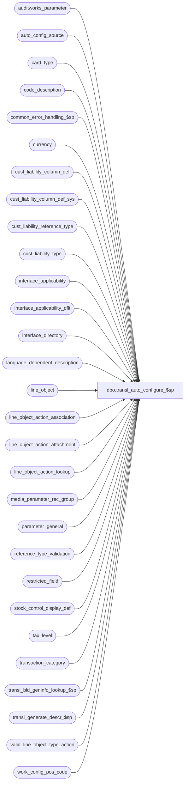

# dbo.transl_auto_configure_$sp

**Database:** auditworks  
**Server:** bedrockdb01  

## Architecture Diagram



## Table Dependencies

| Referenced Table |
|---|
| auditworks_parameter |
| auto_config_source |
| card_type |
| code_description |
| common_error_handling_$sp |
| currency |
| cust_liability_column_def |
| cust_liability_column_def_sys |
| cust_liability_reference_type |
| cust_liability_type |
| interface_applicability |
| interface_applicability_dflt |
| interface_directory |
| language_dependent_description |
| line_object |
| line_object_action_association |
| line_object_action_attachment |
| line_object_action_lookup |
| media_parameter_rec_group |
| parameter_general |
| reference_type_validation |
| restricted_field |
| stock_control_display_def |
| tax_level |
| transaction_category |
| transl_bld_geninfo_lookup_$sp |
| transl_generate_descr_$sp |
| valid_line_object_type_action |
| work_config_pos_code |

## Stored Procedure Code

```sql
CREATE proc  dbo.transl_auto_configure_$sp @request_id_txt nvarchar(50)
AS
/* 
PROC NAME: transl_auto_configure_$sp
     DESC: This proc is called from smartload (edit.ict) and runs only on TM server/database.
             
     Unicode version.
     
HISTORY: 
Date      Name          Def# Desc
Jun10,16 Vicci      DAOM-933 Handle the fact that an IsHostCapture tender shares the same Idx as a non-IsHostCapture tender in the case of a rollout
                             of a POS upgrade. In an environment that was implemented with S/A Xpress 5.1 SP5 CP1 or higher, this is fine but in a
                             non-Xpress environment or an Xpress environment originally implemented with an earlier release, if using Auto-configuration
                             and if the the implementation team forgets to add a line-object-action-lookup to remap the new IsHostCapture tender to the 
                             same line object as the old non-IsHostCapture tender, when the new line object is auto-configured the old line object will 
                             automatically be deactivated (standard functionality for change-in-use of an existing Idx) and any transactions received
                             from non-upgraded POS will therefore reject.  Avoid this by creating a dummy partial lookup POS code (one that will not 
                             actually be set by POS) for IsHostCapture tenders since they will not be counted anyhow and we will therefore not be
                             receiving cash management transactions for them (that only supply the partial lookup POS code).
Jul10,15 Vicci    TFS-128078 Recognize that debit cards are tendered not charged
Jul29,14 Vicci     TFS-79401 If an upgrade is in progress, exit immediately.
Mar25,14 Vicci        150899 Ensure new code description entries do not use codes in the system-defined range;  Use same code as POS where possible.
Jan31,14 Vicci        149690 Avoid 'Cannot insert the value null into column item_type, table auto_config_source does not allow nulls' error by not
                             creating line_object_action_attachment entries for invalid line object/actions.
Aug28,13 Vicci        146147 Treat PayPal (ref type 227) like credit cards for obj act assoc insert purposes;  log card-type to authorization attachment.
Jul12,13 Vicci        145236 Don't configure a mandatory reference-type for line actions 32, 206, 234, 248 (treat like 246, 247).
Jul11,13 Vicci        145215 Initialize @vat_line_object between loop passes.
Apr10,13 Vicci        143207 Ensure that the work_config_pos_code is updated with the newly created line_object or code prior to posting it to auto_config_source.
Feb01,13 Vicci        141488 Populate auto_config_source based on source transaction info from work_config_pos_code.
Sep11,12 Vicci        138105 Handle partial VAT configuration (line-object-type 5 without 14) pre-existing in database.
Aug02,12 Paul         134132 prevent error 2627 by setting dummy_transaction_category on insert, removed usage of t_id
Nov03,11 Vicci        130954 If the POS configuration for an existing tender is modified from one tender type to another (for example from house-card 
                             to value-certificate) and a new tender configuration is auto-created in S/A as a result, then deactivate the tender 
                             line-object configured earlier when the IDX in question had a different tender type at POS to avoid count transactions 
                             associated with this tender erroneously continuing to feed to old tender line-object.
Sep26,11 Vicci        129992 Handle VAT correctly by creating both an object-type 5 line-object (to receive the subledger tax-stripping)
                             and an object-type 14 line-object (for use as memo information in the transaction line).  Note:  the Translate 
                             will send an auto-config request under object-type 5 but with actions of reversed/recorded (appropriate for object-type 14 only)
                             and with a POS Code suffixed with IsVat, and with no reference type (even if used in an order transaction for example) since
                             Tax stripping does not support more than one tax-line-object per tax level (it just uses the max) and relies instead on a
                             GL Account configuration using the the 'Taxed Line objet-action' G/L segment lookup type instead when necessary.
Sep22,11 Vicci        129959 If the currency code of a newly created gift card is not specified in the info provided by the TOb or Translate
                             then do not attempt to remap the generic gift-card inquiry object to a currency specific one.
Sep15,11 Vicci        129791 When a reference-type is being created for a line-object of type 004 (Gift Cert Sale) then
                             then the line-object description which is to become the reference-type description is found 
                             in the second token (since the first is reserve for the reference type of the order-type if any)
                             unlike so it must be differentiate from other descriptions where it is the first token.
                             Set the approval_status_date when modifying descriptions so that the audit-trail can be
         used to look up the before value during config review.
Aug12,11 Vicci        128827 Added additional trace message.
Jul29,11 Vicci        128827 Clarified trace message content to facilitate debugging.  
                   Since in SQL Server 2005 CONVERT(nvarchar(50),@request_id,1) only works if @request_id is UniqueIdentifier, 
                             change its datatype.  Note, implicit conversion to binary works.
Jul13,11  Vicci       128421 Cascade tender description changes to corresponding float if float does not have a description of its own.
May05,11  Vicci       126716 Although no masks are currently used for code-description, recognize the @desc returned by the description generation.
                             Don't assume that when a code_description entry's description has been modified (ie display <> system desc) that
                             means that the user wants all future POS changes to be disregarded.
May10,10  Vicci       117634 Recognize currency code of new Gift Card/Gift Certificates.
Apr28,10  Vicci       117462 Pass @disregard_pos_descr_change to transl_generate_descr_$sp so that it can handle new setting of 2 indicating that alternate description mask is to be used.
Oct25,06  Phu          77931 Fix outer join for SQL 2005 Mode 90.
Aug30,06  Tim        DV-1342 added NOLOCK and fastforward to cursors to improve efficiency
Nov18,05  David      DV-1319 Insert L_A 28 if foreign currency. Insert L_A 24 if L_O had an issuance.
Jul05,05  David      DV-1285 Handle line_action 32, 206, 234, 248.
                             For coupons, mail check and mall cert, do not insert line_actions sold, issued, or increased.
Jun15,05  David      DV-1278 Check if positions (1,3) and (5,7) of lookup_pos_code are all numbers before configuring line objects.
              Handle traveler's check; Coupon, mail check, mall cert.
Jun09,05  David      DV-1263 Add line_object_type 8 to valid_line_object_type_action for Orders.
                             Set ref type to 5 when it's 4 and description contains 'credit'.
Jun08,05  David      DV-1263 Add "." to partial POS code for tenders.
Jun07,05  Maryam     DV-1263 Set reference_no_length to 20 if null or > 20.
          David              Move tax_level insert before line_object insert. 
May02,05  David      DV-1202 Call transl_bld_geninfo_lookup_$sp. Log to smartload.
Mar14,05  Maryam     DV-1202 Author
*/

DECLARE
  @alpha_code                   nvarchar(20),
  @base_language_id             smallint,
  @code_type        		tinyint,
  @code				smallint,
  @cursor_open                  tinyint,
  @current_alpha_code           nvarchar(20),
  @currency_code		nvarchar(3),
  @currency_id			numeric(12,0),
  @currency_code_pos_start	smallint,
  @currency_code_pos_end	smallint,
  @desc				nvarchar(255),
  @description_key              nvarchar(20),
  @ref_type_descr_key		nvarchar(20),
  @errno                        int,
  @errmsg                       nvarchar(255),
  @language_id                  smallint,
  @issued_flag			tinyint,
  @line_object			smallint,
  @vat_line_object		smallint,
  @lookup_partial_pos_code      nvarchar(500),
  @line_object_type 		tinyint,
  @lookup_pos_code              nvarchar(500),
  @message_id			int,
  @multi_language               tinyint,
  @new_code                     smallint,
  @object_name			nvarchar(255),
  @operation_name		nvarchar(100),
  @process_no			smallint,
  @process_name			nvarchar(100),
  @process_id                   binary(16),
  @pos_description              nvarchar(255),
  @position_of_dot		smallint,
  @resource_id                  numeric(12,0),
  @vat_resource_id		numeric(12,0),
  @reference_type_type          smallint,
  @reference_type               smallint,
  @reference_type_desc          nvarchar(255),
  @table_name 			nvarchar(30),
  @card_type                    nchar(1),
  @foreign_currency_flag        tinyint,
  @reference_no_length          smallint,
  @rows				int,
  @sysrows			int,
  @use_default_gl_effect smallint,
  @override_transaction_category tinyint,
  @tax_level                     int,
  @trace_msg			nvarchar(255),
  @disregard_pos_descr_change    tinyint,
  @upc_lookup_division           tinyint,
  @float_lookup_pos_code	 nvarchar(500),
  @float_line_object		 smallint,
  @float_disregard_pos_descr_chg tinyint,
  @float_desc		         nvarchar(255),
  @float_resource_id		 numeric(12,0),
  @request_id_uid		 uniqueidentifier,
  @request_id			 binary(16),
  @store_no			 int,
  @register_no			 smallint,
  @entry_date_time		 datetime,
  @transaction_series		 nchar(1),
  @transaction_no		 int,
  @line_id			 numeric(5,0),
  @transaction_date		 smalldatetime,
  @desc_update_flag		 tinyint
  
SELECT @process_no   = 291,
       @process_name = 'transl_auto_configure_$sp',
       @message_id   = 201068,
       @multi_language = 0,       
       @process_id = @@spid,
       @cursor_open = 0,
       @request_id_uid = CONVERT(uniqueidentifier, @request_id_txt)

IF EXISTS ( SELECT 1
	      FROM parameter_general
	     WHERE upgrade_in_progress > 0)
BEGIN
  SELECT @trace_msg = NCHAR(13) + NCHAR(10) + ':LOG && Edit cannot execute transl_auto_configure_$sp:  the S/A database is currently being upgraded.  Please try again later. ' + CONVERT(nchar, getdate(), 8);
  PRINT @trace_msg;

  SELECT @message_id = 201036,
         @errno = 201500,
         @errmsg = 'The Edit cannot execute transl_auto_configure_$sp:  the S/A database is currently being upgraded.  Please try again later.',
         @object_name = 'parameter_general',
         @operation_name = 'SELECT';
  GOTO error;
END
       
--To simplify recovery handling
IF @request_id_txt IS NULL
  SELECT @request_id = MIN(request_id) FROM work_config_pos_code
ELSE
  SELECT @request_id = @request_id_uid

SELECT @trace_msg = NCHAR(13) + NCHAR(10) + ':LOG && transl_auto_configure starts: ' + CONVERT(nchar, getdate(), 8) + 'for request ID:  ' + @request_id_txt
PRINT @trace_msg

IF NOT EXISTS (SELECT 1 FROM work_config_pos_code WITH (NOLOCK) WHERE request_id = @request_id)
BEGIN
  PRINT ':LOG && transl_auto_configure:  Error -Invalid request_id passed (no entries found in work_config_pos_code for this request_id)'
  RETURN
END

EXEC transl_bld_geninfo_lookup_$sp @request_id, @process_no

  SELECT @errno = @@error
  IF @errno != 0
  BEGIN
    SELECT @errmsg = 'Failed to execute transl_bld_geninfo_lookup_$sp.',
           @object_name = 'transl_bld_geninfo_lookup_$sp',
           @operation_name = 'EXEC'
    GOTO error
  END

SELECT @base_language_id = IsNull(convert(smallint, par_value), 1033)
  FROM auditworks_parameter
 WHERE par_name = 'base_language_id'

SELECT @errno = @@error
IF @errno != 0
  BEGIN
    SELECT @errmsg = 'Failed to select the base_language_id.',
	   @object_name = 'auditworks_parameter',
	   @operation_name = 'SELECT'
    GOTO error
  END

IF @base_language_id IS NULL
  SELECT @base_language_id = 1033
  
DECLARE description_change_crsr CURSOR FAST_FORWARD
    FOR
 SELECT table_name, code_type, code, line_object, lookup_pos_code, pos_description, disregard_pos_descr_change, language_id, resource_id,
        store_no, register_no, entry_date_time,  transaction_series,  transaction_no, line_id, CONVERT(smalldatetime, CONVERT(nchar(8), entry_date_time,112)), desc_update_flag
   FROM work_config_pos_code WITH (NOLOCK)
  WHERE request_id = @request_id
    AND desc_update_flag = 1

SELECT @errno = @@error
IF @errno <> 0
  BEGIN
    SELECT @errmsg         = 'Unable to declare cursor description_change_crsr',
           @object_name    = 'description_change_crsr',
       @operation_name = 'OPEN'
    GOTO error
  END
  
OPEN description_change_crsr 

SELECT  @cursor_open = 1
    
WHILE 1 = 1
  BEGIN
  FETCH description_change_crsr 
     INTO @table_name,
          @code_type,
          @code,
          @line_object,
          @lookup_pos_code,
          @pos_description,
          @disregard_pos_descr_change,
          @language_id,          
          @resource_id,
          @store_no, @register_no, @entry_date_time,  @transaction_series, @transaction_no, @line_id, @transaction_date, @desc_update_flag
    
    IF @@fetch_status <> 0
      BREAK
   
    IF @table_name = 'code_description'
    BEGIN

      SELECT @disregard_pos_descr_change = disregard_pos_descr_change
        FROM code_description
       WHERE code_type = @code_type
         AND code = @code
      SELECT @errno = @@error
      IF @errno != 0
      BEGIN
        SELECT @errmsg = 'Failed to determine whether POS description changes are to be ignored',
	       @object_name = 'code_description',
	       @operation_name = 'SELECT'
        GOTO error
      END
    
      IF @disregard_pos_descr_change IN (0,2)
      BEGIN 
        SELECT @description_key = RIGHT('000' + convert(nvarchar, @code_type), 3) 

        EXEC transl_generate_descr_$sp @process_no, @process_id, @table_name, @lookup_pos_code, @description_key, @pos_description,
             @language_id, @base_language_id, @disregard_pos_descr_change, @desc OUTPUT, @errmsg OUTPUT
        SELECT @errno = @@error
        IF @errno != 0
        BEGIN
          IF @errmsg IS NULL /* then */   
            SELECT @errmsg = 'Failed to execute transl_generate_descr_$sp.'
          SELECT @object_name = 'transl_generate_descr_$sp',
                 @operation_name = 'EXECUTE'
          GOTO error
        END  
      END
      ELSE
      BEGIN
        SELECT @desc = NULL
      END
       
      IF @base_language_id = @language_id
      BEGIN
        UPDATE code_description
           SET code_display_descr= CASE WHEN disregard_pos_descr_change <> 1 AND @desc IS NOT NULL THEN @desc 
                                   ELSE code_display_descr
                                   END, 
               code_system_descr = @pos_description,
               auto_config_verified = 2 * SIGN(auto_config_verified),
               active_flag = 1
         WHERE code_type = @code_type
           AND code = @code

        SELECT @errno = @@error
        IF @errno != 0
          BEGIN
            SELECT @errmsg = 'Failed to set the code_display_descr.',
	           @object_name = 'code_description',
	       @operation_name = 'UPDATE'
            GOTO error
          END
     
      END --IF @base_language_id = @language_id
      ELSE 
      BEGIN 
     UPDATE language_dependent_description
           SET display_description = CASE WHEN @disregard_pos_descr_change <> 1 AND @desc IS NOT NULL THEN @desc
                                          ELSE display_description
                                     END,           
               system_description = @pos_description
         WHERE language_id = @language_id
           AND resource_id = @resource_id
           
        SELECT @errno = @@error
        IF @errno != 0
          BEGIN
            SELECT @errmsg = 'Failed to set the display description.',
	           @object_name = 'language_dependent_description',
	         @operation_name = 'UPDATE'
            GOTO error
          END
          
        -- To notify the user of a description change in case of multi language when the base language is English and French
        -- store comes first with a description change. 
          UPDATE code_description
             SET auto_config_verified = 2 * SIGN(auto_config_verified), -- leave unverified config alone
                 active_flag = 1
           WHERE code_type = @code_type
             AND code = @code

          SELECT @errno = @@error
          IF @errno != 0
          BEGIN
            SELECT @errmsg = 'Failed to set the auto_config_verifed flag.',
	      @object_name = 'code_description',
	         @operation_name = 'UPDATE'
            GOTO error
          END             
           
      END --@base_language_id <> @language_id

    END --IF @table_name = 'code_description'
    
    IF @table_name = 'line_object'
    BEGIN

      SELECT @description_key = SUBSTRING(@lookup_pos_code, 1, 3) -- The description_key is the line_object_type as well.

      EXEC transl_generate_descr_$sp @process_no, @process_id, @table_name, @lookup_pos_code, @description_key, @pos_description,
           @language_id, @base_language_id, @disregard_pos_descr_change, @desc OUTPUT, @errmsg OUTPUT
      SELECT @errno = @@error
      IF @errno != 0
      BEGIN
        IF @errmsg IS NULL /* then */   
          SELECT @errmsg = 'Failed to execute transl_generate_descr_$sp.'
SELECT @object_name = 'transl_generate_descr_$sp',
               @operation_name = 'EXECUTE'
        GOTO error
      END    
 
      SELECT @float_lookup_pos_code = NULL, @float_line_object = NULL, @float_resource_id = NULL
      
      IF @description_key = '006' 
      BEGIN  
            SELECT @float_lookup_pos_code = lookup_pos_code,
                   @float_line_object = line_object,
                   @float_disregard_pos_descr_chg = disregard_pos_descr_change,
                   @float_resource_id = resource_id
          FROM line_object 
             WHERE line_object_type = 21 
               AND pos_description_token_list LIKE '%Idx=%' --default used by translate when not FLOAT tender description available in TOb
               AND lookup_pos_code like '%' + SUBSTRING(@lookup_pos_code, CHARINDEX('Idx=', @lookup_pos_code), CHARINDEX('.', @lookup_pos_code, CHARINDEX('Idx=', @lookup_pos_code)) - CHARINDEX('Idx=', @lookup_pos_code) + 1) + '%'  --float with same Idx as tender whose description is being modified 
               AND disregard_pos_descr_change <> 1
            SELECT @errno = @@error
            IF @errno != 0
            BEGIN
              SELECT @errmsg = 'Failed to determine if there is a float line-object which should inherit the tender line-object description change.',
                     @object_name = 'line_object',
                     @operation_name = 'SELECT'
              GOTO error
            END

            IF @float_line_object IS NOT NULL
            BEGIN
              EXEC transl_generate_descr_$sp @process_no, @process_id, @table_name, @float_lookup_pos_code, '021', @pos_description,
                   @language_id, @base_language_id, @float_disregard_pos_descr_chg, @float_desc OUTPUT, @errmsg OUTPUT
	      SELECT @errno = @@error
	    IF @errno != 0
	      BEGIN
	        IF @errmsg IS NULL /* then */   
	          SELECT @errmsg = 'Failed to execute transl_generate_descr_$sp.'
	        SELECT @object_name = 'transl_generate_descr_$sp',
	               @operation_name = 'EXECUTE'
	        GOTO error
	      END   	      
            END  --If tender description change should be applied to a corresponding float too.
      
      END --IF @description_key = '006' 
      
      SELECT @vat_line_object = NULL, @vat_resource_id = NULL

      IF @lookup_pos_code like '%.IsVat.%'
      BEGIN
        SELECT @vat_line_object = line_object, @vat_resource_id = resource_id
          FROM line_object
         WHERE line_object_type = 5
           AND lookup_pos_code = SUBSTRING(@lookup_pos_code, 1, CHARINDEX('.IsVat.', @lookup_pos_code))
       --Note:  @line_object would have a line_object_type of 14 in the case of VAT
      END

      IF @language_id = @base_language_id    
      BEGIN
        UPDATE line_object
           SET line_object_description = CASE WHEN disregard_pos_descr_change in (0, 2) THEN @desc
                                         ELSE line_object_description
                                         END,
               pos_description_token_list = @pos_description,
               auto_config_verified = 2 * SIGN(auto_config_verified), -- leave unapproved config alone
               approval_status_date = CASE WHEN auto_config_verified = 1 THEN getdate() ELSE approval_status_date END   --set to allow retrieval of old description from audit-trail upon review.
         WHERE line_object = @line_object
            OR line_object = @vat_line_object
        SELECT @errno = @@error
        IF @errno != 0
        BEGIN
          SELECT @errmsg = 'Failed to set the pos_description_token_list.',
	         @object_name = 'line_object',
	         @operation_name = 'UPDATE'
          GOTO error
        END        

        IF @vat_line_object IS NOT NULL
        BEGIN
          INSERT into auto_config_source(
                 config_type,
                 item_type,
                 item_code,
    attachment_type,
                 attachment_subtype,
                 desc_update_flag, 
                 store_no,
           register_no,
                 entry_date_time,
                 transaction_series,
                 transaction_no,
                 line_id,
                 transaction_date)
          VALUES (1,
                 5, 
                 @vat_line_object,
       		 NULL,
       		 NULL,
       		 @desc_update_flag, @store_no, @register_no, @entry_date_time,  @transaction_series, @transaction_no, @line_id, @transaction_date)
	  SELECT @errno = @@error
	  IF @errno != 0
	  BEGIN
	    SELECT @errmsg = 'Failed to log transaction which was source of vat auto-config.',
                   @object_name = 'auto_config_source',
                   @operation_name = 'INSERT'
            GOTO error
          END
        END  --IF @vat_line_object IS NOT NULL

	IF @float_line_object IS NOT NULL  --If tender description change should be applied to a corresponding float too.
	BEGIN
	  UPDATE line_object
             SET line_object_description = CASE WHEN disregard_pos_descr_change in (0, 2) THEN @float_desc
                                                ELSE line_object_description
                                           END,
                                           auto_config_verified = 2 * SIGN(auto_config_verified), -- leave unapproved config alone
                                           approval_status_date = CASE WHEN auto_config_verified = 1 THEN getdate() ELSE approval_status_date END   --set to allow retrieval of old description from audit-trail upon review.
           WHERE line_object = @float_line_object
          SELECT @errno = @@error
          IF @errno != 0
	  BEGIN
            SELECT @errmsg = 'Failed to cascade the tender description change to the corresponding float.',
	           @object_name = 'line_object',
	           @operation_name = 'UPDATE'
            GOTO error
          END      
          
          INSERT into auto_config_source(
                 config_type,
                 item_type,
                 item_code,
                 attachment_type,
                 attachment_subtype,
                 desc_update_flag, 
                 store_no,
                 register_no,
                 entry_date_time,
                 transaction_series,
                 transaction_no,
                 line_id,
                 transaction_date)
          VALUES (1,
                 21, 
                 @float_line_object,
       		 NULL,
       		 NULL,
       		 @desc_update_flag, @store_no, @register_no, @entry_date_time,  @transaction_series, @transaction_no, @line_id, @transaction_date)
	  SELECT @errno = @@error
	  IF @errno != 0
	  BEGIN
	    SELECT @errmsg = 'Failed to log transaction which was source of float auto-config.',
                   @object_name = 'auto_config_source',
                   @operation_name = 'INSERT'
            GOTO error
          END
   
        END  --IF @float_line_object IS NOT NULL
        
        /* If the line-object-type of the line object whose description has been modified is 6=Tender then updated 
           the corresponding media category's description as well or corresponding language_dependent_description entry
           if store language is not the base language).*/
          IF @description_key = '006' 
          BEGIN  
            UPDATE code_description
               SET code_display_descr = @desc,
                   code_system_descr = @pos_description,
                   auto_config_verified = 2 * SIGN(auto_config_verified),
                   approval_status_date = CASE WHEN auto_config_verified = 1 THEN getdate() ELSE approval_status_date END   --set to allow retrieval of old description from audit-trail upon review.             
             WHERE code_type = 46
               AND alpha_code = 'line_object=' + CONVERT(nvarchar, @line_object)
               AND disregard_pos_descr_change IN (0,2)  --since system desc not used to determine desc changes in this case (object changes do instead)
               AND @desc IS NOT NULL
               AND code_display_descr <> @desc
            SELECT @errno = @@error, @rows = @@rowcount
            IF @errno != 0
            BEGIN
              SELECT @errmsg = 'Failed to set the description of the media category.',
                     @object_name = 'code_description',
                     @operation_name = 'UPDATE'
              GOTO error
            END              

            IF @rows > 0
            BEGIN 
              INSERT into auto_config_source(
                     config_type,
         item_type,
                     item_code,
                     attachment_type,
                     attachment_subtype,
                     desc_update_flag, 
                     store_no,
                     register_no,
                     entry_date_time,
                     transaction_series,
                     transaction_no,
                     line_id,
                     transaction_date)
              SELECT 2 config_type,
                     code_type item_type, 
                     code item_code,
       	  	     NULL attachment_type,
       		     NULL attachment_subtype,
       		     @desc_update_flag, @store_no, @register_no, @entry_date_time,  @transaction_series, @transaction_no, @line_id, @transaction_date
                FROM code_description
               WHERE code_type = 46
                 AND alpha_code = 'line_object=' + CONVERT(nvarchar, @line_object)
                 AND disregard_pos_descr_change IN (0,2)  --since system desc not used to determine desc changes in this case (object changes do instead)
      	      SELECT @errno = @@error
    	      IF @errno != 0
	      BEGIN
	         SELECT @errmsg = 'Failed to log transaction which was source of media-category auto-config.',
                        @object_name = 'auto_config_source',
                        @operation_name = 'INSERT'
                 GOTO error
              END
            END  --IF @rows > 0 for media category

          END --IF SUBSTRING(@lookup_pos_code, 1, 3) = '006' 
          
          /* If the POS Code affected by the description change includes a non-zero reference-type associated with an 
             alpha-code then the description associated with the alpha-code should be re-evaluated and compared to 
             that assigned to the reference-type in code_description where code_type = 22 and alpha_code = current alpha_code */
          
          IF SUBSTRING(@lookup_pos_code, 5, 3) <> '000' AND SUBSTRING(@lookup_pos_code, 8, 1) <> '.'
          BEGIN
            SELECT @position_of_dot = CHARINDEX('.', @lookup_pos_code, 8)
            SELECT @current_alpha_code = SUBSTRING(@lookup_pos_code, 8, @position_of_dot - 8 - 1)

            SELECT @disregard_pos_descr_change = disregard_pos_descr_change
              FROM code_description
             WHERE code_type = 22
               AND ISNULL(alpha_code, CONVERT(nvarchar, code)) = @current_alpha_code
            SELECT @errno = @@error
       IF @errno != 0
            BEGIN
              SELECT @errmsg = 'Failed to determine whether POS description changes for reference type is to be ignored',
	             @object_name = 'code_description',
	             @operation_name = 'SELECT'
              GOTO error
            END
            SELECT @ref_type_descr_key = '022'
            IF @disregard_pos_descr_change IN (0,2)
            BEGIN 
              EXEC transl_generate_descr_$sp @process_no, @process_id, 'code_description', @lookup_pos_code, 
                          @ref_type_descr_key,  
                                           @pos_description,
                                           @language_id, @base_language_id, @disregard_pos_descr_change, @reference_type_desc OUTPUT, @errmsg OUTPUT
              SELECT @errno = @@error
              IF @errno != 0
              BEGIN
                IF @errmsg IS NULL /* then */   
                  SELECT @errmsg = 'Failed to execute transl_generate_descr_$sp.'
                SELECT @object_name = 'transl_generate_descr_$sp',
                       @operation_name = 'EXECUTE'
                GOTO error
              END  
 
              UPDATE code_description
                 SET code_display_descr = @reference_type_desc,
                     code_system_descr = @pos_description, 
                     auto_config_verified = 2 * SIGN(auto_config_verified),
                     approval_status_date = CASE WHEN auto_config_verified = 1 THEN getdate() ELSE approval_status_date END   --set to allow retrieval of old description from audit-trail upon review.        
       WHERE code_type = 22
                 AND ISNULL(alpha_code, CONVERT(nvarchar, code)) = @current_alpha_code
                 AND @reference_type_desc IS NOT NULL
                 AND code_display_descr <> @reference_type_desc
              SELECT @errno = @@error, @rows = @@rowcount
              IF @errno != 0
              BEGIN
                SELECT @errmsg = 'Failed to set the description of the reference_type',
                       @object_name = 'code_description',
                       @operation_name = 'UPDATE'
                GOTO error
              END
              
              IF @rows > 0
              BEGIN
                INSERT into auto_config_source(
                       config_type,
                       item_type,
                       item_code,
                       attachment_type,
                       attachment_subtype,
                       desc_update_flag, 
                       store_no,
                       register_no,
                       entry_date_time,
                       transaction_series,
                       transaction_no,
                       line_id,
                       transaction_date)
                SELECT 2 config_type,
                       code_type item_type, 
                       code item_code,
       	  	       NULL attachment_type,
       		       NULL attachment_subtype,
       		       @desc_update_flag, @store_no, @register_no, @entry_date_time,  @transaction_series, @transaction_no, @line_id, @transaction_date
                  FROM code_description
                 WHERE code_type = 22
                   AND ISNULL(alpha_code, CONVERT(nvarchar, code)) = @current_alpha_code
      	        SELECT @errno = @@error
    	        IF @errno != 0
	        BEGIN
	          SELECT @errmsg = 'Failed to log transaction which was source of reference-type auto-config.',
                         @object_name = 'auto_config_source',
                         @operation_name = 'INSERT'
                   GOTO error
                END
              END --IF @rows > 0 for reference-type desc change

            END  --IF @disregard_pos_descr_change IN (0,2)
          END -- IF SUBSTRING(@lookup_pos_code, 5, 3) <> '000' AND SUBSTRING(@lookup_pos_code, 8, 1) <> '.'
           
        END  --IF @language_id = @base_language_id
        ELSE 
        BEGIN --IF @language_id <> @base_language_id
          
          UPDATE language_dependent_description
             SET display_description = CASE WHEN @disregard_pos_descr_change in (0,2) AND @desc IS NOT NULL THEN @desc
                                       ELSE display_description END,
                 system_description = @pos_description
           WHERE language_id = @language_id
             AND (resource_id = @resource_id OR resource_id = @vat_resource_id)
          SELECT @errno = @@error
          IF @errno != 0
          BEGIN
            SELECT @errmsg = 'Failed to set the system description.',
	           @object_name = 'language_dependent_description',
	        @operation_name = 'UPDATE'
            GOTO error
          END

          IF @vat_resource_id IS NOT NULL
    BEGIN
            INSERT into auto_config_source(
                   config_type,
                   item_type,
                   item_code,
                   attachment_type,
                   attachment_subtype,
                   desc_update_flag, 
                   store_no,
                   register_no,
                   entry_date_time,
                   transaction_series,
                transaction_no,
                   line_id,
                   transaction_date)
            VALUES(1,
           5, 
                   @vat_line_object,
       	  	  NULL,
       		   NULL,
       		   @desc_update_flag, @store_no, @register_no, @entry_date_time,  @transaction_series, @transaction_no, @line_id, @transaction_date)
      	    SELECT @errno = @@error
    	    IF @errno != 0
	    BEGIN
	      SELECT @errmsg = 'Failed to log transaction which was source of vat foreign lang auto-config.',
                     @object_name = 'auto_config_source',
                     @operation_name = 'INSERT'
              GOTO error
            END
          END --IF @vat_resource_id IS NOT NULL

        -- To notify the user of a description change in case of multi language when the base language is English and French
        -- store comes first with a description change.          
          UPDATE line_object 
             SET auto_config_verified = 2 * SIGN(auto_config_verified), --leave unverified config alone
                 approval_status_date = CASE WHEN auto_config_verified = 1 THEN getdate() ELSE approval_status_date END   --set to allow retrieval of old description from audit-trail upon review.
           WHERE line_object_type = CONVERT(tinyint, @description_key)
             AND line_object = @line_object          
          SELECT @errno = @@error
          IF @errno != 0
          BEGIN
            SELECT @errmsg = 'Failed to set the auto_config_verified.',
	           @object_name = 'line_object',
	           @operation_name = 'UPDATE'
            GOTO error
          END     
             
	  IF @float_line_object IS NOT NULL  --If tender description change should be applied to a corresponding float too.
	  BEGIN
	    UPDATE line_object
               SET auto_config_verified = 2 * SIGN(auto_config_verified), --leave unverified config alone
                   approval_status_date = CASE WHEN auto_config_verified = 1 THEN getdate() ELSE approval_status_date END   --set to allow retrieval of old description from audit-trail upon review.
             WHERE line_object = @float_line_object
            SELECT @errno = @@error
            IF @errno != 0
  	    BEGIN
              SELECT @errmsg = 'Failed to set the auto_config_verified to indicate that tender description cascaded to corresponding float.',
	             @object_name = 'line_object',
	             @operation_name = 'UPDATE'
              GOTO error
            END        
             
            UPDATE language_dependent_description
               SET display_description = CASE WHEN @disregard_pos_descr_change IN (0,2) AND @float_desc IS NOT NULL THEN @float_desc
                  ELSE display_description
                                   END
             WHERE language_id = @language_id
               AND resource_id = @float_resource_id   
            SELECT @errno = @@error
            IF @errno != 0
            BEGIN
              SELECT @errmsg = 'Failed to cascade the tender display description change to the corresponding float.',
	             @object_name = 'language_dependent_description',
	             @operation_name = 'UPDATE'
              GOTO error
            END
            
            INSERT into auto_config_source(
                   config_type,
                   item_type,
                   item_code,
                   attachment_type,
                   attachment_subtype,
                   desc_update_flag, 
                   store_no,
                   register_no,
                   entry_date_time,
                   transaction_series,
                   transaction_no,
                   line_id,
                   transaction_date)
  VALUES(1,
                   21, 
                   @float_line_object,
       	  	   NULL,
       		   NULL,
       		   @desc_update_flag, @store_no, @register_no, @entry_date_time,  @transaction_series, @transaction_no, @line_id, @transaction_date)
      	  SELECT @errno = @@error
    	    IF @errno != 0
	    BEGIN
	     SELECT @errmsg = 'Failed to log transaction which was source of float foreign lang auto-config.',
                     @object_name = 'auto_config_source',
                     @operation_name = 'INSERT'
              GOTO error
            END

          END  --IF @float_line_object IS NOT NULL


        /* If the line-object-type of the line object whose description has been modified is 6=Tender then updated 
           the corresponding media category's description as well or corresponding language_dependent_description entry
           if store language is not the base language).*/
          IF @description_key = '006' 
          BEGIN 
            UPDATE language_dependent_description
               SET display_description = @desc,
                   system_description = @pos_description                                         
              FROM language_dependent_description l, code_description c
             WHERE l.language_id = @language_id
               AND l.resource_id = c.resource_id
               AND c.code_type = 46
               AND c.alpha_code = 'line_object=' + convert(nvarchar, @line_object)
               AND c.disregard_pos_descr_change IN (0,2) 
               AND @desc IS NOT NULL
               AND (l.display_description IS NULL OR l.display_description <> @desc)
            SELECT @errno = @@error, @rows = @@rowcount
          IF @errno != 0
              BEGIN
                SELECT @errmsg = 'Failed to set the description of the media category for display_description.',
                       @object_name = 'language_dependent',
                       @operation_name = 'UPDATE'
                GOTO error
              END

            -- To notify the user of a description change in case of multi language when the base language is English 
            -- and French store comes first with a description change.            
            IF @rows > 0
            BEGIN
              UPDATE code_description
                 SET auto_config_verified = 2 * SIGN(auto_config_verified),
                     approval_status_date = CASE WHEN auto_config_verified = 1 THEN getdate() ELSE approval_status_date END   --set to allow retrieval of old description from audit-trail upon review.
               WHERE code_type = 46
                 AND alpha_code = 'line_object=' + convert(nvarchar, @line_object)
              SELECT @errno = @@error
              IF @errno != 0
              BEGIN
                  SELECT @errmsg = 'Failed to set the auto_config_verified flag for code_type = 46.',
                @object_name = 'language_dependent',
                    @operation_name = 'UPDATE'
                  GOTO error
              END                    
              
              INSERT into auto_config_source(
                     config_type,
                     item_type,
                     item_code,
                     attachment_type,
                     attachment_subtype,
                     desc_update_flag, 
                     store_no,
                     register_no,
                     entry_date_time,
                     transaction_series,
                     transaction_no,
                     line_id,
          transaction_date)
              SELECT 2 config_type,
                     code_type item_type, 
            code item_code,
       	  	     NULL attachment_type,
       		     NULL attachment_subtype,
       		     @desc_update_flag, @store_no, @register_no, @entry_date_time,  @transaction_series, @transaction_no, @line_id, @transaction_date
       		FROM code_description
       	       WHERE code_type = 46
                 AND alpha_code = 'line_object=' + convert(nvarchar, @line_object)
              SELECT @errno = @@error
    	      IF @errno != 0
	      BEGIN
	        SELECT @errmsg = 'Failed to log transaction which was source of media category foreign lang auto-config.',
                       @object_name = 'auto_config_source',
                       @operation_name = 'INSERT'
         GOTO error
           END
            END
          END --IF @description_key = '006'

          /* If the POS Code affected by the description change includes a non-zero reference-type associated with an 
             alpha-code then the description associated with the alpha-code should be re-evaluated and compared to 
             that assigned to the reference-type in code_description where code_type = 22 and alpha_code = current alpha_code 
       or in its corresponding language_dependent_description table entry*/
        
          IF SUBSTRING(@lookup_pos_code, 5, 3) <> '000' AND SUBSTRING(@lookup_pos_code, 8, 1) <> '.'
          BEGIN
            SELECT @disregard_pos_descr_change = disregard_pos_descr_change,
                   @resource_id = resource_id 
              FROM code_description
             WHERE code_type = 22
               AND ISNULL(alpha_code, CONVERT(nvarchar, code)) = @current_alpha_code
            SELECT @errno = @@error
            IF @errno != 0
            BEGIN
              SELECT @errmsg = 'Failed to determine whether POS description changes for reference type is to be ignored',
	             @object_name = 'code_description',
	             @operation_name = 'SELECT'
              GOTO error
            END
      
            IF @disregard_pos_descr_change IN (0,2)
            BEGIN 
              SELECT @ref_type_descr_key = '022'

              EXEC transl_generate_descr_$sp @process_no, @process_id, 'code_description', @lookup_pos_code, @ref_type_descr_key,  @pos_description,
                                           @language_id, @base_language_id, @disregard_pos_descr_change, @reference_type_desc OUTPUT, @errmsg OUTPUT
              SELECT @errno = @@error
              IF @errno != 0
              BEGIN
                IF @errmsg IS NULL /* then */   
                  SELECT @errmsg = 'Failed to execute transl_generate_descr_$sp.'
                SELECT @object_name = 'transl_generate_descr_$sp',
                       @operation_name = 'EXECUTE'
                GOTO error
              END  

            IF @reference_type_desc IS NOT NULL
            BEGIN
                UPDATE language_dependent_description
                   SET display_description = @reference_type_desc,
                       system_description = @pos_description		
                  FROM language_dependent_description l
                 WHERE l.language_id = @language_id
          AND l.resource_id = @resource_id    
                   AND (display_description IS NULL OR display_description <> @reference_type_desc)
                SELECT @errno = @@error, @rows = @@rowcount
                IF @errno != 0
                BEGIN
                  SELECT @errmsg = 'Failed to set the disaply description of the reference_type.',
                         @object_name = 'language_dependent',
                         @operation_name = 'UPDATE'
                  GOTO error
                END
            
                IF @rows > 0
                BEGIN
                  UPDATE code_description
                     SET auto_config_verified = 2 * SIGN(auto_config_verified),
                         approval_status_date = CASE WHEN auto_config_verified = 1 THEN getdate() ELSE approval_status_date END   --set to allow retrieval of old description from audit-trail upon review.
                   WHERE code_type = 22
                     AND ISNULL(alpha_code, CONVERT(nvarchar, code)) = @current_alpha_code
                  SELECT @errno = @@error
                  IF @errno != 0
                  BEGIN
                    SELECT @errmsg = 'Failed to set the auto_config_verified flag for code_type = 22.',
                           @object_name = 'language_dependent',
                           @operation_name = 'UPDATE'
                    GOTO error
                  END            
                  
                  INSERT into auto_config_source(
                         config_type,
                         item_type,
                         item_code,
                         attachment_type,
                         attachment_subtype,
                         desc_update_flag, 
                         store_no,
                         register_no,
                         entry_date_time,
                         transaction_series,
                         transaction_no,
                         line_id,
                         transaction_date)
                  SELECT 2 config_type,
                         code_type item_type, 
                         code item_code,
                         NULL attachment_type,
                         NULL attachment_subtype,
                         @desc_update_flag, @store_no, @register_no, @entry_date_time,  @transaction_series, @transaction_no, @line_id, @transaction_date
       		    FROM code_description
       	           WHERE code_type = 22
                     AND ISNULL(alpha_code, CONVERT(nvarchar, code)) = @current_alpha_code
                  SELECT @errno = @@error
    	          IF @errno != 0
	          BEGIN
	            SELECT @errmsg = 'Failed to log transaction which was source of reference-type foreign lang auto-config.',
                           @object_name = 'auto_config_source',
                           @operation_name = 'INSERT'
                    GOTO error
                  END

                END --IF @rows > 0
              END --IF @reference_type_desc IS NOT NULL
            END  --IF @disregard_pos_descr_change IN (0,2)
          END -- IF SUBSTRING(@lookup_pos_code, 5, 3) <> '000' AND SUBSTRING(@lookup_pos_code, 8, 1) <> '.'
        END -- @language_id <> @base_language_id                
      END -- @table_name = 'line_object  '   
       
  END -- WHILE 1=1

CLOSE description_change_crsr
DEALLOCATE description_change_crsr
   
SELECT @cursor_open = 0, @disregard_pos_descr_change = 0 


DECLARE new_code_crsr CURSOR FAST_FORWARD
    FOR
 SELECT table_name, code_type, lookup_pos_code, pos_description, language_id,  resource_id, 
        card_type, foreign_currency_flag, reference_no_length, issued_flag,
        store_no, register_no, entry_date_time,  transaction_series,  transaction_no, line_id, CONVERT(smalldatetime, CONVERT(nchar(8), entry_date_time,112)), desc_update_flag
   FROM work_config_pos_code WITH (NOLOCK)
  WHERE request_id = @request_id
    AND new_code_flag = 1

SELECT @errno = @@error
IF @errno <> 0
  BEGIN
 SELECT @errmsg         = 'Unable to declare cursor new_code_crsr',
           @object_name    = 'new_code_crsr',
           @operation_name = 'OPEN'
    GOTO error
  END
  
OPEN new_code_crsr 

SELECT @cursor_open = 2
    
WHILE 1 = 1
BEGIN
  FETCH new_code_crsr 
   INTO @table_name,
        @code_type,
        @lookup_pos_code,
        @pos_description,
        @language_id,          
        @resource_id,
        @card_type,
        @foreign_currency_flag,
        @reference_no_length,
        @issued_flag,
        @store_no, @register_no, @entry_date_time,  @transaction_series, @transaction_no, @line_id, @transaction_date, @desc_update_flag
    
  IF @@fetch_status <> 0
    BREAK
    
  SELECT @currency_code_pos_start = CHARINDEX('Currency=', @lookup_pos_code)
  IF @currency_code_pos_start <> 0 
  BEGIN
    SELECT @currency_code_pos_start = @currency_code_pos_start + 9
    SELECT @currency_code_pos_end = CHARINDEX('.', @lookup_pos_code, @currency_code_pos_start) 
    IF @currency_code_pos_end <> 0  
    BEGIN
      SELECT @currency_code = SUBSTRING (@lookup_pos_code, @currency_code_pos_start, @currency_code_pos_end - @currency_code_pos_start)
      SELECT @currency_id = currency_id
        FROM currency
       WHERE currency_code = @currency_code
       SELECT @errno = @@error
       IF @errno != 0
       BEGIN
         SELECT @errmsg = 'Failed to determine currency ID corresponding to currency code of reference-type.',
         	@object_name = 'currency',
         	@operation_name = 'SELECT'
         GOTO error
       END   
    END  --IF @currency_code_pos_end <> 0
  END  --IF @currency_code_pos_start <> 0 

  SELECT @lookup_partial_pos_code = @lookup_pos_code
  
  IF @table_name = 'code_description'
  BEGIN
    SELECT @description_key = RIGHT('000' + convert(nvarchar, @code_type), 3) 
  END
  ELSE
  BEGIN
    SELECT @description_key = SUBSTRING(@lookup_pos_code, 1, 3)
  END

  EXEC transl_generate_descr_$sp @process_no, @process_id, @table_name, @lookup_pos_code, @description_key, @pos_description,
                                         @language_id, @base_language_id, @disregard_pos_descr_change, @desc OUTPUT, @errmsg OUTPUT

  SELECT @errno = @@error
  IF @errno != 0
    BEGIN
      IF @errmsg IS NULL /* then */   
        SELECT @errmsg = 'Failed to execute transl_generate_descr_$sp.'
      SELECT @object_name = 'transl_generate_descr_$sp',
         @operation_name = 'EXECUTE'
      GOTO error
    END      
  
  IF @table_name = 'code_description'
  BEGIN
    SELECT @new_code = NULL

    SELECT @new_code = code
      FROM code_description
     WHERE code_type = @code_type
       AND ISNULL(alpha_code, code) = @lookup_pos_code
    SELECT @errno = @@error
    IF @errno <> 0
    BEGIN
      SELECT @errmsg        = 'Failed to verify where code already exists.',
             @object_name    = 'code_description',
             @operation_name = 'SELECT'
      GOTO error
    END
    
    IF @new_code IS NULL AND IsNumeric(@lookup_pos_code) = 1 AND @lookup_pos_code NOT LIKE '%.%' AND @lookup_pos_code NOT LIKE '%-%' AND @lookup_pos_code NOT LIKE '%,%' AND LEN(@lookup_pos_code) <= 5 
    BEGIN
      IF ((@lookup_pos_code >= 0 AND @lookup_pos_code < 200) OR (@lookup_pos_code > 255 AND @lookup_pos_code <= 32767))
      AND NOT EXISTS (SELECT 1 FROM code_description WHERE code_type = @code_type AND code = @lookup_pos_code)
      BEGIN
        SELECT @new_code = @lookup_pos_code
      END
    END
    
    IF @new_code IS NULL
    BEGIN
      SELECT @new_code = ISNULL(MAX(code), 0) + 1
        FROM code_description
       WHERE code_type = @code_type
         AND (code < 199 OR code >= 255)  --200-255 range is reserved by system   
         AND code < 32767     
      SELECT @errno = @@error
      IF @errno <> 0
      BEGIN
   SELECT @errmsg        = 'Unable to select the next available code.',
               @object_name    = 'code_description',
               @operation_name = 'SELECT'
        GOTO error
      END
    END

    IF @new_code = 1      
    BEGIN
      WHILE 1=1
      BEGIN          
        IF NOT EXISTS(SELECT 1
     			FROM code_description
                       WHERE code_type = @code_type 
                         AND code = @new_code)
          BREAK
        ELSE
          IF @new_code = 199
            SELECT @new_code = 256
          ELSE
            IF @new_code = 32767
            BEGIN
              SELECT @new_code = NULL
              BREAK
            END
            ELSE
              SELECT @new_code = @new_code + 1        
      END --WHILE 1=1
    END
                     
    IF NOT EXISTS (SELECT 1
                     FROM code_description
                    WHERE code_type = @code_type
                      AND ISNULL(alpha_code, code) = @lookup_pos_code)
    BEGIN
        INSERT code_description(
               code_type,
               code,
               code_display_descr,
               code_meaning_control,
               code_system_descr,
               alpha_code,
               auto_config_verified)
        VALUES (@code_type,
               @new_code,
               @desc,
               'U',
               ISNULL(@pos_description, @lookup_pos_code),
               @lookup_pos_code,
               0)    
        SELECT @errno = @@error
        IF @errno != 0
          BEGIN
            SELECT @errmsg = 'Failed to insert into the code_description.(multi language)',
	           @object_name = 'code_description',
	           @operation_name = 'INSERT'
            GOTO error
          END      
    END --IF NOT EXISTS ...
        
    IF @language_id <> @base_language_id
    BEGIN
      UPDATE language_dependent_description
         SET display_description = @desc,
             system_description =  ISNULL(@pos_description, @lookup_pos_code)
        FROM language_dependent_description l, code_description c
       WHERE l.language_id = @language_id      
         AND l.resource_id = c.resource_id
         AND c.code_type = @code_type
         AND c.code = @new_code    
      SELECT @errno = @@error
      IF @errno != 0
        BEGIN
          SELECT @errmsg = 'Failed to set the display description.',
           	 @object_name = 'language_dependent_description',
	         @operation_name = 'UPDATE'
          GOTO error
        END      
    END -- @language_id <> @base_language_id     

  END --IF @table_name = 'code_description'

  IF @table_name = 'line_object' 
  AND IsNumeric(SUBSTRING(@lookup_pos_code, 1, 3)) = 1 
  AND IsNumeric(SUBSTRING(@lookup_pos_code, 5, 3)) = 1 -- in case of translate error
  BEGIN
    
    SELECT @line_object_type =  CONVERT(tinyint,SUBSTRING(@lookup_pos_code, 1, 3)),
           @reference_type_type = CONVERT(smallint,SUBSTRING(@lookup_pos_code, 5, 3)),
           @alpha_code = NULL --
    
    -- Coalition does not differentiate between credit note and gift certificate, 
    -- so the only way to know when to set the ref type to 5 is to check the description.
    IF @reference_type_type = 4 AND LOWER(@pos_description) LIKE '%credit%'
      SELECT @reference_type_type = 5 
     
    IF @line_object_type = 6
    BEGIN
      SELECT @lookup_partial_pos_code = '006.000.' + Substring(@lookup_pos_code, CHARINDEX('Idx=', @lookup_pos_code), CHARINDEX('.', @lookup_pos_code, CHARINDEX('Idx=', @lookup_pos_code)) - CHARINDEX('Idx=', @lookup_pos_code) + 1)
      IF lower(@lookup_pos_code) LIKE '%hostcapture%'
        SELECT @lookup_partial_pos_code = @lookup_partial_pos_code  + 'Settlement=HostCapture.'
    END
    
    SELECT @line_object = ISNULL(MAX(line_object),0) + 1
     FROM line_object
     WHERE line_object < 9000     
    SELECT @errno = @@error
    IF @errno <> 0
      BEGIN
        SELECT @errmsg         = 'Unable to select the next available line_object.',
               @object_name    = 'line_object',
               @operation_name = 'SELECT'
        GOTO error
      END
      
    IF @line_object >= 9000      
    BEGIN
      SELECT @line_object = 1
      WHILE 1 = 1
      BEGIN          
        IF NOT EXISTS(SELECT 1
     			FROM line_object
                       WHERE line_object = @line_object)
          BREAK
        ELSE
         SELECT @line_object = @line_object + 1        
      END --WHILE 1=1
    END
  
    SELECT @vat_line_object = NULL, @vat_resource_id = NULL
    
    IF @lookup_pos_code like '%.IsVat.%'
    BEGIN
      SELECT @lookup_pos_code = SUBSTRING(@lookup_pos_code, 1, CHARINDEX('.IsVat.', @lookup_pos_code))
      SELECT @lookup_partial_pos_code = @lookup_pos_code
      SELECT @vat_line_object = MAX(line_object) + 1
        FROM (SELECT line_object FROM line_object UNION SELECT @line_object line_object) o
       WHERE line_object < 9000     
      SELECT @errno = @@error
      IF @errno <> 0
      BEGIN
        SELECT @errmsg         = 'Unable to select the next available line_object.',
               @object_name    = 'line_object',
               @operation_name = 'SELECT'
        GOTO error
      END
      
      IF @vat_line_object >= 9000      
      BEGIN
        SELECT @vat_line_object = 1
        WHILE 1 = 1
        BEGIN          
          IF @vat_line_object <> @line_object AND 
            NOT EXISTS(SELECT 1
     			FROM line_object
                       WHERE line_object = @vat_line_object)
            BREAK
          ELSE
            SELECT @vat_line_object = @vat_line_object + 1        
        END --WHILE 1=1
      END
    END --IF @lookup_pos_code like '%.IsVat.%'
    
    BEGIN TRAN
    
    IF @vat_line_object IS NOT NULL 
        AND NOT EXISTS (SELECT 1
			  FROM line_object
                         WHERE lookup_pos_code = @lookup_pos_code + 'IsVat.')
    BEGIN
      INSERT line_object(
             	   line_object,
             	   line_object_type,
             	   line_object_description,
             	   lookup_pos_code,
             	   lookup_partial_pos_code,
             	   pos_description_token_list,
             	   auto_config_verified)
            VALUES (@vat_line_object,
                   14,
                   @desc,
                   @lookup_pos_code + 'IsVat.',
                   @lookup_partial_pos_code + 'IsVat.', 
                   @pos_description,
                   0)       
            SELECT @errno = @@error
            IF @errno != 0
            BEGIN
              SELECT @errmsg = 'Failed to insert statistical VAT object into the line_object table.',
                     @object_name = 'line_object',
                  @operation_name = 'INSERT'
              GOTO error
            END 
            
            INSERT into auto_config_source(
                   config_type,
                   item_type,
                   item_code,
                   desc_update_flag, 
                   store_no,
                   register_no,
        entry_date_time,
                   transaction_series,
                   transaction_no,
                   line_id,
                  transaction_date)
            VALUES(1,
                   14, 
                   @vat_line_object,
                   @desc_update_flag, @store_no, @register_no, @entry_date_time,  @transaction_series, @transaction_no, @line_id, @transaction_date)
            SELECT @errno = @@error
    	    IF @errno != 0
	    BEGIN
	      SELECT @errmsg = 'Failed to log transaction which was source of new vat auto-config.',
                     @object_name = 'auto_config_source',
                     @operation_name = 'INSERT'
              GOTO error
            END

    END

    IF NOT EXISTS (SELECT 1
                     FROM line_object
                    WHERE lookup_pos_code = @lookup_pos_code)
    BEGIN
      
      -- insert tax level before line_object because L_O trigger inserts tax_default which requires the tax_level.
      
      IF @line_object_type = 5 
  BEGIN
          
          SELECT @tax_level = NULL --
        
          IF charindex('AuthId=', @lookup_pos_code) <> 0              
            SELECT @tax_level = SUBSTRING (@lookup_pos_code, charindex('AuthId=', @lookup_pos_code) + 7,  charindex('.',@lookup_pos_code, charindex('AuthId=', @lookup_pos_code)) - (charindex('AuthId=', @lookup_pos_code) + 7)  )
            
          IF @tax_level IS NULL OR @tax_level > 255 OR @tax_level < 0
            SELECT @tax_level = 0
          
          INSERT tax_level(
                 line_object,
                 tax_level)         
    VALUES (@line_object,       
                  @tax_level)
          SELECT @errno = @@error
          IF @errno != 0
          BEGIN
            SELECT @errmsg = 'Failed to insert into tax_level.',
                   @object_name = 'tax_level',
                   @operation_name = 'INSERT'
            GOTO error
          END
      END --IF @line_object_type = 5
      
      INSERT line_object(
             line_object,
             line_object_type,
             line_object_description,
             lookup_pos_code,
             lookup_partial_pos_code,
             pos_description_token_list,
             auto_config_verified)
      VALUES (@line_object,
             @line_object_type,
             @desc,
             @lookup_pos_code,
             @lookup_partial_pos_code, 
             @pos_description,
             0)        
      SELECT @errno = @@error
      IF @errno != 0
      BEGIN
        SELECT @errmsg = 'Failed to insert into the line_object table.',
	       @object_name = 'line_object',
	       @operation_name = 'INSERT'
        GOTO error
      END      
      
      --130954
      UPDATE line_object
         SET active_flag = 0
       WHERE lookup_partial_pos_code = @lookup_partial_pos_code
         AND line_object <> @line_object
         AND active_flag <> 0
         AND line_object_type = 6
      SELECT @errno = @@error
      IF @errno != 0
      BEGIN
        SELECT @errmsg = 'Failed to deactivate the tender line-object configured earlier when the IDX in question had a different tender type at POS.',
	       @object_name = 'line_object',
	       @operation_name = 'UPDATE'
        GOTO error
      END  
    
      IF @language_id <> @base_language_id 
  BEGIN        
        UPDATE language_dependent_description
           SET display_description = @desc,
               system_description =  @pos_description
          FROM language_dependent_description l, line_object o
         WHERE l.language_id = @language_id      
           AND l.resource_id = o.resource_id
           AND (o.line_object = @line_object OR o.line_object = @vat_line_object)
        SELECT @errno = @@error
        IF @errno != 0
BEGIN
          SELECT @errmsg = 'Failed to set the display description for the line_object.',
	         @object_name = 'language_dependent_description',
	         @operation_name = 'UPDATE'
          GOTO error
       END
     END -- @language_id <> @base_language_id     
        
      -- CREATE ANY NEW REFERENCE TYPE CONFIGURATION REQUIRED FOR A NEWLY CREATED LINE_OBJECT
      
    IF @reference_type_type <> 0 AND SUBSTRING(@lookup_pos_code, 8, 1) <> '.'
      BEGIN
        IF @reference_no_length IS NULL OR @reference_no_length = 0
      -- For coupons, mail check and mall cert, ref_type_type is set, but no reference_no is supplied, so set ref_type = 0.
          SELECT @reference_type = 0
        ELSE
        BEGIN
          SELECT @alpha_code = SUBSTRING(@lookup_pos_code, 5, CHARINDEX('.', @lookup_pos_code, 8) - 4)
    
          SELECT @reference_type = NULL --

          SELECT @reference_type = code
            FROM code_description
           WHERE code_type = 22
             AND ISNULL(alpha_code, CONVERT(nvarchar, code)) = @alpha_code
       
      IF @reference_type IS NULL -- 
          BEGIN 
            SELECT @ref_type_descr_key = CASE WHEN @line_object_type = 4 THEN '022.GIFT' ELSE '022' END
            EXEC transl_generate_descr_$sp @process_no, @process_id, 'code_description', @lookup_pos_code, @ref_type_descr_key,  @pos_description,
                   @language_id, @base_language_id, @disregard_pos_descr_change, @reference_type_desc OUTPUT, @errmsg OUTPUT

            SELECT @errno = @@error
            IF @errno != 0
            BEGIN
              IF @errmsg IS NULL /* then */   
                SELECT @errmsg = 'Failed to execute transl_generate_descr_$sp to get the description of the reference type.'
              SELECT @object_name = 'transl_generate_descr_$sp',
                     @operation_name = 'EXECUTE'
              GOTO error
            END    
     
            SELECT @reference_type = CONVERT(smallint, @reference_type_type) --Use reference_type type as reference_type if we can
  
            IF @language_id = @base_language_id
            BEGIN
              UPDATE code_description
                 SET alpha_code = @alpha_code,
                     code_display_descr = @reference_type_desc,
                     code_system_descr = @pos_description,
                     auto_config_verified = 0,
                     active_flag = 1
               WHERE code_type = 22
                 AND code = @reference_type_type
                 AND alpha_code IS NULL --
              SELECT @errno = @@error, 
                     @rows = @@rowcount
              IF @errno != 0
              BEGIN
                SELECT @errmsg = 'Failed to set the alpha_code of the system reference_type.',
                       @object_name = 'code_description',
                       @operation_name = 'UPDATE'
                GOTO error
              END
              
              INSERT into auto_config_source(
                     config_type,
                     item_type,
                     item_code,
                     desc_update_flag, 
                     store_no,
                     register_no,
                     entry_date_time,
                     transaction_series,
                     transaction_no,
                     line_id,
                     transaction_date)
              VALUES(2,
                     22, 
                     @reference_type_type, 
                     @desc_update_flag, @store_no, @register_no, @entry_date_time,  @transaction_series, @transaction_no, @line_id, @transaction_date)
              SELECT @errno = @@error
              IF @errno != 0
              BEGIN
                SELECT @errmsg = 'Failed to log transaction which was source of assoc of new alpha code with ref type auto-config.',
                       @object_name = 'auto_config_source',
   @operation_name = 'INSERT'
                GOTO error
              END
            END -- IF @language_id = @base_language_id
            ELSE --@language_id <> @base_language_id
            BEGIN
              UPDATE code_description
                 SET alpha_code = @alpha_code,
                     auto_config_verified = 0
               WHERE code_type = 22
                 AND code = @reference_type_type
                 AND alpha_code IS NULL --
              SELECT @errno = @@error, 
                     @rows = @@rowcount
              IF @errno != 0
              BEGIN
                SELECT @errmsg = 'Failed to set the alpha_code of the system reference_type(multi language).',
                       @object_name = 'code_description',
                       @operation_name = 'UPDATE'
                GOTO error
              END
            
              IF @rows <> 0
              BEGIN       
                UPDATE language_dependent_description
                   SET display_description = @reference_type_desc,
                       system_description = @pos_description
                  FROM language_dependent_description l, code_description c
                 WHERE l.language_id = @language_id
                   AND l.resource_id = c.resource_id
                   AND c.code_type = 22
                   AND c.code = @reference_type_type
         
                SELECT @errno = @@error
                IF @errno != 0
                BEGIN
                  SELECT @errmsg = 'Failed to set the display and system descriptions of code_description for code_type = 22.',
                         @object_name = 'language_dependent_description',
                         @operation_name = 'UPDATE'
                  GOTO error
                END
                
                INSERT into auto_config_source(
                       config_type,
                       item_type,
                       item_code,
                       desc_update_flag, 
                       store_no,
                       register_no,
                       entry_date_time,
                       transaction_series,
                       transaction_no,
                       line_id,
                       transaction_date)
                VALUES(2,
                       22, 
                       @reference_type_type, 
                       @desc_update_flag, @store_no, @register_no, @entry_date_time,  @transaction_series, @transaction_no, @line_id, @transaction_date)
                SELECT @errno = @@error
                IF @errno != 0
                BEGIN
                  SELECT @errmsg = 'Failed to log transaction which was source of assoc of new alpha code with ref type auto-config.',
                         @object_name = 'auto_config_source',
                         @operation_name = 'INSERT'
                  GOTO error
                END

              END -- IF @rows <> 0
     
            END -- ELSE @language_id <> @base_language_id
     
            IF @rows = 0 --we could not reuse our system reference_types
            BEGIN 
              SELECT @reference_type = ISNULL(MAX(code),0) + 1
                FROM code_description
               WHERE code_type = 22
                 AND code < 200        
              SELECT @errno = @@error
              IF @errno != 0
              BEGIN
                SELECT @errmsg = 'Failed to obtain the next available code of code_type = 22',
     @object_name = 'code_description',
                       @operation_name = 'SELECT'
                GOTO error
              END
              
              IF NOT EXISTS(SELECT 1
                              FROM code_description
                             WHERE code_type = 22
      AND ISNULL(alpha_code, convert(nvarchar,code)) = @alpha_code )
              BEGIN
                INSERT code_description(
                       code_type,
                       code,
                       code_display_descr,
                       code_meaning_control,
                       code_system_descr,
                       alpha_code,
                       auto_config_verified)
                VALUES (22,
                       @reference_type,
                   @reference_type_desc,
                       'U',
                       @pos_description,
                       @alpha_code,
                       0)
        
                SELECT @errno = @@error
                IF @errno != 0
                BEGIN
                  SELECT @errmsg = 'Failed to insert the new code for code_type of 22',
	                     @object_name = 'code_description',
	                     @operation_name = 'INSERT'
                  GOTO error
                END

                INSERT into auto_config_source(
                       config_type,
                       item_type,
                       item_code,
                       desc_update_flag, 
                       store_no,
      register_no,
                 entry_date_time,
                       transaction_series,
                       transaction_no,
                       line_id,
                       transaction_date)
                VALUES(2,
                       22, 
                       @reference_type, 
                       @desc_update_flag, @store_no, @register_no, @entry_date_time,  @transaction_series, @transaction_no, @line_id, @transaction_date)
                SELECT @errno = @@error
                IF @errno != 0
                BEGIN
                  SELECT @errmsg = 'Failed to log transaction which was source of assoc of new ref type auto-config.',
                         @object_name = 'auto_config_source',
                         @operation_name = 'INSERT'
                  GOTO error
                END
              
                IF @base_language_id <> @language_id
                BEGIN
                  UPDATE language_dependent_description
                     SET display_description = @reference_type_desc,
                         system_description = @pos_description
                    FROM language_dependent_description l, code_description c
                   WHERE l.language_id = @language_id      
                     AND l.resource_id = c.resource_id
                     AND c.code_type = 22
                     AND c.code = @reference_type
                  SELECT @errno = @@error
                  IF @errno != 0
                  BEGIN
                    SELECT @errmsg = 'Failed to set the display description of the new reference type.',
	          	   @object_name = 'language_dependent_description',
	                   @operation_name = 'UPDATE'
                    GOTO error
                  END       
                END --IF @base_language_id <> @base_language_id 
              END -- IF NOT EXISTS ...
            END -- @rows = 0
      
            IF @reference_type_type > 3 
            AND EXISTS(SELECT 1
                         FROM cust_liability_column_def_sys
                        WHERE reference_type = @reference_type_type)
            AND NOT EXISTS(SELECT 1
                             FROM cust_liability_reference_type
                            WHERE reference_type = @reference_type)  
            BEGIN
		     -- Note:  insert trigger populates cust_liability_reference_type
              INSERT cust_liability_type(
                     reference_type,
             tracking_id,
                     tracking_id_description,
                     customer_liability_group,
                     active_flag,
                     copy_from_reference_type)
VALUES (@reference_type,
                     1,
                     @reference_type_desc,
                     -1,
                     1,
                     @reference_type_type) 

              SELECT @errno = @@error
              IF @errno != 0
              BEGIN
                SELECT @errmsg = 'Failed to insert into cust_liability_type.',
                       @object_name = 'cust_liability_type',
	               @operation_name = 'INSERT'
   GOTO error
              END

              IF @base_language_id <> @language_id
              BEGIN
                UPDATE language_dependent_description
                   SET display_description = @reference_type_desc,
                       system_description = @reference_type_desc
                  FROM language_dependent_description l, cust_liability_type c
                 WHERE l.language_id = @language_id      
                   AND l.resource_id = c.resource_id
                   AND c.reference_type = @reference_type
    		    SELECT @errno = @@error
                IF @errno != 0
                BEGIN
                  SELECT @errmsg = 'Failed to set the display description of the new reference type.',
         	         @object_name = 'language_dependent_description',
	              @operation_name = 'UPDATE'
                  GOTO error
                END  
            END --IF @base_language_id <> @base_language_id
            
              IF @reference_no_length > 20
                SELECT @reference_no_length = 20
              	       
              UPDATE cust_liability_reference_type
                 SET reference_no_length = @reference_no_length, 
                     currency_id = @currency_id
               WHERE reference_type = @reference_type            
              SELECT @errno = @@error
              IF @errno != 0
              BEGIN
                SELECT @errmsg = 'Failed to set the reference_no_length.',
    	               @object_name = 'cust_liability_reference_type',
	                   @operation_name = 'UPDATE'
                GOTO error
              END   
            END --IF @reference_type_type > 3 AND ...                        

            IF EXISTS (SELECT 1
                         FROM restricted_field
                        WHERE field_name = 'reference_type'
                          AND field_value = @reference_type_type)
              
            BEGIN
              INSERT restricted_field(
                     field_name,
                     field_value,
                     restriction_level,
                     active_flag)
              SELECT field_name,
                     @reference_type,
                     restriction_level,
                     active_flag
                FROM restricted_field
               WHERE field_name = 'reference_type'
                 AND field_value = @reference_type_type
              SELECT @errno = @@error
              IF @errno != 0
              BEGIN
                SELECT @errmsg = 'Failed to insert into restricted_field.',
              	       @object_name = 'restricted_field',
	               @operation_name = 'INSERT'
                GOTO error
              END
            END -- IF EXISTS (SELECT 1 FROM restricted_field
  
            IF EXISTS (SELECT 1
                         FROM reference_type_validation
                        WHERE reference_type = @reference_type_type)
            BEGIN
              INSERT reference_type_validation(
                     reference_type,
                     validation_type,
                     edit_active_flag,
                     manual_active_flag)
              SELECT @reference_type,
                     validation_type,
                     edit_active_flag,
                     manual_active_flag
                FROM reference_type_validation
               WHERE reference_type = @reference_type_type
SELECT @errno = @@error
              IF @errno != 0
              BEGIN
                SELECT @errmsg = 'Failed to insert into reference_type_validation.',
                       @object_name = 'reference_type_validation',
	               @operation_name = 'INSERT'
                GOTO error
              END
            END --IF EXISTS (SELECT 1 FROM reference_type_validation
          END -- IF @reference_type IS NULL
        END -- ELSE @reference_no_length IS NULL OR @reference_no_length = 0
      END --IF @reference_type_type <> 0 AND SUBSTRING(@lookup_pos_code, 8, 1) <> '.'
      ELSE
        SELECT @reference_type = CONVERT(smallint, @reference_type_type)
          
      --CREATE NEW MEDIA CATEGORIES FOR NEW TENDER LINE OBJECTS 
      IF @line_object_type = 6
      BEGIN
        SELECT @new_code = ISNULL(MAX(code),0) + 1
          FROM code_description
         WHERE code_type = 46
           AND code < 200
        SELECT @errno = @@error
        IF @errno != 0
        BEGIN
          SELECT @errmsg = 'Failed to get the next available no from code_description for code_type 46.',
                 @object_name = 'code_description',
	             @operation_name = 'SELECT'
          GOTO error
        END
          
        IF @new_code >= 200         
        BEGIN
     SELECT @new_code = 1
            
          WHILE 1 = 1
         BEGIN          
            IF NOT EXISTS(SELECT 1
                              FROM code_description
                             WHERE code_type = 46
                               AND code = @new_code)
                BREAK
            ELSE
                SELECT @new_code = @new_code + 1    
          END --WHILE 1=1
        END --IF @new_code >= 200   
  
        SELECT @alpha_code = 'line_object=' + convert(nvarchar, @line_object)
  
        IF NOT EXISTS (SELECT 1
                         FROM code_description
                        WHERE code_type = 46
                          AND ISNULL(alpha_code, CONVERT(nvarchar,code)) = @alpha_code)
        BEGIN
          INSERT code_description(
                 code_type,
                 code,
                 code_display_descr,
                 code_meaning_control,
                 code_system_descr,
                 alpha_code,
                 auto_config_verified)
         VALUES (46,
                 @new_code,
                 @desc,
                 'U',
                 @pos_description,
                 @alpha_code,
                 0)      
          SELECT @errno = @@error
          IF @errno != 0
          BEGIN
            SELECT @errmsg = 'Failed to insert into the code_description.(multi language)',
                   @object_name = 'code_description',
	               @operation_name = 'INSERT'
            GOTO error
          END      

          INSERT into auto_config_source(
                 config_type,
                 item_type,
                 item_code,
                 desc_update_flag, 
                 store_no,
                 register_no,
                 entry_date_time,
                 transaction_series,
                 transaction_no,
                 line_id,
                 transaction_date)
          VALUES(2,
                 46, 
                 @new_code, 
                 @desc_update_flag, @store_no, @register_no, @entry_date_time,  @transaction_series, @transaction_no, @line_id, @transaction_date)
          SELECT @errno = @@error
          IF @errno != 0
          BEGIN
            SELECT @errmsg = 'Failed to log transaction which was source of assoc of new media cat auto-config.',
                   @object_name = 'auto_config_source',
                   @operation_name = 'INSERT'
              GOTO error
          END
          
          IF @language_id <> @base_language_id
          BEGIN
            UPDATE language_dependent_description
               SET display_description = @desc,
                   system_description = @pos_description
              FROM language_dependent_description l, code_description c
             WHERE l.language_id = @language_id    
               AND l.resource_id = c.resource_id
               AND c.code_type = 46
               AND c.code = @new_code        
            SELECT @errno = @@error
            IF @errno != 0
            BEGIN
              SELECT @errmsg = 'Failed to set the display description of the new media category.',
           	         @object_name = 'language_dependent_description',
	                 @operation_name = 'UPDATE'
              GOTO error
            END      
          END -- @language_id <> @base_language_id
        END --IF NOT EXISTS ...   
      END --IF @line_object_type = 6  

        
      SELECT @use_default_gl_effect = 1, 
             @override_transaction_category = NULL

      IF @lookup_pos_code like '%FreightCostCode%'
        SELECT @use_default_gl_effect = 0,
               @override_transaction_category = 203  
        
      IF @line_object_type IN (16, 17, 18, 19, 22, 23) 
        SELECT @use_default_gl_effect = 0
        
      INSERT INTO line_object_action_association(
             transaction_category,
             line_object,
             line_action,
         line_object_type, 
             reference_type,
        reference_no_option, 
             db_cr_none, 
             gl_account_segment1,
             gl_account_segment2,
             gl_account_segment3,
             gl_account_segment4,
             gl_account_segment5,
             gl_account_segment6,
             gl_account_segment7,
             gl_account_segment8,
             lookup_segment1,
             lookup_segment2,
             lookup_segment3,
             lookup_segment4,
             lookup_segment5,
             lookup_segment6,
             lookup_segment7,
             lookup_segment8,
             discountable_group,
             media_category,
             update_register_activity,
             store_balance_group,
             exception_reason,
             basic_subcode,
             auto_config_verified)
      SELECT ISNULL(@override_transaction_category, default_transaction_category),
             @line_object,
             v.line_action,
             @line_object_type,
             CASE WHEN v.line_action IN (32, 206, 234, 246, 247, 248) THEN 0 ELSE @reference_type END,
             0, 
             v.default_db_cr_none * @use_default_gl_effect,
             null,
             null,
             null,
             null,
             null,
             null,
             null,
             null,
             0,
             0,
             0,
             0,
             0,
             0,
             0,
             0,
             v.default_discountable_group,
             ISNULL(c.code, v.default_media_category),
             t.update_register_activity,
             v.store_balance_group, 
             null,
             null,
             0
        FROM valid_line_object_type_action v
               INNER JOIN transaction_category t ON (v.default_transaction_category = t.transaction_category)
               LEFT JOIN code_description c ON ((46 * SIGN(v.default_media_category)) = c.code_type
                   AND 'line_object=' + CONVERT(nvarchar, @line_object) = c.alpha_code) -- outer join to get media-category
       WHERE v.line_object_type = @line_object_type
         AND (v.default_reference_type = @reference_type_type
             OR (v.line_action IN (32,234,246) AND @line_object_type = 6) -- inserts all tender counted. See changes in media_parameter_object_$trI.
                OR (v.line_action = 206 AND @reference_type_type <> 0 AND @line_object_type = 6) 
                OR (v.line_action = 28  AND @foreign_currency_flag = 1 AND @reference_type_type NOT IN (4, 5, 203)) 
                OR (v.line_action = 28  AND @reference_type_type = 2) --debit cards are tendered too
                OR (v.line_action = 245 AND @foreign_currency_flag = 1) 
                OR (v.line_action IN (247,248) and @reference_type_type in (16, 219)) /* assume checks are deposited */
                OR (v.default_reference_type = 4 AND @reference_type_type IN (5, 203))  /* handle gift card, credit note like gift cert */
                OR (v.default_reference_type = 5 AND @reference_type_type IN (4, 203))	/* since Coalition marks credit notes as value certs same as gift certs, we can't distinguish and will have to create issued action */
                OR (v.default_reference_type = 16 AND @reference_type_type = 219)	/* handle traveler's checks like checks */
                OR (v.default_reference_type = 1 AND @reference_type_type IN (2, 3, 218, 227) AND (@reference_type_type <> 2 OR v.line_action <> 11)) /*handle debit and house card, room charge and paypal like credit card except that debit cards are tendered not charged */	
                OR (v.default_reference_type = 0 AND @reference_type_type = 210) /* handle G/L account referenced petty cash disbursements like any other store expense */
                OR (v.default_reference_type = 6 AND @reference_type_type = 7 AND v.line_object_type IN (8, 14, 20)) /* handle order totals like layaway totals */
               )
           AND (@reference_type_type <> 4 OR @reference_type <> 0 OR v.line_action NOT IN (1,24,46) OR (@issued_flag = 1 AND v.line_action = 24)) 
           -- For coupons, mail check and mall cert, do not insert line_actions sold, issued, or increased.
           AND (v.line_action <> 245 OR @foreign_currency_flag = 1)
           AND (v.line_action <> 72 OR @reference_type_type = 203)  --used when calling auth for voucher balance inquiry.
           AND v.auto_config_flag = 1 
      SELECT @errno = @@error
      IF @errno != 0
      BEGIN
        SELECT @errmsg = 'Failed to insert into line_object_action_association.',
               @object_name = 'line_object_action_association',
	           @operation_name = 'INSERT'
        GOTO error
      END
	
	IF @reference_type_type = 203 AND @line_object_type = 6 AND @currency_code IS NOT NULL
	BEGIN  --Note:  usual object -3 methodology doesn't work since EXTENSIONS.INQUIRY does not provide Idx
	  INSERT INTO line_object_action_lookup(
	         lookup_line_object,
                 lookup_line_action,
                 lookup_pos_code,
                 line_object,
                 line_action,
                 discount_reversal_flag,
                 lookup_code_type)
	  SELECT 9034,
	         72,
                 '006.203.INQUIRY.IsValueCard.Currency=' + @currency_code + '.',
                 @line_object,
                 72,
                 NULL,
                 0
           WHERE NOT EXISTS(SELECT 1 
                              FROM line_object_action_lookup 
                             WHERE lookup_code_type = 0 
                               AND lookup_line_object = 9034 
                               AND lookup_line_action = 72
                               AND lookup_pos_code = '006.203.INQUIRY.IsValueCard.Currency=' + @currency_code + '.')
          SELECT @errno = @@error
          IF @errno != 0
   	      BEGIN
            SELECT @errmsg = 'Failed to remap generic Value Card to currency-specific line-object',
             @object_name = 'line_object_action_lookup',
	           @operation_name = 'INSERT'
            GOTO error
          END
        END  --IF i_reference_type_type = 203 AND i_line_object_type = 6

        /*If a tender (line -object-type 6) with a reference-type of type 4=Gift Certificate or 5=Credit Note is 
          associated with the line-object being created,  set the reconciliation parameters for the newly created 
          line-object such that any over/shorts will be treated as lost documents. */
        IF @line_object_type = 6 AND @reference_type_type IN (4,5)        
        BEGIN
            UPDATE media_parameter_rec_group
               SET rec_option = 1 --1 Reconciliation recognizing lost documents
             WHERE rec_group_line_object = @line_object   
            SELECT @errno = @@error
            IF @errno != 0
   	        BEGIN
       SELECT @errmsg = 'Failed to set the rec_option.',
                       @object_name = 'media_parameter_rec_group',
	                   @operation_name = 'UPDATE'
                GOTO error
            END
    	END -- IF @line_object_type = 6 AND @reference_type_type IN (4,5)        
          
        INSERT INTO interface_applicability(
               interface_id,
               transaction_category,
 	       line_object,
               line_action)
        SELECT d.interface_id,
               x.transaction_category,
               @line_object,
               x.line_action
          FROM line_object_action_association x,
               interface_applicability_dflt d,
               interface_directory i 
         WHERE x.line_object = @line_object
           AND x.line_object_type = d.line_object_type
           AND (SIGN(x.reference_type)*@reference_type_type = d.reference_type
                OR SIGN(x.reference_type) *-1 = d.reference_type) 
   	       AND x.line_action = d.line_action
           AND d.interface_id = i.interface_id
           AND i.update_timing > 0			 
        SELECT @errno = @@error
        IF @errno != 0
        BEGIN
          SELECT @errmsg = 'Failed to insert into interface_applicability.',
                 @object_name = 'interface_applicability',
	         @operation_name = 'INSERT'
          GOTO error
        END
       
       /* Populate interface applicability for the Customer Liability module (if it is active) will all 
          object-action associations whose reference-type, line-object-type, line-action combination is found 
          in the Customer Liability Column definition table. */
                   
        INSERT INTO interface_applicability(
               interface_id,
               transaction_category,
               line_object,
               line_action)
        SELECT distinct 
               i.interface_id,
               x.transaction_category,
               @line_object,
               x.line_action
          FROM line_object_action_association x,
               cust_liability_column_def c,
               interface_directory i 
         WHERE x.line_object = @line_object
           AND x.line_object_type = c.line_object_type
           AND x.reference_type = c.reference_type
           AND x.line_action = c.line_action
           AND i.interface_id = 28
           AND i.update_timing > 0        
        SELECT @errno = @@error
        IF @errno != 0
        BEGIN
          SELECT @errmsg = 'Failed to insert into interface_applicability for customer liability.',
                 @object_name = 'interface_applicability',
	         @operation_name = 'INSERT'
          GOTO error
        END
        
        IF @card_type <> '?'
        BEGIN
          IF @line_object_type = 6
          BEGIN
            UPDATE card_type
               SET line_object = @line_object
             WHERE card_type = @card_type             
            SELECT @errno = @@error
            IF @errno != 0
            BEGIN
              SELECT @errmsg = 'Failed to set the line_object.',
                     @object_name = 'card_type',
	             @operation_name = 'UPDATE'
	      GOTO error
            END       
          END --IF @line_object_type = 6
          
          IF @line_object_type IN (4,8)
          BEGIN
            UPDATE card_type
          SET payment_line_object = @line_object
             WHERE card_type = @card_type
               AND payment_line_object = 0
             
            SELECT @errno = @@error
            IF @errno != 0
             BEGIN
                SELECT @errmsg = 'Failed to set the payment_line_object.',
                       @object_name = 'card_type',
	               @operation_name = 'UPDATE'
            GOTO error
              END
          END --IF @line_object_type IN (4,8)
        END   --IF @card_type <> '?'
 
      END -- IF NOT EXISTS ...    No other processes has created that lookup_pos_code

	IF @vat_line_object IS NOT NULL  --outside if not exists because tax line object may have been created via earlier translate version without corresponding object-type 14
	BEGIN
	  IF @reference_type_type = 0 AND @reference_type IS NULL
	    SELECT @reference_type = 0
	  IF @use_default_gl_effect IS NULL
	    SELECT @use_default_gl_effect = 1
	    
          INSERT INTO line_object_action_association(
                 transaction_category,
                 line_object,
                 line_action,
                 line_object_type, 
                 reference_type,
                 reference_no_option, 
                 db_cr_none, 
                 gl_account_segment1,
                 gl_account_segment2,
                 gl_account_segment3,
                 gl_account_segment4,
                 gl_account_segment5,
                 gl_account_segment6,
                 gl_account_segment7,
                gl_account_segment8,
                 lookup_segment1,
                 lookup_segment2,
                 lookup_segment3,
                 lookup_segment4,
                lookup_segment5,
                 lookup_segment6,
                 lookup_segment7,
                 lookup_segment8,
                 discountable_group,
                 media_category,
                 update_register_activity,
                 store_balance_group,
                 exception_reason,
                 basic_subcode,
                 auto_config_verified)
          SELECT ISNULL(@override_transaction_category, default_transaction_category),
                 @vat_line_object,
                 v.line_action,
                 14,
                 @reference_type,
                 0, 
                 v.default_db_cr_none * @use_default_gl_effect,
                 null,
                 null,
                 null,
                 null,
                 null,
                 null,
                 null,
                 null,
                 0,
                 0,
                 0,
                 0,
                 0,
                 0,
                 0,
                 0,
                 v.default_discountable_group,
                 v.default_media_category,
                 t.update_register_activity,
                 v.store_balance_group, 
                 null,
                 null,
                 0
            FROM valid_line_object_type_action v
                 INNER JOIN transaction_category t ON (v.default_transaction_category = t.transaction_category)
                 INNER JOIN line_object o
                    ON o.line_object = @vat_line_object
                   AND o.line_object_type = 14
           WHERE v.line_object_type = 14
             AND v.line_action in (21, 38)  --reversed, recorded
          AND NOT EXISTS (SELECT 1 FROM line_object_action_association WHERE line_object = @vat_line_object and line_action in (21, 38))
          SELECT @errno = @@error
          IF @errno != 0
     	  BEGIN
            SELECT @errmsg = 'Failed to insert into line_object_action_association.',
                   @object_name = 'line_object_action_association',
  	           @operation_name = 'INSERT'
            GOTO error
          END	
	END  --IF @vat_line_object IS NOT NULL

    COMMIT
  END --IF @table_name = 'line_object'
END -- WHILE 1=1

CLOSE new_code_crsr
DEALLOCATE new_code_crsr
   
SELECT @cursor_open = 0

--line_object_action_attachment configuration

UPDATE work_config_pos_code
   SET line_object = l.line_object
  FROM work_config_pos_code w, line_object l
 WHERE w.request_id = @request_id
   AND w.table_name IN ('line_object', 'line_object_action_attachment')
   AND COALESCE(w.line_object, -3) = -3
   AND w.lookup_pos_code = l.lookup_pos_code
SELECT @errno = @@error
IF @errno != 0
BEGIN
  SELECT @errmsg = 'Failed to set the line_object before configuring line_object_action_attachment and populating auto_config_source',
         @object_name = 'work_config_pos_code',
         @operation_name = 'UPDATE'
  GOTO error
END

DELETE work_config_pos_code
  FROM work_config_pos_code w
 WHERE w.request_id = @request_id
   AND w.table_name = 'line_object_action_attachment'
   AND w.line_object <> -1  --header level attachment
   AND NOT EXISTS (SELECT 1 
                     FROM line_object_action_association x
                    WHERE w.line_object = x.line_object
                      AND w.line_action = x.line_action
                      AND COALESCE(w.transaction_category, x.transaction_category) = x.transaction_category)
SELECT @errno = @@error
IF @errno != 0
BEGIN
  SELECT @errmsg = 'Failed to remove line_object_action_attachment auto-config requests for invalid object/actions',
         @object_name = 'work_config_pos_code',
         @operation_name = 'DELETE'
  GOTO error
END

SELECT @upc_lookup_division = 1

IF EXISTS (SELECT 1
             FROM interface_directory
            WHERE interface_id = 43
              AND update_timing > 0)
  SELECT @upc_lookup_division = 2

              
UPDATE work_config_pos_code
   SET upc_lookup_division = @upc_lookup_division,
       merchandise_category = 1
  FROM work_config_pos_code w, line_object l
 WHERE w.request_id = @request_id
   AND w.table_name = 'line_object_action_attachment'
   AND w.attachment_type = 1
   AND w.line_object = l.line_object
   AND l.line_object_type = 1 
SELECT @errno = @@error
IF @errno != 0
BEGIN
  SELECT @errmsg = 'Failed to set the upc_lookup_division for merchandise detail attachment.',
         @object_name = 'work_config_pos_code',
         @operation_name = 'UPDATE'
  GOTO error
END


UPDATE work_config_pos_code
   SET merchandise_category = 6
  FROM work_config_pos_code w, line_object l
 WHERE w.request_id = @request_id
   AND w.table_name = 'line_object_action_attachment'
   AND w.attachment_type = 1
   AND w.line_object = l.line_object
   AND l.line_object_type = 2 
SELECT @errno = @@error
IF @errno != 0
BEGIN
  SELECT @errmsg = 'Failed to set the merchandise category of fees for merchandise detail attachment.',
         @object_name = 'work_config_pos_code',
         @operation_name = 'UPDATE'
  GOTO error
END
     
UPDATE work_config_pos_code
   SET upc_lookup_division = @upc_lookup_division
  FROM work_config_pos_code w, stock_control_display_def s
 WHERE w.request_id = @request_id
   AND w.table_name = 'line_object_action_attachment'
   AND w.attachment_type = 3
   AND w.note_type = s.display_def_id
   AND upc_division_fe_resource_id <> 0
SELECT @errno = @@error
IF @errno != 0
BEGIN
  SELECT @errmsg = 'Failed to set the upc_lookup_division for stock control attachment.',
         @object_name = 'work_config_pos_code',
         @operation_name = 'UPDATE'
  GOTO error
END

INSERT line_object_action_attachment
       (line_object,
       line_action,
       transaction_category,
       attachment_type,
       note_type,
       merchandise_category,
       upc_lookup_division,
       attachment_mandatory,
       auto_config_verified,
       dummy_transaction_category,
       card_type)
SELECT DISTINCT
       line_object,
       line_action,
       transaction_category,
       attachment_type,
       note_type,
       merchandise_category,
       upc_lookup_division,
       0,
       0,
       COALESCE(CONVERT(nvarchar,w.transaction_category),'null'),
       CASE WHEN attachment_type = 2 AND card_type <> '?' THEN card_type ELSE NULL END 
  FROM work_config_pos_code w
 WHERE request_id = @request_id
   AND table_name = 'line_object_action_attachment'
   AND NOT EXISTS (SELECT 1
                     FROM line_object_action_attachment l
                    WHERE w.line_object = l.line_object
                      AND w.line_action = l.line_action
                      AND w.note_type   = l.note_type
                      AND w.attachment_type = l.attachment_type
		/* prevent insert if a row already exists with same category or with a null category for the same key */
                      AND (w.transaction_category = l.transaction_category OR w.transaction_category IS NULL OR l.transaction_category IS NULL))
SELECT @errno = @@error
IF @errno != 0
BEGIN
  SELECT @errmsg = 'Failed insert into line_object_action_attachment.',
         @object_name = 'line_object_action_attachment',
         @operation_name = 'INSERT'
  GOTO error
END

UPDATE work_config_pos_code
   SET code = c.code
  FROM code_description c
 WHERE work_config_pos_code.table_name = 'code_description'
   AND work_config_pos_code.code IS NULL
   AND work_config_pos_code.code_type = c.code_type
   AND work_config_pos_code.lookup_pos_code = ISNULL(c.alpha_code, CONVERT(nvarchar, c.code))
SELECT @errno = @@error
IF @errno != 0
BEGIN
  SELECT @errmsg = 'Failed to determine new code prior to logging auto_config_source.',
         @object_name = 'work_config_pos_code',
         @operation_name = 'UPDATE'
  GOTO error
END
 
--Note: the creation of line_object_action_attachment occurs even in environments which do not use the Direct Feed auto-config request translate.
INSERT into auto_config_source(
       config_type,
       item_type,
       item_code,
       attachment_type,
       attachment_subtype,
       desc_update_flag, 
       store_no,
       register_no,
       entry_date_time,
       transaction_series,
       transaction_no,
       line_id,
       transaction_date)
SELECT CASE table_name WHEN 'line_object' THEN 1 
	               WHEN 'code_description' THEN 2
	               WHEN 'geninfo_lookup' THEN 3  --Note:  rows for this table have already been inserted into auto_config_source and deleted from work_config_pos_code by transl_bld_geninfo_lookup_$sp so this is just for doc purposes.
	               WHEN 'line_object_action_attachment' THEN 4
	               ELSE 0
       END config_type,
       CASE table_name WHEN 'code_description' THEN w.code_type
                       WHEN 'geninfo_lookup' THEN 0
                       ELSE COALESCE(o.line_object_type, convert(tinyint, SUBSTRING(w.lookup_pos_code, 1, 3)))
       END item_type, 
       CASE table_name WHEN 'code_description' THEN w.code 
                       WHEN 'geninfo_lookup' THEN w.code --Note:  rows for this table have already been inserted into auto_config_source and deleted from work_config_pos_code by transl_bld_geninfo_lookup_$sp so this is just for doc purposes.
                       ELSE w.line_object
       END item_code,
       w.attachment_type,
       CASE WHEN w.note_type = 0 THEN NULL ELSE w.attachment_type * 100000 + w.note_type END attachment_subtype,
       w.desc_update_flag,
       w.store_no, w.register_no, w.entry_date_time, w.transaction_series, w.transaction_no, w.line_id, CONVERT(smalldatetime, CONVERT(nchar(8), w.entry_date_time,112)) transaction_date
  FROM work_config_pos_code w
       LEFT OUTER JOIN line_object o   
         ON w.line_object = o.line_object
 WHERE w.request_id = @request_id
SELECT @errno = @@error
IF @errno != 0
BEGIN
  SELECT @errmsg = 'Failed to log transaction which was source of auto-config.',
         @object_name = 'auto_config_source',
         @operation_name = 'INSERT'
  GOTO error
END

DELETE work_config_pos_code
 WHERE request_id = @request_id
   AND table_name <> 'line_object_action_attachment'  
SELECT @errno = @@error
IF @errno != 0
BEGIN
  SELECT @errmsg = 'Failed to delete work_config_pos_code.',
         @object_name = 'work_config_pos_code',
         @operation_name = 'DELETE'
  GOTO error
END

SELECT @trace_msg = NCHAR(13) + NCHAR(10) + ':LOG && transl_auto_configure ends: ' + CONVERT(nchar, getdate(), 8) + ' for request ID:  ' + CONVERT(nvarchar(50),@request_id_uid,1)
PRINT @trace_msg
    
RETURN

error:
        IF @cursor_open = 1
	  BEGIN
		CLOSE description_change_crsr
		DEALLOCATE description_change_crsr
	  END 

        IF @cursor_open = 2
	  BEGIN
		CLOSE new_code_crsr
		DEALLOCATE new_code_crsr
	  END 
	  
	EXEC common_error_handling_$sp @process_no, @errno, @errmsg, 0, @message_id, 
	@process_name, @object_name, @operation_name, 1, 1, 0,
	null, 0, null, null, null, null, null, null, 0, @process_id, NULL
	
        RETURN
```

