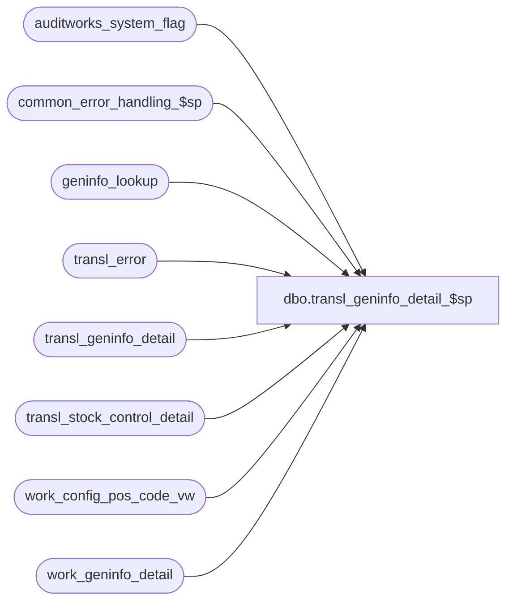

# dbo.transl_geninfo_detail_$sp

**Database:** auditworks  
**Server:** bedrockdb01  

## Architecture Diagram



## Table Dependencies

| Referenced Table |
|---|
| auditworks_system_flag |
| common_error_handling_$sp |
| geninfo_lookup |
| transl_error |
| transl_geninfo_detail |
| transl_stock_control_detail |
| work_config_pos_code_vw |
| work_geninfo_detail |

## Stored Procedure Code

```sql
CREATE proc  dbo.transl_geninfo_detail_$sp 
@process_id		binary(16),
@process_no		smallint,
@lookup_pass		tinyint,
@request_id             binary(16),
@auto_config_required   tinyint OUTPUT,
@errmsg                 nvarchar(2000) OUTPUT


AS

/* 
PROC NAME: transl_geninfo_detail_$sp
     DESC: This proc will try to populate transl_stock_control_detail from transl_geninfo_detail based on
           geninfo_lookup. If the lookup does not exist, then create it.
           The proc is called from transl_pre_processing and runs on each peripheral database. 

Unicode version.
           
**************** NOTE: must be scripted with SET ANSI_NULLS ON ********************************     
     
 HISTORY: 
Date      Name          Defect# Desc
Sep12,16 Vicci        DAOM-1255 Because current version of VTP strips 'TS_' from form name but prior version did not, also look up the form name prefixed with TS_
Jan31,13 Vicci           141488 Log identification of the transaction that was the source of the auto-config to the work_config_pos_code_vw.
Feb17,12 Vicci           133087 Remove references to CRDM datatypes from procs installed in multi-stream S/A databases where CRDM is not installed.
Jun30,05  David         DV-1285 Log form_name to new column in work table instead of lookup_pos_code.
                                Bypass retry loop if not in a scaleout environment. Log display_def_id to transl_error.transaction_count.
May05,05  David         DV-1202 Handle NULL for initiated_by_host field.
Mar23,05  David         DV-1202 Author
*/

DECLARE  
  @base_language_id             smallint,  
  @errno                        int,
  @fixed_count                  int,
  @issue_count                  int,
  @max_retry                    int,
  @message_id			int,
  @object_name			nvarchar(255),
  @operation_name		nvarchar(100),
  @process_name			nvarchar(100),
  @rows                         int,
  @scaleout_flag		tinyint,
  @try_no                       int,
  @wait_time                    nchar(8)

SELECT @process_name = 'transl_geninfo_detail_$sp',
       @message_id   = 201068,       
       @fixed_count = 0,
       @issue_count = 0,
       @base_language_id = 1033,
       @scaleout_flag = 0,
       @try_no = 0,
       @max_retry = 10,
       @wait_time = '00:00:10'
       
SELECT @issue_count = count(row_sequence_no)
  FROM transl_geninfo_detail
 WHERE display_def_id IS NULL --

SELECT @errno = @@error
IF @errno != 0
  BEGIN
    SELECT @errmsg = 'Failed to select the issue_count.',
           @object_name = 'transl_geninfo_detail',
	   @operation_name = 'SELECT'
    GOTO error
  END
  
IF @issue_count = 0
  RETURN

UPDATE transl_geninfo_detail
   SET display_def_id = l.display_def_id
  FROM transl_geninfo_detail t, geninfo_lookup l
 WHERE t.form_name  = l.form_name
   AND t.field_name = l.field_name
   AND t.display_def_id IS NULL --
SELECT @errno = @@error, @fixed_count = @@rowcount
IF @errno != 0
BEGIN
  SELECT @errmsg = 'Failed to set display_def_id.',
         @object_name = 'transl_geninfo_detail',
         @operation_name = 'UPDATE'
  GOTO error
END
IF @issue_count <> @fixed_count
BEGIN
  --Because current version of VTP strips TS_ from form name but prior version did not.
  UPDATE transl_geninfo_detail
     SET display_def_id = l.display_def_id
    FROM transl_geninfo_detail t, geninfo_lookup l
   WHERE 'TS_' + t.form_name  = l.form_name
     AND t.field_name = l.field_name
     AND t.display_def_id IS NULL --
  SELECT @errno = @@error, @fixed_count = @fixed_count + @@rowcount
  IF @errno != 0
  BEGIN
    SELECT @errmsg = 'Failed to set display_def_id from lookup with TS_ prefix.',
           @object_name = 'transl_geninfo_detail',
           @operation_name = 'UPDATE'
    GOTO error
  END
END

/* If the proc has been called for the second time and the replication has been instantaneous, the issue_count will be equal
   to fixed count and the autoconfig is complete. 
   Note: The proc will be called for the second time when a new code is configured and now the corresponding
   transl tables needs to be updated with the new S/A config. The actual configuration which is a insert to our S/A master
   tables happens in TM database which in scaleout environment exist in different server. After successful insertion the rows
   get replicated to peripheral databases. Most of the time the replication is instantaneous, but there is always a chance
   that replication happens with delays so the proc has to waitfor some delays and then try to update the transl tables again.
   As we do not want to wait for ever, maximum of retry will be defined and if we reach the max retry, a warning message
   will be issued to inform the user that the process was not able to auto configure all the rows and we process the next
   batch. */

SELECT @scaleout_flag = CONVERT(TINYINT,flag_numeric_value)
  FROM auditworks_system_flag
 WHERE flag_name = 'scaleout_flag'

  SELECT @errno = @@error  
  IF @errno != 0
  BEGIN
    SELECT @errmsg = 'Failed to get scaleout flag.',
           @object_name = 'auditworks_system_flag',
           @operation_name = 'SELECT'
    GOTO error
  END
      
WHILE @issue_count <> @fixed_count AND @lookup_pass = 2 
BEGIN
  
  SELECT @try_no = @try_no + 1
  
  IF @try_no > @max_retry OR @scaleout_flag = 0
  BEGIN
    SELECT @errmsg = 'Maximum retry |1 has reached. The edit was not able to auto configure all the data.',
           @errno = 202015,
           @message_id = 202015, 
           @object_name = 'transl_geninfo_detail',
           @operation_name = 'update'
    
    EXEC common_error_handling_$sp @process_no, @errno, @errmsg, 3, @message_id, @process_name,
                 @object_name, @operation_name, 1, NULL, NULL, NULL, NULL, @max_retry
    RETURN
  END
    
  WAITFOR DELAY @wait_time
  
  UPDATE transl_geninfo_detail
     SET display_def_id = l.display_def_id
    FROM transl_geninfo_detail t, geninfo_lookup l
   WHERE t.form_name  = l.form_name
     AND t.field_name = l.field_name
     AND t.display_def_id IS NULL --
  SELECT @errno = @@error,
         @fixed_count = @fixed_count + @@rowcount
  IF @errno != 0
  BEGIN
    SELECT @errmsg = 'Failed to set display_def_id (loop).',
   	   @object_name = 'transl_geninfo_detail',
	   @operation_name = 'UPDATE'
    GOTO error
  END
  IF @issue_count <> @fixed_count
  BEGIN
    --Because current version of VTP strips TS_ from form name but prior version did not.
    UPDATE transl_geninfo_detail
       SET display_def_id = l.display_def_id
      FROM transl_geninfo_detail t, geninfo_lookup l
     WHERE 'TS_' + t.form_name  = l.form_name
       AND t.field_name = l.field_name
       AND t.display_def_id IS NULL --
    SELECT @errno = @@error, @fixed_count = @fixed_count + @@rowcount
    IF @errno != 0
    BEGIN
      SELECT @errmsg = 'Failed to set display_def_id from lookup with TS_ prefix (loop).',
             @object_name = 'transl_geninfo_detail',
             @operation_name = 'UPDATE'
      GOTO error
    END
  END
END --WHILE @issue_count <> @fixed_count AND @lookup_pass = 2


IF @issue_count = @fixed_count 
BEGIN
  DELETE work_geninfo_detail
   WHERE request_id = @request_id

  SELECT @errno = @@error
  IF @errno != 0
  BEGIN
    SELECT @errmsg = 'Failed to initialize work_geninfo_detail.',
           @object_name = 'work_geninfo_detail',
           @operation_name = 'DELETE'
    GOTO error
  END

  INSERT INTO work_geninfo_detail(row_sequence_no,
                                request_id,
                                auto_config_verified,
                                count_date,
                                initiated_by_host,
                                location_no,
                                merchandise_key,
                                originating_store_no,
                      other_store_no,
                                pos_deptclass,
                                units,
                                upc_no,
                                imrd,
                                pos_identifier,
                                reason,
                                vendor_no)
  SELECT t.row_sequence_no,
         @request_id,
         l.auto_config_verified,
         dateadd(dd, l.count_date_flag - 1, t.field_data_date), 
         IsNull(t.field_data_num * l.initiated_by_host_flag, 0),
         t.field_data_num * l.location_no_flag,
         t.field_data_num * l.merchandise_key_flag,
         t.field_data_num * l.originating_store_no_flag,
         t.field_data_num * l.other_store_no_flag,
         t.field_data_num * l.pos_deptclass_flag,
         t.field_data_num * l.units_flag,
         t.field_data_num * l.upc_no_flag,
         LEFT(t.field_data_string, 1500 * l.imrd_flag),
         LEFT(t.field_data_string, 1500 * l.pos_identifier_flag),
         LEFT(t.field_data_string, 1500 * l.reason_flag),
         LEFT(t.field_data_string, 1500 * l.vendor_no_flag)
    FROM transl_geninfo_detail t, geninfo_lookup l
   WHERE t.form_name  = l.form_name
     AND t.field_name = l.field_name

    SELECT @errno = @@error
    IF @errno != 0
    BEGIN
      SELECT @errmsg = 'Failed to populate work_geninfo_detail.',
             @object_name = 'work_geninfo_detail',
             @operation_name = 'INSERT'
      GOTO error
    END

-- Check if there are any tran_id/line_id/display_def_id combo in transl_geninfo_detail that 
-- already exists in transl_stock_control_detail, and log those entries as duplicates.
  INSERT transl_error (
	store_no,
	register_no,
	entry_date_time,
	transaction_series,
	transaction_no,
	line_id,
	transl_reject_reason,  
	posting_end_date_time,
	transaction_count,
	transl_error_msg)
  SELECT
	g.store_no,
	g.register_no,
	g.entry_date_time,
	g.transaction_series,
	g.transaction_no,
	g.line_id,
	143,
	getdate(),
	g.display_def_id,
	'Duplicate lines from the translate were skipped by the edit for stock control'
    FROM transl_geninfo_detail g, transl_stock_control_detail s
   WHERE g.store_no           = s.store_no
     AND g.register_no        = s.register_no
     AND g.entry_date_time    = s.entry_date_time
     AND g.transaction_series = s.transaction_series
     AND g.transaction_no     = s.transaction_no
     AND g.line_id            = s.line_id
     AND g.display_def_id     = s.display_def_id

    SELECT @errno = @@error
    IF @errno != 0
BEGIN
      SELECT @errmsg = 'Failed to get list of duplicates in transl_geninfo_detail.',
             @object_name = 'transl_error',
             @operation_name = 'INSERT'
      GOTO error
    END

  INSERT transl_stock_control_detail (
          store_no,
          register_no,
          entry_date_time,
          transaction_series,
          transaction_no,
          line_id,
          display_def_id,
          upc_no,
          merchandise_key,
          initiated_by_host,
          units,
          other_store_no,
          location_no,
          vendor_no,
          count_date,
          pos_deptclass,
          pos_identifier,
          originating_store_no,
          reason,
          imrd,
          auto_config_verified )
  SELECT  g.store_no,
          g.register_no,
          g.entry_date_time,
          g.transaction_series,
          g.transaction_no,
          g.line_id, 
          g.display_def_id, 
          MAX(upc_no), 
          MAX(merchandise_key),
          MAX(initiated_by_host),
          MAX(units),
          MAX(other_store_no),
          MAX(location_no),
          MAX(vendor_no),
          MAX(count_date),
          MAX(pos_deptclass),
          MAX(pos_identifier),
          MAX(originating_store_no),
          MAX(reason),
          MAX(imrd), 
          MIN(auto_config_verified)
    FROM work_geninfo_detail w, transl_geninfo_detail g
   WHERE g.display_def_id IS NOT NULL --
     AND g.row_sequence_no = w.row_sequence_no
     AND w.request_id = @request_id  
     AND NOT EXISTS (SELECT 1 FROM transl_error t -- exclude duplicates
                      WHERE g.store_no           = t.store_no
                        AND g.register_no        = t.register_no
                        AND g.entry_date_time    = t.entry_date_time
                        AND g.transaction_series = t.transaction_series
                        AND g.transaction_no     = t.transaction_no
                        AND g.line_id            = t.line_id
                        AND g.display_def_id     = t.transaction_count )
   GROUP BY g.store_no,
          g.register_no,
          g.entry_date_time,
          g.transaction_series,
          g.transaction_no,
          g.line_id, 
          g.display_def_id

    SELECT @errno = @@error
    IF @errno != 0
    BEGIN
      SELECT @errmsg = 'Failed to populate work_geninfo_detail.',
             @object_name = 'work_geninfo_detail',
             @operation_name = 'INSERT'
      GOTO error
    END

  DELETE work_geninfo_detail
   WHERE request_id = @request_id

  SELECT @errno = @@error
  IF @errno != 0
  BEGIN
    SELECT @errmsg = 'Failed to DELETE work_geninfo_detail.',
           @object_name = 'work_geninfo_detail',
           @operation_name = 'DELETE'
    GOTO error
  END
END -- @issue_count = @fixed_count 
ELSE 
BEGIN
  SELECT @auto_config_required = 1

  -- list of the new codes which need to be auto configured
  INSERT work_config_pos_code_vw(
           request_id,
           table_name,
           form_name,
           pos_description, -- field_name
           card_type,
           attachment_type,
           resource_id,
           new_code_flag,
           desc_update_flag,
           transaction_line_string)
  SELECT   @request_id,
           'geninfo_lookup',
           form_name, 
           field_name, -- pos_description
           field_datatype, -- card_type
           3,
           NULL,
           1,
           0, 
           MIN(convert(nvarchar, t.entry_date_time, 109) + '|' + convert(nvarchar, t.store_no)  + '|' + convert(nvarchar, t.register_no)  + '|' + t.transaction_series  + '|' +  convert(nvarchar, t.transaction_no) + '|' + convert(nvarchar, t.line_id))
    FROM transl_geninfo_detail t
   WHERE display_def_id IS NULL --
   GROUP BY form_name, field_name, field_datatype

     SELECT @errno = @@error
     IF @errno != 0
       BEGIN
         SELECT @errmsg = 'Failed to insert new codes which need to be auto configured',
	        @object_name = 'work_config_pos_code_vw',
	        @operation_name = 'INSERT'
    GOTO error
       END
END -- @issue_count <> @fixed_count 
   


RETURN

error:
        
	  
	EXEC common_error_handling_$sp @process_no, @errno, @errmsg, 0, @message_id, 
	@process_name, @object_name, @operation_name, 1, 1, 0,
	null, 0, null, null, null, null, null, null, 0, @process_id, NULL
	
        RETURN
```

