# dbo.transl_pre_processing_$sp

**Database:** auditworks  
**Server:** bedrockdb01  

## Architecture Diagram

```mermaid
flowchart LR
    SP["dbo.transl_pre_processing_$sp"]
    auditworks_parameter(["auditworks_parameter"]) --> SP
    common_error_handling__sp(["common_error_handling_$sp"]) --> SP
    interface_directory(["interface_directory"]) --> SP
    parameter_general(["parameter_general"]) --> SP
    transaction_series_lookup(["transaction_series_lookup"]) --> SP
    transl_auto_complete_order__sp(["transl_auto_complete_order_$sp"]) --> SP
    transl_customer(["transl_customer"]) --> SP
    transl_customer_detail(["transl_customer_detail"]) --> SP
    transl_customer_detail__sp(["transl_customer_detail_$sp"]) --> SP
    transl_discount_detail(["transl_discount_detail"]) --> SP
    transl_geninfo_detail__sp(["transl_geninfo_detail_$sp"]) --> SP
    transl_line_note(["transl_line_note"]) --> SP
    transl_line_note__sp(["transl_line_note_$sp"]) --> SP
    transl_merchandise_detail(["transl_merchandise_detail"]) --> SP
    transl_obj_action_attach__sp(["transl_obj_action_attach_$sp"]) --> SP
    transl_payroll_detail(["transl_payroll_detail"]) --> SP
    transl_payroll_detail__sp(["transl_payroll_detail_$sp"]) --> SP
    transl_post_void_detail(["transl_post_void_detail"]) --> SP
    transl_post_void_detail__sp(["transl_post_void_detail_$sp"]) --> SP
    transl_return_detail(["transl_return_detail"]) --> SP
    transl_return_detail__sp(["transl_return_detail_$sp"]) --> SP
    transl_special_order_detail(["transl_special_order_detail"]) --> SP
    transl_stock_control_detail(["transl_stock_control_detail"]) --> SP
    transl_stock_control_imrd__sp(["transl_stock_control_imrd_$sp"]) --> SP
    transl_stock_control_reason__sp(["transl_stock_control_reason_$sp"]) --> SP
    transl_stock_control_vendor__sp(["transl_stock_control_vendor_$sp"]) --> SP
    transl_tax_override_detail(["transl_tax_override_detail"]) --> SP
    transl_transaction_hdr(["transl_transaction_hdr"]) --> SP
    transl_transaction_line(["transl_transaction_line"]) --> SP
    transl_transaction_line__sp(["transl_transaction_line_$sp"]) --> SP
    transl_transaction_line_link(["transl_transaction_line_link"]) --> SP
    work_config_pos_code_vw(["work_config_pos_code_vw"]) --> SP
```



## Table Dependencies

| Referenced Table |
|---|
| auditworks_parameter |
| common_error_handling_$sp |
| interface_directory |
| parameter_general |
| transaction_series_lookup |
| transl_auto_complete_order_$sp |
| transl_customer |
| transl_customer_detail |
| transl_customer_detail_$sp |
| transl_discount_detail |
| transl_geninfo_detail_$sp |
| transl_line_note |
| transl_line_note_$sp |
| transl_merchandise_detail |
| transl_obj_action_attach_$sp |
| transl_payroll_detail |
| transl_payroll_detail_$sp |
| transl_post_void_detail |
| transl_post_void_detail_$sp |
| transl_return_detail |
| transl_return_detail_$sp |
| transl_special_order_detail |
| transl_stock_control_detail |
| transl_stock_control_imrd_$sp |
| transl_stock_control_reason_$sp |
| transl_stock_control_vendor_$sp |
| transl_tax_override_detail |
| transl_transaction_hdr |
| transl_transaction_line |
| transl_transaction_line_$sp |
| transl_transaction_line_link |
| work_config_pos_code_vw |

## Stored Procedure Code

```sql
CREATE proc [dbo].[transl_pre_processing_$sp] @lookup_pass             tinyint,
@request_id_txt          nvarchar(50) = NULL --


AS

/* 
PROC NAME: transl_pre_processing_$sp
     DESC: This proc is called from smartload and runs on each peripheral database. 

  WARNING:  Must be scripted with SET ANSI_NULLS ON.           
  
  NOTE: This unicode version is suitable for both SA5.0 and SA5.1
   
 HISTORY: 
Date      Name          Def# Desc
Oct06,14 Vicci     TFS-87530 Add milliseconds to duplicate entry date times for Safe Reconciliation vs deposit declaration.
Jul29,14 Vicci     TFS-79401 If an upgrade is in progress, exit immediately.
Apr18,13 Vicci        143421 Adjust work_config_pos_code.transaction_series based on transaction_series_lookup if necessary.
Apr12,13 Vicci        141488 Log entry_date_time to work_config_pos_code_vw.entry_date_time, not register_no.
Mar04,13 Vicci        141488 Correct all references to work_config_pos_vw to be work_config_pos_code_vw
Jan31,13 Vicci        141488 Log information for transaction that was source of auto-config.
Feb17,12 Vicci        133087 Remove references to CRDM datatypes from procs installed in multi-stream S/A databases where CRDM is not installed.
Aug05,11 Vicci        128827 Clarified trace message content to facilitate debugging.  
                             Since in SQL Server 2005 CONVERT(nvarchar(50),@request_id,1) only works if @request_id is UniqueIdentifier, 
                             change its datatype.  Note, implicit conversion to binary works.
Apr28,11 Paul         126574 Use convert to avoid truncation of guid on select of @request_id via sqlcmd
Sep29,10 Paul         118378 Log message to smartload log when this proc ends
Nov13,09 Vicci        114178 Only execute the pre-processing hook and order auto-complete logic on the final pass.
Jul24,09 Vicci        109078 Call transl_auto_complete_order_$sp    
Jul31,08 Paul          87777 Uplift 85555 to SA5
Apr18,07 Paul        DV-1363 port 1-3LFU8C to SA5
Jun16,05 David       DV-1278 Return @auto_config_required to ICT.
May12,05 David       DV-1202 SA5 version
Apr19,07 Vicci         85555 Provide hook for custom code
Feb19,07 Daphna     1-3LFU8C Ensure only duplicate errors just posted are excluded from insert to transl_stock_control
Jul18,06 Vicci	       74959 Avoid arithmetic overflow when lookup_pos_code does not fit
			     destination and add error handling where missing.
Sep15,05 David         60266 Author.

*/

DECLARE  
  @auto_config_required         tinyint,
  @errno                        int,
  @errmsg                       nvarchar(255),
  @message_id			int,
  @object_name			nvarchar(255),
  @operation_name		nvarchar(100),
  @process_no			smallint,
  @process_name			nvarchar(100),
  @process_id                   binary(16),
  @rows				int,
  @sql_command 			nvarchar(3000),
  @trace_msg			nvarchar(500),
  @transl_pre_processing_hook   nvarchar(100),
  @request_id_uid		uniqueidentifier,
  @request_id			binary(16)

SELECT @process_no   = 290,
       @process_name = 'transl_pre_processing_$sp',
       @message_id   = 201068,       
       @process_id = @@spid,
       @auto_config_required = 0

SET ANSI_WARNINGS ON

IF EXISTS ( SELECT 1
	      FROM parameter_general
	     WHERE upgrade_in_progress > 0)
BEGIN
  SELECT @trace_msg = NCHAR(13) + NCHAR(10) + ':LOG && Edit cannot execute transl_pre_processing_$sp:  the S/A database is currently being upgraded.  Please try again later. ' + CONVERT(nchar, getdate(), 8);
  PRINT @trace_msg;

  SELECT @message_id = 201036,
         @errno = 201500,
         @errmsg = 'The Edit cannot execute transl_pre_processing_$sp:  the S/A database is currently being upgraded.  Please try again later.',
         @object_name = 'parameter_general',
         @operation_name = 'SELECT';
  GOTO error;
END

SELECT @trace_msg = nchar(13) + nchar(10) + ':LOG && transl_pre_processing (pass ' + CONVERT(nvarchar,@lookup_pass) + ') starts: ' + CONVERT(nchar, getdate(), 14) 
PRINT @trace_msg


IF @request_id_txt IS NULL  --
BEGIN
  SELECT @request_id_uid = newid()
  SELECT @request_id = @request_id_uid
  SELECT @request_id_txt = CONVERT(nvarchar(50),@request_id_uid,1)
END
ELSE
BEGIN
  SELECT @request_id_uid = CONVERT(uniqueidentifier, @request_id_txt)
  SELECT @request_id = @request_id_uid
END

SELECT @trace_msg = nchar(13) + nchar(10) + ':LOG &&   transl_geninfo_detail: ' + CONVERT(nchar, getdate(), 14)
PRINT @trace_msg

EXEC transl_geninfo_detail_$sp @process_id, @process_no, @lookup_pass, @request_id, @auto_config_required OUTPUT, @errmsg OUTPUT

  SELECT @errno = @@error
  IF @errno != 0
  BEGIN
    IF @errmsg IS NULL /* then */
      SELECT @errmsg = 'Failed to execute stored procedure transl_geninfo_detail_$sp'
    SELECT @object_name = 'transl_geninfo_detail_$sp',
           @operation_name = 'EXECUTE'
    GOTO error
  END   


SELECT @trace_msg = nchar(13) + nchar(10) + ':LOG &&   transl_return_detail_$sp: ' + CONVERT(nchar, getdate(), 14)
PRINT @trace_msg

EXEC transl_return_detail_$sp @process_id, @process_no, @lookup_pass, @request_id, @auto_config_required OUTPUT, @errmsg OUTPUT

SELECT @errno = @@error
IF @errno != 0
  BEGIN
    IF @errmsg IS NULL /* then */
      SELECT @errmsg = 'Failed to execute stored procedure transl_return_detail_$sp'
    SELECT @object_name = 'transl_return_detail_$sp',
           @operation_name = 'EXECUTE'
    GOTO error
  END      


SELECT @trace_msg = nchar(13) + nchar(10) + ':LOG &&   transl_payroll_detail_$sp: ' + CONVERT(nchar, getdate(), 14)
PRINT @trace_msg

EXEC transl_payroll_detail_$sp @process_id, @process_no, @lookup_pass, @request_id, @auto_config_required OUTPUT, @errmsg OUTPUT

SELECT @errno = @@error
IF @errno != 0
  BEGIN
    IF @errmsg IS NULL /* then */
      SELECT @errmsg = 'Failed to execute stored procedure transl_payroll_detail_$sp'
    SELECT @object_name = 'transl_payroll_detail_$sp',
           @operation_name = 'EXECUTE'
    GOTO error
  END      


SELECT @trace_msg = nchar(13) + nchar(10) + ':LOG &&   transl_customer_detail_$sp: ' + CONVERT(nchar, getdate(), 14)
PRINT @trace_msg

EXEC transl_customer_detail_$sp @process_id, @process_no, @lookup_pass, @request_id, @auto_config_required OUTPUT, @errmsg OUTPUT

SELECT @errno = @@error
IF @errno != 0
  BEGIN
    IF @errmsg IS NULL /* then */
   SELECT @errmsg = 'Failed to execute stored procedure transl_customer_detail_$sp'
    SELECT @object_name = 'transl_customer_detail_$sp',
           @operation_name = 'EXECUTE'
    GOTO error
  END      


SELECT @trace_msg = nchar(13) + nchar(10) + ':LOG &&   transl_post_void_detail_$sp: ' + CONVERT(nchar, getdate(), 14)
PRINT @trace_msg

EXEC transl_post_void_detail_$sp @process_id, @process_no, @lookup_pass, @request_id, @auto_config_required OUTPUT, @errmsg OUTPUT

SELECT @errno = @@error
IF @errno != 0
  BEGIN
    IF @errmsg IS NULL /* then */
      SELECT @errmsg = 'Failed to execute stored procedure transl_post_void_detail_$sp'
    SELECT @object_name = 'transl_post_void_detail_$sp',
           @operation_name = 'EXECUTE'
    GOTO error
  END
  

SELECT @trace_msg = nchar(13) + nchar(10) + ':LOG &&   transl_line_note_$sp: ' + CONVERT(nchar, getdate(), 14)
PRINT @trace_msg

EXEC transl_line_note_$sp @process_id, @process_no, @lookup_pass, @request_id, @auto_config_required OUTPUT, @errmsg OUTPUT

SELECT @errno = @@error
IF @errno != 0
  BEGIN
    IF @errmsg IS NULL /* then */
      SELECT @errmsg = 'Failed to execute stored procedure transl_line_note_$sp'
    SELECT @object_name = 'transl_line_note_$sp',
           @operation_name = 'EXECUTE'
    GOTO error
  END


SELECT @trace_msg = nchar(13) + nchar(10) + ':LOG &&   transl_stock_control_reason_$sp: ' + CONVERT(nchar, getdate(), 14)
PRINT @trace_msg

EXEC transl_stock_control_reason_$sp @process_id, @process_no, @lookup_pass, @request_id, @auto_config_required OUTPUT, @errmsg OUTPUT

SELECT @errno = @@error
IF @errno != 0
  BEGIN
    IF @errmsg IS NULL /* then */
      SELECT @errmsg = 'Failed to execute stored procedure transl_stock_control_reason_$sp'
    SELECT @object_name = 'transl_stock_control_reason_$sp',
           @operation_name = 'EXECUTE'
    GOTO error
  END


SELECT @trace_msg = nchar(13) + nchar(10) + ':LOG &&   transl_stock_control_imrd_$sp: ' + CONVERT(nchar, getdate(), 14)
PRINT @trace_msg

EXEC transl_stock_control_imrd_$sp @process_id, @process_no, @lookup_pass, @request_id, @auto_config_required OUTPUT, @errmsg OUTPUT

SELECT @errno = @@error
IF @errno != 0
  BEGIN
    IF @errmsg IS NULL /* then */
      SELECT @errmsg = 'Failed to execute stored procedure transl_stock_control_imrd_$sp'
 SELECT @object_name = 'transl_stock_control_imrd_$sp',
           @operation_name = 'EXECUTE'
    GOTO error
  END


SELECT @trace_msg = nchar(13) + nchar(10) + ':LOG &&   transl_stock_control_vendor_$sp: ' + CONVERT(nchar, getdate(), 14)
PRINT @trace_msg

EXEC transl_stock_control_vendor_$sp @process_id, @process_no, @lookup_pass, @request_id, @auto_config_required OUTPUT, @errmsg OUTPUT

SELECT @errno = @@error
IF @errno != 0
  BEGIN
    IF @errmsg IS NULL /* then */
      SELECT @errmsg = 'Failed to execute stored procedure transl_stock_control_vendor_$sp'
    SELECT @object_name = 'transl_stock_control_vendor_$sp',
           @operation_name = 'EXECUTE'
    GOTO error
  END


SELECT @trace_msg = nchar(13) + nchar(10) + ':LOG &&   transl_transaction_line_$sp: ' + CONVERT(nchar, getdate(), 14)
PRINT @trace_msg

EXEC transl_transaction_line_$sp @process_id, @process_no, @lookup_pass, @request_id, @auto_config_required OUTPUT, @errmsg OUTPUT

SELECT @errno = @@error
IF @errno != 0
  BEGIN
    IF @errmsg IS NULL /* then */
      SELECT @errmsg = 'Failed to execute stored procedure transl_transaction_line_$sp'
    SELECT @object_name = 'transl_transaction_line_$sp',
           @operation_name = 'EXECUTE'
    GOTO error
  END


SELECT @trace_msg = nchar(13) + nchar(10) + ':LOG &&   transl_obj_action_attach_$sp: ' + CONVERT(nchar, getdate(), 14)
PRINT @trace_msg

EXEC transl_obj_action_attach_$sp @process_id, @process_no, @lookup_pass, @request_id, @auto_config_required OUTPUT, @errmsg OUTPUT

SELECT @errno = @@error
IF @errno != 0
  BEGIN
    IF @errmsg IS NULL /* then */
      SELECT @errmsg = 'Failed to execute stored procedure transl_obj_action_attach_$sp'
    SELECT @object_name = 'transl_obj_action_attach_$sp',
           @operation_name = 'EXECUTE'
    GOTO error
  END

SELECT @transl_pre_processing_hook = par_value 
  FROM auditworks_parameter
 WHERE par_name = 'transl_pre_processing_hook'
SELECT @errno = @@error
IF @errno != 0
BEGIN
  SELECT @errmsg = 'Failed to determine if any custom pre-processing has been requested',
         @object_name = 'auditworks_parameter',
         @operation_name = 'SELECT'
  GOTO error
END

IF ((@auto_config_required = 0 AND @lookup_pass = 1) OR @lookup_pass = 2) 
BEGIN
  SELECT @trace_msg = nchar(13) + nchar(10) + ':LOG && transl_auto_complete_order_$sp: ' + CONVERT(nchar, getdate(), 14)
  PRINT @trace_msg

  EXEC transl_auto_complete_order_$sp    
  SELECT @errno = @@error
  IF @errno <> 0
  BEGIN
    SELECT @errmsg = 'Failed to execute transl_auto_complete_order_$sp. ', 
           @object_name = 'transl_auto_complete_order_$sp',
           @operation_name = 'EXECUTE'
    GOTO  error  
  END

  IF @transl_pre_processing_hook IS NOT NULL AND @transl_pre_processing_hook <> '' AND @transl_pre_processing_hook <> ' '
  BEGIN
    IF EXISTS (SELECT 1 
                 FROM sysobjects 
                WHERE name = @transl_pre_processing_hook AND type = 'P')
    BEGIN
      SELECT @trace_msg = nchar(13) + nchar(10) + ':LOG && transl_pre_processing (pass ' + CONVERT(nvarchar,@lookup_pass) + ') ends: ' + CONVERT(nchar, getdate(), 14)
      PRINT @trace_msg

      SELECT @sql_command = 'EXEC ' + @transl_pre_processing_hook 
      EXEC sp_executesql @sql_command             
      SELECT @errno = @@error
      IF @errno <> 0
      BEGIN
        PRINT @sql_command  
        SELECT @errmsg = 'Failed to execute custom transaction edit pre-processing hook via dynamic SQL',
               @object_name = @transl_pre_processing_hook,
               @operation_name = 'EXECUTE'
        GOTO error
      END
    END  --if hook proc name is valid
  END  --if hook proc name is set and this is the final pass
  
   --If Coalition is active auto-correct its safe-rec transaction entry_datetime
   SELECT @rows = 0
   IF EXISTS (SELECT 1 FROM interface_directory WHERE interface_id = 16 AND update_timing <> 0)
   BEGIN
     SELECT h.store_no, 
            h.register_no, 
            h.entry_date_time, 
            h.transaction_series, 
            MAX(l.transaction_no) transaction_no  --using l. prefix so that the transaction being adjusted is the safe-rec one
       INTO #dup_entry_datetime_list
       FROM transl_transaction_hdr h
            INNER JOIN transl_transaction_line l
               ON h.store_no = l.store_no
              AND h.register_no = l.register_no
              AND h.entry_date_time = l.entry_date_time
              AND h.transaction_series = l.transaction_series
              --join on transaction_no purposefully left out so that header of both the safe-rec and of the deposit declaration are picked up
              AND l.line_action = 246
              AND (l.line_object = 9018 OR l.lookup_pos_code like '021.000.FLOAT.IsSafe.TENDER.Idx=%')
      GROUP BY h.store_no, 
            h.register_no, 
            h.entry_date_time, 
            h.transaction_series
     HAVING MIN(h.transaction_no) <> MAX(h.transaction_no)  --using h. prefix so that only finds issue if 2 different headers exist(as opposed to multiple lines)
     SELECT @errno = @@error, @rows = @@rowcount
     IF @errno <> 0
     BEGIN
       SELECT @errmsg = 'Failed to determine if any Coalition safe rec transactions with same entry_date_time as prior transaction exist.',
              @object_name = '#dup_entry_datetime_list',
              @operation_name = 'INSERT INTO'
       GOTO error
     END
   END
 
   IF @rows > 0  --i.e. safe rec transactions with same entry-date-time as prior transaction exist
   BEGIN
     UPDATE transl_transaction_hdr
        SET entry_date_time = dateadd(ms, 10, h.entry_date_time)
       FROM transl_transaction_hdr h, #dup_entry_datetime_list d
      WHERE h.store_no = d.store_no
        AND h.register_no = d.register_no
        AND h.entry_date_time = d.entry_date_time
        AND h.transaction_series = d.transaction_series
        AND h.transaction_no = d.transaction_no
     SELECT @errno = @@error
     IF @errno <> 0
     BEGIN
       SELECT @errmsg = 'Failed to add milliseconds to Coalition safe rec transactions with same entry_date_time as prior transaction.',
              @object_name = 'transl_transaction_hdr',
              @operation_name = 'UPDATE'
       GOTO error
     END
    
     UPDATE transl_transaction_line
     SET entry_date_time = dateadd(ms, 10, h.entry_date_time)
     FROM transl_transaction_line h, #dup_entry_datetime_list d
     WHERE h.store_no = d.store_no
      AND h.register_no = d.register_no
      AND h.entry_date_time = d.entry_date_time
      AND h.transaction_series = d.transaction_series
      AND h.transaction_no = d.transaction_no
     SELECT @errno = @@error
     IF @errno <> 0
     BEGIN
       SELECT @errmsg = 'Failed to add milliseconds to Coalition safe rec transactions with same entry_date_time as prior transaction.',
              @object_name = 'transl_transaction_line',
              @operation_name = 'UPDATE'
       GOTO error
     END

     UPDATE transl_stock_control_detail
     SET entry_date_time = dateadd(ms, 10, h.entry_date_time)
     FROM transl_stock_control_detail h, #dup_entry_datetime_list d
     WHERE h.store_no = d.store_no
      AND h.register_no = d.register_no
      AND h.entry_date_time = d.entry_date_time
      AND h.transaction_series = d.transaction_series
      AND h.transaction_no = d.transaction_no
     SELECT @errno = @@error
     IF @errno <> 0
     BEGIN
       SELECT @errmsg = 'Failed to add milliseconds to Coalition safe rec transactions with same entry_date_time as prior transaction.',
              @object_name = 'transl_stock_control_detail',
              @operation_name = 'UPDATE'
       GOTO error
     END

     UPDATE transl_merchandise_detail
     SET entry_date_time = dateadd(ms, 10, h.entry_date_time)
     FROM transl_merchandise_detail h, #dup_entry_datetime_list d
     WHERE h.store_no = d.store_no
      AND h.register_no = d.register_no
      AND h.entry_date_time = d.entry_date_time
      AND h.transaction_series = d.transaction_series
      AND h.transaction_no = d.transaction_no
     SELECT @errno = @@error
     IF @errno <> 0
     BEGIN
       SELECT @errmsg = 'Failed to add milliseconds to Coalition safe rec transactions with same entry_date_time as prior transaction.',
              @object_name = 'transl_merchandise_detail',
              @operation_name = 'UPDATE'
       GOTO error
     END

     UPDATE transl_discount_detail
     SET entry_date_time = dateadd(ms, 10, h.entry_date_time)
     FROM transl_discount_detail h, #dup_entry_datetime_list d
     WHERE h.store_no = d.store_no
      AND h.register_no = d.register_no
      AND h.entry_date_time = d.entry_date_time
      AND h.transaction_series = d.transaction_series
      AND h.transaction_no = d.transaction_no
     SELECT @errno = @@error
     IF @errno <> 0
     BEGIN
       SELECT @errmsg = 'Failed to add milliseconds to Coalition safe rec transactions with same entry_date_time as prior transaction.',
              @object_name = 'transl_discount_detail',
              @operation_name = 'UPDATE'
       GOTO error
     END

     UPDATE transl_customer
     SET entry_date_time = dateadd(ms, 10, h.entry_date_time)
     FROM transl_customer h, #dup_entry_datetime_list d
     WHERE h.store_no = d.store_no
      AND h.register_no = d.register_no
      AND h.entry_date_time = d.entry_date_time
      AND h.transaction_series = d.transaction_series
      AND h.transaction_no = d.transaction_no
     SELECT @errno = @@error
     IF @errno <> 0
     BEGIN
       SELECT @errmsg = 'Failed to add milliseconds to Coalition safe rec transactions with same entry_date_time as prior transaction.',
              @object_name = 'transl_customer',
              @operation_name = 'UPDATE'
       GOTO error
     END

     UPDATE transl_customer_detail
     SET entry_date_time = dateadd(ms, 10, h.entry_date_time)
     FROM transl_customer_detail h, #dup_entry_datetime_list d
     WHERE h.store_no = d.store_no
      AND h.register_no = d.register_no
      AND h.entry_date_time = d.entry_date_time
      AND h.transaction_series = d.transaction_series
      AND h.transaction_no = d.transaction_no
     SELECT @errno = @@error
     IF @errno <> 0
     BEGIN
       SELECT @errmsg = 'Failed to add milliseconds to Coalition safe rec transactions with same entry_date_time as prior transaction.',
              @object_name = 'transl_customer_detail',
              @operation_name = 'UPDATE'
       GOTO error
     END

     UPDATE transl_payroll_detail
     SET entry_date_time = dateadd(ms, 10, h.entry_date_time)
     FROM transl_payroll_detail h, #dup_entry_datetime_list d
     WHERE h.store_no = d.store_no
      AND h.register_no = d.register_no
      AND h.entry_date_time = d.entry_date_time
      AND h.transaction_series = d.transaction_series
      AND h.transaction_no = d.transaction_no
     SELECT @errno = @@error
     IF @errno <> 0
     BEGIN
       SELECT @errmsg = 'Failed to add milliseconds to Coalition safe rec transactions with same entry_date_time as prior transaction.',
              @object_name = 'transl_payroll_detail',
              @operation_name = 'UPDATE'
       GOTO error
     END

     UPDATE transl_line_note
     SET entry_date_time = dateadd(ms, 10, h.entry_date_time)
     FROM transl_line_note h, #dup_entry_datetime_list d
     WHERE h.store_no = d.store_no
      AND h.register_no = d.register_no
      AND h.entry_date_time = d.entry_date_time
      AND h.transaction_series = d.transaction_series
      AND h.transaction_no = d.transaction_no
     SELECT @errno = @@error
     IF @errno <> 0
     BEGIN
       SELECT @errmsg = 'Failed to add milliseconds to Coalition safe rec transactions with same entry_date_time as prior transaction.',
              @object_name = 'transl_line_note',
              @operation_name = 'UPDATE'
       GOTO error
     END

     UPDATE transl_tax_override_detail
     SET entry_date_time = dateadd(ms, 10, h.entry_date_time)
     FROM transl_tax_override_detail h, #dup_entry_datetime_list d
     WHERE h.store_no = d.store_no
      AND h.register_no = d.register_no
      AND h.entry_date_time = d.entry_date_time
      AND h.transaction_series = d.transaction_series
      AND h.transaction_no = d.transaction_no
     SELECT @errno = @@error
     IF @errno <> 0
     BEGIN
       SELECT @errmsg = 'Failed to add milliseconds to Coalition safe rec transactions with same entry_date_time as prior transaction.',
              @object_name = 'transl_tax_override_detail',
              @operation_name = 'UPDATE'
       GOTO error
     END

     UPDATE transl_return_detail
     SET entry_date_time = dateadd(ms, 10, h.entry_date_time)
     FROM transl_return_detail h, #dup_entry_datetime_list d
     WHERE h.store_no = d.store_no
      AND h.register_no = d.register_no
      AND h.entry_date_time = d.entry_date_time
      AND h.transaction_series = d.transaction_series
      AND h.transaction_no = d.transaction_no
     SELECT @errno = @@error
     IF @errno <> 0
     BEGIN
       SELECT @errmsg = 'Failed to add milliseconds to Coalition safe rec transactions with same entry_date_time as prior transaction.',
              @object_name = 'transl_return_detail',
              @operation_name = 'UPDATE'
       GOTO error
     END

     UPDATE transl_special_order_detail
     SET entry_date_time = dateadd(ms, 10, h.entry_date_time)
     FROM transl_special_order_detail h, #dup_entry_datetime_list d
     WHERE h.store_no = d.store_no
      AND h.register_no = d.register_no
      AND h.entry_date_time = d.entry_date_time
      AND h.transaction_series = d.transaction_series
      AND h.transaction_no = d.transaction_no
     SELECT @errno = @@error
     IF @errno <> 0
     BEGIN
       SELECT @errmsg = 'Failed to add milliseconds to Coalition safe rec transactions with same entry_date_time as prior transaction.',
              @object_name = 'transl_special_order_detail',
              @operation_name = 'UPDATE'
       GOTO error
     END

     UPDATE transl_transaction_line_link
     SET entry_date_time = dateadd(ms, 10, h.entry_date_time)
     FROM transl_transaction_line_link h, #dup_entry_datetime_list d
     WHERE h.store_no = d.store_no
      AND h.register_no = d.register_no
      AND h.entry_date_time = d.entry_date_time
      AND h.transaction_series = d.transaction_series
      AND h.transaction_no = d.transaction_no
     SELECT @errno = @@error
     IF @errno <> 0
     BEGIN
       SELECT @errmsg = 'Failed to add milliseconds to Coalition safe rec transactions with same entry_date_time as prior transaction.',
              @object_name = 'transl_transaction_line_link',
              @operation_name = 'UPDATE'
       GOTO error
     END

     UPDATE transl_post_void_detail
     SET entry_date_time = dateadd(ms, 10, h.entry_date_time)
     FROM transl_post_void_detail h, #dup_entry_datetime_list d
     WHERE h.store_no = d.store_no
      AND h.register_no = d.register_no
      AND h.entry_date_time = d.entry_date_time
      AND h.transaction_series = d.transaction_series
      AND h.transaction_no = d.transaction_no
     SELECT @errno = @@error
     IF @errno <> 0
     BEGIN
       SELECT @errmsg = 'Failed to add milliseconds to Coalition safe rec transactions with same entry_date_time as prior transaction.',
              @object_name = 'transl_post_void_detail',
              @operation_name = 'UPDATE'
       GOTO error
     END
   END  --@rows > 0, i.e. safe rec entries with dup entry-date-time
 
END --if this is the final pass


UPDATE work_config_pos_code_vw
   SET store_no = q.store_no, 
       register_no = q.register_no, 
       entry_date_time = q.entry_date_time, 
       transaction_series = q.transaction_series,
       transaction_no = q.transaction_no, 
       line_id = q.line_id
  FROM (SELECT DISTINCT convert(nvarchar, t.entry_date_time, 109) + '|' + convert(nvarchar, t.store_no)  + '|' + convert(nvarchar, t.register_no)  + '|' + t.transaction_series  + '|' +  convert(nvarchar, t.transaction_no) + '|' + convert(nvarchar, t.line_id) transaction_line_string,
               t.store_no, t.register_no, t.entry_date_time, COALESCE(ts.transaction_series, t.transaction_series) transaction_series, t.transaction_no, t.line_id  
          FROM transl_transaction_line t
               LEFT OUTER JOIN transl_transaction_hdr h
                 ON t.store_no = h.store_no
                AND t.register_no = h.register_no
                AND t.entry_date_time = h.entry_date_time
                AND t.transaction_series = h.transaction_series
                AND t.transaction_no = h.transaction_no
               LEFT OUTER JOIN transaction_series_lookup ts WITH (NOLOCK) 
                 ON h.pos_transaction_series = ts.pos_transaction_series 
                AND h.transaction_series = ts.default_transaction_series
       ) q
 WHERE work_config_pos_code_vw.request_id = @request_id
   AND work_config_pos_code_vw.transaction_line_string = q.transaction_line_string
   AND work_config_pos_code_vw.transaction_no IS NULL
SELECT @errno = @@error
IF @errno != 0
BEGIN
  SELECT @errmsg = 'Failed to source of config transaction line information.',
         @object_name = 'work_config_pos_code_vw',
         @operation_name = 'UPDATE'
  GOTO error
END     
 
UPDATE work_config_pos_code_vw
   SET store_no = q.store_no, 
       register_no = q.register_no, 
       entry_date_time = q.entry_date_time, 
       transaction_series = q.transaction_series,
       transaction_no = q.transaction_no, 
       line_id = 0
  FROM (SELECT DISTINCT convert(nvarchar, t.entry_date_time, 109) + '|' + convert(nvarchar, t.store_no)  + '|' + convert(nvarchar, t.register_no)  + '|' + t.transaction_series  + '|' +  convert(nvarchar, t.transaction_no) + '|' transaction_line_string,
               t.store_no, t.register_no, t.entry_date_time, t.transaction_series, t.transaction_no  
          FROM transl_transaction_hdr t) q
 WHERE work_config_pos_code_vw.request_id = @request_id
   AND work_config_pos_code_vw.transaction_line_string like q.transaction_line_string + '%'
   AND work_config_pos_code_vw.transaction_no IS NULL
SELECT @errno = @@error
IF @errno != 0
BEGIN
  SELECT @errmsg = 'Failed to source of config transaction information not identified by a valid line.',
         @object_name = 'work_config_pos_code_vw',
         @operation_name = 'UPDATE'
  GOTO error
END

SELECT @trace_msg = nchar(13) + nchar(10) + ':LOG && transl_pre_processing (pass ' + CONVERT(nvarchar,@lookup_pass) + ') for request ' + @request_id_txt + ' ends: ' + CONVERT(nvarchar, getdate(), 14) + CASE WHEN @auto_config_required = 0 THEN '.  No auto-config required.' ELSE '.  Auto-config is required.' END 
PRINT @trace_msg
    
/* Set smartload variables. Use convert for @request_id since it is a guid */ 

SELECT ':VAR request_id=''' + @request_id_txt + ''''

SELECT ':VAR auto_config_required=',@auto_config_required

SET ANSI_WARNINGS OFF

RETURN

error:
        SET ANSI_WARNINGS OFF
	  
	EXEC common_error_handling_$sp @process_no, @errno, @errmsg, 0, @message_id, 
	@process_name, @object_name, @operation_name, 1, 1, 0,
	null, 0, null, null, null, null, null, null, 0, @process_id, NULL
	
        RETURN
```

