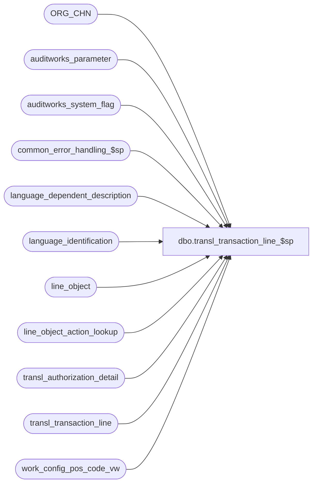

# dbo.transl_transaction_line_$sp

**Database:** auditworks  
**Server:** bedrockdb01  

## Architecture Diagram



## Table Dependencies

| Referenced Table |
|---|
| ORG_CHN |
| auditworks_parameter |
| auditworks_system_flag |
| common_error_handling_$sp |
| language_dependent_description |
| language_identification |
| line_object |
| line_object_action_lookup |
| transl_authorization_detail |
| transl_transaction_line |
| work_config_pos_code_vw |

## Stored Procedure Code

```sql
create proc dbo.transl_transaction_line_$sp @process_id	 binary(16),
@process_no		smallint,
@lookup_pass		tinyint,
@request_id             binary(16),
@auto_config_required   tinyint OUTPUT,
@errmsg                 nvarchar(2000) OUTPUT


AS

/* 
PROC NAME: transl_transaction_line_$sp
     DESC: This proc is called from transl_pre_processing and runs on each peripheral database. 
           
**************** NOTE: must be scripted with SET ANSI_NULLS ON ********************************     
     
 HISTORY: 
Date      Name          Def# Desc
Mar28,15 Vicci      DAOM-268 Ignore misformatted line object auto-configuration requests.
Aug28,14 Vicci     TFS-82676 Treat NULL lookup_pos_code as blank.
Jan31,13 Vicci        141488 Log identification of the transaction that was the source of the auto-config to the work_config_pos_code_vw.
Sep11,12 Vicci        138105 Since the description is missing for some ES fulfillment transactions, we can end up with 2 "requests to create new object",
                             once with the description set (from the create) and one with it missing, so use the max description, since processing in 
                             order would result in taking the fulfillment as the "final word" and it is the one missing the description.
Feb17,12 Vicci        133087 Remove references to CRDM datatypes from procs installed in multi-stream S/A databases where CRDM is not installed.
Nov03,11 Vicci        130954 If the POS configuration for an existing tender was modified from one tender type to another (for example from house-card 
                             to value-certificate) and a new tender configuration was auto-created in S/A as a result and the old one deactivated,
                             avoid count transactions associated with this tender erroneously continuing to feed to old tender line-object by giving
                             precedence to the one which is active.
Aug02,10  Paul        119935 Correctly update line_action when line_object = -3 (tax lookup)
Apr27,10  Vicci       117462 Don't apply POS description change logic to system defined static line-objects;
			     Also, since line_object_action_lookup allows several POS lookup codes to point to 1 
			     S/A line-object, only recognize the one POS lookup code designated in the line-object 
			     table as owning the description changes (otherwise they all fight over control).
Oct25,06  Phu          77931 Fix outer join for SQL 2005 Mode 90.
Nov18,05  David      DV-1319 Log issued_flag.
Jun27,05  David      DV-1285 Fix check of scaleout environment.
Jun15,05  David      DV-1278 Bypass retry loop if not in a scaleout environment. Log line_action to work table.
Jun07,05  David      DV-1263 Handle case when line_object = -3 and lookup_pos_code is null.
Jun02,05  Maryam     DV-1263 change line_object <> -3 to line_object not in (-3, -4) for description change case.
May18,05  Maryam     DV-1263 Update transl_transaction_line from line_object_action_lookup.
Feb28,05  Maryam     DV-1202 Author
*/

DECLARE  
  @base_language_id             smallint,  
  @desc_update_count            int,
  @errno                        int,
  @fixed_count                  int,
  @issue_count                  int,
  @max_retry                    int,
  @message_id			int,
  @object_name			nvarchar(255),
  @operation_name		nvarchar(100),
  @process_name			nvarchar(100),
  @rows                         int,
  @scaleout_flag		tinyint,
  @try_no                       int,
  @wait_time                    nchar(8)

SELECT 
       @process_name = 'transl_transaction_line_$sp',
       @message_id   = 201068,       
       @fixed_count = 0,
       @issue_count = 0,
       @desc_update_count = 0,
       @scaleout_flag = 0,
       @try_no = 0,
       @max_retry = 10,
       @wait_time = '00:00:10'

SELECT @scaleout_flag = CONVERT(TINYINT,flag_numeric_value)
  FROM auditworks_system_flag
 WHERE flag_name = 'scaleout_flag'

  SELECT @errno = @@error  
  IF @errno != 0
  BEGIN
SELECT @errmsg = 'Failed to get scaleout flag.',
           @object_name = 'auditworks_system_flag',
           @operation_name = 'SELECT'
    GOTO error
  END
       
--In order to avoid auto configuring static line object in the case that they gave us pos_description_token_list
UPDATE transl_transaction_line
   SET pos_description_token_list = NULL
 WHERE line_object <> -3
   AND pos_description_token_list IS NOT NULL

SELECT @errno = @@error
IF @errno != 0
  BEGIN
    SELECT @errmsg = 'Failed to set pos_description_token_list.',
           @object_name = 'transl_transaction_line',
	   @operation_name = 'UPDATE'
    GOTO error
  END
            
UPDATE transl_transaction_line
   SET line_object = l.line_object,
	line_action = l.line_action -- defect 119935
  FROM transl_transaction_line t, line_object_action_lookup l   
 WHERE t.line_object = -3
   AND t.line_object = l.lookup_line_object
   AND COALESCE(t.lookup_pos_code, ' ') = l.lookup_pos_code
   AND t.line_action = l.lookup_line_action
   AND l.lookup_code_type = 0 --Lookup POS Code  
   AND l.line_object <> -3
SELECT @errno = @@error
IF @errno != 0
  BEGIN
    SELECT @errmsg = 'Failed to set the line_object(-3) from line_object_action_lookup for the first pass.',
           @object_name = 'transl_transaction_line',
	   @operation_name = 'UPDATE'
    GOTO error
  END   

-- Find out how many rows exist with line_object of -3 
SELECT @issue_count = count(*)
  FROM transl_transaction_line
 WHERE line_object = -3
   AND lookup_pos_code IS NOT NULL -- 
 
SELECT @errno = @@error
IF @errno != 0
  BEGIN
    SELECT @errmsg = 'Failed to select the issue_count.',
           @object_name = 'transl_transaction_line',
	   @operation_name = 'SELECT'
    GOTO error
  END

  
/* Get the count and also update those rows that already have S/A configuration. This also includes the rows that their 
   description changed at POS*/

UPDATE transl_transaction_line
   SET line_object = l.line_object
  FROM transl_transaction_line t, line_object l
 WHERE t.line_object = -3
   AND t.lookup_pos_code = l.lookup_pos_code
   AND t.lookup_pos_code IS NOT NULL -- 

SELECT @errno = @@error,
       @fixed_count = @fixed_count + @@rowcount
IF @errno != 0
  BEGIN
    SELECT @errmsg = 'Failed to set the line_object(-3) for the first pass.',
           @object_name = 'transl_transaction_line',
	   @operation_name = 'UPDATE'
    GOTO error
  END

IF @issue_count <> @fixed_count
BEGIN
  UPDATE transl_transaction_line
     SET line_object = l.line_object
    FROM transl_transaction_line t, line_object l
   WHERE t.line_object = -4
     AND t.lookup_pos_code = l.lookup_partial_pos_code
     AND t.lookup_pos_code IS NOT NULL -- 
     AND l.active_flag = 1  --130954  Not good enough when the new line-object for the -3 hasn't been auto-configured yet (in which case the old has not been deactivated yet), hence the IF
     AND (t.lookup_pos_code NOT LIKE '006.%' OR
          l.lookup_partial_pos_code NOT IN (SELECT '006.000.' + Substring(lookup_pos_code, CHARINDEX('Idx=', lookup_pos_code), CHARINDEX('.', lookup_pos_code, CHARINDEX('Idx=', lookup_pos_code)) - CHARINDEX('Idx=', lookup_pos_code) + 1)
                                             FROM transl_transaction_line
                                            WHERE line_object = -3 
                                              AND lookup_pos_code like '006.%'))
  SELECT @errno = @@error
  IF @errno != 0
  BEGIN
    SELECT @errmsg = 'Failed to set the line_object(-4) giving preference to active line-objects for the first pass when auto-config not yet done',
           @object_name = 'transl_transaction_line',
  	   @operation_name = 'UPDATE'
    GOTO error
  END

  --130954  
  UPDATE transl_transaction_line
     SET line_object = l.line_object
    FROM transl_transaction_line t, line_object l
   WHERE t.line_object = -4
     AND t.lookup_pos_code = l.lookup_partial_pos_code
     AND t.lookup_pos_code IS NOT NULL -- 
     AND l.active_flag <> 1
     AND (t.lookup_pos_code NOT LIKE '006.%' OR
          l.lookup_partial_pos_code NOT IN (SELECT '006.000.' + Substring(lookup_pos_code, CHARINDEX('Idx=', lookup_pos_code), CHARINDEX('.', lookup_pos_code, CHARINDEX('Idx=', lookup_pos_code)) - CHARINDEX('Idx=', lookup_pos_code) + 1)
                                             FROM transl_transaction_line
                                            WHERE line_object = -3 
                                              AND lookup_pos_code like '006.%'))
  SELECT @errno = @@error
  IF @errno != 0
  BEGIN
    SELECT @errmsg = 'Failed to set the line_object(-4) with inactive line-object as a last resort for the first pass when auto-config not yet done',
           @object_name = 'transl_transaction_line',
  	   @operation_name = 'UPDATE'
    GOTO error
  END
END  --IF @issue_count <> @fixed_count
ELSE
BEGIN
  UPDATE transl_transaction_line
     SET line_object = l.line_object
    FROM transl_transaction_line t, line_object l
   WHERE t.line_object = -4
     AND t.lookup_pos_code = l.lookup_partial_pos_code
     AND t.lookup_pos_code IS NOT NULL -- 
     AND l.active_flag = 1  --130954  Not good enough when the new line-object for the -3 hasn't been auto-configured yet (in which case the old has not been deactivated yet), hence the IF
  SELECT @errno = @@error
  IF @errno != 0
  BEGIN
    SELECT @errmsg = 'Failed to set the line_object(-4) giving preference to active line-objects for the first pass when auto-config not done',
           @object_name = 'transl_transaction_line',
  	   @operation_name = 'UPDATE'
    GOTO error
  END

  --130954  
  UPDATE transl_transaction_line
     SET line_object = l.line_object
    FROM transl_transaction_line t, line_object l
   WHERE t.line_object = -4
     AND t.lookup_pos_code = l.lookup_partial_pos_code
     AND t.lookup_pos_code IS NOT NULL -- 
     AND l.active_flag <> 1
  SELECT @errno = @@error
  IF @errno != 0
  BEGIN
    SELECT @errmsg = 'Failed to set the line_object(-4) with inactive line-object as a last resort for the first pass when auto-config done',
           @object_name = 'transl_transaction_line',
  	   @operation_name = 'UPDATE'
    GOTO error
  END

END  --ELSE of IF @issue_count <> @fixed_count


/* If the proc has been called for the second time and the replication has been instantaneous, the issue_count will be equal
   to fixed count and the autoconfig is complete. 
   Note: The proc will be called for the second time when a new code is configured and now the corresponding
   transl tables needs to be updated with the new S/A config. The actual configuration which is a insert to our S/A master
   tables happens in TM database which in scaleout environment exist in different server. After successful insertion the rows
   get replicated to peripheral databases. Most of the time the replication is instantaneous, but there is always a chance
   that replication happens with delays so the proc has to waitfor some delays and then try to update the transl tables again.
   As we do not want to wait for ever, maximum of retry will be defined and if we reach the max retry, a warning message
   will be issued to inform the user that the process was not able to auto configure all the rows and we process the next
   batch. */
   
   
WHILE @issue_count <> @fixed_count AND @lookup_pass = 2 
BEGIN
  
  SELECT @try_no = @try_no + 1
  
  IF @try_no > @max_retry OR @scaleout_flag = 0
    BEGIN
      
      SELECT @errmsg = 'Maximum retry |1 has reached. The edit was not able to auto configure all the data.',
             @errno = 202015,
             @message_id = 202015,
             @object_name = 'transl_transaction_line',
             @operation_name = 'update'
    
      EXEC common_error_handling_$sp @process_no, @errno, @errmsg, 3, @message_id, @process_name,
                     @object_name, @operation_name, 1, NULL, NULL, NULL, NULL, @max_retry
                                   
      RETURN
    END
    
  WAITFOR DELAY @wait_time
  
  UPDATE transl_transaction_line
     SET line_object = l.line_object
    FROM transl_transaction_line t, line_object l
   WHERE t.line_object = -3
     AND t.lookup_pos_code = l.lookup_pos_code
     AND t.lookup_pos_code IS NOT NULL -- 

  SELECT @errno = @@error,
         @fixed_count = @fixed_count + @@rowcount
  IF @errno != 0
    BEGIN
      SELECT @errmsg = 'Failed to set the line_object(-3) in the second pass.',
   	     @object_name = 'transl_transaction_line',
	     @operation_name = 'UPDATE'
      GOTO error
    END

   UPDATE transl_transaction_line
      SET line_object = l.line_object
     FROM transl_transaction_line t, line_object l
    WHERE t.line_object = -4
      AND t.lookup_pos_code = l.lookup_partial_pos_code
      AND t.lookup_pos_code IS NOT NULL --
      AND l.active_flag = 1 
   SELECT @errno = @@error
   IF @errno != 0
   BEGIN
     SELECT @errmsg = 'Failed to set the line_object(-4) in the second pass (giving precedence to active line-objects).',
   	    @object_name = 'transl_transaction_line',
	    @operation_name = 'UPDATE'
     GOTO error
   END
   UPDATE transl_transaction_line
      SET line_object = l.line_object
     FROM transl_transaction_line t, line_object l
    WHERE t.line_object = -4  --i.e. still not set...
      AND t.lookup_pos_code = l.lookup_partial_pos_code
      AND t.lookup_pos_code IS NOT NULL --
      AND l.active_flag <> 1 
   SELECT @errno = @@error
   IF @errno != 0
   BEGIN
     SELECT @errmsg = 'Failed to set the line_object(-4) in the second pass.',
   	    @object_name = 'transl_transaction_line',
	    @operation_name = 'UPDATE'
     GOTO error
   END
   
END --WHILE @issue_count <> @fixed_count AND @lookup_pass = 2


SELECT @base_language_id = IsNull(convert(smallint, par_value), 1033)
  FROM auditworks_parameter
 WHERE par_name = 'base_language_id'

SELECT @errno = @@error
IF @errno != 0
  BEGIN
    SELECT @errmsg = 'Failed to select the base_language_id.',
	   @object_name = 'auditworks_parameter',
	   @operation_name = 'SELECT'
    GOTO error
  END

IF @base_language_id IS NULL
  SELECT @base_language_id = 1033

    
IF EXISTS (SELECT 1
             FROM language_identification
            WHERE language_id <> 1033 and active_flag = 1) --Multi language is on
          
  BEGIN
    -- list of the rows for line_objects whose POS description has changed.
    --select CONVERT(smalldatetime, CONVERT(char(8),t.entry_date_time,112)) will be used as transaction_date
--    store_no, register_no, entry_date_time, transaction_series, transaction_no, line_id
    INSERT work_config_pos_code_vw(
           request_id,
           table_name,
           code_type,
           line_object,
           lookup_pos_code,
           pos_description,
           disregard_pos_descr_change,
           language_id,
           resource_id,
           new_code_flag,
           desc_update_flag,
           transaction_line_string)
    SELECT @request_id,
           'line_object',
           lo.line_object_type,
           t.line_object,
           t.lookup_pos_code,
           t.pos_description_token_list,
           CASE WHEN t.line_object >= 9000 THEN 1 ELSE lo.disregard_pos_descr_change END,
           ISNULL(o.PRMRY_LANG_ID,@base_language_id),
           l.resource_id,
           0,
           1,
           MIN(convert(nvarchar, t.entry_date_time, 109) + '|' + convert(nvarchar, t.store_no)  + '|' + convert(nvarchar, t.register_no)  + '|' + t.transaction_series  + '|' +  convert(nvarchar, t.transaction_no) + '|' + convert(nvarchar, t.line_id))
      FROM transl_transaction_line t,
           line_object lo,
   ORG_CHN o,
           language_dependent_description l
     WHERE t.line_object NOT IN (-3, -4)
       AND t.store_no = o.ORG_CHN_NUM
       AND ISNULL(o.PRMRY_LANG_ID,@base_language_id) = l.language_id
       AND t.line_object = lo.line_object
       AND lo.resource_id = l.resource_id
       AND (t.pos_description_token_list <> l.system_description OR system_description IS NULL)
       AND t.pos_description_token_list IS NOT NULL
       AND t.pos_description_token_list <> ''  --watch out: this removes blanks and empty strings in MSSQL BUT DON'T do this in ORACLE since it consider empty string to be a null and nothing is ever not equal to a null
       AND (t.lookup_pos_code = lo.lookup_pos_code OR t.lookup_pos_code = lo.lookup_partial_pos_code)  --since line_object_action_lookup allows several POS lookup codes to point to 1 S/A line-object, only one is designated as owning the descriptions change control by being listed in the line-object table.
     GROUP BY t.line_object, lo.line_object_type, t.lookup_pos_code, t.pos_description_token_list, CASE WHEN t.line_object >= 9000 THEN 1 ELSE lo.disregard_pos_descr_change END,
           ISNULL(o.PRMRY_LANG_ID,@base_language_id), l.resource_id
     
     SELECT @errno = @@error,
            @desc_update_count = @@rowcount
     IF @errno != 0
       BEGIN
         SELECT @errmsg = 'Failed to insert the rows that their description has changed.(multi language)',
	        @object_name = 'work_config_pos_code_vw',
	        @operation_name = 'INSERT'
         GOTO error
       END
     
     IF @issue_count = @fixed_count AND @desc_update_count = 0
      RETURN
     ELSE 
    SELECT @auto_config_required = 1
           
 -- list of the new codes which need to be auto configured
    INSERT work_config_pos_code_vw(
           request_id,
           table_name,
           code_type,
           lookup_pos_code,
           pos_description,
           card_type,
           foreign_currency_flag,
           issued_flag,
           reference_no_length,
           line_action,
           language_id,
           resource_id,
           new_code_flag,
           desc_update_flag,
           transaction_line_string)
    SELECT  @request_id,
           'line_object',
           SUBSTRING(t.lookup_pos_code, 1, 3),  --line_object_type
           t.lookup_pos_code,
           MAX(t.pos_description_token_list),
           MAX(ISNULL(ad.card_type, '?')),
           1 - MIN(abs(sign(t.line_action - 245))),
           1 - MIN(abs(sign(t.line_action - 24))),
           MAX(len(t.reference_no)),
           MAX(t.line_action),
           ISNULL(O.PRMRY_LANG_ID, @base_language_id),
           NULL,
           1,
           0,
           MIN(convert(nvarchar, t.entry_date_time, 109) + '|' + convert(nvarchar, t.store_no)  + '|' + convert(nvarchar, t.register_no)  + '|' + t.transaction_series  + '|' +  convert(nvarchar, t.transaction_no) + '|' + convert(nvarchar, t.line_id))
      FROM transl_transaction_line t
           LEFT JOIN ORG_CHN O ON (t.store_no = O.ORG_CHN_NUM)
           LEFT JOIN transl_authorization_detail ad ON (t.store_no = ad.store_no
                                                        AND t.register_no = ad.register_no
                                                        AND t.entry_date_time = ad.entry_date_time
                                                        AND t.transaction_series = ad.transaction_series
                                                        AND t.transaction_no = ad.transaction_no
                                                        AND t.line_id = ad.line_id)
     WHERE t.line_object = -3
       AND SUBSTRING(t.lookup_pos_code, 4, 1) = '.'
       AND IsNumeric(SUBSTRING(t.lookup_pos_code, 1, 3)) = 1
     GROUP BY t.lookup_pos_code,
           ISNULL(O.PRMRY_LANG_ID, @base_language_id)
    SELECT @errno = @@error
     IF @errno != 0
       BEGIN
         SELECT @errmsg = 'Failed to insert new line_objects which need to be auto configured.(multi language)',
	        @object_name = 'work_config_pos_code_vw',
	        @operation_name = 'INSERT'
         GOTO error
END  
 END           

ELSE -- Multi language is off
  BEGIN
    INSERT work_config_pos_code_vw(
           request_id,
           table_name,
           code_type,
           line_object,
           lookup_pos_code,
           pos_description,
           disregard_pos_descr_change,
           language_id,
           resource_id,
           new_code_flag,
           desc_update_flag,
           transaction_line_string)
    SELECT @request_id, 
           'line_object',
           l.line_object_type,
           t.line_object,
           t.lookup_pos_code,
           t.pos_description_token_list,
           CASE WHEN t.line_object >= 9000 THEN 1 ELSE l.disregard_pos_descr_change END,
           @base_language_id,
           l.resource_id,
           0,
           1,
           MIN(convert(nvarchar, t.entry_date_time, 109) + '|' + convert(nvarchar, t.store_no)  + '|' + convert(nvarchar, t.register_no)  + '|' + t.transaction_series  + '|' +  convert(nvarchar, t.transaction_no) + '|' + convert(nvarchar, t.line_id))
      FROM transl_transaction_line t, line_object l
     WHERE t.line_object NOT IN (-3, -4)
       AND t.line_object = l.line_object
       AND t.pos_description_token_list IS NOT NULL
       AND t.pos_description_token_list <> ''  --watch out: this removes blanks and empty strings in MSSQL BUT DON'T do this in ORACLE since it consider empty string to be a null and nothing is ever not equal to a null
       AND (t.pos_description_token_list <> l.pos_description_token_list
            OR l.pos_description_token_list IS NULL)
       AND (t.lookup_pos_code = l.lookup_pos_code OR t.lookup_pos_code = l.lookup_partial_pos_code)  --since line_object_action_lookup allows several POS lookup codes to point to 1 S/A line-object, only one is designated as owning the descriptions change control by being listed in the line-object table.
     GROUP BY t.line_object, l.line_object_type, t.lookup_pos_code, t.pos_description_token_list, CASE WHEN t.line_object >= 9000 THEN 1 ELSE l.disregard_pos_descr_change END,
           l.resource_id


     SELECT @errno = @@error,
            @desc_update_count = @@rowcount
     IF @errno != 0
       BEGIN
         SELECT @errmsg = 'Failed to insert the rows that their description has changed.',
	        @object_name = 'work_config_pos_code_vw',
	        @operation_name = 'INSERT'
         GOTO error
       END
    
     IF @issue_count = @fixed_count AND @desc_update_count = 0
       RETURN
     ELSE 
       SELECT @auto_config_required = 1
              
    -- list of the new codes which need to be auto configured
    INSERT work_config_pos_code_vw(
           request_id,
           table_name,
           code_type,
           lookup_pos_code,
           pos_description,
           card_type,
           foreign_currency_flag,
           issued_flag,
           reference_no_length,    
           line_action,       
           language_id,
           resource_id,
           new_code_flag,
           desc_update_flag,
           transaction_line_string)
    SELECT @request_id,
           'line_object',
           SUBSTRING(t.lookup_pos_code, 1, 3),  --line_object_type
           t.lookup_pos_code,
           MAX(t.pos_description_token_list),
           MAX(ISNULL(ad.card_type, '?')),
           1 - MIN(abs(sign(t.line_action - 245))),
           1 - MIN(abs(sign(t.line_action - 24))),
           MAX(LEN(t.reference_no)),
           MAX(t.line_action),
           @base_language_id,
           NULL,
           1,
           0,
           MIN(convert(nvarchar, t.entry_date_time, 109) + '|' + convert(nvarchar, t.store_no)  + '|' + convert(nvarchar, t.register_no)  + '|' + t.transaction_series  + '|' +  convert(nvarchar, t.transaction_no) + '|' + convert(nvarchar, t.line_id))
      FROM transl_transaction_line t
           LEFT JOIN transl_authorization_detail ad ON (t.store_no = ad.store_no
                        AND t.register_no = ad.register_no
                                                        AND t.entry_date_time = ad.entry_date_time
                                                        AND t.transaction_series = ad.transaction_series
                                                        AND t.transaction_no = ad.transaction_no
                                                        AND t.line_id = ad.line_id)
     WHERE t.line_object = -3
       AND SUBSTRING(t.lookup_pos_code, 4, 1) = '.'
       AND IsNumeric(SUBSTRING(t.lookup_pos_code, 1, 3)) = 1
  GROUP BY t.lookup_pos_code
  
     SELECT @errno = @@error
     IF @errno != 0
       BEGIN
         SELECT @errmsg = 'Failed to insert new line_objects which need to be auto configured',
	        @object_name = 'work_config_pos_code_vw',
	        @operation_name = 'INSERT'
         GOTO error
       END
  END          

RETURN

error:
        
	 
	EXEC common_error_handling_$sp @process_no, @errno, @errmsg, 0, @message_id, 
	@process_name, @object_name, @operation_name, 1, 1, 0,
	null, 0, null, null, null, null, null, null, 0, @process_id, NULL
	
        RETURN
```

