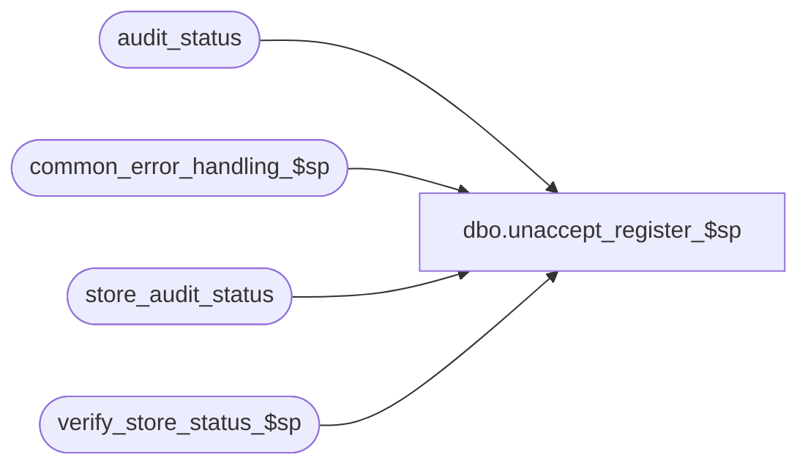

# dbo.unaccept_register_$sp

**Database:** auditworks  
**Server:** bedrockdb01  

## Architecture Diagram



## Table Dependencies

| Referenced Table |
|---|
| audit_status |
| common_error_handling_$sp |
| store_audit_status |
| verify_store_status_$sp |

## Stored Procedure Code

```sql
create proc dbo.unaccept_register_$sp 
( @process_id                   binary(16),
  @user_id                      int,
  @store_no 			int = NULL,
  @register_no 			smallint = NULL,
  @transaction_date 		smalldatetime = NULL,
  @date_reject_id 		tinyint = NULL)

AS

/* Proc name : unaccept_register_$sp
** Description: Sets audit_status of a store/reg/sales_date to edited = 100
** 		from accepted = 300, and attempts to set to verified = 200
** 		if it meets verification criteria.
** 		Possibly sets status of store/sales_date in store_audit_status
** 		to verified as well if all registers of that particular
** 		store/sales_date were all set to verified.
** 		Called by Power Builder

HISTORY
Date     Name		Def# Desc
Jan05,11 Paul         105313 Use unicode datatypes
Mar21.07 Daphna      DV-1360 uplift 84045 add param @called_by_edit = 3 when calling verify_store_status
Sep15,04 IanK        DV-1146 Use user_id
Apr20,04 Maryam      DV-1071 Modified to receive @process_id and pass it to the sub procs.
				 change the datatype of bit to tinyint
May01,02 Paul        1-CD0IX added R3 error handling
Dec04,00 Paul		7015 call verify_store_status_$sp
Sep15,98 Shapoor

*/

DECLARE
	@audit_status 			smallint,
	@current_date 			smalldatetime,
	@duplicate_qty 			smallint,
	@duplicate_verified 		tinyint,
	@errno 				int,
	@errmsg 			nvarchar(255),
	@exception_qty 			smallint,
	@exceptions_verified 		tinyint,
	@if_reject_qty 			smallint,
	@media_rec_verified 		tinyint,
	@minimum_audit_status 		smallint,
	@missing_qty 			numeric(12,0),
	@missing_verified 		tinyint,
	@opening_drawer_discrepancy 	tinyint,
	@sa_reject_qty 			smallint,
	@short_by_tender_over_limit 	tinyint,
	@store_audit_status 		smallint,
	@object_name			nvarchar(255),
	@process_name			nvarchar(100),
	@operation_name			nvarchar(100),
	@message_id			int

SELECT @process_name = 'unaccept_register_$sp',
	@message_id = 201068,
	@current_date = getdate()

    SELECT
	@audit_status = audit_status,
	@sa_reject_qty = sa_reject_qty,
	@if_reject_qty = if_reject_qty,
	@missing_qty = missing_qty,
	@missing_verified = missing_verified,
	@exception_qty = exception_qty,
	@exceptions_verified = exceptions_verified,
	@duplicate_qty = duplicate_qty,
	@duplicate_verified = duplicate_verified,
	@short_by_tender_over_limit = short_by_tender_over_limit,
	@media_rec_verified = media_rec_verified,
	@opening_drawer_discrepancy = opening_drawer_discrepancy
      FROM audit_status
     WHERE store_no = @store_no
       AND register_no = @register_no
       AND sales_date = @transaction_date
       AND date_reject_id = @date_reject_id

    SELECT @errno = @@error
    IF @errno <> 0
      BEGIN
       SELECT @errmsg = 'Failed to select from audit_status',
           @object_name = 'audit_status',
           @operation_name = 'SELECT'
       GOTO error
      END

    IF @audit_status != 300 OR @audit_status IS NULL
    BEGIN
	SELECT @errno = 201510,
		@message_id = 201510,
		@errmsg = 'There were invalid passing arguments passed to the store procedure'
	GOTO error
      END

    IF  @sa_reject_qty = 0 AND @if_reject_qty = 0
      AND (  @missing_qty = 0 OR @missing_verified = 1 )
      AND (  @exception_qty = 0 OR @exceptions_verified = 1 )
      AND (  @duplicate_qty = 0	OR @duplicate_verified = 1 )
      AND (  @short_by_tender_over_limit = 0 OR @media_rec_verified = 1 )
      AND (  @opening_drawer_discrepancy = 0 OR @media_rec_verified = 1 )
       SELECT @audit_status = 200
    ELSE
       SELECT @audit_status = 100

    BEGIN TRAN

    UPDATE audit_status
      SET audit_status = @audit_status,
          status_date = @current_date
     WHERE store_no = @store_no
       AND register_no = @register_no
       AND sales_date = @transaction_date
       AND date_reject_id = @date_reject_id

    SELECT @errno = @@error
    IF @errno <> 0
      BEGIN
       SELECT @errmsg = 'Failed to update audit_status',
           @object_name = 'audit_status',
           @operation_name = 'UPDATE'
	GOTO error
      END

    EXEC verify_store_status_$sp @process_id, @user_id, @store_no, @transaction_date, @date_reject_id,
				@errmsg OUTPUT, NULL, 3
    SELECT @errno = @@error
    IF @errno != 0
    BEGIN
      IF @errmsg IS NULL
      SELECT @errmsg = 'Unable to exec verify_store_status_$sp'
      SELECT @object_name = 'verify_store_status_$sp',
           @operation_name = 'EXEC'
      GOTO error
    END				

    UPDATE store_audit_status
      SET update_in_progress = 0
     WHERE store_no = @store_no
       AND sales_date = @transaction_date
       AND date_reject_id = @date_reject_id
	
    SELECT @errno = @@error
    IF @errno <> 0
      BEGIN
       SELECT @errmsg = 'Failed to update store_audit_status',
           @object_name = 'store_audit_status',
           @operation_name = 'UPDATE'
	GOTO error
      END

  COMMIT TRAN

RETURN

error:   /* Common error handler */

	EXEC common_error_handling_$sp 77, @errno, @errmsg, 0, @message_id, 
	  @process_name, @object_name, @operation_name, 0, 1, 0, null, 0, null, null, null,
	  null, null, null, 0, @process_id, @user_id
	RETURN
```

