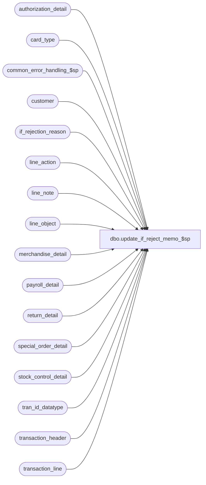

# dbo.update_if_reject_memo_$sp

**Database:** auditworks  
**Server:** bedrockdb01  

## Architecture Diagram



## Table Dependencies

| Referenced Table |
|---|
| authorization_detail |
| card_type |
| common_error_handling_$sp |
| customer |
| if_rejection_reason |
| line_action |
| line_note |
| line_object |
| merchandise_detail |
| payroll_detail |
| return_detail |
| special_order_detail |
| stock_control_detail |
| tran_id_datatype |
| transaction_header |
| transaction_line |

## Stored Procedure Code

```sql
create proc dbo.update_if_reject_memo_$sp @process_id             binary(16),
@user_id                int,
@store_no		int,  
@register_no		smallint,  /* -1 = all registers */
@transaction_date	smalldatetime,
@date_reject_id		tinyint,
@transaction_id		tran_id_datatype = NULL,
@errmsg			nvarchar(255) OUTPUT

AS

/* Proc name:   update_if_reject_memo_$sp
** Description: Updates the three memo columns in if_rejection_reason which will  
** 		contain information explaining why the transactions were rejected
**              for a specific Store/Reg/Date.
   Called from transaction_modify_$sp, transaction_add_$sp and move.

HISTORY
Date     Name        Defect#  Desc
Feb03,16 Vicci    TFS-139985 Handle conversion (via STR function) of line amounts as large as numeric(18,4) to string
Feb26,15 Vicci    TFS-107968  When item not on file information to support the audit is not available from the Additional Item information attachment,
                              take it from the Special Order attachment.
Jan13,15 Vicci     TFS-99599  Handle I/F Rejection Rule 83 (invalid cashier) same as rule 80 (invalid/missing cashier)
Oct10,14 Vicci     TFS-88075  Transfer memo3 to lookup_key1 for Incomplete Customer Data rejects before overlaying it with zip code.
Sep17,14 Phu       TFS-84776  Port Oracle fixed error: single-row subquery returns more than one row.
Jul10,14 Vicci     TFS-74694  Log same memo fields for I/F Rejection rule 116 (Merchandise cost unknown) as for UPC not on file.
May06,14 Vicci/Phu    151556  Correct join to customer for I/F reject 6 - Incomplete Customer.
Apr20,11 Vicci        105917  Replace ISNULL(e1.LAST_NAME, CONVERT(nvarchar, r.original_salesperson)) + ' ' + ISNULL(e1.FRST_NAME, ' ') style logging with simple logging of employee number since UI is being modified to lookup display name associated with memo1 and provide drill-down to TM.  
                              Remove reject 54 update since it no longer exists as of S/A 3.5
Apr16,10 Vicci        117187  Log additional item information for UPC/POSID/POSDEPT not on file messages.
Oct09,07 Paul          91395  Updated comments
Jun19,07 Phu         DV-1364  Apply 85598, 87372 to SA5.
Jun18,07 Phu           87969  Apply 85783 to SA5.
Oct25,06 Phu           77931  Fix outer join for SQL 2005 Mode 90.
Sep21,06 Paul          76719  apply 75320 to SA5
Dec19,05 Paul          64546  apply 61838 to SA5
Nov02,05 Paul          62153  apply 61728 to SA5, added nolock hints, corrected payroll updates
Apr28,05 Paul        DV-1234  expand transaction_id to use tran_id_datatype
Feb08,05 David       DV-1206  apply DV-1298 to SA5.
Sep15,04 IanK        DV-1146  Change use user_id
Apr28,04 Maryam      DV-1071  Receive @process_id and pass it to the 
                              common_error_handling_$sp, change employee table to EMPLY
Apr07,04 Sab	     DV-1068  Remove old customer liability rejects
Jun01,07 Phu           87372  Don't set memo1, memo2 for Employee Attribute I/F rejects 38-41.
Apr11,07 Phu           85598  Don't set memo1, memo2 for Employee Attribute I/F rejects 21-37.
Mar05,07 Vicci         85783  Fix join on payroll employee not on file reject (82)
Sep21,06 Paul          75320  avoid possible concat null problem
Dec07,05 Daphna        61838  Log correct cust info by matching memo3 to customer role
Oct20,05 David         61728  Log card_type in memo2 for I/F rejects 2 and 113.
Sep28,05 David         60266  Log invalid_reference_no.
Jul08,05 David       DV-1298  Treat I/F reject reason 113 same as reason 2.
Aug16,02 HenryW	     1-AUHY5  Added 2 new system I/F reject reasons = 110 and 111.
Jul04,02 Winnie      AW-8770  Do not update memo2 if invalid card (if_reject_reason = 2),
                              do not update memo1 if if_reject_reason >= 11 and < 100
Apr22,02 David C     1-CJ7R1  Do not update memo2 if if_reject_reason >= 100 
Dec04,01 David C     1-9ATXP  Change 7369 to check if_reject_reason < 100 AND new error handling
Aug10,01 Maryam         8283  Exclude update on memo fields for if_rejection_reason = 7, 8
Jun06,01 Phu		7214  Set memo1 field for if_reject_reason 87,88,89,90
May08,01 Henry		7796  For multi-language IF reject reason descriptions. Add new field lookup_key1.
May04,01 Henry		7369  Exclude update on memo fields for User Defined IF rejects < 200
May17,00 Louise	 	6294  added join on upc_lookup_division
Mar30,00 Daphna F	6087  ensure memo fields populated for IF rej 8 (tax default)
Feb25,00 Daphna F       6017  when register_no != -1, select register_no into @min_reg and 
                              @max_reg
Sep13,99 Paul		5282  handle single trans in separate routine for max performance
Aug11,99 Paul		4522  avoid = null
Apr30,98 Yin

*/

DECLARE
	@errno			int,
	@max_register_no	smallint,
	@message_id		int,
	@min_register_no	smallint,
	@object_name		nvarchar(255),
	@operation_name		nvarchar(100),
	@process_name		nvarchar(100),
	@process_no 		smallint

SELECT @process_no = 100,
       @process_name = 'update_if_reject_memo_$sp',
       @message_id = 201068

IF @transaction_id IS NOT NULL /* one transaction */
 BEGIN

    /* if_reject_reason 1 - UPC Not On File, 116 Cost Unknown */
   UPDATE if_rejection_reason
    SET memo1 = CASE WHEN i.if_reject_reason = 116 AND m.upc_no = 0 THEN m.pos_identifier ELSE CONVERT(nvarchar, m.upc_no) END,
        memo2 = CONVERT(nvarchar, m.pos_deptclass),
        memo3 = STR(m.ticket_price, 18, 2) + ' ' + STR(m.sold_at_price, 18, 2),
         other_information = CASE WHEN COALESCE(n.line_note, s.vendor_no, s.imrd, s.reason, o.merchandise_description, o.vendor_style_description, o.color_description, o.size_description) IS NULL THEN NULL 
             		          ELSE SUBSTRING (COALESCE(n.line_note, o.merchandise_description, '') 		--description 
           		               + ' / ' + COALESCE(s.vendor_no, o.vendor_style_description, '') 	--style
           		       	       + ' / ' + COALESCE(s.imrd, o.color_description, '')		--color
           		               + ' / ' + COALESCE(s.reason, o.size_description, '')		--size
           		               , 1, 255) END
    FROM if_rejection_reason i
         INNER JOIN merchandise_detail m WITH (NOLOCK)
              ON i.transaction_id   = m.transaction_id
       	     AND i.line_id          = m.line_id
       	   LEFT OUTER JOIN line_note n WITH (NOLOCK)
       	      ON i.transaction_id   = n.transaction_id
	     AND i.line_id          = n.line_id
	     AND n.note_type 	    = 9019 --(Item description)
       	  LEFT OUTER JOIN stock_control_detail s WITH (NOLOCK)
       	    ON i.transaction_id   = s.transaction_id
	   AND i.line_id          = s.line_id
	   AND s.display_def_id   = 66 --(Additional Item Information)
	  LEFT OUTER JOIN special_order_detail o WITH (NOLOCK)
       	    ON i.transaction_id   = o.transaction_id
	   AND i.line_id          = o.line_id
   WHERE i.if_reject_reason IN (1, 116)
     AND i.transaction_id = @transaction_id
     AND i.memo1 IS NULL 

SELECT @errno = @@error
   IF @errno != 0
     BEGIN
      SELECT @errmsg = 'Failed to set memo fields (type 1)',
             @object_name = 'if_rejection_reason',
             @operation_name = 'UPDATE'
      GOTO error
     END

    /* if_reject_reason 2,113 - Invalid Card Number / Card not accepted */
   UPDATE if_rejection_reason
      SET memo1 = IsNull(CONVERT(nvarchar(80),l.invalid_reference_no), l.reference_no),
          memo2 = IsNull(ad.card_type,'?'),
          memo3 = STR(ROUND(l.gross_line_amount - l.pos_discount_amount, 2), 18, 2),
          lookup_key1 = (o.line_object * 1000) + a.line_action
     FROM if_rejection_reason i
          INNER JOIN transaction_line l WITH (NOLOCK) ON (i.transaction_id = l.transaction_id AND i.line_id = l.line_id)
          INNER JOIN line_object o ON (l.line_object = o.line_object)
          INNER JOIN line_action a ON (l.line_action = a.line_action)
          LEFT JOIN authorization_detail ad WITH (NOLOCK) ON (l.transaction_id = ad.transaction_id AND l.line_id = ad.line_id )
    WHERE i.if_reject_reason IN (2,113)
      AND i.transaction_id = @transaction_id
      AND i.memo1 IS NULL 

   SELECT @errno = @@error
   IF @errno != 0
     BEGIN
      SELECT @errmsg = 'Failed to set memo fields (type 2, 113)',
             @object_name = 'if_rejection_reason',
             @operation_name = 'UPDATE'
      GOTO error
     END

   UPDATE if_rejection_reason
      SET memo2 = memo2 + ' - ' + IsNull(ct.card_type_description,'Unknown card type')
     FROM if_rejection_reason i
          LEFT JOIN card_type ct ON (i.memo2 = ct.card_type)
    WHERE i.if_reject_reason IN (2,113) 
      AND i.transaction_id = @transaction_id
      AND LEN(i.memo2) = 1

   SELECT @errno = @@error
   IF @errno != 0
   BEGIN
     SELECT @errmsg         = 'Failed to update if_rejection_reason (type 2,113 card description).',
            @object_name    = 'if_rejection_reason',
            @operation_name = 'UPDATE'
     GOTO error
   END

    /* if_reject_reason 3 - Invalid Salesperson */
   UPDATE if_rejection_reason
      SET memo1 = CONVERT(nvarchar, m.salesperson),
          memo2 = CONVERT(nvarchar, m.salesperson2)
     FROM if_rejection_reason i
          INNER JOIN merchandise_detail m WITH (NOLOCK) ON (i.transaction_id = m.transaction_id AND i.line_id = m.line_id)
    WHERE i.if_reject_reason = 3
      AND i.transaction_id = @transaction_id
      AND i.memo1 IS NULL

   SELECT @errno = @@error
   IF @errno != 0
     BEGIN
      SELECT @errmsg = 'Failed to set memo fields (type 3)',
             @object_name = 'if_rejection_reason',
             @operation_name = 'UPDATE'
      GOTO error
     END

    /* if_reject_reason 4 - Invalid Purchasing Employee */

   UPDATE if_rejection_reason
      SET memo1 = CONVERT(nvarchar, th.employee_no)
     FROM if_rejection_reason i
          INNER JOIN transaction_header th WITH (NOLOCK) ON (i.transaction_id = th.transaction_id)
    WHERE i.if_reject_reason = 4
      AND i.transaction_id = @transaction_id
      AND i.memo1 IS NULL

   SELECT @errno = @@error
   IF @errno != 0
     BEGIN
      SELECT @errmsg = 'Failed to set memo1 field (type 4).',
             @object_name = 'if_rejection_reason',
             @operation_name = 'UPDATE'
      GOTO error
     END

    /* if_reject_reason 5 - UPC Not On File */
   UPDATE if_rejection_reason
      SET memo1 = CONVERT(nvarchar, sc.upc_no)
     FROM if_rejection_reason i, stock_control_detail sc WITH (NOLOCK)
    WHERE i.if_reject_reason = 5
      AND i.transaction_id = @transaction_id
      AND i.memo1 IS NULL  
      AND i.transaction_id = sc.transaction_id
      AND i.line_id = sc.line_id

   SELECT @errno = @@error
   IF @errno != 0
     BEGIN
      SELECT @errmsg = 'Failed to set memo1 field (type 5).',
             @object_name = 'if_rejection_reason',
             @operation_name = 'UPDATE'
      GOTO error
     END

    /* if_reject_reason 6 - Incomplete Customer */
   UPDATE if_rejection_reason
    SET memo1 = ISNULL(c.last_name,' ') + ' ' + ISNULL(c.first_name,' '),
        memo2 = ISNULL(c.address_1,' ') + ' ' + ISNULL(RTRIM(c.address_2),' ') + ' ' + ISNULL(RTRIM(c.city),' ')
         + ' ' + ISNULL(RTRIM(c.county),' ') + ' ' + ISNULL(RTRIM(c.state),' ') + ' ' + ISNULL(RTRIM(c.country),' '),  
        lookup_key1 = i.memo3,
        memo3 = c.post_code
     FROM if_rejection_reason i, customer c WITH (NOLOCK)
    WHERE i.if_reject_reason = 6
      AND i.transaction_id = @transaction_id
      AND i.memo1 IS NULL  
      AND i.transaction_id = c.transaction_id
      AND i.line_id = c.line_id
      AND i.memo3 = c.customer_role 

   SELECT @errno = @@error
   IF @errno != 0
     BEGIN
      SELECT @errmsg = 'Failed to set memo fields (type 6)',
             @object_name = 'if_rejection_reason',
   @operation_name = 'UPDATE'
      GOTO error
     END

    /* if_reject_reason 9 - Invalid Original Store Number */
   UPDATE if_rejection_reason
    SET memo1 = CONVERT(nvarchar, r.return_from_store)
     FROM if_rejection_reason i, return_detail r WITH (NOLOCK)
    WHERE i.if_reject_reason = 9
      AND i.transaction_id = @transaction_id
      AND i.memo1 IS NULL  
      AND i.transaction_id = r.transaction_id
      AND i.line_id = r.line_id

   SELECT @errno = @@error
   IF @errno != 0
     BEGIN
    SELECT @errmsg = 'Failed to set memo1 field (type 9)',
             @object_name = 'if_rejection_reason',
             @operation_name = 'UPDATE'
      GOTO error
     END

    /* if_reject_reason 10 - Invalid Other Store Number */
   UPDATE if_rejection_reason
    SET memo1 = CONVERT(nvarchar, sc.other_store_no)
     FROM if_rejection_reason i, stock_control_detail sc WITH (NOLOCK)
    WHERE i.if_reject_reason = 10
      AND i.transaction_id = @transaction_id
 AND i.memo1 IS NULL  
      AND i.transaction_id = sc.transaction_id
      AND i.line_id = sc.line_id

   SELECT @errno = @@error
   IF @errno != 0
     BEGIN
      SELECT @errmsg = 'Failed to set memo1 field (type 10).',
             @object_name = 'if_rejection_reason',
             @operation_name = 'UPDATE'
      GOTO error
     END


    /* if_reject_reason 80, 83 - Invalid/Missing Cashier, Invalid Cashier */

   UPDATE if_rejection_reason
      SET memo1 = CONVERT(nvarchar, CASE WHEN th.cashier_no = 0 THEN NULL ELSE th.cashier_no END)
     FROM if_rejection_reason i
          INNER JOIN transaction_header th ON (i.transaction_id = th.transaction_id)
    WHERE i.if_reject_reason IN (80, 83)
      AND i.transaction_id = @transaction_id
      AND i.memo1 IS NULL
   SELECT @errno = @@error
   IF @errno != 0
     BEGIN
      SELECT @errmsg = 'Failed to set memo1 field (type 80, 83).',
             @object_name = 'if_rejection_reason',
             @operation_name = 'UPDATE'
      GOTO error
     END

    /* if_reject_reason 81 - Invalid Orginal Salesperson */
   UPDATE if_rejection_reason
    SET memo1 = CONVERT(nvarchar, r.original_salesperson),
        memo2 = CONVERT(nvarchar, r.original_salesperson2)
     FROM if_rejection_reason i
          INNER JOIN return_detail r WITH (NOLOCK) ON (i.transaction_id = r.transaction_id AND i.line_id = r.line_id)
    WHERE i.if_reject_reason = 81
      AND i.transaction_id = @transaction_id
      AND i.memo1 IS NULL  

   SELECT @errno = @@error
   IF @errno != 0
     BEGIN
      SELECT @errmsg = 'Failed to set memo fields (type 3)',
             @object_name = 'if_rejection_reason',
             @operation_name = 'UPDATE'
      GOTO error
     END

    /* if_reject_reason 82 - Invalid Employee on payroll */
  UPDATE if_rejection_reason
     SET memo1 = CONVERT(nvarchar, p.employee_no),
         memo2 = e.vendor_no
    FROM if_rejection_reason i
         INNER JOIN payroll_detail p
                 ON i.transaction_id = p.transaction_id 
                AND i.line_id = p.line_id
                AND p.employee_no >= 1 
         LEFT OUTER JOIN stock_control_detail e
                 ON p.transaction_id = e.transaction_id
                AND p.line_id = e.line_id
                AND e.display_def_id = 58
   WHERE i.if_reject_reason = 82
     AND i.transaction_id = @transaction_id
     AND i.memo1 IS NULL 

   SELECT @errno = @@error
   IF @errno != 0
     BEGIN
      SELECT @errmsg = 'Failed to set memo1 field (type 4).',
             @object_name = 'if_rejection_reason',
             @operation_name = 'UPDATE'
      GOTO error
     END

-- if_reject_reason 87 - Merch POS Identifier Not On File

   UPDATE if_rejection_reason
   SET memo1 = m.pos_identifier,
	memo2 = CONVERT(nvarchar, m.pos_deptclass),
        memo3 = STR(m.ticket_price, 18, 2) + ' ' + STR(m.sold_at_price, 18, 2),
         other_information = CASE WHEN COALESCE(n.line_note, s.vendor_no, s.imrd, s.reason, o.merchandise_description, o.vendor_style_description, o.color_description, o.size_description) IS NULL THEN NULL 
             		          ELSE SUBSTRING (COALESCE(n.line_note, o.merchandise_description, '') 		--description 
           		               + ' / ' + COALESCE(s.vendor_no, o.vendor_style_description, '') 	--style
           		       	       + ' / ' + COALESCE(s.imrd, o.color_description, '')		--color
           		               + ' / ' + COALESCE(s.reason, o.size_description, '')		--size
           		               , 1, 255) END
   FROM if_rejection_reason i
           INNER JOIN merchandise_detail m WITH (NOLOCK)
              ON i.transaction_id   = m.transaction_id
       	     AND i.line_id          = m.line_id
       	   LEFT OUTER JOIN line_note n WITH (NOLOCK)
       	      ON i.transaction_id   = n.transaction_id
	     AND i.line_id          = n.line_id
	     AND n.note_type 	    = 9019 --(Item description)
       	  LEFT OUTER JOIN stock_control_detail s WITH (NOLOCK)
       	    ON i.transaction_id   = s.transaction_id
	   AND i.line_id          = s.line_id
	   AND s.display_def_id   = 66 --(Additional Item Information)
	  LEFT OUTER JOIN special_order_detail o WITH (NOLOCK)
       	    ON i.transaction_id   = o.transaction_id
	   AND i.line_id          = o.line_id
   WHERE i.if_reject_reason = 87
   AND i.memo1 IS NULL 
   AND i.transaction_id = @transaction_id
   SELECT @errno = @@error
   IF @errno != 0
     BEGIN
      SELECT @errmsg = 'Failed to set memo fields (merch pos_identifier).',
             @object_name = 'if_rejection_reason',
             @operation_name = 'UPDATE'
      GOTO error
     END

-- if_reject_reason 88 - Merch POS Deptclass Not On File

   UPDATE if_rejection_reason
   SET memo1 = CONVERT(nvarchar, m.pos_deptclass),
	memo3 = STR(m.ticket_price, 18, 2) + ' ' + STR(m.sold_at_price, 18, 2),	
         other_information = CASE WHEN COALESCE(n.line_note, s.vendor_no, s.imrd, s.reason, o.merchandise_description, o.vendor_style_description, o.color_description, o.size_description) IS NULL THEN NULL 
             		          ELSE SUBSTRING (COALESCE(n.line_note, o.merchandise_description, '') 		--description 
           		               + ' / ' + COALESCE(s.vendor_no, o.vendor_style_description, '') 	--style
           		       	       + ' / ' + COALESCE(s.imrd, o.color_description, '')		--color
           		               + ' / ' + COALESCE(s.reason, o.size_description, '')		--size
           		               , 1, 255) END
   FROM if_rejection_reason i
              INNER JOIN merchandise_detail m WITH (NOLOCK)
              ON i.transaction_id   = m.transaction_id
       	     AND i.line_id          = m.line_id
       	   LEFT OUTER JOIN line_note n WITH (NOLOCK)
       	      ON i.transaction_id   = n.transaction_id
	     AND i.line_id          = n.line_id
	     AND n.note_type 	    = 9019 --(Item description)
       	  LEFT OUTER JOIN stock_control_detail s WITH (NOLOCK)
       	    ON i.transaction_id   = s.transaction_id
	   AND i.line_id          = s.line_id
	   AND s.display_def_id   = 66 --(Additional Item Information)
	  LEFT OUTER JOIN special_order_detail o WITH (NOLOCK)
       	    ON i.transaction_id   = o.transaction_id
	   AND i.line_id          = o.line_id
   WHERE i.if_reject_reason = 88
   AND i.memo1 IS NULL 
   AND i.transaction_id = @transaction_id

   SELECT @errno = @@error
   IF @errno != 0
     BEGIN
      SELECT @errmsg = 'Failed to set memo fields (merch pos_deptclass).',
             @object_name = 'if_rejection_reason',
             @operation_name = 'UPDATE'
      GOTO error
     END

-- if_reject_reason 89 - Stock POS Identifier Not On File

   UPDATE if_rejection_reason
   SET memo1 = sc.pos_identifier,
	memo2 = CONVERT(nvarchar, sc.pos_deptclass)
   FROM if_rejection_reason i, stock_control_detail sc WITH (NOLOCK)
   WHERE i.if_reject_reason = 89
   AND i.memo1 IS NULL  
   AND i.transaction_id = @transaction_id
   AND i.transaction_id = sc.transaction_id
   AND i.line_id = sc.line_id

   SELECT @errno = @@error
   IF @errno != 0
     BEGIN
      SELECT @errmsg = 'Failed to set memo fields (stock control pos_identifier).',
             @object_name = 'if_rejection_reason',
             @operation_name = 'UPDATE'
      GOTO error
     END

-- if_reject_reason 90 - Stock POS Deptclass Not On File

   UPDATE if_rejection_reason
   SET memo1 = CONVERT(nvarchar, sc.pos_deptclass)
   FROM if_rejection_reason i, stock_control_detail sc WITH (NOLOCK)
   WHERE i.if_reject_reason = 90
   AND i.memo1 IS NULL  
   AND i.transaction_id = @transaction_id
   AND i.transaction_id = sc.transaction_id
   AND i.line_id = sc.line_id

   SELECT @errno = @@error
   IF @errno != 0
     BEGIN
      SELECT @errmsg = 'Failed to set memo1 field (stock control pos deptclass).',
             @object_name = 'if_rejection_reason',
             @operation_name = 'UPDATE'
      GOTO error
     END

    /* if_reject_reason All Others - Customer Liability 
       Defect 7369. Exclude update on memo fields for User Defined IF reject reasons < 100 */

   UPDATE if_rejection_reason
    SET memo2 = l.reference_no,
        memo3 = STR(ROUND(l.gross_line_amount - l.pos_discount_amount, 2), 18, 2),
        lookup_key1 = (o.line_object * 1000) + a.line_action
     FROM if_rejection_reason i, transaction_line l WITH (NOLOCK), line_object o, line_action a
    WHERE ((i.if_reject_reason >= 11 AND i.if_reject_reason <= 20) OR 
           (i.if_reject_reason >= 42 AND i.if_reject_reason < 100 AND i.if_reject_reason NOT IN (54,80,81,82,87,88,89,90))
          )
      AND i.transaction_id = @transaction_id
      AND i.memo1 IS NULL  
 AND i.transaction_id = l.transaction_id
      AND i.line_id = l.line_id
      AND l.line_object = o.line_object
      AND l.line_action = a.line_action

   SELECT @errno = @@error
   IF @errno != 0
     BEGIN
      SELECT @errmsg = 'Failed to set memo fields (misc. type) (1)',
	 @object_name = 'if_rejection_reason',
	 @operation_name = 'UPDATE'
      GOTO error
     END

  -- Def 1-AUHY5. Added 2 new system I/F rejects, 110 and 111. 
  -- Set lookup_key1 for any system I/F reject between 110 and 199.

  UPDATE if_rejection_reason
   SET lookup_key1 = (o.line_object * 1000) + a.line_action
    FROM if_rejection_reason i, transaction_line l WITH (NOLOCK), line_object o, line_action a
   WHERE i.if_reject_reason BETWEEN 110 and 199
     AND i.transaction_id = @transaction_id 
     AND i.transaction_id = l.transaction_id
     AND i.line_id = l.line_id 
     AND l.line_object = o.line_object 
     AND l.line_action = a.line_action

  SELECT @errno = @@error
  IF @errno != 0
  BEGIN
    SELECT @errmsg         = 'Failed to update if_rejection_reasons between 110 and 199 (1).',
           @object_name    = 'if_rejection_reason',
           @operation_name = 'UPDATE'
    GOTO error
  END

  UPDATE if_rejection_reason
     SET memo1 = CONVERT(nvarchar, sc.originating_store_no)
    FROM if_rejection_reason i, stock_control_detail sc WITH (NOLOCK)
   WHERE i.transaction_id = @transaction_id
     AND i.transaction_id = sc.transaction_id
     AND i.line_id = sc.line_id 
     AND sc.originating_store_no >= 0 
     AND i.memo1 IS NULL  
     AND i.if_reject_reason = 111

  SELECT @errno = @@error
  IF @errno != 0
  BEGIN
    SELECT @errmsg    = 'Failed to update if_rejection_reason (type 111) (1).',
           @object_name    = 'if_rejection_reason',
           @operation_name = 'UPDATE'
    GOTO error
  END

  UPDATE if_rejection_reason
     SET memo1 = CONVERT(nvarchar, md.originating_store_no)
    FROM if_rejection_reason i, merchandise_detail md WITH (NOLOCK)
   WHERE i.transaction_id = @transaction_id
     AND i.transaction_id = md.transaction_id
     AND i.line_id = md.line_id 
 AND md.originating_store_no >= 0 
     AND i.memo1 IS NULL  
     AND i.if_reject_reason = 110

  SELECT @errno = @@error
  IF @errno != 0
  BEGIN
    SELECT @errmsg         = 'Failed to update if_rejection_reason (type 110) (1).',
           @object_name    = 'if_rejection_reason',
           @operation_name = 'UPDATE'
    GOTO error
  END

  -- removed old cust liab routine

  RETURN
END /* If @transaction_id is not null */

-- CONTINUE PROCESSING FOR @transaction_id IS NULL.

IF @register_no = -1
  SELECT @min_register_no = 0,
	@max_register_no = 32767
ELSE
  SELECT @min_register_no = @register_no,
	@max_register_no = @register_no

/* if_reject_reason 1 - UPC Not On File
   Sybase chooses to read transaction_header first, then joins to if_rejection_reason */

UPDATE if_rejection_reason
   SET memo1 = CONVERT(nvarchar, m.upc_no),
       memo2 = CONVERT(nvarchar, m.pos_deptclass),
       memo3 = STR(m.ticket_price, 18, 2) + ' ' + STR(m.sold_at_price, 18, 2),
         other_information = CASE WHEN COALESCE(n.line_note, s.vendor_no, s.imrd, s.reason, o.merchandise_description, o.vendor_style_description, o.color_description, o.size_description) IS NULL THEN NULL 
             		          ELSE SUBSTRING (COALESCE(n.line_note, o.merchandise_description, '') 		--description 
           		               + ' / ' + COALESCE(s.vendor_no, o.vendor_style_description, '') 	--style
           		       	       + ' / ' + COALESCE(s.imrd, o.color_description, '')		--color
           		               + ' / ' + COALESCE(s.reason, o.size_description, '')		--size
           		               , 1, 255) END
  FROM transaction_header h
       INNER JOIN if_rejection_reason i
          ON i.if_reject_reason = 1
   	 AND i.memo1 IS NULL 
   	 AND i.transaction_id = h.transaction_id
             INNER JOIN merchandise_detail m WITH (NOLOCK)
             ON i.transaction_id   = m.transaction_id
       	     AND i.line_id          = m.line_id
       	   LEFT OUTER JOIN line_note n WITH (NOLOCK)
       	    ON i.transaction_id   = n.transaction_id
	     AND i.line_id          = n.line_id
	     AND n.note_type 	    = 9019 --(Item description)
       	  LEFT OUTER JOIN stock_control_detail s WITH (NOLOCK)
       	    ON i.transaction_id   = s.transaction_id
	   AND i.line_id          = s.line_id
	   AND s.display_def_id   = 66 --(Additional Item Information)
	  LEFT OUTER JOIN special_order_detail o WITH (NOLOCK)
       	    ON i.transaction_id   = o.transaction_id
	   AND i.line_id          = o.line_id
 WHERE h.transaction_date = @transaction_date
   AND h.store_no = @store_no
   AND h.register_no >= @min_register_no
   AND h.register_no <= @max_register_no
   AND h.date_reject_id = @date_reject_id

SELECT @errno = @@error
IF @errno != 0
  BEGIN
   SELECT @errmsg = 'Failed to set memo fields (type 1)',
          @object_name = 'if_rejection_reason',
          @operation_name = 'UPDATE'
   GOTO error
  END

/* if_reject_reason 2,113 - Invalid Card Number / Card type not accepted */

/* if_reject_reason 2,113 - Invalid Card Number / Card type not accepted */
UPDATE if_rejection_reason
   SET memo1 = IsNull(convert(nvarchar(80),l.invalid_reference_no), l.reference_no),
       memo2 = IsNull(ad.card_type,'?'),
       memo3 = STR(ROUND(l.gross_line_amount - l.pos_discount_amount, 2), 18, 2),
       lookup_key1 = (o.line_object * 1000) + a.line_action
  FROM if_rejection_reason i
       INNER JOIN transaction_header h WITH (NOLOCK) ON (i.transaction_id = h.transaction_id)
       INNER JOIN transaction_line l WITH (NOLOCK) ON (i.transaction_id = l.transaction_id AND i.line_id = l.line_id)
       INNER JOIN line_object o ON (l.line_object = o.line_object)
       INNER JOIN line_action a ON (l.line_action = a.line_action)
       LEFT JOIN authorization_detail ad WITH (NOLOCK) ON (l.transaction_id = ad.transaction_id AND l.line_id = ad.line_id )
 WHERE i.if_reject_reason IN (2,113)
   AND i.memo1 IS NULL --
   AND h.transaction_date = @transaction_date
   AND h.store_no = @store_no
   AND h.register_no >= @min_register_no
   AND h.register_no <= @max_register_no
   AND h.date_reject_id = @date_reject_id

SELECT @errno = @@error
IF @errno != 0
  BEGIN
   SELECT @errmsg = 'Failed to set memo fields (type 2, 113) all reg.',
          @object_name = 'if_rejection_reason',
          @operation_name = 'UPDATE'
   GOTO error
  END

UPDATE if_rejection_reason
   SET memo2 = memo2 + ' - ' + IsNull(ct.card_type_description,'Unknown card type')
  FROM if_rejection_reason i
       INNER JOIN transaction_header h WITH (NOLOCK) ON (i.transaction_id = h.transaction_id)
       LEFT JOIN card_type ct ON (i.memo2 = ct.card_type)
 WHERE i.if_reject_reason IN (2,113)
   AND LEN(i.memo2) = 1
   AND h.transaction_date = @transaction_date
   AND h.store_no         = @store_no
   AND h.register_no     >= @min_register_no
   AND h.register_no     <= @max_register_no
   AND h.date_reject_id   = @date_reject_id

SELECT @errno = @@error
IF @errno != 0
   BEGIN
     SELECT @errmsg         = 'Failed to update if_rejection_reason (type 2,113 card description) all reg.',
            @object_name    = 'if_rejection_reason',
            @operation_name = 'UPDATE'
     GOTO error
   END

/* if_reject_reason 3 - Invalid Salesperson */

UPDATE if_rejection_reason
   SET memo1 = CONVERT(nvarchar, m.salesperson),
       memo2 = CONVERT(nvarchar, m.salesperson2)
  FROM if_rejection_reason i
       INNER JOIN transaction_header h WITH (NOLOCK) ON (i.transaction_id = h.transaction_id)
       INNER JOIN merchandise_detail m WITH (NOLOCK) ON (i.transaction_id = m.transaction_id AND i.line_id = m.line_id)
 WHERE i.if_reject_reason = 3
   AND i.memo1 IS NULL --
   AND h.transaction_date = @transaction_date
   AND h.store_no = @store_no
   AND h.register_no >= @min_register_no
   AND h.register_no <= @max_register_no
   AND h.date_reject_id = @date_reject_id

SELECT @errno = @@error
IF @errno != 0
  BEGIN
   SELECT @errmsg = 'Failed to set memo fields (type 3)',
          @object_name = 'if_rejection_reason',
          @operation_name = 'UPDATE'
   GOTO error
  END

/* if_reject_reason 4 - Invalid Purchasing Employee */

UPDATE if_rejection_reason
   SET memo1 = CONVERT(nvarchar, th.employee_no)
  FROM if_rejection_reason i
       INNER JOIN transaction_header th WITH (NOLOCK) ON (i.transaction_id = th.transaction_id)
 WHERE i.if_reject_reason = 4
   AND i.memo1 IS NULL --
   AND th.transaction_date = @transaction_date
   AND th.store_no = @store_no
   AND th.register_no >= @min_register_no
   AND th.register_no <= @max_register_no
   AND th.date_reject_id = @date_reject_id
   AND th.employee_no >= 1

SELECT @errno = @@error
IF @errno != 0
  BEGIN
   SELECT @errmsg = 'Failed to set memo1 field (type 4).',
          @object_name = 'if_rejection_reason',
          @operation_name = 'UPDATE'
   GOTO error
  END

/* if_reject_reason 5 - UPC Not On File */

UPDATE if_rejection_reason
   SET memo1 = CONVERT(nvarchar, sc.upc_no)
  FROM if_rejection_reason i, transaction_header th WITH (NOLOCK), stock_control_detail sc WITH (NOLOCK)
 WHERE i.if_reject_reason = 5
   AND i.memo1 IS NULL  
   AND i.transaction_id = th.transaction_id
   AND th.transaction_date = @transaction_date
   AND th.store_no = @store_no
   AND th.register_no >= @min_register_no
   AND th.register_no <= @max_register_no
   AND th.date_reject_id = @date_reject_id
   AND th.transaction_id = sc.transaction_id
   AND i.line_id = sc.line_id

SELECT @errno = @@error
IF @errno != 0
  BEGIN
   SELECT @errmsg = 'Failed to set memo1 field (type 5).',
          @object_name = 'if_rejection_reason',
          @operation_name = 'UPDATE'
   GOTO error
  END

/* if_reject_reason 6 - Incomplete Customer */

UPDATE if_rejection_reason
    SET memo1 = ISNULL(c.last_name,' ') + ' ' + ISNULL(c.first_name,' '),
        memo2 = ISNULL(c.address_1,' ') + ' ' + ISNULL(RTRIM(c.address_2),' ') + ' ' + ISNULL(RTRIM(c.city),' ')
         + ' ' + ISNULL(RTRIM(c.county),' ') + ' ' + ISNULL(RTRIM(c.state),' ') + ' ' + ISNULL(RTRIM(c.country),' '),  
        memo3 = c.post_code
  FROM if_rejection_reason i, transaction_header h WITH (NOLOCK), customer c WITH (NOLOCK)
 WHERE i.if_reject_reason = 6
   AND i.memo1 IS NULL  
   AND i.transaction_id = h.transaction_id
   AND h.transaction_date = @transaction_date
   AND h.store_no = @store_no
   AND h.register_no >= @min_register_no
   AND h.register_no <= @max_register_no
   AND h.date_reject_id = @date_reject_id
   AND h.transaction_id = c.transaction_id
   AND i.line_id = c.line_id
   AND i.memo3 = c.customer_role

SELECT @errno = @@error
IF @errno != 0
  BEGIN
   SELECT @errmsg = 'Failed to set memo fields (type 6)',
          @object_name = 'if_rejection_reason',
          @operation_name = 'UPDATE'
   GOTO error
  END


/* if_reject_reason 9 - Invalid Original Store Number */

UPDATE if_rejection_reason
   SET memo1 = CONVERT(nvarchar, r.return_from_store)
  FROM if_rejection_reason i, transaction_header h WITH (NOLOCK), return_detail r WITH (NOLOCK)
 WHERE i.if_reject_reason = 9
   AND i.memo1 IS NULL  
   AND i.transaction_id = h.transaction_id
   AND h.transaction_date = @transaction_date
   AND h.store_no = @store_no
   AND h.register_no >= @min_register_no
   AND h.register_no <= @max_register_no
   AND h.date_reject_id = @date_reject_id
   AND h.transaction_id = r.transaction_id
   AND i.line_id = r.line_id

SELECT @errno = @@error
IF @errno != 0
  BEGIN
   SELECT @errmsg = 'Failed to set memo1 field (type 9)',
          @object_name = 'if_rejection_reason',
          @operation_name = 'UPDATE'
   GOTO error
  END

/* if_reject_reason 10 - Invalid Other Store Number */

UPDATE if_rejection_reason
   SET memo1 = CONVERT(nvarchar, sc.other_store_no)
  FROM if_rejection_reason i, transaction_header th WITH (NOLOCK), stock_control_detail sc WITH (NOLOCK)
 WHERE i.if_reject_reason = 10
   AND i.memo1 IS NULL  
   AND i.transaction_id = th.transaction_id
   AND th.transaction_date = @transaction_date
   AND th.store_no = @store_no
   AND th.register_no >= @min_register_no
   AND th.register_no <= @max_register_no
   AND th.date_reject_id = @date_reject_id
   AND th.transaction_id = sc.transaction_id
   AND i.line_id = sc.line_id

SELECT @errno = @@error
IF @errno != 0
  BEGIN
   SELECT @errmsg = 'Failed to set memo1 field (type 10).',
          @object_name = 'if_rejection_reason',
          @operation_name = 'UPDATE'
   GOTO error
  END


/* if_reject_reason 80 - Invalid Cashier */

UPDATE if_rejection_reason
   SET memo1 = CONVERT(nvarchar, th.cashier_no) 
  FROM if_rejection_reason i
       INNER JOIN transaction_header th WITH (NOLOCK) ON (i.transaction_id = th.transaction_id)
 WHERE i.if_reject_reason = 80
   AND i.memo1 IS NULL  
   AND th.transaction_date = @transaction_date
   AND th.store_no = @store_no
   AND th.register_no >= @min_register_no
   AND th.register_no <= @max_register_no
   AND th.date_reject_id = @date_reject_id
   AND th.cashier_no >= 1

SELECT @errno = @@error
IF @errno != 0
  BEGIN
   SELECT @errmsg = 'Failed to set memo1 field (type 80).',
          @object_name = 'if_rejection_reason',
          @operation_name = 'UPDATE'
   GOTO error
  END

/* if_reject_reason 81 - Invalid Orginal Salesperson */

UPDATE if_rejection_reason
   SET memo1 = CONVERT(nvarchar, r.original_salesperson),
       memo2 = CONVERT(nvarchar, r.original_salesperson2)
  FROM if_rejection_reason i
       INNER JOIN transaction_header h WITH (NOLOCK) ON (i.transaction_id = h.transaction_id)
       INNER JOIN return_detail r WITH (NOLOCK) ON (i.transaction_id = r.transaction_id AND i.line_id = r.line_id)
 WHERE i.if_reject_reason = 81
   AND i.memo1 IS NULL --
   AND h.transaction_date = @transaction_date
   AND h.store_no = @store_no
   AND h.register_no >= @min_register_no
   AND h.register_no <= @max_register_no
   AND h.date_reject_id = @date_reject_id

SELECT @errno = @@error
IF @errno != 0
  BEGIN
   SELECT @errmsg = 'Failed to set memo fields (type 3)',
          @object_name = 'if_rejection_reason',
          @operation_name = 'UPDATE'
   GOTO error
  END

/* if_reject_reason 82 - Invalid Employee on payroll */
  UPDATE if_rejection_reason
     SET memo1 = CONVERT(nvarchar, p.employee_no),
         memo2 = SUBSTRING(e.vendor_no, 1, 255)
    FROM if_rejection_reason i
         INNER JOIN transaction_header th
                 ON i.transaction_id = th.transaction_id
                AND th.transaction_date = @transaction_date
                AND th.store_no = @store_no
                AND th.register_no >= @min_register_no
                AND th.register_no <= @max_register_no
                AND th.date_reject_id = @date_reject_id
         INNER JOIN payroll_detail p
                 ON i.transaction_id = p.transaction_id 
                AND i.line_id = p.line_id
                AND p.employee_no >= 1 
         LEFT OUTER JOIN stock_control_detail e
                 ON p.transaction_id = e.transaction_id
                AND p.line_id = e.line_id
                AND e.display_def_id = 58
   WHERE i.if_reject_reason = 82
     AND i.memo1 IS NULL 

SELECT @errno = @@error
IF @errno != 0
  BEGIN
   SELECT @errmsg = 'Failed to set memo1 field (type 4).',
          @object_name = 'if_rejection_reason',
          @operation_name = 'UPDATE'
   GOTO error
  END

-- if_reject_reason 87 - Merch POS Identifier Not On File

   UPDATE if_rejection_reason
   SET memo1 = m.pos_identifier,
	memo2 = CONVERT(nvarchar, m.pos_deptclass),
          memo3 = STR(m.ticket_price, 18, 2) + ' ' + STR(m.sold_at_price, 18, 2),
         other_information = CASE WHEN COALESCE(n.line_note, s.vendor_no, s.imrd, s.reason, o.merchandise_description, o.vendor_style_description, o.color_description, o.size_description) IS NULL THEN NULL 
             		          ELSE SUBSTRING (COALESCE(n.line_note, o.merchandise_description, '') 		--description 
           		               + ' / ' + COALESCE(s.vendor_no, o.vendor_style_description, '') 	--style
           		       	       + ' / ' + COALESCE(s.imrd, o.color_description, '')		--color
           		               + ' / ' + COALESCE(s.reason, o.size_description, '')		--size
           		               , 1, 255) END
     FROM transaction_header th
       INNER JOIN if_rejection_reason i
          ON i.if_reject_reason = 87
   	 AND i.memo1 IS NULL 
   	 AND i.transaction_id = th.transaction_id
             INNER JOIN merchandise_detail m WITH (NOLOCK)
              ON i.transaction_id   = m.transaction_id
  	     AND i.line_id          = m.line_id
       	   LEFT OUTER JOIN line_note n WITH (NOLOCK)
       	      ON i.transaction_id   = n.transaction_id
	     AND i.line_id          = n.line_id
	     AND n.note_type 	    = 9019 --(Item description)
       	  LEFT OUTER JOIN stock_control_detail s WITH (NOLOCK)
       	    ON i.transaction_id   = s.transaction_id
	   AND i.line_id          = s.line_id
	   AND s.display_def_id   = 66 --(Additional Item Information)
	  LEFT OUTER JOIN special_order_detail o WITH (NOLOCK)
       	    ON i.transaction_id   = o.transaction_id
	   AND i.line_id          = o.line_id
   WHERE th.transaction_date = @transaction_date
   AND th.store_no = @store_no
   AND th.register_no >= @min_register_no
   AND th.register_no <= @max_register_no
   AND th.date_reject_id = @date_reject_id

   SELECT @errno = @@error
   IF @errno != 0
     BEGIN
      SELECT @errmsg = 'Failed to set memo fields (merch pos_identifier) (2).',
             @object_name = 'if_rejection_reason',
             @operation_name = 'UPDATE'
      GOTO error
     END

-- if_reject_reason 88 - Merch POS Deptclass Not On File

   UPDATE if_rejection_reason
   SET memo1 = CONVERT(nvarchar, m.pos_deptclass),
	memo3 = STR(m.ticket_price, 18, 2) + ' ' + STR(m.sold_at_price, 18, 2),	
         other_information = CASE WHEN COALESCE(n.line_note, s.vendor_no, s.imrd, s.reason, o.merchandise_description, o.vendor_style_description, o.color_description, o.size_description) IS NULL THEN NULL 
             		          ELSE SUBSTRING (COALESCE(n.line_note, o.merchandise_description, '') 		--description 
           		               + ' / ' + COALESCE(s.vendor_no, o.vendor_style_description, '') 	--style
           		       	       + ' / ' + COALESCE(s.imrd, o.color_description, '')		--color
           		               + ' / ' + COALESCE(s.reason, o.size_description, '')		--size
           		               , 1, 255) END
     FROM transaction_header th
       INNER JOIN if_rejection_reason i
          ON i.if_reject_reason = 88
   	 AND i.memo1 IS NULL 
   	 AND i.transaction_id = th.transaction_id
             INNER JOIN merchandise_detail m WITH (NOLOCK)
              ON i.transaction_id   = m.transaction_id
       	     AND i.line_id          = m.line_id
       	   LEFT OUTER JOIN line_note n WITH (NOLOCK)
       	      ON i.transaction_id   = n.transaction_id
	     AND i.line_id          = n.line_id
	     AND n.note_type 	    = 9019 --(Item description)
       	  LEFT OUTER JOIN stock_control_detail s WITH (NOLOCK)
       	    ON i.transaction_id   = s.transaction_id
	   AND i.line_id          = s.line_id
	   AND s.display_def_id   = 66 --(Additional Item Information)
	  LEFT OUTER JOIN special_order_detail o WITH (NOLOCK)
       	    ON i.transaction_id   = o.transaction_id
	   AND i.line_id          = o.line_id
   WHERE th.transaction_date = @transaction_date
   AND th.store_no = @store_no
   AND th.register_no >= @min_register_no
   AND th.register_no <= @max_register_no
   AND th.date_reject_id = @date_reject_id

   SELECT @errno = @@error
   IF @errno != 0
     BEGIN
      SELECT @errmsg = 'Failed to set memo fields (merch pos_deptclass) (2).',
	  @object_name = 'if_rejection_reason',
             @operation_name = 'UPDATE'
      GOTO error
     END

-- if_reject_reason 89 - Stock POS Identifier Not On File

   UPDATE if_rejection_reason
   SET memo1 = sc.pos_identifier,
       memo2 = CONVERT(nvarchar, sc.pos_deptclass)
   FROM if_rejection_reason i, transaction_header th WITH (NOLOCK), stock_control_detail sc WITH (NOLOCK)
   WHERE i.if_reject_reason = 89
   AND i.memo1 IS NULL  
   AND i.transaction_id = th.transaction_id
   AND th.transaction_date = @transaction_date
   AND th.store_no = @store_no
   AND th.register_no >= @min_register_no
   AND th.register_no <= @max_register_no
   AND th.date_reject_id = @date_reject_id
   AND i.transaction_id = sc.transaction_id
   AND i.line_id = sc.line_id

   SELECT @errno = @@error
   IF @errno != 0
    BEGIN
      SELECT @errmsg = 'Failed to set memo fields (stock control pos_identifier) (2).',
             @object_name = 'if_rejection_reason',
             @operation_name = 'UPDATE'
      GOTO error
     END

-- if_reject_reason 90 - Stock POS Deptclass Not On File

   UPDATE if_rejection_reason
   SET memo1 = CONVERT(nvarchar, sc.pos_deptclass)
FROM if_rejection_reason i, transaction_header th WITH (NOLOCK), stock_control_detail sc WITH (NOLOCK)
   WHERE i.if_reject_reason = 90
   AND i.memo1 IS NULL  
   AND i.transaction_id = th.transaction_id
   AND th.transaction_date = @transaction_date
   AND th.store_no = @store_no
   AND th.register_no >= @min_register_no
   AND th.register_no <= @max_register_no
   AND th.date_reject_id = @date_reject_id
   AND i.transaction_id = sc.transaction_id
   AND i.line_id = sc.line_id

   SELECT @errno = @@error
   IF @errno != 0
     BEGIN
      SELECT @errmsg = 'Failed to set memo1 field (stock control pos_deptclass) (2).',
@object_name = 'if_rejection_reason',
             @operation_name = 'UPDATE'
      GOTO error
     END

/* if_reject_reason All Others - Customer Liability
   Defect 7369. Exclude update on memo fields for User Defined IF reject reasons < 100 */

UPDATE if_rejection_reason
   SET memo1 = o.line_object_description + ' ' + a.line_action_display_descr,
       memo2 = l.reference_no,
       memo3 = STR(ROUND(l.gross_line_amount - l.pos_discount_amount, 2), 18, 2),
       lookup_key1 = (o.line_object * 1000) + a.line_action
  FROM if_rejection_reason i, transaction_header h WITH (NOLOCK), transaction_line l WITH (NOLOCK),
         line_object o, line_action a
 WHERE ((i.if_reject_reason >= 11 AND i.if_reject_reason <= 20) OR 
        (i.if_reject_reason >= 42 AND i.if_reject_reason < 100 AND i.if_reject_reason NOT IN (54,80,81,82,87,88,89,90))
       )
   AND i.memo1 IS NULL  
   AND i.transaction_id = h.transaction_id
   AND h.transaction_date = @transaction_date
   AND h.store_no = @store_no
   AND h.register_no >= @min_register_no
   AND h.register_no <= @max_register_no
   AND h.date_reject_id = @date_reject_id
   AND h.transaction_id = l.transaction_id
   AND i.line_id = l.line_id
   AND l.line_object = o.line_object
   AND l.line_action = a.line_action

SELECT @errno = @@error
IF @errno != 0
  BEGIN
  SELECT @errmsg = 'Failed to set memo fields (misc. type)',
          @object_name = 'if_rejection_reason',
          @operation_name = 'UPDATE'
   GOTO error
  END

  -- Def 1-AUHY5. Added 2 new system I/F rejects, 110 and 111. 
  -- Set lookup_key1 for any system I/F reject between 110 and 199.

  UPDATE if_rejection_reason
     SET lookup_key1 = (o.line_object * 1000) + a.line_action
    FROM if_rejection_reason i, transaction_header th WITH (NOLOCK), transaction_line l WITH (NOLOCK),
         line_object o, line_action a
   WHERE i.if_reject_reason BETWEEN 110 AND 199
     AND i.transaction_id = th.transaction_id 
AND th.transaction_date = @transaction_date
     AND th.store_no = @store_no
     AND th.register_no >= @min_register_no
     AND th.register_no <= @max_register_no
     AND th.date_reject_id = @date_reject_id
     AND th.transaction_id = l.transaction_id
     AND i.line_id = l.line_id 
     AND l.line_object = o.line_object 
     AND l.line_action = a.line_action

  SELECT @errno = @@error
  IF @errno != 0
  BEGIN
    SELECT @errmsg   = 'Failed to update if_rejection_reasons between 110 and 199 (2).',
           @object_name    = 'if_rejection_reason',
           @operation_name = 'UPDATE'
    GOTO error
  END

  UPDATE if_rejection_reason
     SET memo1 = CONVERT(nvarchar, sc.originating_store_no)
    FROM if_rejection_reason i, stock_control_detail sc WITH (NOLOCK), transaction_header th WITH (NOLOCK)
   WHERE i.transaction_id = sc.transaction_id
     AND i.line_id = sc.line_id 
     AND sc.originating_store_no >= 0 
     AND i.memo1 IS NULL  
     AND i.if_reject_reason = 111
     AND i.transaction_id = th.transaction_id
     AND th.transaction_date = @transaction_date
     AND th.store_no = @store_no
     AND th.register_no >= @min_register_no
     AND th.register_no <= @max_register_no
     AND th.date_reject_id = @date_reject_id

  SELECT @errno = @@error
  IF @errno != 0
  BEGIN
   SELECT @errmsg         = 'Failed to update if_rejection_reason (type 111) (2).',
           @object_name    = 'if_rejection_reason',
           @operation_name = 'UPDATE'
    GOTO error
  END

  UPDATE if_rejection_reason
     SET memo1 = CONVERT(nvarchar, md.originating_store_no)
    FROM if_rejection_reason i, merchandise_detail md WITH (NOLOCK), transaction_header th WITH (NOLOCK)
   WHERE i.transaction_id = md.transaction_id
     AND i.line_id = md.line_id 
     AND md.originating_store_no >= 0 
     AND i.memo1 IS NULL  
     AND i.if_reject_reason = 110
     AND i.transaction_id = th.transaction_id
     AND th.transaction_date = @transaction_date
     AND th.store_no = @store_no
     AND th.register_no >= @min_register_no
     AND th.register_no <= @max_register_no
   AND th.date_reject_id = @date_reject_id

  SELECT @errno = @@error
  IF @errno != 0
  BEGIN
    SELECT @errmsg         = 'Failed to update if_rejection_reason (type 110) (2).',
           @object_name    = 'if_rejection_reason',
           @operation_name = 'UPDATE'
    GOTO error
  END

  -- removed old cust liab routine

RETURN

error:

	EXEC common_error_handling_$sp @process_no, @errno, @errmsg, 0, @message_id, 
	@process_name, @object_name, @operation_name, 1, 1, 0, null, 0, null, null, null,
	null, null, null, 0, @process_id, @user_id
	
	RETURN
```

