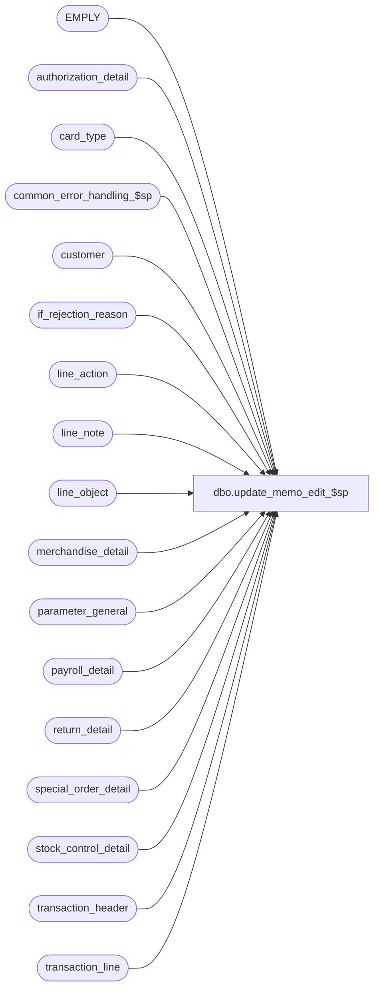

# dbo.update_memo_edit_$sp

**Database:** auditworks  
**Server:** bedrockdb01  

## Architecture Diagram



## Table Dependencies

| Referenced Table |
|---|
| EMPLY |
| authorization_detail |
| card_type |
| common_error_handling_$sp |
| customer |
| if_rejection_reason |
| line_action |
| line_note |
| line_object |
| merchandise_detail |
| parameter_general |
| payroll_detail |
| return_detail |
| special_order_detail |
| stock_control_detail |
| transaction_header |
| transaction_line |

## Stored Procedure Code

```sql
create proc dbo.update_memo_edit_$sp @errmsg 		nvarchar(255) OUTPUT,
@process_no             tinyint = 4,
@edit_process_no 	tinyint = 1

AS

/* 
    Proc name : update_memo_edit_$sp
         Desc : Updates the three memo columns in if_rejection_reason which will  
                contain information explaining why the transactions were rejected.
                Called by edit_phase2_$sp.

    HISTORY:
    Date     Name           Def# Action
    Feb03,16 Vicci    TFS-139985 Handle conversion (via STR function) of line amounts as large as numeric(18,4) to string
    Feb26,15 Vicci    TFS-107968 When item not on file information to support the audit is not available from the Additional Item information attachment,
                                 take it from the Special Order attachment.
    Jan13,15 Vicci     TFS-99599 Handle I/F Rejection Rule 83 (invalid cashier) same as rule 80 (invalid/missing cashier)
    Oct10,14 Vicci     TFS-88075 Transfer memo3 to lookup_key1 for Incomplete Customer Data rejects before overlaying it with zip code.
    Sep17,14 Phu       TFS-84776 Port Oracle fixed error: single-row subquery returns more than one row.
    Jul10,14 Vicci     TFS-74694 Log same memo fields for I/F Rejection rule 116 (Merchandise cost unknown) as for UPC not on file.
    Apr20,11 Vicci        105917 Replace ISNULL(e1.LAST_NAME, CONVERT(nvarchar, r.original_salesperson)) + ' ' + ISNULL(e1.FRST_NAME, ' ') style 
                                 logging with simple logging of employee number since UI is being modified to lookup display name
                                 associated with memo1 and provide drill-down to TM.  
                                 Remove reject 54 update since it no longer exists as of S/A 3.5
    Apr16,10 Vicci        117187 Log additional item information for UPC/POSID/POSDEPT not on file messages.  
    Oct09,07 Paul          91395 Updated comments
    Aug07,07 Phu           87969 Apply 90420, 85783 to SA5.
    Oct25,06 Phu           77931 Fix outer join for SQL 2005 Mode 90.
    Sep21,06 Paul          76719 apply 75320 to SA5
    Dec19,05 Paul          64546 apply 61838 to SA5, added nolock hints
    Nov02,05 Paul          62153 apply 61728 to SA5
    Sep20,05 Paul          60471 apply DV-1298 to SA5
    Jul19,05 David       DV-1294 Log invalid_reference_no.
    Feb08,05 David       DV-1206 Treat I/F reject reason 113 same as reason 2.
    Apr28,04 Brett C	 DV-1071 change employee table to EMPLY
    Aug07,07 Phu           90420 Do not log to memo1, memo2 for reject 21-41 because it was done in proc edit_emp_attribute_$sp.
    Mar05,07 Vicci         85783 Fix join on payroll employee not on file reject (82)
    Sep21,06 Paul          75320 Avoid possible concat null problem
    Feb03,06 David         66991 Fix join from if_rejection_reason to customer for I/F Reject 6.
    Dec07,05 Daphna        61838 Log correct cust info by matching memo3 to customer role
    Oct19,05 David         61728 Log card_type in memo2 for I/F rejects 2 and 113.
    Aug24,05 David       DV-1298 Treat I/F reject reason 113 same as reason 2. Log invalid_reference_no.
    Aug16,02 HenryW	 1-AUHY5 Added 2 new system I/F reject reasons = 110 and 111.
    Jul04,02 Winnie      AW-8770 Do not update memo2 if invalid card (if_reject_reason = 2),
                                 do not update memo1 if if_reject_reason >= 11 and < 100
    Apr22,02 David C     1-CJ7R1 Do not update memo2 if if_reject_reason >= 100 
    Dec04,01 David C     1-9ATXP Change 7369 to check if_reject_reason < 100.
    Nov27,01 Ian K       1-97UU6 Edit Phase 2 batching for R3
    Aug10,01 Maryam         8283 Exclude update on memo fields for if_rejection_reason = 7, 8
    Jun06,01 Phu            7214 Set memo1 to Merch/Stock POS Identifier and/or Merch/Stock POS Deptclass
                                 for if_reject_reason = 87, 89, 88, 90
    May08,01 Henry          7796 For multi-language IF reject reason descriptions. Add new field lookup_key1.
    May04,01 Henry          7369 Exclude update on memo fields for User Defined IF rejects < 200
    Feb27,01 Vicci          7373 Log POS ID to memo3 so that it can be displayed in I/F reject
                                 window.  Still only a temporary solution.  The mass-correct
              eventually needs to be fixed.
    Jan15,01 Vicci          7213 Temporarily disable the POS ID logging since it causes any
                                 subsequent invalid upc reject revaluations / reassignments
         to fail
    Jan08,01 Phu            7160 Keep pos_identifier even if it's not on file and sku_lookup_method = 1,2
    May17,00 Louise         6294 added join on upc_lookup_division
    Mar30,00 Daphna         6087 ensure memo fields populated for IF rej 8 (tax default)
    Mar06,00 Paul S         5286 Correctly set memo1 for type 81 rejects (return employee)
    Sep28,98 Paul S           ?? ??
    May17,96 Paul S          n/a Creation

*/

DECLARE
 
  @errno                        int,
  @sku_lookup_method            tinyint,
  @object_name                  nvarchar(255),
  @process_name                 nvarchar(100),
  @operation_name               nvarchar(100),
  @message_id			int


  SELECT @process_name     = 'update_memo_edit_$sp',
         @message_id       = 201068   

  SELECT @sku_lookup_method = sku_lookup_method
    FROM parameter_general

  IF @sku_lookup_method >= 1
  BEGIN

    --
    -- if_reject_reason 87 - Merch POS Identifier Not On File
    --
  
    UPDATE if_rejection_reason
       SET memo1 = m.pos_identifier,
           memo2 = CONVERT(nvarchar, m.pos_deptclass),
           memo3 = STR(m.ticket_price, 18, 2) + ' ' + STR(m.sold_at_price, 18, 2), 
           other_information = CASE WHEN COALESCE(n.line_note, s.vendor_no, s.imrd, s.reason, o.merchandise_description, o.vendor_style_description, o.color_description, o.size_description) IS NULL THEN NULL 
             		          ELSE SUBSTRING (COALESCE(n.line_note, o.merchandise_description, '') 		--description 
           		               + ' / ' + COALESCE(s.vendor_no, o.vendor_style_description, '') 	--style
           		       	       + ' / ' + COALESCE(s.imrd, o.color_description, '')		--color
           		               + ' / ' + COALESCE(s.reason, o.size_description, '')		--size
           		               , 1, 255) END
      FROM if_rejection_reason i 
           INNER JOIN merchandise_detail m WITH (NOLOCK)
              ON i.transaction_id   = m.transaction_id
       	     AND i.line_id          = m.line_id
       	   LEFT OUTER JOIN line_note n WITH (NOLOCK)
       	      ON i.transaction_id   = n.transaction_id
	     AND i.line_id          = n.line_id
	     AND n.note_type 	    = 9019 --(Item description)
       	  LEFT OUTER JOIN stock_control_detail s WITH (NOLOCK)
       	    ON i.transaction_id   = s.transaction_id
	   AND i.line_id          = s.line_id
	   AND s.display_def_id   = 66 --(Additional Item Information)
	  LEFT OUTER JOIN special_order_detail o WITH (NOLOCK)
       	    ON i.transaction_id   = o.transaction_id
	   AND i.line_id          = o.line_id
     WHERE i.if_reject_reason = 87
       AND i.memo1 IS NULL  
    SELECT @errno = @@error
    IF @errno != 0
    BEGIN
      SELECT @errmsg         = 'Failed to update if_rejection_reason (merch pos_identifier).',
             @object_name    = 'if_rejection_reason',
             @operation_name = 'UPDATE'
      GOTO error
    END

    --
    -- if_reject_reason 88 - Merch POS Deptclass Not On File
    --
    
    UPDATE if_rejection_reason
       SET memo1 = CONVERT(nvarchar, m.pos_deptclass),
           memo3 = STR(m.ticket_price, 18, 2) + ' ' + STR(m.sold_at_price, 18, 2), 	
         other_information = CASE WHEN COALESCE(n.line_note, s.vendor_no, s.imrd, s.reason, o.merchandise_description, o.vendor_style_description, o.color_description, o.size_description) IS NULL THEN NULL 
             		          ELSE SUBSTRING (COALESCE(n.line_note, o.merchandise_description, '') 		--description 
           		               + ' / ' + COALESCE(s.vendor_no, o.vendor_style_description, '') 	--style
           		       	       + ' / ' + COALESCE(s.imrd, o.color_description, '')		--color
           		               + ' / ' + COALESCE(s.reason, o.size_description, '')		--size
           		               , 1, 255) END

      FROM if_rejection_reason i 
           INNER JOIN merchandise_detail m WITH (NOLOCK)
              ON i.transaction_id   = m.transaction_id
       	     AND i.line_id          = m.line_id
       	   LEFT OUTER JOIN line_note n WITH (NOLOCK)
       	      ON i.transaction_id   = n.transaction_id
	     AND i.line_id          = n.line_id
	     AND n.note_type 	    = 9019 --(Item description)
       	  LEFT OUTER JOIN stock_control_detail s WITH (NOLOCK)
       	    ON i.transaction_id   = s.transaction_id
	   AND i.line_id          = s.line_id
	   AND s.display_def_id   = 66 --(Additional Item Information)
	  LEFT OUTER JOIN special_order_detail o WITH (NOLOCK)
       	    ON i.transaction_id   = o.transaction_id
	   AND i.line_id          = o.line_id
     WHERE i.if_reject_reason = 88
       AND i.memo1 IS NULL  
    SELECT @errno = @@error
    IF @errno != 0
    BEGIN
      SELECT @errmsg         = 'Failed to update if_rejection_reason (merch pos_deptclass).',
             @object_name    = 'if_rejection_reason',
             @operation_name = 'UPDATE'
      GOTO error
    END

    --
    -- if_reject_reason 89 - Stock POS Identifier Not On File
    --  
  
    UPDATE if_rejection_reason
       SET memo1 = sc.pos_identifier,
           memo2 = CONVERT(nvarchar, sc.pos_deptclass)
      FROM if_rejection_reason i, 
           stock_control_detail sc WITH (NOLOCK)
     WHERE i.if_reject_reason = 89
       AND i.memo1 IS NULL  
       AND i.transaction_id = sc.transaction_id
   AND i.line_id        = sc.line_id

    SELECT @errno = @@error
    IF @errno != 0
    BEGIN
      SELECT @errmsg         = 'Failed to update if_rejection_reason (stock pos_identifier).',
             @object_name    = 'if_rejection_reason',
             @operation_name = 'UPDATE'
      GOTO error
    END

    --
    -- if_reject_reason 90 - Stock POS Deptclass Not On File
    --
      
    UPDATE if_rejection_reason
       SET memo1 = CONVERT(nvarchar, sc.pos_deptclass)
      FROM if_rejection_reason i, stock_control_detail sc WITH (NOLOCK)
     WHERE i.if_reject_reason = 90
       AND i.memo1 IS NULL  
       AND i.transaction_id = sc.transaction_id
       AND i.line_id        = sc.line_id

    SELECT @errno = @@error
    IF @errno != 0
    BEGIN
      SELECT @errmsg         = 'Failed to update if_rejection_reason (stock pos_deptclass).',
             @object_name    = 'if_rejection_reason',
             @operation_name = 'UPDATE'
      GOTO error
    END
  
  END -- if @sku_lookup_method >= 1

  --
  -- if_reject_reason 1 - UPC Not On File, 116 Cost Unknown
  --

  UPDATE if_rejection_reason
     SET memo1 = CASE WHEN if_reject_reason = 116 AND m.upc_no = 0 THEN m.pos_identifier ELSE CONVERT(nvarchar, m.upc_no) END,
         memo2 = CONVERT(nvarchar, m.pos_deptclass),
         memo3 = STR(m.ticket_price, 18, 2) + ' ' + STR(m.sold_at_price, 18, 2),
         other_information = CASE WHEN COALESCE(n.line_note, s.vendor_no, s.imrd, s.reason, o.merchandise_description, o.vendor_style_description, o.color_description, o.size_description) IS NULL THEN NULL 
             		          ELSE SUBSTRING (COALESCE(n.line_note, o.merchandise_description, '') 		--description 
           		               + ' / ' + COALESCE(s.vendor_no, o.vendor_style_description, '') 	--style
           		       	       + ' / ' + COALESCE(s.imrd, o.color_description, '')		--color
           		               + ' / ' + COALESCE(s.reason, o.size_description, '')		--size
           		               , 1, 255) END
    FROM if_rejection_reason i
           INNER JOIN merchandise_detail m WITH (NOLOCK)
              ON i.transaction_id   = m.transaction_id
       	     AND i.line_id          = m.line_id
       	   LEFT OUTER JOIN line_note n WITH (NOLOCK)
       	      ON i.transaction_id   = n.transaction_id
	     AND i.line_id          = n.line_id
	     AND n.note_type 	    = 9019 --(Item description)
       	  LEFT OUTER JOIN stock_control_detail s WITH (NOLOCK)
       	    ON i.transaction_id   = s.transaction_id
	   AND i.line_id          = s.line_id
	   AND s.display_def_id   = 66 --(Additional Item Information)
	  LEFT OUTER JOIN special_order_detail o WITH (NOLOCK)
       	    ON i.transaction_id   = o.transaction_id
	   AND i.line_id          = o.line_id
   WHERE i.if_reject_reason IN (1, 116)
     AND i.memo1 IS NULL 

  SELECT @errno = @@error
  IF @errno != 0
  BEGIN
    SELECT @errmsg         = 'Failed to update if_rejection_reason (type 1).',
           @object_name    = 'if_rejection_reason',
           @operation_name = 'UPDATE'
    GOTO error
  END
 
  --
  -- if_reject_reason 2,113 - Invalid Card Number / Card not accepted
--

  UPDATE if_rejection_reason
     SET memo1 = IsNull(convert(nvarchar(80),l.invalid_reference_no), l.reference_no),
         memo2 = IsNull(ad.card_type,'?'),
       memo3 = STR(ROUND(l.gross_line_amount - l.pos_discount_amount, 2), 18, 2),
         lookup_key1 = (o.line_object * 1000) + a.line_action
    FROM if_rejection_reason i
         INNER JOIN transaction_line l WITH (NOLOCK) ON (i.transaction_id = l.transaction_id AND i.line_id = l.line_id)
         INNER JOIN line_object o ON (l.line_object = o.line_object)
         INNER JOIN line_action a ON (l.line_action = a.line_action)
         LEFT JOIN authorization_detail ad WITH (NOLOCK) ON (l.transaction_id = ad.transaction_id AND l.line_id = ad.line_id )
   WHERE i.memo1 IS NULL --
     AND i.if_reject_reason IN (2,113) 

  SELECT @errno = @@error
  IF @errno != 0
  BEGIN
    SELECT @errmsg         = 'Failed to update if_rejection_reason (type 2,113).',
           @object_name    = 'if_rejection_reason',
           @operation_name = 'UPDATE'
    GOTO error
  END

  UPDATE if_rejection_reason
     SET memo2 = memo2 + ' - ' + IsNull(ct.card_type_description,'Unknown card type')
    FROM if_rejection_reason i LEFT JOIN card_type ct ON (i.memo2 = ct.card_type)
   WHERE i.if_reject_reason IN (2,113) 
     AND LEN(i.memo2) = 1

  SELECT @errno = @@error
  IF @errno != 0
  BEGIN
    SELECT @errmsg         = 'Failed to update if_rejection_reason (type 2,113 card description).',
           @object_name    = 'if_rejection_reason',
           @operation_name = 'UPDATE'
    GOTO error
  END

  --
  -- if_reject_reason 3 - Invalid Salesperson
  --

  UPDATE if_rejection_reason
     SET memo1 = CONVERT(nvarchar, m.salesperson),
         memo2 = CONVERT(nvarchar, m.salesperson2) 
    FROM if_rejection_reason i
         INNER JOIN merchandise_detail m WITH (NOLOCK) ON (i.transaction_id = m.transaction_id AND i.line_id = m.line_id)
         LEFT JOIN EMPLY e1 WITH (NOLOCK) ON (m.salesperson = e1.EMPLY_NUM AND e1.EMPLY_NUM <> 0)
         LEFT JOIN EMPLY e2 WITH (NOLOCK) ON (m.salesperson2 = e2.EMPLY_NUM AND e2.EMPLY_NUM <> 0)
   WHERE i.memo1 IS NULL --
     AND i.if_reject_reason = 3

  SELECT @errno = @@error
  IF @errno != 0
  BEGIN
    SELECT @errmsg         = 'Failed to update if_rejection_reason (type 3).',
           @object_name    = 'if_rejection_reason',
           @operation_name = 'UPDATE'
    GOTO error
  END

  --
  -- if_reject_reason 4 - Invalid Purchasing Employee
  --

  UPDATE if_rejection_reason
     SET memo1 = CONVERT(nvarchar, th.employee_no)
    FROM if_rejection_reason i
         INNER JOIN transaction_header th WITH (NOLOCK) ON (i.transaction_id = th.transaction_id)
    LEFT JOIN EMPLY e1 WITH (NOLOCK) ON (th.employee_no = e1.EMPLY_NUM)
   WHERE i.memo1 IS NULL --
     AND i.if_reject_reason = 4
     AND th.employee_no >= 1 

  SELECT @errno = @@error
  IF @errno != 0
  BEGIN
    SELECT @errmsg         = 'Failed to update if_rejection_reason (type 4).',
           @object_name    = 'if_rejection_reason',
           @operation_name = 'UPDATE'
    GOTO error
  END

  --
  -- if_reject_reason 5 - UPC Not On File
  --
 
  UPDATE if_rejection_reason
     SET memo1 = CONVERT(nvarchar, sc.upc_no)
    FROM if_rejection_reason i, stock_control_detail sc WITH (NOLOCK)
   WHERE i.transaction_id = sc.transaction_id 
     AND i.line_id = sc.line_id 
     AND i.memo1 IS NULL  
     AND i.if_reject_reason = 5

  SELECT @errno = @@error
  IF @errno != 0
  BEGIN
    SELECT @errmsg         = 'Failed to update if_rejection_reason (type 5).',
           @object_name    = 'if_rejection_reason',
           @operation_name = 'UPDATE'
    GOTO error
  END

  --
  -- if_reject_reason 6 - Incomplete Customer
  --

  UPDATE if_rejection_reason
    SET memo1 = ISNULL(c.last_name,' ') + ' ' + ISNULL(c.first_name,' '),
        memo2 = ISNULL(c.address_1,' ') + ' ' + ISNULL(RTRIM(c.address_2),' ') + ' ' + ISNULL(RTRIM(c.city),' ')
         + ' ' + ISNULL(RTRIM(c.county),' ') + ' ' + ISNULL(RTRIM(c.state),' ') + ' ' + ISNULL(RTRIM(c.country),' '),  
        lookup_key1 = i.memo3,
      memo3 = c.post_code
    FROM if_rejection_reason i, customer c WITH (NOLOCK)
   WHERE i.transaction_id = c.transaction_id 
     AND i.line_id = c.line_id
     AND c.customer_role = i.memo3 
     AND i.memo1 IS NULL  
     AND i.if_reject_reason = 6 

  SELECT @errno = @@error
  IF @errno != 0
  BEGIN
    SELECT @errmsg         = 'Failed to update if_rejection_reason (type 6).',
           @object_name    = 'if_rejection_reason',
         @operation_name = 'UPDATE'
    GOTO error
  END

  --
  -- if_reject_reason 9 - Invalid Original Store Number
  --

  UPDATE if_rejection_reason
     SET memo1 = CONVERT(nvarchar, r.return_from_store)
    FROM if_rejection_reason i, 
         return_detail r WITH (NOLOCK)
   WHERE i.transaction_id = r.transaction_id 
     AND i.line_id = r.line_id 
     AND i.memo1 IS NULL  
     AND i.if_reject_reason = 9 

  SELECT @errno = @@error
  IF @errno != 0
  BEGIN
    SELECT @errmsg         = 'Failed to update if_rejection_reason (type 9).',
           @object_name    = 'if_rejection_reason',
           @operation_name = 'UPDATE'
    GOTO error
  END

  --
  -- if_reject_reason 10 - Invalid Other Store Number
  --

  UPDATE if_rejection_reason
     SET memo1 = CONVERT(nvarchar, sc.other_store_no)
    FROM if_rejection_reason i, stock_control_detail sc WITH (NOLOCK)
   WHERE i.transaction_id = sc.transaction_id
     AND i.line_id = sc.line_id 
     AND sc.other_store_no >= 0 
     AND i.memo1 IS NULL  
     AND i.if_reject_reason = 10

  SELECT @errno = @@error
  IF @errno != 0
  BEGIN
    SELECT @errmsg         = 'Failed to update if_rejection_reason (type 10).',
           @object_name    = 'if_rejection_reason',
           @operation_name = 'UPDATE'
    GOTO error
  END


  --
  -- if_reject_reason 80, 83 - Invalid/Missing Cashier, Invalid Cashier
  --

  UPDATE if_rejection_reason
     SET memo1 = CONVERT(nvarchar, th.cashier_no)
    FROM if_rejection_reason i
         INNER JOIN transaction_header th WITH (NOLOCK) ON (i.transaction_id = th.transaction_id)
   WHERE i.memo1 IS NULL --
     AND i.if_reject_reason IN (80, 83) 
     AND th.cashier_no >= 1 

  SELECT @errno = @@error
  IF @errno != 0
  BEGIN
    SELECT @errmsg         = 'Failed to update if_rejection_reason (type 80, 83).',
           @object_name    = 'if_rejection_reason',
           @operation_name = 'UPDATE'
    GOTO error
  END

  --
  -- if_reject_reason 81 - Invalid Original Salesperson
  --

  UPDATE if_rejection_reason
     SET memo1 = CONVERT(nvarchar, r.original_salesperson),
         memo2 = CONVERT(nvarchar, r.original_salesperson2)
    FROM if_rejection_reason i
         INNER JOIN return_detail r WITH (NOLOCK) ON (i.transaction_id = r.transaction_id AND i.line_id = r.line_id)
   WHERE i.memo1 IS NULL --
     AND i.if_reject_reason = 81

  SELECT @errno = @@error
  IF @errno != 0
  BEGIN
    SELECT @errmsg         = 'Failed to update if_rejection_reason (type 3).',
           @object_name    = 'if_rejection_reason',
           @operation_name = 'UPDATE'
    GOTO error
  END

  --
  -- if_reject_reason 82 - Invalid Employee on Payroll
  --
  
  UPDATE if_rejection_reason
     SET memo1 = CONVERT(nvarchar(255), p.employee_no),
         memo2 = SUBSTRING(e.vendor_no, 1, 255)
    FROM if_rejection_reason i
         INNER JOIN payroll_detail p
                 ON i.transaction_id = p.transaction_id 
                AND i.line_id = p.line_id
                AND p.employee_no >= 1 
         LEFT OUTER JOIN stock_control_detail e
                 ON p.transaction_id = e.transaction_id
                AND p.line_id = e.line_id
                AND e.display_def_id = 58
   WHERE i.memo1 IS NULL 
     AND i.if_reject_reason = 82

  SELECT @errno = @@error
  IF @errno != 0
  BEGIN
    SELECT @errmsg         = 'Failed to update if_rejection_reason (type 4).',
           @object_name    = 'if_rejection_reason',
           @operation_name = 'UPDATE'
    GOTO error
  END

  --
  -- if_reject_reason All Others - Customer Liability
  --
  
  -- Defect 7369. Exclude update on memo fields for User Defined IF reject reasons < 200 */
  -- Def 1-9ATXP. Do not update for I/F reject reason = 100 (new customer liability).

  UPDATE if_rejection_reason
     SET memo2 = l.reference_no,
         memo3 = STR(ROUND(l.gross_line_amount - l.pos_discount_amount, 2), 18, 2),
         lookup_key1 = (o.line_object * 1000) + a.line_action
    FROM if_rejection_reason i, transaction_line l WITH (NOLOCK), line_object o, line_action a
   WHERE ((i.if_reject_reason >= 11 AND i.if_reject_reason <= 20) OR
          (i.if_reject_reason >= 42 AND i.if_reject_reason < 100 AND i.if_reject_reason NOT IN (54,80,81,82,87,88,89,90))
         )
     AND i.memo1 IS NULL  
     AND i.transaction_id = l.transaction_id 
     AND i.line_id = l.line_id 
     AND l.line_object = o.line_object 
     AND l.line_action = a.line_action

  SELECT @errno = @@error
  IF @errno != 0
  BEGIN
    SELECT @errmsg         = 'Failed to update if_rejection_reason (misc. type).',
           @object_name    = 'if_rejection_reason',
           @operation_name = 'UPDATE'
    GOTO error
  END

  -- Def 1-AUHY5. Added 2 new system I/F rejects, 110 and 111. 
  -- Set lookup_key1 for any system I/F reject between 110 and 199.

  UPDATE if_rejection_reason
     SET lookup_key1 = (o.line_object * 1000) + a.line_action
    FROM if_rejection_reason i, transaction_line l WITH (NOLOCK), line_object o, line_action a
   WHERE i.if_reject_reason BETWEEN 110 and 199
     AND i.transaction_id = l.transaction_id 
     AND i.line_id = l.line_id 
     AND l.line_object = o.line_object 
     AND l.line_action = a.line_action

  SELECT @errno = @@error
  IF @errno != 0
  BEGIN
    SELECT @errmsg         = 'Failed to update if_rejection_reasons between 110 and 199.',
           @object_name    = 'if_rejection_reason',
           @operation_name = 'UPDATE'
    GOTO error
  END

  UPDATE if_rejection_reason
     SET memo1 = CONVERT(nvarchar, sc.originating_store_no)
    FROM if_rejection_reason i, stock_control_detail sc WITH (NOLOCK)
   WHERE i.transaction_id = sc.transaction_id
     AND i.line_id = sc.line_id 
     AND sc.originating_store_no >= 0 
     AND i.memo1 IS NULL  
     AND i.if_reject_reason = 111

  SELECT @errno = @@error
  IF @errno != 0
  BEGIN
    SELECT @errmsg         = 'Failed to update if_rejection_reason (type 111).',
           @object_name    = 'if_rejection_reason',
           @operation_name = 'UPDATE'
    GOTO error
 END

  UPDATE if_rejection_reason
     SET memo1 = CONVERT(nvarchar, md.originating_store_no)
    FROM if_rejection_reason i, merchandise_detail md WITH (NOLOCK)
   WHERE i.transaction_id = md.transaction_id
     AND i.line_id = md.line_id 
     AND md.originating_store_no >= 0 
     AND i.memo1 IS NULL  
     AND i.if_reject_reason = 110

  SELECT @errno = @@error
  IF @errno != 0
  BEGIN
    SELECT @errmsg         = 'Failed to update if_rejection_reason (type 110).',
           @object_name    = 'if_rejection_reason',
           @operation_name = 'UPDATE'
    GOTO error
  END

  /* removed update of old customer liability - AW-8770 */

RETURN

error:

  EXEC common_error_handling_$sp @process_no, @errno, @errmsg, 0, @message_id, 
                                 @process_name, @object_name, @operation_name, 1, @edit_process_no
RETURN
```

