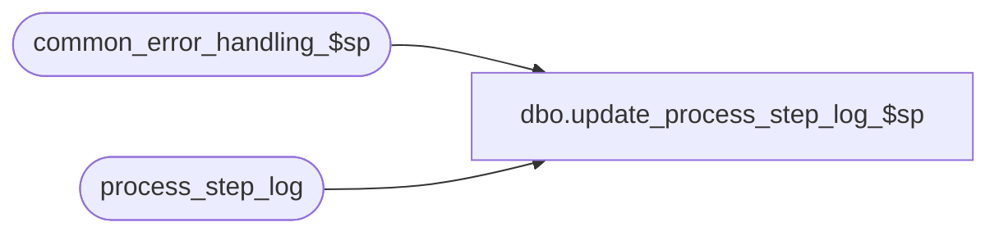

# dbo.update_process_step_log_$sp

**Database:** auditworks  
**Server:** bedrockdb01  

## Architecture Diagram



## Table Dependencies

| Referenced Table |
|---|
| common_error_handling_$sp |
| process_step_log |

## Stored Procedure Code

```sql
create proc dbo.update_process_step_log_$sp 

( @process_no			smallint = NULL,
  @stream_no			smallint = NULL,
  @process_step_no		int = NULL,
  @expected_workload    	int = NULL,
  @completed_workload		int = NULL,
  @process_step_start_time	datetime = NULL)

AS


/* Proc name: update_process_step_log_$sp
   Desc:      To update an entry in process_step_log table if the entry exists,
              else create.
              Called by all.

History:
Date     Name          Def#  Desc
Jan05,11 Paul        105313  Use unicode datatypes
Jun05,02 Phu        1-DFPT9  Replace null with 1 for expected_workload during insert
JAN17,02 Daphna	    1-A91VP  Allow increment to completed_workload by a number > 1
Nov12,01 Phu           8931  Author
*/

DECLARE
     @completed			int,
	@errmsg 				nvarchar(255),
	@errno 					int,
	@message_id				int,
	@object_name				nvarchar(255),
	@operation_name				nvarchar(100),
	@process_name				nvarchar(100),
	@rows					int


IF @process_no IS NULL OR @stream_no IS NULL OR @process_step_no IS NULL --
  RETURN


/* 
When @completed_workload IS NULL, increment process_step_log.completed_workload by 1
When @completed_workload > 0, replace process_step_log.completed_workload by @completed_workload
When @completed_workload < 0, increment process_step_log.completed_workload by ABS(@completed_workload)
*/

SELECT @message_id = 201068,
       @process_name = 'update_process_step_log_$sp',
       @completed = @completed_workload,
       @rows = 0

IF @completed_workload >= 0  -- REPLACE
BEGIN
  UPDATE process_step_log
  SET process_step_no = @process_step_no,
      expected_workload = ISNULL(@expected_workload, expected_workload),
      completed_workload = @completed,
      process_step_start_time = ISNULL(@process_step_start_time, process_step_start_time)
  WHERE process_no = @process_no
  AND stream_no =  @stream_no

  SELECT @errno = @@error,
         @rows = @@rowcount
  IF @errno <> 0
  BEGIN
    SELECT @errmsg = 'replace completed_workload',
           @object_name = 'process_step_log',
           @operation_name = 'UPDATE'
    GOTO error
  END
END
ELSE -- INCREMENT
BEGIN

  IF @completed IS NULL --
    SELECT @completed = 1
    
  UPDATE process_step_log
  SET process_step_no = @process_step_no,
      expected_workload = ISNULL(@expected_workload, expected_workload),
      completed_workload = completed_workload + ABS(@completed),
      process_step_start_time = ISNULL(@process_step_start_time, process_step_start_time)
  WHERE process_no = @process_no
  AND stream_no =  @stream_no

  SELECT @errno = @@error,
         @rows = @@rowcount
  IF @errno <> 0
  BEGIN
    SELECT @errmsg = 'increment completed_workload',
           @object_name = 'process_step_log',
           @operation_name = 'UPDATE'
    GOTO error
  END
END  -- INCREMENT

IF @rows = 0
BEGIN
  INSERT INTO process_step_log (
    process_no,
    stream_no,
    process_step_no,
    expected_workload,
    completed_workload,
    process_step_start_time )
  VALUES (
    @process_no,
    @stream_no,
    @process_step_no,
    ISNULL(@expected_workload, 1),
    ISNULL(ABS(@completed_workload), 0),
    ISNULL(@process_step_start_time, getdate() ) )

  SELECT @errno = @@error
  IF @errno <> 0
  BEGIN
      SELECT @errmsg = 'Unable to insert process_step_log',
             @object_name = 'process_step_log',
             @operation_name = 'INSERT'
      GOTO error
  END
END  -- no rows updated


RETURN

error:

	EXEC common_error_handling_$sp @process_no, @errno, @errmsg, 0, @message_id, 
	@process_name, @object_name, @operation_name, 1, @stream_no
	RETURN
```

