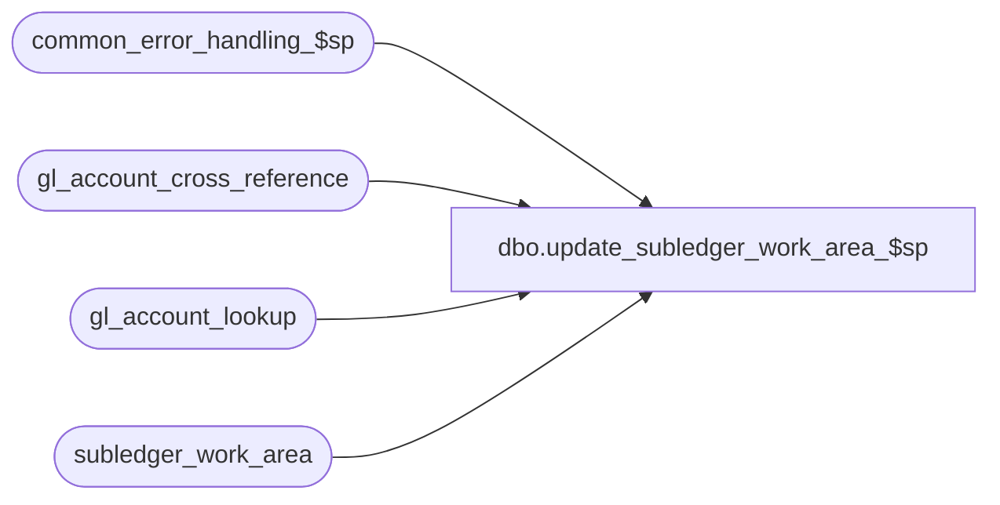

# dbo.update_subledger_work_area_$sp

**Database:** auditworks  
**Server:** bedrockdb01  

## Architecture Diagram



## Table Dependencies

| Referenced Table |
|---|
| common_error_handling_$sp |
| gl_account_cross_reference |
| gl_account_lookup |
| subledger_work_area |

## Stored Procedure Code

```sql
create proc dbo.update_subledger_work_area_$sp 
 
( @row_updated 			int 		OUTPUT,
  @errmsg 			nvarchar(255) 	OUTPUT )

AS

/* Proc name:   update_subledger_work_area_$sp
** Description: Updates the subledger_work_area with gl_account_id retrieved
** 		from gl_account_lookup table which is built by
**              create_gl_account_id_$sp procedure.
** 		Called from build_subledger_$sp
HISTORY
DATE     NAME     Def#  DESCRIPTION
Jan16,14 Vicci  149341  Support new Transaction G/L Account Reference lookup type 17
Jun16,10 Vicci  102089  Log invalid segment lookup type/value and mark G/L account 0 as invalid
			where relevant to support subsequent issue list logging.
Jun12,06 Vicci   73379  Support G/L segment lookup type 15 (by employee purchase flag)
Jul11,02 Phu   1-CTDHQ  Fix error: duplicate key/unique constraint in insert gl_account_lookup
                        due to col1 = col2 is false if both have values of null
Apr24,02 Phu   1-CTDHQ  Fix error: duplicate key/unique constraint in insert gl_account_lookup. Error handling
Jun11,01 ShuZ     8032  Transaction attribution to originating store
Feb07,01 Maryam   7281  add taxable column to join criteria. 
Mar30,00 JimC     6179  Copy of previous version to force resave.
*/


DECLARE
	@errno 				int,
	@process_no 			smallint,
	@message_id			int,
	@object_name			nvarchar(255),
	@operation_name			nvarchar(100),
	@process_name			nvarchar(100)


SELECT 	@process_no = 20,
        @message_id = 201068,
        @process_name = 'update_subledger_work_area_$sp'

UPDATE subledger_work_area
   SET gl_account_id = g.gl_account_id,
       failed_lookup_type = g.failed_lookup_type,
       failed_lookup_value = g.failed_lookup_value
  FROM subledger_work_area s
       INNER JOIN gl_account_lookup g
          ON s.store_no = g.store_no
   	 AND s.transaction_category = g.transaction_category
   	 AND s.line_object = g.line_object
   	 AND s.line_action = g.line_action
   	 AND s.class_code = g.class_code
   	 AND s.tax_jurisdiction = g.tax_jurisdiction
   	 AND s.store_deposit_destination = g.store_deposit_destination
   	 AND s.discounted_line_object = g.discounted_line_object
   	 AND s.return_from_store = g.return_from_store
   	 AND s.card_type = g.card_type
   	 AND s.taxable = g.taxable
   	 AND (   (s.originating_store_no IS NOT NULL AND g.originating_store_no IS NOT NULL 
            	  AND s.originating_store_no = g.originating_store_no
             	 )
              OR (s.originating_store_no IS NULL AND g.originating_store_no IS NULL)
             )
         AND s.empl_purch_flag = g.empl_purch_flag  --defect 73379
         AND (s.gl_account_reference = g.gl_account_reference OR (s.gl_account_reference IS NULL AND g.gl_account_reference IS NULL))
 WHERE s.gl_account_id = -1

SELECT @row_updated = @@rowcount, @errno = @@error
IF @errno <> 0
  BEGIN
    SELECT @errmsg = 'Unable to update subledger_work_area',
	   @object_name = 'subledger_work_area',
	   @operation_name = 'UPDATE'
    GOTO error
  END

--Note:  done in separate statement since in scaleout environment gl_account_cross_reference and gl_account_lookup are views to consolidated
UPDATE subledger_work_area
   SET invalid_account_no = x.gl_account_no 
  FROM subledger_work_area s
       INNER JOIN gl_account_cross_reference x
         ON s.gl_account_id = x.gl_account_id
        AND x.invalid_account_flag = 1
 WHERE invalid_account_no IS NULL
SELECT @errno = @@error
IF @errno <> 0
  BEGIN
    SELECT @errmsg = 'Unable to update subledger_work_area invalid account',
	   @object_name = 'subledger_work_area',
	   @operation_name = 'UPDATE'
    GOTO error
  END

RETURN


error:
	EXEC common_error_handling_$sp @process_no, @errno, @errmsg, 0, @message_id, 
	@process_name, @object_name, @operation_name, 1
	RETURN
```

