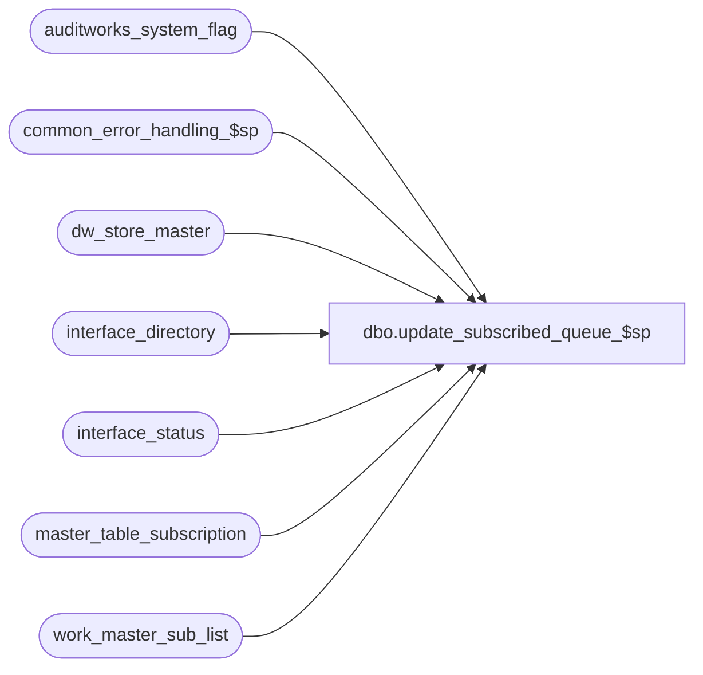

# dbo.update_subscribed_queue_$sp

**Database:** auditworks  
**Server:** bedrockdb01  

## Architecture Diagram



## Table Dependencies

| Referenced Table |
|---|
| auditworks_system_flag |
| common_error_handling_$sp |
| dw_store_master |
| interface_directory |
| interface_status |
| master_table_subscription |
| work_master_sub_list |

## Stored Procedure Code

```sql
create proc dbo.update_subscribed_queue_$sp ( @table_name		nvarchar(30),
  @table_key		nvarchar(255),
  @action		tinyint -- 1=insert, 2=update, 3=delete
)

AS

/* Proc name: update_subscribed_queue_$sp
   Desc: Update the export queue for subscribed interfaces.
         Replaces the functionality of the old audit trail trigger for some master tables.
   Called from table maintenance triggers.

HISTORY
Date     Name        Def# Desc
Mar02,17 Vicci  DAOM-1928 Populate dw_store_master for stores that are valid for S/A, regardless of whether or not they are active yet.
Aug15,13 Paul      145958 call common_error_handling_$sp, use try .. catch
Feb26,13 Vicci     142088 To avoid deadlocks, lock a shared flag prior to work_master_sub_list deletions.
Jan08,12 Vicci     140866 Make consistent with audit_trail_header_$trI;  
                          check rowcount for master table subscription / interface status updates; 
                          don't ask for audit-trail copy if in 5.1 where TM no longer happens in PB (avoids duplicate audit trail entries).
Apr07,11 Vicci     126078 Take master_table_subscription active flag into account.
Nov04,09 Paul      113547 corrected proc name in raise error
Aug08,08 Paul      101774 Use interface 37 instead of 46 due to conflict with BI
May07,08 Paul      100995 added comments
Sep11,06 Tim        70648 Apply defect 68918 to SA5
Mar22,06 Vicci	    68918 Set last_modification_datetime in master_table_subscription.
Feb11,05 David    DV-1206 Set interface_status.last_posting_datetime
Nov21,04 Paul     DV-1167 author

*/

DECLARE @cursor_open		tinyint,
	@errmsg			nvarchar(1024),
	@errno			int,
	@interface_id		tinyint,
	@entry_datetime		datetime,
	@rows			int,
	@immediate_posting_requested tinyint,
	@update_timing		smallint,
	@object_name		nvarchar(255),
	@process_name		nvarchar(100),
	@operation_name		nvarchar(100),
	@message_id		int;


SELECT @process_name = 'update_subscribed_queue_$sp',
	@message_id = 201068,
	@entry_datetime = getdate(),
	@update_timing = 0,
	@immediate_posting_requested = 0;

BEGIN TRY

  /* DAOM-1928. */
  IF @table_name = 'store_salesaudit' AND ISNUMERIC(@table_key) = 1
    BEGIN
       SELECT @errmsg = 'Unable to update dw_store_master',
	     @operation_name = 'SELECT',
	     @object_name = 'dw_store_master';
      INSERT INTO dw_store_master (
  	     store_no,
             instance_id,
             source_media_rec_recovery_id)
      SELECT Convert(int, @table_key), 
			 0,
			 0
       WHERE NOT EXISTS (SELECT 1 FROM dw_store_master WHERE store_no = Convert(int, @table_key));
    END;

/* Check for interface 37 (copy of old audit trail to ADT_TRL) being inactive to support SA5.1 */
   SELECT @errmsg = 'Unable to get update_timing for interface_id 37',
	@operation_name = 'SELECT',
	@object_name = 'interface_directory';
SELECT @update_timing = update_timing
  FROM interface_directory WITH (NOLOCK)
 WHERE interface_id = 37;

/* read before updating since immediate_posting_requested will often already be on during imports */
IF @update_timing > 0
  BEGIN
    SELECT @errmsg = 'Unable to get immediate_posting_requested for interface_id 37',
	@operation_name = 'SELECT',
	@object_name = 'interface_status';
   SELECT @immediate_posting_requested = immediate_posting_requested
     FROM interface_status WITH (NOLOCK)
    WHERE interface_id = 37;
  END
ELSE
  SELECT @immediate_posting_requested = 0;

IF @immediate_posting_requested != 1
    AND @update_timing > 0 /* only update when neccessary because interface 37 does not use last_posting_datetime */
  BEGIN
	  SELECT @errmsg = 'Unable to update interface_status for interface_id 37',
		@operation_name = 'UPDATE',
		@object_name = 'interface_status';
	UPDATE interface_status
	   SET immediate_posting_requested = 1, last_posting_datetime = getdate()
	 WHERE interface_id = 37  --copy of old audit trail to new audit trail
	   AND immediate_posting_requested = 0; /* avoid unnecessary updating */
  END

-- delete any previous details for the same table name and table key

BEGIN TRANSACTION;  --142088
  /* Prevent possible deadlocks when audit trail published change retraction deletion and this export 
     simultaneously attempt to clean up the same work_master_sublist rows, by updating a shared system flag. */ 
    SELECT @errmsg = 'Set flag to force concurrent processes to run sequentially',
		@operation_name = 'UPDATE',
		@object_name = 'auditworks_system_flag';
  UPDATE auditworks_system_flag
     SET flag_datetime_value = getdate()
   WHERE flag_name = 'work_master_sublist_access';

    SELECT @errmsg = 'Unable to delete from work_master_sub_list',
		@operation_name = 'DELETE',
		@object_name = 'work_master_sub_list';
  DELETE work_master_sub_list
   WHERE table_name = @table_name
     AND table_key = @table_key;     

COMMIT; 

    SELECT @errmsg = 'Unable to open cursor subscribed_crsr',
		@operation_name = 'OPEN',
		@object_name = 'subscribed_crsr';
DECLARE subscribed_crsr CURSOR FAST_FORWARD
    FOR
 SELECT interface_id
   FROM master_table_subscription WITH (NOLOCK)
  WHERE update_timing > 0
    AND interface_id != 12
    AND table_name = @table_name
    AND active_flag > 0
    AND (interface_id <> 47
         OR @table_name <> 'code_description' 
         OR @table_key LIKE '22/%');

OPEN subscribed_crsr;

SELECT @cursor_open = 1,
	@operation_name = 'FETCH';

WHILE 2=2
BEGIN

  FETCH subscribed_crsr
   INTO @interface_id;

  IF @@fetch_status <> 0
    BREAK;

    SELECT @errmsg = 'Failed to insert work_master_sub_list',
	@operation_name = 'INSERT',
	@object_name = 'work_master_sub_list';
  INSERT work_master_sub_list(
    interface_id,
    table_name,
    table_key,
    posting_datetime,
    action,
    entry_id)
  SELECT @interface_id,
    @table_name,
    @table_key,
    @entry_datetime,
    @action,
    0;

    SELECT @errmsg = 'Failed to update master_table_subscription',
	@operation_name = 'UPDATE',
	@object_name = 'master_table_subscription';
  UPDATE master_table_subscription
     SET export_status = CASE WHEN export_status = 0 THEN 1 ELSE export_status END,
         last_modification_datetime = @entry_datetime
   WHERE interface_id = @interface_id
     AND table_name = @table_name
     AND active_flag > 0;

    SELECT @errmsg = 'Failed to update interface_status',
	@operation_name = 'UPDATE',
	@object_name = 'interface_status';
  UPDATE interface_status
     SET immediate_posting_requested = 1,
         last_posting_datetime = @entry_datetime
   WHERE interface_id = @interface_id
     AND immediate_posting_requested = 0;
  SELECT @rows = @@rowcount;

  IF @rows < 1
  BEGIN
       SELECT @errmsg = 'Failed to update master_table_subscription with date of last modification';
    UPDATE interface_status
       SET last_posting_datetime = @entry_datetime
     WHERE interface_id = @interface_id;
  END;

  SELECT @errmsg = 'Failed to fetch subscribed_crsr',
	@object_name = 'subscribed_crsr';
END; -- while 2=2 

SELECT @errmsg = 'Failed to close subscribed_crsr',
	@operation_name = 'CLOSE',
	@object_name = 'subscribed_crsr';

CLOSE subscribed_crsr;
DEALLOCATE subscribed_crsr;
SELECT @cursor_open = 0;

RETURN;

END TRY

BEGIN CATCH;

     /* Common error handler. Customized to append proc name since called by triggers. */

	SELECT @errno = ERROR_NUMBER(),
		@errmsg = 'update_subscribed_queue_$sp:' + COALESCE(@errmsg, ' ') + ERROR_MESSAGE();

	IF @cursor_open = 1
	  BEGIN
		CLOSE subscribed_crsr;
		DEALLOCATE subscribed_crsr;
	  END

	EXEC common_error_handling_$sp 0, @errno, @errmsg, 2, @message_id, 
	  @process_name, @object_name, @operation_name, 0, 1, 0, null, 0, null, null, 
	  null, null, null, null, 0, null, 0;

	RETURN;
END CATCH;
```

