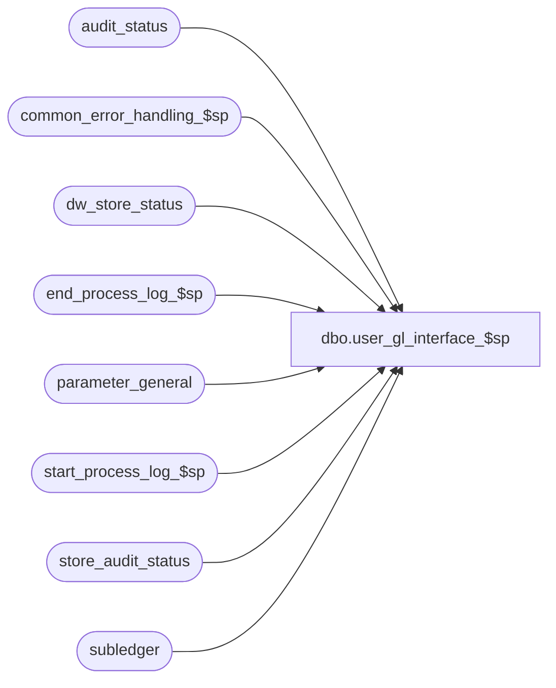

# dbo.user_gl_interface_$sp

**Database:** auditworks  
**Server:** bedrockdb01  

## Architecture Diagram



## Table Dependencies

| Referenced Table |
|---|
| audit_status |
| common_error_handling_$sp |
| dw_store_status |
| end_process_log_$sp |
| parameter_general |
| start_process_log_$sp |
| store_audit_status |
| subledger |

## Stored Procedure Code

```sql
create proc dbo.user_gl_interface_$sp 

  AS

/* Proc name:   user_gl_interface_$sp
** Description: Builds a custom gl interface from subledger table according a range of 
**      transaction dates, which is retrieved from parameter_general. 
** 		Called from period_end_$sp
**
***   OLD VERSION OF B A S E    P R O G R A M   ***

*** DO NOT USE ANYMORE FOR NEW SITES *** Use user_r3_gl_interface_$sp instead.

** THIS PROCEDURE IS A CUSTOM PROCEDURE. CONTENTS ARE DIFFERENT FROM ONE CLIENT 
** TO ANOTHER.
** WHEN CREATING THIS PROCEDURE FOR A CLIENT - SET THE APPL ON THE DEFECT SHEET
** TO SACUS.
**

HISTORY:
Date     Name        Def# Desc
May04,05 Sab	  DV-1254 Added new code to update dw_store_status set store_status = 3
May17,02 Paul     1-CD0IX added R3 error handling

*/

DECLARE
	@current_date 				smalldatetime,
	@errmsg 				varchar(255),
	@errno 					int,
	@journal_entry_description 		char(29),
	@last_date_closed 			smalldatetime,
	@period_end_date 			smalldatetime,	
	@process_log_entry 			bit,
	@process_no 				smallint,
	@process_timestamp 			float,
	@transaction_count 			numeric(12,0),
	@message_id				int,
	@object_name				varchar(255),
	@process_name				varchar(100),
	@operation_name				varchar(100)

SELECT @process_name = 'user_gl_interface_$sp',
	@message_id = 201068,
	@process_no = 205
	
SELECT
	@journal_entry_description = journal_entry_description
				    + ' '
				    + CONVERT (CHAR(8), getdate(), 1),
	@last_date_closed = last_date_closed,
	@period_end_date = period_end_date
FROM parameter_general

SELECT @errno = @@error
IF @errno != 0
  BEGIN
   SELECT @errmsg = 'Failed to select from parameter_general',
          @object_name = 'parameter_general',
          @operation_name = 'SELECT'
   GOTO error
  END

IF @last_date_closed > @period_end_date
  BEGIN
   SELECT @errno = 201510,
          @message_id = 201510,
          @errmsg = 'There were Invalid passing arguments passed to the store procedure'
   GOTO error
  END
ELSE
IF @last_date_closed = @period_end_date
	RETURN

SELECT @transaction_count = ( 	SELECT COUNT (*)
				FROM subledger 
			     WHERE transaction_date > @last_date_closed
			       AND transaction_date <= @period_end_date
			       AND posting_status = 0 )
SELECT @errno = @@error
IF @errno <> 0
  BEGIN
   SELECT @errmsg = 'Failed to select from subledger',
          @object_name = 'subledger',
          @operation_name = 'SELECT'
   GOTO error
  END

IF @transaction_count = 0
	RETURN

EXEC start_process_log_$sp @process_no, @process_timestamp OUTPUT, @errmsg OUTPUT

SELECT @errno = @@error
IF @errno <> 0
  BEGIN
   IF @errmsg IS NULL /* then */
     SELECT @errmsg = 'Failed to exec start_process_log_$sp'
   SELECT @object_name = 'start_process_log_$sp',
          @operation_name = 'EXECUTE'
   GOTO error
  END

SELECT @process_log_entry = 1

/********************************************************************************/
/**                                                                            **/
/**                                                                            **/
/**                                                                            **/
/**                          BODY OF CODE HERE                                 **/
/**                                                                            **/
/**                                                                            **/
/**                                                                            **/
/********************************************************************************/

/* Set subledger posting status to yes */
BEGIN TRAN  

  UPDATE subledger
    SET posting_status = 1
   WHERE posting_status = 0
     AND transaction_date BETWEEN @last_date_closed AND @period_end_date

  SELECT @errno = @@error
  IF @errno <> 0
    BEGIN
     SELECT @errmsg = 'Failed to update subledger',
          @object_name = 'subledger',
          @operation_name = 'UPDATE'
     GOTO error
    END

  UPDATE store_audit_status
    SET store_audit_status = 500,
	store_status_date = @current_date
   WHERE store_audit_status = 400
     AND sales_date BETWEEN @last_date_closed AND @period_end_date

  SELECT @errno = @@error
  IF @errno <> 0
    BEGIN
     SELECT @errmsg = 'Failed to update store_audit_status',
          @object_name = 'store_audit_status',
          @operation_name = 'UPDATE'
     GOTO error
    END

  UPDATE audit_status
    SET audit_status = 500,
	status_date = @current_date
   WHERE audit_status = 400
     AND sales_date BETWEEN @last_date_closed AND @period_end_date

  SELECT @errno = @@error
  IF @errno <> 0
    BEGIN
     SELECT @errmsg = 'Failed to update audit_status',
          @object_name = 'audit_status',
          @operation_name = 'UPDATE'
     GOTO error
    END

  UPDATE dw_store_status
     SET store_status = 3
   WHERE store_status = 2
     AND sales_date BETWEEN @last_date_closed AND @period_end_date

  SELECT @errno = @@error
  IF @errno <> 0
    BEGIN
	SELECT @errmsg = 'Unable to set store_status to 3 from 2',
	       @object_name = 'dw_store_status',
	       @operation_name = 'UPDATE'
	GOTO error
    END

/*  Set last_date_closed */

  UPDATE parameter_general
    SET last_date_closed = period_end_date

  SELECT @errno = @@error
  IF @errno <> 0
    BEGIN
     SELECT @errmsg = 'Failed to update parameter_general',
          @object_name = 'parameter_general',
          @operation_name = 'UPDATE'
     GOTO error
    END

COMMIT TRAN

IF @process_log_entry = 1
  BEGIN
   EXEC end_process_log_$sp @process_no, @process_timestamp, @transaction_count

   SELECT @errno = @@error
   IF @errno <> 0
     BEGIN
      SELECT @errmsg = 'Failed to exec end_process_log_$sp',
          @object_name = 'end_process_log_$sp',
          @operation_name = 'EXECUTE'
      GOTO error
     END

  END

RETURN

/* Common error handler */
error:  
	EXEC common_error_handling_$sp @process_no, @errno, @errmsg, 0, @message_id, 
	  @process_name, @object_name, @operation_name, 1, 1, 1, @process_timestamp, @transaction_count

	RETURN
```

