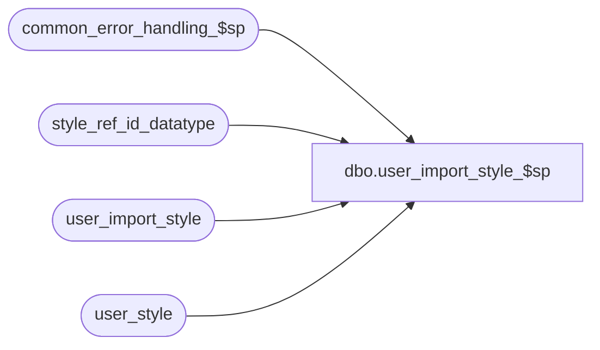

# dbo.user_import_style_$sp

**Database:** auditworks  
**Server:** bedrockdb01  

## Architecture Diagram



## Table Dependencies

| Referenced Table |
|---|
| common_error_handling_$sp |
| style_ref_id_datatype |
| user_import_style |
| user_style |

## Stored Procedure Code

```sql
create proc [dbo].[user_import_style_$sp] AS

/*
PROC NAME: user_import_style_$sp
     DESC: This program will post styles received from a client or 3rd party to the AW
           user_style table based on the I'nsert U'pdate D'elete R'eplacement_file 
           entry_type 
           Called by ICT_IMPORT smartload:  standard_import.ict

HISTORY:
DATE     NAME          Def# Description
Aug29,14 Phu          76995 Log duplicate entries.
Mar18,03 Phu           5425 Remove @errmsg from parameter list to standardize import
Dec09,02 Winnie     1-H56TW avoid raise error on business rule warning message
JUL29,02 Daphna     AW-8143 New Import layout including upc_lookup_division, style_short_description,
                            style_code, tax_item_group_id
Jun07,02 Winnie     1-CD0IX Standardize R3.5 error handling
May17,02 Paul       1-CD0IX added R3 error handling
Oct13,00 Henry         6875 Correction to code, when converting style_reference_id in @errmsg
Jul24,00 Maryam        6529 Populate the syle_short_description column.
Apr11,00 Daphna        6165 use of identity col in user_import table to handle insert/
                                update/deletes to same style_ref_id in the order they are 
                                in the import file
Mar01,00 Phu           5900 Change @@fetch_status > 0 to @@fetch_status <> 0 for MS SQL compatibility
Feb08,00 Maryam        5895 Check for invalid entry type, and trap duplicate rows on update. 
Oct07,99 Henry         5415 Default value on subclass_code when NULL
Mar01,99 Henry          n/a Oracle Port
Sep02,99 Vicci          n/a author

*/

DECLARE
  @errno		int,
  @errmsg		nvarchar(255),
  @duplicate_count	int,
  @open_cursor		int,
  @style_reference_id	style_ref_id_datatype,
  @import_id		numeric(12,0),
  @entry_type		nchar(1),
  @rows			int,
  @message_id		int,
  @object_name		nvarchar(255),
  @process_name		nvarchar(100),
  @process_no		smallint,
  @operation_name	nvarchar(100),
  @upc_lookup_division  tinyint,
  @log_flag             tinyint,
  @memo			nvarchar(50)

SELECT @process_name = 'user_import_style_$sp',
	@message_id = 201068,
        @open_cursor = 0,
        @process_no = 7,
        @rows = 0,
        @log_flag = 1, -- called by smartload
        @duplicate_count = 0
  
IF EXISTS(SELECT entry_type 
	    FROM user_import_style
	   WHERE UPPER(entry_type) NOT IN ('I', 'R', 'D', 'U'))
BEGIN
  SELECT @errmsg =
   'An invalid entry-type was encountered in the import file. Please verify the |1 table and import data file.'
  EXEC common_error_handling_$sp @process_no, 201735, @errmsg, 3, 201735, 
	@process_name, 'user_import_style', NULL, @log_flag, 1, 0, NULL, 0, 'user_import_style'
END
      
IF EXISTS(SELECT 1
            FROM user_import_style
           WHERE UPPER(entry_type) = 'R')
  TRUNCATE table user_style

SELECT @errno = @@error
IF @errno != 0
BEGIN
  SELECT @errmsg = 'Failed to truncate table user_style',
         @object_name = 'user_style',
         @operation_name = 'TRUNCATE'
   GOTO error
END

UPDATE user_import_style
SET upc_lookup_division = 1
WHERE upc_lookup_division IS NULL /* */
SELECT @errno = @@error
IF @errno != 0
BEGIN
  SELECT @errmsg = 'SET upc_lookup_division = 1 when NULL',
         @object_name = 'user_import_style',
         @operation_name = 'UPDATE'
   GOTO error
END

UPDATE user_import_style
SET style_short_description = SUBSTRING(style_long_description,1,20)
WHERE style_short_description IS NULL /* */
SELECT @errno = @@error
IF @errno != 0
BEGIN
  SELECT @errmsg = 'SET upc_lookup_division = 1 when NULL',
         @object_name = 'user_import_style',
         @operation_name = 'UPDATE'
   GOTO error
END

/* find occurences of same style_reg_id inserted/updated/deleted more than once in import file */

DECLARE dup_style_crsr CURSOR
FOR SELECT style_reference_id, upc_lookup_division
      FROM user_import_style
    GROUP BY style_reference_id, upc_lookup_division
    HAVING COUNT(*) > 1

OPEN dup_style_crsr
SELECT @errno = @@error
IF @errno != 0 
BEGIN
  SELECT @errmsg = 'Failed to open dup_style_crsr',
         @object_name = 'dup_style_crsr',
         @operation_name = 'OPEN'
  GOTO error
END

SELECT @open_cursor = 1

WHILE 1=1
BEGIN
  FETCH dup_style_crsr
   INTO @style_reference_id, @upc_lookup_division

  IF @@fetch_status <> 0    /* if eof, then exit */
    BREAK
  
  DECLARE dup_row_crsr CURSOR
  FOR SELECT import_id, entry_type
        FROM user_import_style
       WHERE style_reference_id = @style_reference_id  
       AND upc_lookup_division = @upc_lookup_division
      ORDER BY import_id
      
  OPEN dup_row_crsr
  SELECT @errno = @@error
  IF @errno != 0 
  BEGIN
    SELECT @errmsg = 'Failed to open dup_row_crsr',
         @object_name = 'dup_row_crsr',
         @operation_name = 'OPEN'
    GOTO error
  END

  SELECT @open_cursor = 2, -- both cursors open
         @duplicate_count = @duplicate_count + 1

  WHILE 2=2
  BEGIN
    FETCH dup_row_crsr
     INTO @import_id, @entry_type

    IF @@fetch_status <> 0    /* if eof, then exit */
      BREAK

    IF @entry_type IN ('I','U')
    BEGIN
      UPDATE user_style
         SET style_long_description = bcp.style_long_description,
             class_code = ISNULL(bcp.class_code,0), 
   	     cost = bcp.cost, 
   	     subclass_code = ISNULL(bcp.subclass_code,0),
   	     style_short_description = bcp.style_short_description,
             style_code = bcp.style_code, 
             tax_item_group_id = bcp.tax_item_group_id
        FROM user_import_style bcp, user_style s
       WHERE bcp.style_reference_id = s.style_reference_id
         AND bcp.upc_lookup_division = s.upc_lookup_division
         AND bcp.import_id = @import_id

      SELECT @errno = @@error,
             @rows = @@rowcount
      IF @errno != 0
      BEGIN
        SELECT @errmsg = 'Failed to update user_style (dup_row_crsr)',
           @object_name = 'user_style',
           @operation_name = 'UPDATE'
        GOTO error
      END

      IF @rows = 0  -- no rows updated 
      BEGIN 
        INSERT user_style (
	       style_reference_id,
               style_long_description,
               class_code,
               cost,
               subclass_code,
               style_short_description,
               upc_lookup_division,
               style_code, 
               tax_item_group_id)
        SELECT style_reference_id,
	       style_long_description,
	       ISNULL(class_code,0),
	       cost,
	       ISNULL(subclass_code,0),
	       style_short_description,
	       upc_lookup_division,
               style_code, 
               tax_item_group_id	       
          FROM user_import_style
         WHERE import_id = @import_id

        SELECT @errno = @@error
        IF @errno != 0
        BEGIN
          SELECT @errmsg = 'Failed to insert user_style (dup_row_crsr)',
             @object_name = 'user_style',
             @operation_name = 'INSERT'
          GOTO error
        END
      END /* @rows = 0: no rows updated  */
    END  /*  @entry_type IN ('I','U')*/
    ELSE  /*  @entry_type NOT IN ('I','U')*/
    BEGIN
      IF @entry_type = 'D'
      BEGIN
        DELETE user_style
          FROM user_import_style bcp, user_style s
         WHERE bcp.style_reference_id = s.style_reference_id 
         AND bcp.upc_lookup_division = s.upc_lookup_division
         AND UPPER(bcp.entry_type) = 'D'
         AND bcp.import_id = @import_id
	
        SELECT @errno = @@error
        IF @errno != 0
        BEGIN
          SELECT @errmsg = 'Failed to delete user_style (dup_row_crsr)',
             @object_name = 'user_style',
             @operation_name = 'DELETE'
          GOTO error
        END
      END /* @entry_type = 'D' */
    END  /*  @entry_type NOT IN ('I','U')*/
  END /* While 2=2 */

  CLOSE dup_row_crsr
  DEALLOCATE dup_row_crsr
  SELECT @open_cursor = 1 -- only one cursor open

  SELECT @errmsg = 'Multiple entries for the same key were imported. Please verify key |1 in the |2 table.',
         @memo = convert(nvarchar, @style_reference_id)

  IF @duplicate_count <= 50
  BEGIN
    PRINT ':LOG EXECWARN: ' + REPLACE(REPLACE(@errmsg, '|1', @memo), '|2', 'user_import_style')
  END
  ELSE IF @duplicate_count = 51
  BEGIN
    PRINT ':LOG EXECWARN: ' + 'Due to output buffer size, only 50 duplicate entries are listed. Please see process_error_log table for all duplicates.'
  END

  EXEC common_error_handling_$sp @process_no, 201736, @errmsg, 3, 201736, 
	@process_name, 'user_import_style', NULL, @log_flag, 1, 0, NULL, 0, 
	@memo, 'user_import_style'
 
  DELETE user_import_style
   WHERE style_reference_id = @style_reference_id
   AND upc_lookup_division = @upc_lookup_division

  SELECT @errno = @@error
  IF @errno != 0
  BEGIN
    SELECT @errmsg = 'Failed to delete user_import_style (dup_row_crsr)',
             @object_name = 'user_import_style',
             @operation_name = 'DELETE'
    GOTO error
  END
  
END /* While 1=1 */

CLOSE dup_style_crsr
DEALLOCATE dup_style_crsr 
SELECT @open_cursor = 0 -- all cursors closed 

/* remaining entries in user_import_style are one per style_reference_id */

UPDATE user_import_style
   SET entry_type = 'I'
 WHERE UPPER(entry_type) = 'U'

SELECT @errno = @@error
IF @errno != 0
BEGIN
  SELECT @errmsg = 'Failed to update user_import_style to insert',
         @object_name = 'user_import_style',
         @operation_name = 'UPDATE'
   GOTO error
END

UPDATE user_import_style
   SET entry_type = 'U'
  FROM user_import_style uis,
       user_style us
 WHERE uis.style_reference_id = us.style_reference_id
 AND uis.upc_lookup_division = us.upc_lookup_division
 AND UPPER(entry_type) = 'I'

SELECT @errno = @@error
IF @errno != 0
BEGIN
  SELECT @errmsg = 'Failed to update user_import_style to update',
         @object_name = 'user_import_style',
         @operation_name = 'UPDATE'
  GOTO error
END

/* mass insert */

INSERT user_style (
       style_reference_id,
       style_long_description,
       class_code,
       cost,
       subclass_code,
       style_short_description,
       upc_lookup_division,
       style_code, 
       tax_item_group_id       
       )
SELECT style_reference_id,
       style_long_description,
       ISNULL(class_code,0),
       cost,
       ISNULL(subclass_code,0),
       style_short_description,
       upc_lookup_division,
       style_code,
       tax_item_group_id
  FROM user_import_style
 WHERE UPPER(entry_type) IN ('I','R')

SELECT @errno = @@error
IF @errno != 0
BEGIN
  SELECT @errmsg = 'Failed to mass insert user_style',
         @object_name = 'user_style',
         @operation_name = 'INSERT'
  GOTO error
END

 
/* mass update */ 

UPDATE user_style
   SET 	style_long_description = bcp.style_long_description,
        class_code = ISNULL(bcp.class_code,0), 
   	cost = bcp.cost, 
   	subclass_code = ISNULL(bcp.subclass_code,0),
   	style_short_description = bcp.style_short_description,
        style_code = bcp.style_code, 
        tax_item_group_id = bcp.tax_item_group_id
  FROM user_import_style bcp, user_style s
 WHERE bcp.style_reference_id = s.style_reference_id 
 AND bcp.upc_lookup_division = s.upc_lookup_division
 AND UPPER(bcp.entry_type) = 'U'

SELECT @errno = @@error
IF @errno != 0
BEGIN
  SELECT @errmsg = 'Failed to mass update user_style',
         @object_name = 'user_style',
         @operation_name = 'UPDATE'
  GOTO error
END

/* mass delete*/ 

DELETE user_style
  FROM  user_import_style bcp, user_style s
 WHERE bcp.style_reference_id = s.style_reference_id 
 AND bcp.upc_lookup_division = s.upc_lookup_division
 and UPPER(bcp.entry_type) = 'D'
	
SELECT @errno = @@error
IF @errno != 0
BEGIN
  SELECT @errmsg = 'Failed to mass delete user_style',
         @object_name = 'user_style',
         @operation_name = 'DELETE'
  GOTO error
END

RETURN

error:   /* Common error handler. */

	IF @open_cursor = 1
	BEGIN
	  CLOSE dup_style_crsr
	  DEALLOCATE dup_style_crsr
	END
	
	IF @open_cursor = 2
	BEGIN
  	  CLOSE dup_style_crsr
	  DEALLOCATE dup_style_crsr
	  CLOSE dup_row_crsr
	  DEALLOCATE dup_row_crsr
	END
	
	EXEC common_error_handling_$sp @process_no, @errno, @errmsg, 0, @message_id, 
	  @process_name, @object_name, @operation_name, @log_flag
	RETURN
```

