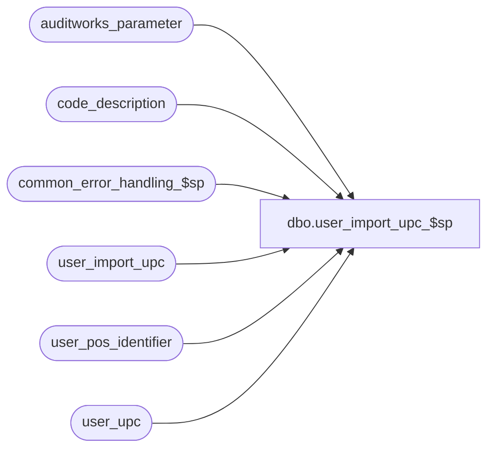

# dbo.user_import_upc_$sp

**Database:** auditworks  
**Server:** bedrockdb01  

## Architecture Diagram



## Table Dependencies

| Referenced Table |
|---|
| auditworks_parameter |
| code_description |
| common_error_handling_$sp |
| user_import_upc |
| user_pos_identifier |
| user_upc |

## Stored Procedure Code

```sql
create proc dbo.user_import_upc_$sp AS
/* 
PROC NAME:  user_import_upc_$sp
     DESC: This program will post UPCs and/or SKU_IDs and/or POS_IDENTIFIERS
           received from a client or 3rd party to the AW user_upc table
           based on the I'nsert U'pdate D'elete R'eplacement_file entry_type.
           If no UPC is given it will be set to the SKU_ID or if that is not provided
           either a UPC will be sequentially assigned.
           If no SKU_ID is given it will be set to the UPC.
           If no POS_IDENTIFIER is given it will be set to the UPC with a POS_IDENTIFIER_TYPE of 0
           Called by ICT_IMPORT smartload: standard_import.ict
HISTORY:
Date     Name		Def# Desc
Jan20,14 Phu        1-4C4WJO Make sure that all attributes such as tax_item_group_id, color, size, etc. are the same for each upc_lookup_division-sku_id.
Sep27,13 Vicci        146826 Take pos_identifier_type into account when more than 1 has been defined, and support SQL 2012.
May10,11 Vicci      1-46FEEP Correct validation that upc being deleted doesn't exist in user_pos_identifier and that
                             upc/pos identifier cross reference being inserted doesn't already exist (badly coded from a performance perspective).
                             Correct updating of user_pos_identifier (ensure same pos ID doesn't point to more than 1 upc).
Nov13,02 Maryam      1-G4Q91 New Import layout including tax_item_group_id 
JUL29,02 Daphna      AW-8143 New Import layout including upc_lookup_division, color_code,
                             color_short_description, prim_size_label, sec_size_label,
                             size_master_id
Jun07,02 Winnie      1-CD0IX Standardize R3.5 error handling
May17,02 Paul        1-CD0IX added R3 error handling
Feb26,01 Phu            7371 Change double quotes to single quotes for MS SQL compatibility
Jan22,01 Winnie         7202 Support multiple POS identifier for a single upc number.
Aug25,00 Paul           6675 Add not null check to dup_row_cursor, capitalize keywords
Aug04,00 Vicci          6538 Remove truncate of table and treat R as U/I.
May04,00 Louise M       6292 Close cursor commands had the wrong cursor name.
Apr11,00 Daphna         6165 use of identity col in user_import table to handle
 			       insert/update/deletes to same upc_no in the 
			       order they are in import file
Mar01,00 Phu            5900 Change @@fetch_status > 0 to @@fetch_status <> 0 for MS SQL compatibility
Feb08,00 Maryam         5895 Check for invalid entry type, and trap duplicate rows on update.
Jun04,99 Henry Wu       4843 file not loading completely when upc_no = NULL
Mar01,99 Henry           n/a Verification of data
Sep02,98 Vicci           n/a creation

*/

DECLARE
  @errno			int,
  @errmsg		        nvarchar(2000),
  @max_upc_no			numeric(14,0),
  @open_cursor  		int,
  @upc_no			numeric(20,0),
  @upc_identifier_exist         numeric(1,0),
  @i_multiple_pos_id_per_upc 	numeric(1,0),
  @import_id    		numeric(12,0),
  @entry_type   		nchar(1),
  @rows				int,
  @message_id			int,
  @object_name			nvarchar(255),
  @process_name			nvarchar(100),
  @process_no			smallint,
  @operation_name		nvarchar(100),
  @upc_lookup_division          tinyint,
  @log_flag			tinyint,
  @memo				nvarchar(50),
  @errmsg2			nvarchar(2000),
  @multiple_pos_id_types_exist	tinyint;

  
SELECT @process_name = 'user_import_upc_$sp',
       @message_id = 201068,
       @open_cursor = 0,
       @process_no = 7,
       @i_multiple_pos_id_per_upc = 0,
       @log_flag = 1,  -- called by smartload
       @operation_name ='SELECT';

BEGIN TRY

SELECT @errmsg = 'Failed to determine if multiple POS Identifier Types have been defined. ',
       @object_name = 'code_description';
SELECT @multiple_pos_id_types_exist = CASE WHEN COUNT(1) > 1 THEN 1 ELSE 0 END
  FROM code_description
 WHERE code_type = 68
   AND code > 0  --(don't count the 'please log what has been given in the pos_identifier field to the upc_no field instead' request)
   AND code <> 100  --(C/L ref# reassignment)
   AND active_flag = 1;
  
SELECT @errmsg = 'Failed to determine if multiple POS Identifiers per UPC are supported. ',
       @object_name = 'auditworks_parameter';
IF (SELECT CONVERT(INT,par_value)
      FROM auditworks_parameter
     WHERE par_name = 'multiple_pos_id_per_upc') = 1
  SELECT @i_multiple_pos_id_per_upc = 1;
   
SELECT @errmsg = 'Failed to determine if invalid user_import_upc entry_types exist. ',
       @object_name = 'user_import_upc';
IF EXISTS(SELECT entry_type 
	    FROM user_import_upc
	   WHERE UPPER(entry_type) NOT IN ('I', 'R', 'D', 'U'))
BEGIN
  SELECT @errmsg ='An invalid entry-type was encountered in the import file. Please verify the |1 table and import data file.'
  EXEC common_error_handling_$sp @process_no, 201735, @errmsg, 3, 201735, @process_name, 'user_import_upc', NULL, @log_flag, 1, 0, NULL, 0, 'user_import_upc'
END
      
/*  The user may provide an import file with upc_no, sku_id, or 
    pos_identifier or any combination of the 3 */

SELECT @errmsg = 'Failed to determine if entry with no item identification exists. ',
       @object_name = 'user_import_upc';
IF EXISTS(SELECT entry_type
            FROM user_import_upc
           WHERE upc_no IS NULL AND sku_id IS NULL AND pos_identifier IS NULL)
BEGIN
  SELECT @errno = 201742,
         @errmsg = 'Import aborted:  Invalid upc import entries with no upc_no nor sku_id nor pos_identifier detected. ';
  GOTO business_rule_error;
END

/*  If no upc_no is provided the system will use the sku_id as the upc_no 
    assuming a sku_id is given */
SELECT @errmsg = 'Failed to determine if entry with no UPC exists. ';
IF EXISTS (SELECT entry_type
            FROM user_import_upc
           WHERE upc_no IS NULL)
BEGIN
  SELECT @errmsg = 'Failed to set user_import_upc upc_no to sku_id where upc_no missing but sku_id provided. ',
         @object_name = 'user_import_upc',
         @operation_name = 'UPDATE';
  UPDATE user_import_upc
     SET upc_no = sku_id
   WHERE upc_no IS NULL 
     AND sku_id IS NOT NULL; 

/* If neither a upc_no nor a sku_id are given, then look up what dummy
   upc_no was assigned to the pos_identifier when originally created */
  SELECT @errmsg = 'Failed to set user_import_upc upc_no from user_upc. ';
  UPDATE user_import_upc
     SET upc_no = u.upc_no
    FROM user_import_upc bcp, user_upc u
   WHERE bcp.upc_no IS NULL /* */
     AND bcp.pos_identifier_type = u.pos_identifier_type
     AND bcp.pos_identifier = u.pos_identifier;

  IF @i_multiple_pos_id_per_upc = 1
  BEGIN
    SELECT @errmsg = 'Failed to set user_import_upc upc_no from user_pos_identifier. ';
    UPDATE user_import_upc
       SET upc_no = u.upc_no
      FROM user_import_upc bcp, user_pos_identifier u
     WHERE bcp.upc_no IS NULL /* */
       AND bcp.pos_identifier_type = u.pos_identifier_type
       AND bcp.pos_identifier = u.pos_identifier;
  END;
  
  SELECT @errmsg = 'Failed to select max_upc_no. ',
         @object_name = 'user_upc',
         @operation_name = 'SELECT';
  SELECT @max_upc_no = MAX(upc_no)
    FROM user_upc;

  SELECT @errmsg = 'Failed to create temp table #dummy_upc. ',
         @object_name = '#dummy_upc',
         @operation_name = 'CREATE';
  CREATE TABLE #dummy_upc (
         pos_identifier nvarchar(20) not null,
         pos_identifier_type tinyint not null,
         upc_base numeric(14,0) identity not null);

  SELECT @errmsg = 'Failed to list of identifiers requiring dummy upc generation. ',
         @object_name = '#dummy_upc',
         @operation_name = 'INSERT';
  INSERT #dummy_upc(pos_identifier, pos_identifier_type)
  SELECT DISTINCT pos_identifier, pos_identifier_type
    FROM user_import_upc
   WHERE upc_no IS NULL; 

  IF @max_upc_no IS NULL /* then */
    SELECT @max_upc_no = 0;

  SELECT @errmsg = 'Failed to assign dummy upc_no to user_import_upc Inserts Replacements with missing upc_no. ',
         @object_name = 'user_import_upc',
         @operation_name = 'UPDATE';
  UPDATE user_import_upc
     SET upc_no = d.upc_base + @max_upc_no
    FROM #dummy_upc d, user_import_upc bcp
   WHERE bcp.upc_no IS NULL  /* */
     AND bcp.pos_identifier_type = d.pos_identifier_type 
     AND bcp.pos_identifier = d.pos_identifier;
END;  /* EXISTS user_import_upc where upc_no IS NULL */

  /* If no pos_identifier is provided, use the upc_no as the pos_identifier */

SELECT @errmsg = 'Failed to assign dummy upc_no to user_import_upc Inserts Replacements with missing upc_no. ';
UPDATE user_import_upc
   SET pos_identifier = CONVERT(nvarchar(20), upc_no),
       pos_identifier_type = 0 
 WHERE pos_identifier IS NULL; --

  /* If no sku_id is provided, use the upc_no as the sku_id */
SELECT @errmsg = 'Failed to set missing sku_id. ';
UPDATE user_import_upc
   SET sku_id = upc_no
 WHERE sku_id IS NULL; /*  */ 

SELECT @errmsg = 'Failed to set upc_lookup_division = 1 when NULL. ';
UPDATE user_import_upc
   SET upc_lookup_division = 1
 WHERE upc_lookup_division IS NULL; 

-- All attributes must be the same for each upc_lookup_division-sku_id.
SELECT @errmsg = 'Failed to create empty temporary table.',
       @object_name = '#dup_sku',
       @operation_name = 'SELECT_INTO';

SELECT style_reference_id AS max_import_id,
upc_lookup_division, sku_id,
style_reference_id, color_code, color_short_description, prim_size_label, sec_size_label, size_master_id, tax_item_group_id
INTO #dup_sku
FROM user_import_upc
WHERE upc_no = -1;

-- need to specify style_reference_id in the insert SQL because it's not null.
SELECT @errmsg = 'Failed to determine whether the import file has duplicate upc_lookup_division-sku_id or not.',
       @object_name = '#dup_sku',
       @operation_name = 'INSERT';

INSERT INTO #dup_sku (max_import_id, upc_lookup_division, sku_id, style_reference_id)
SELECT MAX(import_id), upc_lookup_division, sku_id, (style_reference_id * 0)
FROM user_import_upc
WHERE UPPER(entry_type) <> 'D'
GROUP BY upc_lookup_division, sku_id, (style_reference_id * 0)
HAVING COUNT(import_id) > 1;

IF EXISTS (SELECT 1 FROM #dup_sku where max_import_id IS NOT NULL)
BEGIN

  SELECT @errmsg = 'Failed to set attributes for duplicate upc_lookup_division-sku_id (1).',
         @object_name = '#dup_sku',
         @operation_name = 'UPDATE';
  UPDATE #dup_sku
  SET style_reference_id = i.style_reference_id,
      color_code = i.color_code,
      color_short_description = i.color_short_description,
      prim_size_label = i.prim_size_label,
      sec_size_label = i.sec_size_label,
      size_master_id = i.size_master_id,
      tax_item_group_id = i.tax_item_group_id
  FROM #dup_sku d, user_import_upc i
  WHERE i.upc_lookup_division = d.upc_lookup_division
  AND i.sku_id = d.sku_id
  AND i.import_id = d.max_import_id;

  SELECT @errmsg = 'Failed to set attributes for duplicate upc_lookup_division-sku_id (2).',
         @object_name = 'user_import_upc',
         @operation_name = 'UPDATE';
  UPDATE user_import_upc
  SET style_reference_id = d.style_reference_id,
      color_code = d.color_code,
      color_short_description = d.color_short_description,
      prim_size_label = d.prim_size_label,
      sec_size_label = d.sec_size_label,
      size_master_id = d.size_master_id,
      tax_item_group_id = d.tax_item_group_id
  FROM user_import_upc i, #dup_sku d
  WHERE i.upc_lookup_division = d.upc_lookup_division
  AND i.sku_id = d.sku_id
  AND i.import_id <> d.max_import_id;

END;


/* find occurences of same upc_no being inserted/updated/deleted more than once in import file */
SELECT @errmsg = 'Failed to define dup_upc_crsr. ',
       @object_name = 'dup_upc_crsr',
       @operation_name = 'OPEN';
DECLARE dup_upc_crsr CURSOR
    FOR 
 SELECT upc_no, upc_lookup_division
   FROM user_import_upc
  WHERE upc_no IS NOT NULL /* */
  GROUP BY upc_no, upc_lookup_division
 HAVING COUNT(upc_no) > 1;
 
SELECT @operation_name = 'OPEN';
OPEN dup_upc_crsr;
SELECT @open_cursor = 1;

WHILE 1=1
BEGIN
  SELECT @errmsg = 'Failed to define dup_upc_crsr. ',
         @object_name = 'dup_upc_crsr',
         @operation_name = 'FETCH';
  FETCH dup_upc_crsr
   INTO @upc_no, @upc_lookup_division;

  IF @@fetch_status <> 0    /* if eof, then exit */
    BREAK;
 
  SELECT @errmsg = 'Failed to define dup_row_crsr. ',
         @object_name = 'dup_row_crsr',
         @operation_name = 'DECLARE';
  DECLARE dup_row_crsr CURSOR
      FOR 
   SELECT import_id, entry_type
     FROM user_import_upc
    WHERE upc_no = @upc_no
      AND  upc_lookup_division = @upc_lookup_division
    ORDER BY import_id;

  SELECT @operation_name = 'OPEN';
  OPEN dup_row_crsr;
  SELECT @open_cursor = 2; -- both cursors open

  WHILE  2=2
  BEGIN
    SELECT @operation_name = 'FETCH';
    FETCH dup_row_crsr
     INTO @import_id, @entry_type; 

    IF @@fetch_status <> 0    /* if eof, then exit */
      BREAK;

    IF @i_multiple_pos_id_per_upc = 0
    BEGIN
      IF @entry_type IN ('I','U', 'R')
      BEGIN
        SELECT @errmsg = 'Failed update user_upc (dup_row_crsr). ',
               @object_name = 'user_upc',
               @operation_name = 'UPDATE';
        UPDATE user_upc
           SET sku_id = bcp.sku_id,
               pos_identifier = bcp.pos_identifier,
               pos_identifier_type = bcp.pos_identifier_type,
               style_reference_id = bcp.style_reference_id, 
               color_code = bcp.color_code,
               color_short_description = bcp.color_short_description, 
               prim_size_label = bcp.prim_size_label, 
               sec_size_label = bcp.sec_size_label,
               size_master_id = bcp.size_master_id,
               tax_item_group_id = bcp.tax_item_group_id            
          FROM user_import_upc bcp, user_upc u
         WHERE bcp.upc_no = u.upc_no
           AND bcp.import_id = @import_id
           AND bcp.upc_lookup_division = u.upc_lookup_division;
        SELECT @rows = @@rowcount;
      
        IF @rows = 0  -- no rows updated 
        BEGIN
          SELECT @errmsg = 'Failed update user_upc (dup_row_crsr). ',
                 @object_name = 'user_upc',
                 @operation_name = 'INSERT';
          INSERT user_upc (
  	         upc_lookup_division,
	         upc_no,
	         sku_id,
	         pos_identifier,
	         pos_identifier_type,
	         style_reference_id,
	         color_code,
	         color_short_description, 
	         prim_size_label, 
	         sec_size_label,
	         size_master_id,
	         tax_item_group_id)
          SELECT upc_lookup_division,
                 upc_no,
                 sku_id,
                 pos_identifier,
                 pos_identifier_type,
                 style_reference_id,
                 color_code,
                 color_short_description, 
                 prim_size_label, 
                 sec_size_label,
                 size_master_id,
                 tax_item_group_id
            FROM user_import_upc
           WHERE import_id = @import_id;
        END; /* @rows = 0: no rows updated */     
            
      END;  /* @entry_type IN ('I','U', 'R') */
      ELSE /* @entry_type NOT IN ('I','U', 'R') */
      BEGIN
        IF @entry_type = 'D'
        BEGIN 
          SELECT @errmsg = 'Failed to delete user_upc (dup_row_crsr). ',
                 @object_name = 'user_upc',
                 @operation_name = 'DELETE';
          DELETE user_upc
            FROM user_import_upc bcp, user_upc u
           WHERE bcp.upc_no = u.upc_no
    	     AND bcp.import_id = @import_id
  	     AND bcp.upc_lookup_division= u.upc_lookup_division; 
        END; /* @entry_type = 'D' */
      END;  /* @entry_type NOT IN ('I','U', 'R') */
    END;  /* @i_multiple_pos_id_per_upc  = 0 */   
    ELSE
    BEGIN 
      SELECT @upc_identifier_exist = 0;
      SELECT @errmsg = 'Failed to determine if any user_pos_identier entries for the dup exist. ',
             @object_name = 'user_pos_identifier',
             @operation_name = 'SELECT';
      IF EXISTS (SELECT upi.upc_no
                   FROM user_pos_identifier upi, user_import_upc uiu
                  WHERE upi.pos_identifier = uiu.pos_identifier
                    AND (upi.pos_identifier_type = uiu.pos_identifier_type OR @multiple_pos_id_types_exist = 0) 
                    AND import_id = @import_id
                    AND upi.upc_lookup_division = uiu.upc_lookup_division)
        SELECT @upc_identifier_exist = 1;
                                            
      IF @entry_type IN ('I','U', 'R')
      BEGIN
        SELECT @errmsg = 'Failed to update user_upc (dup_row_crsr2). ',
               @object_name = 'user_upc',
               @operation_name = 'UPDATE';
        UPDATE user_upc
           SET sku_id = bcp.sku_id,
               pos_identifier = bcp.pos_identifier,
               pos_identifier_type = bcp.pos_identifier_type,
               style_reference_id = bcp.style_reference_id,
               color_code = bcp.color_code,
               color_short_description = bcp.color_short_description, 
               prim_size_label = bcp.prim_size_label, 
               sec_size_label = bcp.sec_size_label,
               size_master_id = bcp.size_master_id,
               tax_item_group_id = bcp.tax_item_group_id             
          FROM user_import_upc bcp, user_upc u
         WHERE bcp.upc_no = u.upc_no
           AND bcp.import_id = @import_id
           AND bcp.upc_lookup_division = u.upc_lookup_division;
        SELECT @rows = @@rowcount;
  
        IF @rows = 0  -- no rows updated 
        BEGIN
          SELECT @errmsg = 'Failed to insert user_upc (dup_row_crsr2). ',
                 @object_name = 'user_upc',
                 @operation_name = 'INSERT';
          INSERT user_upc (
 	 	 upc_lookup_division,
		 upc_no,
		 sku_id,
		 pos_identifier,
		 pos_identifier_type,
		 style_reference_id,
		 color_code,
                 color_short_description, 
                 prim_size_label, 
                 sec_size_label,
                 size_master_id,
                 tax_item_group_id)
          SELECT upc_lookup_division,
         	 upc_no,
		 sku_id,
		 pos_identifier,
		 pos_identifier_type,
		 style_reference_id,
		 color_code,
                 color_short_description, 
                 prim_size_label, 
                 sec_size_label,
                 size_master_id,
                 tax_item_group_id
            FROM user_import_upc
           WHERE import_id = @import_id;
        END; /* @rows = 0: no rows updated */       

        IF @upc_identifier_exist = 0
        BEGIN
           SELECT @errmsg = 'Failed to insert user_pos_identifier (dup_row_crsr). ',
                  @object_name = 'user_pos_identifier',
                  @operation_name = 'INSERT';
           INSERT user_pos_identifier(
                  pos_identifier,
                  upc_no,
                  upc_lookup_division,
                  pos_identifier_type)
           SELECT pos_identifier,
                  upc_no,
                  upc_lookup_division,
                  pos_identifier_type
             FROM user_import_upc
            WHERE import_id = @import_id;
        END; /* @upc_identifier_exist = 0 */       
      END; /* @entry_type IN ('I','U','R') */                 
      ELSE  --ELSE of IF @upc_identifier_exist = 0
      BEGIN
        IF @entry_type ='D' 
        BEGIN
          SELECT @errmsg = 'Failed to DELETE user_pos_identifier (dup_row_crsr). ',
                 @object_name = 'user_pos_identifier',
                 @operation_name = 'DELETE';
          DELETE user_pos_identifier
            FROM user_import_upc uiu, user_pos_identifier upi
           WHERE uiu.upc_no = upi.upc_no
             AND uiu.pos_identifier = upi.pos_identifier
             AND (upi.pos_identifier_type = uiu.pos_identifier_type OR @multiple_pos_id_types_exist = 0)
             AND uiu.import_id = @import_id
             AND uiu.upc_lookup_division = upi.upc_lookup_division;
          
          SELECT @errmsg = 'Failed to DELETE user_upc (dup_row_crsr). ',
                 @object_name = 'user_upc',
                 @operation_name = 'DELETE';
          DELETE user_upc 
           WHERE upc_no = @upc_no
             AND upc_no NOT IN (SELECT upc_no 
                                  FROM user_pos_identifier
                                 WHERE upc_lookup_division = @upc_lookup_division
                                   AND upc_no = @upc_no)
             AND upc_lookup_division = @upc_lookup_division;
        END /* @entry_type ='D' */  
        ELSE
        BEGIN
          SELECT @errmsg = 'Failed to UPDATE user_pos_identifier (dup_row_crsr). ',
                 @object_name = 'user_pos_identifier',
                 @operation_name = 'UPDATE';
          UPDATE user_pos_identifier
             SET upc_no = i.upc_no
            FROM user_import_upc i
           WHERE i.import_id = @import_id
             AND i.pos_identifier = user_pos_identifier.pos_identifier
             AND (i.pos_identifier_type = user_pos_identifier.pos_identifier_type OR @multiple_pos_id_types_exist = 0)
             AND i.upc_lookup_division = user_pos_identifier.upc_lookup_division;
        END; --ELSE of IF @entry_type ='D'
      END;  --ELSE of IF @upc_identifier_exist = 0
    END; --ELSE of IF @i_multiple_pos_id_per_upc = 0 
  END; /* While 2=2 */

  SELECT @errmsg = 'Failed to close and deallocate dup_row_crsr. ',
         @object_name = 'dup_row_crsr',
         @operation_name = 'CLOSE';
  CLOSE dup_row_crsr;
  SELECT @operation_name = 'DEALLOCATE';
  DEALLOCATE dup_row_crsr;
  SELECT @open_cursor = 1;  -- only one cursor open

  IF @i_multiple_pos_id_per_upc = 0
  BEGIN
    SELECT @errmsg = 'Multiple entries for the same key were imported. Please verify key |1 in the |2 table.',
           @memo = convert(nvarchar, @upc_no),
           @object_name = 'user_import_upc',
           @operation_name = 'SELECT';
    EXEC common_error_handling_$sp @process_no, 201736, @errmsg, 3, 201736, @process_name, 'user_import_upc', 
                                   NULL, @log_flag, 1, 0, NULL, 0, @memo, 'user_upc';
  END;
  
  SELECT @errmsg = 'Failed to delete user_import_upc (dup_row_crsr). ',
         @object_name = 'user_import_upc',
         @operation_name = 'DELETE';
  DELETE user_import_upc
   WHERE upc_no = @upc_no
   AND upc_lookup_division = @upc_lookup_division;
END; /* While 1=1 */

SELECT @errmsg = 'Failed to close and deallocate dup_upc_crsr. ',
       @object_name = 'dup_upc_crsr',
       @operation_name = 'CLOSE';
CLOSE dup_upc_crsr;
SELECT @operation_name = 'DEALLOCATE';
DEALLOCATE dup_upc_crsr; 
SELECT @open_cursor = 0;  -- all cursors closed 

/* remaining entries in user_import_upc are one per upc_no */

SELECT @errmsg = 'Failed to update user_import_upc to insert. ',
       @object_name = 'user_import_upc',
       @operation_name = 'UPDATE';
UPDATE user_import_upc
   SET entry_type = 'I'
 WHERE UPPER(entry_type) IN ('R', 'U');

SELECT @errmsg = 'Failed to update user_import_upc to u=update. ';
UPDATE user_import_upc
   SET entry_type = 'U'
  FROM user_import_upc uiu,
       user_upc uu
 WHERE uiu.upc_no = uu.upc_no
   AND UPPER(entry_type) = 'I'
   AND uiu.upc_lookup_division = uu.upc_lookup_division;

/* mass update */

SELECT @rows =0;

SELECT @errmsg = 'Failed to set attributes for upc_lookup_division-sku_id.',
       @object_name = 'user_upc',
       @operation_name = 'UPDATE';
UPDATE user_upc
SET style_reference_id = bcp.style_reference_id,
    color_code = bcp.color_code,
    color_short_description = bcp.color_short_description,
    prim_size_label = bcp.prim_size_label,
    sec_size_label = bcp.sec_size_label,
    size_master_id = bcp.size_master_id,
    tax_item_group_id = bcp.tax_item_group_id
FROM user_upc u, user_import_upc bcp
WHERE u.upc_lookup_division = bcp.upc_lookup_division
AND u.sku_id = bcp.sku_id
AND UPPER(bcp.entry_type) <> 'D'
AND ( u.style_reference_id <> bcp.style_reference_id
      OR u.color_code <> bcp.color_code
      OR u.color_short_description <> bcp.color_short_description
      OR u.prim_size_label <> bcp.prim_size_label
      OR u.sec_size_label <> bcp.sec_size_label
      OR u.size_master_id <> bcp.size_master_id
      OR u.tax_item_group_id <> bcp.tax_item_group_id );

SELECT @errmsg = 'Failed to mass update user_upc. ',
       @object_name = 'user_upc',
       @operation_name = 'UPDATE';
UPDATE user_upc
   SET sku_id = bcp.sku_id,
       pos_identifier = bcp.pos_identifier,
       pos_identifier_type = bcp.pos_identifier_type,
       style_reference_id = bcp.style_reference_id,
       color_code = bcp.color_code,
       color_short_description = bcp.color_short_description, 
       prim_size_label = bcp.prim_size_label, 
       sec_size_label = bcp.sec_size_label,
       size_master_id = bcp.size_master_id,
       tax_item_group_id = bcp.tax_item_group_id
  FROM user_import_upc bcp, user_upc u
 WHERE bcp.upc_no = u.upc_no AND UPPER(bcp.entry_type) = 'U'
   AND bcp.upc_lookup_division = u.upc_lookup_division;
SELECT @rows = @@rowcount;

/* mass insert */
SELECT @errmsg = 'Failed to mass insert user_upc. ',
       @object_name = 'user_upc',
       @operation_name = 'INSERT';
INSERT user_upc(
       upc_lookup_division,
       upc_no,
       sku_id,
       pos_identifier,
       pos_identifier_type,
       style_reference_id,
       color_code,
       color_short_description, 
       prim_size_label, 
       sec_size_label,
       size_master_id,
       tax_item_group_id)
SELECT upc_lookup_division,
       upc_no,
       sku_id,
       pos_identifier,
       pos_identifier_type,
       style_reference_id,
       color_code,
       color_short_description, 
       prim_size_label, 
       sec_size_label,
       size_master_id,
       tax_item_group_id
  FROM user_import_upc
 WHERE UPPER(entry_type) IN ('I', 'R'); 

IF @i_multiple_pos_id_per_upc = 1
BEGIN
  SELECT @errmsg = 'Failed to delete user_pos_identifier entries whose UPC is changing. ',
         @object_name = 'user_pos_identifier',
         @operation_name = 'DELETE';
  DELETE user_pos_identifier
    FROM user_import_upc i
   WHERE UPPER(i.entry_type) IN ('I','R','U')
     AND i.upc_lookup_division = user_pos_identifier.upc_lookup_division
     AND i.pos_identifier = user_pos_identifier.pos_identifier
     AND (i.pos_identifier_type = user_pos_identifier.pos_identifier_type OR @multiple_pos_id_types_exist = 0);

  SELECT @errmsg = 'Failed to mass insert user_pos_identifier. ',
         @object_name = 'user_pos_identifier',
         @operation_name = 'INSERT';
  INSERT user_pos_identifier(
         pos_identifier,
         upc_no,
         upc_lookup_division,
         pos_identifier_type)
  SELECT i.pos_identifier,
         i.upc_no,
         i.upc_lookup_division,
         i.pos_identifier_type
    FROM (SELECT upc_lookup_division, pos_identifier, CASE WHEN @multiple_pos_id_types_exist = 0 THEN 1 ELSE pos_identifier_type END pos_identifier_type, MAX(import_id) import_id 
            FROM user_import_upc 
           WHERE UPPER(entry_type) IN ('I','R','U')
           GROUP BY upc_lookup_division, pos_identifier, CASE WHEN @multiple_pos_id_types_exist = 0 THEN 1 ELSE pos_identifier_type END) l,
         user_import_upc i
   WHERE l.import_id = i.import_id;
END; /* @i_multiple_pos_id_per_upc =1 */

/* mass delete */

IF @i_multiple_pos_id_per_upc = 0 
BEGIN
  SELECT @errmsg = 'Failed to mass delete user_upc',
         @object_name = 'user_upc',
         @operation_name = 'DELETE';
  DELETE user_upc
    FROM user_import_upc bcp, user_upc u
   WHERE bcp.upc_no = u.upc_no AND UPPER(bcp.entry_type) = 'D'
     AND bcp.upc_lookup_division = u.upc_lookup_division;
END; /* if @i_multiple_pos_id_per_upc = 0 */
ELSE
BEGIN
  SELECT @errmsg = 'Failed to mass delete user_pos_identifier cross-reference to UPC. ',
         @object_name = 'user_pos_identifier',
         @operation_name = 'DELETE';
  DELETE user_pos_identifier
    FROM user_pos_identifier u, user_import_upc uiu
   WHERE u.upc_no = uiu.upc_no
     AND u.pos_identifier = uiu.pos_identifier
     AND UPPER(uiu.entry_type) = 'D'
     AND u.upc_lookup_division = uiu.upc_lookup_division;
  
  SELECT @errmsg = 'Failed to mass delete user_upc (2). ',
         @object_name = 'user_upc',
         @operation_name = 'DELETE';
  DELETE user_upc
    FROM user_import_upc i
   WHERE UPPER(i.entry_type) = 'D'
     AND user_upc.upc_no = i.upc_no
     AND user_upc.upc_lookup_division = i.upc_lookup_division
     AND NOT EXISTS (SELECT 1
                       FROM user_pos_identifier p
                      WHERE i.upc_no = p.upc_no
                        AND i.upc_lookup_division = p.upc_lookup_division);
END; /* @i_multiple_pos_id_per_upc <> 0 */     
     
RETURN;

business_rule_error:
  SELECT @errmsg2 = @process_name + ':  ' + COALESCE(@errmsg, '');
  EXEC common_error_handling_$sp @process_no, @errno, @errmsg2, 0, @message_id, @process_name, @object_name, @operation_name, 1;
  RETURN;

END TRY

BEGIN CATCH
  SELECT @errno = ERROR_NUMBER();
  IF @errmsg2 IS NULL
  BEGIN
    SELECT @errmsg2 = @process_name + ':  ' + COALESCE(@errmsg, '') + ERROR_MESSAGE() + ' Line: ' + CONVERT(nvarchar, ERROR_LINE());
  END;
  SELECT @errmsg = @errmsg2;  
    
  IF @open_cursor = 1
  BEGIN
    CLOSE dup_upc_crsr;
    DEALLOCATE dup_upc_crsr;
  END;

  IF @open_cursor = 2
  BEGIN
    CLOSE dup_row_crsr;
    DEALLOCATE dup_row_crsr;
    CLOSE dup_upc_crsr;
    DEALLOCATE dup_upc_crsr;
  END;
  
  EXEC common_error_handling_$sp @process_no, @errno, @errmsg2, 0, @message_id, @process_name, @object_name, @operation_name, 1;

  RETURN;
END CATCH;
```

