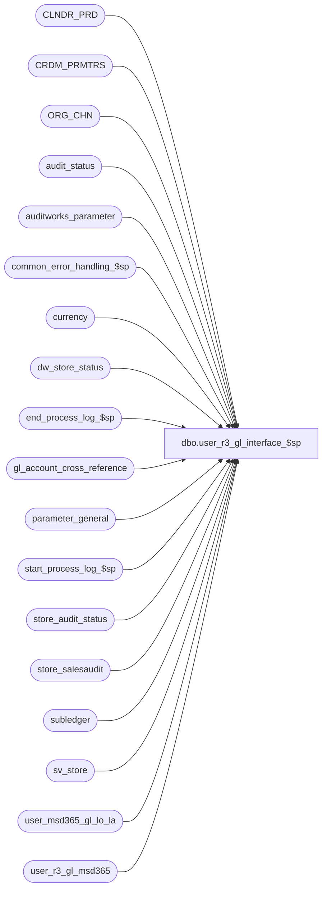

# dbo.user_r3_gl_interface_$sp

**Database:** auditworks  
**Server:** bedrockdb01  

## Architecture Diagram



## Table Dependencies

| Referenced Table |
|---|
| CLNDR_PRD |
| CRDM_PRMTRS |
| ORG_CHN |
| audit_status |
| auditworks_parameter |
| common_error_handling_$sp |
| currency |
| dw_store_status |
| end_process_log_$sp |
| gl_account_cross_reference |
| parameter_general |
| start_process_log_$sp |
| store_audit_status |
| store_salesaudit |
| subledger |
| sv_store |
| user_msd365_gl_lo_la |
| user_r3_gl_msd365 |

## Stored Procedure Code

```sql
CREATE proc  [dbo].[user_r3_gl_interface_$sp] 
@period_ending_date		smalldatetime,
@journal_entry_description 	nvarchar(30),
@last_date_closed		smalldatetime,
@period_end_date		smalldatetime

AS

/* 
PROC NAME: lawson_gl_interface_$sp
     DESC: Build lawson_gl_interface table from subledger table according a range of 
           transaction dates, which is retrieved from parameter_general. lawson_gl_interface 
           table will contain the gl_account_no instead of gl_account_id.
 	   Called from period_end_$sp 

HISTORY:
Date        Name     Def#   Desc
Jun 11,18	BayaniD  		BABSOW18003 - Custom GL Microsoft Dynamics 365
Feb 04,19   Roula           Accounts repored daily (not summarized in GL file), based on tenders specified in lookup table maintained by Client
Feb 28,19   Roula           Changes to DESCRIPTION and TEXT - should have period end date instead of system date - same as TRANSDATE
Oct 02,19   Roula           Omit records that have 0 debit and 0 credit amounts; reduce file size (code still commented to validate before and after)
*/

-- declaration section for variables to be used in lawson gl interface file
-- values of lawson variables MUST be set in the lawson_default table.
-- when INSERT into the lawson_gl_interface table, MUST customize values of 'old_company' and 'old_acct_no'.

DECLARE
	@source_code		char(2),
	@user_date			smalldatetime,
	@currency_code		char(5),
	@jnl_book_nbr		char(20),
	@calendar_date_fmt	tinyint,
	@current_date 		smalldatetime,
	@errmsg 			varchar(255),
	@errno 				int,
	@process_log_entry 	tinyint,
	@process_no 		smallint,
	@process_timestamp 	float,
	@transaction_count 	numeric(12,0),
	@min_seq_offset		numeric(12,0),
	@message_id			int,
	@object_name		varchar(255),
	@operation_name		varchar(100),
	@process_name		varchar(100),
	@filler				char(255),
	@clndr_id			binary(16),
	@lvl_month			binary(16),
	@rows				int,
	@journal_description nvarchar(30)

SELECT
	@source_code = ' ',	
	@user_date	= getdate(),		
	@currency_code = ' ',
	@jnl_book_nbr = ' ',
	@current_date = getdate(),
	@errmsg = NULL,
	@process_log_entry = 0,
	@process_no = 205,
	@process_timestamp = 0,
	@transaction_count = 0,
	@min_seq_offset = 1,
	@message_id = 201068,
	@process_name = 'user_r3_gl_interface_$sp',
	@filler = Space(255),
	@calendar_date_fmt = 112


EXEC start_process_log_$sp @process_no, @process_timestamp OUTPUT, @errmsg OUTPUT

SELECT @errno = @@error
IF @errno <> 0
  BEGIN
	SELECT	@object_name = 'start_process_log_$sp',
		@operation_name = 'EXECUTE'
	IF @errmsg IS NULL
		SELECT @errmsg = 'Unable to execute start_process_log_$sp'
	GOTO error
  END
 
SELECT @process_log_entry = 1


CREATE TABLE #msd365_gl(
	seq_number			numeric(12,0) identity,
	gl_company			int,
	gl_account_id		int,
	gl_account_no		nvarchar(160),
	store_no			int,
	debit_amount		money,
	credit_amount		money,
	trxn_date			smalldatetime,
	period_end_date		smalldatetime,
	account_type		nvarchar(50),
	account_display_value nvarchar(255),
	bank_trans_type		 nvarchar(255))

SELECT @errno = @@error
IF @errno <> 0
  BEGIN
    SELECT @errmsg = 'Unable to execute lawson_segment_$sp',
	   @object_name = '#lawson_gl',
	   @operation_name = 'CREATE TABLE'
    GOTO error
  END

SELECT @clndr_id = PRMTR_VAL_BIN
  FROM CRDM_PRMTRS
 WHERE PRMTR_NAME = 'GL_PSTNG_CLNDR_ID'

SELECT @errno = @@error, @rows = @@rowcount
IF @rows = 0 AND @errno = 0
  SELECT @errno = 201612
IF @errno <> 0
  BEGIN
	SELECT @errmsg = 'Unable to select calendar id',
	       @object_name = 'CRDM_PRMTRS',
	       @operation_name = 'SELECT'
	GOTO error
  END

SELECT @lvl_month = par_bin_value
  FROM auditworks_parameter
 WHERE par_name = 'clndr_lvl_month'

SELECT @errno = @@error
IF @errno <> 0
  BEGIN
	SELECT @errmsg = 'Unable to select month level id',
	       @object_name = 'auditworks_parameter',
	       @operation_name = 'SELECT'
	GOTO error
  END


SELECT @journal_description = journal_entry_description
  FROM parameter_general
SELECT @errno = @@error,@rows = @@rowcount
IF @errno <> 0 OR @rows = 0
BEGIN
	SELECT @errmsg = 'Unable to select from parameter general',
	       @object_name = 'parameter_general',
	       @operation_name = 'SELECT'
	GOTO error
END


/* Create summary gl details FOR NON-TENDER accounts */
	INSERT #msd365_gl(
		gl_company,
		gl_account_id,
		gl_account_no,
		debit_amount,
		credit_amount,
		trxn_date,
		period_end_date,
		store_no,
		account_type,
		account_display_value,
		bank_trans_type)
	SELECT
		SIGN(SIGN(9999-s.gl_company) + 1) * s.gl_company,
		x.gl_account_id,
		x.gl_account_no,
		CASE WHEN SUM(s.amount) >= 0 
		      THEN SUM(s.amount) 
			 ELSE 0
		END,
		CASE WHEN SUM(s.amount) < 0 
		      THEN SUM(s.amount) 
			  ELSE 0
		END ,
		DATEADD( dd, -1, CONVERT(SMALLDATETIME, CONVERT(nvarchar, c.END_DATE_TIME, 101)) ),
		DATEADD( dd, -1, CONVERT(SMALLDATETIME, CONVERT(nvarchar, c.END_DATE_TIME, 101)) ),
		s.store_no, --0,
		"Ledger",
		NULL,
		NULL
	FROM subledger s WITH (NOLOCK), 
		 CLNDR_PRD c, gl_account_cross_reference x, sv_store sv
	WHERE s.posting_status = 0
	  AND s.gl_account_id = x.gl_account_id
	  AND c.CLNDR_ID          = @clndr_id
	  AND c.CLNDR_LVL_TYPE_ID = @lvl_month
	  AND s.transaction_date >= c.STRT_DATE_TIME 
	  AND s.transaction_date  < c.END_DATE_TIME
	  AND s.transaction_date > @last_date_closed
	  AND s.transaction_date <= @period_ending_date
	  AND s.store_no = sv.store_no
	  AND LTRIM(RTRIM(convert(char,s.transaction_category))) + '|' + LTRIM(RTRIM(convert(char,s.line_object))) +  '|' + LTRIM(RTRIM(convert(char,s.line_action)))  +  '|' + LTRIM(RTRIM(convert(char,sv.country_code))) NOT IN ( select distinct LTRIM(RTRIM(convert(char,transaction_category))) + '|' + LTRIM(RTRIM(convert(char,line_object))) +  '|' + LTRIM(RTRIM(convert(char,line_action))) +  '|' + LTRIM(RTRIM(convert(char,country_code))) from user_msd365_gl_lo_la)
	GROUP BY SIGN(SIGN(9999-s.gl_company) + 1) * s.gl_company, x.gl_account_id, x.gl_account_no, c.END_DATE_TIME, s.store_no
	ORDER BY SIGN(SIGN(9999-s.gl_company) + 1) * s.gl_company, x.gl_account_no, c.END_DATE_TIME, s.store_no
	
	SELECT @errno = @@error
	IF @errno <> 0
		BEGIN
		SELECT @errmsg = 'Unable to insert summary to #msd365_gl',
		       @object_name = '#msd365_gl',
		       @operation_name = 'INSERT'
		GOTO error
		END

	
/* Create detail gl details FOR TENDER accounts*/
	INSERT #msd365_gl (
		gl_company,
		gl_account_id,
		gl_account_no,
		debit_amount,
		credit_amount,
		period_end_date,
		store_no,
		trxn_date,
		account_type,
		account_display_value,
		bank_trans_type
		)
	SELECT
		SIGN(SIGN(9999-s.gl_company) + 1) * s.gl_company,
		x.gl_account_id,
		x.gl_account_no,
		CASE WHEN SUM(s.amount) >= 0 
		      THEN SUM(s.amount) 
			 ELSE 0
			 END,
		CASE WHEN SUM(s.amount) < 0 
		      THEN SUM(s.amount) 
			  ELSE 0
			  END ,
		DATEADD( dd, -1, CONVERT(SMALLDATETIME, CONVERT(nvarchar, c.END_DATE_TIME, 101)) ),
		s.store_no,
		s.transaction_date,
		"Bank",
		account_display_value,
		bank_trans_type
	FROM subledger s WITH (NOLOCK), 
		 CLNDR_PRD c, 
		 gl_account_cross_reference x,
		 user_msd365_gl_lo_la u,
		 sv_store sv
	WHERE s.posting_status = 0
	  AND s.gl_account_id = x.gl_account_id
	  AND c.CLNDR_ID          = @clndr_id
	  AND c.CLNDR_LVL_TYPE_ID = @lvl_month
	  AND s.transaction_date >= c.STRT_DATE_TIME 
	  AND s.transaction_date  < c.END_DATE_TIME
	  AND s.transaction_date > @last_date_closed
	  AND s.transaction_date <= @period_ending_date
	  AND s.store_no = sv.store_no
	  AND LTRIM(RTRIM(convert(char,s.transaction_category))) + '|' + LTRIM(RTRIM(convert(char,s.line_object))) +  '|' + LTRIM(RTRIM(convert(char,s.line_action)))  +  '|' + LTRIM(RTRIM(convert(char,sv.country_code))) = LTRIM(RTRIM(convert(char,u.transaction_category))) + '|' + LTRIM(RTRIM(convert(char,u.line_object))) +  '|' + LTRIM(RTRIM(convert(char,u.line_action)))  +  '|' + LTRIM(RTRIM(convert(char,u.country_code)))
	GROUP BY SIGN(SIGN(9999-s.gl_company) + 1) * s.gl_company, x.gl_account_id, x.gl_account_no, s.store_no, s.transaction_date, c.END_DATE_TIME,	account_display_value,
		bank_trans_type
	ORDER BY SIGN(SIGN(9999-s.gl_company) + 1) * s.gl_company, x.gl_account_no, s.store_no, s.transaction_date, c.END_DATE_TIME
	
	SELECT @errno = @@error
	IF @errno <> 0
		BEGIN
		SELECT @errmsg = 'Unable to insert detail #msd365_gl',
		       @object_name = '#msd365_gl',
		       @operation_name = 'INSERT'
		GOTO error
		END
	
SELECT @min_seq_offset = MIN(seq_number) - 1
FROM #msd365_gl WITH (NOLOCK)

SELECT @errno = @@error
IF @errno <> 0
	BEGIN
	SELECT @errmsg = 'Unable to select from #msd365_gl',
	       @object_name = '#msd365_gl',
	       @operation_name = 'SELECT'
	GOTO error
	END

BEGIN TRAN

  INSERT INTO user_r3_gl_msd365 (
	gl_company,
	store_no,
	calendar_date,
	JOURNALBATCHNUMBER,
	GLCOMPNY,
	LINENUMBER,
	ACCOUNTDISPLAYVALUE,
	ACCOUNTTYPE,
    DFLTDIMENSIONDISPVALUE,
	BANKTRANSTYPE,
	PAYMENTREFERENCE,
	CREDITAMOUNT,
	CURRENCY,
	DEBITAMOUNT,
	DESCRIPTION,
	JOURNALNAME,
	TEXT,
	TRANSDATE,
	VOUCHER)
  SELECT
 	 RIGHT ('0000' + LTRIM (ABS (convert(char(4), gl_company))), 4), --convert(char(4), gl_company),
	 RIGHT ('0000000000' + LTRIM (ABS (convert(char(10), store_no))), 10), --store_no,
	 convert(char(8),trxn_date,@calendar_date_fmt),
	 'GLNUM001',
	 gl_company,
	 --RIGHT ('000000' + LTRIM (RTRIM (convert(nchar(6), seq_number - @min_seq_offset))), 6),
	 row_number () over (partition by gl_company order by gl_company ) as line_num,
	 case when upper(account_type)= 'BANK' then account_display_value else gl_account_no end,
	 account_type,
	 --case when upper(account_type)= 'BANK' then'1013-9999-10--' end, -- 11/12/2018 dawn asked for store gl account #
	 case when upper(account_type)= 'BANK' then GL_LOC_NUM end,
	 bank_trans_type,
	 case when upper(account_type)= 'BANK' then SUBSTRING(GL_LOC_NUM,1,4) else NULL end,
	 convert(nvarchar(18),credit_amount * -1),
	 @currency_code, -- Currency
	 convert(nvarchar(18),debit_amount),
	 --LTRIM (RTRIM(@journal_entry_description)),
	 LTRIM (RTRIM(@journal_description)) + ' ' + convert(char(10),period_end_date,101),
	 'GL-MSA',
	 --case when upper(account_type)= 'BANK' then  convert(char(8),trxn_date,112) + ' AW Store ' + LTRIM (RTRIM( convert(nvarchar,bank_trans_type)))  + ' ' + convert(nvarchar,store_no) else LTRIM (RTRIM( @journal_entry_description)) end,
	 --case when upper(account_type)= 'BANK' then  convert(char(8),trxn_date,112) + ' AW Store ' + LTRIM (RTRIM( convert(nvarchar,bank_trans_type)))  + ' ' + SUBSTRING(GL_LOC_NUM,1,4) else LTRIM (RTRIM( @journal_entry_description)) end,
	 case when upper(account_type)= 'BANK' then  convert(char(8),trxn_date,112) + ' AW Store ' + LTRIM (RTRIM( convert(nvarchar,bank_trans_type)))  + ' ' + SUBSTRING(GL_LOC_NUM,1,4) else LTRIM (RTRIM(@journal_description)) + ' ' + convert(char(10),period_end_date,101) end,
	 --convert(char(8),period_end_date,@calendar_date_fmt),
	 convert(char(10),period_end_date,101),
	 'AW' + convert(char(8),period_end_date,@calendar_date_fmt) 
   FROM #msd365_gl gl  WITH (NOLOCK) 
   join ORG_CHN oc ON gl.store_no = oc.ORG_CHN_NUM
   WHERE credit_amount + debit_amount <>0

  SELECT @errno = @@error
    IF @errno <> 0
      BEGIN
	SELECT @errmsg = 'Unable to INSERT user_gl_interface',
	       @object_name = 'user_r3_gl_interface',
	       @operation_name = 'INSERT'
	GOTO error
      END	  

  -- Populate Currency Code
  UPDATE user_r3_gl_msd365
     SET user_r3_gl_msd365.CURRENCY = (SELECT c.currency_code --MAX(c.currency_code)
	               FROM store_salesaudit s, currency c
                      WHERE c.currency_id = s.currency_id
                	    --AND s.gl_company = convert(int,user_r3_gl_msd365.gl_company))
						AND s.store_no = convert(int,user_r3_gl_msd365.store_no))
  SELECT @errno = @@error
  IF @errno <> 0
  BEGIN
    SELECT @errmsg = 'Unable to update user_r3_gl_msd365 with currency_code',
	   @object_name = 'user_r3_gl_msd365',
	   @operation_name = 'UPDATE'
    GOTO error
  END
  
 --drop table msd365_gl_ro1
 -- drop table user_r3_gl_msd365_ro1

 -- select * into msd365_gl_ro1
 -- from #msd365_gl
   
 --select *
 --into user_r3_gl_msd365_ro1
 --from user_r3_gl_msd365
	  
/* Setuser_r3_gl_msd365 subledger posting status to yes */

  UPDATE subledger
  SET posting_status = 1,
     gl_posting_datetime = @current_date
  WHERE posting_status = 0
  AND transaction_date BETWEEN @last_date_closed AND @period_ending_date

  SELECT @errno = @@error
  IF @errno <> 0
    BEGIN
	SELECT @errmsg = 'Unable to update subledger with posting_status to 1',
	       @object_name = 'subledger',
	       @operation_name = 'UPDATE'
	GOTO error
    END

  UPDATE store_audit_status
  SET store_audit_status = 500,
	store_status_date = @current_date
  WHERE store_audit_status = 400
  AND sales_date BETWEEN @last_date_closed AND @period_ending_date

  SELECT @errno = @@error
  IF @errno <> 0
    BEGIN
	SELECT @errmsg = 'Unable to set store_audit_status to 500 from 400',
	       @object_name = 'store_audit_status',
	       @operation_name = 'UPDATE'
	GOTO error
    END

  UPDATE audit_status
  SET audit_status = 500,
	status_date = @current_date
  WHERE audit_status = 400
  AND sales_date BETWEEN @last_date_closed AND @period_ending_date

  SELECT @errno = @@error
  IF @errno <> 0
    BEGIN
	SELECT @errmsg = 'Unable to set audit_status to 500 from 400',
	       @object_name = 'audit_status',
	       @operation_name = 'UPDATE'
	GOTO error
    END

  --Sep 28,10 SA5 changes added
  UPDATE dw_store_status
     SET store_status = 3
   WHERE store_status = 2
     AND sales_date BETWEEN @last_date_closed AND @period_ending_date

  SELECT @errno = @@error
  IF @errno <> 0
    BEGIN
	SELECT @errmsg = 'Unable to set store_status to 3 from 2',
	       @object_name = 'dw_store_status',
	       @operation_name = 'UPDATE'
	GOTO error
    END

-- NOTE:
--	Moved the UPDATE of parameter_general, for the
--	RESET of the last_date_closed = period_end_date, and the
--	RESET of the preliminary_period_end_date = NULL,
--	to the proc reset_period_end_$sp

COMMIT TRAN

IF @process_log_entry = 1
	EXEC end_process_log_$sp @process_no, @process_timestamp, @transaction_count
	
DROP TABLE #msd365_gl 

RETURN


error:
	EXEC common_error_handling_$sp @process_no, @errno, @errmsg, 0, @message_id, 
	@process_name, @object_name, @operation_name, 1
	RETURN
```

