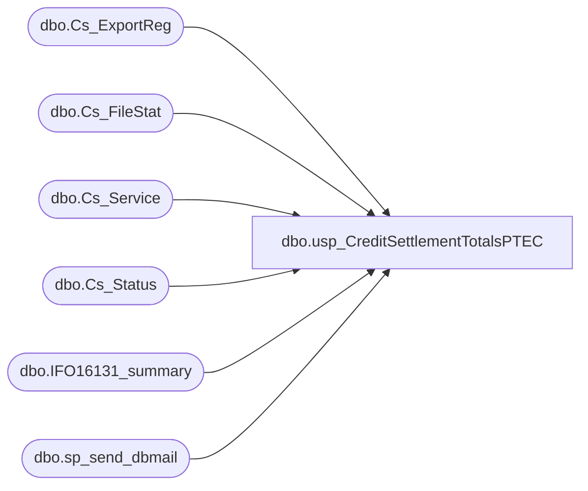

# dbo.usp_CreditSettlementTotalsPTEC

**Database:** auditworks  
**Server:** bedrockdb01  

## Architecture Diagram



## Table Dependencies

| Referenced Table |
|---|
| dbo.Cs_ExportReg |
| dbo.Cs_FileStat |
| dbo.Cs_Service |
| dbo.Cs_Status |
| dbo.IFO16131_summary |
| dbo.sp_send_dbmail |

## Stored Procedure Code

```sql
CREATE proc [dbo].[usp_CreditSettlementTotalsPTEC]  
  
as  
-- =====================================================================================================
-- Name: usp_CreditSettlementTotalsPTEC
--
-- Description:	
--
-- Input:	
--			
--
-- Output: Resultset with the following columns:
--			
--
-- Dependencies: None
--
-- Revision History
--		Name:			Date:			Comments:
--		Garyd			08/30/2010		Initial version in source control
--		Garyd			08/30/2010		Change db named from smartview to foundation.  Change from sendmail to dbmail.
--		Garyd			09/01/2010		Change folder path to new SA server for settlement files.
--		Garyd			10/14/2010		Change admin share path.
-- exec usp_CreditSettlementTotalsPTEC
-- =====================================================================================================
  
set nocount on  
declare @transmissionid char(4)  
declare @from_id char(8)  
declare @to_id char (8)  
declare @recipients varchar(8000)  
declare @Subject varchar(70)  
declare @sql varchar(8000)  
declare @drive varchar(5)  
declare @command varchar(100)  
  
  
set @drive = 'x:'  
set @sql = ''  
set @Subject = ''  
--set @recipients = 'garyd@buildabear.com'  
--set @recipients = 'paulb@buildabear.com'  
--set @recipients = 'lindak@buildabear.com; jackm@buildabear.com; IT-Retail Systems'
--prod emails:
set @recipients = 'lindak@buildabear.com; jackm@buildabear.com; paulb@buildabear.com'
--set @recipients = 'lindak@buildabear.com; jackm@buildabear.com; posadmin@buildabear.com'
  
if (Object_ID('tempdb..##cs_summary') IS NOT NULL) DROP TABLE tempdb..##cs_summary  
CREATE TABLE ##cs_summary (  
   TranID CHAR (4),  
   Status char (30),  
   Transmission_Date char (10),  
   Amount money,  
   Done_Flag char (3)  
)  
  
if (Object_ID('tempdb..#cs_temp') IS NOT NULL) DROP TABLE #cs_temp  
select c.transmission_id,
	d.status_description_1,
	convert(char(11),c.found_datafile_datetime,101) + convert(char(8),c.found_datafile_datetime,8)as found_datafile_datetime,
	c.from_execution_id,
	c.to_execution_id  
into #cs_temp
from foundation.dbo.Cs_Service a,
	 foundation.dbo.Cs_ExportReg b,
	 foundation.dbo.Cs_FileStat c,
	 foundation.dbo.Cs_Status d
where c.cs_file_id = b.cs_file_id
	and a.service_id = b.service_id
	AND b.db_group_id = 1400 
	AND c.status_id = d.status_id 
	AND c.found_datafile_datetime >= convert(char,getdate(),111)
	AND c.retransmitted_datetime is NULL
group by c.transmission_id,
	d.status_description_1,
	c.found_datafile_datetime,
	c.to_execution_id,
	c.from_execution_id
order by c.transmission_id desc  
  

-- mount drive  
set @command = 'net use ' + @drive + ' /d'  
exec master..xp_cmdshell @command  
  
--set @command = 'net use ' + @drive + ' \\oursbrun\e$ r3t@1l /user:bab\retailadmin'  
set @command = 'net use ' + @drive + ' \\posappcomms01\r$ r3t@1l /user:bab\retailadmin'  
exec master..xp_cmdshell @command  
  
if (Object_ID('tempdb..#FDMSFiles') IS NOT NULL) DROP TABLE #PTECFiles  
create table #PTECFiles (  
 filename varchar(100)  
)  
  
-- pull the credit settlement batch files  
--set @command = 'dir /b ' + @drive + '\NSB\Settlement\*.*.*'
--set @command = 'dir /b ' + '\\oursbrun\e$\NSB\Settlement\*.*.*'
set @command = 'dir /b ' + '\\posappcomms01\r$\Settlement\Company01\Status\*.*.*'
insert into #PTECFiles  
exec master..xp_cmdshell @command  
delete from #PTECFiles where filename is null or filename = 'File Not Found' or right(filename,4) = 'stat'  

  
-- unmount drive  
set @command = 'net use ' + @drive + ' /d'  
exec master..xp_cmdshell @command  
  
  
--declare cursor  
declare tranid cursor for  
select transmission_id
from #cs_temp  
order by transmission_id  
  
--open cursor  
open tranid  
  
fetch next  
 from tranid  
 into @transmissionid  
  
while @@fetch_status = 0  
begin  
	select @from_id = from_execution_id, @to_id = to_execution_id
	from #cs_temp  
	where transmission_id = @transmissionid  
	insert into ##cs_summary  
	select cs.transmission_id,
		cs.status_description_1 as Status,
		substring(convert(char,cs.found_datafile_datetime,111),1,10) as Transmission_Date,
		SUM(aip.amount) as Amount,
		'NO'
	from auditworks.dbo.IFO16131_summary aip,
		#cs_temp cs
	where execution_id BETWEEN @from_id AND @to_id  
	 	and cs.transmission_id = @transmissionid  
	group by cs.transmission_id,
		cs.status_description_1,
		cs.found_datafile_datetime  
	  	  
	if (select right(filename,4) from #PTECFiles where substring(filename,5,4) = @transmissionid) = 'DONE'  
		begin  
			update ##cs_summary set Done_Flag = 'YES'  
			where TranID = @transmissionid  
		end  
	  
	fetch next  
 	from tranid  
 	into @transmissionid  
end  
  
close tranid  
deallocate tranid  
  
if (select count(Done_Flag) from ##cs_summary) = 0  
begin  
 set @Subject = 'WARNING - USA PTEC Credit Settlement Problem'  
end
else
	begin
		if (select count(Done_Flag) from ##cs_summary where Done_Flag = 'NO') > 0  
		begin  
	 		set @Subject = 'WARNING - USA PTEC Credit Settlement Problem'  
		end  
		else  
		begin  
	 		set @Subject = 'USA PTEC Credit Settlement Summary'  
		end
	end
 
--exec master.dbo.xp_sendmail   
--@recipients = @recipients,  
--@subject=@Subject,   
--@width = 250,  
--@query= 'select * from ##cs_summary'

exec msdb.dbo.sp_send_dbmail
@recipients = @recipients,
@subject=@Subject, 
@query_result_width = 250,
@query= 'select * from ##cs_summary'
	
--exec master.dbo.xp_sendmail   
-- --@recipients = 'paulb@buildabear.com', 
-- @recipients = 'poll@buildabear.com',  
-- @subject=@Subject,   
-- @width = 250,  
-- @query= 'select TranID, Status, Transmission_Date, Done_Flag from ##cs_summary'

exec msdb.dbo.sp_send_dbmail
@recipients = 'poll@buildabear.com',  
@subject=@Subject, 
@query_result_width = 250,
@query= 'select TranID, Status, Transmission_Date, Done_Flag from ##cs_summary'
```

