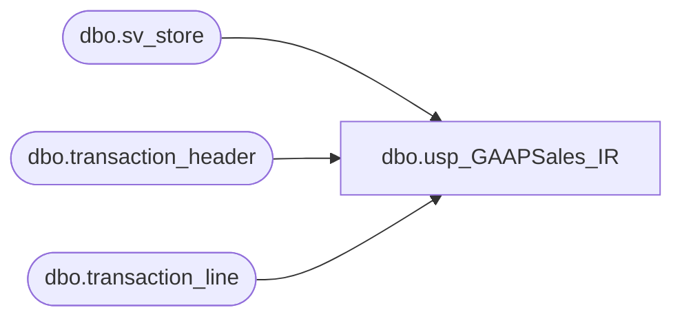

# dbo.usp_GAAPSales_IR

**Database:** auditworks  
**Server:** bedrockdb01  

## Architecture Diagram



## Table Dependencies

| Referenced Table |
|---|
| dbo.sv_store |
| dbo.transaction_header |
| dbo.transaction_line |

## Stored Procedure Code

```sql
CREATE PROC [dbo].[usp_GAAPSales_IR]
-- =============================================================================================================
-- Name: [dbo].[usp_GAAPSales_IR]  
--
-- Description:	

--
-- Input:		
--
--
-- Output: 
--
-- Dependencies: 
--
-- Revision History
--		Name:			Date:			Comments:
--		Keith Lee	11/20/2009			Created usg_GAAPSales_IR for wf_COALITION_GAAP_Sales_V1 job
--		Garyd			08/30/2010		Initial version in source control
-- exec usp_GAAPSales_IR
-- =============================================================================================================
AS 
    IF ( OBJECT_ID('tempdb..#GAAPSales_IR') IS NOT NULL ) 
        DROP TABLE #GAAPSales_IR
    SELECT  c.store_no,
            c.store_name,
            CASE WHEN d.total IS NULL THEN '0.00'
                 ELSE d.total
            END total,
            CASE WHEN d.[time of last transaction polled] IS NULL
                 THEN 'No transactions polled'
                 ELSE d.[time of last transaction polled]
            END [time of last transaction polled]
    INTO    #GAAPSales_IR
    FROM    ( SELECT    a.store_no,
                        SUM(( (b.gross_line_amount - b.pos_discount_amount) )
                            * b.db_cr_none * b.voiding_reversal_flag) * -1 AS total,
                        LEFT(MAX(a.entry_date_time), 19) AS [time of last transaction polled]
              FROM      auditworks.dbo.transaction_header a WITH ( NOLOCK )
                        JOIN auditworks.dbo.transaction_line b WITH ( NOLOCK ) ON a.transaction_id = b.transaction_id
              WHERE     ( a.transaction_date BETWEEN CONVERT(CHAR, GETDATE(), 101)
                                             AND     CONVERT(CHAR, GETDATE(), 101)
                          AND a.transaction_void_flag = 0
                          AND a.transaction_category IN ( 1, 2 )
                          AND b.line_void_flag = 0 
		AND b.line_object IN (100,102,103,200,202,203,204,206,210,250,290,291,293,295,296,623,640,690,691, 1630, 1631)) 
--                          AND b.[line_object] IN ( 200, 200, 202, 203, 204,
--                                                   210, 250, 290, 296, 291,
--                                                   640, 690, 1606, 1607, 1610,
--                                                   1611, 1612, 1613, 1614,
--                                                   1616, 1617, 1618, 1621,
--                                                   1622, 1623, 1625, 1626,
--                                                   1627, 1629, 1630, 1631,
--                                                   1800, 1801, 1802, 1803,
--                                                   1804, 1805, 1806, 1807,
--                                                   1808, 1809, 1810, 1811,
--                                                   1900 )
--                        )
              GROUP BY  a.store_no
            ) d
            RIGHT JOIN auditworks.dbo.sv_store c WITH ( NOLOCK ) ON d.store_no = c.store_no
    WHERE   c.gl_company IN (2103) -- IR stores only
            AND c.store_status_code IN ( 2, 3, 6 ) -- (2)--non-comparative, (3)--comparative, (6)--open
	--and c.open_date <= getdate()
            AND c.selling_nonselling_flag = 0
    ORDER BY c.store_no

--CALCULATE TOTAL VAT FOR STORES' SALES
    SELECT  h.store_no AS 'StoreNo',
            SUM(( l.gross_line_amount * CASE [line_action]
                                          WHEN 13 THEN -1
                                          WHEN 21 THEN 1
                                        END )) AS 'VAT'
    INTO    #tmp_VAT
    FROM    auditworks.dbo.transaction_header h
            JOIN auditworks.dbo.transaction_line l ON h.transaction_id = l.transaction_id
            RIGHT JOIN auditworks.dbo.sv_store c ON h.store_no = c.store_no
    WHERE   ( h.transaction_date BETWEEN CONVERT(CHAR, GETDATE(), 101)
                                 AND     CONVERT(CHAR, GETDATE(), 101)
              AND h.transaction_void_flag = 0
              AND h.transaction_category IN ( 1, 2 )
            )
            AND l.line_object IN ( 1150 )
            AND l.line_void_flag = 0
            AND gl_company IN ( 2103)-- IR stores only
            AND store_status_code IN ( 2, 3, 6 )
    GROUP BY h.store_no
    ORDER BY h.store_no

--UPDATE GAAP SALES BY STRIPPING OUT VAT
    UPDATE  #GAAPSales_IR
    SET     total = total + VAT
    FROM    #GAAPSales_IR f
            INNER JOIN #tmp_VAT v ON v.StoreNo = f.store_no


    SELECT 
	--case when store_no = 0 then '' else cast(store_no as char(4)) end store_no,
            store_no,
            store_name,
            total,
            [time of last transaction polled]
    FROM    ( SELECT    *
              FROM      #GAAPSales_IR
              UNION
              SELECT    '',
                        'IR BABW TOTAL',
                        SUM(total),
                        ''
              FROM      #GAAPSales_IR
            ) e
```

