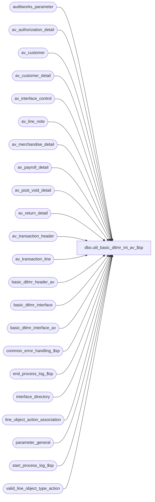

# dbo.util_basic_dtlmr_int_av_$sp

**Database:** auditworks  
**Server:** bedrockdb01  

## Architecture Diagram



## Table Dependencies

| Referenced Table |
|---|
| auditworks_parameter |
| av_authorization_detail |
| av_customer |
| av_customer_detail |
| av_interface_control |
| av_line_note |
| av_merchandise_detail |
| av_payroll_detail |
| av_post_void_detail |
| av_return_detail |
| av_transaction_header |
| av_transaction_line |
| basic_dtlmr_header_av |
| basic_dtlmr_interface |
| basic_dtlmr_interface_av |
| common_error_handling_$sp |
| end_process_log_$sp |
| interface_directory |
| line_object_action_association |
| parameter_general |
| start_process_log_$sp |
| valid_line_object_type_action |

## Stored Procedure Code

```sql
create proc dbo.util_basic_dtlmr_int_av_$sp 
 AS

/*
** NAME: util_basic_dtlmr_int_av_$sp
** DESC: Builds dtlmr interface table named basic_dtlmr_interface_av
** 	 to be used by smartload script bscintface.ict to generate an
** 	 ASCII file which will then be used by BASIX program to create
** 	 interface *DTLMR
**	 Table is built from av_customer, av_customer_detail,
** 	 av_interface_control, av_merchandise_detail, av_transaction_header,
** 	 av_transaction_line, line_object_action_association

IMPORTANT: Any defect found for this proc must be applied to basic_dtlmr_interface_$sp

HISTORY:
Date     Name              Def#   Desc
Jan24,12 Vicci           132559   Avoid transaction_date ambiguity
Oct25,06 Phu              77931   Fix outer join, index hint for SQL 2005 Mode 90.
Sep06,06 Tim              75320   Null Concatenation Fix.
May13,05 Maryam         DV-1202   Rename from_line_id to line_id.
Jan24,05 Paul           DV-1203/39562 correct index hint on av_line_note
May29,04 Maryam         DV-1071   hard code customer_subcode_range_flag to 1.
May07,04 Maryam         DV-1071   Call common_error_handling_$sp instead of update_error_log_$p
Dec10,03 David            17221   Limit cashier_no to 7 digits.
                          20260
                          20262
JAN14,02 Daphna         1-96JC6   Ensure assignment of transaction_code ignores void lines
                                  Retrofit to 02.46.25, 02.50.06
May15/01 Winnie            7589   Missing transactions by transaction Series version 1.0. Added 
                                  transaction_series to work table #dtlmr_interface and use in 
                                  join criteria in update to voided_if_entry_no.
Apr30/01 Winnie            7596   Avoid store and register being swapped again if ftp fails.
Nov20/00 Winnie            7004   Mod for client with store number exceeds 3 digits
Oct10/00 Phu               6737   Prevent null values insert for subcode 962, 967
May04/00 Louise            6291   Fixed join for transaction_code 2 (added = sign to < )
May03/00 Paul              6270   Round partial units to higher integer (ceiling function)
                                  and calculate unit price using the rounded units.
May03/00 Louise            6253   Duplicate error occuring when inserting into header table. Used
                                  MAX aggregate on insert and grouped the fields together.
Apr26/00 Paul              6268   Use subcode 970 for telephone2, use index hints
Apr03/00 Louise            6161   To properly set the transaction codes using interface_control_flag
Mar09/00 Henry             6074   To take only rightmost 4 digits of transaction_no.
Feb25/00 Vicci             6045   Removed erroneous 550-599 handling.
Jul30/99 Mat               5033   Added RTRIM in select from reference_no
Jul07/99 Mat               4888   Add criteria for setting basic_dtlmr_header_av.transaction_code = '2'
Jun14/99 Henry             4904   Correctly assign basic subcode ranges 930-934 or 960-968 for
                                  customer info, depending on customer_subcode_range_flag in 
                                  reference_type table.
Mar15,99 Phu               4904   Create details for subcode ranged 550 - 599
                                  Handle sign of discount when return amount > purchase amount.
*/

DECLARE
	@base 				numeric(15,0),
	@customer_seq_no 		tinyint,
	@employee_no_length_adj 	tinyint,
	@errmsg 			varchar(255),
	@errno 				int,
	@last_retrieval_datetime 	datetime,
	@last_posting_datetime 		datetime,
	@max_av_entry 			numeric(12,0),
	@min_av_entry 			numeric(12,0),
	@position 			smallint,
	@posting_in_progress 		tinyint,
	@process_log_entry 		bit,
	@process_no 			smallint,
	@process_timestamp 		float,
	@rows 				int,
	@seq 				tinyint,
	@space_filler			char(20),
	@space_filler_12		char(12),
	@terminate_interface 		bit,
	@transaction_count 		numeric(12,0),
	@voided_trans_count 		int,
	@zero_filler			char(20),
	@zero_filler_2			char(2),
	@zero_filler_4			char(4),
	@zero_filler_9			char(9),
	@zero_filler_15			char(15),
	@swap_flag			int,
	@message_id		        int,	
	@object_name			varchar(255),
	@operation_name			varchar(100),
	@process_name		        varchar(100)

SET CONCAT_NULL_YIELDS_NULL OFF

SELECT	@base = 10,
	@customer_seq_no = 200,
	@errmsg = NULL,
	@process_log_entry = 0,
	@process_no = 203,
	@process_timestamp = 0,
	@space_filler = SPACE(20),
	@space_filler_12 = SPACE(12),
	@terminate_interface = 0,
	@transaction_count = 0,
	@zero_filler = REPLICATE ('0', 20),
	@zero_filler_2 = '00',
	@zero_filler_4 = '0000',
	@zero_filler_9 = '000000000',
	@zero_filler_15 = '000000000000000',
	@process_name = 'util_basic_dtlmr_int_av_$sp',
	@message_id = 201068

	
/*
IF EXISTS ( SELECT ascii_export
		FROM interface_directory
		WHERE basic_dtlmr_subsystem IS NOT NULL
		AND ascii_export = 1 )
  SELECT @rows = 1
ELSE
  RETURN

IF EXISTS (SELECT i.av_transaction_id
	FROM
	interface_directory d,
	av_interface_control i
	WHERE
	basic_dtlmr_subsystem IS NOT NULL
	AND ascii_export = 1
	AND interface_control_flag <= 49
	AND d.interface_id = i.interface_id )
*/
  SELECT @employee_no_length_adj = employee_no_length_adj
  FROM parameter_general
  
  SELECT @errno = @@error
  IF @errno <> 0
    BEGIN
 	SELECT @errmsg = 'Unable to select from parameter_general',
	       @object_name = 'parameter_general',
               @operation_name = 'SELECT'
	GOTO error
    END

/*
ELSE
  RETURN
*/

CREATE TABLE #dtlmr_interface (
	transaction_date 		char(8) 	not null,
	store_no 			int 		not null,
	register_no 			smallint 	not null,
	av_transaction_id 		numeric(12,0) 	not null,
	line_id 			numeric(5,0) 	not null,
	seq 				tinyint 	not null,
	transaction_no 			int 		not null,
	cashier_no 			int 		not null,
	entry_time 			char(4) 	not null,
	transaction_code 		char(1) 	not null,
	subcode 			char(3) 	not null,
	identifier 			char(20) 	not null,
	quantity 			int 		not null,
	extended_amount 		int 		not null,
	subsystem 			char(15) 	not null,
	voided_av_transaction_id 	numeric(12,0) 	not null,
	transaction_series		char(1)		not null)

  SELECT @errno = @@error
  IF @errno != 0
    BEGIN
      SELECT @errmsg = 'Unable to create table #dtlmr_interface',
             @object_name = '#dtlmr_interface',
             @operation_name = 'CREATE'      
      GOTO error
    END

  /* check if swap flag is turned on then update basic_dtlmr_interface table
   swap store no to register no and register no to store no    */
   
SELECT @swap_flag = ISNULL(CONVERT(INT,par_value),0)
  FROM auditworks_parameter
 WHERE par_name = 'swap_dtlmr_interface_store_no'   

SELECT @errno = @@error
    IF @errno <> 0
      BEGIN
	SELECT @errmsg = 'Unable to select from auditworks_parameter (swap_dtlmr_interface_store_no)',
             @object_name = 'auditworks_parameter',
             @operation_name = 'SELECT'      

	GOTO error
      END   

WHILE @terminate_interface = 0
  BEGIN
/*
    IF @transaction_count >= 100000
	BREAK

    SELECT @last_retrieval_datetime = MAX (last_retrieval_datetime),
	   @last_posting_datetime = MAX (last_posting_datetime),
	   @posting_in_progress = MAX (posting_in_progress)
    FROM interface_status s, interface_directory d
    WHERE s.interface_id = d.interface_id
    AND basic_dtlmr_subsystem IS NOT NULL
    AND ascii_export = 1

    IF @last_retrieval_datetime >= @last_posting_datetime
    OR @posting_in_progress <> 1
	SELECT @terminate_interface = 1
*/
    TRUNCATE TABLE basic_dtlmr_header_av

    SELECT @errno = @@error
    IF @errno <> 0
      BEGIN
	SELECT @errmsg = 'Unable to truncate table basic_dtlmr_header_av',
               @object_name = 'basic_dtlmr_header_av',
               @operation_name = 'TRUNCATE'      
	GOTO error
      END

/* Create basic_dtlmr_header_av from 3 tables: av_interface_control,
** av_transaction_header, interface_directory
*/
/*
    SELECT @min_av_entry = MIN (i.av_transaction_id)
    FROM
	interface_directory d,
	av_interface_control i
    WHERE
	basic_dtlmr_subsystem IS NOT NULL
    AND ascii_export = 1
 AND interface_control_flag <= 49
    AND d.interface_id = i.interface_id

    SELECT @errno = @@error
    IF @errno <> 0
      BEGIN
	SELECT @errmsg = 'Unable to select min(av_transaction_id) from av_interface_control'
	GOTO error
      END

    IF @min_av_entry IS NULL
	BREAK

    SELECT @max_av_entry = @min_av_entry + 1000
*/

/* ====================================================================== */
/* Modify the where clause to include/exclude the store(s), date(s),      */
/* and/or line_object(s) as required.                                     */
/*                                                                        */
/* to find out what the user is using with DTLMR do:                      */
/* select * from interface_directory                                      */
/* where basic_dtlmr_subsystem IS NOT NULL                                */
/*                                                                        */
/* then you can identify which interface_id it is that you want to        */
/* recover - if you need to be specific. else do all of them              */
/*                                                                        */
/* now you need to identify the line_object for each dtlmr interface      */
/* use the or clause below if more than 1 interface_id is needed          */
/* */
/* select distinct interface_id, line_object from interface_applicability */
/* where interface_id = 50                                                */
/* or interface_id = 23 or interface_id = 3                               */
/*                                                                        */
/* this will give you the line_object that you need to make you query     */
/* selective to the dtlmr function you want to recover                    */
/*                                                                        */
/* ====================================================================== */

    SELECT DISTINCT
	i.av_transaction_id,
	i.interface_id
    INTO #int_directory_control
    FROM
	interface_directory d,
	av_interface_control i,
	av_transaction_header h,
	av_transaction_line l
    WHERE
	d.basic_dtlmr_subsystem IS NOT NULL
    AND d.ascii_export = 1
    AND d.interface_id = i.interface_id
    AND i.av_transaction_id = h.av_transaction_id
    AND h.store_no = 501
    AND h.transaction_date = '10/18/98'
    AND i.av_transaction_id = l.av_transaction_id
    AND l.line_object IN (603, 800)


    SELECT @errno = @@error,
	   @rows = @@rowcount
    IF @errno <> 0
      BEGIN
	SELECT @errmsg = 'Unable to insert into #int_directory_control',
               @object_name = '#int_directory_control',
               @operation_name = 'INSERT'      

	GOTO error
      END

    IF @rows <= 0
      BEGIN
	DROP TABLE #int_directory_control

	SELECT @errno = @@error
	IF @errno <> 0
	  BEGIN
		SELECT @errmsg = 'Unable to drop table #int_directory_control',
                       @object_name = '#int_directory_control',
                       @operation_name = 'DROP'
		GOTO error
	  END

	BREAK -- Exit the loop if there is no data
      END

    SELECT @terminate_interface = 1 /* Force exit after one loop */

    IF @process_log_entry = 0
      BEGIN
	EXEC start_process_log_$sp @process_no, @process_timestamp OUTPUT, @errmsg OUTPUT

	SELECT @errno = @@error
	IF @errno <> 0
	  BEGIN
		IF @errmsg IS NULL
	          SELECT @errmsg = 'Unable to execute start_process_log_$sp'
		SELECT @object_name = 'start_process_log_$sp',
                       @operation_name = 'EXEC'
		GOTO error
	  END

	SELECT @process_log_entry = 1
      END

    INSERT basic_dtlmr_header_av (
	av_transaction_id,
	transaction_category,
	store_no,
	register_no,
	transaction_date,
	transaction_no,
	entry_time,
	cashier_no,
	transaction_void_flag,
	media_count_flag,
	tender_total,
	employee_no,
	transaction_code,
	subsystem,
	transaction_series)
    SELECT 
	h.av_transaction_id,
	transaction_category,
	store_no,
	register_no,
	CONVERT (CHAR (8), transaction_date, 1),
	transaction_no,
	RIGHT (@zero_filler_4 + LTRIM (STR (DATEPART (hh, entry_date_time) * 100
				  + DATEPART (mi, entry_date_time), 4
				   )
			      ), 4
	      ),
	CONVERT(INT, RIGHT(@zero_filler_9 + CONVERT(VARCHAR, cashier_no),7) ), -- limit cashier_no to 7 digits
	transaction_void_flag * ABS(SIGN(transaction_void_flag - 8)),
	media_count_flag,
	CONVERT (INT, tender_total * 100),
	ISNULL (employee_no, 0),
	'0',
	@zero_filler_15,
	transaction_series
    FROM
	#int_directory_control dc,
	av_transaction_header h
    WHERE
	dc.av_transaction_id = h.av_transaction_id
    AND date_reject_id = 0
    AND (transaction_void_flag) * (transaction_void_flag - 3) * ABS(transaction_void_flag - 8) <= 0
 GROUP BY	h.av_transaction_id,
	transaction_category,
	store_no,
	register_no,
	CONVERT (CHAR (8), transaction_date, 1),
	transaction_no,
	RIGHT (@zero_filler_4 + LTRIM (STR (DATEPART (hh, entry_date_time) * 100
				  + DATEPART (mi, entry_date_time), 4
				   )
			      ), 4
	      ),
	CONVERT(INT, RIGHT(@zero_filler_9 + CONVERT(VARCHAR, cashier_no),7) ),
	transaction_void_flag * ABS(SIGN(transaction_void_flag - 8)),
	media_count_flag,
	CONVERT (INT, tender_total * 100),
	ISNULL (employee_no, 0),
	transaction_series     

  /* void_flag = 0, 1, 2, 3, 8 */
    SELECT @errno = @@error
    IF @errno <> 0
      BEGIN
	SELECT @errmsg = 'Unable to insert basic_dtlmr_header_av',
	       @object_name = 'basic_dtlmr_header_av',
               @operation_name = 'INSERT'

	GOTO error
      END


/* Find basic subsystem code */

    UPDATE basic_dtlmr_header_av
    SET subsystem = REVERSE (RIGHT (@zero_filler_15 +
		    LTRIM (STR ((SELECT SUM (POWER (@base, CONVERT (numeric (15,0), basic_dtlmr_subsystem) - 1))
	 			 FROM 	interface_directory d,
					av_interface_control i
				 WHERE
					basic_dtlmr_subsystem IS NOT NULL
		AND 	ascii_export = 1
				 AND 	dh.av_transaction_id = i.av_transaction_id
				 AND 	i.interface_id = d.interface_id
						), 15, 0
					       )
					  ), 15 ))
    FROM basic_dtlmr_header_av dh

    SELECT @errno = @@error
    IF @errno <> 0
      BEGIN
	SELECT @errmsg = 'Unable to set subsystem.',
	       @object_name = 'basic_dtlmr_header_av',
               @operation_name = 'UPDATE'

	GOTO error
      END

/* Determine transaction code */

    UPDATE basic_dtlmr_header_av
    SET transaction_code = '1'
    FROM basic_dtlmr_header_av dh, av_transaction_line l
    WHERE tender_total >= 0
    AND dh.av_transaction_id = l.av_transaction_id
    AND (line_action IN (1, 101)
    AND l.line_void_flag = 0  -- DEF 1-96JC6
	 OR (line_object_type = 1 AND line_action = 201 AND db_cr_none <> 0 )
         OR (line_object_type = 2 AND line_action IN (11,111))
        )

    SELECT @errno = @@error
    IF @errno <> 0
      BEGIN
	SELECT @errmsg = 'Unable to set transaction_code to 1',
	       @object_name = 'basic_dtlmr_header_av',
               @operation_name = 'UPDATE'
	GOTO error
      END

    UPDATE basic_dtlmr_header_av
    SET transaction_code = '2'
    FROM basic_dtlmr_header_av dh, av_transaction_line l
    WHERE tender_total <= 0
    AND l.av_transaction_id = dh.av_transaction_id
    AND l.line_void_flag = 0  -- DEF 1-96JC6    
    AND (line_action IN (2, 102)
         OR (line_object_type = 2 AND line_action in (12,112))
        )

    SELECT @errno = @@error
    IF @errno <> 0
      BEGIN
	SELECT @errmsg = 'Unable to set transaction_code to 2',
	       @object_name = 'basic_dtlmr_header_av',
               @operation_name = 'UPDATE'
	GOTO error
      END

    UPDATE basic_dtlmr_header_av
    SET transaction_code = '4'
    WHERE transaction_code = '0' 
      AND tender_total < 0

    SELECT @errno = @@error
    IF @errno <> 0
      BEGIN
	SELECT @errmsg = 'Unable to Unable to set transaction_code to 4',
	       @object_name = 'basic_dtlmr_header_av',
               @operation_name = 'UPDATE'
	GOTO error
      END

    UPDATE basic_dtlmr_header_av
    SET transaction_code = '3'
    WHERE transaction_code = '0' 
      AND tender_total > 0

    SELECT @errno = @@error
    IF @errno <> 0
      BEGIN
	SELECT @errmsg = 'Unable to Unable to set transaction_code to 3',
	       @object_name = 'basic_dtlmr_header_av',
               @operation_name = 'UPDATE'
	GOTO error
      END

    UPDATE basic_dtlmr_header_av
    SET transaction_code = '7'
    FROM basic_dtlmr_header_av dh, av_transaction_line l
    WHERE transaction_code = '0'
    AND dh.av_transaction_id = l.av_transaction_id
    AND l.line_void_flag = 0  -- DEF 1-96JC6    
    AND (l.line_object_type = 13
	 OR l.line_action = 52)

    SELECT @errno = @@error
    IF @errno <> 0
      BEGIN
	SELECT @errmsg = 'Unable to Unable to set transaction_code to 7',
	       @object_name = 'basic_dtlmr_header_av',
               @operation_name = 'UPDATE'
	GOTO error
      END

    UPDATE basic_dtlmr_header_av
    SET transaction_code = '6'
    FROM basic_dtlmr_header_av dh, av_transaction_line l
   WHERE l.av_transaction_id = dh.av_transaction_id
     AND l.line_void_flag = 0  -- DEF 1-96JC6   
     AND ( dh.media_count_flag = 1 OR line_action IN (246,247) )
     
    SELECT @errno = @@error
    IF @errno <> 0
      BEGIN
	SELECT @errmsg = 'Unable to Unable to set transaction_code to 6',
	       @object_name = 'basic_dtlmr_header_av',
               @operation_name = 'UPDATE'
	GOTO error
      END

    UPDATE basic_dtlmr_header_av
    SET transaction_code = '5'
    WHERE tender_total = 0
    AND transaction_code = '0'

    SELECT @errno = @@error
    IF @errno <> 0
      BEGIN
	SELECT @errmsg = 'Unable to Unable to set transaction_code to 5',
	       @object_name = 'basic_dtlmr_header_av',
               @operation_name = 'UPDATE'
	GOTO error
      END

/* get list of customers where customer_role = 1 */

    SELECT
	dh.transaction_date,
	dh.store_no,
	dh.register_no,
	dh.av_transaction_id,
	c.line_id,
	transaction_no,
	cashier_no,
	entry_time,
	transaction_code,
	customer_no,
	customer_role,
	last_name,
	first_name,
	title,
	address_1,
	address_2,
	city,
	state,
	county,
	country,
	post_code,
	telephone_no1,
	telephone_no2,
	dh.tender_total,
	subsystem,
	1 as customer_subcode_range_flag
    INTO #temp_customer
    FROM basic_dtlmr_header_av dh,  
	 av_customer c
   WHERE dh.av_transaction_id = c.av_transaction_id
     AND c.customer_role = 1

    SELECT @errno = @@error
    IF @errno <> 0
      BEGIN
	SELECT @errmsg = 'Unable to build temp table #temp_customer',
	       @object_name = '#temp_customer',
               @operation_name = 'INSERT'
	GOTO error
      END

/* get list of customers where customer_role = 3 */

    SELECT
	dh.transaction_date,
	dh.store_no,
	dh.register_no,
	dh.av_transaction_id,
	c.line_id,
	transaction_no,
	cashier_no,
	entry_time,
	transaction_code,
	customer_no,
	customer_role,
	last_name,
	first_name,
	title,
	address_1,
	address_2,
	city,
	state,
	county,
	country,
	post_code,
	telephone_no1,
	telephone_no2,
	dh.tender_total,
	subsystem,
	1 as customer_subcode_range_flag
   INTO #temp_cust3
   FROM basic_dtlmr_header_av dh,
        av_customer c
  WHERE	dh.av_transaction_id = c.av_transaction_id
    AND c.customer_role = 3

    SELECT @errno = @@error
    IF @errno <> 0
      BEGIN
	SELECT @errmsg = 'Unable to build temp table #temp_cust3',
	       @object_name = '#temp_cust3',
               @operation_name = 'INSERT'
	GOTO error
      END

    DELETE #temp_customer
    FROM #temp_customer c1, #temp_cust3 c3
  WHERE c1.av_transaction_id = c3.av_transaction_id

    SELECT @errno = @@error
    IF @errno <> 0
      BEGIN
	SELECT @errmsg = 'Unable to delete table #temp_customer',
	       @object_name = '#temp_customer',
              @operation_name = 'DELETE'
	GOTO error
      END

    INSERT #temp_customer
    SELECT #temp_cust3.transaction_date, #temp_cust3.store_no, #temp_cust3.register_no, #temp_cust3.av_transaction_id, #temp_cust3.line_id, #temp_cust3.transaction_no, #temp_cust3.cashier_no, #temp_cust3.entry_time, #temp_cust3.transaction_code, #temp_cust3.customer_no, #temp_cust3.customer_role, #temp_cust3.last_name, #temp_cust3.first_name, #temp_cust3.title, #temp_cust3.address_1, #temp_cust3.address_2, #temp_cust3.city, #temp_cust3.state, #temp_cust3.county, #temp_cust3.country, #temp_cust3.post_code, #temp_cust3.telephone_no1, #temp_cust3.telephone_no2, #temp_cust3.tender_total, #temp_cust3.subsystem, #temp_cust3.customer_subcode_range_flag
    FROM #temp_cust3

    SELECT @errno = @@error
    IF @errno <> 0
      BEGIN
	SELECT @errmsg = 'Unable to insert table #temp_customer from #temp_cust3',
	       @object_name = '#temp_customer',
               @operation_name = 'INSERT'
	GOTO error
      END

/* Create interface with subcode 906 */

    INSERT #dtlmr_interface (
	transaction_date,
	store_no,
	register_no,
	av_transaction_id,
	line_id,
	seq,
	transaction_no,
	cashier_no,
	entry_time,
	transaction_code,
	subcode,
	identifier,
	quantity,
	extended_amount,
	subsystem,
	voided_av_transaction_id,
	transaction_series )
    SELECT
	transaction_date,
	store_no,
	register_no,
	av_transaction_id,
	1,
	0,
	transaction_no,
	cashier_no,
	entry_time,
	transaction_code,
	'906',
	'                    ',
	0,
	tender_total,
	subsystem,
	0,
	transaction_series
    FROM basic_dtlmr_header_av
    WHERE transaction_void_flag = 1

    SELECT @errno = @@error,
	@voided_trans_count = @@rowcount
    IF @errno <> 0
      BEGIN
	SELECT @errmsg = 'Unable to insert #dtlmr_interface for subcode 906',
	       @object_name = '#dtlmr_interface',
               @operation_name = 'INSERT'
	GOTO error
      END

    IF @voided_trans_count > 0
      BEGIN
	BEGIN TRAN
/*	UPDATE av_post_void_deadlock
	 SET function_no = 203,
	     status_date = getdate()
*/
	UPDATE #dtlmr_interface
	SET voided_av_transaction_id = ip.av_transaction_id,
	    identifier = RIGHT (SPACE (8) + LTRIM (STR (ih.register_no, 8)), 8) + ' ' +
			 RIGHT (SPACE (4) + LTRIM (STR (ih.transaction_no, 4)), 4) + ' ' +
			 RIGHT (SPACE (6) + LTRIM (STR (ih.cashier_no, 6)), 6),
	    quantity = CONVERT (INT, RIGHT (@zero_filler_4 + LTRIM (STR (DATEPART (hh, ih.entry_date_time) * 100
						   + DATEPART (mi, ih.entry_date_time), 4
								)
							   ), 4
					   ))
	FROM #dtlmr_interface dh,
	     av_transaction_header ih,
	     av_post_void_detail ip
	WHERE dh.store_no = ih.store_no
	AND dh.transaction_date = ih.transaction_date
	AND dh.transaction_no = ip.post_voided_trans_no
	AND dh.register_no = ip.post_voided_register
	AND ip.av_transaction_id = ih.av_transaction_id
        AND ih.transaction_series = dh.transaction_series
	AND ip.post_void_successful = 1

        SELECT @errno = @@error
        IF @errno <> 0
          BEGIN
	    SELECT @errmsg = 'Unable to set voided_av_transaction_id.',
	           @object_name = '#dtlmr_interface',
                   @operation_name = 'UPDATE'
	    GOTO error
          END
	COMMIT TRAN
      END


/* Create interface with subcode = basic_subcode from line_object_action_association.
** If employee_type = 'S' and subcode = 970 then subcode = 970 + payroll_entry_type

   If abs(units) < 1, treat as 1 unit for division purposes
*/

    BEGIN TRAN

    INSERT basic_dtlmr_interface_av (
	transaction_date,
	store_no,
	register_no,
	av_transaction_id,
	line_id,
	seq,
	transaction_no,
	cashier_no,
	entry_time,
	transaction_code,
	subcode,
	identifier,
	quantity,
	extended_amount,
	tender_total,
	subsystem )
    SELECT
	dh.transaction_date,
	dh.store_no,
	dh.register_no,
	dh.av_transaction_id,
	l.line_id,
	3,
	CONVERT(INT,( RIGHT('0000' + LTRIM((CONVERT(VARCHAR(10),transaction_no))),4) )),  -- can only be 4 digits max
	cashier_no,
	entry_time,
	transaction_code,
	basic_subcode,
	RIGHT (@zero_filler + LTRIM(RTRIM(ISNULL (STR (upc_no, 20), ISNULL (reference_no, ' ')))), 20),
	ISNULL (CEILING(ABS(units)), 1),
	CONVERT (INT, (gross_line_amount * l.db_cr_none * 100 * (1 - SIGN (ABS (basic_db_cr_type - 1)))
			+ gross_line_amount * 100 * (1 - SIGN (ABS (basic_db_cr_type - 2)))
			+ gross_line_amount * -100 * (1 - SIGN (ABS (basic_db_cr_type - 3)))
		      ) * voiding_reversal_flag
	   / ISNULL (CEILING(ABS(units)), 1)),
	dh.tender_total,
	subsystem
    FROM basic_dtlmr_header_av dh
         INNER JOIN av_transaction_line l ON (dh.av_transaction_id = l.av_transaction_id)
         INNER JOIN line_object_action_association o ON (dh.transaction_category = o.transaction_category
                                                         AND l.line_object = o.line_object
                                                         AND l.line_action = o.line_action)
         INNER JOIN valid_line_object_type_action v ON (l.line_object_type = v.line_object_type AND l.line_action = v.line_action)
         LEFT JOIN av_merchandise_detail m ON (l.av_transaction_id = m.av_transaction_id AND l.line_id = m.line_id)
    WHERE l.line_void_flag = 0
    AND o.basic_subcode IS NOT NULL --
    AND o.basic_subcode != '   '

    SELECT @transaction_count = @transaction_count + @@rowcount,
	   @errno = @@error

    IF @errno <> 0
      BEGIN
	SELECT @errmsg = 'Unable to insert basic_dtlmr_interface_av for subcode 970 or basic subcode',
	       @object_name = '#dtlmr_interface',
               @operation_name = 'INSERT'
	GOTO error
      END

    UPDATE basic_dtlmr_interface_av
      SET identifier = @zero_filler
      FROM basic_dtlmr_interface_av WITH (INDEX = basic_dtlmr_interface_av_x1)
     WHERE subcode = '922'

    SELECT @errno = @@error, @rows = @@rowcount
    IF @errno <> 0
	  BEGIN
		SELECT @errmsg = 'Unable to set identifier for subcode 922',
    	               @object_name = 'basic_dtlmr_interface_av',
                       @operation_name = 'UPDATE'
		GOTO error
	  END

    IF @rows >= 1
      BEGIN
	UPDATE basic_dtlmr_interface_av
	  SET identifier =  RIGHT (@zero_filler + SUBSTRING (l.line_note, 1, 20), 20)
	  FROM basic_dtlmr_interface_av d WITH (INDEX = basic_dtlmr_interface_av_x1),
	       av_line_note l WITH (INDEX = av_line_note_x0)
	 WHERE d.subcode = '922'
	   AND d.av_transaction_id = l.av_transaction_id
	   AND d.line_id = l.line_id
	   AND l.note_type = 9161

	SELECT @errno = @@error
	IF @errno <> 0
	  BEGIN
		SELECT @errmsg = 'Unable to set identifier from note_type 9161.',
  	               @object_name = 'basic_dtlmr_interface_av',
                       @operation_name = 'UPDATE'
		GOTO error
	  END
      END

/*  Commented out because this is invalid code:  the sign of the discount is already handled by
the basic_db_cr_type setting.  The code below does not work in the case of exchange transactions.

    IF EXISTS (SELECT subcode
	FROM basic_dtlmr_interface_av
	WHERE CONVERT (INT, subcode) >= 550
	AND CONVERT (INT, subcode) <= 599)
      BEGIN

	UPDATE basic_dtlmr_interface_av
	SET extended_amount = SIGN(tender_total) * ABS(extended_amount)
	WHERE CONVERT (INT, subcode) >= 550
	AND CONVERT (INT, subcode) <= 599

	SELECT @errno = @@error
	IF @errno <> 0
	  BEGIN
		SELECT @errmsg = 'Unable to update basic_dtlmr_interface_av for subcodes ranged 550-599'
		GOTO error
	  END
      END
*/
    UPDATE basic_dtlmr_interface_av
     SET identifier = RIGHT (REPLICATE ('0', 4 + @employee_no_length_adj)
			     + LTRIM (STR (p.employee_no, 4 + @employee_no_length_adj)), 4 + @employee_no_length_adj
			    )
		    + ' '
		    + RIGHT (@zero_filler_2 + LTRIM (STR (p.payroll_entry_type, 2)), 2)
		    + REPLICATE (' ', 4 - @employee_no_length_adj)
		    + RIGHT (@zero_filler_9 + p.employee_payroll_id, 9)
      FROM basic_dtlmr_interface_av d WITH (INDEX = basic_dtlmr_interface_av_x1),
           av_payroll_detail p WITH (INDEX = av_payroll_detail_x0)
   WHERE subcode >= '970'
       AND subcode <= '979'
       AND d.av_transaction_id = p.av_transaction_id
       AND d.line_id = p.line_id

    SELECT @errno = @@error
    IF @errno <> 0
      BEGIN
	SELECT @errmsg = 'Unable to update basic_dtlmr_interface_av for subcode ranged 970 - 979',
	       @object_name = 'basic_dtlmr_interface_av',
               @operation_name = 'UPDATE'

	GOTO error
      END

    UPDATE basic_dtlmr_interface_av
      SET subcode = STR (970 + p.payroll_entry_type, 3)
      FROM basic_dtlmr_interface_av d WITH (INDEX = basic_dtlmr_interface_av_x1),
           av_payroll_detail p WITH (INDEX = av_payroll_detail_x0)
     WHERE subcode = '970'
       AND d.av_transaction_id = p.av_transaction_id
       AND d.line_id = p.line_id
       AND p.employee_type = 'S'

    SELECT @errno = @@error
    IF @errno <> 0
      BEGIN
	SELECT @errmsg = 'Unable to update basic_dtlmr_interface_av for subcode 970',
    	       @object_name = 'basic_dtlmr_interface_av',
               @operation_name = 'UPDATE'
	GOTO error
      END

/* Create interface with subcode = 900 */

    INSERT basic_dtlmr_interface_av (
	transaction_date,
	store_no,
	register_no,
	av_transaction_id,
	line_id,
	seq,
	transaction_no,
	cashier_no,
	entry_time,
	transaction_code,
	subcode,
	identifier,
	quantity,
	extended_amount,
	tender_total,
	subsystem )
    SELECT
	dh.transaction_date,
	dh.store_no,
	dh.register_no,
	dh.av_transaction_id,
	l.line_id,
	2,
	CONVERT(INT,( RIGHT('0000' + LTRIM((CONVERT(VARCHAR(10),transaction_no))),4) )),  -- can only be 4 digits max
	cashier_no,
	entry_time,
	transaction_code,
	'900',
	RIGHT (@zero_filler + LTRIM (STR (salesperson, 20)), 20),
	1,
	0,
	dh.tender_total,
	subsystem
    FROM basic_dtlmr_header_av dh,
	av_merchandise_detail m,
	av_transaction_line l,
	line_object_action_association o
    WHERE
	dh.av_transaction_id = l.av_transaction_id
    AND salesperson IS NOT NULL
    AND l.av_transaction_id = m.av_transaction_id
    AND l.line_id = m.line_id
    AND line_void_flag = 0
    AND dh.transaction_category = o.transaction_category
    AND l.line_object = o.line_object
    AND l.line_action = o.line_action
    AND basic_subcode IS NOT NULL
    AND basic_subcode != '   '

    SELECT @transaction_count = @transaction_count + @@rowcount,
	   @errno = @@error

    IF @errno <> 0
      BEGIN
	SELECT @errmsg = 'Unable to insert basic_dtlmr_interface_av for subcode 900',
    	       @object_name = 'basic_dtlmr_interface_av',
               @operation_name = 'INSERT'

	GOTO error
      END


/* ELP begins */
/* Create interface with subcode 905 */

    INSERT basic_dtlmr_interface_av (
	transaction_date,
	store_no,
	register_no,
	av_transaction_id,
	line_id,
	seq,
	transaction_no,
	cashier_no,
	entry_time,
	transaction_code,
	subcode,
	identifier,
	quantity,
	extended_amount,
	tender_total,
	subsystem )
    SELECT
	transaction_date,
	store_no,
	register_no,
	av_transaction_id,
	1,
	0,
	CONVERT(INT,( RIGHT('0000' + LTRIM((CONVERT(VARCHAR(10),transaction_no))),4) )),  -- can only be 4 digits max
	cashier_no,
	entry_time,
	transaction_code,
	'905',
	@space_filler,
	1,
	0,
	tender_total,
	subsystem
    FROM basic_dtlmr_header_av
    WHERE transaction_void_flag = 2

    SELECT @transaction_count = @transaction_count + @@rowcount,
	   @errno = @@error

    IF @errno <> 0
      BEGIN
	SELECT @errmsg = 'Unable to insert basic_dtlmr_interface_av for subcode 905',
    	       @object_name = 'basic_dtlmr_interface_av',
               @operation_name = 'INSERT'
	GOTO error
      END


/* Create interface with subcode 906 */

    IF @voided_trans_count > 0
      BEGIN
	INSERT basic_dtlmr_interface_av (
		transaction_date,
		store_no,
		register_no,
		av_transaction_id,
		line_id,
		seq,
		transaction_no,
		cashier_no,
		entry_time,
		transaction_code,
		subcode,
		identifier,
		quantity,
		extended_amount,
		tender_total,
		subsystem )
	SELECT
		transaction_date,
		store_no,
		register_no,
		av_transaction_id,
		line_id,
		seq,
		CONVERT(INT,( RIGHT('0000' + LTRIM((CONVERT(VARCHAR(10),transaction_no))),4) )),  -- can only be 4 digits max
		cashier_no,
		entry_time,
		transaction_code,
		subcode,
		identifier,
		quantity,
		extended_amount,
		extended_amount,
		subsystem
	FROM #dtlmr_interface

	SELECT @transaction_count = @transaction_count + @@rowcount,
		@errno = @@error

	IF @errno <> 0
	  BEGIN
		SELECT @errmsg = 'Unable to insert basic_dtlmr_interface_av for subcode 906',
    	               @object_name = 'basic_dtlmr_interface_av',
                       @operation_name = 'INSERT'
		GOTO error
	  END
      END /* if @rows > 0 */

/* Create interface with subcode 918 */

    INSERT basic_dtlmr_interface_av (
	transaction_date,
	store_no,
	register_no,
	av_transaction_id,
	line_id,
	seq,
	transaction_no,
	cashier_no,
	entry_time,
	transaction_code,
	subcode,
	identifier,
	quantity,
	extended_amount,
	tender_total,
	subsystem )
    SELECT
	dh.transaction_date,
	store_no,
	register_no,
	r.av_transaction_id,
	MIN (r.line_id),
	0,
	CONVERT(INT,( RIGHT('0000' + LTRIM((CONVERT(VARCHAR(10),transaction_no))),4) )),  -- can only be 4 digits max
	cashier_no,
	entry_time,
	transaction_code,
	'918',
	RIGHT (@space_filler + LTRIM (STR (return_reason_code, 20)), 20),
	0,
	0,
	dh.tender_total,
	subsystem
    FROM basic_dtlmr_header_av dh,
	 av_return_detail r
    WHERE dh.av_transaction_id = r.av_transaction_id
    AND return_reason_code IS NOT NULL
 GROUP BY
	dh.transaction_date,
	store_no,
	register_no,
	r.av_transaction_id,
	CONVERT(INT,( RIGHT('0000' + LTRIM((CONVERT(VARCHAR(10),transaction_no))),4) )),  -- can only be 4 digits max
	cashier_no,
	entry_time,
	transaction_code,
	RIGHT (@space_filler + LTRIM (STR (return_reason_code, 20)), 20),
	dh.tender_total,
	subsystem

    SELECT @transaction_count = @transaction_count + @@rowcount,
	   @errno = @@error

    IF @errno <> 0
      BEGIN
	SELECT @errmsg = 'Unable to insert basic_dtlmr_interface_av for subcode 918',
               @object_name = 'basic_dtlmr_interface_av',
               @operation_name = 'UPDATE'
	GOTO error
      END

/* Create interface with subcode 970 */

    INSERT basic_dtlmr_interface_av (
	transaction_date,
	store_no,
	register_no,
	av_transaction_id,
	line_id,
	seq,
	transaction_no,
	cashier_no,
	entry_time,
	transaction_code,
	subcode,
	identifier,
	quantity,
	extended_amount,
	tender_total,
	subsystem )
    SELECT
	dh.transaction_date,
	store_no,
	register_no,
	r.av_transaction_id,
	MIN (r.line_id),
	0,
	CONVERT(INT,( RIGHT('0000' + LTRIM((CONVERT(VARCHAR(10),transaction_no))),4) )),  -- can only be 4 digits max
	cashier_no,
	entry_time,
	transaction_code,
	'970',
	RIGHT (@space_filler + LTRIM (STR (return_from_reg, 20)), 20),
	0,
	0,
	dh.tender_total,
	subsystem
    FROM basic_dtlmr_header_av dh,
	 av_return_detail r
    WHERE dh.av_transaction_id = r.av_transaction_id
    AND return_from_reg IS NOT NULL
 GROUP BY
	dh.transaction_date,
	store_no,
	register_no,
	r.av_transaction_id,
	CONVERT(INT,( RIGHT('0000' + LTRIM((CONVERT(VARCHAR(10),transaction_no))),4) )),  -- can only be 4 digits max
	cashier_no,
	entry_time,
	transaction_code,
	RIGHT (@space_filler + LTRIM (STR (return_from_reg, 20)), 20),
	dh.tender_total,
	subsystem

    SELECT @transaction_count = @transaction_count + @@rowcount,
	   @errno = @@error

    IF @errno <> 0
      BEGIN
	SELECT @errmsg = 'Unable to insert basic_dtlmr_interface_av for subcode 970',
    	       @object_name = 'basic_dtlmr_interface_av',
               @operation_name = 'INSERT'
	GOTO error
      END


/* Create interface with subcode 971 */

    INSERT basic_dtlmr_interface_av (
	transaction_date,
	store_no,
	register_no,
	av_transaction_id,
	line_id,
	seq,
	transaction_no,
	cashier_no,
	entry_time,
	transaction_code,
	subcode,
	identifier,
	quantity,
	extended_amount,
	tender_total,
	subsystem )
    SELECT
	dh.transaction_date,
	store_no,
	register_no,
	r.av_transaction_id,
	MIN (r.line_id),
	0,
	CONVERT(INT,( RIGHT('0000' + LTRIM((CONVERT(VARCHAR(10),transaction_no))),4) )),  -- can only be 4 digits max
	cashier_no,
	entry_time,
	transaction_code,
	'971',
	RIGHT (@space_filler + LTRIM (STR (return_from_transno, 20)), 20),
	0,
	0,
	dh.tender_total,
	subsystem
    FROM basic_dtlmr_header_av dh,
	 av_return_detail r
    WHERE dh.av_transaction_id = r.av_transaction_id
    AND return_from_transno IS NOT NULL
 GROUP BY
	dh.transaction_date,
	store_no,
	register_no,
	r.av_transaction_id,
	CONVERT(INT,( RIGHT('0000' + LTRIM((CONVERT(VARCHAR(10),transaction_no))),4) )),  -- can only be 4 digits max
	cashier_no,
	entry_time,
	transaction_code,
	RIGHT (@space_filler + LTRIM (STR (return_from_transno, 20)), 20),
	dh.tender_total,
	subsystem

    SELECT @transaction_count = @transaction_count + @@rowcount,
	   @errno = @@error

    IF @errno <> 0
      BEGIN
	SELECT @errmsg = 'Unable to insert basic_dtlmr_interface_av for subcode 971',
    	       @object_name = 'basic_dtlmr_interface_av',
               @operation_name = 'INSERT'
	GOTO error
      END


/* Create interface with subcode 972 */

    INSERT basic_dtlmr_interface_av (
	transaction_date,
	store_no,
	register_no,
	av_transaction_id,
	line_id,
	seq,
	transaction_no,
	cashier_no,
	entry_time,
	transaction_code,
	subcode,
	identifier,
	quantity,
	extended_amount,
	tender_total,
	subsystem )
    SELECT
	dh.transaction_date,
	store_no,
	register_no,
	r.av_transaction_id,
	MIN (r.line_id),
	0,
	CONVERT(INT,( RIGHT('0000' + LTRIM((CONVERT(VARCHAR(10),transaction_no))),4) )),  -- can only be 4 digits max
	cashier_no,
	entry_time,
	transaction_code,
	'972',
	RIGHT (@space_filler + SUBSTRING (CONVERT (CHAR (6), return_from_date, 12), 3, 4) +
			    SUBSTRING (CONVERT (CHAR (6), return_from_date, 12), 1, 2)
			  , 20),
	0,
	0,
	dh.tender_total,
	subsystem
    FROM basic_dtlmr_header_av dh,
	 av_return_detail r
    WHERE dh.av_transaction_id = r.av_transaction_id
    AND return_from_date IS NOT NULL
 GROUP BY
	dh.transaction_date,
	store_no,
	register_no,
	r.av_transaction_id,
	CONVERT(INT,( RIGHT('0000' + LTRIM((CONVERT(VARCHAR(10),transaction_no))),4) )),  -- can only be 4 digits max
	cashier_no,
	entry_time,
	transaction_code,
	RIGHT (@space_filler + SUBSTRING (CONVERT (CHAR (6), return_from_date, 12), 3, 4) +
			    SUBSTRING (CONVERT (CHAR (6), return_from_date, 12), 1, 2)
			  , 20),
	dh.tender_total,
	subsystem

    SELECT @transaction_count = @transaction_count + @@rowcount,
	   @errno = @@error

    IF @errno <> 0
      BEGIN
	SELECT @errmsg = 'Unable to insert basic_dtlmr_interface_av for subcode 972',
    	       @object_name = 'basic_dtlmr_interface_av',
               @operation_name = 'INSERT'
	GOTO error
      END


/* Create interface with subcode 973 */

    INSERT basic_dtlmr_interface_av (
	transaction_date,
	store_no,
	register_no,
	av_transaction_id,
	line_id,
	seq,
	transaction_no,
	cashier_no,
	entry_time,
	transaction_code,
	subcode,
	identifier,
	quantity,
	extended_amount,
	tender_total,
	subsystem )
    SELECT
	dh.transaction_date,
	store_no,
	register_no,
	r.av_transaction_id,
	MIN (r.line_id),
	0,
	CONVERT(INT,( RIGHT('0000' + LTRIM((CONVERT(VARCHAR(10),transaction_no))),4) )),  -- can only be 4 digits max
	cashier_no,
	entry_time,
	transaction_code,
	'973',
	RIGHT (@space_filler + LTRIM (STR (return_from_store, 20)), 20),
	0,
	0,
	dh.tender_total,
	subsystem
    FROM basic_dtlmr_header_av dh,
	 av_return_detail r
WHERE dh.av_transaction_id = r.av_transaction_id
   AND return_from_store IS NOT NULL
 GROUP BY
	dh.transaction_date,
	store_no,
	register_no,
	r.av_transaction_id,
	CONVERT(INT,( RIGHT('0000' + LTRIM((CONVERT(VARCHAR(10),transaction_no))),4) )),  -- can only be 4 digits max
	cashier_no,
	entry_time,
	transaction_code,
	RIGHT (@space_filler + LTRIM (STR (return_from_store, 20)), 20),
	dh.tender_total,
	subsystem

    SELECT @transaction_count = @transaction_count + @@rowcount,
	   @errno = @@error

    IF @errno <> 0
      BEGIN
	SELECT @errmsg = 'Unable to insert basic_dtlmr_interface_av for subcode 973',
 	       @object_name = 'basic_dtlmr_interface_av',
               @operation_name = 'INSERT'
	GOTO error
      END

/* ELP ends */


/* Create interface with subcode 911 */

    INSERT basic_dtlmr_interface_av (
	transaction_date,
	store_no,
	register_no,
	av_transaction_id,
	line_id,
	seq,
	transaction_no,
	cashier_no,
	entry_time,
	transaction_code,
	subcode,
	identifier,
	quantity,
	extended_amount,
	tender_total,
	subsystem )
    SELECT
	transaction_date,
	store_no,
	register_no,
	av_transaction_id,
	1,
	0,
	CONVERT(INT,( RIGHT('0000' + LTRIM((CONVERT(VARCHAR(10),transaction_no))),4) )),  -- can only be 4 digits max
	cashier_no,
	entry_time,
	transaction_code,
	'911',
	RIGHT (@zero_filler + LTRIM (STR (employee_no, 20)), 20),
	1,
	0,
	tender_total,
	subsystem
    FROM basic_dtlmr_header_av
	WHERE employee_no > 0

    SELECT @transaction_count = @transaction_count + @@rowcount,
	   @errno = @@error

    IF @errno <> 0
      BEGIN
	SELECT @errmsg = 'Unable to insert basic_dtlmr_interface_av for subcode 911',
	       @object_name = 'basic_dtlmr_interface_av',
               @operation_name = 'UPDATE'
	GOTO error
      END


/* Create interface with subcode 969 */

    INSERT basic_dtlmr_interface_av (
	transaction_date,
	store_no,
	register_no,
	av_transaction_id,
	line_id,
	seq,
	transaction_no,
	cashier_no,
	entry_time,
	transaction_code,
	subcode,
	identifier,
	quantity,
	extended_amount,
	tender_total,
	subsystem )
    SELECT DISTINCT
	dh.transaction_date,
	dh.store_no,
	dh.register_no,
	dh.av_transaction_id,
	1,
	0,
	CONVERT(INT,( RIGHT('0000' + LTRIM((CONVERT(VARCHAR(10),transaction_no))),4) )),  -- can only be 4 digits max
	cashier_no,
	entry_time,
	transaction_code,
	'969',
	RIGHT (@space_filler + ( SELECT SUBSTRING (CONVERT (CHAR(8), MAX (payroll_date), 1), 1, 2) +
					SUBSTRING (CONVERT (CHAR(8), MAX (payroll_date), 1), 4, 2) +
					SUBSTRING (CONVERT (CHAR(8), MAX (payroll_date), 1), 7, 2)
				 FROM av_payroll_detail p
				 WHERE p.av_transaction_id = dh.av_transaction_id
			       ), 20
	      ),
	1,
	0,
	dh.tender_total,
	subsystem
    FROM
	basic_dtlmr_header_av dh,
	av_payroll_detail pp
    WHERE
	dh.av_transaction_id = pp.av_transaction_id
    AND	pp.employee_type <> 'S'

    SELECT @transaction_count = @transaction_count + @@rowcount,
	   @errno = @@error

    IF @errno <> 0
      BEGIN
	SELECT @errmsg = 'Unable to insert basic_dtlmr_interface_av for subcode 969',
   	       @object_name = 'basic_dtlmr_interface_av',
               @operation_name = 'INSERT'
	GOTO error
      END


/* Create interface with subcode 944 */

    INSERT basic_dtlmr_interface_av (
	transaction_date,
	store_no,
	register_no,
	av_transaction_id,
	line_id,
	seq,
	transaction_no,
	cashier_no,
	entry_time,
	transaction_code,
	subcode,
	identifier,
	quantity,
	extended_amount,
	tender_total,
	subsystem )
    SELECT
	transaction_date,
	store_no,
	register_no,
	av_transaction_id,
	line_id,
	@customer_seq_no,
	CONVERT(INT,( RIGHT('0000' + LTRIM((CONVERT(VARCHAR(10),transaction_no))),4) )),  -- can only be 4 digits max
	cashier_no,
	entry_time,
	transaction_code,
	'944',
	RIGHT (@zero_filler + LTRIM (STR (customer_no, 20)), 20),
	1,
	0,
	tender_total,
	subsystem
    FROM
	#temp_customer
    WHERE
    customer_no IS NOT NULL

 SELECT @transaction_count = @transaction_count + @@rowcount,
	  @errno = @@error

    IF @errno <> 0
      BEGIN
	SELECT @errmsg = 'Unable to insert basic_dtlmr_interface_av for subcode 944',
    	       @object_name = 'basic_dtlmr_interface_av',
               @operation_name = 'INSERT'
	GOTO error
      END


/* Create interface with subcode 960 */

    INSERT basic_dtlmr_interface_av (
	transaction_date,
	store_no,
	register_no,
	av_transaction_id,
	line_id,
	seq,
	transaction_no,
	cashier_no,
	entry_time,
	transaction_code,
	subcode,
	identifier,
	quantity,
	extended_amount,
	tender_total,
	subsystem )
    SELECT
	transaction_date,
	store_no,
	register_no,
	av_transaction_id,
	line_id,
	@customer_seq_no,
	CONVERT(INT,( RIGHT('0000' + LTRIM((CONVERT(VARCHAR(10),transaction_no))),4) )),  -- can only be 4 digits max
	cashier_no,
	entry_time,
	transaction_code,
	'960',
	SUBSTRING (LTRIM (last_name) + @space_filler, 1, 20),
	1,
	0,
	tender_total,
	subsystem
    FROM #temp_customer
    WHERE last_name IS NOT NULL
    AND LEN (LTRIM (last_name)) > 0
    AND customer_subcode_range_flag = 1

    SELECT @transaction_count = @transaction_count + @@rowcount,
	   @errno = @@error

    IF @errno <> 0
      BEGIN
	SELECT @errmsg = 'Unable to insert basic_dtlmr_interface_av for subcode 960',
               @object_name = 'basic_dtlmr_interface_av',
               @operation_name = 'INSERT'
	GOTO error
      END


/* Create interface with subcode 961 */

    INSERT basic_dtlmr_interface_av (
	transaction_date,
	store_no,
	register_no,
	av_transaction_id,
	line_id,
	seq,
	transaction_no,
	cashier_no,
	entry_time,
	transaction_code,
	subcode,
	identifier,
	quantity,
	extended_amount,
	tender_total,
	subsystem )
    SELECT
	transaction_date,
	store_no,
	register_no,
	av_transaction_id,
	line_id,
	@customer_seq_no,
	CONVERT(INT,( RIGHT('0000' + LTRIM((CONVERT(VARCHAR(10),transaction_no))),4) )),  -- can only be 4 digits max
	cashier_no,
	entry_time,
	transaction_code,
	'961',
	SUBSTRING (LTRIM (first_name) + @space_filler, 1, 20),
	1,
	0,
	tender_total,
	subsystem
    FROM #temp_customer
    WHERE first_name IS NOT NULL
    AND LEN (LTRIM (first_name)) > 0
    AND customer_subcode_range_flag = 1

    SELECT @transaction_count = @transaction_count + @@rowcount,
	   @errno = @@error

    IF @errno <> 0
      BEGIN
	SELECT @errmsg = 'Unable to insert basic_dtlmr_interface_av for subcode 961',
    	       @object_name = 'basic_dtlmr_interface_av',
               @operation_name = 'INSERT'
	GOTO error
      END


/* Create interface with subcode 962 */

    INSERT basic_dtlmr_interface_av (
	transaction_date,
	store_no,
	register_no,
	av_transaction_id,
	line_id,
	seq,
	transaction_no,
	cashier_no,
	entry_time,
	transaction_code,
	subcode,
	identifier,
	quantity,
	extended_amount,
	tender_total,
	subsystem )
    SELECT
	transaction_date,
	store_no,
	register_no,
	av_transaction_id,
	line_id,
	@customer_seq_no,
	CONVERT(INT,( RIGHT('0000' + LTRIM((CONVERT(VARCHAR(10),transaction_no))),4) )),  -- can only be 4 digits max
	cashier_no,
	entry_time,
	transaction_code,
	'962',
	SUBSTRING (LTRIM (title) + @space_filler, 1, 20),
	1,
	0,
	tender_total,
	subsystem
    FROM #temp_customer
    WHERE title IS NOT NULL
    AND LEN (LTRIM (title)) > 0
    AND customer_subcode_range_flag = 1

    SELECT @transaction_count = @transaction_count + @@rowcount,
	   @errno = @@error

    IF @errno <> 0
      BEGIN
	SELECT @errmsg = 'Unable to insert basic_dtlmr_interface_av for subcode 962',
	       @object_name = 'basic_dtlmr_interface_av',
               @operation_name = 'INSERT'
	GOTO error
      END


/* Create interface with subcode 930 */

    INSERT basic_dtlmr_interface_av (
	transaction_date,
	store_no,
	register_no,
	av_transaction_id,
	line_id,
	seq,
	transaction_no,
	cashier_no,
	entry_time,
	transaction_code,
	subcode,
	identifier,
	quantity,
	extended_amount,
	tender_total,
	subsystem )
    SELECT
	transaction_date,
	store_no,
	register_no,
	av_transaction_id,
	line_id,
	@customer_seq_no,
	CONVERT(INT,( RIGHT('0000' + LTRIM((CONVERT(VARCHAR(10),transaction_no))),4) )),  -- can only be 4 digits max
	cashier_no,
	entry_time,
	transaction_code,
	'930',
	SUBSTRING (LTRIM (last_name) + @space_filler, 1, 20),
	1,
	0,
	tender_total,
	subsystem
    FROM #temp_customer
    WHERE last_name IS NOT NULL
    AND LEN (LTRIM (last_name)) > 0
    AND customer_subcode_range_flag = 2

    SELECT @transaction_count = @transaction_count + @@rowcount,
	   @errno = @@error

    IF @errno <> 0
      BEGIN
	SELECT @errmsg = 'Unable to insert basic_dtlmr_interface_av for subcode 930',
    	       @object_name = 'basic_dtlmr_interface_av',
               @operation_name = 'INSERT'
	GOTO error
      END


/* Create interface with subcode 963 */

    INSERT basic_dtlmr_interface_av (
	transaction_date,
	store_no,
	register_no,
	av_transaction_id,
	line_id,
	seq,
	transaction_no,
	cashier_no,
	entry_time,
	transaction_code,
	subcode,
	identifier,
	quantity,
	extended_amount,
	tender_total,
	subsystem )
    SELECT
	transaction_date,
	store_no,
	register_no,
	av_transaction_id,
	line_id,
	@customer_seq_no,
	CONVERT(INT,( RIGHT('0000' + LTRIM((CONVERT(VARCHAR(10),transaction_no))),4) )),  -- can only be 4 digits max
	cashier_no,
	entry_time,
	transaction_code,
	'963',
	SUBSTRING (LTRIM (address_1) + @space_filler, 1, 20),
	1,
	0,
	tender_total,
	subsystem
    FROM #temp_customer
    WHERE address_1 IS NOT NULL
    AND LEN (LTRIM (address_1)) > 0
    AND customer_subcode_range_flag = 1

    SELECT @transaction_count = @transaction_count + @@rowcount,
	   @errno = @@error

    IF @errno <> 0
      BEGIN
	SELECT @errmsg = 'Unable to insert basic_dtlmr_interface_av for subcode 963',
    	       @object_name = 'basic_dtlmr_interface_av',
               @operation_name = 'INSERT'
	GOTO error
      END


/* Create interface with subcode 931 */

    INSERT basic_dtlmr_interface_av (
	transaction_date,
	store_no,
	register_no,
	av_transaction_id,
	line_id,
	seq,
	transaction_no,
	cashier_no,
	entry_time,
	transaction_code,
	subcode,
	identifier,
	quantity,
	extended_amount,
	tender_total,
	subsystem )
    SELECT
	transaction_date,
	store_no,
	register_no,
	av_transaction_id,
	line_id,
	@customer_seq_no,
	CONVERT(INT,( RIGHT('0000' + LTRIM((CONVERT(VARCHAR(10),transaction_no))),4) )),  -- can only be 4 digits max
	cashier_no,
	entry_time,
	transaction_code,
	'931',
	SUBSTRING (LTRIM (address_1) + @space_filler, 1, 20),
	1,
	0,
	tender_total,
	subsystem
    FROM #temp_customer
    WHERE address_1 IS NOT NULL
    AND LEN (LTRIM (address_1)) > 0
    AND customer_subcode_range_flag = 2

    SELECT @transaction_count = @transaction_count + @@rowcount,
	   @errno = @@error

    IF @errno <> 0
      BEGIN
	SELECT @errmsg = 'Unable to insert basic_dtlmr_interface_av for subcode 931',
    	       @object_name = 'basic_dtlmr_interface_av',
               @operation_name = 'INSERT'
	GOTO error
      END


/* Create interface with subcode 964 */

    INSERT basic_dtlmr_interface_av (
	transaction_date,
	store_no,
	register_no,
	av_transaction_id,
	line_id,
	seq,
	transaction_no,
	cashier_no,
	entry_time,
	transaction_code,
	subcode,
	identifier,
	quantity,
	extended_amount,
	tender_total,
	subsystem )
    SELECT
	transaction_date,
	store_no,
	register_no,
	av_transaction_id,
	line_id,
	@customer_seq_no,
	CONVERT(INT,( RIGHT('0000' + LTRIM((CONVERT(VARCHAR(10),transaction_no))),4) )),  -- can only be 4 digits max
	cashier_no,
	entry_time,
	transaction_code,
	'964',
	SUBSTRING (LTRIM (address_2) + @space_filler, 1, 20),
	1,
	0,
	tender_total,
	subsystem
    FROM #temp_customer
    WHERE address_2 IS NOT NULL
    AND LEN (LTRIM (address_2)) > 0
    AND customer_subcode_range_flag = 1

    SELECT @transaction_count = @transaction_count + @@rowcount,
	   @errno = @@error

    IF @errno <> 0
      BEGIN
	SELECT @errmsg = 'Unable to insert basic_dtlmr_interface_av for subcode 964',
    	       @object_name = 'basic_dtlmr_interface_av',
               @operation_name = 'INSERT'
	GOTO error
      END


/* Create interface with subcode 965 */

    INSERT basic_dtlmr_interface_av (
	transaction_date,
	store_no,
	register_no,
	av_transaction_id,
	line_id,
	seq,
	transaction_no,
	cashier_no,
	entry_time,
	transaction_code,
	subcode,
	identifier,
	quantity,
	extended_amount,
	tender_total,
	subsystem )
    SELECT
	transaction_date,
	store_no,
	register_no,
	av_transaction_id,
	line_id,
	@customer_seq_no,
	CONVERT(INT,( RIGHT('0000' + LTRIM((CONVERT(VARCHAR(10),transaction_no))),4) )),  -- can only be 4 digits max
	cashier_no,
	entry_time,
	transaction_code,
	'965',
	SUBSTRING (LTRIM (city) + @space_filler, 1, 20),
	1,
	0,
	tender_total,
	subsystem
    FROM #temp_customer
    WHERE city IS NOT NULL
    AND LEN (LTRIM (city)) > 0
    AND customer_subcode_range_flag = 1

    SELECT @transaction_count = @transaction_count + @@rowcount,
	   @errno = @@error

    IF @errno <> 0
      BEGIN
	SELECT @errmsg = 'Unable to insert basic_dtlmr_interface_av for subcode 965',
    	       @object_name = 'basic_dtlmr_interface_av',
               @operation_name = 'INSERT'
	GOTO error
      END


/* Create interface with subcode 932 */

    INSERT basic_dtlmr_interface_av (
	transaction_date,
	store_no,
	register_no,
	av_transaction_id,
	line_id,
	seq,
	transaction_no,
	cashier_no,
	entry_time,
	transaction_code,
	subcode,
	identifier,
	quantity,
	extended_amount,
	tender_total,
	subsystem )
    SELECT
	transaction_date,
	store_no,
	register_no,
	av_transaction_id,
	line_id,
	@customer_seq_no,
	CONVERT(INT,( RIGHT('0000' + LTRIM((CONVERT(VARCHAR(10),transaction_no))),4) )),  -- can only be 4 digits max
	cashier_no,
	entry_time,
	transaction_code,
	'932',
	SUBSTRING (LTRIM (city) + @space_filler, 1, 20),
	1,
	0,
	tender_total,
	subsystem
    FROM #temp_customer
    WHERE city IS NOT NULL
    AND LEN (LTRIM (city)) > 0
    AND customer_subcode_range_flag = 2

    SELECT @transaction_count = @transaction_count + @@rowcount,
	   @errno = @@error

    IF @errno <> 0
      BEGIN
	SELECT @errmsg = 'Unable to insert basic_dtlmr_interface_av for subcode 932',
	       @object_name = 'basic_dtlmr_interface_av',
               @operation_name = 'INSERT'
	GOTO error
      END


/* Create interface with subcode 966 */

    INSERT basic_dtlmr_interface_av (
	transaction_date,
	store_no,
	register_no,
	av_transaction_id,
	line_id,
	seq,
	transaction_no,
	cashier_no,
	entry_time,
	transaction_code,
	subcode,
	identifier,
	quantity,
	extended_amount,
	tender_total,
	subsystem )
    SELECT
	transaction_date,
	store_no,
	register_no,
	av_transaction_id,
	line_id,
	@customer_seq_no,
	CONVERT(INT,( RIGHT('0000' + LTRIM((CONVERT(VARCHAR(10),transaction_no))),4) )),  -- can only be 4 digits max
	cashier_no,
	entry_time,
	transaction_code,
	'966',
	SUBSTRING (LTRIM (state) + @space_filler, 1, 20),
	1,
	0,
	tender_total,
	subsystem
    FROM #temp_customer
    WHERE state IS NOT NULL
    AND LEN (LTRIM (state)) > 0
    AND customer_subcode_range_flag = 1

    SELECT @transaction_count = @transaction_count + @@rowcount,
	   @errno = @@error

    IF @errno <> 0
      BEGIN
	SELECT @errmsg = 'Unable to insert basic_dtlmr_interface_av for subcode 966',
	       @object_name = 'basic_dtlmr_interface_av',
               @operation_name = 'INSERT'
	GOTO error
      END


/* Create interface with subcode 990 */

 INSERT basic_dtlmr_interface_av (
	transaction_date,
	store_no,
	register_no,
	av_transaction_id,
	line_id,
	seq,
	transaction_no,
	cashier_no,
	entry_time,
	transaction_code,
	subcode,
	identifier,
	quantity,
	extended_amount,
	tender_total,
	subsystem )
    SELECT
	transaction_date,
	store_no,
	register_no,
	av_transaction_id,
	line_id,
	@customer_seq_no,
	CONVERT(INT,( RIGHT('0000' + LTRIM((CONVERT(VARCHAR(10),transaction_no))),4) )),  -- can only be 4 digits max
	cashier_no,
	entry_time,
	transaction_code,
	'990',
	SUBSTRING (LTRIM (county) + @space_filler, 1, 20),
	1,
	0,
	tender_total,
	subsystem
    FROM #temp_customer
    WHERE county IS NOT NULL
    AND LEN (LTRIM (county)) > 0

    SELECT @transaction_count = @transaction_count + @@rowcount,
	   @errno = @@error

    IF @errno <> 0
      BEGIN
	SELECT @errmsg = 'Unable to insert basic_dtlmr_interface_av for subcode 990',
	       @object_name = 'basic_dtlmr_interface_av',
               @operation_name = 'INSERT'
	GOTO error
      END


/* Create interface with subcode 991 */

    INSERT basic_dtlmr_interface_av (
	transaction_date,
	store_no,
	register_no,
	av_transaction_id,
	line_id,
	seq,
	transaction_no,
	cashier_no,
	entry_time,
	transaction_code,
	subcode,
	identifier,
	quantity,
	extended_amount,
	tender_total,
	subsystem )
    SELECT
	transaction_date,
	store_no,
	register_no,
	av_transaction_id,
	line_id,
	@customer_seq_no,
	CONVERT(INT,( RIGHT('0000' + LTRIM((CONVERT(VARCHAR(10),transaction_no))),4) )),  -- can only be 4 digits max
	cashier_no,
	entry_time,
	transaction_code,
	'991',
	SUBSTRING (LTRIM (country) + @space_filler, 1, 20),
	1,
	0,
	tender_total,
	subsystem
    FROM #temp_customer
    WHERE country IS NOT NULL
    AND LEN (LTRIM (country)) > 0

    SELECT @transaction_count = @transaction_count + @@rowcount,
	   @errno = @@error

    IF @errno <> 0
      BEGIN
	SELECT @errmsg = 'Unable to insert basic_dtlmr_interface_av for subcode 991',
	       @object_name = 'basic_dtlmr_interface_av',
               @operation_name = 'INSERT'
	GOTO error
      END


/* Create interface with subcode 967 */

    INSERT basic_dtlmr_interface_av (
	transaction_date,
	store_no,
	register_no,
	av_transaction_id,
	line_id,
	seq,
	transaction_no,
	cashier_no,
	entry_time,
	transaction_code,
	subcode,
	identifier,
	quantity,
	extended_amount,
	tender_total,
	subsystem )
    SELECT
	transaction_date,
	store_no,
	register_no,
	av_transaction_id,
	line_id,
	@customer_seq_no,
	CONVERT(INT,( RIGHT('0000' + LTRIM((CONVERT(VARCHAR(10),transaction_no))),4) )),  -- can only be 4 digits max
	cashier_no,
	entry_time,
	transaction_code,
	'967',
	SUBSTRING (LTRIM (post_code) + @space_filler, 1, 20),
	1,
	0,
	tender_total,
	subsystem
    FROM #temp_customer
    WHERE post_code IS NOT NULL
    AND LEN (LTRIM (post_code)) > 0
    AND customer_subcode_range_flag = 1

    SELECT @transaction_count = @transaction_count + @@rowcount,
	   @errno = @@error

    IF @errno <> 0
      BEGIN
	SELECT @errmsg = 'Unable to insert basic_dtlmr_interface_av for subcode 967',
	       @object_name = 'basic_dtlmr_interface_av',
               @operation_name = 'INSERT'
	GOTO error
      END


/* Create interface with subcode 933 */

    INSERT basic_dtlmr_interface_av (
	transaction_date,
	store_no,
	register_no,
	av_transaction_id,
	line_id,
	seq,
	transaction_no,
	cashier_no,
	entry_time,
	transaction_code,
	subcode,
	identifier,
	quantity,
	extended_amount,
	tender_total,
	subsystem )
    SELECT
	transaction_date,
	store_no,
	register_no,
	av_transaction_id,
	line_id,
	@customer_seq_no,
	CONVERT(INT,( RIGHT('0000' + LTRIM((CONVERT(VARCHAR(10),transaction_no))),4) )),  -- can only be 4 digits max
	cashier_no,
	entry_time,
	transaction_code,
	'933',
	SUBSTRING (LTRIM (post_code) + @space_filler, 1, 20),
	1,
	0,
	tender_total,
	subsystem
    FROM #temp_customer
    WHERE post_code IS NOT NULL
    AND LEN (LTRIM (post_code)) > 0
    AND customer_subcode_range_flag = 2

    SELECT @transaction_count = @transaction_count + @@rowcount,
	   @errno = @@error

    IF @errno <> 0
      BEGIN
	SELECT @errmsg = 'Unable to insert basic_dtlmr_interface_av for subcode 933',
	       @object_name = 'basic_dtlmr_interface_av',
               @operation_name = 'INSERT'
	GOTO error
      END


/* Create interface with subcode 968 */

    INSERT basic_dtlmr_interface_av (
	transaction_date,
	store_no,
	register_no,
	av_transaction_id,
	line_id,
	seq,
	transaction_no,
	cashier_no,
	entry_time,
	transaction_code,
	subcode,
	identifier,
	quantity,
	extended_amount,
	tender_total,
	subsystem )
    SELECT
	transaction_date,
	store_no,
	register_no,
	av_transaction_id,
	line_id,
	@customer_seq_no,
	CONVERT(INT,( RIGHT('0000' + LTRIM((CONVERT(VARCHAR(10),transaction_no))),4) )),  -- can only be 4 digits max
	cashier_no,
	entry_time,
	transaction_code,
	'968',
	RIGHT (@zero_filler + LTRIM (telephone_no1), 20),
	1,
	0,
	tender_total,
	subsystem
    FROM #temp_customer
    WHERE telephone_no1 IS NOT NULL
    AND LEN (LTRIM (telephone_no1)) > 0
    AND customer_subcode_range_flag = 1

    SELECT @transaction_count = @transaction_count + @@rowcount,
	   @errno = @@error

    IF @errno <> 0
      BEGIN
	SELECT @errmsg = 'Unable to insert basic_dtlmr_interface_av for subcode 968',
	       @object_name = 'basic_dtlmr_interface_av',
               @operation_name = 'INSERT'
	GOTO error
      END


/* Create interface with subcode 934 */

    INSERT basic_dtlmr_interface_av (
	transaction_date,
	store_no,
	register_no,
	av_transaction_id,
	line_id,
	seq,
	transaction_no,
	cashier_no,
	entry_time,
	transaction_code,
	subcode,
	identifier,
	quantity,
	extended_amount,
	tender_total,
	subsystem )
    SELECT
	transaction_date,
	store_no,
	register_no,
	av_transaction_id,
	line_id,
	@customer_seq_no,
	CONVERT(INT,( RIGHT('0000' + LTRIM((CONVERT(VARCHAR(10),transaction_no))),4) )),  -- can only be 4 digits max
	cashier_no,
	entry_time,
	transaction_code,
	'934',
	RIGHT (@zero_filler + LTRIM (telephone_no1), 20),
	1,
	0,
	tender_total,
	subsystem
    FROM #temp_customer
    WHERE telephone_no1 IS NOT NULL
    AND LEN (LTRIM (telephone_no1)) > 0
    AND customer_subcode_range_flag = 2

    SELECT @transaction_count = @transaction_count + @@rowcount,
	   @errno = @@error

    IF @errno <> 0
      BEGIN
	SELECT @errmsg = 'Unable to insert basic_dtlmr_interface_av for subcode 934',
	       @object_name = 'basic_dtlmr_interface_av',
               @operation_name = 'INSERT'
	GOTO error
      END


/* Create interface with subcode 970 */

    INSERT basic_dtlmr_interface_av (
	transaction_date,
	store_no,
	register_no,
	av_transaction_id,
	line_id,
	seq,
	transaction_no,
	cashier_no,
	entry_time,
	transaction_code,
	subcode,
	identifier,
	quantity,
	extended_amount,
	tender_total,
	subsystem )
    SELECT
	transaction_date,
	store_no,
	register_no,
	av_transaction_id,
	line_id,
	@customer_seq_no,
	CONVERT(INT,( RIGHT('0000' + LTRIM((CONVERT(VARCHAR(10),transaction_no))),4) )),  -- can only be 4 digits max
	cashier_no,
	entry_time,
	transaction_code,
	'970',
	RIGHT (@zero_filler + LTRIM (telephone_no2), 20),
	1,
	0,
	tender_total,
	subsystem
    FROM #temp_customer
    WHERE telephone_no2 IS NOT NULL
    AND LEN (LTRIM (telephone_no2)) > 0
    AND customer_subcode_range_flag = 2

    SELECT @transaction_count = @transaction_count + @@rowcount,
	   @errno = @@error

    IF @errno <> 0
      BEGIN
	SELECT @errmsg = 'Unable to insert basic_dtlmr_interface_av for subcode 970',
	 @object_name = 'basic_dtlmr_interface_av',
               @operation_name = 'INSERT'
	GOTO error
      END


/* Create interface with subcode = customer_info_type */

    INSERT basic_dtlmr_interface_av (
	transaction_date,
	store_no,
	register_no,
	av_transaction_id,
	line_id,
	seq,
	transaction_no,
	cashier_no,
	entry_time,
	transaction_code,
	subcode,
	identifier,
	quantity,
	extended_amount,
	tender_total,
	subsystem )
    SELECT
	dh.transaction_date,
	dh.store_no,
	dh.register_no,
	dh.av_transaction_id,
	cd.line_id,
	@customer_seq_no,
	CONVERT(INT,( RIGHT('0000' + LTRIM((CONVERT(VARCHAR(10),transaction_no))),4) )),  -- can only be 4 digits max
	cashier_no,
	entry_time,
	transaction_code,
	RIGHT ('000' + LTRIM (STR (customer_info_type, 3)), 3),
	SUBSTRING (LTRIM (customer_info) + @space_filler, 1, 20),
	1,
	0,
	dh.tender_total,
	subsystem
    FROM
	basic_dtlmr_header_av dh,
	av_customer_detail cd
    WHERE
	dh.av_transaction_id = cd.av_transaction_id
    AND customer_role = 1
    AND customer_info_type IS NOT NULL
    AND customer_info IS NOT NULL
    AND LEN (LTRIM (customer_info)) > 0

    SELECT @transaction_count = @transaction_count + @@rowcount,
	   @errno = @@error

    IF @errno <> 0
      BEGIN
	SELECT @errmsg = 'Unable to insert basic_dtlmr_interface_av for subcode customer_info_type',
	       @object_name = 'basic_dtlmr_interface_av',
               @operation_name = 'INSERT'
	GOTO error
      END


/* Create interface with subcode 901 */

    INSERT basic_dtlmr_interface_av (
	transaction_date,
	store_no,
	register_no,
	av_transaction_id,
	line_id,
	seq,
	transaction_no,
	cashier_no,
	entry_time,
	transaction_code,
	subcode,
	identifier,
	quantity,
	extended_amount,
	tender_total,
	subsystem )
    SELECT
	dh.transaction_date,
	dh.store_no,
	dh.register_no,
	dh.av_transaction_id,
	a.line_id,
	4,
	CONVERT(INT,( RIGHT('0000' + LTRIM((CONVERT(VARCHAR(10),transaction_no))),4) )),  -- can only be 4 digits max
	cashier_no,
	entry_time,
	transaction_code,
	'901',
	RIGHT (@zero_filler_4 + ISNULL (LTRIM (STR (expiry_date, 4
					   )
				      ), @zero_filler_15
			       ), 4
	      )  + ' ' +
	RIGHT (@zero_filler_2 + ISNULL (LTRIM (STR (swipe_indicator, 2
					 )
				    ), @zero_filler_2
			     ), 2
	      )  + ' ' +
	RIGHT (@space_filler_12 + ISNULL (LTRIM (authorization_no
					  ), @space_filler_12
				   ), 12
	      ),
	1,
	0,
	dh.tender_total,
	subsystem
    FROM
	basic_dtlmr_header_av dh,
	av_transaction_line l,
	av_authorization_detail a
    WHERE
	dh.av_transaction_id = a.av_transaction_id
    AND	l.av_transaction_id = a.av_transaction_id
    AND l.line_id = a.line_id
    AND line_void_flag = 0
    AND NOT ( 	 authorization_no IS NULL
	  AND swipe_indicator IS NULL
	  AND expiry_date IS NULL
	 )

    SELECT @transaction_count = @transaction_count + @@rowcount,
	   @errno = @@error

    IF @errno <> 0
      BEGIN
	SELECT @errmsg = 'Unable to insert basic_dtlmr_interface_av for subcode 901',
	       @object_name = 'basic_dtlmr_interface_av',
               @operation_name = 'INSERT'
	GOTO error
      END


/* Create interface with subcode 907 */

    INSERT basic_dtlmr_interface_av (
	transaction_date,
	store_no,
	register_no,
	av_transaction_id,
	line_id,
	seq,
	transaction_no,
	cashier_no,
	entry_time,
	transaction_code,
	subcode,
	identifier,
	quantity,
	extended_amount,
	tender_total,
	subsystem )
    SELECT
	dh.transaction_date,
	dh.store_no,
	dh.register_no,
	dh.av_transaction_id,
	a.line_id,
	5,
	CONVERT(INT,( RIGHT('0000' + LTRIM((CONVERT(VARCHAR(10),transaction_no))),4) )),  -- can only be 4 digits max
	cashier_no,
	entry_time,
	transaction_code,
	'907',
	RIGHT (@space_filler + ISNULL (SUBSTRING (CONVERT (VARCHAR (8), deferred_billing_date, 1
						       ), 1, 2
					      ) +
				    SUBSTRING (CONVERT (VARCHAR (8), deferred_billing_date, 1
						       ), 4, 2
					      ) +
				    SUBSTRING (CONVERT (VARCHAR (8), deferred_billing_date, 1
						       ), 7, 2
					      ), @space_filler
				   ), 20
	      ),
	1,
	0,
	dh.tender_total,
	subsystem
    FROM
	basic_dtlmr_header_av dh,
	av_authorization_detail a,
	av_transaction_line l
    WHERE
	dh.av_transaction_id = a.av_transaction_id
    AND	l.av_transaction_id = a.av_transaction_id
    AND l.line_id = a.line_id
    AND line_void_flag = 0
    AND NOT (deferred_billing_date IS NULL
	  AND deferred_billing_plan IS NULL
	 )

    SELECT @transaction_count = @transaction_count + @@rowcount,
	   @errno = @@error

    IF @errno <> 0
      BEGIN
	SELECT @errmsg = 'Unable to insert basic_dtlmr_interface_av for subcode 907',
	       @object_name = 'basic_dtlmr_interface_av',
               @operation_name = 'INSERT'
	GOTO error
      END


/* Create interface with subcode 902 */

    SELECT @position = 1,
	   @seq = 6

    WHILE 1 = 1
      BEGIN
	IF @seq >= 19
		BREAK

	INSERT basic_dtlmr_interface_av (
		transaction_date,
		store_no,
		register_no,
		av_transaction_id,
		line_id,
		seq,
		transaction_no,
		cashier_no,
		entry_time,
		transaction_code,
		subcode,
		identifier,
		quantity,
		extended_amount,
		tender_total,
		subsystem )
	SELECT
		dh.transaction_date,
		dh.store_no,
		dh.register_no,
		dh.av_transaction_id,
		a.line_id,
		@seq,
		CONVERT(INT,( RIGHT('0000' + LTRIM((CONVERT(VARCHAR(10),transaction_no))),4) )),  -- can only be 4 digits max
		cashier_no,
		entry_time,
		transaction_code,
		'902',
		SUBSTRING ( (SUBSTRING  (approval_message, @position, 20
					) + @space_filler
			    ), 1, 20
			  ),
		1,
		0,
		dh.tender_total,
		subsystem
	FROM
		basic_dtlmr_header_av dh,
		av_authorization_detail a,
		av_transaction_line l
	WHERE
		dh.av_transaction_id = a.av_transaction_id
	AND	l.av_transaction_id = a.av_transaction_id
	AND 	l.line_id = a.line_id
	AND 	line_void_flag = 0
	AND	approval_message IS NOT NULL     
	AND 	SUBSTRING (approval_message, @position, 20) IS NOT NULL    
	AND	LEN (LTRIM (SUBSTRING (approval_message, @position, 20))) > 0

	SELECT @transaction_count = @transaction_count + @@rowcount,
		@errno = @@error

	IF @errno <> 0
	  BEGIN
		SELECT @errmsg = 'Unable to insert basic_dtlmr_interface_av for subcode 902',
	               @object_name = 'basic_dtlmr_interface_av',
                       @operation_name = 'INSERT'
		GOTO error
	  END

	SELECT @position = @position + 20,
		@seq = @seq + 1

      END /* while 1 = 1 */

/* simulate table lock on av_interface_control
   - reduces deadlocking with day_end_post_audit_$sp */

/*    UPDATE av_interface_control_deadlock
     SET function_no = 203,
         status_date = getdate()

    IF @voided_trans_count > 0
      BEGIN
	UPDATE av_interface_control
	SET interface_control_flag = 50
	FROM
		av_interface_control i,
		#dtlmr_interface di,
		#int_directory_control dc
	WHERE di.av_transaction_id = dc.av_transaction_id
	AND di.voided_av_transaction_id = i.av_transaction_id
	AND dc.interface_id = i.interface_id
	AND i.interface_control_flag <= 49

	SELECT @errno = @@error
	IF @errno <> 0
	  BEGIN
		SELECT @errmsg = 'Unable to set interface_control_flag to 50 in av_interface_control'
		GOTO error
	  END
      END

    UPDATE av_interface_control
    SET interface_control_flag = 50
    FROM
	av_interface_control i,
	#int_directory_control dc
    WHERE 
	i.av_transaction_id = dc.av_transaction_id
    AND i.interface_id = dc.interface_id
    AND i.interface_control_flag <= 49

 SELECT @errno = @@error
    IF @errno <> 0
      BEGIN
	SELECT @errmsg = 'Unable to set interface_control_flag to 50 in av_interface_control'
	GOTO error
      END
*/

  /* defect 7596 */
   IF @swap_flag = 1 
     BEGIN
       UPDATE basic_dtlmr_interface
          SET store_no = register_no,
              register_no = store_no,
              swap_flag = 1
        WHERE swap_flag <> 1
                      
SELECT @errno = @@error
       IF @errno <> 0 
   BEGIN
          SELECT @errmsg = 'Unable to swap register no and store no',
	          @object_name = 'basic_dtlmr_interface',
                  @operation_name = 'UPDATE'
           GOTO error
         END 
     END

    COMMIT TRAN
/*
    UPDATE interface_status
    SET last_retrieval_datetime = getdate()
    FROM interface_status s, interface_directory d
    WHERE s.interface_id = d.interface_id
    AND basic_dtlmr_subsystem IS NOT NULL
    AND ascii_export = 1

    SELECT @errno = @@error
    IF @errno <> 0
      BEGIN
	SELECT @errmsg = 'Unable to set last_retrieval_datetime in interface_status'
	GOTO error
      END
*/
    DROP TABLE #int_directory_control,
	#temp_customer,
	#temp_cust3

    SELECT @errno = @@error
    IF @errno <> 0
      BEGIN
	SELECT @errmsg = 'Unable to drop table #int_directory_control or #temp_customer or #temp_cust3',
	       @object_name = '#int_directory_control',
               @operation_name = 'DROP'
	GOTO error
      END

    TRUNCATE TABLE #dtlmr_interface

    SELECT @errno = @@error
    IF @errno <> 0
      BEGIN
	SELECT @errmsg = 'Unable to truncate table #dtlmr_interface',
	       @object_name = '#dtlmr_interface',
               @operation_name = 'TRUNCATE'
	GOTO error
      END

  END /* while @terminate_interface = 0 */
  
IF @process_log_entry = 1
  BEGIN
   EXEC end_process_log_$sp @process_no, @process_timestamp, @transaction_count
   SELECT @errno = @@error
   IF @errno <> 0
     BEGIN
	SELECT @errmsg = 'Unable to exec end_process_log_$sp',
	       @object_name = 'end_process_log_$sp',
               @operation_name = 'EXECUTE'
	GOTO error
    END
  END

TRUNCATE TABLE basic_dtlmr_header_av

SELECT @errno = @@error
IF @errno <> 0
  BEGIN
	SELECT @errmsg = 'Unable to truncate table basic_dtlmr_header_av',
	       @object_name = 'basic_dtlmr_header_av',
               @operation_name = 'TRUNCATE'
	GOTO error
  END
/*
UPDATE process_error_log
SET verified = 1,
    verified_by = 'System'
WHERE process_no = @process_no
AND verified = 0

SELECT @errno = @@error
IF @errno <> 0
  BEGIN
	SELECT @errmsg = 'Unable to update process_error_log'
	GOTO error
  END

UPDATE process_log
SET process_status_flag = 3
WHERE process_start_time = process_end_time
AND process_no = @process_no
AND process_status_flag = 1

SELECT @errno = @@error
IF @errno <> 0
  BEGIN
	SELECT @errmsg = 'Unable to update process_log'
	GOTO error
  END
*/
RETURN


error:   /* Common error handler */

	EXEC common_error_handling_$sp @process_no, @errno, @errmsg, 0, @message_id, 
  	@process_name, @object_name, @operation_name, 0, 1, 
  	@process_log_entry, @process_timestamp, @transaction_count

	RETURN
```

