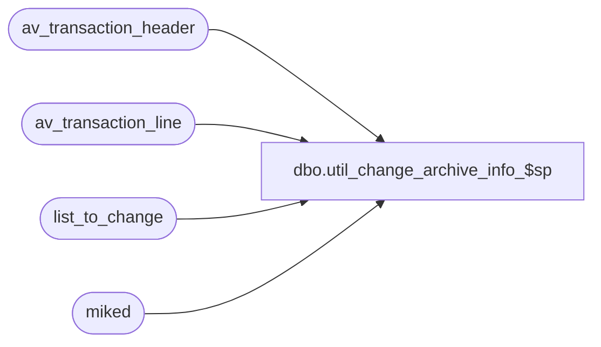

# dbo.util_change_archive_info_$sp

**Database:** auditworks  
**Server:** bedrockdb01  

## Architecture Diagram



## Table Dependencies

| Referenced Table |
|---|
| av_transaction_header |
| av_transaction_line |
| list_to_change |
| miked |

## Stored Procedure Code

```sql
CREATE proc  dbo.util_change_archive_info_$sp 
                                 
AS
/*
by: MikeD.
Client asked for a change to their auditworks archive tables...
Example...
For the period @start_date to @end_date they want to change line_object @orig_line_object and line_action @orig_line_action
to @new_line_object and @new_line_action when the reference_no is @for_reference_no.
Set the variables accordingly...

@start_date
@end_date
@orig_line_object
@orig_line_action
@new_line_object
@new_line_action
@for_reference_no

*/

DECLARE
	@start_date		char(10),
	@end_date		char(10),
	@orig_line_object	smallint,
	@orig_line_action	tinyint,
	@new_line_object	smallint,
	@new_line_action	tinyint,
	@for_reference_no	varchar(20),
	@for_reference_no2	int,
	
	@errmsg 		varchar(255),	
	@errno 			int,	
	@object_name		varchar(255),	
	@process_no		smallint
	
	
select getdate()

SELECT 	
	@process_no = 999,
	@start_date = '11/29/2004',           -- change these variables accordingly.......
	@end_date = '11/29/2004',          -- change these variables accordingly.......
	@orig_line_object = 290,          -- change these variables accordingly.......
	@orig_line_action = 12,          -- change these variables accordingly.......
	@new_line_object = 1625,          -- change these variables accordingly.......
	@new_line_action = 20,          -- change these variables accordingly.......
	@for_reference_no = '6764'          -- change these variables accordingly.......

select	@for_reference_no2 = convert(int,@for_reference_no)
	
--CREATE TABLE miked (av_transaction_id numeric(12,0))

BEGIN TRANSACTION

TRUNCATE TABLE miked 

SELECT @errno = @@error
IF @errno <> 0
  BEGIN
	SELECT @errmsg = 'Unable to truncate table miked',
	       @object_name = 'miked'
	GOTO error
  END
        

/*CREATE TABLE list_to_change (
        av_transaction_id 	numeric(12,0),
        line_id			numeric(5,0),
        line_object		smallint,
        line_action		tinyint,
        reference_no 		varchar(20),
        gross_line_amount       line_amount,
	pos_discount_amount 	line_amount
        )
*/

TRUNCATE TABLE list_to_change

SELECT @errno = @@error
IF @errno <> 0
  BEGIN
	SELECT @errmsg = 'Unable to truncate table list_to_change',
	       @object_name = 'list_to_change'
	GOTO error
  END


-- list of av_transaction_ids for the given period...

insert miked (av_transaction_id)
select distinct ath.av_transaction_id
from av_transaction_header ath, av_transaction_line atl
where ath.av_transaction_id = atl.av_transaction_id
and ath.transaction_date between @start_date and @end_date 
and atl.line_object = @orig_line_object
and atl.line_action = @orig_line_action
and reference_type > 0


SELECT @errno = @@error
IF @errno <> 0
  BEGIN
	SELECT @errmsg = 'Unable to insert into table #miked',
	       @object_name = '#miked'
	GOTO error
  END

-- list of av_transaction_ids that need to be changed

insert list_to_change (
	av_transaction_id, 
	line_id, 
	line_object, 
	line_action, 
	reference_no,
	gross_line_amount, 
	pos_discount_amount
	)
select 	atl.av_transaction_id, 
	atl.line_id, 
	atl.line_object, 
	atl.line_action, 
	atl.reference_no, 
	atl.gross_line_amount, 
	atl.pos_discount_amount
from av_transaction_header ath, av_transaction_line atl, miked m
where ath.av_transaction_id = atl.av_transaction_id
and ath.av_transaction_id = m.av_transaction_id
and atl.line_object = @orig_line_object
and atl.line_action = @orig_line_action
and isnumeric(atl.reference_no) = 1
and reference_type > 0
and convert(INT, atl.reference_no) = @for_reference_no2 


SELECT @errno = @@error
IF @errno <> 0
  BEGIN
	SELECT @errmsg = 'Unable to insert into table #list_to_change',
	       @object_name = '#list_to_change'
	GOTO error
  END


/*
-- unrem this update statement to actually change the data in av_transaction_line
-- make sure you're variables are set correctly.
-- update statement to change line_object and line_actions

update av_transaction_line 
set line_object = @new_line_object, 
    line_action = @new_line_action
from av_transaction_line atl, list_to_change l
where atl.av_transaction_id = l.av_transaction_id
and atl.line_id = l.line_id

*/

select count(*) as 'how many trxn_ids were changed'	 from list_to_change


select getdate()

commit

RETURN

error:   /* Common error handler */


	SELECT @errmsg
	
/*        EXEC common_error_handling_$sp @process_no, @errno, @errmsg, 0, @message_id, 
        @process_name, @object_name, @operation_name, 1, 1, 
        @process_log_entry, @process_timestamp, @transaction_count
*/
	RETURN
```

