# dbo.util_client_repop_av_$sp

**Database:** auditworks  
**Server:** bedrockdb01  

## Architecture Diagram

```mermaid
flowchart LR
    SP["dbo.util_client_repop_av_$sp"]
    av_authorization_detail(["av_authorization_detail"]) --> SP
    av_customer(["av_customer"]) --> SP
    av_customer_detail(["av_customer_detail"]) --> SP
    av_discount_detail(["av_discount_detail"]) --> SP
    av_interface_control(["av_interface_control"]) --> SP
    av_line_note(["av_line_note"]) --> SP
    av_merchandise_detail(["av_merchandise_detail"]) --> SP
    av_payroll_detail(["av_payroll_detail"]) --> SP
    av_post_void_detail(["av_post_void_detail"]) --> SP
    av_return_detail(["av_return_detail"]) --> SP
    av_special_order_detail(["av_special_order_detail"]) --> SP
    av_stock_control_detail(["av_stock_control_detail"]) --> SP
    av_tax_detail(["av_tax_detail"]) --> SP
    av_tax_override_detail(["av_tax_override_detail"]) --> SP
    av_transaction_header(["av_transaction_header"]) --> SP
    av_transaction_line(["av_transaction_line"]) --> SP
    if_authorization_detail(["if_authorization_detail"]) --> SP
    if_customer(["if_customer"]) --> SP
    if_customer_detail(["if_customer_detail"]) --> SP
    if_discount_detail(["if_discount_detail"]) --> SP
    if_interface_control(["if_interface_control"]) --> SP
    if_line_note(["if_line_note"]) --> SP
    if_merchandise_detail(["if_merchandise_detail"]) --> SP
    if_payroll_detail(["if_payroll_detail"]) --> SP
    if_post_void_detail(["if_post_void_detail"]) --> SP
    if_return_detail(["if_return_detail"]) --> SP
    if_special_order_detail(["if_special_order_detail"]) --> SP
    if_stock_control_detail(["if_stock_control_detail"]) --> SP
    if_tax_detail(["if_tax_detail"]) --> SP
    if_tax_override_detail(["if_tax_override_detail"]) --> SP
    if_transaction_header(["if_transaction_header"]) --> SP
    if_transaction_line(["if_transaction_line"]) --> SP
    interface_directory(["interface_directory"]) --> SP
```



## Table Dependencies

| Referenced Table |
|---|
| av_authorization_detail |
| av_customer |
| av_customer_detail |
| av_discount_detail |
| av_interface_control |
| av_line_note |
| av_merchandise_detail |
| av_payroll_detail |
| av_post_void_detail |
| av_return_detail |
| av_special_order_detail |
| av_stock_control_detail |
| av_tax_detail |
| av_tax_override_detail |
| av_transaction_header |
| av_transaction_line |
| if_authorization_detail |
| if_customer |
| if_customer_detail |
| if_discount_detail |
| if_interface_control |
| if_line_note |
| if_merchandise_detail |
| if_payroll_detail |
| if_post_void_detail |
| if_return_detail |
| if_special_order_detail |
| if_stock_control_detail |
| if_tax_detail |
| if_tax_override_detail |
| if_transaction_header |
| if_transaction_line |
| interface_directory |

## Stored Procedure Code

```sql
CREATE   proc  dbo.util_client_repop_av_$sp 

AS

/* Proc Name:  util_repop_if_tables_av_$sp

-- NOTE: Any changes to this proc, must also be done to util_repop_if_tables_curr_$sp.


   Desc: repopulate interface tables from ARCHIVE tables to allow reprocessing.
      This version inserts only the transactions which are needed in the interface tables.
      NOTE: If the interface is not flagged by line_object (applicability_method != 0)
             and av_interface_control has not been populated,
             then you must change the insert to av_interface_control.

   IF av_interface_control is already populated, then rem out the insert to av_interface_control

History:
Date     Name       Def# Action
Nov17,03 Phu       15801 Populate sku_id, reason, imrd, style_reference_id, display_def_id
Dec19,02 Phu        5327 Retrieve gl_effect
Dec06,02 Winnie  1-H4466 Move declaration of cursor for MSSQL
Apr25,02 Phu     1-C9P5S Create entry in if_tax_detail
Sep24,01 ShuZ       8288 Add an originating_store_no to the stock_control_detail table for use
                         when head-office(or another store) enters a transacion on behalf of
                         another store
Jul27,01 Paul       8413 log transaction_id to if_transaction_header (same as av_transaction_id)
May28,01 Winnie	    8019 Log pos_deptclass and upc_lookup_division to if_stock_control_detail table
May16,01 Shapoor    7813 Add column originating_store_no to merchandise* tables to attribute 
			  the sale/return to the store where the sale originated.
May11,01 David C    7811 Add transaction_id to if_transaction_header
May09,01 Henry      7809 Allow reversals (negative entries).
Feb26,01 DavidM     7391 Add pos_identifier and pos_identifier_type fields to if_stock_control_detail.
*/

DECLARE

@applicability_method		tinyint,
@date_to_reprocess		smalldatetime,
@errmsg				VARCHAR(200),
@errno				int,
@rows				int,
@interface_id			tinyint,
@interface_status_flag		smallint,
@transaction_id			numeric(12,0),
@transaction_count		int,
@transactions_inserted		int,
@from_transaction_date		smalldatetime,
@to_transaction_date		smalldatetime,
@if_entry_no			numeric(12,0),
@reversal			int,
@store_no			int

/* { Customized variables set here */

SELECT	@interface_id = 26, -- change this
	@from_transaction_date = '07/23/2000', -- starting date
	@to_transaction_date = '07/23/2000', -- ending date or = getdate() if all
	@reversal = 1  -- 1 = normal entries,  -1 = reversals

/* } Customized variables set here */

SELECT 	@transaction_count = 0,
	@transactions_inserted = 0

SELECT @interface_status_flag = update_timing,
	@applicability_method = applicability_method
FROM interface_directory
WHERE interface_id = @interface_id
 
IF (@interface_status_flag IS NULL OR @interface_status_flag NOT IN (1,2))
  RETURN

IF @reversal NOT IN (1, -1)  -- only allow these values
  RETURN

SELECT @date_to_reprocess = @from_transaction_date

/* { Query recovery is based on */

DECLARE reprocess_trans CURSOR
  FOR
    SELECT DISTINCT ah.av_transaction_id
      FROM av_transaction_header ah, av_interface_control ic
     WHERE ah.av_transaction_id = ic.av_transaction_id
       AND ic.interface_id = @interface_id
       AND transaction_date = '2007-05-16'
   --    and store_no =
   --    and transaction_no =
   --    and register_no = 
FOR READ ONLY

WHILE 0=0
 BEGIN
  IF @date_to_reprocess > @to_transaction_date
    BREAK

/* insert av_if_interface_control first, if necessary

  IF applicability_method = 0
    BEGIN
     INSERT av_interface_control (
                av_transaction_id,           
                interface_id,
                interface_status_flag)
     SELECT DISTINCT
                th.av_transaction_id,           
                interface_id,
                @interface_status_flag
      FROM av_transaction_header th, av_transaction_line tl, interface_applicability_mass ia
     WHERE th.transaction_date = @date_to_reprocess
       AND th.transaction_void_flag IN (0,8)
       AND th.av_transaction_id = tl.av_transaction_id
AND line_void_flag = 0
       AND ia.interface_id = @interface_id
       AND th.transaction_category = ia.transaction_category
       AND tl.line_object = ia.line_object
       AND tl.line_action = ia.line_action 

     SELECT @rows = @@rowcount
    END

  SELECT @transaction_count = @transaction_count + @rows
  SELECT @date_to_reprocess, @rows, ' transactions found.'
*/

  OPEN reprocess_trans
 
  WHILE 1=1
 
  BEGIN
  
     FETCH reprocess_trans
      INTO @transaction_id
  
  IF @@fetch_status <> 0
    BREAK

  begin transaction 
  INSERT INTO if_transaction_header (
		store_no,
		register_no,
		transaction_date,
		transaction_series,
		transaction_no,
		entry_date_time,
		cashier_no,
		transaction_category,
		tender_total,
		transaction_void_flag,
		customer_info_exists,
		exception_flag,
		deposit_declaration_flag,
		closeout_flag,
		media_count_flag,
		customer_modified_flag,
		tax_override_flag,
		pos_tax_jurisdiction,
		edit_timestamp,
		employee_no,
		transaction_remark,
		source_process_no,
		last_modified_date_time,
		in_use_timestamp,
		updated_by_user_name,
		transaction_id )
	SELECT
	        store_no,
		register_no,
		transaction_date,
		transaction_series,
		transaction_no,
		entry_date_time,
		cashier_no,
		transaction_category,
		tender_total,
		transaction_void_flag,
		customer_info_exists,
		exception_flag,
		deposit_declaration_flag,
		closeout_flag,
		media_count_flag,
		0,
		tax_override_flag,
		pos_tax_jurisdiction,
		edit_timestamp,
		employee_no,
		transaction_remark,
		101,
		last_modified_date_time,
		in_use_timestamp,
		updated_by_user_name,
		@transaction_id
	 FROM av_transaction_header
	WHERE av_transaction_id = @transaction_id

  SELECT @if_entry_no = @@identity,
  	  @transactions_inserted = @transactions_inserted + @@rowcount

  INSERT INTO if_transaction_line (
              if_entry_no,
		line_id,
		line_sequence,
		line_object_type,
		line_object,
		line_action,
		gross_line_amount,
		pos_discount_amount,
		db_cr_none,
		attachment_qty,
		exception_flag,
		interface_rejection_flag,
		line_void_flag,
		voiding_reversal_flag,
		edit_timestamp,
		reference_type,
		reference_no)
	SELECT @if_entry_no,
		line_id,
		line_sequence,
		line_object_type,
		line_object,
		line_action,
		(gross_line_amount * @reversal),
		(pos_discount_amount * @reversal),
		db_cr_none,
		attachment_qty,
		exception_flag,
		interface_rejection_flag,
		line_void_flag,
		voiding_reversal_flag,
		edit_timestamp,
		reference_type,
		reference_no
	 FROM av_transaction_line
	WHERE av_transaction_id = @transaction_id

    INSERT INTO if_return_detail (
		if_entry_no,
		line_id,
		return_reason_message,
		return_reason_code,
		mdse_disposition_code,
		via_warehouse_flag,
		return_from_store,
		return_from_reg,
		return_from_date,
		return_from_transno)
	SELECT @if_entry_no,
		line_id,
		return_reason_message,
		return_reason_code,
		mdse_disposition_code,
		via_warehouse_flag,
		return_from_store,
		return_from_reg,
		return_from_date,
		return_from_transno
	 FROM av_return_detail
	WHERE av_transaction_id = @transaction_id

    INSERT INTO if_post_void_detail (
		if_entry_no,
		line_id,
		post_voided_register,
		post_voided_trans_no,
		post_void_successful)
	SELECT @if_entry_no,
		line_id,
		post_voided_register,
		post_voided_trans_no,
		post_void_successful
	 FROM av_post_void_detail
	WHERE av_transaction_id = @transaction_id

    INSERT INTO if_discount_detail (
		if_entry_no,
		line_id,
		applied_by_line_id,
		pos_discount_level,
		pos_discount_type,
		pos_discount_amount,
		applied_flag,
		pos_discount_serial_no)
	SELECT @if_entry_no,
		line_id,
		applied_by_line_id,
		pos_discount_level,
		pos_discount_type,
		(pos_discount_amount * @reversal),
		applied_flag,
		pos_discount_serial_no
	 FROM av_discount_detail
	WHERE av_transaction_id = @transaction_id

    INSERT INTO if_merchandise_detail (
		if_entry_no,
		line_id,
		merchandise_category,
		upc_lookup_division,
		upc_no,
		units,
		salesperson,
		salesperson2,
		sku_id,
		style_reference_id,
		class_code,
		subclass_code,
		price_override,
		pos_iplu_missing,
		upc_on_file_flag,
		pos_deptclass,
		ticket_price,
		sold_at_price,
                scanned,
                pos_identifier,
                pos_identifier_type,
                originating_store_no)
	SELECT  @if_entry_no,
		line_id,
		merchandise_category,
		upc_lookup_division,
		upc_no,
		(units * @reversal),
		salesperson,
		salesperson2,
		sku_id,
		style_reference_id,
		class_code,
		subclass_code,
		price_override,
		pos_iplu_missing,
		upc_on_file_flag,
		pos_deptclass,
		ticket_price,
		sold_at_price,
                scanned,
                pos_identifier,
                pos_identifier_type,
                originating_store_no
	 FROM av_merchandise_detail
	WHERE av_transaction_id = @transaction_id

    INSERT INTO if_tax_override_detail (
		if_entry_no,
		line_id,
		tax_level,
		taxable,
		exception_tax_jurisdiction,
		tax_exempt_no)
	SELECT @if_entry_no,
		line_id,
		tax_level,
		taxable,
		exception_tax_jurisdiction,
		tax_exempt_no
	 FROM av_tax_override_detail
	WHERE av_transaction_id = @transaction_id

    INSERT INTO if_customer (
		if_entry_no,
		from_line_id,
		customer_role,
		title,
		first_name,
		last_name,
		address_1,
		address_2,
		city,
		county,
		state,
		country,
		post_code,
		telephone_no1,
		telephone_no2,
		customer_no)
	SELECT @if_entry_no,
		from_line_id,
		customer_role,
		title,
		first_name,
		last_name,
		address_1,
		address_2,
		city,
		county,
		state,
		country,
		post_code,
		telephone_no1,
		telephone_no2,
		customer_no
	 FROM av_customer
	WHERE av_transaction_id = @transaction_id

    INSERT INTO if_customer_detail (
		if_entry_no,
		from_line_id,
		customer_role,
		customer_info_type,
		customer_info)
	SELECT @if_entry_no,
		from_line_id,
		customer_role,
		customer_info_type,
		customer_info
	 FROM av_customer_detail
	WHERE av_transaction_id = @transaction_id

    INSERT INTO if_special_order_detail (
		if_entry_no,
		line_id,
		units,
		merchandise_description,
		expecting_delivery_on,
		color_description,
		size_description,
		width_description,
		vendor_name,
		vendor_style_description,
		spo_class_description)
	SELECT @if_entry_no,
		line_id,
		(units * @reversal),
		merchandise_description,
		expecting_delivery_on,
		color_description,
		size_description,
		width_description,
		vendor_name,
		vendor_style_description,
		spo_class_description
	 FROM av_special_order_detail
	WHERE av_transaction_id = @transaction_id

    INSERT INTO if_stock_control_detail (
		if_entry_no,
		line_id,
		upc_no,
		merchandise_key,
		initiated_by_host,
		units,
		other_store_no,
		location_no,
		vendor_no,
		count_date,
		pos_identifier,
		pos_identifier_type,
		pos_deptclass,
		upc_lookup_division,
		originating_store_no,
		display_def_id,
		sku_id,
		reason,
		imrd,
		style_reference_id)
	SELECT @if_entry_no,
		line_id,
		upc_no,
		merchandise_key,
		initiated_by_host,
		(units * @reversal),
		other_store_no,
		location_no,
		vendor_no,
		count_date,
		pos_identifier,
		pos_identifier_type,
		pos_deptclass,
		upc_lookup_division,
		originating_store_no,
		display_def_id,
		sku_id,
		reason,
		imrd,
		style_reference_id
	 FROM av_stock_control_detail
	WHERE av_transaction_id = @transaction_id

    INSERT INTO if_authorization_detail (
		if_entry_no,
		line_id,
		card_type,
		authorization_no,
		expiry_date,
		swipe_indicator,
		approval_message,
		license_no,
		other_id_type,
		other_id)
	SELECT @if_entry_no,
		line_id,
		card_type,
		authorization_no,
		expiry_date,
		swipe_indicator,
		approval_message,
		license_no,
		other_id_type,
		other_id
	 FROM av_authorization_detail
	WHERE av_transaction_id = @transaction_id

    INSERT INTO if_payroll_detail (
		if_entry_no,
		line_id,
		employee_payroll_id,
		employee_type,
		payroll_entry_type)
	SELECT @if_entry_no,
		line_id,
		employee_payroll_id,
		employee_type,
		payroll_entry_type
	 FROM av_payroll_detail
	WHERE av_transaction_id = @transaction_id

    INSERT INTO if_line_note (
	    if_entry_no,
	    line_id,
	    note_type,
	    line_note)
    SELECT  @if_entry_no,
	    line_id,
	    note_type,
	    line_note	
      FROM  av_line_note	
     WHERE  av_transaction_id = @transaction_id

    INSERT if_tax_detail (
	if_entry_no,
	line_id,
	tax_level,
	tax_jurisdiction,
	tax_category,
	tax_rate_code,
	taxable_amount,
	tax_amount,
	combined_rate,
	nontaxable_amount,
	tax_amount_expected,
	tax_on_tax_level,
	tax_on_combined_rate,
	line_object_type,
	tax_strip_flag,
	gl_effect )
    SELECT
	@if_entry_no,
	line_id,
	tax_level,
	tax_jurisdiction,
	tax_category,
	tax_rate_code,
	taxable_amount,
	tax_amount,
	combined_rate,
	nontaxable_amount,
	tax_amount_expected,
	tax_on_tax_level,
	tax_on_combined_rate,
	line_object_type,
	tax_strip_flag,
	gl_effect
    FROM av_tax_detail
    WHERE av_transaction_id = @transaction_id

    INSERT INTO if_interface_control (
		if_entry_no,           
                interface_id,
                interface_control_flag,
                effective_date,
                interface_posting_date)
         SELECT @if_entry_no,
		@interface_id,
		10,
		getdate(),
		getdate()
           FROM av_interface_control
          WHERE av_transaction_id = @transaction_id
            AND interface_id = @interface_id
  

    COMMIT

  END
  
  CLOSE reprocess_trans  

  SELECT @date_to_reprocess = DATEADD(dd, 1, @date_to_reprocess)

 END -- While 0=0

 SELECT ' total transactions inserted to if_interface_control : ', @transaction_count
 SELECT ' total transactions inserted to if_transaction_header : ', @transactions_inserted

  DEALLOCATE reprocess_trans
 
RETURN
```

