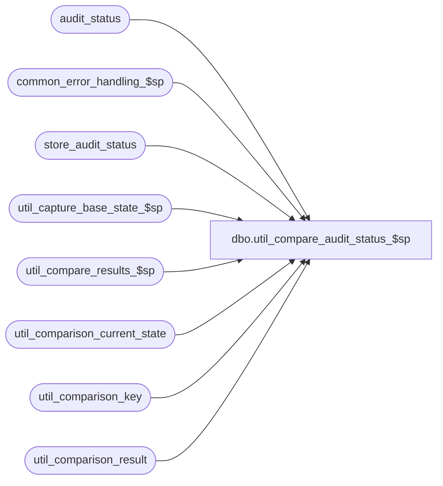

# dbo.util_compare_audit_status_$sp

**Database:** auditworks  
**Server:** bedrockdb01  

## Architecture Diagram



## Table Dependencies

| Referenced Table |
|---|
| audit_status |
| common_error_handling_$sp |
| store_audit_status |
| util_capture_base_state_$sp |
| util_compare_results_$sp |
| util_comparison_current_state |
| util_comparison_key |
| util_comparison_result |

## Stored Procedure Code

```sql
create proc dbo.util_compare_audit_status_$sp 

@comparison_id int = 5,
@dump_result tinyint = 0,
@capture_base_state tinyint = 0,
@from_posting_date datetime = '01/01/2002',
@to_posting_date datetime = null,
@from_store_no int = null,
@from_transaction_date datetime = null,
@to_store_no int = null,
@to_transaction_date datetime = null,
@status_message varchar(255) = null OUTPUT ,
@extra_count int = 0 OUTPUT,
@missing_count int = 0 OUTPUT,
@different_count int = 0 OUTPUT,
@minor_difference_count int = 0 OUTPUT,
@process_id int = NULL OUTPUT,
@errmsg varchar(255) = null OUTPUT
AS

/*
NAME:	util_compare_audit_status_$sp
DESCRIPTION: To capture the content of the audit_status and store_audit_status table entries 
	     posted within the time interval or for the store/date passed in, and compare it
	     to a base state saved earlier.

HISTORY:
Date     Author       Defect# Desc
Oct18,04 David        DV-1146 Use status_set_by_user_id 
Jun10,03 Vicci           9504 author
*/

DECLARE 
	@errno				int,
	@message_id		        int,	
	@object_name			varchar(255),
	@operation_name			varchar(100),
	@print_message			varchar(255),
	@process_no			int,
	@process_name		        varchar(100),
	@sequence_no			int 	

SELECT @process_name = 'util_compare_audit_status_$sp',
       @process_no = 36,
       @message_id = 201068,
       @to_posting_date = IsNull(dateadd(dd, 1, @to_posting_date), getdate()),
       @process_id = IsNull(@process_id, @@spid),
       @sequence_no = 0

DELETE util_comparison_result
 WHERE process_id = @process_id
   OR comparison_id = @comparison_id
SELECT @errno = @@error
  IF @errno != 0
    BEGIN
      SELECT @errmsg = 'Failed to clean util_comparison_result',
             @object_name = 'util_comparison_result',
             @operation_name = 'DELETE'      
      GOTO error
    END

DELETE util_comparison_current_state
 WHERE process_id = @process_id
    OR comparison_id = @comparison_id
SELECT @errno = @@error
  IF @errno != 0
    BEGIN
      SELECT @errmsg = 'Failed to clean util_comparison_current_state',
             @object_name = 'util_comparison_current_state',
             @operation_name = 'DELETE'      
      GOTO error
    END

DELETE util_comparison_key
 WHERE process_id = @process_id
SELECT @errno = @@error
  IF @errno != 0
    BEGIN
      SELECT @errmsg = 'Failed to clean util_comparison_key',
             @object_name = 'util_comparison_key',
             @operation_name = 'DELETE'      
      GOTO error
    END

INSERT INTO util_comparison_current_state( 
  		process_id, comparison_id, table_name, validation_area, 
  		comparison_key, 
  		comparison_text1, 
  		comparison_text2,
  		comparison_text_minor)
SELECT  @process_id, @comparison_id, 'audit_status', 'Reg Status', 
        CONVERT(varchar, a.store_no) + ' _ ' + CONVERT(varchar, a.register_no) + ' _ ' + 
	CONVERT(varchar, a.sales_date) + ' _ ' + CONVERT(varchar, a.date_reject_id),
        CONVERT(varchar, a.audit_status) + ' _ ' + CONVERT(varchar, status_set_by_user_id) + ' _ ' +
        CONVERT(varchar, a.update_in_progress) + ' _ ' + 
        CONVERT(varchar, a.trickle_in_progress_flag) + ' _ ' + 
        CONVERT(varchar, a.completion_date_time, 9) + ' _ ' + 
        CONVERT(varchar, a.archived_flag),
	a.register_poll_id,
        a.status_remark
  FROM audit_status a
 WHERE (a.status_date >= @from_posting_date OR a.edited_date >= @from_posting_date)
   AND (a.status_date < @to_posting_date OR a.edited_date < @to_posting_date)
   AND a.store_no >= IsNull(@from_store_no,store_no)
   AND a.store_no <= IsNull(@to_store_no,store_no)
   AND a.sales_date >= IsNull(@from_transaction_date,a.sales_date)
   AND a.sales_date <= IsNull(@to_transaction_date,a.sales_date)

SELECT @errno = @@error
  IF @errno != 0
    BEGIN
      SELECT @errmsg = 'Failed to list current content (Reg Status) of audit_status',
             @object_name = 'util_comparison_current_state',
             @operation_name = 'INSERT'      
      GOTO error
    END

INSERT INTO util_comparison_current_state( 
  		process_id, comparison_id, table_name, validation_area, 
  		comparison_key, 
  		comparison_text1, 
  		comparison_text2,
  		comparison_text_minor)
SELECT  @process_id, @comparison_id, 'audit_status', 'Statistics', 
        CONVERT(varchar, a.store_no) + ' _ ' + CONVERT(varchar, a.register_no) + ' _ ' + 
	CONVERT(varchar, a.sales_date) + ' _ ' + CONVERT(varchar, a.date_reject_id),
       CONVERT(varchar, a.sa_reject_qty) + ' _ ' + 
       CONVERT(varchar, a.if_reject_qty) + ' _ ' + 
       CONVERT(varchar, a.exception_qty) + ' _ ' +
       CONVERT(varchar, a.missing_qty) + ' _ '  +
       CONVERT(varchar, a.translate_error_qty) + ' _ ' +
       CONVERT(varchar, a.duplicate_qty) + ' _ '  +
       CONVERT(varchar, a.valid_qty),
        CONVERT(varchar, a.exceptions_verified) + ' _ ' +
        CONVERT(varchar, a.missing_verified) + ' _ '  + 
        CONVERT(varchar, a.translate_error_verified) + ' _ ' +
        CONVERT(varchar, a.duplicate_verified),
       ' '  
  FROM audit_status a
 WHERE (a.status_date >= @from_posting_date OR a.edited_date >= @from_posting_date)
   AND (a.status_date < @to_posting_date OR a.edited_date < @to_posting_date)
   AND a.store_no >= IsNull(@from_store_no,store_no)
   AND a.store_no <= IsNull(@to_store_no,store_no)
   AND a.sales_date >= IsNull(@from_transaction_date,a.sales_date)
   AND a.sales_date <= IsNull(@to_transaction_date,a.sales_date)

SELECT @errno = @@error
  IF @errno != 0
    BEGIN
      SELECT @errmsg = 'Failed to list current content (Statistics) of audit_status',
             @object_name = 'util_comparison_current_state',
             @operation_name = 'INSERT'      
      GOTO error
    END

INSERT INTO util_comparison_current_state( 
  		process_id, comparison_id, table_name, validation_area, 
  		comparison_key, 
  		comparison_text1, 
  		comparison_text2,
  		comparison_text_minor)
SELECT  @process_id, @comparison_id, 'audit_status', 'Media Rec', 
        CONVERT(varchar, a.store_no) + ' _ ' + CONVERT(varchar, a.register_no) + ' _ ' + 
	CONVERT(varchar, a.sales_date) + ' _ ' + CONVERT(varchar, a.date_reject_id),
       CONVERT(varchar, a.short_by_tender_over_limit) + ' _ ' + 
       CONVERT(varchar, a.opening_drawer_discrepancy) + ' _ ' + 
       CONVERT(varchar, a.media_rec_verified) + ' _ ' + 
       CONVERT(varchar, a.media_short) + ' _ ' +
       CONVERT(varchar, a.unreconciled_media_present), 
       ' ',
       ' '
  FROM audit_status a
 WHERE (a.status_date >= @from_posting_date OR a.edited_date >= @from_posting_date)
   AND (a.status_date < @to_posting_date OR a.edited_date < @to_posting_date)
   AND a.store_no >= IsNull(@from_store_no,store_no)
   AND a.store_no <= IsNull(@to_store_no,store_no)
   AND a.sales_date >= IsNull(@from_transaction_date,a.sales_date)
   AND a.sales_date <= IsNull(@to_transaction_date,a.sales_date)

SELECT @errno = @@error
  IF @errno != 0
    BEGIN
      SELECT @errmsg = 'Failed to list current content (Media Rec) of audit_status',
             @object_name = 'util_comparison_current_state',
             @operation_name = 'INSERT'      
      GOTO error
    END
 
INSERT INTO util_comparison_current_state( 
  		process_id, comparison_id, table_name, validation_area, 
  		comparison_key, 
  		comparison_text1, 
  		comparison_text2,
  		comparison_text_minor)
SELECT  @process_id, @comparison_id, 'store_audit_status', 'Status', 
        CONVERT(varchar, a.store_no) + ' _ ' + 
	CONVERT(varchar, a.sales_date) + ' _ ' + CONVERT(varchar, a.date_reject_id),
        CONVERT(varchar, a.store_audit_status) + ' _ ' + CONVERT(varchar, status_set_by_user_id) + ' _ ' +
        CONVERT(varchar, a.update_in_progress) + ' _ ' + 
        CONVERT(varchar, a.trickle_in_progress_flag) + ' _ ' + 
        CONVERT(varchar, a.archived_flag),
       CONVERT(varchar, a.short_by_tender_over_limit) + ' _ ' + 
       CONVERT(varchar, a.opening_drawer_discrepancy) + ' _ ' + 
       CONVERT(varchar, a.media_rec_verified) + ' _ ' + 
       CONVERT(varchar, a.media_short),
        a.status_remark
  FROM store_audit_status a
 WHERE (a.store_status_date >= @from_posting_date OR a.day_end_posting_date >= @from_posting_date)
   AND (a.store_status_date < @to_posting_date OR a.day_end_posting_date < @to_posting_date)
   AND a.store_no >= IsNull(@from_store_no,store_no)
   AND a.store_no <= IsNull(@to_store_no,store_no)
   AND a.sales_date >= IsNull(@from_transaction_date,a.sales_date)
   AND a.sales_date <= IsNull(@to_transaction_date,a.sales_date)

SELECT @errno = @@error
  IF @errno != 0
    BEGIN
      SELECT @errmsg = 'Failed to list current content (Status) of store_audit_status',
             @object_name = 'util_comparison_current_state',
             @operation_name = 'INSERT'      
      GOTO error
    END


IF @capture_base_state <> 1
BEGIN
 EXEC util_compare_results_$sp @comparison_id, @status_message OUTPUT, @extra_count OUTPUT,
			      @missing_count OUTPUT, @different_count OUTPUT, 
			      @minor_difference_count OUTPUT, @process_id, @errmsg OUTPUT
 SELECT @errno = @@error
  IF @errno != 0
    BEGIN
      IF @errmsg IS NULL /* then */
        SELECT @errmsg = 'Failed to obtain comparison of current results and base state'
      SELECT @object_name = 'util_compare_results_$sp',
             @operation_name = 'EXECUTE'
      GOTO error
    END
END
ELSE
BEGIN
 EXEC util_capture_base_state_$sp @comparison_id, @process_id, @errmsg OUTPUT
 SELECT @errno = @@error
  IF @errno != 0
    BEGIN
      IF @errmsg IS NULL /* then */
        SELECT @errmsg = 'Failed to save current results as base state'
      SELECT @object_name = 'util_capture_base_state_$sp',
             @operation_name = 'EXECUTE'
      GOTO error
    END
END

IF @capture_base_state <> 1
BEGIN
 SELECT @print_message = ':LOG Results for process_id ' + CONVERT(varchar,@process_id) + ', comparison_id ' +
 CONVERT(varchar,@comparison_id) + ':  ' + @status_message + ' 
Extra entries = ' + CONVERT(varchar,@extra_count) + '
Missing entries = ' + CONVERT(varchar,@missing_count) + '
Different entries = ' + CONVERT(varchar,@different_count) + '
Minor differences = ' + CONVERT(varchar,@minor_difference_count)

 PRINT @print_message

 IF @dump_result = 1
  SELECT util_comparison_result.process_id, util_comparison_result.comparison_id, util_comparison_result.comparison_time, util_comparison_result.status, util_comparison_result.table_name, util_comparison_result.validation_area, util_comparison_result.comparison_key, util_comparison_result.comparison_text1, util_comparison_result.comparison_text2, util_comparison_result.comparison_text_minor, util_comparison_result.new_comparison_text1, util_comparison_result.new_comparison_text2, util_comparison_result.new_comparison_text_minor 
    FROM util_comparison_result
   WHERE process_id = @process_id
     AND comparison_id = @comparison_id
END

DELETE util_comparison_key
 WHERE process_id = @process_id
SELECT @errno = @@error
  IF @errno != 0
    BEGIN
      SELECT @errmsg = 'Failed to do final cleanup of util_comparison_key',
             @object_name = 'util_comparison_key',
             @operation_name = 'DELETE'      
      GOTO error
    END

RETURN

error:

	EXEC common_error_handling_$sp @process_no, @errno, @errmsg, 0, @message_id, 
	@process_name, @object_name, @operation_name, 1
	RETURN
```

