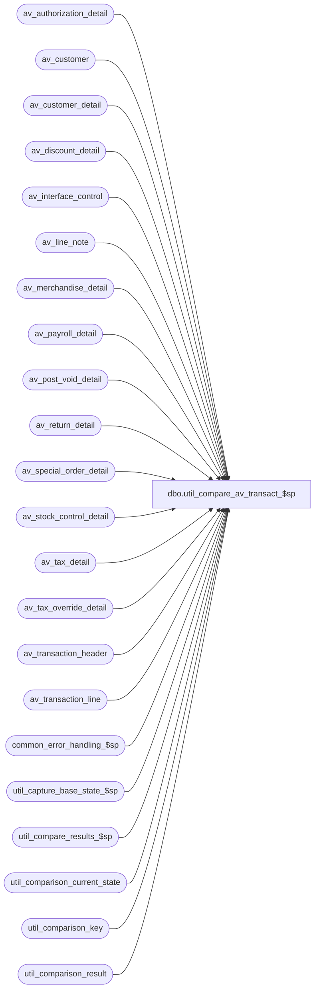

# dbo.util_compare_av_transact_$sp

**Database:** auditworks  
**Server:** bedrockdb01  

## Architecture Diagram



## Table Dependencies

| Referenced Table |
|---|
| av_authorization_detail |
| av_customer |
| av_customer_detail |
| av_discount_detail |
| av_interface_control |
| av_line_note |
| av_merchandise_detail |
| av_payroll_detail |
| av_post_void_detail |
| av_return_detail |
| av_special_order_detail |
| av_stock_control_detail |
| av_tax_detail |
| av_tax_override_detail |
| av_transaction_header |
| av_transaction_line |
| common_error_handling_$sp |
| util_capture_base_state_$sp |
| util_compare_results_$sp |
| util_comparison_current_state |
| util_comparison_key |
| util_comparison_result |

## Stored Procedure Code

```sql
create proc dbo.util_compare_av_transact_$sp 


@comparison_id int = 2,
@dump_result tinyint = 0,
@capture_base_state tinyint = 0,
@from_posting_date datetime = '01/01/2002',
@to_posting_date datetime = null,
@from_store_no int = null,
@from_transaction_date datetime = null,
@to_store_no int = null,
@to_transaction_date datetime = null,
@interface_id tinyint = null,
@status_message varchar(255) = null OUTPUT ,
@extra_count int = 0 OUTPUT,
@missing_count int = 0 OUTPUT,
@different_count int = 0 OUTPUT,
@minor_difference_count int = 0 OUTPUT,
@process_id int = NULL OUTPUT,
@errmsg varchar(255) = null OUTPUT
AS

/*
NAME:	util_compare_av_transact_$sp
DESCRIPTION: To capture the content of the transaction table entries posted within the time
	     interval or for the store/date passed in, and compare it to a base state saved 
	     earlier.

NOTE:  entries resulting from Transaction Add will show as differences since the
entry_date_time which forms part of their key will likely change each time the test-case is
run.

HISTORY:
Date     Author       Defect Desc
Mar22,05 Maryam      DV-1202 Rename from_line_id to line_id.
Jan28,05 Paul        48293/DV-1203 correctly set @to_posting_date
Sep23,04 Paul        DV-1146 remove updated_by_user_name
Nov17,03 Phu           15801 Populate sku_id, reason, imrd, style_reference_id, display_def_id
Feb28,03 Winnie         6554 Create Archived transactions comparison utility

*/
DECLARE @from_timestamp			float,
	@to_timestamp			float,
	@transaction_key		numeric(12,0),
	@cursor_open			tinyint,
	@errno				int,
	@message_id		        int,	
	@object_name			varchar(255),
	@operation_name			varchar(100),
	@print_message			varchar(255),
	@process_no			int,
	@process_name		        varchar(100),
	@sequence_no			int 	

SELECT @process_name = 'util_compare_av_transact_$sp',
       @process_no = 36,
       @message_id = 201068,
       @to_posting_date = convert(datetime, '12/31/' + convert(varchar,datepart(yy, getdate()))),
       @process_id = IsNull(@process_id, @@spid),
       @sequence_no = 0

SELECT @from_timestamp = DATEPART ( mm, @from_posting_date ) * 100000000000.0
		+ DATEPART ( dd, @from_posting_date )* 1000000000.0
		+ DATEPART ( hh, @from_posting_date ) * 10000000.0
		+ DATEPART ( mi, @from_posting_date ) * 100000.0
		+ DATEPART ( ss, @from_posting_date ) * 1000.0
		+ DATEPART ( ms, @from_posting_date ),
       @to_timestamp = DATEPART ( mm, @to_posting_date ) * 100000000000.0
		+ DATEPART ( dd, @to_posting_date )* 1000000000.0
		+ DATEPART ( hh, @to_posting_date ) * 10000000.0
		+ DATEPART ( mi, @to_posting_date ) * 100000.0
		+ DATEPART ( ss, @to_posting_date ) * 1000.0
		+ DATEPART ( ms, @to_posting_date )

DELETE util_comparison_result
 WHERE process_id = @process_id
   OR comparison_id = @comparison_id

SELECT @errno = @@error
  IF @errno != 0
    BEGIN
      SELECT @errmsg = 'Failed to clean util_comparison_result',
             @object_name = 'util_comparison_result',
             @operation_name = 'DELETE'      
      GOTO error
    END

DELETE util_comparison_current_state
 WHERE process_id = @process_id
    OR comparison_id = @comparison_id

SELECT @errno = @@error
  IF @errno != 0
    BEGIN
      SELECT @errmsg = 'Failed to clean util_comparison_current_state',
             @object_name = 'util_comparison_current_state',
             @operation_name = 'DELETE'      
      GOTO error
    END

DELETE util_comparison_key
 WHERE process_id = @process_id

SELECT @errno = @@error
  IF @errno != 0
    BEGIN
      SELECT @errmsg = 'Failed to clean util_comparison_key',
             @object_name = 'util_comparison_key',
             @operation_name = 'DELETE'      
      GOTO error
    END

IF @interface_id IS NULL
BEGIN
INSERT util_comparison_key(process_id, 
			   transaction_key,
			   sequence_datetime,
			   comparison_key)
SELECT @process_id,
       av_transaction_id,
    entry_date_time,
       CONVERT(varchar, store_no) + ' _ ' + CONVERT(varchar, register_no) + ' _ ' + 
	              CONVERT(varchar, transaction_date) + ' _ ' + CONVERT(varchar, date_reject_id) + ' _ ' + 
	 CONVERT(varchar, transaction_no) + ' _ ' + transaction_series + ' _ ' 
  FROM av_transaction_header
 WHERE (last_modified_date_time >= @from_posting_date OR edit_timestamp >= @from_timestamp)
   AND (last_modified_date_time < @to_posting_date OR edit_timestamp < @to_timestamp)
   AND store_no >= IsNull(@from_store_no,store_no)
   AND store_no <= IsNull(@to_store_no,store_no)
   AND transaction_date >= IsNull(@from_transaction_date,transaction_date)
   AND transaction_date <= IsNull(@to_transaction_date,transaction_date)

--Note:  transaction_date used instead of entry_date_time so that transaction-add test-case
--       differences may be reported as minor.

SELECT @errno = @@error
  IF @errno != 0
    BEGIN
      SELECT @errmsg = 'Failed to build list of transaction keys',
             @object_name = 'util_comparison_key',
             @operation_name = 'INSERT'      
      GOTO error
    END
END
ELSE
BEGIN
INSERT util_comparison_key(process_id, 
			   transaction_key,
			   sequence_datetime,
			   comparison_key)
SELECT DISTINCT @process_id,
       h.av_transaction_id,
       h.entry_date_time,
       CONVERT(varchar, h.store_no) + ' _ ' + CONVERT(varchar, h.register_no) + ' _ ' + 
	              CONVERT(varchar, h.transaction_date) + ' _ ' + CONVERT(varchar, h.date_reject_id) + ' _ ' + 
	              CONVERT(varchar, h.transaction_no) + ' _ ' + h.transaction_series + ' _ ' 
  FROM av_transaction_header h, av_interface_control i
 WHERE (h.last_modified_date_time >= @from_posting_date OR h.edit_timestamp >= @from_timestamp)
   AND (h.last_modified_date_time < @to_posting_date OR h.edit_timestamp < @to_timestamp)
   AND h.store_no >= IsNull(@from_store_no,h.store_no)
   AND h.store_no <= IsNull(@to_store_no,h.store_no)
   AND h.transaction_date >= IsNull(@from_transaction_date,h.transaction_date)
   AND h.transaction_date <= IsNull(@to_transaction_date,h.transaction_date)
   AND h.av_transaction_id = i.av_transaction_id
   AND (i.interface_id = @interface_id or @interface_id is null)

--Note:  transaction_date used instead of entry_date_time so that transaction-add test-case
--       differences may be reported as minor.

SELECT @errno = @@error
  IF @errno != 0
    BEGIN
      SELECT @errmsg = 'Failed to build list of transaction keys',
             @object_name = 'util_comparison_key',
             @operation_name = 'INSERT'      
      GOTO error
    END
END

DECLARE multiple_key_cursor CURSOR
 FOR
  SELECT u.transaction_key
    FROM util_comparison_key u
   WHERE u.process_id = @process_id
     AND u.comparison_key IN (SELECT m.comparison_key
     			        FROM util_comparison_key m
			       WHERE m.process_id = @process_id
			       GROUP BY m.comparison_key
			       HAVING COUNT(m.transaction_key) <> 1)
   ORDER BY u.comparison_key, u.sequence_datetime

SELECT @errno = @@error
IF @errno != 0
  BEGIN
    SELECT @errmsg = 'Failed to declare multiple_key_cursor CURSOR',
 	   @object_name = 'multiple_key_cursor',
	   @operation_name = 'DECLARE'
    GOTO error
  END
   
OPEN multiple_key_cursor

SELECT @errno = @@error
IF @errno != 0
  BEGIN
    SELECT @errmsg = 'Failed to open multiple_key_cursor CURSOR',
 	   @object_name = 'multiple_key_cursor',
	   @operation_name = 'OPEN'
    GOTO error
  END

SELECT @cursor_open = 1

FETCH multiple_key_cursor
 INTO @transaction_key

WHILE @@fetch_status = 0
BEGIN
  SELECT @sequence_no = @sequence_no + 1
  UPDATE util_comparison_key
     SET comparison_key = comparison_key + CONVERT(varchar, @sequence_no)
   WHERE process_id = @process_id 
     AND transaction_key = @transaction_key

  SELECT @errno = @@error
  IF @errno != 0
  BEGIN
    SELECT @errmsg = 'Failed to add a sequence number to the comparison-key',
 	   @object_name = 'util_comparison_key',
	   @operation_name = 'UPDATE'
    GOTO error
  END
   
FETCH multiple_key_cursor
 INTO @transaction_key

END /* while not end of multiple_key_cursor */

CLOSE multiple_key_cursor
DEALLOCATE multiple_key_cursor
SELECT @cursor_open = 0

INSERT INTO util_comparison_current_state( 
  		process_id, comparison_id, table_name, validation_area, 
  		comparison_key, 
  		comparison_text1, 
  		comparison_text2,
  		comparison_text_minor)
SELECT @process_id, @comparison_id, 'av_transaction_header', 'Archived Header Data', 
       u.comparison_key, 
       CONVERT(varchar, cashier_no) + ' _ ' + 
	 CONVERT(varchar, transaction_category) + ' _ ' + CONVERT(varchar, tender_total) + ' _ ' + 
	 CONVERT(varchar, transaction_void_flag) + ' _ ' + CONVERT(varchar, customer_info_exists) + ' _ ' + 
	 CONVERT(varchar, exception_flag) + ' _ ' + CONVERT(varchar, deposit_declaration_flag) + ' _ ' + 
	 CONVERT(varchar, sa_rejection_flag) + ' _ ' + CONVERT(varchar, if_rejection_flag) + ' _ ' + 
	 CONVERT(varchar, closeout_flag) + ' _ ' + CONVERT(varchar, media_count_flag) + ' _ ' + 
	 CONVERT(varchar, customer_modified_flag) + ' _ ' + CONVERT(varchar, tax_override_flag) + ' _ ' +
	 pos_tax_jurisdiction + ' _ ' + CONVERT(varchar, employee_no),
       transaction_remark,
       CONVERT(varchar,h.entry_date_time, 9)
  FROM util_comparison_key u, av_transaction_header h
 WHERE u.transaction_key = h.av_transaction_id
   AND u.process_id = @process_id

SELECT @errno = @@error
  IF @errno != 0
    BEGIN
      SELECT @errmsg = 'Failed to list current content of av_transaction_header',
             @object_name = 'util_comparison_current_state',
             @operation_name = 'INSERT'      
      GOTO error
    END
 
INSERT INTO util_comparison_current_state( 
  		process_id, comparison_id, table_name, validation_area, 
  		comparison_key, 
  		comparison_text1, 
  		comparison_text2,
  		comparison_text_minor)
SELECT @process_id, @comparison_id, 'av_interface_control', 'Archived Interface Control', 
       u.comparison_key + ' _ ' + CONVERT(varchar, interface_id),
       CONVERT(varchar, interface_status_flag),
       null,
       null  
  FROM util_comparison_key u, av_interface_control i
 WHERE u.transaction_key = i.av_transaction_id
   AND u.process_id = @process_id
   AND (i.interface_id = @interface_id OR @interface_id IS NULL)
   
SELECT @errno = @@error
  IF @errno != 0
    BEGIN
      SELECT @errmsg = 'Failed to list current content of av_interface_control',
             @object_name = 'util_comparison_current_state',
             @operation_name = 'INSERT'      
      GOTO error
    END

INSERT INTO util_comparison_current_state( 
  		process_id, comparison_id, table_name, validation_area, 
  		comparison_key, 
  		comparison_text1, 
  		comparison_text2,
  		comparison_text_minor)
SELECT @process_id, @comparison_id, 'av_transaction_line', 'Archived Transaction Lines', 
       u.comparison_key + ' _ ' + CONVERT(varchar, line_id),
       CONVERT(varchar, line_sequence) + ' _ ' + CONVERT(varchar, line_object_type) + ' _ ' + 
       CONVERT(varchar, line_object) + ' _ ' + CONVERT(varchar, line_action) + ' _ ' + 
       CONVERT(varchar, gross_line_amount) + ' _ ' + CONVERT(varchar, pos_discount_amount) + ' _ ' + 
       CONVERT(varchar, db_cr_none) + ' _ ' + CONVERT(varchar, attachment_qty) + ' _ ' +        
       CONVERT(varchar, exception_flag) + ' _ ' + CONVERT(varchar, interface_rejection_flag) + ' _ ' +        
       CONVERT(varchar, line_void_flag) + ' _ ' + CONVERT(varchar, voiding_reversal_flag) + ' _ ' +        
       CONVERT(varchar, reference_type) + ' _ ' + CONVERT(varchar, reference_no),
       null,
       null  
  FROM util_comparison_key u, av_transaction_line l
 WHERE u.transaction_key = l.av_transaction_id
   AND u.process_id = @process_id

SELECT @errno = @@error
  IF @errno != 0
    BEGIN
      SELECT @errmsg = 'Failed to list current content of av_transaction_line',
             @object_name = 'util_comparison_current_state',
   @operation_name = 'INSERT'      
      GOTO error
    END

INSERT INTO util_comparison_current_state( 
  		process_id, comparison_id, table_name, validation_area, 
  		comparison_key, 
  		comparison_text1, 
  		comparison_text2,
  		comparison_text_minor)
SELECT @process_id, @comparison_id, 'av_merchandise_detail', 'Archived Merchandise Info', 
       u.comparison_key + ' _ ' + CONVERT(varchar, line_id),
       CONVERT(varchar, merchandise_category) + ' _ ' + CONVERT(varchar, upc_lookup_division) + ' _ ' + 
       CONVERT(varchar, upc_no) + ' _ ' + CONVERT(varchar, units) + ' _ ' +        
       CONVERT(varchar, salesperson) + ' _ ' + CONVERT(varchar, salesperson2) + ' _ ' + 
       CONVERT(varchar, sku_id) + ' _ ' + CONVERT(varchar, style_reference_id) + ' _ ' + 
       CONVERT(varchar, class_code) + ' _ ' + CONVERT(varchar, subclass_code) + ' _ ' +        
       CONVERT(varchar, price_override) + ' _ ' + CONVERT(varchar, pos_iplu_missing) + ' _ ' +        
       CONVERT(varchar, upc_on_file_flag) + ' _ ' + CONVERT(varchar, pos_deptclass) + ' _ ' +        
       CONVERT(varchar, ticket_price) + ' _ ' + CONVERT(varchar, sold_at_price) + ' _ ' +
       CONVERT(varchar, scanned) + ' _ ' + pos_identifier + ' _ ' + 
       CONVERT(varchar, pos_identifier_type) + ' _ ' + CONVERT(varchar, plu_price) + ' _ ' +
       CONVERT(varchar, originating_store_no),
       null,
       null  
  FROM util_comparison_key u, av_merchandise_detail m
 WHERE u.transaction_key = m.av_transaction_id
   AND u.process_id = @process_id

SELECT @errno = @@error
  IF @errno != 0
    BEGIN
      SELECT @errmsg = 'Failed to list current content of av_merchandise_detail',
             @object_name = 'util_comparison_current_state',
             @operation_name = 'INSERT'      
      GOTO error
    END

INSERT INTO util_comparison_current_state( 
  		process_id, comparison_id, table_name, validation_area, 
  		comparison_key, 
  		comparison_text1, 
  		comparison_text2,
  		comparison_text_minor)
SELECT @process_id, @comparison_id, 'av_discount_detail', 'Archived Discount Information', 
       u.comparison_key + ' _ ' + CONVERT(varchar, line_id) + ' _ ' + CONVERT(varchar, applied_by_line_id),
       CONVERT(varchar, pos_discount_level) + ' _ ' + CONVERT(varchar, pos_discount_type) + ' _ ' + 
       CONVERT(varchar, pos_discount_amount) + ' _ ' + CONVERT(varchar, applied_flag) + ' _ ' + 
       CONVERT(varchar, pos_discount_serial_no),
       null,
       null  
  FROM util_comparison_key u, av_discount_detail d
 WHERE u.transaction_key = d.av_transaction_id
   AND u.process_id = @process_id

SELECT @errno = @@error
  IF @errno != 0
    BEGIN
      SELECT @errmsg = 'Failed to list current content of av_discount_detail',
             @object_name = 'util_comparison_current_state',
             @operation_name = 'INSERT'      
      GOTO error
    END

INSERT INTO util_comparison_current_state( 
  		process_id, comparison_id, table_name, validation_area, 
  		comparison_key, 
  		comparison_text1, 
  		comparison_text2,
  		comparison_text_minor)
SELECT @process_id, @comparison_id, 'av_authorization_detail', 'Archived Authorization Info', 
       u.comparison_key + ' _ ' + CONVERT(varchar, line_id),
       card_type + ' _ ' + CONVERT(varchar, authorization_no) + ' _ ' + 
       CONVERT(varchar, expiry_date) + ' _ ' + CONVERT(varchar, swipe_indicator) + ' _ ' + 
       license_no + ' _ ' + pos_state_code + ' _ ' + 
       CONVERT(varchar, other_id_type) + ' _ ' + other_id + ' _ ' +
       CONVERT(varchar, deferred_billing_date) + ' _ ' + CONVERT(varchar, deferred_billing_plan) + ' _ ' + 
       CONVERT(varchar, customer_signature_obtained),
       approval_message,
       null   
  FROM util_comparison_key u, av_authorization_detail a
 WHERE u.transaction_key = a.av_transaction_id
   AND u.process_id = @process_id

SELECT @errno = @@error
  IF @errno != 0
    BEGIN
      SELECT @errmsg = 'Failed to list current content of av_authorization_detail',
       @object_name = 'util_comparison_current_state',
             @operation_name = 'INSERT'      
      GOTO error
    END

INSERT INTO util_comparison_current_state( 
  		process_id, comparison_id, table_name, validation_area, 
  		comparison_key, 
  		comparison_text1, 
  		comparison_text2,
  		comparison_text_minor)
SELECT @process_id, @comparison_id, 'av_customer', 'Archived Customer Information', 
       u.comparison_key + ' _ ' + CONVERT(varchar, line_id) + ' _ ' + CONVERT(varchar, customer_role),
       title + ' _ ' + first_name + ' _ ' + 
       last_name + ' _ ' + address_1 + ' _ ' + 
       address_2 + ' _ ' + city + ' _ ' + 
       county + ' _ ' + state + ' _ ' + 
       country + ' _ ' + post_code + ' _ ' + 
       telephone_no1 + ' _ ' + telephone_no2 + ' _ ' + 
       CONVERT(varchar, customer_no) + ' _ ' + CONVERT(varchar, more_info_flag) + ' _ ' + 
       pos_tax_jurisdiction_code + ' _ ' + fax + ' _ ' + email_address,
       null,
       null  
  FROM util_comparison_key u, av_customer c
 WHERE u.transaction_key = c.av_transaction_id
   AND u.process_id = @process_id

SELECT @errno = @@error
  IF @errno != 0
    BEGIN
      SELECT @errmsg = 'Failed to list current content of av_customer',
             @object_name = 'util_comparison_current_state',
             @operation_name = 'INSERT'      
      GOTO error
    END

INSERT INTO util_comparison_current_state( 
  		process_id, comparison_id, table_name, validation_area, 
  		comparison_key, 
  		comparison_text1, 
  		comparison_text2,
  		comparison_text_minor)
SELECT @process_id, @comparison_id, 'av_customer_detail', 'Archived Extra Customer Info', 
       u.comparison_key + ' _ ' + CONVERT(varchar, line_id) + ' _ ' + CONVERT(varchar, customer_role) + ' _ ' + CONVERT(varchar, customer_info_type),
       customer_info,
       null,
       null  
  FROM util_comparison_key u, av_customer_detail c
 WHERE u.transaction_key = c.av_transaction_id
   AND u.process_id = @process_id

SELECT @errno = @@error
  IF @errno != 0
    BEGIN
      SELECT @errmsg = 'Failed to list current content of av_customer_detail',
             @object_name = 'util_comparison_current_state',
             @operation_name = 'INSERT'      
      GOTO error
    END

INSERT INTO util_comparison_current_state( 
  		process_id, comparison_id, table_name, validation_area, 
  		comparison_key, 
  		comparison_text1, 
  		comparison_text2,
  		comparison_text_minor)
SELECT @process_id, @comparison_id, 'av_line_note', 'Archived Line Notes', 
       u.comparison_key + ' _ ' + CONVERT(varchar, line_id) + ' _ ' + CONVERT(varchar, note_type),
       line_note,
       null,
       null  
  FROM util_comparison_key u, av_line_note c
 WHERE u.transaction_key = c.av_transaction_id
   AND u.process_id = @process_id

SELECT @errno = @@error
  IF @errno != 0
    BEGIN
      SELECT @errmsg = 'Failed to list current content of av_line_note',
             @object_name = 'util_comparison_current_state',
             @operation_name = 'INSERT'      
      GOTO error
    END

INSERT INTO util_comparison_current_state( 
  		process_id, comparison_id, table_name, validation_area, 
  		comparison_key, 
  		comparison_text1, 
  		comparison_text2,
  		comparison_text_minor)
SELECT @process_id, @comparison_id, 'av_special_order_detail', 'Archived Special Order info', 
       u.comparison_key + ' _ ' + CONVERT(varchar, line_id),
       CONVERT(varchar, units) + ' _ ' + CONVERT(varchar, salesperson) + ' _ ' + 
       merchandise_description + ' _ ' + expecting_delivery_on + ' _ ' + 
       color_description + ' _ ' + size_description + ' _ ' + 
       width_description + ' _ ' + vendor_name + ' _ ' + 
       vendor_style_description + ' _ ' + spo_class_description + ' _ ' + 
       vendor_no,
       null,
       null  
FROM util_comparison_key u, av_special_order_detail o
 WHERE u.transaction_key = o.av_transaction_id
   AND u.process_id = @process_id

SELECT @errno = @@error
  IF @errno != 0
    BEGIN
      SELECT @errmsg = 'Failed to list current content of av_special_order_detail',
             @object_name = 'util_comparison_current_state',
             @operation_name = 'INSERT'      
      GOTO error
    END

INSERT INTO util_comparison_current_state( 
  		process_id, comparison_id, table_name, validation_area, 
  		comparison_key, 
  		comparison_text1, 
  		comparison_text2,
  		comparison_text_minor)
SELECT @process_id, @comparison_id, 'av_stock_control_detail', 'Archived Stock Control info', 
       u.comparison_key + ' _ ' + CONVERT(varchar, line_id),
       CONVERT(varchar, upc_no) + ' _ ' + CONVERT(varchar, merchandise_key) + ' _ ' + 
       CONVERT(varchar, initiated_by_host) + ' _ ' + CONVERT(varchar, units) + ' _ ' + 
       CONVERT(varchar, other_store_no) + ' _ ' + CONVERT(varchar, location_no) + ' _ ' + 
       vendor_no + ' _ ' + CONVERT(varchar, count_date) + ' _ ' + 
       pos_identifier + ' _ ' + CONVERT(varchar, pos_identifier_type) + ' _ ' + 
       CONVERT(varchar, pos_deptclass) + ' _ ' + CONVERT(varchar, upc_lookup_division) + ' _ ' + 
       CONVERT(varchar, originating_store_no) + ' _ ' +
       CONVERT(varchar, display_def_id) + ' _ ' +
       CONVERT(varchar, sku_id) + ' _ ' + reason + ' _ ' + imrd + ' _ ' +
       CONVERT(varchar, style_reference_id),
       null,
       null  
  FROM util_comparison_key u, av_stock_control_detail s
 WHERE u.transaction_key = s.av_transaction_id
   AND u.process_id = @process_id

SELECT @errno = @@error
  IF @errno != 0
    BEGIN
      SELECT @errmsg = 'Failed to list current content of av_stock_control_detail',
             @object_name = 'util_comparison_current_state',
             @operation_name = 'INSERT'      
      GOTO error
    END

INSERT INTO util_comparison_current_state( 
  		process_id, comparison_id, table_name, validation_area, 
  		comparison_key, 
  		comparison_text1, 
  		comparison_text2,
  		comparison_text_minor)
SELECT @process_id, @comparison_id, 'av_tax_override_detail', 'Archived Tax Override info', 
       u.comparison_key + ' _ ' + CONVERT(varchar, line_id) + ' _ ' + CONVERT(varchar, tax_level),
       CONVERT(varchar, tax_category) + ' _ ' + CONVERT(varchar, taxable) + ' _ ' +
       exception_tax_jurisdiction + ' _ ' + tax_exempt_no,
       null,
       null  
  FROM util_comparison_key u, av_tax_override_detail t
 WHERE u.transaction_key = t.av_transaction_id
   AND u.process_id = @process_id

SELECT @errno = @@error
  IF @errno != 0
    BEGIN
      SELECT @errmsg = 'Failed to list current content of av_tax_override_detail',
             @object_name = 'util_comparison_current_state',
             @operation_name = 'INSERT'      
      GOTO error
    END

INSERT INTO util_comparison_current_state( 
  		process_id, comparison_id, table_name, validation_area, 
  		comparison_key, 
  		comparison_text1, 
  		comparison_text2,
  		comparison_text_minor)
SELECT @process_id, @comparison_id, 'av_tax_detail', 'Archived Tax Detail info', 
       u.comparison_key + ' _ ' + CONVERT(varchar, line_id) + ' _ ' + CONVERT(varchar, tax_level),
       tax_jurisdiction + ' _ ' + CONVERT(varchar, tax_category) + ' _ ' + CONVERT(varchar, tax_rate_code) + ' _ ' +
       CONVERT(varchar, taxable_amount) + ' _ ' + CONVERT(varchar, tax_amount) + ' _ ' + 
       CONVERT(varchar, combined_rate) + ' _ ' + CONVERT(varchar, nontaxable_amount) + ' _ ' + 
       CONVERT(varchar, tax_amount_expected) + ' _ ' + CONVERT(varchar, tax_on_tax_level) + ' _ ' + 
       CONVERT(varchar, tax_on_combined_rate) + ' _ ' + CONVERT(varchar, line_object_type) + ' _ ' + 
       CONVERT(varchar, tax_strip_flag) + ' _ ' + CONVERT(varchar, gl_effect),
       null,
       null  
  FROM util_comparison_key u, av_tax_detail t
 WHERE u.transaction_key = t.av_transaction_id
   AND u.process_id = @process_id

SELECT @errno = @@error
  IF @errno != 0
    BEGIN
      SELECT @errmsg = 'Failed to list current content of av_tax_detail',
             @object_name = 'util_comparison_current_state',
             @operation_name = 'INSERT'      
      GOTO error
    END

INSERT INTO util_comparison_current_state( 
  		process_id, comparison_id, table_name, validation_area, 
  		comparison_key, 
  		comparison_text1, 
  		comparison_text2,
  		comparison_text_minor)
SELECT @process_id, @comparison_id, 'av_return_detail', 'Archived Return info', 
       u.comparison_key + ' _ ' + CONVERT(varchar, line_id),
       return_reason_message + ' _ ' + CONVERT(varchar, return_reason_code) + ' _ ' + 
       CONVERT(varchar, mdse_disposition_code) + ' _ ' + CONVERT(varchar, via_warehouse_flag) + ' _ ' + 
       CONVERT(varchar, original_salesperson) + ' _ ' + CONVERT(varchar, original_salesperson2) + ' _ ' + 
       CONVERT(varchar, return_from_store) + ' _ ' + CONVERT(varchar, return_from_reg) + ' _ ' + 
       CONVERT(varchar, return_from_date) + ' _ ' + CONVERT(varchar, return_from_transno),
       null,
       null  
  FROM util_comparison_key u, av_return_detail r
 WHERE u.transaction_key = r.av_transaction_id
   AND u.process_id = @process_id

SELECT @errno = @@error
  IF @errno != 0
    BEGIN
      SELECT @errmsg = 'Failed to list current content of av_return_detail',
             @object_name = 'util_comparison_current_state',
             @operation_name = 'INSERT'      
      GOTO error
    END

INSERT INTO util_comparison_current_state( 
  		process_id, comparison_id, table_name, validation_area, 
  		comparison_key, 
  		comparison_text1, 
  		comparison_text2,
  		comparison_text_minor)
SELECT @process_id, @comparison_id, 'av_post_void_detail', 'Archived Post Void info', 
       u.comparison_key + ' _ ' + CONVERT(varchar, line_id),
       CONVERT(varchar, post_voided_register) + ' _ ' + CONVERT(varchar, post_voided_trans_no) + ' _ ' + 
       CONVERT(varchar, post_void_successful) + ' _ ' + CONVERT(varchar, post_void_reason_code),
       null,
       null  
  FROM util_comparison_key u, av_post_void_detail v
 WHERE u.transaction_key = v.av_transaction_id
   AND u.process_id = @process_id

SELECT @errno = @@error
  IF @errno != 0
    BEGIN
      SELECT @errmsg = 'Failed to list current content of av_post_void_detail',
             @object_name = 'util_comparison_current_state',
             @operation_name = 'INSERT'      
      GOTO error
    END

INSERT INTO util_comparison_current_state( 
  		process_id, comparison_id, table_name, validation_area, 
  		comparison_key, 
  		comparison_text1, 
  		comparison_text2,
  		comparison_text_minor)
SELECT @process_id, @comparison_id, 'av_payroll_detail', 'Archived Payroll info', 
       u.comparison_key + ' _ ' + CONVERT(varchar, line_id),
       CONVERT(varchar, employee_no) + ' _ ' + CONVERT(varchar, payroll_date) + ' _ ' + 
       CONVERT(varchar, employee_payroll_id) + ' _ ' + CONVERT(varchar, employee_type) + ' _ ' + 
       CONVERT(varchar, payroll_entry_type),
       null,
       null  
  FROM util_comparison_key u, av_payroll_detail p
 WHERE u.transaction_key = p.av_transaction_id
   AND u.process_id = @process_id

SELECT @errno = @@error
  IF @errno != 0
    BEGIN
      SELECT @errmsg = 'Failed to list current content of av_payroll_detail',
             @object_name = 'util_comparison_current_state',
             @operation_name = 'INSERT'      
      GOTO error
    END

IF @capture_base_state <> 1
BEGIN
 EXEC util_compare_results_$sp @comparison_id, @status_message OUTPUT, @extra_count OUTPUT,
			      @missing_count OUTPUT, @different_count OUTPUT, 
			      @minor_difference_count OUTPUT, @process_id, @errmsg OUTPUT
 SELECT @errno = @@error
  IF @errno != 0
    BEGIN
      IF @errmsg IS NULL /* then */
 SELECT @errmsg = 'Failed to obtain comparison of current results and base state'
      SELECT @object_name = 'util_compare_results_$sp',
             @operation_name = 'EXECUTE'
      GOTO error
    END
END
ELSE
BEGIN
 EXEC util_capture_base_state_$sp @comparison_id, @process_id, @errmsg OUTPUT

 SELECT @errno = @@error
  IF @errno != 0
    BEGIN
      IF @errmsg IS NULL /* then */
        SELECT @errmsg = 'Failed to save current results as base state'
      SELECT @object_name = 'util_capture_base_state_$sp',
             @operation_name = 'EXECUTE'
      GOTO error
    END
END

IF @capture_base_state <> 1
BEGIN
 SELECT @print_message = ':LOG Results for process_id ' + CONVERT(varchar,@process_id) + ', comparison_id ' +
 CONVERT(varchar,@comparison_id) + ':  ' + @status_message + ' 
Extra entries = ' + CONVERT(varchar,@extra_count) + '
Missing entries = ' + CONVERT(varchar,@missing_count) + '
Different entries = ' + CONVERT(varchar,@different_count) + '
Minor differences = ' + CONVERT(varchar,@minor_difference_count)

 PRINT @print_message

 IF @dump_result = 1
  SELECT util_comparison_result.process_id, util_comparison_result.comparison_id, util_comparison_result.comparison_time, util_comparison_result.status, util_comparison_result.table_name, util_comparison_result.validation_area, util_comparison_result.comparison_key, util_comparison_result.comparison_text1, util_comparison_result.comparison_text2, util_comparison_result.comparison_text_minor, util_comparison_result.new_comparison_text1, util_comparison_result.new_comparison_text2, util_comparison_result.new_comparison_text_minor 
    FROM util_comparison_result
   WHERE process_id = @process_id
     AND comparison_id = @comparison_id
END


DELETE util_comparison_key
 WHERE process_id = @process_id

SELECT @errno = @@error
  IF @errno != 0
    BEGIN
      SELECT @errmsg = 'Failed to do final cleanup of util_comparison_key',
             @object_name = 'util_comparison_key',
             @operation_name = 'DELETE'      
      GOTO error
    END

RETURN

error:
	IF @cursor_open = 1
	  BEGIN
	   CLOSE multiple_key_cursor
	   DEALLOCATE multiple_key_cursor
	  END

	EXEC common_error_handling_$sp @process_no, @errno, @errmsg, 0, @message_id, 
	@process_name, @object_name, @operation_name, 1
	RETURN
```

