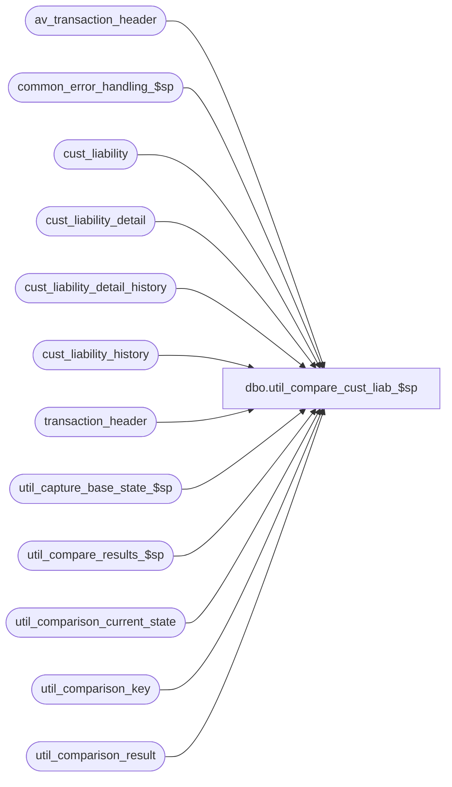

# dbo.util_compare_cust_liab_$sp

**Database:** auditworks  
**Server:** bedrockdb01  

## Architecture Diagram



## Table Dependencies

| Referenced Table |
|---|
| av_transaction_header |
| common_error_handling_$sp |
| cust_liability |
| cust_liability_detail |
| cust_liability_detail_history |
| cust_liability_history |
| transaction_header |
| util_capture_base_state_$sp |
| util_compare_results_$sp |
| util_comparison_current_state |
| util_comparison_key |
| util_comparison_result |

## Stored Procedure Code

```sql
create proc dbo.util_compare_cust_liab_$sp 

@comparison_id int = 1,
@dump_result tinyint = 0,
@capture_base_state tinyint = 0,
@from_interface_posting_date datetime = '01/01/2002', 
@to_interface_posting_date datetime = null,
@from_store_no int = null,
@from_transaction_date datetime = null,
@to_store_no int = null,
@to_transaction_date datetime = null,
@reference_type tinyint = null,
@status_message varchar(255) = null OUTPUT,
@extra_count int = 0 OUTPUT,
@missing_count int = 0 OUTPUT,
@different_count int = 0 OUTPUT,
@minor_difference_count int = 0 OUTPUT,
@process_id int = NULL OUTPUT,
@errmsg varchar(255) = null OUTPUT
AS

/*
NAME:	util_compare_cust_liab_$sp
DESCRIPTION: To capture the content of the interface table entries posted within the time
	     interval or for the store/date passed in, and compare it to a base state saved 
	     earlier.

NOTE:  entries resulting from Transaction Add will show as differences since the
entry_date_time which forms part of their key will likely change each time the test-case is
run.

HISTORY:
Date     Author       Defect Desc
Feb28,03 Winnie         6554 Create Customer Liability comparison utility

*/

DECLARE
	@process_key			numeric(12,0),
	@cursor_open			tinyint,
	@errno				int,
	@message_id		        int,	
	@object_name			varchar(255),
	@operation_name			varchar(100),
	@print_message			varchar(255),
	@process_no			int,
	@process_name		        varchar(100),
	@sequence_no			int,
	@reference_no			varchar(20),
	@key_store_no			int,
	@transaction_date		smalldatetime,
	@posting_date			datetime,
	@comparison_key			varchar(255),
	@rows				int,
	@prev_comparison_key		varchar(255),
	@line_object			smallint,
	@upc_no				numeric(14,0),
	@upc_lookup_division		tinyint,
	@discount_line_object		smallint
	
	
	
	 	

SELECT @process_name = 'util_compare_cust_liab_$sp',
       @process_no = 36,
       @message_id = 201068,
       @to_interface_posting_date = IsNull(dateadd(dd, 1, @to_interface_posting_date), getdate()),
       @process_id = IsNull(@process_id, @@spid),
       @sequence_no = 0,
       @prev_comparison_key = ' '

DELETE util_comparison_result
 WHERE process_id = @process_id
   OR comparison_id = @comparison_id
SELECT @errno = @@error
  IF @errno != 0
    BEGIN
      SELECT @errmsg = 'Failed to clean util_comparison_result',
             @object_name = 'util_comparison_result',
             @operation_name = 'DELETE'      
      GOTO error
    END

DELETE util_comparison_current_state
 WHERE process_id = @process_id
    OR comparison_id = @comparison_id
SELECT @errno = @@error
  IF @errno != 0
    BEGIN
      SELECT @errmsg = 'Failed to clean util_comparison_current_state',
             @object_name = 'util_comparison_current_state',
             @operation_name = 'DELETE'      
      GOTO error
    END

DELETE util_comparison_key
 WHERE process_id = @process_id
SELECT @errno = @@error
  IF @errno != 0
    BEGIN
      SELECT @errmsg = 'Failed to clean util_comparison_key',
             @object_name = 'util_comparison_key',
             @operation_name = 'DELETE'      
      GOTO error
    END

INSERT util_comparison_key(process_id, 
			   transaction_key,
			   sequence_datetime,
			   comparison_key,
			   ref_type)
SELECT @process_id,
       c.key_store_no,
       ISNULL(c.last_modified_by_aw, c.last_modified_by_pos),
       c.reference_no,
       c.reference_type
  FROM cust_liability c
 WHERE (c.date_issued >= @from_transaction_date OR @from_transaction_date IS NULL)
   AND (c.date_issued <= @to_transaction_date OR @to_transaction_date IS NULL)
   AND (c.reference_type = @reference_type OR @reference_type IS NULL)
   AND (c.issuing_store_no >= @from_store_no OR @from_store_no IS NULL)
   AND (c.issuing_store_no <= @to_store_no OR @to_store_no IS NULL)


SELECT @errno = @@error
  IF @errno != 0
    BEGIN
      SELECT @errmsg = 'Failed to build list of transaction keys',
             @object_name = 'util_comparison_key',
             @operation_name = 'INSERT'      
      GOTO error
    END

DELETE util_comparison_key
 WHERE process_id = @process_id
   AND comparison_key IS NULL --
 SELECT @errno = @@error
  IF @errno != 0
    BEGIN
      SELECT @errmsg = 'Failed to restrict list of comparison keys to selected store/date',
             @object_name = 'util_comparison_key',
             @operation_name = 'DELETE'      
      GOTO error
    END

INSERT INTO util_comparison_current_state( 
  		process_id, comparison_id, table_name, validation_area, 
  		comparison_key, 
  		comparison_text1, 
  		comparison_text2,
  		comparison_text_minor)
SELECT @process_id, @comparison_id, 'cust_liability', 'Customer Liability Data', 
       u.comparison_key + ' _ ' + CONVERT(varchar,u.ref_type) +' _ '+CONVERT(varchar,u.transaction_key),
       CONVERT(varchar,c.date_issued) + ' _ '+ CONVERT(varchar,c.issuing_store_no) + ' _ ' + CONVERT(varchar,c.tracking_id) + ' _ '+ 
       CONVERT(varchar,c.liability_amount) + ' _ ' + CONVERT(varchar,c.receivable_amount) + ' _ '+ 
       CONVERT(varchar,c.amount_3) + ' _ ' + CONVERT(varchar,c.amount_4) + ' _ '+ 
       CONVERT(varchar,c.amount_5) + ' _ ' + CONVERT(varchar,c.amount_6) + ' _ '+ 
       CONVERT(varchar,c.amount_7) + ' _ ' + CONVERT(varchar,c.amount_8) + ' _ '+ 
       CONVERT(varchar,c.amount_9) + ' _ ' + CONVERT(varchar,c.amount_10) + ' _ '+ 
       CONVERT(varchar,c.stocked_amount) + ' _ ' + CONVERT(varchar,c.stocked_flag) + ' _ '+ 
       CONVERT(varchar,c.stocked_stolen_flag) + ' _ ' + CONVERT(varchar,c.issued_flag),
       
       CONVERT(varchar,c.stolen_from_cust_flag) + ' _ ' + CONVERT(varchar,c.forfeited_flag) + ' _ '+ 
       CONVERT(varchar,c.assumed_completion_date) + ' _ ' + CONVERT(varchar,c.reopen_date) + ' _ '+ 
       CONVERT(varchar,c.expiry_date) +' _ '+ CONVERT(varchar,c.original_amount) + ' _ ' + 
       CONVERT(varchar,c.pos_status) + ' _ ' + CONVERT(varchar,c.pos_amount_1)+ ' _ ' + CONVERT(varchar,c.pos_amount_2)+ ' _ ' +
       CONVERT(varchar,c.pos_amount_3)+ ' _ ' + CONVERT(varchar,c.employee_no),
       null

  FROM util_comparison_key u, cust_liability c
 WHERE CONVERT(INT,u.transaction_key) = c.key_store_no
   AND u.comparison_key = c.reference_no
   AND u.ref_type = c.reference_type
   AND u.process_id = @process_id

SELECT @errno = @@error
  IF @errno != 0
    BEGIN
      SELECT @errmsg = 'Failed to list current content of cust_liability',
             @object_name = 'util_comparison_current_state',
             @operation_name = 'INSERT'      
      GOTO error
    END
 
INSERT INTO util_comparison_current_state( 
  		process_id, comparison_id, table_name, validation_area, 
  		comparison_key, 
  		comparison_text1, 
  		comparison_text2,
  		comparison_text_minor)
SELECT @process_id, @comparison_id, 'cust_liability', 'Customer Liab Customer Data', 
       u.comparison_key + ' _ ' + CONVERT(varchar,u.ref_type) +' _ '+CONVERT(varchar,u.transaction_key),
       c.title + ' _ ' + c.first_name + ' _ ' + c.last_name + ' _ ' + c.address_1+ ' _ ' +
       c.address_2 + ' _ ' + c.city + ' _ ' + c.county + ' _ ' + c.state + ' _ ' + c.country,
 
       c.post_code + ' _ ' + c.telephone_no1 + ' _ ' + c.telephone_no2 + ' _ ' +
       CONVERT(varchar,c.customer_no) + ' _ ' + c.pos_tax_jurisdiction_code + ' _ ' + 
       c.fax + ' _ ' + c.email_address,
       null

  FROM util_comparison_key u, cust_liability c
 WHERE CONVERT(INT,u.transaction_key) = c.key_store_no
   AND u.comparison_key = c.reference_no
   AND u.ref_type = c.reference_type
   AND u.process_id = @process_id

SELECT @errno = @@error
  IF @errno != 0
    BEGIN
      SELECT @errmsg = 'Failed to list current content of cust_liability customer data',
             @object_name = 'util_comparison_current_state',
             @operation_name = 'INSERT'      
      GOTO error
    END

INSERT INTO util_comparison_current_state( 
  		process_id, comparison_id, table_name, validation_area, 
  		comparison_key, 
  		comparison_text1, 
  		comparison_text2,
  		comparison_text_minor)
SELECT @process_id, @comparison_id, 'cust_liability_detail', 'Customer Liability Detail', 
       u.comparison_key + ' _ ' + CONVERT(varchar,u.ref_type) +' _ ' + 
       CONVERT(varchar,u.transaction_key) + ' _ ' + CONVERT(varchar,d.line_object) + ' _ ' + 
       CONVERT(varchar,d.upc_no) + ' _ ' + CONVERT(varchar,d.upc_lookup_division) + ' _ ' + 
       CONVERT(varchar,d.discount_line_object),
       
       CONVERT(varchar, d.location_store_no) + ' _ ' + CONVERT(varchar, d.location_no) + ' _ ' +
       CONVERT(varchar, d.amount_outstanding) + ' _ ' + CONVERT(varchar, d.units_outstanding) + ' _ ' +
       CONVERT(varchar, d.units_2) + ' _ ' + CONVERT(varchar, d.units_3) + ' _ ' +
       CONVERT(varchar, d.units_4) + ' _ ' + CONVERT(varchar, d.units_5),
       null,
       null  
  FROM util_comparison_key u, cust_liability_detail d
 WHERE CONVERT(INT,u.transaction_key) = d.key_store_no
   AND u.comparison_key = d.reference_no
   AND u.ref_type = d.reference_type
   AND u.process_id = @process_id
   
SELECT @errno = @@error
  IF @errno != 0
    BEGIN
      SELECT @errmsg = 'Failed to list current content of cust_liability_detail',
             @object_name = 'util_comparison_current_state',
             @operation_name = 'INSERT'      
      GOTO error
    END

DECLARE cust_liab_history_cursor CURSOR
 FOR
  SELECT h.reference_type,
         h.reference_no,
         h.key_store_no,
         h.transaction_date,
         h.process_no,
         h.process_key,
         h.posting_date
   FROM util_comparison_key u, cust_liability_history h
  WHERE CONVERT(INT,u.transaction_key) = h.key_store_no
    AND u.comparison_key = h.reference_no
    AND u.ref_type = h.reference_type
    AND u.process_id = @process_id
   ORDER BY h.reference_type, h.reference_no, h.key_store_no, h.transaction_date,
            h.process_no, h.process_key, h.posting_date
SELECT @errno = @@error
IF @errno != 0
  BEGIN
    SELECT @errmsg = 'Failed to declare cust_liab_history_cursor CURSOR',
 	   @object_name = 'cust_liab_history_cursor',
	   @operation_name = 'DECLARE'
    GOTO error
  END
   
OPEN cust_liab_history_cursor
SELECT @errno = @@error
IF @errno != 0
  BEGIN
    SELECT @errmsg = 'Failed to open cust_liab_history_cursor CURSOR',
 	   @object_name = 'cust_liab_history_cursor',
	   @operation_name = 'OPEN'
    GOTO error
  END

SELECT @cursor_open = 1

WHILE 1 = 1  
BEGIN

  FETCH cust_liab_history_cursor
   INTO @reference_type,
        @reference_no,
        @key_store_no,
        @transaction_date,
        @process_no,
        @process_key,
        @posting_date

  IF @@fetch_status <> 0
    BREAK
 
  SELECT @comparison_key = @reference_no + ' _ ' + CONVERT(VARCHAR,@reference_type) + ' _ ' + 
         CONVERT(VARCHAR,@key_store_no) + ' _ ' + CONVERT(VARCHAR,@transaction_date) + ' _ ' + 
         CONVERT(VARCHAR,@process_no) + ' _ ' + CONVERT(VARCHAR,store_no) + ' _ ' + 
         CONVERT(VARCHAR,register_no) + ' _ ' + CONVERT(VARCHAR,transaction_no) + ' _ ' + transaction_series
    FROM transaction_header
   WHERE transaction_id = @process_key         

  SELECT @errno = @@error, @rows = @@rowcount
  IF @errno != 0
  BEGIN
    SELECT @errmsg = 'Failed to select from transaction_header',
 	   @object_name = 'transaction_header',
	   @operation_name = 'SELECT'
    GOTO error
  END

  IF @rows = 0 
    BEGIN

      SELECT @comparison_key = @reference_no + ' _ ' + CONVERT(VARCHAR,@reference_type) + ' _ ' + 
             CONVERT(VARCHAR,@key_store_no) + ' _ ' + CONVERT(VARCHAR,@transaction_date) + ' _ ' + 
             CONVERT(VARCHAR,@process_no) + ' _ ' + CONVERT(VARCHAR,store_no) + ' _ ' + 
             CONVERT(VARCHAR,register_no) + ' _ ' + CONVERT(VARCHAR,transaction_no) + ' _ ' + transaction_series
       FROM av_transaction_header
      WHERE av_transaction_id = @process_key         
 
      SELECT @errno = @@error, @rows = @@rowcount
      IF @errno != 0
      BEGIN
        SELECT @errmsg = 'Failed to select from av_transaction_header',
   	       @object_name = 'av_transaction_header',
 	       @operation_name = 'SELECT'
        GOTO error
      END
    END
   
  IF @rows = 0 
    SELECT @comparison_key = @reference_no + ' _ ' + CONVERT(VARCHAR,@reference_type) + ' _ ' + 
             CONVERT(VARCHAR,@key_store_no) + ' _ ' + CONVERT(VARCHAR,@transaction_date) + ' _ ' + 
             CONVERT(VARCHAR,@process_no) + ' _ _ _ ' + CONVERT(VARCHAR,@process_key) + ' _ '
    
  IF @prev_comparison_key = @comparison_key
    SELECT @sequence_no = @sequence_no + 1
  ELSE
    SELECT @sequence_no = 1
     
  SELECT @prev_comparison_key = @comparison_key
  SELECT @comparison_key = @comparison_key + CONVERT(varchar, @sequence_no)

  INSERT INTO util_comparison_current_state( 
  		process_id, comparison_id, table_name, validation_area, 
  		comparison_key, 
  		comparison_text1, 
  		comparison_text2,
  		comparison_text_minor)
  SELECT @process_id, @comparison_id, 'cust_liability_history', 'Customer Liability History', 
         @comparison_key ,
       
         CONVERT(varchar,h.transaction_category) + ' _ ' +
         CONVERT(varchar, h.transaction_void_flag) + ' _ ' + CONVERT(varchar, h.interface_control_flag) + ' _ ' +
         CONVERT(varchar, h.liability_amount) + ' _ ' + CONVERT(varchar, h.receivable_amount) + ' _ ' + 
         CONVERT(varchar, h.amount_3) + ' _ ' + CONVERT(varchar, h.amount_4) + ' _ ' + 
         CONVERT(varchar, h.amount_5) + ' _ ' + CONVERT(varchar, h.amount_6) + ' _ ' + 
         CONVERT(varchar, h.amount_7) + ' _ ' + CONVERT(varchar, h.amount_8) + ' _ ' + 
         CONVERT(varchar, h.amount_9) + ' _ ' + CONVERT(varchar, h.amount_10) + ' _ ' + 
         CONVERT(varchar, h.stocked_amount) + ' _ ' + CONVERT(varchar, h.stocked_flag),
         
         CONVERT(varchar, h.stocked_stolen_flag) + ' _ ' + CONVERT(varchar, h.issued_flag) + ' _ ' + 
         CONVERT(varchar, h.stolen_from_cust_flag) + ' _ ' + CONVERT(varchar, h.forfeited_flag), 
         
         CONVERT(varchar, h.entry_date_time)
    FROM cust_liability_history h
   WHERE h.key_store_no = @key_store_no
     AND h.reference_no = @reference_no
     AND h.reference_type = @reference_type
     AND h.transaction_date = @transaction_date
     AND h.process_key = @process_key
     AND h.posting_date = @posting_date
     AND h.process_no = @process_no
   
  SELECT @errno = @@error
    IF @errno != 0
      BEGIN
        SELECT @errmsg = 'Failed to list current content of cust_liability_history',
               @object_name = 'util_comparison_current_state',
               @operation_name = 'INSERT'      
        GOTO error
      END

END /* while not end of multiple_key_cursor */

CLOSE cust_liab_history_cursor
DEALLOCATE cust_liab_history_cursor
SELECT @cursor_open = 0


DECLARE cust_liab_det_hist_cursor CURSOR
 FOR
  SELECT dh.reference_type,
         dh.reference_no,
         dh.key_store_no,
         dh.line_object,
         dh.upc_no,
         dh.upc_lookup_division,
         dh.discount_line_object,
         dh.transaction_date,
         dh.process_no,
         dh.process_key,
         dh.posting_date
   FROM util_comparison_key u, cust_liability_detail_history dh
  WHERE CONVERT(INT,u.transaction_key) = dh.key_store_no
    AND u.comparison_key = dh.reference_no
    AND u.ref_type = dh.reference_type
    AND u.process_id = @process_id
   ORDER BY dh.reference_type, dh.reference_no, dh.key_store_no, dh.line_object,
            dh.upc_no, dh.upc_lookup_division, dh.discount_line_object, dh.transaction_date,
            dh.process_no, dh.process_key, dh.posting_date
SELECT @errno = @@error
IF @errno != 0
  BEGIN
    SELECT @errmsg = 'Failed to declare cust_liab_det_hist_cursor CURSOR',
 	   @object_name = 'cust_liab_det_hist_cursor',
	   @operation_name = 'DECLARE'
    GOTO error
  END
   
OPEN cust_liab_det_hist_cursor
SELECT @errno = @@error
IF @errno != 0
  BEGIN
    SELECT @errmsg = 'Failed to open cust_liab_det_hist_cursor CURSOR',
 	   @object_name = 'cust_liab_det_hist_cursor',
	   @operation_name = 'OPEN'
    GOTO error
  END

SELECT @cursor_open = 2,
       @sequence_no = 0,
       @prev_comparison_key = ' '

WHILE 1 = 1
BEGIN

  FETCH cust_liab_det_hist_cursor
   INTO @reference_type,
        @reference_no,
        @key_store_no,
        @line_object,
        @upc_no,
        @upc_lookup_division,
        @discount_line_object,
        @transaction_date,
        @process_no,
        @process_key,
        @posting_date

  IF @@fetch_status <> 0
    BREAK
 
  SELECT @comparison_key = @reference_no + ' _ ' + CONVERT(VARCHAR,@reference_type) + ' _ ' + 
         CONVERT(VARCHAR,@key_store_no) + ' _ ' + CONVERT(VARCHAR,@line_object) + ' _ ' + 
         CONVERT(VARCHAR,@upc_no) + ' _ ' + CONVERT(VARCHAR,@upc_lookup_division) + ' _ ' + 
         CONVERT(VARCHAR,@discount_line_object) + ' _ ' + CONVERT(VARCHAR,@transaction_date) + ' _ ' + 
         CONVERT(VARCHAR,@process_no) + ' _ ' + CONVERT(VARCHAR,store_no) + ' _ ' + 
         CONVERT(VARCHAR,register_no) + ' _ ' + CONVERT(VARCHAR,transaction_no) + ' _ ' + 
         transaction_series
    FROM transaction_header
   WHERE transaction_id = @process_key         

  SELECT @errno = @@error, @rows = @@rowcount
  IF @errno != 0
  BEGIN
    SELECT @errmsg = 'Failed to select from transaction_header',
 	   @object_name = 'transaction_header',
	   @operation_name = 'SELECT'
    GOTO error
  END

  IF @rows = 0 
    BEGIN

      SELECT @comparison_key = @reference_no + ' _ ' + CONVERT(VARCHAR,@reference_type) + ' _ ' + 
             CONVERT(VARCHAR,@key_store_no) + ' _ ' + CONVERT(VARCHAR,@line_object) + ' _ ' + 
             CONVERT(VARCHAR,@upc_no) + ' _ ' + CONVERT(VARCHAR,@upc_lookup_division) + ' _ ' + 
             CONVERT(VARCHAR,@discount_line_object) + ' _ ' + CONVERT(VARCHAR,@transaction_date) + ' _ ' + 
             CONVERT(VARCHAR,@process_no) + ' _ ' + CONVERT(VARCHAR,store_no) + ' _ ' + 
             CONVERT(VARCHAR,register_no) + ' _ ' + CONVERT(VARCHAR,transaction_no) + ' _ ' + 
             transaction_series
        FROM av_transaction_header
       WHERE av_transaction_id = @process_key         
 
      SELECT @errno = @@error, @rows = @@rowcount
      IF @errno != 0
      BEGIN
        SELECT @errmsg = 'Failed to select from av_transaction_header',
               @object_name = 'av_transaction_header',
               @operation_name = 'SELECT'
        GOTO error
      END
    END
   
  IF @rows = 0 
    SELECT @comparison_key = @reference_no + ' _ ' + CONVERT(VARCHAR,@reference_type) + ' _ ' + 
             CONVERT(VARCHAR,@key_store_no) + ' _ ' + CONVERT(VARCHAR,@line_object) + ' _ ' + 
             CONVERT(VARCHAR,@upc_no) + ' _ ' + CONVERT(VARCHAR,@upc_lookup_division) + ' _ ' + 
             CONVERT(VARCHAR,@discount_line_object) + ' _ ' + CONVERT(VARCHAR,@transaction_date) + ' _ ' + 
             CONVERT(VARCHAR,@process_no) + ' _ _ _ ' + CONVERT(VARCHAR,@process_key) + ' _ '

  IF @prev_comparison_key = @comparison_key
    SELECT @sequence_no = @sequence_no + 1
  ELSE
    SELECT @sequence_no = 1
     
  SELECT @prev_comparison_key = @comparison_key
  SELECT @comparison_key = @comparison_key + CONVERT(varchar, @sequence_no)


  INSERT INTO util_comparison_current_state( 
    		process_id, comparison_id, table_name, validation_area, 
  		comparison_key, 
  		comparison_text1, 
  		comparison_text2,
  		comparison_text_minor)
  SELECT @process_id, @comparison_id, 'cust_liability_detail_history', 'Customer Liab Detail Hist', 
         @comparison_key, 
        
         CONVERT(varchar, dh.location_store_no) + ' _ ' + CONVERT(varchar, dh.location_no) + ' _ ' +
         CONVERT(varchar, dh.transaction_category) + ' _ ' + CONVERT(varchar, dh.transaction_void_flag) + ' _ ' + 
         CONVERT(varchar, dh.interface_control_flag) + ' _ ' + CONVERT(varchar, dh.amount_outstanding) + ' _ ' + 
         CONVERT(varchar, dh.units_outstanding) + ' _ ' + CONVERT(varchar, dh.units_2) + ' _ ' + 
         CONVERT(varchar, dh.units_3) + ' _ ' + CONVERT(varchar, dh.units_4) + ' _ ' + CONVERT(varchar, dh.units_5),
         NULL,
         CONVERT(varchar, dh.entry_date_time) 
    FROM cust_liability_detail_history dh
   WHERE dh.key_store_no  = @key_store_no
     AND dh.reference_no = @reference_no
     AND dh.reference_type = @reference_type
     AND dh.line_object = @line_object
     AND dh.upc_no = @upc_no
     AND dh.upc_lookup_division = @upc_lookup_division
     AND dh.discount_line_object = @discount_line_object
     AND dh.transaction_date = @transaction_date
     AND dh.process_no = @process_no
     AND dh.process_key = @process_key
     AND dh.posting_date = @posting_date
 
  SELECT @errno = @@error
    IF @errno != 0
      BEGIN
        SELECT @errmsg = 'Failed to list current content of cust_liability_detail_history',
               @object_name = 'util_comparison_current_state',
               @operation_name = 'INSERT'      
        GOTO error
      END
    
END /* while not end of multiple_key_cursor */

CLOSE cust_liab_det_hist_cursor
DEALLOCATE cust_liab_det_hist_cursor
SELECT @cursor_open = 0    

IF @capture_base_state <> 1
BEGIN
 EXEC util_compare_results_$sp @comparison_id, @status_message OUTPUT, @extra_count OUTPUT,
			      @missing_count OUTPUT, @different_count OUTPUT, 
			      @minor_difference_count OUTPUT, @process_id, @errmsg OUTPUT
 SELECT @errno = @@error
  IF @errno != 0
    BEGIN
      IF @errmsg IS NULL /* then */
        SELECT @errmsg = 'Failed to obtain comparison of current results and base state'
      SELECT @object_name = 'util_compare_results_$sp',
             @operation_name = 'EXECUTE'
      GOTO error
    END
END
ELSE
BEGIN
 EXEC util_capture_base_state_$sp @comparison_id, @process_id, @errmsg OUTPUT
 SELECT @errno = @@error
  IF @errno != 0
    BEGIN
      IF @errmsg IS NULL /* then */
        SELECT @errmsg = 'Failed to save current results as base state'
      SELECT @object_name = 'util_capture_base_state_$sp',
             @operation_name = 'EXECUTE'
      GOTO error
    END
END

IF @capture_base_state <> 1
BEGIN
 SELECT @print_message = ':LOG Results for process_id ' + CONVERT(varchar,@process_id) + ', comparison_id ' +
 CONVERT(varchar,@comparison_id) + ':  ' + @status_message + ' 
Extra entries = ' + CONVERT(varchar,@extra_count) + '
Missing entries = ' + CONVERT(varchar,@missing_count) + '
Different entries = ' + CONVERT(varchar,@different_count) + '
Minor differences = ' + CONVERT(varchar,@minor_difference_count)

 PRINT @print_message

 IF @dump_result = 1
  SELECT util_comparison_result.process_id, util_comparison_result.comparison_id, util_comparison_result.comparison_time, util_comparison_result.status, util_comparison_result.table_name, util_comparison_result.validation_area, util_comparison_result.comparison_key, util_comparison_result.comparison_text1, util_comparison_result.comparison_text2, util_comparison_result.comparison_text_minor, util_comparison_result.new_comparison_text1, util_comparison_result.new_comparison_text2, util_comparison_result.new_comparison_text_minor 
    FROM util_comparison_result
   WHERE process_id = @process_id
     AND comparison_id = @comparison_id
END

DELETE util_comparison_key
 WHERE process_id = @process_id
SELECT @errno = @@error
  IF @errno != 0
    BEGIN
      SELECT @errmsg = 'Failed to do final cleanup of util_comparison_key',
             @object_name = 'util_comparison_key',
             @operation_name = 'DELETE'      
      GOTO error
    END

RETURN
	IF @cursor_open = 1
	  BEGIN
	   CLOSE cust_liab_history_cursor
	   DEALLOCATE cust_liab_history_cursor
	  END

	IF @cursor_open = 2
	  BEGIN
	   CLOSE cust_liab_det_hist_cursor
	   DEALLOCATE cust_liab_det_hist_cursor
	  END


error:
	EXEC common_error_handling_$sp @process_no, @errno, @errmsg, 0, @message_id, 
	@process_name, @object_name, @operation_name, 1
	RETURN
```

