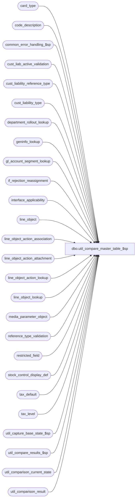

# dbo.util_compare_master_table_$sp

**Database:** auditworks  
**Server:** bedrockdb01  

## Architecture Diagram



## Table Dependencies

| Referenced Table |
|---|
| card_type |
| code_description |
| common_error_handling_$sp |
| cust_liab_active_validation |
| cust_liability_reference_type |
| cust_liability_type |
| department_rollout_lookup |
| geninfo_lookup |
| gl_account_segment_lookup |
| if_rejection_reassignment |
| interface_applicability |
| line_object |
| line_object_action_association |
| line_object_action_attachment |
| line_object_action_lookup |
| line_object_lookup |
| media_parameter_object |
| reference_type_validation |
| restricted_field |
| stock_control_display_def |
| tax_default |
| tax_level |
| util_capture_base_state_$sp |
| util_compare_results_$sp |
| util_comparison_current_state |
| util_comparison_result |

## Stored Procedure Code

```sql
create proc dbo.util_compare_master_table_$sp 
@comparison_id int = 1,
@dump_result tinyint = 0,
@capture_base_state tinyint = 0,
@status_message varchar(255) = null OUTPUT ,
@extra_count int = 0 OUTPUT,
@missing_count int = 0 OUTPUT,
@different_count int = 0 OUTPUT,
@minor_difference_count int = 0 OUTPUT,
@process_id int = NULL OUTPUT,
@errmsg varchar(255) = null OUTPUT
AS

/*
NAME:	util_compare_master_table_$sp
DESCRIPTION: To capture the content of master tables that are auto-configured, and compare it
	     to a base state saved earlier.

HISTORY:
Date     Author       Defect# Desc
Feb21,06 David        DV-1328 Author 
*/

DECLARE 
	@errno				int,
	@message_id		        int,	
	@object_name			varchar(255),
	@operation_name			varchar(100),
	@print_message			varchar(255),
	@process_no			int,
	@process_name		        varchar(100),
	@sequence_no			int 	

SET NOCOUNT ON

SELECT @process_name = 'util_compare_master_table_$sp',
       @process_no = 36,
       @message_id = 201068,
       @process_id = IsNull(@process_id, @@spid),
       @sequence_no = 0

DELETE util_comparison_result
 WHERE process_id = @process_id
   OR comparison_id = @comparison_id
SELECT @errno = @@error
  IF @errno != 0
    BEGIN
      SELECT @errmsg = 'Failed to clean util_comparison_result',
             @object_name = 'util_comparison_result',
             @operation_name = 'DELETE'      
      GOTO error
    END

DELETE util_comparison_current_state
 WHERE process_id = @process_id
    OR comparison_id = @comparison_id
SELECT @errno = @@error
  IF @errno != 0
    BEGIN
      SELECT @errmsg = 'Failed to clean util_comparison_current_state',
             @object_name = 'util_comparison_current_state',
             @operation_name = 'DELETE'      
      GOTO error
    END


INSERT INTO util_comparison_current_state( 
  		process_id, comparison_id, table_name, validation_area, 
  		comparison_key, 
  		comparison_text1, 
  		comparison_text2,
  		comparison_text_minor)
SELECT  @process_id, @comparison_id, 'line_object', 'Line Object', 
        CONVERT(varchar, line_object),
        CONVERT(varchar, line_object_type) 
        + ' _ ' + CONVERT(varchar, line_object_description) 
        + ' _ ' + CONVERT(varchar, default_tax_rate_code) 
        + ' _ ' + CONVERT(varchar, object_export_code) 
        + ' _ ' + CONVERT(varchar, tax_item_group_id) 
        + ' _ ' + CONVERT(varchar, proration_method)
        + ' _ ' + CONVERT(varchar, lookup_pos_code),
        CONVERT(varchar, pos_description_token_list)
        + ' _ ' + CONVERT(varchar, disregard_pos_descr_change)
        + ' _ ' + CONVERT(varchar, lookup_partial_pos_code)
        + ' _ ' + CONVERT(varchar, active_flag)
        + ' _ ' + CONVERT(varchar, auto_config_verified),
	NULL --
  FROM line_object

SELECT @errno = @@error
  IF @errno != 0
    BEGIN
      SELECT @errmsg = 'Failed to list current content of line_object',
             @object_name = 'util_comparison_current_state',
             @operation_name = 'INSERT'      
      GOTO error
    END

INSERT INTO util_comparison_current_state( 
  		process_id, comparison_id, table_name, validation_area, 
  		comparison_key, 
  		comparison_text1, 
  		comparison_text2,
  		comparison_text_minor)
SELECT  @process_id, @comparison_id, 'line_object_action_association', 'Line Object Action Association', 
        CONVERT(varchar, transaction_category) 
        + ' _ ' + CONVERT(varchar, line_object) 
        + ' _ ' + CONVERT(varchar, line_action),
        CONVERT(varchar, line_object_type) 
        + ' _ ' + CONVERT(varchar, db_cr_none) 
        + ' _ ' + CONVERT(varchar, gl_account_segment1)
        + ' _ ' + CONVERT(varchar, gl_account_segment2)
        + ' _ ' + CONVERT(varchar, gl_account_segment3)
        + ' _ ' + CONVERT(varchar, gl_account_segment4)
        + ' _ ' + CONVERT(varchar, gl_account_segment5)
        + ' _ ' + CONVERT(varchar, gl_account_segment6)
        + ' _ ' + CONVERT(varchar, gl_account_segment7)
        + ' _ ' + CONVERT(varchar, gl_account_segment8)
        + ' _ ' + CONVERT(varchar, lookup_segment1)
        + ' _ ' + CONVERT(varchar, lookup_segment2)
        + ' _ ' + CONVERT(varchar, lookup_segment3)
        + ' _ ' + CONVERT(varchar, lookup_segment4)
        + ' _ ' + CONVERT(varchar, lookup_segment5)
        + ' _ ' + CONVERT(varchar, lookup_segment6)
        + ' _ ' + CONVERT(varchar, lookup_segment7)
        + ' _ ' + CONVERT(varchar, lookup_segment8),
        CONVERT(varchar, reference_type)
        + ' _ ' + CONVERT(varchar, discountable_group)
        + ' _ ' + CONVERT(varchar, media_category)
        + ' _ ' + CONVERT(varchar, exception_reason)
        + ' _ ' + CONVERT(varchar, basic_subcode)
        + ' _ ' + CONVERT(varchar, update_register_activity)
        + ' _ ' + CONVERT(varchar, store_balance_group)
        + ' _ ' + CONVERT(varchar, reference_no_option)
        + ' _ ' + CONVERT(varchar, available_as_link_attachment)
        + ' _ ' + CONVERT(varchar, active_flag)
        + ' _ ' + CONVERT(varchar, auto_config_verified),
	NULL --
  FROM line_object_action_association

SELECT @errno = @@error
  IF @errno != 0
    BEGIN
      SELECT @errmsg = 'Failed to list current content of line_object_action_association',
             @object_name = 'util_comparison_current_state',
             @operation_name = 'INSERT'      
      GOTO error
    END

INSERT INTO util_comparison_current_state( 
  		process_id, comparison_id, table_name, validation_area, 
  		comparison_key, 
  		comparison_text1, 
  		comparison_text2,
  		comparison_text_minor)
SELECT  @process_id, @comparison_id, 'line_object_action_attachment', 'Line Attachments', 
        CONVERT(varchar, IsNull(transaction_category,0)) 
        + ' _ ' + CONVERT(varchar, line_object) 
        + ' _ ' + CONVERT(varchar, line_action)
        + ' _ ' + CONVERT(varchar, attachment_type)
        + ' _ ' + CONVERT(varchar, note_type),
        CONVERT(varchar, merchandise_category)
        + ' _ ' + CONVERT(varchar, upc_lookup_division)
        + ' _ ' + CONVERT(varchar, attachment_mandatory)
        + ' _ ' + CONVERT(varchar, transaction_category)
        + ' _ ' + CONVERT(varchar, auto_config_verified),
	NULL,
	NULL --
  FROM line_object_action_attachment

SELECT @errno = @@error
  IF @errno != 0
    BEGIN
      SELECT @errmsg = 'Failed to list current content of line_object_action_attachment',
             @object_name = 'util_comparison_current_state',
             @operation_name = 'INSERT'      
      GOTO error
    END

INSERT INTO util_comparison_current_state( 
  		process_id, comparison_id, table_name, validation_area, 
  		comparison_key, 
  		comparison_text1, 
  		comparison_text2,
  		comparison_text_minor)
SELECT  @process_id, @comparison_id, 'line_object_action_lookup', 'Line Object Action Lookup', 
        CONVERT(varchar, lookup_code_type) 
        + ' _ ' + CONVERT(varchar, lookup_line_object) 
        + ' _ ' + CONVERT(varchar, lookup_line_action)
        + ' _ ' + CONVERT(varchar, lookup_pos_code),
        CONVERT(varchar, line_object)
        + ' _ ' + CONVERT(varchar, line_action)
        + ' _ ' + CONVERT(varchar, discount_reversal_flag),
	NULL,
	NULL --
  FROM line_object_action_lookup

SELECT @errno = @@error
  IF @errno != 0
    BEGIN
      SELECT @errmsg = 'Failed to list current content of line_object_action_lookup',
             @object_name = 'util_comparison_current_state',
             @operation_name = 'INSERT'      
      GOTO error
    END

INSERT INTO util_comparison_current_state( 
  		process_id, comparison_id, table_name, validation_area, 
  		comparison_key, 
  		comparison_text1, 
  		comparison_text2,
  		comparison_text_minor)
SELECT  @process_id, @comparison_id, 'line_object_lookup', 'Line Object Lookup', 
        CONVERT(varchar, lookup_line_object) 
+ ' _ ' + CONVERT(varchar, store_no),
        CONVERT(varchar, line_object),
	NULL,
	NULL --
  FROM line_object_lookup

SELECT @errno = @@error
  IF @errno != 0
    BEGIN
      SELECT @errmsg = 'Failed to list current content of line_object_lookup',
             @object_name = 'util_comparison_current_state',
             @operation_name = 'INSERT'      
      GOTO error
    END

INSERT INTO util_comparison_current_state( 
  		process_id, comparison_id, table_name, validation_area, 
  		comparison_key, 
  		comparison_text1, 
  		comparison_text2,
  		comparison_text_minor)
SELECT  @process_id, @comparison_id, 'interface_applicability', 'I/F Applicability', 
        CONVERT(varchar, transaction_category) 
        + ' _ ' + CONVERT(varchar, line_object) 
        + ' _ ' + CONVERT(varchar, line_action)
        + ' _ ' + CONVERT(varchar, interface_id),
	NULL,
	NULL,
	NULL --
  FROM interface_applicability

SELECT @errno = @@error
  IF @errno != 0
    BEGIN
      SELECT @errmsg = 'Failed to list current content of interface_applicability',
             @object_name = 'util_comparison_current_state',
             @operation_name = 'INSERT'      
      GOTO error
    END

INSERT INTO util_comparison_current_state( 
  		process_id, comparison_id, table_name, validation_area, 
  		comparison_key, 
  		comparison_text1, 
  		comparison_text2,
  		comparison_text_minor)
SELECT  @process_id, @comparison_id, 'if_rejection_reassignment', 'I/F Rejection Reassignment', 
        CONVERT(varchar, if_reject_reason) 
        + ' _ ' + CONVERT(varchar, line_object) 
        + ' _ ' + CONVERT(varchar, line_action),
        CONVERT(varchar, reassign_line_object)
        + ' _ ' + CONVERT(varchar, reassign_line_action),
	NULL,
	NULL --
  FROM if_rejection_reassignment

SELECT @errno = @@error
  IF @errno != 0
    BEGIN
      SELECT @errmsg = 'Failed to list current content of if_rejection_reassignment',
             @object_name = 'util_comparison_current_state',
             @operation_name = 'INSERT'      
      GOTO error
    END

INSERT INTO util_comparison_current_state( 
  		process_id, comparison_id, table_name, validation_area, 
  		comparison_key, 
  		comparison_text1, 
  		comparison_text2,
  		comparison_text_minor)
SELECT  @process_id, @comparison_id, 'card_type', 'Card Type',
        CONVERT(varchar, card_type),
        CONVERT(varchar, line_object)
        + ' _ ' + CONVERT(varchar, check_digit_routine_number)
        + ' _ ' + CONVERT(varchar, payment_line_object)
        + ' _ ' + CONVERT(varchar, gl_replacement_value)
        + ' _ ' + CONVERT(varchar, code_meaning_control),
	NULL,
	card_type_description
  FROM card_type

SELECT @errno = @@error
  IF @errno != 0
    BEGIN
      SELECT @errmsg = 'Failed to list current content of card_type',
             @object_name = 'util_comparison_current_state',
             @operation_name = 'INSERT'      
      GOTO error
    END

INSERT INTO util_comparison_current_state( 
  		process_id, comparison_id, table_name, validation_area, 
  		comparison_key, 
  		comparison_text1, 
  		comparison_text2,
  		comparison_text_minor)
SELECT  @process_id, @comparison_id, 'reference_type_validation', 'Reference Type Validation',
        CONVERT(varchar, reference_type)
        + ' _ ' + CONVERT(varchar, validation_type),
        CONVERT(varchar, edit_active_flag)
        + ' _ ' + CONVERT(varchar, manual_active_flag),
	NULL,
	NULL --
  FROM reference_type_validation

SELECT @errno = @@error
  IF @errno != 0
    BEGIN
      SELECT @errmsg = 'Failed to list current content of reference_type_validation',
             @object_name = 'util_comparison_current_state',
             @operation_name = 'INSERT'      
      GOTO error
    END

INSERT INTO util_comparison_current_state( 
  		process_id, comparison_id, table_name, validation_area, 
  		comparison_key, 
  		comparison_text1, 
  		comparison_text2,
  		comparison_text_minor)
SELECT  @process_id, @comparison_id, 'restricted_field', 'Restricted Field',
        CONVERT(varchar, field_name)
        + ' _ ' + CONVERT(varchar, field_value),
        CONVERT(varchar, restriction_level)
        + ' _ ' + CONVERT(varchar, active_flag),
	NULL,
	NULL --
  FROM restricted_field

SELECT @errno = @@error
  IF @errno != 0
    BEGIN
      SELECT @errmsg = 'Failed to list current content of restricted_field',
             @object_name = 'util_comparison_current_state',
             @operation_name = 'INSERT'      
      GOTO error
    END

INSERT INTO util_comparison_current_state( 
  		process_id, comparison_id, table_name, validation_area, 
  		comparison_key, 
  		comparison_text1, 
  		comparison_text2,
  		comparison_text_minor)
SELECT  @process_id, @comparison_id, 'cust_liability_reference_type', 'C/L Reference Type',
        CONVERT(varchar, reference_type),
        CONVERT(varchar, reference_range_lookup)
        + ' _ ' + CONVERT(varchar, default_tracking_id)
        + ' _ ' + CONVERT(varchar, reference_no_datatype)
        + ' _ ' + CONVERT(varchar, reference_no_length)
        + ' _ ' + CONVERT(varchar, check_digit_routine_number)
        + ' _ ' + CONVERT(varchar, unique_by_store_key)
        + ' _ ' + CONVERT(varchar, history_days)
        + ' _ ' + CONVERT(varchar, history_cleanup_criteria)
        + ' _ ' + CONVERT(varchar, low_stock_qty),
        CONVERT(varchar, pos_lookup)
        + ' _ ' + CONVERT(varchar, pos_amount_1_source_column_no)
        + ' _ ' + CONVERT(varchar, pos_amount_2_source_column_no)
        + ' _ ' + CONVERT(varchar, pos_amount_3_source_column_no)
        + ' _ ' + CONVERT(varchar, stock_flag)
        + ' _ ' + CONVERT(varchar, track_detail_flag)
        + ' _ ' + CONVERT(varchar, employee_tracking_id)
        + ' _ ' + CONVERT(varchar, import_tracking_id)
        + ' _ ' + CONVERT(varchar, currency_id),
	NULL --
  FROM cust_liability_reference_type

SELECT @errno = @@error
  IF @errno != 0
    BEGIN
      SELECT @errmsg = 'Failed to list current content of cust_liability_reference_type',
             @object_name = 'util_comparison_current_state',
             @operation_name = 'INSERT'      
      GOTO error
    END

INSERT INTO util_comparison_current_state( 
  		process_id, comparison_id, table_name, validation_area, 
  		comparison_key, 
  		comparison_text1, 
  		comparison_text2,
  		comparison_text_minor)
SELECT  @process_id, @comparison_id, 'cust_liability_type', 'C/L Type',
        CONVERT(varchar, reference_type)
        + ' _ ' + CONVERT(varchar, tracking_id),
        CONVERT(varchar, expiry_days)
        + ' _ ' + CONVERT(varchar, customer_liability_group)
        + ' _ ' + CONVERT(varchar, active_flag)
        + ' _ ' + CONVERT(varchar, copy_from_reference_type),
	NULL,
	tracking_id_description
  FROM cust_liability_type

SELECT @errno = @@error
  IF @errno != 0
    BEGIN
      SELECT @errmsg = 'Failed to list current content of cust_liability_type',
             @object_name = 'util_comparison_current_state',
             @operation_name = 'INSERT'      
      GOTO error
    END

INSERT INTO util_comparison_current_state( 
  		process_id, comparison_id, table_name, validation_area, 
  		comparison_key, 
  		comparison_text1, 
  		comparison_text2,
  		comparison_text_minor)
SELECT  @process_id, @comparison_id, 'cust_liab_active_validation', 'C/L Active Validation',
        CONVERT(varchar, reference_type)
        + ' _ ' + CONVERT(varchar, tracking_id)
        + ' _ ' + CONVERT(varchar, validation_id),
        CONVERT(varchar, priority_no),
	NULL,
	NULL --
  FROM cust_liab_active_validation

SELECT @errno = @@error
  IF @errno != 0
    BEGIN
      SELECT @errmsg = 'Failed to list current content of cust_liab_active_validation',
             @object_name = 'util_comparison_current_state',
             @operation_name = 'INSERT'      
      GOTO error
    END

INSERT INTO util_comparison_current_state( 
  		process_id, comparison_id, table_name, validation_area, 
  		comparison_key, 
  		comparison_text1, 
  		comparison_text2,
  		comparison_text_minor)
SELECT  @process_id, @comparison_id, 'department_rollout_lookup', 'Department Rollout Lookup',
        CONVERT(varchar, source_line_object)
        + ' _ ' + CONVERT(varchar, pos_deptclass),
        CONVERT(varchar, destination_line_object),
	NULL,
	NULL --
  FROM department_rollout_lookup

SELECT @errno = @@error
  IF @errno != 0
    BEGIN
      SELECT @errmsg = 'Failed to list current content of department_rollout_lookup',
             @object_name = 'util_comparison_current_state',
             @operation_name = 'INSERT'      
      GOTO error
    END

INSERT INTO util_comparison_current_state( 
  		process_id, comparison_id, table_name, validation_area, 
  		comparison_key, 
  		comparison_text1, 
  		comparison_text2,
  		comparison_text_minor)
SELECT  @process_id, @comparison_id, 'gl_account_segment_lookup', 'G/L A/C Segment Lookup',
        CONVERT(varchar, lookup_type)
        + ' _ ' + CONVERT(varchar, lookup_from_value),
        CONVERT(varchar, lookup_to_value)
        + ' _ ' + CONVERT(varchar, gl_replacement_value),
	NULL,
	NULL --
  FROM gl_account_segment_lookup

SELECT @errno = @@error
  IF @errno != 0
    BEGIN
      SELECT @errmsg = 'Failed to list current content of gl_account_segment_lookup',
             @object_name = 'util_comparison_current_state',
             @operation_name = 'INSERT'      
      GOTO error
    END

INSERT INTO util_comparison_current_state( 
  		process_id, comparison_id, table_name, validation_area, 
  		comparison_key, 
  		comparison_text1, 
  		comparison_text2,
  		comparison_text_minor)
SELECT  @process_id, @comparison_id, 'media_parameter_object', 'Media Parameter Object',
        CONVERT(varchar, media_parameter_set_no)
        + ' _ ' + CONVERT(varchar, line_object)
        + ' _ ' + CONVERT(varchar, rec_type),
        CONVERT(varchar, rec_group_line_object),
	NULL,
	NULL --
  FROM media_parameter_object

SELECT @errno = @@error
  IF @errno != 0
    BEGIN
      SELECT @errmsg = 'Failed to list current content of media_parameter_object',
             @object_name = 'util_comparison_current_state',
             @operation_name = 'INSERT'      
      GOTO error
    END

INSERT INTO util_comparison_current_state( 
  		process_id, comparison_id, table_name, validation_area, 
  		comparison_key, 
  		comparison_text1, 
  		comparison_text2,
  		comparison_text_minor)
SELECT  @process_id, @comparison_id, 'tax_level', 'Tax Level',
        CONVERT(varchar, line_object),
        CONVERT(varchar, tax_level),
	NULL,
	NULL --
  FROM tax_level

SELECT @errno = @@error
  IF @errno != 0
    BEGIN
      SELECT @errmsg = 'Failed to list current content of tax_level',
             @object_name = 'util_comparison_current_state',
             @operation_name = 'INSERT'      
      GOTO error
    END

INSERT INTO util_comparison_current_state( 
  		process_id, comparison_id, table_name, validation_area, 
  		comparison_key, 
  		comparison_text1, 
  		comparison_text2,
  		comparison_text_minor)
SELECT  @process_id, @comparison_id, 'tax_default', 'Tax Default',
        CONVERT(varchar, tax_jurisdiction)
        + ' _ ' + CONVERT(varchar, line_object)
        + ' _ ' + CONVERT(varchar, tax_level)
        + ' _ ' + CONVERT(varchar, effective_from_date, 9),
        CONVERT(varchar, tax_rate_code)
        + ' _ ' + CONVERT(varchar, effective_until_date, 9)
        + ' _ ' + CONVERT(varchar, inserted_by_trigger),
	NULL,
	NULL --
  FROM tax_default

SELECT @errno = @@error
  IF @errno != 0
    BEGIN
      SELECT @errmsg = 'Failed to list current content of tax_default',
             @object_name = 'util_comparison_current_state',
      @operation_name = 'INSERT'      
      GOTO error
    END

INSERT INTO util_comparison_current_state( 
  		process_id, comparison_id, table_name, validation_area, 
  		comparison_key, 
  		comparison_text1, 
  		comparison_text2,
  		comparison_text_minor)
SELECT  @process_id, @comparison_id, 'code_description', 'Code Description',
        CONVERT(varchar, code_type)
        + ' _ ' + CONVERT(varchar, code),
        CONVERT(varchar, code_display_descr)
        + ' _ ' + CONVERT(varchar, code_meaning_control)
        + ' _ ' + CONVERT(varchar, min_compatible_exe)
        + ' _ ' + CONVERT(varchar, alpha_code)
        + ' _ ' + CONVERT(varchar, active_flag)
        + ' _ ' + CONVERT(varchar, auto_config_verified),
	code_system_descr,
	NULL --
  FROM code_description
 WHERE code_meaning_control = 'U' -- user entries only

SELECT @errno = @@error
  IF @errno != 0
    BEGIN
      SELECT @errmsg = 'Failed to list current content of code_description',
             @object_name = 'util_comparison_current_state',
             @operation_name = 'INSERT'      
      GOTO error
    END

INSERT INTO util_comparison_current_state( 
  		process_id, comparison_id, table_name, validation_area, 
  		comparison_key, 
  		comparison_text1, 
  		comparison_text2,
  		comparison_text_minor)
SELECT  @process_id, @comparison_id, 'stock_control_display_def', 'Information Set',
        CONVERT(varchar, display_def_id),
        CONVERT(varchar, upc_no_fe_resource_id)
        + ' _ ' + CONVERT(varchar, merchandise_key_fe_resource_id)
        + ' _ ' + CONVERT(varchar, initiated_by_fe_resource_id)
        + ' _ ' + CONVERT(varchar, units_fe_resource_id)
        + ' _ ' + CONVERT(varchar, other_store_no_fe_resource_id)
        + ' _ ' + CONVERT(varchar, location_no_fe_resource_id)
        + ' _ ' + CONVERT(varchar, vendor_no_fe_resource_id)
        + ' _ ' + CONVERT(varchar, count_date_fe_resource_id)
        + ' _ ' + CONVERT(varchar, pos_identifier_fe_resource_id)
        + ' _ ' + CONVERT(varchar, pos_id_type_fe_resource_id)
        + ' _ ' + CONVERT(varchar, pos_deptclass_fe_resource_id)
        + ' _ ' + CONVERT(varchar, upc_division_fe_resource_id)
        + ' _ ' + CONVERT(varchar, originating_str_fe_resource_id),
        CONVERT(varchar, upc_no_code_type)
        + ' _ ' + CONVERT(varchar, merchandise_key_code_type)
        + ' _ ' + CONVERT(varchar, units_code_type)
        + ' _ ' + CONVERT(varchar, other_store_no_code_type)
        + ' _ ' + CONVERT(varchar, location_no_code_type)
        + ' _ ' + CONVERT(varchar, pos_id_type_code_type)
        + ' _ ' + CONVERT(varchar, pos_deptclass_code_type)
        + ' _ ' + CONVERT(varchar, upc_division_code_type)
        + ' _ ' + CONVERT(varchar, originating_str_code_type)
        + ' _ ' + CONVERT(varchar, initiated_by_code_type)
        + ' _ ' + CONVERT(varchar, imrd_fe_resource_id)
        + ' _ ' + CONVERT(varchar, imrd_code_type)
        + ' _ ' + CONVERT(varchar, reason_fe_resource_id)
        + ' _ ' + CONVERT(varchar, reason_code_type)
        + ' _ ' + CONVERT(varchar, active_flag)
        + ' _ ' + CONVERT(varchar, units_reversal_factor)
        + ' _ ' + CONVERT(varchar, vendor_no_code_type)
        + ' _ ' + CONVERT(varchar, pos_identifier_code_type),
	display_def_descr
  FROM stock_control_display_def

SELECT @errno = @@error
  IF @errno != 0
    BEGIN
      SELECT @errmsg = 'Failed to list current content of stock_control_display_def',
             @object_name = 'util_comparison_current_state',
             @operation_name = 'INSERT'      
      GOTO error
    END

INSERT INTO util_comparison_current_state( 
  		process_id, comparison_id, table_name, validation_area, 
  		comparison_key, 
  		comparison_text1, 
  		comparison_text2,
  		comparison_text_minor)
SELECT  @process_id, @comparison_id, 'geninfo_lookup', 'Geninfo Lookup',
        CONVERT(varchar, form_name)
        + ' _ ' + CONVERT(varchar, field_name),
        CONVERT(varchar, field_datatype)
        + ' _ ' + CONVERT(varchar, display_def_id)
        + ' _ ' + CONVERT(varchar, column_name)
        + ' _ ' + CONVERT(varchar, auto_config_verified)
        + ' _ ' + CONVERT(varchar, form_code),
        CONVERT(varchar, count_date_flag)
        + ' _ ' + CONVERT(varchar, imrd_flag)
        + ' _ ' + CONVERT(varchar, initiated_by_host_flag)
        + ' _ ' + CONVERT(varchar, location_no_flag)
        + ' _ ' + CONVERT(varchar, merchandise_key_flag)
        + ' _ ' + CONVERT(varchar, originating_store_no_flag)
        + ' _ ' + CONVERT(varchar, other_store_no_flag)
        + ' _ ' + CONVERT(varchar, pos_deptclass_flag)
        + ' _ ' + CONVERT(varchar, pos_identifier_flag)
        + ' _ ' + CONVERT(varchar, reason_flag)
        + ' _ ' + CONVERT(varchar, units_flag)
        + ' _ ' + CONVERT(varchar, upc_no_flag)
        + ' _ ' + CONVERT(varchar, vendor_no_flag),
	NULL --
  FROM geninfo_lookup

SELECT @errno = @@error
  IF @errno != 0
    BEGIN
      SELECT @errmsg = 'Failed to list current content of geninfo_lookup',
             @object_name = 'util_comparison_current_state',
             @operation_name = 'INSERT'      
      GOTO error
    END


IF @capture_base_state <> 1
BEGIN
 EXEC util_compare_results_$sp @comparison_id, @status_message OUTPUT, @extra_count OUTPUT,
			      @missing_count OUTPUT, @different_count OUTPUT, 
			      @minor_difference_count OUTPUT, @process_id, @errmsg OUTPUT
 SELECT @errno = @@error
  IF @errno != 0
    BEGIN
      IF @errmsg IS NULL /* then */
        SELECT @errmsg = 'Failed to obtain comparison of current results and base state'
      SELECT @object_name = 'util_compare_results_$sp',
             @operation_name = 'EXECUTE'
      GOTO error
    END
END
ELSE
BEGIN
 EXEC util_capture_base_state_$sp @comparison_id, @process_id, @errmsg OUTPUT
 SELECT @errno = @@error
  IF @errno != 0
    BEGIN
      IF @errmsg IS NULL /* then */
        SELECT @errmsg = 'Failed to save current results as base state'
      SELECT @object_name = 'util_capture_base_state_$sp',
             @operation_name = 'EXECUTE'
      GOTO error
    END
END

IF @capture_base_state <> 1
BEGIN
 SELECT @print_message = ':LOG Results for process_id ' + CONVERT(varchar,@process_id) + ', comparison_id ' +
 CONVERT(varchar,@comparison_id) + ':  ' + @status_message + ' 
Extra entries = ' + CONVERT(varchar,@extra_count) + '
Missing entries = ' + CONVERT(varchar,@missing_count) + '
Different entries = ' + CONVERT(varchar,@different_count) + '
Minor differences = ' + CONVERT(varchar,@minor_difference_count)

 PRINT @print_message

 IF @dump_result = 1
  SELECT util_comparison_result.process_id, util_comparison_result.comparison_id, util_comparison_result.comparison_time, util_comparison_result.status, util_comparison_result.table_name, util_comparison_result.validation_area, util_comparison_result.comparison_key, util_comparison_result.comparison_text1, util_comparison_result.comparison_text2, util_comparison_result.comparison_text_minor, util_comparison_result.new_comparison_text1, util_comparison_result.new_comparison_text2, util_comparison_result.new_comparison_text_minor 
    FROM util_comparison_result
   WHERE process_id = @process_id
     AND comparison_id = @comparison_id
END

SET NOCOUNT ON

RETURN

error:

	EXEC common_error_handling_$sp @process_no, @errno, @errmsg, 0, @message_id, 
	@process_name, @object_name, @operation_name, 1
	RETURN
```

