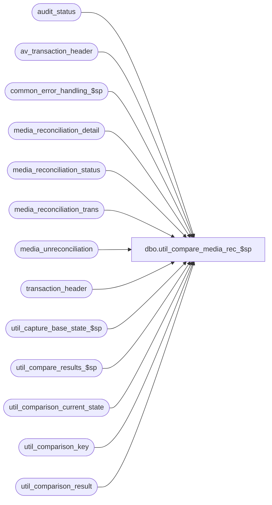

# dbo.util_compare_media_rec_$sp

**Database:** auditworks  
**Server:** bedrockdb01  

## Architecture Diagram



## Table Dependencies

| Referenced Table |
|---|
| audit_status |
| av_transaction_header |
| common_error_handling_$sp |
| media_reconciliation_detail |
| media_reconciliation_status |
| media_reconciliation_trans |
| media_unreconciliation |
| transaction_header |
| util_capture_base_state_$sp |
| util_compare_results_$sp |
| util_comparison_current_state |
| util_comparison_key |
| util_comparison_result |

## Stored Procedure Code

```sql
create proc dbo.util_compare_media_rec_$sp 

@comparison_id int,
@dump_result tinyint = 0,
@capture_base_state tinyint = 0,
@from_store_no int = null,
@from_transaction_date datetime = null,
@to_store_no int = null,
@to_transaction_date datetime = null,
@status_message varchar(255) = null OUTPUT,
@extra_count int = 0 OUTPUT,
@missing_count int = 0 OUTPUT,
@different_count int = 0 OUTPUT,
@minor_difference_count int = 0 OUTPUT,
@process_id int = NULL OUTPUT,
@errmsg varchar(255) = null OUTPUT
AS

/*
NAME:	util_compare_media_rec_$sp
DESCRIPTION: To capture the content of the media reconciliation table entries 
	     for the store/date passed in, and compare it to a base state saved 
	     earlier.

HISTORY:
Date     Author       Defect Desc
Oct25,06 Phu             77931 Fix outer join for SQL 2005 Mode 90.
Apr15,04 Sab	     DV-1068 Remove references to media_reconciliation
Oct30,03 Vicci	     DV-1019 Include legacy media reconciliation and audit status
Jun10,03 Vicci		9504 author

*/
DECLARE @errno				int,
	@message_id		        int,	
	@object_name			varchar(255),
	@operation_name			varchar(100),
	@print_message			varchar(255),
	@process_no			int,
	@process_name		        varchar(100)

SELECT @process_name = 'util_compare_media_rec_$sp',
       @process_no = 36,
       @message_id = 201068,
       @process_id = IsNull(@process_id, @@spid)

DELETE util_comparison_result
 WHERE process_id = @process_id
   OR comparison_id = @comparison_id
SELECT @errno = @@error
  IF @errno != 0
    BEGIN
      SELECT @errmsg = 'Failed to clean util_comparison_result',
             @object_name = 'util_comparison_result',
             @operation_name = 'DELETE'      
      GOTO error
    END

DELETE util_comparison_current_state
 WHERE process_id = @process_id
    OR comparison_id = @comparison_id
SELECT @errno = @@error
  IF @errno != 0
    BEGIN
      SELECT @errmsg = 'Failed to clean util_comparison_current_state',
             @object_name = 'util_comparison_current_state',
             @operation_name = 'DELETE'      
      GOTO error
    END

DELETE util_comparison_key
 WHERE process_id = @process_id
SELECT @errno = @@error
  IF @errno != 0
    BEGIN
      SELECT @errmsg = 'Failed to clean util_comparison_key',
             @object_name = 'util_comparison_key',
             @operation_name = 'DELETE'      
      GOTO error
    END

INSERT INTO util_comparison_current_state( 
  		process_id, comparison_id, table_name, validation_area, 
  		comparison_key, 
  		comparison_text1, 
  		comparison_text2,
  		comparison_text_minor)
SELECT  @process_id, @comparison_id, 'audit_status', 'Media Rec', 
        CONVERT(varchar, a.store_no) + ' _ ' + CONVERT(varchar, a.register_no) + ' _ ' + 
	CONVERT(varchar, a.sales_date) + ' _ ' + CONVERT(varchar, a.date_reject_id),
       CONVERT(varchar, a.short_by_tender_over_limit) + ' _ ' + 
       CONVERT(varchar, a.opening_drawer_discrepancy) + ' _ ' + 
       CONVERT(varchar, a.media_rec_verified) + ' _ ' + 
       CONVERT(varchar, a.media_short) + ' _ ' +
       CONVERT(varchar, a.unreconciled_media_present), 
       ' ',
       ' '
  FROM audit_status a
 WHERE a.store_no >= IsNull(@from_store_no,store_no)
   AND a.store_no <= IsNull(@to_store_no,store_no)
   AND a.sales_date >= IsNull(@from_transaction_date,a.sales_date)
   AND a.sales_date <= IsNull(@to_transaction_date,a.sales_date)

SELECT @errno = @@error
  IF @errno != 0
    BEGIN
      SELECT @errmsg = 'Failed to list current content (Media Rec) of audit_status',
             @object_name = 'util_comparison_current_state',
             @operation_name = 'INSERT'      
      GOTO error
    END

INSERT INTO util_comparison_current_state( 
  		process_id, comparison_id, table_name, validation_area, 
  		comparison_key, 
  		comparison_text1, 
  		comparison_text2,
  		comparison_text_minor)
SELECT @process_id, @comparison_id, 'media_reconciliation_detail', 'Media Rec', 
       CONVERT(varchar, m.store_no) + ' _ ' + CONVERT(varchar, m.register_no) + ' _ ' + 
       CONVERT(varchar, m.transaction_date) + ' _ ' + 
       CONVERT(varchar, m.cashier_no) + ' _ ' + 
       CONVERT(varchar, m.transaction_category) + ' _ ' + 
       CONVERT(varchar, m.line_object) + ' _ ' + 
       CONVERT(varchar, m.line_action) + ' _ ' + 
       convert(varchar,s.rec_type) + '.' + convert(varchar, s.balancing_method) + '.' + 
       convert(varchar, s.rec_group_line_object) + '.' + s.balancing_entity + ' _ ' +
       CONVERT(varchar, m.rec_side) + ' _ ' + 
       CONVERT(varchar, m.rec_amount_type) + ' _ ' + 
       CONVERT(varchar, m.rec_amount_subtype) + ' _ ' + 
       CONVERT(varchar, IsNull(h.store_no, a.store_no)) + ' ' + CONVERT(varchar, IsNull(h.register_no, a.register_no)) + ' ' + 
       CONVERT(varchar, m.rec_date) + ' ' + CONVERT(varchar, IsNull(h.entry_date_time, a.entry_date_time), 9) + ' ' + 
       CONVERT(varchar, IsNull(h.transaction_no, a.transaction_no)) + IsNull(h.transaction_series, a.transaction_series),
	convert(varchar, rec_amount) + ' _ ' + convert(varchar, period_from_date_time, 9) + ' _ ' + 
	convert(varchar, period_to_date_time, 9) + ' _ ' + convert(varchar, convert_to_domestic), 
        convert(varchar, issue_flag) + ' _ ' + convert(varchar, audit_activity_flag),
        null
  FROM media_reconciliation_detail m
       INNER JOIN media_reconciliation_status s ON (m.balancing_entity_id = s.balancing_entity_id)
       LEFT JOIN transaction_header h ON (IsNull((datediff(dd, m.rec_date, m.rec_date) + 1), 0) * m.rec_id = h.transaction_id)
       LEFT JOIN av_transaction_header a ON (IsNull((datediff(dd, m.rec_date, m.rec_date) + 1), 0) * m.rec_id = a.av_transaction_id)
 WHERE m.store_no >= IsNull(@from_store_no,m.store_no)
   AND m.store_no <= IsNull(@to_store_no,m.store_no)
   AND m.transaction_date >= IsNull(@from_transaction_date,m.transaction_date)
   AND m.transaction_date <= IsNull(@to_transaction_date,m.transaction_date)

/* store_no, register_no, transaction_date, cashier_no, 
   transaction_category, line_object, line_action, 
   balancing_entity_id, 
   rec_side, rec_amount_type, rec_amount_subtype,
   rec_id */
/* rec_amount, period_from_date_time, period_to_date_time, convert_to_domestic */
/* issue_flag, audit_activity_flag */
SELECT @errno = @@error
  IF @errno != 0
    BEGIN
      SELECT @errmsg = 'Failed to list current content of media_reconciliation_detail',
             @object_name = 'util_comparison_current_state',
             @operation_name = 'INSERT'      
      GOTO error
    END
 
INSERT INTO util_comparison_current_state( 
  		process_id, comparison_id, table_name, validation_area, 
  		comparison_key, 
  		comparison_text1, 
  		comparison_text2,
  		comparison_text_minor)
SELECT @process_id, @comparison_id, 'media_reconciliation_status', 'Media Rec', 
       convert(varchar,s.rec_type) + '.' + convert(varchar, s.balancing_method) + '.' + 
       convert(varchar, s.rec_group_line_object) + '.' + s.balancing_entity,
	convert(varchar, first_unreconciled_date_time, 9) + ' _ ' + 
	convert(varchar, last_activity_date_time, 9) + ' _ ' + 
	convert(varchar, last_reconciliation_date_time, 9) + ' _ ' + 
	convert(varchar, unreconciled_activity_amount) + ' _ ' + 
	convert(varchar, unreconciled_exchange_amount) + ' _ ' + 
	convert(varchar, current_balance_amount) + ' _ ' + 
	convert(varchar, current_balance_exchange_amt),
       convert(varchar, unrec_tolerance_days) + ' _ ' + 
       convert(varchar, unrec_tolerance_amount) + ' _ ' + 
       convert(varchar, media_parameter_set_no) + ' _ ' + 
       convert(varchar, foreign_currency_id),
        null
  FROM media_reconciliation_status s
  WHERE s.balancing_entity_id in (SELECT DISTINCT balancing_entity_id
  				    FROM media_reconciliation_detail m 
				   WHERE m.store_no >= IsNull(@from_store_no,m.store_no)
				     AND m.store_no <= IsNull(@to_store_no,m.store_no)
				     AND m.transaction_date >= IsNull(@from_transaction_date,m.transaction_date)
				     AND m.transaction_date <= IsNull(@to_transaction_date,m.transaction_date))
SELECT @errno = @@error
  IF @errno != 0
    BEGIN
      SELECT @errmsg = 'Failed to list current content of media_reconciliation_status',
             @object_name = 'util_comparison_current_state',
             @operation_name = 'INSERT'      
      GOTO error
    END

INSERT INTO util_comparison_current_state( 
  		process_id, comparison_id, table_name, validation_area, 
  		comparison_key, 
  		comparison_text1, 
  		comparison_text2,
  		comparison_text_minor)
SELECT @process_id, @comparison_id, 'media_unreconciliation', 'Media Rec', 
       CONVERT(varchar, m.store_no) + ' _ ' + CONVERT(varchar, m.register_no) + ' _ ' + 
       CONVERT(varchar, m.transaction_date) + ' _ ' +  
       convert(varchar,s.rec_type) + '.' + convert(varchar, s.balancing_method) + '.' + 
       convert(varchar, s.rec_group_line_object) + '.' + s.balancing_entity + ' _ ' +
       CONVERT(varchar, IsNull(h.entry_date_time, a.entry_date_time), 9) + ' ' + 
       CONVERT(varchar, IsNull(h.transaction_no, a.transaction_no)) + IsNull(IsNull(h.transaction_series, a.transaction_series), 'Integrity!!! rec_id not on file: ' + convert(varchar, m.rec_id)),
	convert(varchar, m.unrec_activity_flag),
	null,
        null
  FROM media_unreconciliation m
       INNER JOIN media_reconciliation_status s ON (m.balancing_entity_id = s.balancing_entity_id)
       LEFT JOIN transaction_header h ON (m.rec_id = h.transaction_id)
       LEFT JOIN av_transaction_header a ON (m.rec_id = a.av_transaction_id)
 WHERE m.store_no >= IsNull(@from_store_no,m.store_no)
   AND m.store_no <= IsNull(@to_store_no,m.store_no)
   AND m.transaction_date >= IsNull(@from_transaction_date,m.transaction_date)
   AND m.transaction_date <= IsNull(@to_transaction_date,m.transaction_date)

SELECT @errno = @@error
  IF @errno != 0
    BEGIN
      SELECT @errmsg = 'Failed to list current content of media_unreconciliation',
             @object_name = 'util_comparison_current_state',
             @operation_name = 'INSERT'      
      GOTO error
    END

INSERT INTO util_comparison_current_state( 
  		process_id, comparison_id, table_name, validation_area, 
  		comparison_key, 
  		comparison_text1, 
  		comparison_text2,
  		comparison_text_minor)
SELECT @process_id, @comparison_id, 'media_reconciliation_trans', 'Media Rec', 
       CONVERT(varchar, m.entry_date_time, 9) + ' _ ' + 
       convert(varchar,s.rec_type) + '.' + convert(varchar, s.balancing_method) + '.' + 
       convert(varchar, s.rec_group_line_object) + '.' + s.balancing_entity + ' _ ' +
       CONVERT(varchar, m.rec_side) + ' _ ' + 
       CONVERT(varchar, m.rec_amount_type) + ' _ ' + 
       CONVERT(varchar, m.rec_amount_subtype) + ' _ ' + 
       CONVERT(varchar, m.store_no) + ' ' + CONVERT(varchar, m.register_no) + ' ' + 
       CONVERT(varchar, m.transaction_date) + ' ' + 
       CONVERT(varchar, IsNull(h.transaction_no, a.transaction_no)) + IsNull(IsNull(h.transaction_series, a.transaction_series), 'Integrity!!! rec_id not on file: ' + convert(varchar, m.transaction_id)) + ' _ ' +
       CONVERT(varchar, m.line_id),
	convert(varchar, m.rec_amount) + ' _ ' + 
	convert(varchar, m.void_flag) + ' _ ' + 
	convert(varchar, m.transaction_category) + ' _ ' + 
	convert(varchar, m.line_object) + ' _ ' + convert(varchar, m.line_action) + ' _ ' + 
	m.reference_no,
       convert(varchar, m.cashier_no) + ' _ ' + 
       convert(varchar, m.tender_total) + ' _ ' + 
       convert(varchar, m.audit_activity_flag),
       null
  FROM media_reconciliation_trans m
       INNER JOIN media_reconciliation_status s ON (m.balancing_entity_id = s.balancing_entity_id)
       LEFT JOIN transaction_header h ON (m.transaction_id = h.transaction_id)
       LEFT JOIN av_transaction_header a ON (m.transaction_id = a.av_transaction_id)
 WHERE m.store_no >= IsNull(@from_store_no,m.store_no)
   AND m.store_no <= IsNull(@to_store_no,m.store_no)
   AND m.transaction_date >= IsNull(@from_transaction_date,m.transaction_date)
   AND m.transaction_date <= IsNull(@to_transaction_date,m.transaction_date)

SELECT @errno = @@error
  IF @errno != 0
    BEGIN
      SELECT @errmsg = 'Failed to list current content of media_reconciliation_trans',
             @object_name = 'util_comparison_current_state',
             @operation_name = 'INSERT'      
      GOTO error
    END
 


IF @capture_base_state <> 1
BEGIN
 EXEC util_compare_results_$sp @comparison_id, @status_message OUTPUT, @extra_count OUTPUT,
			      @missing_count OUTPUT, @different_count OUTPUT, 
			      @minor_difference_count OUTPUT, @process_id, @errmsg OUTPUT
 SELECT @errno = @@error
  IF @errno != 0
    BEGIN
      IF @errmsg IS NULL --then
        SELECT @errmsg = 'Failed to obtain comparison of current results and base state'
      SELECT @object_name = 'util_compare_results_$sp',
             @operation_name = 'EXECUTE'
      GOTO error
    END
END
ELSE
BEGIN
 EXEC util_capture_base_state_$sp @comparison_id, @process_id, @errmsg OUTPUT
 SELECT @errno = @@error
  IF @errno != 0
    BEGIN
      IF @errmsg IS NULL --then
        SELECT @errmsg = 'Failed to save current results as base state'
      SELECT @object_name = 'util_capture_base_state_$sp',
             @operation_name = 'EXECUTE'
      GOTO error
    END
END

IF @capture_base_state <> 1
BEGIN
 SELECT @print_message = ':LOG Results for process_id ' + CONVERT(varchar,@process_id) + ', comparison_id ' +
 CONVERT(varchar,@comparison_id) + ':  ' + @status_message + ' 
Extra entries = ' + CONVERT(varchar,@extra_count) + '
Missing entries = ' + CONVERT(varchar,@missing_count) + '
Different entries = ' + CONVERT(varchar,@different_count) + '
Minor differences = ' + CONVERT(varchar,@minor_difference_count)

 PRINT @print_message

 IF @dump_result = 1
  SELECT util_comparison_result.process_id, util_comparison_result.comparison_id, util_comparison_result.comparison_time, util_comparison_result.status, util_comparison_result.table_name, util_comparison_result.validation_area, util_comparison_result.comparison_key, util_comparison_result.comparison_text1, util_comparison_result.comparison_text2, util_comparison_result.comparison_text_minor, util_comparison_result.new_comparison_text1, util_comparison_result.new_comparison_text2, util_comparison_result.new_comparison_text_minor 
    FROM util_comparison_result
   WHERE process_id = @process_id
     AND comparison_id = @comparison_id
END

DELETE util_comparison_key
 WHERE process_id = @process_id
SELECT @errno = @@error
  IF @errno != 0
    BEGIN
      SELECT @errmsg = 'Failed to do final cleanup of util_comparison_key',
             @object_name = 'util_comparison_key',
             @operation_name = 'DELETE'      
      GOTO error
    END

RETURN

error:
	EXEC common_error_handling_$sp @process_no, @errno, @errmsg, 0, @message_id, 
	@process_name, @object_name, @operation_name, 1
	RETURN
```

