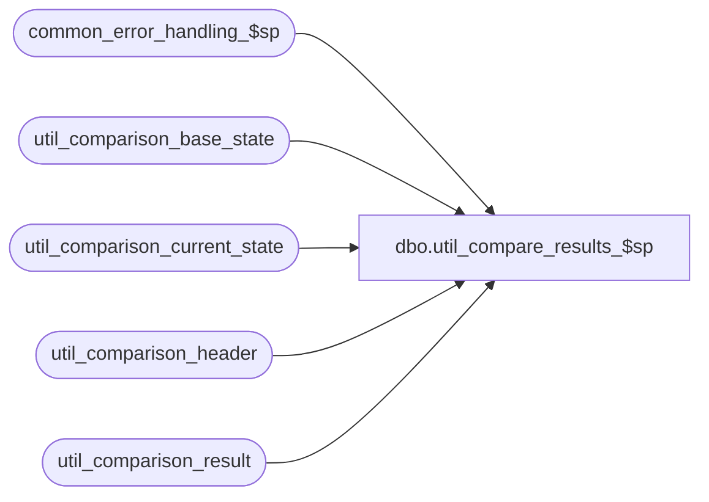

# dbo.util_compare_results_$sp

**Database:** auditworks  
**Server:** bedrockdb01  

## Architecture Diagram



## Table Dependencies

| Referenced Table |
|---|
| common_error_handling_$sp |
| util_comparison_base_state |
| util_comparison_current_state |
| util_comparison_header |
| util_comparison_result |

## Stored Procedure Code

```sql
create proc dbo.util_compare_results_$sp @comparison_id int,
@status_message varchar(255) = null OUTPUT ,
@extra_count int = 0 OUTPUT,
@missing_count int = 0 OUTPUT,
@different_count int = 0 OUTPUT,
@minor_difference_count int = 0 OUTPUT,
@process_id int = null,
@errmsg varchar(255) = null OUTPUT
AS

/*
NAME:	util_compare_results_$sp
DESCRIPTION: To compare current status (from util_comparison_current_state) to a base state
	     saved earlier.
	     Called by util_compare_interfaces_$sp
HISTORY:
Date		Author		Defect	Desc
Jan21,02	Vicci		1-ADFD5	Create interface comparison utility
*/

/* 
Note:  entries resulting from Transaction Add will show as differences since the
entry_date_time which forms part of their key will likely change each time the test-case is
run.
*/

DECLARE
	@errno				int,
	@message_id		        int,	
	@object_name			varchar(255),
	@operation_name			varchar(100),
	@process_no			int,
	@process_name		        varchar(100),
	@comparison_time		datetime

SELECT @process_name = 'util_compare_results_$sp',
       @process_no = 36,
       @message_id = 201068,
       @process_id = IsNull(@process_id, @@spid),
       @comparison_time = getdate()

DELETE util_comparison_result
 WHERE process_id = @process_id
    OR comparison_id = @comparison_id
SELECT @errno = @@error
  IF @errno != 0
    BEGIN
      SELECT @errmsg = 'Failed to clean util_comparison_result',
             @object_name = 'util_comparison_result',
             @operation_name = 'DELETE'      
      GOTO error
    END

INSERT util_comparison_result(
	process_id,
	comparison_id,
	comparison_time,
	status,
	table_name,
	validation_area,
	comparison_key,
	comparison_text1,
	comparison_text2,
	comparison_text_minor,
	new_comparison_text1,
	new_comparison_text2,
	new_comparison_text_minor)
SELECT 	@process_id,
	@comparison_id,
	@comparison_time,
	'different', --status
	b.table_name,
	b.validation_area,
	b.comparison_key,
	b.comparison_text1,
	b.comparison_text2,
	b.comparison_text_minor,
	c.comparison_text1,
	c.comparison_text2,
	c.comparison_text_minor
  FROM util_comparison_base_state b, util_comparison_current_state c
 WHERE c.process_id = @process_id
   AND b.comparison_id = @comparison_id
   AND b.comparison_id = c.comparison_id
   AND b.table_name = c.table_name
   AND b.validation_area = c.validation_area
   AND b.comparison_key = c.comparison_key
   AND (IsNull(b.comparison_text1, '-') <> IsNull(c.comparison_text1, '-')
        OR IsNull(b.comparison_text2, '-') <> IsNull(c.comparison_text2, '-'))

SELECT @errno = @@error, @different_count = @@rowcount
  IF @errno != 0
    BEGIN
      SELECT @errmsg = 'Failed to build list of differences',
             @object_name = 'util_comparison_result',
             @operation_name = 'INSERT'      
      GOTO error
    END

INSERT util_comparison_result(
	process_id,
	comparison_id,
	comparison_time,
	status,
	table_name,
	validation_area,
	comparison_key,
	comparison_text1,
	comparison_text2,
	comparison_text_minor,
	new_comparison_text1,
	new_comparison_text2,
	new_comparison_text_minor)
SELECT 	@process_id,
	@comparison_id,
	@comparison_time,
	'minor difference', --status
	b.table_name,
	b.validation_area,
	b.comparison_key,
	b.comparison_text1,
	b.comparison_text2,
	b.comparison_text_minor,
	c.comparison_text1,
	c.comparison_text2,
	c.comparison_text_minor
  FROM util_comparison_base_state b, util_comparison_current_state c
 WHERE c.process_id = @process_id
   AND b.comparison_id = @comparison_id
   AND b.comparison_id = c.comparison_id
   AND b.table_name = c.table_name
   AND b.validation_area = c.validation_area
   AND b.comparison_key = c.comparison_key
   AND IsNull(b.comparison_text1, '-') = IsNull(c.comparison_text1, '-')
   AND IsNull(b.comparison_text2, '-') = IsNull(c.comparison_text2, '-')
   AND IsNull(b.comparison_text_minor, '-') <> IsNull(c.comparison_text_minor, '-')
SELECT @errno = @@error, @minor_difference_count = @@rowcount
  IF @errno != 0
    BEGIN
      SELECT @errmsg = 'Failed to build list of minor differences',
             @object_name = 'util_comparison_result',
             @operation_name = 'INSERT'      
      GOTO error
    END

INSERT util_comparison_result(
	process_id,
	comparison_id,
	comparison_time,
	status,
	table_name,
	validation_area,
	comparison_key,
	comparison_text1,
	comparison_text2,
	comparison_text_minor,
	new_comparison_text1,
	new_comparison_text2,
	new_comparison_text_minor)
SELECT 	@process_id,
	@comparison_id,
	@comparison_time,
	'extra', --status
	c.table_name,
	c.validation_area,
	c.comparison_key,
	null,
	null,
	null,
	c.comparison_text1,
	c.comparison_text2,
	c.comparison_text_minor
  FROM util_comparison_current_state c
 WHERE c.process_id = @process_id
   AND c.comparison_id = @comparison_id
   AND c.table_name + c.validation_area + c.comparison_key 
       not in (SELECT b.table_name + b.validation_area + b.comparison_key 
                 FROM util_comparison_base_state b
                WHERE b.comparison_id = @comparison_id)
SELECT @errno = @@error, @extra_count = @@rowcount
  IF @errno != 0
    BEGIN
      SELECT @errmsg = 'Failed to build list of extra entries',
             @object_name = 'util_comparison_result',
             @operation_name = 'INSERT'      
      GOTO error
    END

INSERT util_comparison_result(
	process_id,
	comparison_id,
	comparison_time,
	status,
	table_name,
	validation_area,
	comparison_key,
	comparison_text1,
	comparison_text2,
	comparison_text_minor,
	new_comparison_text1,
	new_comparison_text2,
	new_comparison_text_minor)
SELECT 	@process_id,
	@comparison_id,
	@comparison_time,
	'missing', --status
	b.table_name,
	b.validation_area,
	b.comparison_key,
	b.comparison_text1,
	b.comparison_text2,
	b.comparison_text_minor,
	null,
	null,
	null   
  FROM util_comparison_base_state b
 WHERE b.comparison_id = @comparison_id
   AND b.table_name + b.validation_area + b.comparison_key 
       not in (SELECT c.table_name + c.validation_area + c.comparison_key 
                 FROM util_comparison_current_state c
                WHERE c.process_id = @process_id
                  AND c.comparison_id = @comparison_id)
SELECT @errno = @@error, @missing_count = @@rowcount
  IF @errno != 0
    BEGIN
      SELECT @errmsg = 'Failed to build list of missing entries',
             @object_name = 'util_comparison_result',
             @operation_name = 'INSERT'      
      GOTO error
    END

IF @different_count + @missing_count + @extra_count > 0
  SELECT @status_message = 'Differences'
ELSE
  BEGIN
  IF @minor_difference_count > 0
    SELECT @status_message = 'Minor differences'
  ELSE
    SELECT @status_message = 'No differences'
  END

IF @status_message in ('Differences', 'Minor differences')
BEGIN
  SELECT DISTINCT table_name, validation_area
    INTO #util_comp_hdr
    FROM util_comparison_result
   WHERE process_id = @process_id
  
  INSERT util_comparison_result(
   	 process_id,
	 comparison_id,
	 comparison_time,
	 status,
	 table_name,
	 validation_area,
	 comparison_key,
	 comparison_text1,
	 comparison_text2,
	 comparison_text_minor,
	 new_comparison_text1,
	 new_comparison_text2,
	 new_comparison_text_minor)
  SELECT @process_id, @comparison_id, @comparison_time, 'header', 
         h.table_name,
         h.validation_area,
	 h.comparison_key,
	 h.comparison_text1,
	 h.comparison_text2,
	 h.comparison_text_minor,
	 h.comparison_text1,
	 h.comparison_text2,
	 h.comparison_text_minor
    FROM #util_comp_hdr u, util_comparison_header h
   WHERE u.table_name = h.table_name
     AND u.validation_area = h.validation_area

  DROP table #util_comp_hdr
END
      
RETURN

error:
	EXEC common_error_handling_$sp @process_no, @errno, @errmsg, 0, @message_id, 
	@process_name, @object_name, @operation_name, 1
	RETURN
```

