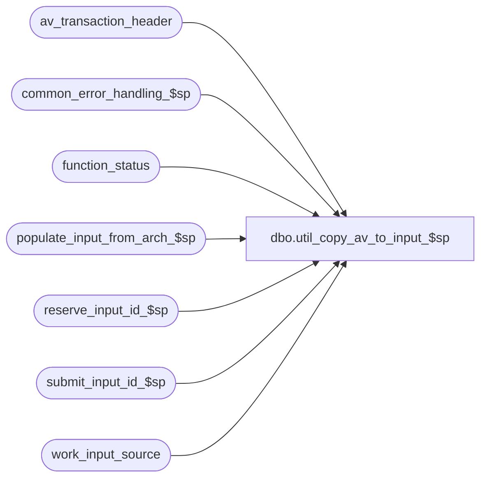

# dbo.util_copy_av_to_input_$sp

**Database:** auditworks  
**Server:** bedrockdb01  

## Architecture Diagram



## Table Dependencies

| Referenced Table |
|---|
| av_transaction_header |
| common_error_handling_$sp |
| function_status |
| populate_input_from_arch_$sp |
| reserve_input_id_$sp |
| submit_input_id_$sp |
| work_input_source |

## Stored Procedure Code

```sql
create proc dbo.util_copy_av_to_input_$sp   @from_transaction_date		smalldatetime = NULL,
  @to_transaction_date		smalldatetime = NULL,
  @from_store_no		int = NULL,
  @to_store_no			int = NULL,
  @batch_by_store		int = 0  --0=batch by date, 1=batch by store/date
AS 
/* 
Proc Name: util_copy_av_to_input_$sp 
Desc:   To copy all transactions for a date / store-range from archive to input tables

*** must script with ANSI_NULLS ON, ANSI_WARNINGS ON due to scaleout

HISTORY:  
Date     Name         Def# Desc
Oct10,07 Paul        91395 SA5 version
*/

SET NOCOUNT ON
SET ANSI_NULLS ON
SET ANSI_WARNINGS ON

DECLARE
  @errmsg                       varchar(255),
  @errno                        int,
  @message_id                   int,
  @object_name                  varchar(255),
  @operation_name               varchar(100),
  @process_name                 varchar(100),
  @process_id			int,
  @process_no                   tinyint,
  @process_start_time		datetime,
  @rule_id      varchar(3), 
  @input_id     numeric(12,0),
  @store_no	int,
  @transaction_date smalldatetime

SELECT @message_id = 201068,
       @operation_name = 'Unknown',
       @process_name = 'util_copy_av_to_input_$sp',
       @process_no = 51,
       @process_id = @@spid,
       @process_start_time = getdate()

IF @batch_by_store <> 1 
  SELECT @batch_by_store = 0       

DECLARE processing_cursor CURSOR FAST_FORWARD
 FOR
  SELECT DISTINCT @batch_by_store * store_no, transaction_date
    FROM av_transaction_header
   WHERE ((store_no >= @from_store_no AND store_no <= @to_store_no) 
          OR @from_store_no IS NULL)
         AND 
         ((transaction_date >= @from_transaction_date and transaction_date <= @to_transaction_date)
          OR @from_transaction_date IS NULL)

OPEN processing_cursor

FETCH processing_cursor
 INTO @store_no, @transaction_date

WHILE @@fetch_status = 0 
BEGIN
  EXEC reserve_input_id_$sp @rule_id, @input_id OUTPUT, @errmsg OUTPUT, @process_no
  SELECT @errno = @@error
  IF @errno <> 0
  BEGIN
    SELECT @errmsg = IsNull(@errmsg, '') +  ' Unable to reserve input ID',
           @object_name = 'reserve_input_id_$sp',
           @operation_name = 'EXECUTE'
    GOTO error
  END
   
  INSERT into work_input_source(
         input_id,
         av_transaction_id,
         store_no,
         register_no,
         entry_date_time,
         transaction_series,
         transaction_no)
  SELECT @input_id, 
         av_transaction_id,
         store_no,
         register_no,
         entry_date_time,
         transaction_series,
         transaction_no
    FROM av_transaction_header 
   WHERE transaction_date = @transaction_date
     AND (store_no = @store_no OR @store_no = 0)
  SELECT @errno = @@error
  IF @errno <> 0
  BEGIN
    SELECT @errmsg = 'Unable to list archive transactions to be copied',
           @object_name = 'work_input_source',
           @operation_name = 'INSERT'
    GOTO error
  END

  EXEC populate_input_from_arch_$sp @input_id, @errmsg OUTPUT
  SELECT @errno = @@error
  IF @errno <> 0
  BEGIN
    SELECT @errmsg = IsNull(@errmsg, '') +  ' Unable to copy archive transactions to input tables',
           @object_name = 'populate_input_from_arch_$sp',
           @operation_name = 'EXECUTE'
    GOTO error
  END

  UPDATE function_status
     SET status = 1
   WHERE process_id = @process_id
     AND function_no = @process_no

  SELECT @errno =@@error
  IF @errno <> 0
    BEGIN
	  SELECT @errmsg = 'Unable to update function_status',
	         @object_name = 'function_status',
	         @operation_name = 'UPDATE'
	  GOTO error
    END

  EXEC submit_input_id_$sp @input_id, @process_start_time OUTPUT, @errmsg OUTPUT

  SELECT @errno = @@error
  IF @errno <> 0
    BEGIN
	  SELECT @errmsg = 'Unable to execute submit_input_is_$sp',
	         @object_name = 'submit_input_is_$sp',
	         @operation_name = 'EXEC'
  	  GOTO error
    END

  FETCH processing_cursor
  INTO @store_no, @transaction_date
 END /* while not end of cursor */

CLOSE processing_cursor
DEALLOCATE processing_cursor

       
RETURN

error:
  EXEC common_error_handling_$sp @process_no, @errno, @errmsg, 0, @message_id, @process_name, @object_name, @operation_name, 1, 1
  RETURN
```

