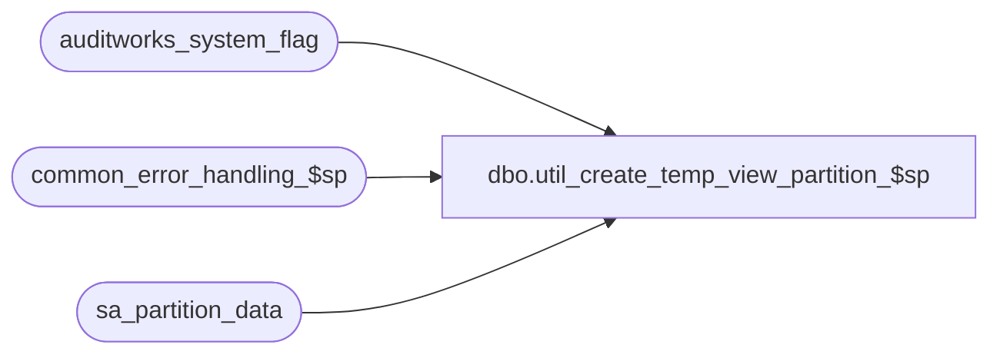

# dbo.util_create_temp_view_partition_$sp

**Database:** auditworks  
**Server:** bedrockdb01  

## Architecture Diagram



## Table Dependencies

| Referenced Table |
|---|
| auditworks_system_flag |
| common_error_handling_$sp |
| sa_partition_data |

## Stored Procedure Code

```sql
create proc dbo.util_create_temp_view_partition_$sp
AS

/*

Proc name: util_create_temp_view_partition_$sp
     Desc: utility to create temporary views to include transaction_date for archived tables.
           The temporary views are used by bcp to bulk copy out the archived tables in preparation for partitioning.

HISTORY:
Date     Name            Defect# Description
Sep30,08 Phu               95126 Initial development

*/

DECLARE
  @column_names               nvarchar(1000),
  @cursor_open                int,
  @errmsg                     varchar(255),
  @errno                      int,
  @message_id                 int,
  @object_name                varchar(255),
  @operation_name             varchar(100),
  @parm_definition            nvarchar(100),
  @parm_definition2           nvarchar(100),
  @parm_definition3           nvarchar(100),
  @partitioning_in_use        smallint,
  @process_id                 binary(16),
  @process_name               varchar(100),
  @process_no                 int,
  @rows                       int,
  @sql_string                 nvarchar(4000),
  @sql_string2                nvarchar(4000),
  @sql_string3                nvarchar(2000),
  @sql_string4                nvarchar(1000),
  @sql_string5                nvarchar(1000),
  @table_exist                int,
  @table_name                 sysname,
  @tran_date_exist            int,
  @user_id                    int,
  @view_exist                 int,
  @view_name                  sysname


-- must set to ON
SET CONCAT_NULL_YIELDS_NULL ON

SELECT @message_id = 201068,
       @process_name = 'util_create_temp_view_partition_$sp',
       @user_id = 56,
       @process_no = 18,
       @process_id = NEWID()

-- Check if partitioning is turned on
SELECT @partitioning_in_use = flag_numeric_value
FROM auditworks_system_flag
WHERE flag_name = 'partitioning_in_use'

SELECT @errno = @@error
IF @errno != 0
BEGIN
  SELECT @errmsg = 'Unable to retrieve partitioning_in_use',
         @object_name = 'auditworks_system_flag',
         @operation_name = 'SELECT'
  GOTO error
END

IF @partitioning_in_use IS NULL OR @partitioning_in_use = 0
BEGIN
  PRINT 'Partitioning is not active, please activate it via table maintenance.'
  RETURN
END

-- check to verify if the setup for the table sa_partition_data is correct
SELECT @rows = COUNT(1)
FROM sa_partition_data

SELECT @errno = @@error
IF @errno = 208 -- table not exist
BEGIN
  PRINT 'Please create table sa_partition_data and populate data rows before running this proc.'
  RETURN
END
ELSE IF @errno != 0
BEGIN
  SELECT @errmsg = 'Unable to retrieve row counts',
         @object_name = 'sa_partition_data',
         @operation_name = 'SELECT'
  GOTO error
END
ELSE IF @rows = 0
BEGIN
  PRINT 'Please populate rows in table sa_partition_data before running this proc.'
  RETURN
END


DECLARE av_tables_crsr CURSOR FAST_FORWARD
FOR
SELECT table_name
FROM sa_partition_data
WHERE table_group = 'archive'
ORDER BY table_sequence DESC

OPEN av_tables_crsr

SELECT @errno = @@error
IF @errno != 0
BEGIN
  SELECT @errmsg = 'Unable to open cursor av_tables_crsr',
         @object_name = 'av_tables_crsr',
         @operation_name = 'OPEN'
  GOTO error
END

SELECT @cursor_open = 1,
       @sql_string = N'IF EXISTS (SELECT 1 FROM sys.objects WHERE name = @tablename) SELECT @object_exist = 1 ELSE SELECT @object_exist = 0 ',
       @sql_string2 = N'IF EXISTS (SELECT 1 FROM sys.columns c, sys.objects s WHERE s.name = @tablename AND s.object_id = c.object_id AND c.name = ''transaction_date'') SELECT @tran_date_exist = 1 ELSE SELECT @tran_date_exist = 0 ',
       @sql_string3 = N'SELECT @column_names = COALESCE(@column_names + '', t.'', ''t.'') + c.name FROM sys.objects o, sys.columns c WHERE o.name = @tablename AND o.type = ''U'' AND o.object_id = c.object_id ORDER BY c.column_id ASC ',
       @parm_definition = N'@tablename sysname, @object_exist int OUTPUT',
       @parm_definition2 = N'@tablename sysname, @tran_date_exist int OUTPUT',
       @parm_definition3 = N'@tablename sysname, @column_names nvarchar(1000) OUTPUT'

WHILE 1 = 1
BEGIN
    FETCH av_tables_crsr INTO
      @table_name

    IF @@fetch_status <> 0
      BREAK

    SELECT @table_exist = 0, @tran_date_exist = 0, @view_name = @table_name + '_view_temp'

    -- is table existed
    EXECUTE sp_executesql @sql_string, @parm_definition, @tablename = @table_name, @object_exist = @table_exist OUTPUT
    SELECT @errno = @@error
    IF @errno != 0
    BEGIN
      SELECT @errmsg = 'Unable to dynamically execute sql',
             @object_name = @sql_string,
             @operation_name = 'EXECUTE'
      GOTO error
    END

    -- is column transaction_date existed
    EXECUTE sp_executesql @sql_string2, @parm_definition2, @tablename = @table_name, @tran_date_exist = @tran_date_exist OUTPUT
    SELECT @errno = @@error
    IF @errno != 0
    BEGIN
      SELECT @errmsg = 'Unable to dynamically execute sql #2',
             @object_name = @sql_string2,
             @operation_name = 'EXECUTE'
      GOTO error
    END

    -- Table definitions exists
    IF @table_exist = 1
    BEGIN
      -- is the view existed
      SELECT @view_exist = 0
      EXECUTE sp_executesql @sql_string, @parm_definition, @tablename = @view_name, @object_exist = @view_exist OUTPUT
      SELECT @errno = @@error
      IF @errno != 0
      BEGIN
        SELECT @errmsg = 'Unable to dynamically execute sql #3',
               @object_name = @sql_string,
               @operation_name = 'EXECUTE'
        GOTO error
      END

      IF @view_exist = 1
      BEGIN
        SELECT @sql_string4 = N'DROP VIEW ' + @view_name
        EXECUTE sp_executesql @sql_string4
        SELECT @errno = @@error
        IF @errno != 0
        BEGIN
          SELECT @errmsg = 'Unable to dynamically execute sql #4',
                 @object_name = @sql_string4,
                 @operation_name = 'EXECUTE'
          GOTO error
        END      
      END

      -- Retrieve column names of a table to create the view
      -- @column_names must be set to null
      SELECT @column_names = NULL
      EXECUTE sp_executesql @sql_string3, @parm_definition3, @tablename = @table_name, @column_names = @column_names OUTPUT
      SELECT @errno = @@error
      IF @errno != 0
      BEGIN
        SELECT @errmsg = 'Unable to dynamically execute sql #5',
               @object_name = @sql_string3,
               @operation_name = 'EXECUTE'
        GOTO error
      END

      -- Table av_transaction_missing already had sales_date and av_transaction_header, tax_exception_transaction already had transaction_date columns
      IF (@tran_date_exist = 1 OR @table_name = 'av_transaction_header' OR @table_name = 'av_transaction_missing' OR @table_name = 'tax_exception_transaction')
      BEGIN
        SELECT @sql_string4 = N'CREATE VIEW dbo.' + @view_name + N' AS SELECT ' + @column_names + N' FROM ' + @table_name + N' t '
        EXECUTE sp_executesql @sql_string4
        SELECT @errno = @@error
        IF @errno != 0
        BEGIN
          SELECT @errmsg = 'Unable to dynamically execute sql #6',
                 @object_name = @sql_string4,
                 @operation_name = 'EXECUTE'
          GOTO error
        END

      END -- if (@tran_date_exist = 1 OR @table_name = 'av_transaction_header' OR @table_name = 'av_transaction_missing' OR @table_name = 'tax_exception_transaction')

      ELSE IF @tran_date_exist = 0
      BEGIN
        SELECT @sql_string5 = N'CREATE VIEW dbo.' + @view_name + N' AS SELECT ' + @column_names + ', h.transaction_date FROM ' + @table_name + N' t INNER JOIN av_transaction_header h ON (t.av_transaction_id = h.av_transaction_id) '
        EXECUTE sp_executesql @sql_string5
        SELECT @errno = @@error
        IF @errno != 0
        BEGIN
          SELECT @errmsg = 'Unable to dynamically execute sql #7',
                 @object_name = @sql_string5,
                 @operation_name = 'EXECUTE'
          GOTO error
        END
      END
    END -- if @table_exist = 1

END -- while 1 = 1

CLOSE av_tables_crsr
DEALLOCATE av_tables_crsr
SELECT @cursor_open = 0


RETURN


error:
  IF @cursor_open = 1
  BEGIN
    CLOSE av_tables_crsr
    DEALLOCATE av_tables_crsr
    SELECT @cursor_open = 0  
  END

  EXEC common_error_handling_$sp @process_no, @errno, @errmsg, 0, @message_id, 
       @process_name, @object_name, @operation_name, 0, 1, 0, null, 0, null, null,
       null, null, null, null, 0, @process_id, @user_id
  RETURN
```

