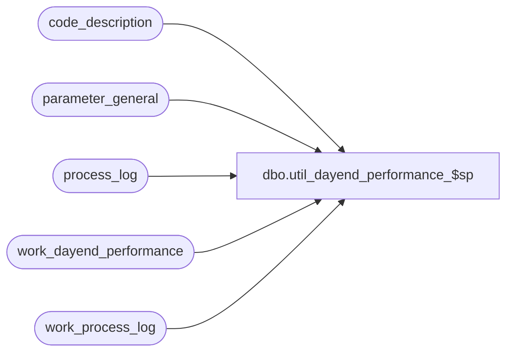

# dbo.util_dayend_performance_$sp

**Database:** auditworks  
**Server:** bedrockdb01  

## Architecture Diagram



## Table Dependencies

| Referenced Table |
|---|
| code_description |
| parameter_general |
| process_log |
| work_dayend_performance |
| work_process_log |

## Stored Procedure Code

```sql
CREATE  proc dbo.util_dayend_performance_$sp 

      @days  INT = NULL

AS
DECLARE
@effective_date               DATETIME,
@session_id                   INT,
@start_time                   DATETIME,
@end_time                     DATETIME,
@duration                     NUMERIC(12,2),
@process_duration             NUMERIC(12,2),
@process_no                   INT,
@session_start                DATETIME,
@session_end                  DATETIME,
@session_store_count          INT,
@session_tran_count           INT,
@session_duration             NUMERIC(12,2),
@stream_start                 DATETIME,
@stream_end                   DATETIME,
@stream_store_count           INT,
@stream_tran_count            INT,
@stream_duration              NUMERIC(12,2),
@concurrent_dayend_processes  INT,
@stream_no                    INT,
@process_desc                 VARCHAR(60),
@session_per_hour             NUMERIC(12,2),
@stream_per_hour              NUMERIC(12,2),
@overall                      NUMERIC(12,2),
@overall_stream1              NUMERIC(12,2),
@overall_stream2              NUMERIC(12,2),
@transaction_count            INT,
@blanks                       VARCHAR(60)

/************************************************************************************
   Name: util_dayend_performance_$sp
   Author: Shapoor (Ported to Sybase by David C.)
   Description: To Monitor Dayend Performance.
   Arguments: @days - number of days from current date to monitor performance.
                
**************************************************************************************
Date     Name		Def# Desc
Jan20,03 Paul           5594 prevent division by zero
Dec06,02 Winnie      1-H4466 Move declaration of cursor for MSSQL
*/

DECLARE calc_sessions CURSOR 
FOR
SELECT start_time,
       process_no
  FROM work_process_log
 ORDER BY start_time       

DECLARE performance_output CURSOR 
FOR
SELECT distinct session_id
  FROM work_process_log
 ORDER BY session_id

BEGIN  -- MAIN

SET nocount ON -- suppress display message (* rows affected)

SELECT @blanks = '                                                            '

TRUNCATE TABLE work_process_log
TRUNCATE TABLE work_dayend_performance

SELECT @concurrent_dayend_processes = concurrent_dayend_processes
  FROM parameter_general

SELECT @effective_date = dateadd(day,-@days,getdate())
  
INSERT work_process_log (
	stream_no,
	process_no,
	start_time,
	end_time,
	duration,
	transaction_count,
	session_id,
	status )
SELECT  batch_process_id,
        process_no,
        process_start_time,
        process_end_time,
        datediff(second, process_start_time, process_end_time),
        transaction_count,
        0,
        process_status_flag
  FROM process_log
 WHERE process_start_time >= @effective_date
   AND process_no BETWEEN 16 and 41
   
SELECT @session_id = 0
       
OPEN calc_sessions
  
WHILE 1=1
BEGIN
  FETCH calc_sessions 
   INTO @start_time, @process_no

  IF @@fetch_status != 0 BREAK
   
  IF @process_no = 17
    SELECT @session_id = @session_id + 1

  UPDATE work_process_log
     SET session_id = @session_id
   WHERE start_time = @start_time
     AND process_no = @process_no
         
END --While 1=1

CLOSE calc_sessions
DEALLOCATE calc_sessions

DELETE work_process_log
 WHERE session_id = 0
 
OPEN performance_output
  
WHILE 2=2
BEGIN
  FETCH performance_output 
   INTO @session_id

  IF @@fetch_status != 0 BREAK
    
  SELECT @session_start = MIN(start_time),
         @session_end = MAX(end_time)
    FROM work_process_log
   WHERE session_id = @session_id

  -- time for each session in seconds.
  SELECT @session_duration = datediff(second,@session_start,@session_end) 
  IF @session_duration = 0
    SELECT @session_duration = 1
      
  SELECT @session_tran_count = SUM(transaction_count)
    FROM work_process_log
   WHERE process_no = 28 
     AND session_id = @session_id

  SELECT @session_store_count = sum(transaction_count)
    FROM work_process_log
   WHERE process_no = 17 
     AND session_id = @session_id

  SELECT @session_per_hour = convert(decimal(8,2),(@session_tran_count/@session_duration) * 60 * 60)
      
  INSERT work_dayend_performance VALUES 
      (@session_id,
      0, --stream_no
      ISNULL(@session_start,GETDATE()),
      ISNULL(@session_end,GETDATE()),
      ISNULL(@session_duration,0),
      ISNULL(@session_tran_count,0),
      ISNULL(@session_store_count,0),
      ISNULL(@session_per_hour,0) )
      
  SELECT 'Session ID : ' + convert(varchar,@session_id)
  SELECT 'Start Time : ' + convert(varchar,@session_start, 9) + 
         '  End Time : ' + convert(varchar,@session_end, 9)
  SELECT 'Store/Dates Processed : ' + convert(varchar,@session_store_count) + 
         '  Transactions Processed : ' + convert(varchar,@session_tran_count)
  SELECT 'Transactions/hour : ' + convert(char(10), @session_per_hour) 

  IF @concurrent_dayend_processes >= 1
  BEGIN

    SELECT 'Multi Stream Statistics :' 

    DECLARE multistream CURSOR 
        FOR
     SELECT distinct stream_no
       FROM work_process_log
      WHERE stream_no >= 1
        AND session_id = @session_id
      ORDER BY stream_no

    OPEN multistream

    WHILE 3=3 
    BEGIN
      FETCH multistream 
       INTO @stream_no

      IF @@fetch_status != 0 BREAK

      SELECT 'Stream Number : ' + convert(varchar,@stream_no)

      SELECT @stream_start = MIN(start_time),
             @stream_end = MAX(end_time)
        FROM work_process_log
       WHERE session_id = @session_id
         AND stream_no = @stream_no
         AND process_no IN (19,20,21,22,23,24,25,26,27,28,29,31)

      SELECT @stream_duration = SUM(duration)
        FROM work_process_log
       WHERE session_id = @session_id
         AND stream_no = @stream_no
         AND process_no IN (20,21,22,24,25,27,28)
             
      SELECT @stream_tran_count = SUM(transaction_count)
        FROM work_process_log
       WHERE process_no = 28 
         AND session_id = @session_id
         AND stream_no = @stream_no

      SELECT @stream_store_count = sum(transaction_count)
        FROM work_process_log
       WHERE process_no = 17 
         AND session_id = @session_id
         AND stream_no = @stream_no

      IF @stream_duration = 0
        SELECT @stream_duration = 1
      SELECT @stream_per_hour = convert(decimal(8,2),(@stream_tran_count/@stream_duration) * 60 * 60)
    
      INSERT work_dayend_performance VALUES 
		(@session_id,
		@stream_no, --stream_no
		ISNULL(@stream_start,GETDATE()),
		ISNULL(@stream_end,GETDATE()),
		ISNULL(@stream_duration,0),
		ISNULL(@stream_tran_count,0),
		ISNULL(@stream_store_count,0),
		ISNULL(@stream_per_hour,0) )

      SELECT 'Start Time : ' + convert(varchar,@stream_start, 9) +
             '  End Time : ' + convert(varchar,@stream_end, 9)
      SELECT 'Transactions Processed : ' + convert(varchar,@stream_tran_count) +
             '   Transactions/hour : ' + convert(char(10), @stream_per_hour)

      DECLARE stream_processes CURSOR 
          FOR
       SELECT process_no,
              duration,
              start_time,
              end_time,
              transaction_count	
         FROM work_process_log
        WHERE session_id = @session_id
          AND stream_no = @stream_no
        ORDER BY start_time

      OPEN stream_processes

      WHILE 7=7 
      BEGIN
        FETCH stream_processes 
         INTO @process_no,
              @process_duration,
              @start_time,
              @end_time,
              @transaction_count

        IF @@fetch_status != 0 BREAK

        SELECT @process_desc = code_display_descr
          FROM code_description
         WHERE code_type = 31
           AND code = @process_no

        IF @process_no IN (20,21,22,24,25,27,28)
          SELECT SUBSTRING((@process_desc + @blanks),1,32) + ' ' + 
                 convert(char(6),@process_duration) + ' Seconds ' + 
                 convert(char(6), convert(decimal(5,2),(@process_duration/(0.0000001+@stream_duration)*100)) ) + ' % ' + 
                 convert(varchar,@start_time,8) + '  ' + 
                 convert(varchar,@end_time,8)

        --Stats for the purging functions
        IF @process_no IN (16,41,29)
          SELECT SUBSTRING((@process_desc + @blanks),1,32) + ' ' + 
                 convert(char(6),@process_duration) + ' Seconds.  ' + 
                 convert(char(7),@transaction_count) + '  ' + 
                 convert(varchar,@start_time,8) + '  ' + 
                 convert(varchar,@end_time,8) + ' ' + 
                 convert(char(7),convert(decimal(7,0),(@transaction_count/(0.0000001+@process_duration))*60*60)) + '/hour'

        IF @process_no IN (18) 
          SELECT SUBSTRING((@process_desc + @blanks),1,32) + ' ' + 
                 convert(char(6),@stream_duration) + ' Seconds.  ' + 
                 convert(varchar,@start_time,8) + '  ' +
                 convert(varchar,@end_time,8)
 
      END -- WHILE 7=7

      CLOSE stream_processes
      DEALLOCATE stream_processes

          
    END -- WHILE 3=3 

    CLOSE multistream 
    DEALLOCATE multistream

  END -- IF multi-stream

  SELECT '******************************************************************************'

END -- WHILE 2=2

CLOSE performance_output
DEALLOCATE performance_output
-------------------------------------------------------------------------------------------
--Overall Results....
SELECT @duration = sum(duration)
  FROM work_dayend_performance
 WHERE stream_no = 0

SELECT @overall = convert(decimal(12,2),(SUM(transaction_count)/(@duration + 0.0000001)*60*60))
  FROM work_dayend_performance
 WHERE stream_no = 0

SELECT 'Summary Results : '
SELECT 'Overall Dayend (transactions/hour) : ' + convert(char(7),@overall)

SELECT @stream_no = 1

WHILE @stream_no <= @concurrent_dayend_processes
BEGIN
  SELECT @duration = sum(duration)
    FROM work_dayend_performance
   WHERE stream_no = @stream_no

  SELECT @overall_stream1 = convert(decimal(12,2),(SUM(transaction_count)/(@duration + 0.0000001)*60*60))
    FROM work_dayend_performance
   WHERE stream_no = @stream_no

  SELECT 'STREAM ' + convert(varchar,@stream_no) + ' (transactions/hour) : ' + convert(char(7),@overall_stream1)
  
  SELECT @stream_no = @stream_no + 1
END -- WHILE display all streams


END


dbo,dt_getobjwithprop,/*
**	Retrieve the owner object(s) of a given property
*/
create procedure dbo.dt_getobjwithprop
	@property varchar(30),
	@value varchar(255)
as
	set nocount on

	if (@property is null) or (@property = '')
	begin
		raiserror('Must specify a property name.',-1,-1)
		return (1)
	end

	if (@value is null)
		select objectid id from dbo.dtproperties
			where property=@property

	else
		select objectid id from dbo.dtproperties
			where property=@property and value=@value
```

