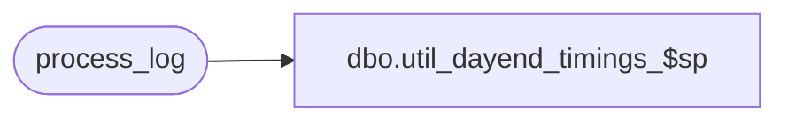

# dbo.util_dayend_timings_$sp

**Database:** auditworks  
**Server:** bedrockdb01  

## Architecture Diagram



## Table Dependencies

| Referenced Table |
|---|
| process_log |

## Stored Procedure Code

```sql
create proc dbo.util_dayend_timings_$sp 
@start_date smalldatetime = '01/01/96',
@end_date smalldatetime = null

AS

/*  Proc Name: util_dayend_timings_$sp
    Desc: Display timings for dayend.
	    process_no : 18 = dayend_post

HISTORY
Date     Name           Def#  Desc
Oct10,07 PaulS          91395 use convert to avoid blowing display mask
  */

SELECT  process_no,
	process_start_time, transaction_count,
	seconds= DATEDIFF(ss, process_start_time, process_end_time),
	'tran/second'=
	transaction_count / CONVERT(float,(DATEDIFF(ss, process_start_time, process_end_time)+.0001)),
	batch_process_id
  FROM process_log
  WHERE process_no >= 16
  AND (process_no <= 29 OR process_no = 41)
  AND process_no != 19
  AND process_start_time >= @start_date
  AND process_start_time <= ISNULL(@end_date, getdate())
ORDER BY process_start_time, process_no, batch_process_id

RETURN
```

