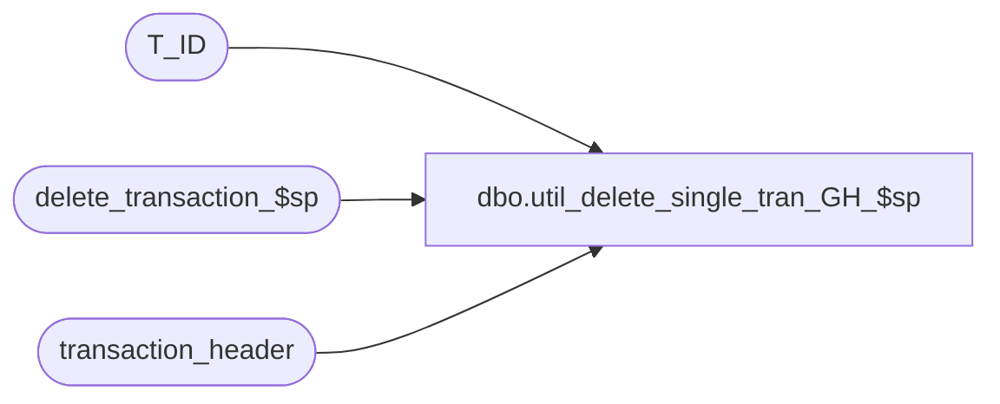

# dbo.util_delete_single_tran_GH_$sp

**Database:** auditworks  
**Server:** bedrockdb01  

## Architecture Diagram



## Table Dependencies

| Referenced Table |
|---|
| T_ID |
| delete_transaction_$sp |
| transaction_header |

## Stored Procedure Code

```sql
CREATE proc [dbo].[util_delete_single_tran_GH_$sp]

/* DESCRIPTION */
/*
Client: Build A Bear
Date: 08222022
Version: SA 5.1
Description: delete list of transactions drive from transaction_id's put into the temp table #corrections.
*/

AS

DECLARE
@transaction_id          numeric(12,0),
@process_id                binary(16),
@ENTRY_ID                        T_ID

SELECT @process_id = NEWID(),
   @ENTRY_ID = NEWID()

/* change this query to identify unique transaction_id's to delete */

/*
select * into deltrans_s361_20220822 
from transaction_header
where transaction_id = 457002954
*/

DECLARE correction_crsr CURSOR
FOR
select distinct transaction_id 
from transaction_header
where store_no = 990
and register_no = 2
and if_rejection_flag > 0
and cashier_no = 999
and transaction_no between 56221 and 57220
--and transaction_id in  (476069034,476069035,476069036,476069037,476069038,476069039,476069040,476069041,476069042,476069043)

OPEN correction_crsr
WHILE 1=1
  BEGIN
    FETCH correction_crsr INTO
 @transaction_id
     IF @@fetch_status <> 0
      BREAK
 

--  EXEC lock_store_date_$sp(i_store_no,i_transaction_date,i_date_reject_id,35);
--  EXEC create_function_status_$sp ('SUPPORT',35,i_transaction_id,0,NULL,i_date_reject_id,0,1);

EXEC delete_transaction_$sp @process_id, 65,  @transaction_id, @ENTRY_ID, 1, NULL
 
   END /* WHILE 1=1 */

CLOSE correction_crsr

DEALLOCATE correction_crsr
```

