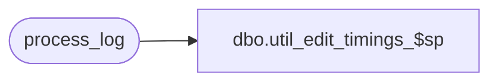

# dbo.util_edit_timings_$sp

**Database:** auditworks  
**Server:** bedrockdb01  

## Architecture Diagram



## Table Dependencies

| Referenced Table |
|---|
| process_log |

## Stored Procedure Code

```sql
create proc dbo.util_edit_timings_$sp @start_date smalldatetime = '01/01/96',
@end_date smalldatetime = null

AS

/*  Proc Name: util_edit_timings_$sp
    Desc: Display timings for edit.
    process_no : 1 = build details
                 2 = build interfaces
                 5 = store-reg-date totals, glc posting ( edit phase2 )
                 15 = customer liability posting


HISTORY
Date     Name           Def#  Desc
Oct10,07 PaulS          91395 use convert to avoid blowing display mask
Jan25,00 AnthonyB        7258 new variable start_date to specify range of dates
*/

SELECT  process_no,
	process_start_time, transaction_count,
	seconds= DATEDIFF(ss, process_start_time, process_end_time),
	'tran/second'=
	transaction_count / CONVERT(float,(DATEDIFF(ss, process_start_time, process_end_time)+.0001)),
	batch_process_id
  FROM process_log
  WHERE process_no <= 6 -- 1= details, 2= interfaces, 5 = edit phase2
  AND process_start_time >= @start_date
  AND process_start_time <= ISNULL(@end_date, getdate())
  ORDER BY batch_process_id, process_start_time

RETURN
```

