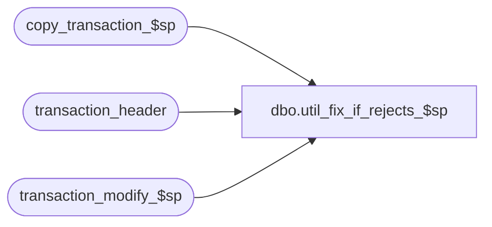

# dbo.util_fix_if_rejects_$sp

**Database:** auditworks  
**Server:** bedrockdb01  

## Architecture Diagram



## Table Dependencies

| Referenced Table |
|---|
| copy_transaction_$sp |
| transaction_header |
| transaction_modify_$sp |

## Stored Procedure Code

```sql
CREATE proc  [dbo].[util_fix_if_rejects_$sp] 
/*******************************************************
*	                                                 
*Author: Shapoor Dec. 09, 1998                                       
*                              
*Comments: To correct I/F rejects.                                     
*	                                                 
*******************************************************/
/*@if_reject_reason		smallint*/

AS

DECLARE
	@transaction_id		numeric(12,0)

SELECT DISTINCT transaction_id
  INTO #corrections
  FROM transaction_header
where store_no = 4
AND transaction_date = '12/29/14' 
  /*FROM if_rejection_reason irr, transaction_header th
 WHERE irr.transaction_id = th.transaction_id
   AND irr.if_reject_reason = @if_reject_reason*/


DECLARE correction_crsr CURSOR
FOR
SELECT transaction_id
  FROM #corrections
  
OPEN correction_crsr

WHILE 1=1
  BEGIN
    FETCH correction_crsr INTO
	@transaction_id

    IF @@fetch_status <> 0
      BREAK
    

     EXEC copy_transaction_$sp @transaction_id , null , 0

     EXEC transaction_modify_$sp @transaction_id , null
    
  END /* WHILE 1=1 */

CLOSE correction_crsr
DEALLOCATE correction_crsr
```

