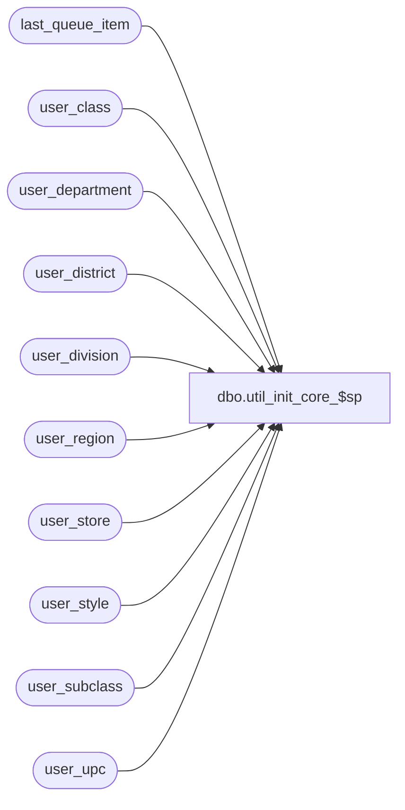

# dbo.util_init_core_$sp

**Database:** auditworks  
**Server:** bedrockdb01  

## Architecture Diagram



## Table Dependencies

| Referenced Table |
|---|
| last_queue_item |
| user_class |
| user_department |
| user_district |
| user_division |
| user_region |
| user_store |
| user_style |
| user_subclass |
| user_upc |

## Stored Procedure Code

```sql
-- creates a proc that can be called to init the EDM/PROD tables

CREATE proc util_init_core_$sp as

BEGIN TRAN

DECLARE @errmsg VARCHAR(128), @errno int
SET @errmsg='Failed to '


PRINT 'Initializing Product/EDM tables'
PRINT  'Table: user_upc'
truncate table user_upc

if @@error !=0
begin
	SELECT @errno=@@error+100000, @errmsg=@errmsg + 'truncate user_upc'
	GOTO error
end

PRINT  'Table: user_style'
truncate table user_style
if @@error !=0
begin
	SELECT @errno=@@error+100000, @errmsg=@errmsg + 'truncate user_style'
	GOTO error
end

PRINT  'Table: user_class'
truncate table user_class
if @@error !=0
begin
	SELECT @errno=@@error+100000, @errmsg=@errmsg + 'truncate user_class'
	GOTO error
end

PRINT  'Table: user_department'
truncate table user_department
if @@error !=0
begin
	SELECT @errno=@@error+100000, @errmsg=@errmsg + 'truncate user_department'
	GOTO error
end

PRINT  'Table: user_store'
truncate table user_store
if @@error !=0
begin
	SELECT @errno=@@error+100000, @errmsg=@errmsg + 'truncate user_store'
	GOTO error
end

PRINT  'Table: user_division'
truncate table user_division
if @@error !=0
begin
	SELECT @errno=@@error+100000, @errmsg=@errmsg + 'truncate user_division'
	GOTO error
end

insert into user_division (division_code, division_name)
values (0,'N/A')
if @@error !=0
begin
	SELECT @errno=@@error+100000, @errmsg='insert user_division'
	GOTO error
end


PRINT  'Table: user_district'
truncate table user_district
if @@error !=0
begin
	SELECT @errno=@@error+100000, @errmsg=@errmsg + 'truncate user_district'
	GOTO error
end

insert into user_district (district_code, district_name)
values (0,'N/A')
if @@error !=0
begin
	SELECT @errno=@@error+100000, @errmsg='insert user_district'
	GOTO error
end


PRINT  'Table: user_region'
truncate table user_region
if @@error !=0
begin
	SELECT @errno=@@error+100000, @errmsg=@errmsg + 'delete user_region'
	GOTO error
end

insert into user_region (region_code, region_name)
values (0,'N/A')
if @@error !=0
begin
	SELECT @errno=@@error+100000, @errmsg='insert user_region'
	GOTO error
end


/*PRINT  'Table: employee'
truncate table employee
if @@error !=0
begin
	SELECT @errno=@@error+100000, @errmsg=@errmsg + 'truncate employee'
	GOTO error
end

PRINT  'Table: user_calendar'
truncate table user_calendar
if @@error !=0
begin
	SELECT @errno=@@error+100000, @errmsg=@errmsg + 'truncate user_calendar'
	GOTO error
end
*/

PRINT  'Table: user_subclass'
truncate table user_subclass
if @@error !=0
begin
	SELECT @errno=@@error+100000, @errmsg=@errmsg + 'truncate user_subclass'
	GOTO error
end


PRINT  'Resetting last_queue_item'
update last_queue_item
set last_sequence_id=0 where segment_id = 1003
if @@error !=0
begin
	SELECT @errno=@@error+100000, @errmsg='update last_queue_item'
	GOTO error
end

COMMIT TRAN
return


error:
if @@trancount > 0 rollback transaction

RAISERROR @errno @errmsg

return
```

