# dbo.util_init_pipeline_$sp

**Database:** auditworks  
**Server:** bedrockdb01  

## Architecture Diagram

```mermaid
flowchart LR
    SP["dbo.util_init_pipeline_$sp"]
    CLNDR(["CLNDR"]) --> SP
    CLNDR_LANG(["CLNDR_LANG"]) --> SP
    CLNDR_LVL(["CLNDR_LVL"]) --> SP
    CLNDR_LVL_ASCTN(["CLNDR_LVL_ASCTN"]) --> SP
    CLNDR_PRD(["CLNDR_PRD"]) --> SP
    CLNDR_PRD_ASCTN(["CLNDR_PRD_ASCTN"]) --> SP
    CLNDR_PRD_LANG(["CLNDR_PRD_LANG"]) --> SP
    CRDM_PRMTRS(["CRDM_PRMTRS"]) --> SP
    EMPLY(["EMPLY"]) --> SP
    EMPLY_AVLBLTY_EXCPTN(["EMPLY_AVLBLTY_EXCPTN"]) --> SP
    EMPLY_AVLBLTY_HOUR(["EMPLY_AVLBLTY_HOUR"]) --> SP
    EMPLY_CMSN_PLAN(["EMPLY_CMSN_PLAN"]) --> SP
    EMPLY_CMSN_PLAN_A(["EMPLY_CMSN_PLAN_A"]) --> SP
    EMPLY_HRCHY_LVL_GRP(["EMPLY_HRCHY_LVL_GRP"]) --> SP
    EMPLY_HRCHY_LVL_GRP_A(["EMPLY_HRCHY_LVL_GRP_A"]) --> SP
    EMPLY_HRCHY_LVL_GRP_LANG(["EMPLY_HRCHY_LVL_GRP_LANG"]) --> SP
    EMPLY_ITIN(["EMPLY_ITIN"]) --> SP
    EMPLY_ORG_BANK_A(["EMPLY_ORG_BANK_A"]) --> SP
    EMPLY_ORG_CHN_PSTN_A(["EMPLY_ORG_CHN_PSTN_A"]) --> SP
    EMPLY_ORG_CHN_PSTN_ACTVTY_A(["EMPLY_ORG_CHN_PSTN_ACTVTY_A"]) --> SP
    EMPLY_ORG_CHN_PSTN_A_HSTRY(["EMPLY_ORG_CHN_PSTN_A_HSTRY"]) --> SP
    EMPLY_PRPRTY_VAL_A(["EMPLY_PRPRTY_VAL_A"]) --> SP
    EMPLY_STS_HSTRY(["EMPLY_STS_HSTRY"]) --> SP
    GEOG_ADRS(["GEOG_ADRS"]) --> SP
    GEOG_ADRS_CRDNT(["GEOG_ADRS_CRDNT"]) --> SP
    ORG_BANK(["ORG_BANK"]) --> SP
    ORG_BANK_ACNT(["ORG_BANK_ACNT"]) --> SP
    ORG_BANK_ACNT_LANG(["ORG_BANK_ACNT_LANG"]) --> SP
    ORG_BANK_BRNCH(["ORG_BANK_BRNCH"]) --> SP
    ORG_BANK_BRNCH_LANG(["ORG_BANK_BRNCH_LANG"]) --> SP
    ORG_BANK_LANG(["ORG_BANK_LANG"]) --> SP
    ORG_CHN(["ORG_CHN"]) --> SP
    ORG_CHN_APLCTN_USG(["ORG_CHN_APLCTN_USG"]) --> SP
    ORG_CHN_CAR_A(["ORG_CHN_CAR_A"]) --> SP
    ORG_CHN_FCLTY_BIN_LOC(["ORG_CHN_FCLTY_BIN_LOC"]) --> SP
    ORG_CHN_FCLTY_BIN_LOC_LANG(["ORG_CHN_FCLTY_BIN_LOC_LANG"]) --> SP
    ORG_CHN_FCLTY_CNTNR_TYPE_A(["ORG_CHN_FCLTY_CNTNR_TYPE_A"]) --> SP
    ORG_CHN_HRCHY(["ORG_CHN_HRCHY"]) --> SP
    ORG_CHN_HRCHY_APP(["ORG_CHN_HRCHY_APP"]) --> SP
    ORG_CHN_HRCHY_LANG(["ORG_CHN_HRCHY_LANG"]) --> SP
    ORG_CHN_HRCHY_LVL(["ORG_CHN_HRCHY_LVL"]) --> SP
    ORG_CHN_HRCHY_LVL_GRP(["ORG_CHN_HRCHY_LVL_GRP"]) --> SP
    ORG_CHN_HRCHY_LVL_GRP_A(["ORG_CHN_HRCHY_LVL_GRP_A"]) --> SP
    ORG_CHN_HRCHY_LVL_GRP_LANG(["ORG_CHN_HRCHY_LVL_GRP_LANG"]) --> SP
    ORG_CHN_HRCHY_LVL_LANG(["ORG_CHN_HRCHY_LVL_LANG"]) --> SP
    ORG_CHN_LANG(["ORG_CHN_LANG"]) --> SP
    ORG_CHN_LOC(["ORG_CHN_LOC"]) --> SP
    ORG_CHN_LOC_ENV_CLS_A(["ORG_CHN_LOC_ENV_CLS_A"]) --> SP
    ORG_CHN_LOC_FNCTN_A(["ORG_CHN_LOC_FNCTN_A"]) --> SP
    ORG_CHN_LOC_HRCHY_LVL_GRP(["ORG_CHN_LOC_HRCHY_LVL_GRP"]) --> SP
    ORG_CHN_LOC_HRCHY_LVL_GRP_A(["ORG_CHN_LOC_HRCHY_LVL_GRP_A"]) --> SP
    ORG_CHN_LOC_HRCHY_LVL_GRP_LANG(["ORG_CHN_LOC_HRCHY_LVL_GRP_LANG"]) --> SP
    ORG_CHN_LOC_LANG(["ORG_CHN_LOC_LANG"]) --> SP
    ORG_CHN_OPEN_HOUR_EXCPTN(["ORG_CHN_OPEN_HOUR_EXCPTN"]) --> SP
    ORG_CHN_OPEN_HOUR_HSTRY(["ORG_CHN_OPEN_HOUR_HSTRY"]) --> SP
    ORG_CHN_OPRT_HOUR_EXCPTN(["ORG_CHN_OPRT_HOUR_EXCPTN"]) --> SP
    ORG_CHN_OPRT_HOUR_HSTRY(["ORG_CHN_OPRT_HOUR_HSTRY"]) --> SP
    ORG_CHN_PYMNT_PRCSR_A(["ORG_CHN_PYMNT_PRCSR_A"]) --> SP
    ORG_CHN_STR_BANK_ACNT_A(["ORG_CHN_STR_BANK_ACNT_A"]) --> SP
    ORG_CHN_STR_SAFE(["ORG_CHN_STR_SAFE"]) --> SP
    ORG_CHN_STR_SAFE_LANG(["ORG_CHN_STR_SAFE_LANG"]) --> SP
    ORG_CHN_STR_TRAY(["ORG_CHN_STR_TRAY"]) --> SP
    ORG_CHN_STR_TRAY_LANG(["ORG_CHN_STR_TRAY_LANG"]) --> SP
    ORG_CHN_WRKSTN(["ORG_CHN_WRKSTN"]) --> SP
    ORG_CHN_WRKSTN_CNFG_A(["ORG_CHN_WRKSTN_CNFG_A"]) --> SP
    PRTY_ADRS(["PRTY_ADRS"]) --> SP
    PRTY_ADRS_USG(["PRTY_ADRS_USG"]) --> SP
    PRTY_CNTCT(["PRTY_CNTCT"]) --> SP
    SCRTY_ACS_HRCHY_LVL_GRP(["SCRTY_ACS_HRCHY_LVL_GRP"]) --> SP
    language_dependent_description(["language_dependent_description"]) --> SP
    language_resource(["language_resource"]) --> SP
    last_queue_item(["last_queue_item"]) --> SP
    media_parameter_selection(["media_parameter_selection"]) --> SP
    store_settlement_data(["store_settlement_data"]) --> SP
    user_class(["user_class"]) --> SP
    user_department(["user_department"]) --> SP
    user_pos_identifier(["user_pos_identifier"]) --> SP
    user_style(["user_style"]) --> SP
    user_subclass(["user_subclass"]) --> SP
    user_upc(["user_upc"]) --> SP
```



## Table Dependencies

| Referenced Table |
|---|
| CLNDR |
| CLNDR_LANG |
| CLNDR_LVL |
| CLNDR_LVL_ASCTN |
| CLNDR_PRD |
| CLNDR_PRD_ASCTN |
| CLNDR_PRD_LANG |
| CRDM_PRMTRS |
| EMPLY |
| EMPLY_AVLBLTY_EXCPTN |
| EMPLY_AVLBLTY_HOUR |
| EMPLY_CMSN_PLAN |
| EMPLY_CMSN_PLAN_A |
| EMPLY_HRCHY_LVL_GRP |
| EMPLY_HRCHY_LVL_GRP_A |
| EMPLY_HRCHY_LVL_GRP_LANG |
| EMPLY_ITIN |
| EMPLY_ORG_BANK_A |
| EMPLY_ORG_CHN_PSTN_A |
| EMPLY_ORG_CHN_PSTN_ACTVTY_A |
| EMPLY_ORG_CHN_PSTN_A_HSTRY |
| EMPLY_PRPRTY_VAL_A |
| EMPLY_STS_HSTRY |
| GEOG_ADRS |
| GEOG_ADRS_CRDNT |
| ORG_BANK |
| ORG_BANK_ACNT |
| ORG_BANK_ACNT_LANG |
| ORG_BANK_BRNCH |
| ORG_BANK_BRNCH_LANG |
| ORG_BANK_LANG |
| ORG_CHN |
| ORG_CHN_APLCTN_USG |
| ORG_CHN_CAR_A |
| ORG_CHN_FCLTY_BIN_LOC |
| ORG_CHN_FCLTY_BIN_LOC_LANG |
| ORG_CHN_FCLTY_CNTNR_TYPE_A |
| ORG_CHN_HRCHY |
| ORG_CHN_HRCHY_APP |
| ORG_CHN_HRCHY_LANG |
| ORG_CHN_HRCHY_LVL |
| ORG_CHN_HRCHY_LVL_GRP |
| ORG_CHN_HRCHY_LVL_GRP_A |
| ORG_CHN_HRCHY_LVL_GRP_LANG |
| ORG_CHN_HRCHY_LVL_LANG |
| ORG_CHN_LANG |
| ORG_CHN_LOC |
| ORG_CHN_LOC_ENV_CLS_A |
| ORG_CHN_LOC_FNCTN_A |
| ORG_CHN_LOC_HRCHY_LVL_GRP |
| ORG_CHN_LOC_HRCHY_LVL_GRP_A |
| ORG_CHN_LOC_HRCHY_LVL_GRP_LANG |
| ORG_CHN_LOC_LANG |
| ORG_CHN_OPEN_HOUR_EXCPTN |
| ORG_CHN_OPEN_HOUR_HSTRY |
| ORG_CHN_OPRT_HOUR_EXCPTN |
| ORG_CHN_OPRT_HOUR_HSTRY |
| ORG_CHN_PYMNT_PRCSR_A |
| ORG_CHN_STR_BANK_ACNT_A |
| ORG_CHN_STR_SAFE |
| ORG_CHN_STR_SAFE_LANG |
| ORG_CHN_STR_TRAY |
| ORG_CHN_STR_TRAY_LANG |
| ORG_CHN_WRKSTN |
| ORG_CHN_WRKSTN_CNFG_A |
| PRTY_ADRS |
| PRTY_ADRS_USG |
| PRTY_CNTCT |
| SCRTY_ACS_HRCHY_LVL_GRP |
| language_dependent_description |
| language_resource |
| last_queue_item |
| media_parameter_selection |
| store_settlement_data |
| user_class |
| user_department |
| user_pos_identifier |
| user_style |
| user_subclass |
| user_upc |

## Stored Procedure Code

```sql
create proc dbo.util_init_pipeline_$sp ( @initialize_stores tinyint = 1, --to avoid initializing store and employee information set to 0
  @initialize_non_merch tinyint =0)  --to remove gift-card denominations set to 1
AS
/* 
DESCRIPTION:
   WARNING!  Should only be run prior prior to creating new customer specific configuration.
   Removes Calendar, Locations (and related information such as Banks, Hierarchies and security references to them, Parameter set assignments, etc), Employees (and related information such as position and location assignments),
           merchandise class/style/sku information etc.
   
   Intended to be run once prior to beginnig customer-specific configuration in order to remove master table data installed 
   with the Enterprise Express Base State for S/A and CRDM for testing purposes as well as master data that would be fed to S/A from the EDM pipeline,
   with the exception of store 9999 and employee 9999 left as examples since referenced by S/A config and the hierarchies to which they are associated.
   
   ==========  S/A 5.0+  CRDM version ==========

HISTORY:
2014Sep02 Vicci TFS-75401 Take ORG_CHN_HRCHY_APP (CRM) into account.
2014Jun12 Vicci           Do not delete ORG_CHN_HRCHY_LVL_GRP entries referenced as default groups for mandatory-assignment hierarchies.
2014Jun11 Vicci           Remove children worstations first to avoid [ORCHWR_ORCHWR_FK] error.
2013Mar22 Vicci    141664 PRMRY_LOC_ID in EMPLY_ORG_CHN_PSTN_A interferes with ORG_CHN_LOC deletion so move employee cleanup to be first.
2013Feb07 Vicci    141664 Correct double negative:  was deleting safes and trays not associated with stores that are NOT 9999 
                          instead of deleting safes and trays not associated with store 9999.
		  	  Also initialize store primary bank account references and 
			  remove employees before stores because of employee primary store references.
2012Jun04 Vicci    134811 When initializing calendar, also reset calendar selection parameter to avoid integrity
2011Feb15 Vicci    124584 Handle null parent ID in cleanup of hierarchy level groups.
2011Feb04 Vicci    124584 Correct cleanup of hierarchy level groups.
2010Nov22 Vicci    122171 Do not remove gift-card denominations unles specifically requested.
2010Mar26 Vicci           Initialize store_settlement_data
2009Nov06 Vicci           Do not remove default selling area function configuration
2009Nov05 Vicci           Delete instead of truncating to avoid referencial key constraint issues.
2009Oct14 Vicci           Ensure security access doesn't reference obsolete group
2009Oct13 Vicci           Replace references to obsolete S/A 4.1 tables with references to CRDM tables
2006Feb03 Vicci		  Initialize division/region/district
2006Jan06 Vicci  	  Added input parameter for whether or not to initialize stores
*/
DECLARE @passes int

PRINT 'Removing calendar'
DELETE CLNDR_LANG
DELETE CLNDR_PRD_ASCTN 
DELETE CLNDR_PRD_LANG
DELETE CLNDR_PRD
DELETE CLNDR_LVL_ASCTN 
DELETE CLNDR_LVL
DELETE CLNDR
UPDATE CRDM_PRMTRS
  SET PRMTR_VAL_BIN = (SELECT MIN(CLNDR_ID) FROM CLNDR)
 WHERE PRMTR_NAME = 'GL_PSTNG_CLNDR_ID'

/* Location */
IF @initialize_stores = 1
BEGIN
  PRINT 'Removing master data related to stores other than 9999'
  
  delete ORG_CHN_STR_SAFE_LANG 
   where SAFE_ID NOT IN (select SAFE_ID from ORG_CHN_STR_SAFE where ORG_CHN_NUM = 9999)
  delete ORG_CHN_STR_SAFE  
   where ORG_CHN_NUM <> 9999
   
  delete ORG_CHN_STR_TRAY_LANG 
   where TRAY_ID NOT IN (select TRAY_ID from ORG_CHN_STR_TRAY where ORG_CHN_NUM = 9999)
  delete ORG_CHN_STR_TRAY  
   where ORG_CHN_NUM <> 9999
   
  delete ORG_CHN_WRKSTN_CNFG_A
   where WRKSTN_ID NOT IN (select WRKSTN_ID from ORG_CHN_WRKSTN where ORG_CHN_NUM = 9999)
  delete ORG_CHN_WRKSTN
   where ORG_CHN_NUM <> 9999
     and PRNT_WRKSTN_ID IS NOT NULL  --to remove children first and avoid [ORCHWR_ORCHWR_FK] error
  delete ORG_CHN_WRKSTN
   where ORG_CHN_NUM <> 9999
   
  delete ORG_CHN_STR_BANK_ACNT_A
   where ORG_CHN_NUM <> 9999
  update ORG_CHN
     set PRMRY_BANK_ACNT_ID = NULL
   where ORG_CHN_NUM <> 9999
  delete ORG_BANK_ACNT_LANG
   where BANK_ACNT_ID NOT IN (select BANK_ACNT_ID from ORG_CHN_STR_BANK_ACNT_A)
     and BANK_ACNT_ID NOT IN (select PRMRY_BANK_ACNT_ID from ORG_CHN WHERE PRMRY_BANK_ACNT_ID IS NOT NULL)
  delete ORG_BANK_ACNT
   where BANK_ACNT_ID NOT IN (select BANK_ACNT_ID from ORG_CHN_STR_BANK_ACNT_A)
     and BANK_ACNT_ID NOT IN (select PRMRY_BANK_ACNT_ID from ORG_CHN WHERE PRMRY_BANK_ACNT_ID IS NOT NULL)
  delete ORG_BANK_BRNCH_LANG
   where BANK_BRNCH_ID NOT IN (select BANK_BRNCH_ID from ORG_BANK_ACNT)
  delete ORG_BANK_BRNCH
   where BANK_BRNCH_ID NOT IN (select BANK_BRNCH_ID from ORG_BANK_ACNT)
  delete ORG_BANK_LANG
   where BANK_ID NOT IN (select BANK_ID from ORG_BANK_BRNCH) 
  delete ORG_BANK
   where BANK_ID NOT IN (select BANK_ID from ORG_BANK_BRNCH) 
   
  delete ORG_CHN_CAR_A 
   where ORG_CHN_NUM <> 9999
   
  delete ORG_CHN_APLCTN_USG
   where ORG_CHN_NUM <> 9999

  delete ORG_CHN_LOC_ENV_CLS_A 
   where LOC_ID NOT IN (select LOC_ID from ORG_CHN_LOC where ORG_CHN_NUM = 9999)
  delete ORG_CHN_LOC_FNCTN_A 
   where LOC_ID NOT IN (select LOC_ID from ORG_CHN_LOC where ORG_CHN_NUM = 9999)
--  delete ORG_CHN_LOC_FNCTN_LANG
--   where FNCTN_NUM >= 0 AND FNCTN_NUM NOT IN (select FNCTN_NUM from ORG_CHN_LOC_FNCTN_A)
--  delete ORG_CHN_LOC_FNCTN
--   where FNCTN_NUM >= 0 AND FNCTN_NUM NOT IN (select FNCTN_NUM from ORG_CHN_LOC_FNCTN_A)

  delete ORG_CHN_LOC_HRCHY_LVL_GRP_A  
   where LOC_ID NOT IN (select LOC_ID from ORG_CHN_LOC where ORG_CHN_NUM = 9999)
  delete ORG_CHN_LOC_HRCHY_LVL_GRP_LANG 
   where HRCHY_LVL_GRP_ID NOT IN (select HRCHY_LVL_GRP_ID from ORG_CHN_LOC_HRCHY_LVL_GRP_A)
  delete ORG_CHN_LOC_HRCHY_LVL_GRP
   where HRCHY_LVL_GRP_ID NOT IN (select HRCHY_LVL_GRP_ID from ORG_CHN_LOC_HRCHY_LVL_GRP_A)
  delete ORG_CHN_FCLTY_CNTNR_TYPE_A
   where LOC_ID NOT IN (select LOC_ID from ORG_CHN_LOC where ORG_CHN_NUM = 9999)
  delete ORG_CHN_FCLTY_BIN_LOC_LANG
   where BIN_LOC_ID NOT IN (select BIN_LOC_ID from ORG_CHN_FCLTY_BIN_LOC 
        where LOC_ID in (select LOC_ID from ORG_CHN_LOC where ORG_CHN_NUM = 9999))
  delete ORG_CHN_FCLTY_BIN_LOC 
   where LOC_ID NOT IN (select LOC_ID from ORG_CHN_LOC where ORG_CHN_NUM = 9999)
  
  --Done here because of PRMY_ORG_CHN_NUM in EMPLY interfering with ORG_CHN deletion and PRMRY_LOC_ID in EMPLY_ORG_CHN_PSTN_A interferes with ORG_CHN_LOC deletion.
/* Employee:  note backup of managed services test employees is in employee_test */
	PRINT 'Removing employee master data except employee 9999 used in C/L Mass Processing rules'
	  delete EMPLY_ORG_CHN_PSTN_A_HSTRY 
	   where ORG_CHN_NUM <> 9999
	  delete EMPLY_ORG_CHN_PSTN_A
	   where ORG_CHN_NUM <> 9999
	  delete EMPLY_ORG_CHN_PSTN_ACTVTY_A 
	   where ORG_CHN_NUM <> 9999

	delete EMPLY_AVLBLTY_EXCPTN
	 where EMPLY_NUM <> 9999
	delete EMPLY_AVLBLTY_HOUR 
	 where EMPLY_NUM <> 9999
	delete EMPLY_CMSN_PLAN_A  
	 where EMPLY_NUM <> 9999
	delete EMPLY_CMSN_PLAN
	 where CMSN_PLAN_CODE NOT IN (select CMSN_PLAN_CODE FROM EMPLY_CMSN_PLAN_A)
	delete EMPLY_HRCHY_LVL_GRP_A 
	 where EMPLY_NUM <> 9999
	delete EMPLY_HRCHY_LVL_GRP_LANG
	 where HRCHY_LVL_GRP_ID NOT IN (select HRCHY_LVL_GRP_ID  from  EMPLY_HRCHY_LVL_GRP_A)
	   and HRCHY_LVL_GRP_ID NOT IN (select PRNT_HRCHY_LVL_GRP_ID  from  EMPLY_HRCHY_LVL_GRP where PRNT_HRCHY_LVL_GRP_ID IS NOT NULL)
	delete EMPLY_HRCHY_LVL_GRP
	 where HRCHY_LVL_GRP_ID NOT IN (select HRCHY_LVL_GRP_ID  from  EMPLY_HRCHY_LVL_GRP_A)
	   and HRCHY_LVL_GRP_ID NOT IN (select PRNT_HRCHY_LVL_GRP_ID  from  EMPLY_HRCHY_LVL_GRP where PRNT_HRCHY_LVL_GRP_ID IS NOT NULL)
	delete EMPLY_ITIN 
	 where EMPLY_NUM <> 9999
	delete EMPLY_ORG_BANK_A 
	 where EMPLY_NUM <> 9999
	delete EMPLY_ORG_CHN_PSTN_A
	 where EMPLY_NUM <> 9999
	delete EMPLY_ORG_CHN_PSTN_A_HSTRY 
	 where EMPLY_NUM <> 9999
	delete EMPLY_ORG_CHN_PSTN_ACTVTY_A 
	 where EMPLY_NUM <> 9999
	delete EMPLY_PRPRTY_VAL_A 
	 where EMPLY_NUM <> 9999
	delete EMPLY_STS_HSTRY
	 where EMPLY_NUM <> 9999
 
	delete EMPLY
	 where EMPLY_NUM <> 9999

  
  delete ORG_CHN_LOC_LANG
   where LOC_ID NOT IN (select LOC_ID from ORG_CHN_LOC where ORG_CHN_NUM = 9999)
  delete ORG_CHN_LOC   
   where ORG_CHN_NUM <> 9999
   
  UPDATE ORG_CHN_HRCHY  --if the hierarchy is about to be deleted, mark is as non-mandatory
     SET DFLT_GRP_ID = NULL, 
         MNDTRY_ASGNMNT = 0
   WHERE DFLT_GRP_ID IS NOT NULL
     AND HRCHY_ID NOT IN (SELECT HRCHY_ID FROM ORG_CHN_HRCHY_LVL_GRP_A WHERE ORG_CHN_NUM <> 9999)
     AND HRCHY_ID NOT IN (SELECT RPRT_HRCHY_ID FROM ORG_CHN_HRCHY_APP)
     AND HRCHY_ID NOT IN (SELECT l.HRCHY_ID
			    FROM ORG_CHN_HRCHY_APP a, ORG_CHN_HRCHY_LVL l
			   WHERE a.DVSN_HRCHY_LVL_ID = l.HRCHY_LVL_ID)

  delete ORG_CHN_HRCHY_LVL_GRP_A
   where ORG_CHN_NUM <> 9999
  
  SELECT @passes = MAX(SEQ_NUM) + 1
    FROM ORG_CHN_HRCHY_LVL
  WHILE @passes > 0
  BEGIN
    SELECT @passes = @passes - 1
    delete SCRTY_ACS_HRCHY_LVL_GRP
     where HRCHY_LVL_GRP_ID <> -1
       and HRCHY_LVL_GRP_ID NOT IN (select g.HRCHY_LVL_GRP_IDNTY
      				    from ORG_CHN_HRCHY_LVL_GRP_A x
    				         INNER JOIN ORG_CHN_HRCHY_LVL_GRP g
    				            on x.HRCHY_LVL_GRP_ID = g.HRCHY_LVL_GRP_ID)
       and HRCHY_LVL_GRP_ID NOT IN (select p.HRCHY_LVL_GRP_IDNTY
    				    from ORG_CHN_HRCHY_LVL_GRP p
    				         INNER JOIN ORG_CHN_HRCHY_LVL_GRP g
    				            on p.HRCHY_LVL_GRP_ID = g.PRNT_HRCHY_LVL_GRP_ID)

    delete ORG_CHN_HRCHY_LVL_GRP_LANG
     where HRCHY_LVL_GRP_ID NOT IN (select HRCHY_LVL_GRP_ID from ORG_CHN_HRCHY_LVL_GRP_A)
       and HRCHY_LVL_GRP_ID NOT IN (select PRNT_HRCHY_LVL_GRP_ID from ORG_CHN_HRCHY_LVL_GRP where PRNT_HRCHY_LVL_GRP_ID IS NOT NULL)
       AND HRCHY_LVL_GRP_ID NOT IN (select DFLT_GRP_ID from ORG_CHN_HRCHY)
    delete ORG_CHN_HRCHY_LVL_GRP
     where HRCHY_LVL_GRP_ID NOT IN (select HRCHY_LVL_GRP_ID from ORG_CHN_HRCHY_LVL_GRP_A)
       and HRCHY_LVL_GRP_ID NOT IN (select PRNT_HRCHY_LVL_GRP_ID from ORG_CHN_HRCHY_LVL_GRP where PRNT_HRCHY_LVL_GRP_ID IS NOT NULL)
       AND HRCHY_LVL_GRP_ID NOT IN (select DFLT_GRP_ID from ORG_CHN_HRCHY)
    IF @@rowcount < 1
      SELECT @passes = 0    
  END  --WHILE @passes > 0
   
  SELECT @passes = MAX(SEQ_NUM) + 1
    FROM ORG_CHN_HRCHY_LVL
  WHILE @passes > 0
  BEGIN
    SELECT @passes = @passes - 1
    delete ORG_CHN_HRCHY_LVL_LANG
     where HRCHY_LVL_ID NOT IN (select HRCHY_LVL_ID from ORG_CHN_HRCHY_LVL_GRP)
       and HRCHY_LVL_ID NOT IN (select PRNT_HRCHY_LVL_ID from ORG_CHN_HRCHY_LVL where PRNT_HRCHY_LVL_ID IS NOT NULL)
    delete ORG_CHN_HRCHY_LVL
     where HRCHY_LVL_ID NOT IN (select HRCHY_LVL_ID from ORG_CHN_HRCHY_LVL_GRP)
       and HRCHY_LVL_ID NOT IN (select PRNT_HRCHY_LVL_ID from ORG_CHN_HRCHY_LVL where PRNT_HRCHY_LVL_ID IS NOT NULL)
    IF @@rowcount < 1
      SELECT @passes = 0    
  END  --WHILE @passes > 0

  delete ORG_CHN_HRCHY_LANG
   where HRCHY_ID NOT IN (select HRCHY_ID from ORG_CHN_HRCHY_LVL)
  delete ORG_CHN_HRCHY
   where HRCHY_ID NOT IN (select HRCHY_ID from ORG_CHN_HRCHY_LVL)
   
  delete ORG_CHN_OPEN_HOUR_EXCPTN
   where ORG_CHN_NUM <> 9999
  delete ORG_CHN_OPEN_HOUR_HSTRY
   where ORG_CHN_NUM <> 9999
  delete ORG_CHN_OPRT_HOUR_EXCPTN
   where ORG_CHN_NUM <> 9999
  delete ORG_CHN_OPRT_HOUR_HSTRY 
   where ORG_CHN_NUM <> 9999
   
  delete ORG_CHN_PYMNT_PRCSR_A 
   where ORG_CHN_NUM <> 9999

  select ADRS_ID 
    into #temp
    from PRTY_ADRS where PRTY_ID IN (select PRTY_ID from ORG_CHN where ORG_CHN_NUM <> 9999)
  delete PRTY_ADRS
   where PRTY_ID IN (select PRTY_ID from ORG_CHN where ORG_CHN_NUM <> 9999)
  delete PRTY_ADRS_USG
   where PRTY_ID IN (select PRTY_ID from ORG_CHN where ORG_CHN_NUM <> 9999)
  delete PRTY_CNTCT
   where PRTY_ID IN (select PRTY_ID from ORG_CHN where ORG_CHN_NUM <> 9999)
  delete GEOG_ADRS_CRDNT 
   where ADRS_ID IN (select ADRS_ID from #temp)
  delete GEOG_ADRS
   where ADRS_ID IN (select ADRS_ID from #temp)
  drop table #temp
       
  delete ORG_CHN_LANG
   where ORG_CHN_NUM <> 9999
  delete ORG_CHN
   where ORG_CHN_NUM <> 9999

  delete media_parameter_selection
   where store_no <> 9999
   
  delete language_dependent_description
   where resource_id in (select resource_id
                           from language_resource 
                          where table_name = 'register'
                            and table_key not like '9999/%')
  delete language_resource
   where table_name = 'register'
     and table_key not like '9999/%'

  delete language_dependent_description
   where resource_id in (select resource_id 
                           from language_resource
                          where table_name in ('user_region', 'user_district', 'user_division')
                            and table_key <> '0')
  delete language_resource
   where table_name in ('user_region', 'user_district', 'user_division')
     and table_key <> '0'
  
  delete store_settlement_data
   where store_no <> 9999
END  --IF @initialize_stores = 1

/* Merchandise */
PRINT 'Removing merchandise item master data'
IF @initialize_non_merch = 1
BEGIN
  truncate table user_upc
  truncate table user_style
  truncate table user_class
  truncate table user_subclass
  truncate table user_pos_identifier
  truncate table user_department
END
ELSE
BEGIN
  DELETE user_upc WHERE upc_lookup_division <> 3
  DELETE user_style WHERE upc_lookup_division <> 3
  DELETE user_class WHERE upc_lookup_division <> 3
  TRUNCATE TABLE user_subclass 
  TRUNCATE TABLE user_pos_identifier 
  DELETE user_department WHERE upc_lookup_division <> 3
END

delete language_dependent_description
where resource_id in (select resource_id 
                        from language_resource 
                       where table_name in ('user_class', 'user_department'))
delete language_resource
where table_name in ('user_class', 'user_department')
 

PRINT 'Resetting log of last pipeline queue entry posted from Merch to S/A'
update last_queue_item
set last_sequence_id = 0

return
```

