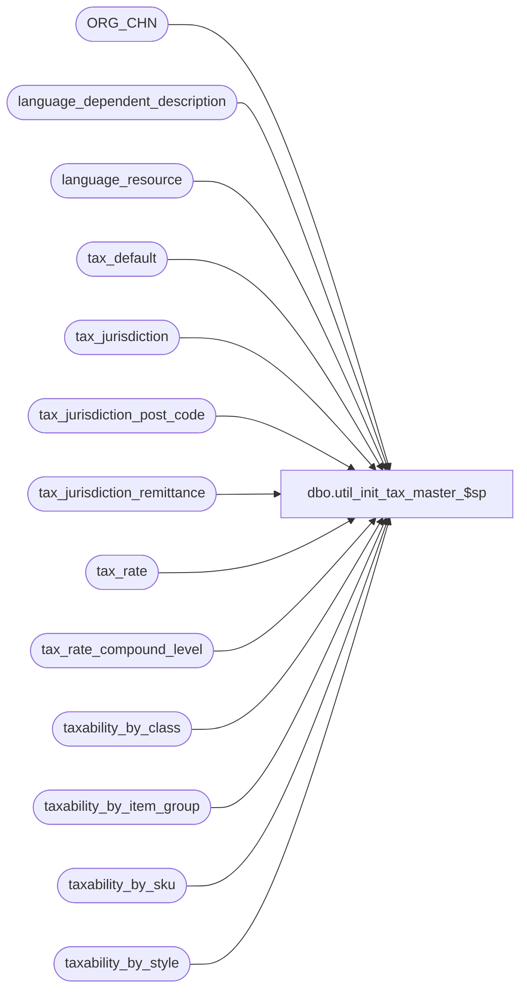

# dbo.util_init_tax_master_$sp

**Database:** auditworks  
**Server:** bedrockdb01  

## Architecture Diagram



## Table Dependencies

| Referenced Table |
|---|
| ORG_CHN |
| language_dependent_description |
| language_resource |
| tax_default |
| tax_jurisdiction |
| tax_jurisdiction_post_code |
| tax_jurisdiction_remittance |
| tax_rate |
| tax_rate_compound_level |
| taxability_by_class |
| taxability_by_item_group |
| taxability_by_sku |
| taxability_by_style |

## Stored Procedure Code

```sql
create proc dbo.util_init_tax_master_$sp 
( @reset_store_tax_jurisdiction tinyint = 0,  --0=Do not update store master tax jurisdiction
                                  	      --1=Reset store master tax jurisdiction to the one specified in @retain_tax_jurisdiction if it would become invalid as a result of this initialization
  @retain_tax_jurisdiction nchar(5) = NULL)    --NULL or valid tax_jurisdiction to be retained and used for store master integrity avoidance
--If @retain_tax_jurisdiction is left NULL, only tax jurisdictions not referenced in the store master will be removed.
--If @retain_tax_jurisdiction is set to a valid tax-jurisdiction (one for which a tax jurisdiction remittance entry exists)
--then any store master references to non-existent tax-jurisdictions will be replace with the one retained.

AS

/*
Description:  This procedure deletes the tax master information for the jurisdictions 
              specified.  The insert into #del_tax_jur may be customized.


=
HISTORY:
Jan16,12   Vicci 132412 Allow @reset_store_tax_jurisdiction to work by specifying @retain_tax_jurisdiction, and since 
                        tax jurisdiction delete trigger now prevents deletions of jurisdictions referenced in the store master,
                        do not attempt to initialize referenced tax jurisdictions.
Jun14,09   Vicci 109078 initialize tax_rate_compound_level (leave schedule behind since won't do harm if not referenced)
May19,06   Vicci	author
*/

CREATE TABLE #del_tax_jur(tax_jurisdiction nchar(5) not null)

IF @retain_tax_jurisdiction IS NOT NULL
   AND NOT EXISTS (SELECT 1 FROM tax_jurisdiction_remittance WHERE tax_jurisdiction = @retain_tax_jurisdiction)
BEGIN
  SELECT @retain_tax_jurisdiction = NULL
END

IF @reset_store_tax_jurisdiction = 1 AND @retain_tax_jurisdiction IS NULL
  SELECT @reset_store_tax_jurisdiction = 0
  
INSERT INTO #del_tax_jur(tax_jurisdiction)
SELECT tax_jurisdiction
  FROM tax_jurisdiction  --customize this insert if needed

DELETE #del_tax_jur
 WHERE tax_jurisdiction = @retain_tax_jurisdiction
 
IF @reset_store_tax_jurisdiction = 1
BEGIN
  UPDATE ORG_CHN
     SET TAX_JRSDCTN_CODE = @retain_tax_jurisdiction
   WHERE TAX_JRSDCTN_CODE IN (SELECT d.tax_jurisdiction FROM #del_tax_jur d)
END
    
DELETE #del_tax_jur
 WHERE tax_jurisdiction IN (SELECT TAX_JRSDCTN_CODE FROM ORG_CHN)

DELETE taxability_by_item_group
 WHERE tax_jurisdiction in (SELECT tax_jurisdiction
                              FROM #del_tax_jur)
DELETE taxability_by_style
 WHERE tax_jurisdiction in (SELECT tax_jurisdiction
                                FROM #del_tax_jur)
DELETE taxability_by_class
 WHERE tax_jurisdiction in (SELECT tax_jurisdiction
                                FROM #del_tax_jur)
DELETE taxability_by_sku
 WHERE tax_jurisdiction in (SELECT tax_jurisdiction
                 FROM #del_tax_jur)
DELETE tax_default
 WHERE tax_jurisdiction in (SELECT tax_jurisdiction
                                FROM #del_tax_jur)
DELETE tax_rate
   WHERE tax_jurisdiction in (SELECT tax_jurisdiction
                    FROM #del_tax_jur)

DELETE tax_rate_compound_level
   WHERE tax_jurisdiction in (SELECT tax_jurisdiction
                    FROM #del_tax_jur)

DELETE tax_jurisdiction_remittance
 WHERE tax_jurisdiction in (SELECT tax_jurisdiction
                                FROM #del_tax_jur)
DELETE tax_jurisdiction_post_code
   WHERE tax_jurisdiction in (SELECT tax_jurisdiction
                                FROM #del_tax_jur)
DELETE tax_jurisdiction
 WHERE tax_jurisdiction in (SELECT tax_jurisdiction
                   FROM #del_tax_jur)

DELETE language_dependent_description
 WHERE resource_id IN (SELECT resource_id 
                           FROM language_resource 
                          WHERE table_name = 'tax_rate'
                            AND resource_id NOT IN (SELECT resource_id
          FROM tax_rate))
DELETE language_resource 
 WHERE table_name = 'tax_rate'
     AND resource_id NOT IN (SELECT resource_id
                               FROM tax_rate)

RETURN
```

