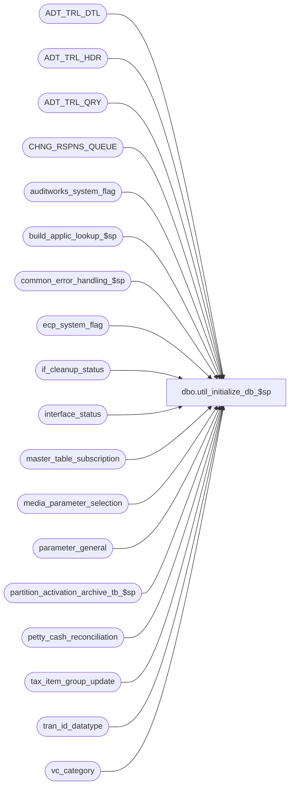

# dbo.util_initialize_db_$sp

**Database:** auditworks  
**Server:** bedrockdb01  

## Architecture Diagram



## Table Dependencies

| Referenced Table |
|---|
| ADT_TRL_DTL |
| ADT_TRL_HDR |
| ADT_TRL_QRY |
| CHNG_RSPNS_QUEUE |
| auditworks_system_flag |
| build_applic_lookup_$sp |
| common_error_handling_$sp |
| ecp_system_flag |
| if_cleanup_status |
| interface_status |
| master_table_subscription |
| media_parameter_selection |
| parameter_general |
| partition_activation_archive_tb_$sp |
| petty_cash_reconciliation |
| tax_item_group_update |
| tran_id_datatype |
| vc_category |

## Stored Procedure Code

```sql
create proc dbo.util_initialize_db_$sp 
AS

/* Proc Name: util_initialize_db_$sp
   DESC: [SA5.0/5.1 version] truncate work and data tables in this db but leave master tables populated.
   

HISTORY
Date     Name         Defect# Desc
Dec20,13 Paul          147019 Use try catch, display number of tables truncated.
Jun12,12 Vicci         136014 Ensure that transaction_header and media_reconciliation_status are reseeded correctly in a scaleout environment.
May29,12 Vicci         134811 If archive tables are partitioned then initialize their partition ranges in accordance with current parameter settings.
Mar15,12 Vicci        FIXREPO Included if_cleanup_status in initialization.
Nov18,10 Vicci         122171 Since ADT_TRL_HDR is referenced by foreign key contraints and the vc_category table 
			      includes it and all other CDM tables in the case of an Enterprise Express implementation,
			      explicitly exclude it from the list of tables to truncate to avoid Error Msg 4712.
Mar02,09 Paul          115834 handle upper case tablenames, added a print at the bottom of the proc to indicate completion after any errors were skipped.
Dec03,08 Paul          105591 Truncate SA5 ADT_TRL tables explicitly because vc_category would not normally contain CDM tables.
				Install.sh truncates vc_category when installing SA, i.e. SA vc_category overlays CDM vc_category.
Jun19,07 Phu          DV-1364 Apply 85598 to SA5. Reset ecp_system_flag
MAR22,06 Vicci		68918 reset interface_status progress and datetime flags,
		              and master_table_subscription last_retrieval_datetime
SEP20,05 Vicci          60266 Port of oracle version created by Maryam
*/


DECLARE
	@errmsg			nvarchar(2000),
	@errmsg2			nvarchar(2000),
	@errmsg3			nvarchar(255),
	@errline			int,
	@errno			int,
	@rows				INT,
	@tb_name		        nvarchar(40),
	@process_no			int,
	@process_id			int,
	@process_name		        nvarchar(100),
	@message_id		        int,	
	@object_name			nvarchar(255),
	@operation_name			nvarchar(255),
	@sql_command 			nvarchar(2000),
	@cursor_open			tinyint,
	@transaction_id 		tran_id_datatype,
	@instance_id 			numeric(2,0),
	@balancing_entity_id 		numeric(10,0),
	@table_counter			int;

SELECT @process_name = 'util_initialize_db_$sp',
       @process_no = 36,
       @message_id = 201068,
       @process_id = @@spid,
       @object_name = 'unknown',
       @operation_name = 'unknown',
       @cursor_open = 0,
       @table_counter = 0;

BEGIN TRY

UPDATE if_cleanup_status
   SET max_if_entry_no = 0,
       min_if_entry_cleanup = 0,
       interface_cleanup_date = NULL;

  UPDATE master_table_subscription
     SET export_status = 0, 
         last_modification_datetime = '01/01/1970', 
         last_export_datetime = '01/01/1970';
     
  UPDATE master_table_subscription
     SET last_retrieval_datetime = (SELECT MAX(last_modified_date_time) 
                                      FROM tax_item_group_update)
   WHERE update_timing > 0
     AND table_name = 'tax_item_group_update';

  UPDATE interface_status
     SET immediate_posting_requested = 0,  posting_in_progress = 0, 
         retrieval_in_progress = 0, 
         last_retrieval_datetime = '01/01/1970', last_posting_datetime = '01/01/1970';

  DELETE media_parameter_selection
   WHERE transaction_id IS NOT NULL;
/* AND FIX EFFECTIVE DATES !!!!!!!!!!!!!!!!!*/

  UPDATE media_parameter_selection
     SET conversion_outstanding = 1
   WHERE conversion_outstanding = 0
     AND EXISTS (SELECT 1 
                   FROM auditworks_system_flag 
                  WHERE flag_name = 'media_rec_not_converted'
                    AND flag_numeric_value = 2);
  
  UPDATE auditworks_system_flag
     SET flag_datetime_value = flag_datetime_initialize_value,
         flag_numeric_value = flag_numeric_initialize_value,
         flag_alpha_value = flag_alpha_initialize_value
   WHERE flag_name <> 'media_rec_not_converted';
         
 UPDATE parameter_general
    SET dayend_in_progress = 0,
        period_end_in_progress = 0, 
        if_lookup_rebuild_flag = 1,
        period_end_date = last_date_closed,
        immediate_dayend_requested = 0,
        dayend_delay_ignored = 0,
        upgrade_in_progress = 0,
        violation_posting_in_progress = 0,
        preliminary_period_end_date = NULL;

IF EXISTS (SELECT 1
           FROM sysobjects t
           WHERE t.type = 'U' AND t.name = 'ecp_system_flag')
BEGIN
  UPDATE ecp_system_flag
     SET flag_datetime_value = flag_datetime_initialize_value,
         flag_numeric_value = flag_numeric_initialize_value,
         flag_alpha_value = flag_alpha_initialize_value;
END

IF EXISTS (select 1
	     from sysobjects t
	    where t.type = 'U' and t.name = 'petty_cash_reconciliation')
BEGIN
  DELETE petty_cash_reconciliation 
   WHERE line_action <> 56;
END

-- truncate the SA5 ADT_TRL tables in a specific order due to FK constraint

TRUNCATE TABLE ADT_TRL_QRY;
TRUNCATE TABLE ADT_TRL_DTL;

SELECT @sql_command = 'ALTER TABLE dbo.ADT_TRL_QRY DROP constraint ADTRQR_ADTRHD_FK';
EXEC sp_executesql @sql_command;

TRUNCATE TABLE ADT_TRL_HDR

SELECT @sql_command = 'ALTER TABLE dbo.ADT_TRL_QRY ADD constraint ADTRQR_ADTRHD_FK foreign key (ENTRY_ID) 
 references dbo.ADT_TRL_HDR (ENTRY_ID)';

EXEC sp_executesql @sql_command;

TRUNCATE TABLE CHNG_RSPNS_QUEUE;

-- truncate the rest of the data and work tables

DECLARE processing_cursor CURSOR FAST_FORWARD
    FOR
 SELECT t.name 
   FROM vc_category v, sysobjects t
  WHERE (v.tb_type = 'Data' OR v.tb_type = 'Work')
    AND UPPER(v.tb_name) = UPPER(t.name)
    AND t.type = 'U'
    AND UPPER(t.name) <> 'ADT_TRL_HDR'  --since it is referenced by foreign key contraints
 ORDER BY t.name;

OPEN processing_cursor;
 SELECT @cursor_open = 1;
 
 FETCH processing_cursor
  INTO @tb_name;

 WHILE @@fetch_status = 0 
 BEGIN
    SELECT @sql_command = 'truncate table ' + @tb_name,
        @table_counter = @table_counter + 1;
    EXEC sp_executesql @sql_command;
	
  FETCH processing_cursor
  INTO @tb_name;
 END; /* while not end of cursor */

CLOSE processing_cursor;
DEALLOCATE processing_cursor;
SELECT @cursor_open = 0;

-- force a rebuild of lookup tables
EXEC build_applic_lookup_$sp @errmsg output, 1;

--Re-seed correct identity series for instance to support scaleout environments.
SELECT @instance_id = CONVERT(tinyint,flag_numeric_value)
  FROM auditworks_system_flag
 WHERE flag_name = 'instance_id';
IF @instance_id IS NULL
  SELECT @instance_id = 0;

SELECT @transaction_id = @instance_id * 1000000000000 + 1;
DBCC CHECKIDENT('transaction_header', RESEED, @transaction_id);

SELECT @balancing_entity_id = @instance_id * 100000000 + 1;
DBCC CHECKIDENT('media_reconciliation_status', RESEED, @transaction_id);

-- Verify if partitioning is turned on
IF EXISTS (SELECT 1
             FROM auditworks_system_flag
            WHERE flag_name = 'partitioning_in_use'
              AND flag_numeric_value = 1)
BEGIN
  EXEC partition_activation_archive_tb_$sp 1;  --initialize archive partitions in accordance with current parameter settings
END;

SELECT @errmsg = 'Initialize completed. ' + CONVERT(nvarchar,@table_counter) + ' tables were initialized.';
PRINT @errmsg;

RETURN;

END TRY

BEGIN CATCH; -- trap system errors
    /* common error handling. Appending proc name here because a rollback could occur if called within a transaction. */

        SELECT @errno = ERROR_NUMBER(),
		@errline = ERROR_LINE();

        SELECT @errmsg = @process_name + ':' + CONVERT(nvarchar, @errline) + ':'
           + COALESCE(@errmsg, ' ') + ':' + ERROR_MESSAGE()

        IF @cursor_open = 1
        BEGIN
	  CLOSE processing_cursor;
	  DEALLOCATE processing_cursor;
	END;

	EXEC common_error_handling_$sp @process_no, @errno, @errmsg, 0, @message_id, 
	@process_name, @object_name, @operation_name, 1;

	RETURN;
END CATCH;
```

