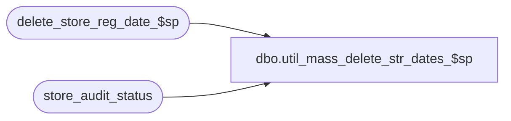

# dbo.util_mass_delete_str_dates_$sp

**Database:** auditworks  
**Server:** bedrockdb01  

## Architecture Diagram



## Table Dependencies

| Referenced Table |
|---|
| delete_store_reg_date_$sp |
| store_audit_status |

## Stored Procedure Code

```sql
create proc dbo.util_mass_delete_str_dates_$sp (@from_sales_date  smalldatetime,
 @to_sales_date  smalldatetime)

AS
 
/*
  PROC NAME: util_mass_delete_str_dates_$sp
  Desc: Attempt to delete all store/dates with store_audit_status between 100 (edited) and 300 (accepted).
 This proc will call the delete_store_reg_date_$sp procedure and delete one str/date at a time.
 
HISTORY:
Date       Name      Def#  Desc
09/07/01   Sab     author
 
*/

DECLARE
 @errno     int,
 @store_no    int,
 @transaction_date   smalldatetime,
 @date_reject_id   tinyint,
 @errmsg    varchar(255)
 

DECLARE store_list_crsr CURSOR FOR
SELECT store_no,
 sales_date
 FROM store_audit_status
 WHERE sales_date between @from_sales_date and @to_sales_date
   AND store_audit_status between 100 and 300
   AND date_reject_id = 0
ORDER BY sales_date,store_no
 FOR READ ONLY
 
OPEN store_list_crsr
 
SELECT @errno = @@error
IF @errno != 0
  BEGIN
   SELECT @errmsg = 'Failed to open store_list_cursor on audit_status'
   GOTO error
  END
 
WHILE 1=1
BEGIN
 
  FETCH store_list_crsr INTO
 @store_no,
 @transaction_date
 
  IF @@fetch_status <> 0
 BREAK
 
  EXEC delete_store_reg_date_$sp "system", NULL, @store_no, @transaction_date, 0, NULL, NULL, @errmsg OUTPUT
 
  SELECT @errno = @@error
  IF @errno != 0
    BEGIN
      IF @errmsg IS NULL
 SELECT @errmsg = "Unable to execute stored procedure delete_store_reg_date_$sp"
      GOTO error
    END
 
END /* While 1=1 */
 
CLOSE store_list_crsr
DEALLOCATE store_list_crsr
 
RETURN
 
error:
 IF @errno < 100000
   SELECT @errno = @errno + 100000
 
 SELECT @errmsg = "delete_store_reg_date_$sp: " + @errmsg
 
 RAISERROR @errno @errmsg
 RETURN
```

