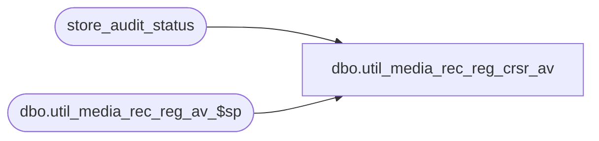

# dbo.util_media_rec_reg_crsr_av

**Database:** auditworks  
**Server:** bedrockdb01  

## Architecture Diagram



## Table Dependencies

| Referenced Table |
|---|
| store_audit_status |
| dbo.util_media_rec_reg_av_$sp |

## Stored Procedure Code

```sql
CREATE proc  [dbo].[util_media_rec_reg_crsr_av] -- create the store procedure 
@min_trans_date datetime,
@max_trans_date datetime = NULL
AS
-- =====================================================================================================
-- Name: util_media_rec_reg_crsr_av
--
-- Description:	
--
-- Input:	
--			
--
-- Output: Resultset with the following columns:
--			
--
-- Dependencies: None
--
-- Revision History
--		Name:			Date:			Comments:
--		Garyd			08/30/2010		Initial version in source control.  Is this a babw sproc?
-- =====================================================================================================

DECLARE	@store_no int,
	@sales_date datetime,
	@cursor_open bit,
	@errmsg varchar(255),
	@errno int,
	@return_code int

SET @errmsg = ''

IF @max_trans_date is null
	SET  @max_trans_date = @min_trans_date

BEGIN
	DECLARE store_date_list CURSOR
	FOR SELECT store_no, sales_date
	FROM store_audit_status
	WHERE store_audit_status between 301 and 500
	AND sales_date between  @min_trans_date and @max_trans_date
	and store_no = 6 --test
END


SELECT @errno = @@error
IF @errno != 0
  BEGIN
   SELECT @errmsg = 'Failed to allocate cursor'
   GOTO error
  END --error

SET @cursor_open = 1
OPEN store_date_list

WHILE @cursor_open = 1
BEGIN
		FETCH store_date_list INTO
			@store_no,
			@sales_date
		
		IF @@fetch_status != 0
			BEGIN
				SET @cursor_open = 0
				CLOSE store_date_list
				DEALLOCATE store_date_list
				BREAK
			END --close cursor
		SELECT 'Processing: Store '+ convert(varchar(32), @store_no)+ ' Date ' + convert(varchar(32), @sales_date)

		BEGIN TRAN
		EXEC @return_code = dbo.util_media_rec_reg_av_$sp @store_no, @sales_date,  @errmsg OUTPUT

		SELECT @errno = @@error
		IF @errno != 0
		  BEGIN
		   SELECT @errmsg = 'Failed to execute proc'
		   GOTO error
		  END --error
		COMMIT TRAN

END

RETURN

error:
IF @cursor_open = 1
BEGIN
	CLOSE store_date_list
	DEALLOCATE store_date_list
END

IF @@trancount !=0
	ROLLBACK

SELECT convert(varchar(20), @errno)+ ' util_media_rec_reg_crsr_av: ' + @errmsg
```

