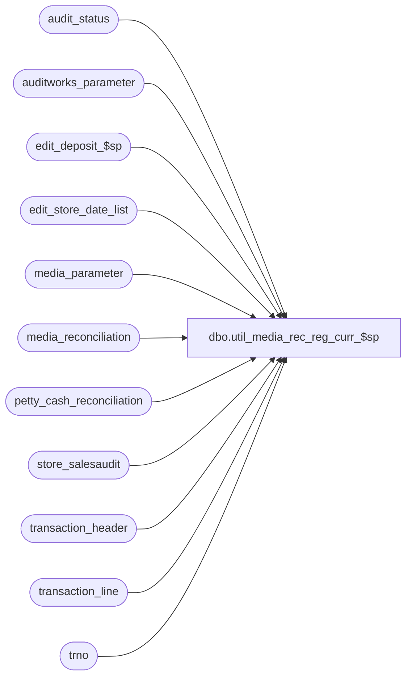

# dbo.util_media_rec_reg_curr_$sp

**Database:** auditworks  
**Server:** bedrockdb01  

## Architecture Diagram



## Table Dependencies

| Referenced Table |
|---|
| audit_status |
| auditworks_parameter |
| edit_deposit_$sp |
| edit_store_date_list |
| media_parameter |
| media_reconciliation |
| petty_cash_reconciliation |
| store_salesaudit |
| transaction_header |
| transaction_line |
| trno |

## Stored Procedure Code

```sql
CREATE proc  dbo.util_media_rec_reg_curr_$sp @store_no int,
@trans_date smalldatetime,
@errmsg varchar(255) OUTPUT

AS

/* Proc Name: util_media_rec_reg_curr_$sp
HISTORY:
Date      Name	Def# Desc
Sep27,01  ShuZ	8790 To recreate entries in media_reconciliation table for store/reg/dates
  		     that have NOT been COMPLETED.  REGISTER balancing method only.
*/


DECLARE
	@acceptable_short_limit 	money,
	@cashier_no 			int,
	@close_no			smallint,
	@closeout_flag			tinyint,
	@count_amount 			money,
	@counted_media_amount 		money,
	@cursor_open			tinyint,
	@declared_deposit_amount	money,
	@deposit_category		smallint,
	@deposit_destination		smallint,
	@deposit_source			smallint,
	@discrepancy_amount 		money,
	@drawer_discrepancy_calc	tinyint,
	@entry_date_time		datetime,
	@errno				int,
	@exchange_ratio			float,
	@expected_drawer_in 		money,
	@expected_drawer_out 		money,
	@expected_exchange_amount 	money,
	@expected_is_drawer_in      	bit,
	@expected_is_drawer_out		bit,
	@expected_is_float_increase 	bit,
	@expected_media_amount      	money,
	@expected_media_sum		money,
	@line_action			tinyint,
	@line_object 			smallint,
	@line_object_type		tinyint,
	@media_count_flag		tinyint,
	@media_not_counted 		bit,
	@media_short 			money,
	@opening_drawer_discrepancy	bit,
	@petty_cash_amount 		money,
	@pickup_loan_amount		money,
	@prev_register_no 		smallint,
	@prev_tran_date 		smalldatetime,
	@prior_sales_date 		smalldatetime,
	@register_no			smallint,
	@rows				int,
	@rows_inserted			int,
	@short_by_tender_over_limit	bit,
	@store_drawer_discrepancy 	bit,
	@store_media_short 		money,
	@store_tender_over_limit 	bit,
	@tender_short 			money,
	@transaction_date 		smalldatetime,
	@transaction_no 		trno,
	@transaction_series		char(1),
	@variance_is_lost_doc		bit,
	@variance_is_short 		bit,
        
        @deposit_balancing_method smallint,
        @media_parameter_table_no smallint,
        @store_deposit_destination smallint,
        @balancing_method smallint,
        @multiple_mediacounts_added bit,
        @edit_timestamp float

/*get parameters for the store*/
  SELECT @media_parameter_table_no = media_parameter_table_no,
	@balancing_method = balancing_method,
	@deposit_balancing_method = deposit_balancing_method,
	@store_deposit_destination = store_deposit_destination,
	@multiple_mediacounts_added = multiple_mediacounts_added
    FROM store_salesaudit
    WHERE @store_no = store_no

SELECT @edit_timestamp = 0

IF @balancing_method != 1
  RETURN
  
/*Insert the rows in edit_store_date_list for the store/date for all regsiters */
INSERT edit_store_date_list(
       store_no,
       transaction_date,
       date_reject_id,
       register_no,
       edit_timestamp,
       posted_flag)
SELECT store_no,
       sales_date,
       0,
       register_no,
       1,
       1
FROM audit_status
WHERE store_no = @store_no
  AND sales_date = @trans_date
  AND date_reject_id = 0 
--  and register_no = @input_register_no --in (3,4) 
  
/* Clear any existing count amounts prior to recalculation */
UPDATE media_reconciliation
  SET --counted_media_amount = 0,
      expected_media_amount = 0,
      expected_exchange_amount = 0,
      pickup_loan_amount = 0
      --declared_deposit_amount = 0
  FROM media_reconciliation mr, edit_store_date_list ed
  WHERE ed.store_no = @store_no
    AND ed.store_no = mr.store_no
    AND mr.transaction_date = ed.transaction_date
    AND mr.register_no = ed.register_no
    AND ed.posted_flag = 1
    AND ed.date_reject_id = 0

SELECT @errno = @@error
IF @errno != 0
  BEGIN
   SELECT @errmsg = 'Failed to update media_reconciliation'
   GOTO error
  END

DECLARE expected_media_crsr CURSOR
FOR
SELECT
	th.transaction_date,
	th.register_no,
	line_object,
	SUM (gross_line_amount * db_cr_none * voiding_reversal_flag)
  FROM edit_store_date_list sd, transaction_header th, transaction_line tl
  WHERE sd.store_no = @store_no
    AND th.store_no = sd.store_no
    AND th.transaction_date = sd.transaction_date
    AND th.date_reject_id = 0
    AND sd.date_reject_id = 0
    AND th.register_no = sd.register_no
    AND sa_rejection_flag = 0
    AND transaction_void_flag * (transaction_void_flag - 8) = 0
    AND th.transaction_id = tl.transaction_id
    AND line_object_type = 6 /* tender */
    AND line_void_flag = 0
    AND line_action < 200
    AND db_cr_none != 0
    AND posted_flag = 1
  GROUP BY th.transaction_date, th.register_no, line_object

/* ***** PASS 1 : CALCULATE EXPECTED MEDIA ***** */

SELECT @declared_deposit_amount = 0,
	@cashier_no = 0 /* since register balancing */

/*{ calculate expected media */

OPEN expected_media_crsr

SELECT @errno = @@error
IF @errno != 0
  BEGIN
   SELECT @errmsg = 'Failed to open cursor expected_media_crsr on transaction details'
   GOTO error
  END

SELECT @cursor_open = 1

WHILE 1=1
BEGIN

FETCH expected_media_crsr INTO
	@transaction_date,
	@register_no,
	@line_object,
	@expected_media_sum

IF @@fetch_status <> 0
  BREAK

UPDATE media_reconciliation
 SET expected_media_amount = @expected_media_sum 
 WHERE store_no = @store_no
   AND transaction_date = @transaction_date
   AND register_no = @register_no
   AND cashier_no = @cashier_no
   AND line_object = @line_object

SELECT @errno = @@error,
	@rows = @@rowcount

IF @errno != 0
  BEGIN
   SELECT @errmsg = 'Failed to update media_reconciliation (pass1)'
   GOTO error
  END

IF @rows = 0
  BEGIN
  SELECT @acceptable_short_limit = acceptable_short_limit,
	@deposit_category = deposit_category,
	@deposit_source = deposit_source,
	@deposit_destination = deposit_destination,
	@media_not_counted = media_not_counted,
	@variance_is_short = variance_is_short,
	@variance_is_lost_doc = variance_is_lost_doc
   FROM media_parameter
   WHERE @media_parameter_table_no = table_no
   AND @line_object = line_object

  IF @@rowcount = 0
    SELECT @acceptable_short_limit = 0,
	@deposit_category = 0,
	@deposit_source = 0,
	@deposit_destination = 0,
	@media_not_counted = 0,
	@variance_is_short = 0,
	@variance_is_lost_doc = 0

  IF @deposit_destination < 0
    SELECT @deposit_destination = @store_deposit_destination

  INSERT media_reconciliation (
	store_no,
	register_no,
	cashier_no,
	transaction_date,
	line_object,
	acceptable_short_limit,
	media_not_counted, 
	variance_is_short,
	variance_is_lost_doc,
	deposit_category,
	deposit_destination,
	deposit_source,
	edit_timestamp,
	expected_media_amount )
  VALUES (
	@store_no,
	@register_no,
	@cashier_no,
	@transaction_date,
	@line_object,
	@acceptable_short_limit,
	@media_not_counted, 
	@variance_is_short,
	@variance_is_lost_doc,
	@deposit_category,
	@deposit_destination,
	@deposit_source,
	@edit_timestamp,
	@expected_media_sum )

  SELECT @errno = @@error
  IF @errno != 0
    BEGIN
     SELECT @errmsg = 'Failed to insert media_reconciliation (pass1)'
     GOTO error
    END

  END

END /* While 1=1 */

CLOSE expected_media_crsr
DEALLOCATE expected_media_crsr

SELECT @cursor_open = 0

/*} calculate expected media */

DECLARE media_count_crsr CURSOR
FOR
SELECT
	th.transaction_date,
	th.register_no,
	entry_date_time,
	line_object,
	line_object_type,
	gross_line_amount * voiding_reversal_flag,
	closeout_flag,
	media_count_flag
  FROM edit_store_date_list sd, transaction_header th, transaction_line tl
  WHERE sd.store_no = @store_no
    AND th.store_no = sd.store_no
    AND th.transaction_date = sd.transaction_date
    AND th.register_no = sd.register_no
    AND th.date_reject_id = 0
    AND sa_rejection_flag = 0
    AND transaction_void_flag * (transaction_void_flag - 8) = 0
    AND ( media_count_flag >= 1 OR closeout_flag >= 1)
    AND th.transaction_id = tl.transaction_id
    AND line_void_flag = 0
    AND (line_action - 246) * CONVERT(smallint, media_count_flag) = 0 /* only action 246 if media count */
    AND posted_flag = 1
  ORDER BY th.transaction_date, th.register_no, entry_date_time,
    th.transaction_id, line_id

--/* ***** PASS 2 : CALCULATE COUNTS ******/
--
--SELECT @close_no = 0
--
--CREATE TABLE #counts (
--        store_no int not null,
--	register_no smallint not null,
--	transaction_date smalldatetime not null,
--	line_object smallint not null,
--	close_no smallint not null,
--	counted_media_amount money not null )
--
--SELECT @errno = @@error
--IF @errno != 0
--  BEGIN
--   SELECT @errmsg = 'Failed to create temp table #counts'
--   GOTO error
--  END
--
--OPEN media_count_crsr
--
--SELECT @errno = @@error
--IF @errno != 0
--  BEGIN
--   SELECT @errmsg = 'Failed to open cursor media_count_crsr'
--   GOTO error
--  END
--
--SELECT @cursor_open = 2
--
--/*{ look for counts and closeouts */
--
--WHILE 2=2
--BEGIN
--FETCH media_count_crsr INTO
--	@transaction_date,
--	@register_no,
--	@entry_date_time,
--	@line_object,
--	@line_object_type,
--	@count_amount,
--	@closeout_flag,
--	@media_count_flag
--
--IF @@fetch_status <> 0
--  BREAK
--
--IF @register_no != @prev_register_no
-- OR @prev_tran_date != @transaction_date
--  SELECT @close_no = @close_no + 1,
--	@prev_register_no = @register_no,
--	@prev_tran_date = @transaction_date
--
--IF @closeout_flag >= 1 AND @media_count_flag = 0
--  BEGIN /* not combined count and closeout */
--   SELECT @close_no = @close_no + 1
--   CONTINUE
--  END
--
--IF @line_object_type != 6
--  CONTINUE
--
--IF @multiple_mediacounts_added = 1 /* always add multiple counts (by assigning new close_no) */
--  SELECT @close_no = @close_no + 1
--
--UPDATE #counts
-- SET counted_media_amount = @count_amount
--  WHERE transaction_date = @transaction_date
--    AND register_no = @register_no
--    AND line_object = @line_object
--    AND close_no = @close_no
--    AND store_no = @store_no
--
--SELECT @rows = @@rowcount,
--	@errno = @@error
--IF @errno != 0
--  BEGIN
--   SELECT @errmsg = 'Failed to update temp table #counts'
--   GOTO error
--  END
--
--IF @rows = 0
--  BEGIN
--   INSERT #counts (
--        store_no,
--	register_no,
--	transaction_date,
--	line_object,
--	close_no,
--	counted_media_amount )
--   VALUES (
--        @store_no,
--	@register_no,
--	@transaction_date,
--	@line_object,
--	@close_no,
--	@count_amount )
--
--   IF @errno != 0
--     BEGIN
--      SELECT @errmsg = 'Failed to insert temp table #counts'
--      GOTO error
--     END
--  END
--
--END /* While 2=2 */
--
--/*} look for counts and closeouts */
--
--CLOSE media_count_crsr
DEALLOCATE media_count_crsr
--SELECT @cursor_open = 0
--
--SELECT 	store_no,
--        register_no,
--	transaction_date,
--	line_object,
--	total_counted = SUM(counted_media_amount)	
--  INTO #count_totals
--  FROM #counts
--  GROUP BY store_no, register_no, transaction_date, line_object
--
--SELECT @rows_inserted = @@rowcount,
--	@errno = @@error
--IF @errno != 0
--  BEGIN
--   SELECT @errmsg = 'Failed to build temp table #count_totals'
--   GOTO error
--  END
--
--UPDATE media_reconciliation
-- SET counted_media_amount = ct.total_counted
--  FROM #count_totals ct, media_reconciliation mr
--   WHERE mr.store_no = ct.store_no
--    AND ct.transaction_date = mr.transaction_date
--    AND ct.register_no = mr.register_no
--    AND mr.cashier_no = @cashier_no
--    AND ct.line_object = mr.line_object
--
--SELECT @rows = @@rowcount,
--	@errno = @@error
--IF @errno != 0
--  BEGIN
--   SELECT @errmsg = 'Failed to update media_reconciliation (pass2)'
--   GOTO error
--  END
--
--IF @rows != @rows_inserted
--  BEGIN /* rows updated != total_rows */
--
--  DELETE #count_totals
--    FROM #count_totals ct, media_reconciliation mr
--    WHERE mr.store_no = ct.store_no
--     AND ct.transaction_date = mr.transaction_date
--     AND ct.register_no = mr.register_no
--     AND mr.cashier_no = @cashier_no
--     AND ct.line_object = mr.line_object
--
--  SELECT @errno = @@error
--  IF @errno != 0
--    BEGIN
--     SELECT @errmsg = 'Failed to delete temp table #count_totals'
--     GOTO error
--    END
--
--  INSERT media_reconciliation (
--	store_no,
--	register_no,
--	cashier_no,
--	transaction_date,
--	line_object,
--	acceptable_short_limit,
--	media_not_counted, 
--	variance_is_short,
--	variance_is_lost_doc,
--	deposit_category,
--	deposit_destination,
--	deposit_source,
--	counted_media_amount,
--	edit_timestamp )
--  SELECT
--	@store_no,
--	register_no,
--	@cashier_no,
--	transaction_date,
--	ct.line_object,
--	acceptable_short_limit,
--	media_not_counted, 
--	variance_is_short,
--	variance_is_lost_doc,
--	deposit_category,
--	(1-SIGN (deposit_destination + 1)) * @store_deposit_destination
--	+ SIGN (deposit_destination +1) * deposit_destination,--defect 6562 deposit_destination,
--	deposit_source,
--	total_counted,
--	@edit_timestamp
--    FROM #count_totals ct, media_parameter mp
--   WHERE table_no = @media_parameter_table_no
--   AND ct.line_object = mp.line_object
--
--  SELECT @errno = @@error
--  IF @errno != 0
--    BEGIN
--     SELECT @errmsg = 'Failed to insert media_reconciliation (pass2)'
--     GOTO error
--    END
--
--  END /* rows updated != total rows */
--
--DROP TABLE #count_totals, #counts

/* ***** PASS 3 : CALCULATE PETTY CASH ***** */

/*{ Reconcile petty cash by comparing petty cash amounts
   on opening and closing transactions. */

/* remove any existing entries before recalculating */
DELETE petty_cash_reconciliation
  FROM edit_store_date_list sd, petty_cash_reconciliation pc
  WHERE sd.store_no = @store_no
   AND sd.date_reject_id = 0
   AND pc.store_no = sd.store_no
   AND sd.transaction_date = pc.transaction_date
   AND sd.register_no = pc.register_no
   AND posted_flag = 1

SELECT @errno = @@error
IF @errno != 0
  BEGIN
   SELECT @errmsg = 'Failed to delete petty_cash_reconciliation'
   GOTO error
  END

DECLARE petty_cash_crsr CURSOR
FOR
SELECT
	sd.register_no,
	sd.transaction_date,
	line_object,
	line_action,
	entry_date_time,
	transaction_no,
	transaction_series,
	SUM(gross_line_amount * tl.db_cr_none * voiding_reversal_flag)
  FROM edit_store_date_list sd, transaction_header th, transaction_line tl
  WHERE sd.store_no = @store_no
   AND sd.date_reject_id = 0
   AND th.store_no = sd.store_no
   AND sd.transaction_date = th.transaction_date
   AND sd.register_no = th.register_no
   AND transaction_void_flag * (transaction_void_flag - 8) = 0
   AND sa_rejection_flag = 0
   AND th.transaction_id = tl.transaction_id
   AND line_object_type IN ( 10, 21 )
   AND line_void_flag = 0
   AND line_action IN ( 31, 32, 46, 47, 56 )
   AND posted_flag = 1
GROUP BY sd.register_no, sd.transaction_date, line_object, line_action,
         entry_date_time, transaction_no, transaction_series
ORDER BY sd.transaction_date, sd.register_no, entry_date_time

OPEN petty_cash_crsr

SELECT @errno = @@error
IF @errno != 0
  BEGIN
   SELECT @errmsg = 'Failed to open cursor petty_cash_crsr'
   GOTO error
  END

SELECT @cursor_open = 3

WHILE 3=3
  BEGIN
  FETCH petty_cash_crsr INTO
	@register_no,
	@transaction_date,
	@line_object,
	@line_action,
	@entry_date_time,
	@transaction_no,
	@transaction_series,
	@petty_cash_amount

  IF @@fetch_status <> 0
    BREAK

  SELECT @discrepancy_amount = 0

  IF @line_action = 31
    BEGIN /* find previous closing balance */
    
    /* Check if drawer_discrepancy_calculation flag is on */
    SELECT @drawer_discrepancy_calc = CONVERT(NUMERIC(1,0), par_value)
      FROM auditworks_parameter
     WHERE par_name = 'drawer_discrepancy_calculation'
    
    SELECT @errno = @@error
    IF @errno != 0
       BEGIN
         SELECT @errmsg = 'Failed to read auditworks_parameter'
   GOTO error
 END

    IF @drawer_discrepancy_calc = 1
      BEGIN

       /* clear any existing discrepancies for the same transaction (multiple type 31) */
       UPDATE petty_cash_reconciliation
          SET discrepancy_amount = 0
        WHERE store_no = @store_no
  	  AND register_no = @register_no
	  AND cashier_no = @cashier_no
          AND transaction_no = @transaction_no
          AND transaction_series = @transaction_series
	  AND entry_datetime = @entry_date_time
	  AND transaction_date = @transaction_date
	  AND line_object = @line_object
	  AND line_action = 31

       SELECT @errno = @@error
       IF @errno != 0
         BEGIN
          SELECT @errmsg = 'Failed to update petty_cash_reconciliation (discrepancy_amount)'
          GOTO error
         END

       /* scan all previous transaction dates */
       SELECT @discrepancy_amount = ISNULL (SUM ( petty_cash_amount ) -
	      SUM ( discrepancy_amount ), 0) + @petty_cash_amount
         FROM petty_cash_reconciliation
        WHERE store_no = @store_no
	  AND register_no = @register_no
	  AND cashier_no = @cashier_no
	  AND entry_datetime < @entry_date_time
	  AND transaction_date <= @transaction_date
	  AND line_object = @line_object
	  AND line_action IN ( 31, 32, 56 )

       SELECT @errno = @@error
       IF @errno != 0
         BEGIN
          SELECT @errmsg = 'Failed to read petty_cash_reconciliation'
          GOTO error
         END

      END /* IF @drawer_discrepancy_calc = 1 */

    END /* find previous closing balance */

    UPDATE petty_cash_reconciliation
       SET petty_cash_amount = petty_cash_amount + @petty_cash_amount,
           discrepancy_amount = discrepancy_amount + @discrepancy_amount
     WHERE store_no = @store_no
       AND register_no = @register_no
       AND cashier_no = @cashier_no
       AND transaction_date = @transaction_date
       AND entry_datetime = @entry_date_time
       AND transaction_no = @transaction_no
       AND transaction_series = @transaction_series
       AND line_object = @line_object
       AND line_action = @line_action

    SELECT @errno = @@error,
	@rows = @@rowcount
    IF @errno != 0
      BEGIN
       SELECT @errmsg = 'Failed to update petty_cash_reconciliation'
       GOTO error
      END

    IF @rows = 0
      BEGIN
      INSERT petty_cash_reconciliation (
	   store_no,
	   register_no,
	   cashier_no,
	   transaction_date,
	   line_object,
	   line_action,
	   transaction_no,
	   transaction_series,
	   entry_datetime,
	   petty_cash_amount,
	   discrepancy_amount )
      VALUES (
	   @store_no,
	   @register_no,
	   @cashier_no,
	   @transaction_date,
	   @line_object,
	   @line_action,
	   @transaction_no,
	   @transaction_series,
	   @entry_date_time,
	   @petty_cash_amount,
	   @discrepancy_amount )

     SELECT @errno = @@error
     IF @errno != 0
       BEGIN
        SELECT @errmsg = 'Failed to insert petty_cash_reconciliation'
        GOTO error
       END

     END
  END /* While 3=3 */

CLOSE petty_cash_crsr
DEALLOCATE petty_cash_crsr

SELECT @cursor_open = 0

/*} Reconcile petty cash by comparing petty cash amounts
   on opening and closing transactions. */

--/*  ********* DECLARED DEPOSIT AMOUNTS **********  */
--
--IF @balancing_method = @deposit_balancing_method   -- dep balancing by register
--BEGIN
--  DECLARE reg_deposit_crsr CURSOR FOR
--   SELECT e.transaction_date,
--          e.register_no,
--          line_object, 
--          ISNULL(SUM(gross_line_amount * voiding_reversal_flag),0)
--       FROM edit_store_date_list e, av_transaction_header th, av_transaction_line tl
--      WHERE e.store_no            = @store_no
--        AND e.date_reject_id = 0
--        AND posted_flag = 1
--        AND e.store_no            = th.store_no
--        AND e.transaction_date    = th.transaction_date
--        AND e.register_no 	  = th.register_no
--        AND e.date_reject_id      = th.date_reject_id
--        AND sa_rejection_flag     = 0
--        AND transaction_void_flag IN(8,0)
--        AND th.av_transaction_id     = tl.av_transaction_id
--        AND line_object_type      = 6 -- tender
--        AND line_action           = 247  -- declared deposit
--        AND line_void_flag = 0
--  GROUP BY e.transaction_date, e.register_no, line_object 
-- 
--  OPEN reg_deposit_crsr
--    
--  SELECT @errno = @@error
--  IF @errno != 0
-- BEGIN
--    SELECT @errmsg = 'Failed to open cursor reg_deposit_crsr'        
--    GOTO error
--  END
--      
--  SELECT @cursor_open = 6
-- 
--  WHILE 6=6
--  BEGIN
--
--    FETCH reg_deposit_crsr 
--     INTO @transaction_date,
--          @register_no,
--          @line_object,
--          @declared_deposit_amount
--	
--    IF @@fetch_status <> 0
--      BREAK
--  
--    UPDATE media_reconciliation
--       SET declared_deposit_amount = @declared_deposit_amount
--     WHERE store_no = @store_no
--       AND register_no = @register_no
--       AND transaction_date = @transaction_date
--       AND cashier_no = 0
--       AND line_object = @line_object
--
--    SELECT @errno = @@error,
--           @rows = @@rowcount
--    IF @errno != 0
--    BEGIN
--      SELECT @errmsg = 'Failed to update media_reconciliation (declared_deposit)'
--      GOTO error
--    END
--       
--    IF @rows = 0  -- no match found in media rec
--    BEGIN
--      INSERT media_reconciliation (
--                store_no,
--        	register_no,
--	        cashier_no,
--		transaction_date,
--		line_object,
--		acceptable_short_limit,
--	        media_not_counted, 
--        	variance_is_short,
--	        variance_is_lost_doc,
--        	deposit_category,
--	        deposit_destination,
--        	deposit_source,
--	        edit_timestamp,
--        	declared_deposit_amount,
--	        remark )
--      SELECT	@store_no,
--		@register_no,
--		0, --cashier_no,
--		@transaction_date,
--		@line_object,
--		acceptable_short_limit,
--		media_not_counted, 
--		variance_is_short,
--		variance_is_lost_doc,
--		deposit_category,
--		(1-SIGN (deposit_destination + 1)) * @store_deposit_destination
--		+ SIGN (deposit_destination +1) * deposit_destination,--defect 6562 deposit_destination,
--		deposit_source,
--		@edit_timestamp,
--		@declared_deposit_amount,
--		'deposit'
--         FROM media_parameter
--        WHERE line_object = @line_object
--          AND table_no = @media_parameter_table_no
--
--      SELECT @errno = @@error
--      IF @errno != 0
--      BEGIN
--        SELECT @errmsg = 'Failed to insert media_reconciliation (declared_deposit) - register'
--        GOTO error
--      END
--       
--    END -- -- no match found in media rec
--
--  END /* While 6=6 */
--
--  CLOSE reg_deposit_crsr
--  DEALLOCATE reg_deposit_crsr
--  SELECT @cursor_open = 0
--  
--END -- @deposit_balancing_method = @balancing_method: by register


/* ***** PASS 4 : SET OVER/SHORTS ***** */

DECLARE media_short_crsr CURSOR
FOR
SELECT
	mr.transaction_date,
	mr.register_no,
	line_object,
	acceptable_short_limit,
	media_not_counted,
	variance_is_short,
	variance_is_lost_doc,
	deposit_category,
	expected_media_amount,
	counted_media_amount,
	declared_deposit_amount
  FROM edit_store_date_list sd, media_reconciliation mr
 WHERE sd.store_no = @store_no
   AND mr.store_no = sd.store_no
   AND mr.transaction_date = sd.transaction_date
   AND mr.register_no = sd.register_no
   AND date_reject_id = 0
   AND posted_flag = 1
 ORDER BY mr.transaction_date, mr.register_no, line_object


SELECT @prev_register_no = -1

OPEN media_short_crsr

SELECT @errno = @@error
IF @errno != 0
  BEGIN
   SELECT @errmsg = 'Failed to open cursor media_short_crsr on media_reconciliation'
   GOTO error
  END

SELECT @cursor_open = 4

WHILE 4=4
BEGIN

FETCH media_short_crsr INTO
	@transaction_date,
	@register_no,
	@line_object,
	@acceptable_short_limit,
	@media_not_counted,
	@variance_is_short,
	@variance_is_lost_doc,
	@deposit_category,
	@expected_media_amount,
	@counted_media_amount,
	@declared_deposit_amount

IF @@fetch_status <> 0
  SELECT @register_no = -2

/*{ change of reg/date */
IF @prev_register_no != @register_no
 OR @prev_tran_date != @transaction_date
  BEGIN
  IF @prev_register_no > 0
    BEGIN

    /* Check if drawer_discrepancy_calculation flag is on */
    SELECT @drawer_discrepancy_calc = CONVERT(NUMERIC(1,0), par_value)
      FROM auditworks_parameter
     WHERE par_name = 'drawer_discrepancy_calculation'

    SELECT @errno = @@error
    IF @errno != 0
       BEGIN
         SELECT @errmsg = 'Failed to read auditworks_parameter'
         GOTO error
       END

    IF @drawer_discrepancy_calc = 1
      BEGIN
    
       SELECT @discrepancy_amount = ISNULL(SUM(discrepancy_amount),0)
         FROM petty_cash_reconciliation
        WHERE store_no = @store_no
          AND transaction_date = @prev_tran_date
          AND register_no = @prev_register_no
          AND discrepancy_amount != 0
 
       IF @discrepancy_amount != 0
         BEGIN
          SELECT @discrepancy_amount = ISNULL(SUM(discrepancy_amount),0)
            FROM petty_cash_reconciliation
           WHERE store_no = @store_no
             AND transaction_date <= @prev_tran_date
             AND register_no = @prev_register_no
             AND discrepancy_amount != 0

         IF @discrepancy_amount != 0
           SELECT @opening_drawer_discrepancy = 1
         END /* If @discrepancy_amount != 0 */
      END /* IF @drawer_discrepancy_calc = 1 */
      
    UPDATE audit_status
       SET short_by_tender_over_limit = @short_by_tender_over_limit,
           media_short = ISNULL(@media_short,0),
           opening_drawer_discrepancy = @opening_drawer_discrepancy,
           update_in_progress = 0
     WHERE store_no = @store_no
       AND register_no = @prev_register_no
       AND sales_date = @prev_tran_date
       AND date_reject_id = 0
--	AND 1 = 0 -- prevent update to audit_status

    SELECT @errno = @@error
    IF @errno != 0
      BEGIN
       SELECT @errmsg = 'Failed to update audit_status'
       GOTO error
      END

    END /* IF @prev_register_no > 0 */

  IF @register_no < 0
    BREAK

  SELECT @prev_register_no = @register_no,
	@prev_tran_date = @transaction_date,
	@short_by_tender_over_limit = 0,
	@media_short = 0,
	@opening_drawer_discrepancy = 0
  END
/*}  change of reg/date */

SELECT @pickup_loan_amount = ISNULL(SUM( gross_line_amount * db_cr_none * voiding_reversal_flag),0)
  FROM transaction_header th, transaction_line tl
 WHERE store_no = @store_no
   AND transaction_date = @transaction_date
   AND register_no = @register_no
   AND sa_rejection_flag = 0
   AND transaction_void_flag * (transaction_void_flag - 8) = 0
   AND th.transaction_id = tl.transaction_id
   AND line_object = @line_object
   AND line_action > 200
   AND line_action < 205
   AND line_void_flag = 0

SELECT @errno = @@error
IF @errno != 0
  BEGIN
   SELECT @errmsg = 'Failed to read transaction header/line'
   GOTO error
  END

SELECT @expected_exchange_amount = ISNULL(SUM(gross_line_amount * voiding_reversal_flag * db_cr_none),0)
  FROM transaction_header th, transaction_line tl
 WHERE store_no = @store_no
   AND transaction_date = @transaction_date
   AND register_no = @register_no
   AND sa_rejection_flag = 0
   AND transaction_void_flag * (transaction_void_flag - 8) = 0
   AND th.transaction_id = tl.transaction_id
   AND line_object = @line_object
   AND line_action = 245
   AND line_void_flag = 0

SELECT @errno = @@error
IF @errno != 0
  BEGIN
   SELECT @errmsg = 'Failed to read transaction header/line'
   GOTO error
  END

IF @media_not_counted = 0
  BEGIN

  SELECT @tender_short = (@expected_media_amount - @counted_media_amount)
    * @variance_is_short

  IF @deposit_balancing_method = @balancing_method
    AND @deposit_category = 1
    SELECT @tender_short = @tender_short + @variance_is_short *
     (@counted_media_amount + @pickup_loan_amount - @declared_deposit_amount)

  IF ABS(@tender_short + @variance_is_lost_doc
     * (@counted_media_amount - @expected_media_amount)) > @acceptable_short_limit
    SELECT @short_by_tender_over_limit = 1

  IF @expected_media_amount = 0
    SELECT @exchange_ratio = 1
  ELSE
    SELECT @exchange_ratio = 1 + @expected_exchange_amount / @expected_media_amount

  SELECT @media_short = @media_short + @tender_short * @exchange_ratio
  END
ELSE
  SELECT @tender_short = 0

UPDATE media_reconciliation
  SET pickup_loan_amount = @pickup_loan_amount,
      expected_exchange_amount = @expected_exchange_amount,
      tender_short = @tender_short
  WHERE @store_no= store_no
   AND @transaction_date = transaction_date
   AND @register_no = register_no
   AND @cashier_no = cashier_no
   AND @line_object = line_object

SELECT @errno = @@error
IF @errno != 0
  BEGIN
   SELECT @errmsg = 'Failed to update media_reconciliation ( pass 4 )'
   GOTO error
  END

END /* While 4=4 */

CLOSE media_short_crsr
DEALLOCATE media_short_crsr

IF @deposit_balancing_method = @balancing_method
  RETURN


/* This portion only gets executed when deposit_balancing by store */

SELECT @cursor_open = 0

DECLARE deposit_crsr CURSOR
FOR
SELECT DISTINCT transaction_date
  FROM edit_store_date_list
  WHERE store_no = @store_no
  AND date_reject_id = 0
  AND posted_flag = 1
 FOR READ ONLY

OPEN deposit_crsr
SELECT @errno = @@error
IF @errno != 0
  BEGIN
   SELECT @errmsg = 'Failed to open cursor deposit_crsr'
   GOTO error
  END

SELECT @cursor_open = 5

WHILE 5=5
BEGIN

FETCH deposit_crsr INTO @transaction_date

IF @@fetch_status <> 0
  BREAK

EXEC edit_deposit_$sp @deposit_balancing_method, @store_no, @transaction_date,
  @media_parameter_table_no, @store_deposit_destination, @edit_timestamp,
  @errmsg OUTPUT, @balancing_method

SELECT @errno = @@error
IF @errno != 0
  BEGIN
   IF @errmsg IS NULL
     SELECT @errmsg = 'Failed to execute stored procedure edit_deposit_$sp'
   GOTO error
  END


END /* While 5=5 */

CLOSE deposit_crsr
DEALLOCATE deposit_crsr


DELETE edit_store_date_list

SELECT @errno = @@error
IF @errno != 0
  BEGIN
   IF @errmsg IS NULL
     SELECT @errmsg = 'Failed to DELETE edit_store_date_list'
   GOTO error
  END


UPDATE media_reconciliation
set tender_short=0, expected_media_amount=0, counted_media_amount=0
where store_no=@store_no
and transaction_date=@trans_date
and register_no=0

SELECT @errno = @@error
IF @errno != 0
  BEGIN
   IF @errmsg IS NULL
     SELECT @errmsg = 'Failed to UPDATE media_reconciliation where reg_no=0'
   GOTO error
  END


RETURN

error:
	IF @errno < 100000
	  SELECT @errno = @errno + 100000

	SELECT @errmsg = 'edit_count_reg_$sp: ' + @errmsg

	IF @cursor_open = 1
	BEGIN
	  CLOSE expected_media_crsr
	  DEALLOCATE expected_media_crsr
	END

	IF @cursor_open = 2
	BEGIN
	  CLOSE media_count_crsr
	  DEALLOCATE media_count_crsr
	END

	IF @cursor_open = 3
	BEGIN
	  CLOSE petty_cash_crsr
	  DEALLOCATE petty_cash_crsr
	END

	IF @cursor_open = 4
	BEGIN
	  CLOSE media_short_crsr
	  DEALLOCATE media_short_crsr
	END

	IF @cursor_open = 5
        BEGIN
	  CLOSE deposit_crsr
	  DEALLOCATE deposit_crsr
        END

        IF @cursor_open = 6
 	BEGIN
	  CLOSE reg_deposit_crsr
	  DEALLOCATE reg_deposit_crsr
	END
	  
	  
	RAISERROR @errno @errmsg
	RETURN
```

