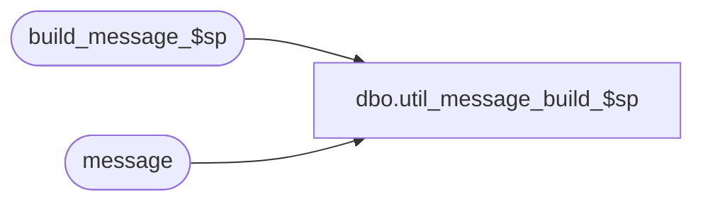

# dbo.util_message_build_$sp

**Database:** auditworks  
**Server:** bedrockdb01  

## Architecture Diagram



## Table Dependencies

| Referenced Table |
|---|
| build_message_$sp |
| message |

## Stored Procedure Code

```sql
CREATE proc  dbo.util_message_build_$sp AS

DECLARE
@message_text		varchar(255)


--SELECT @message_text = '201674'

SELECT @message_text = text
  FROM message
 WHERE id = 201671 --@message_id1
SELECT @message_text = 'Bypassed transaction (Store/Reg/tran#/series) |1 for transaction date |d1.  Interface id |3 '

SELECT @message_text
--EXEC build_message_$sp  @entry_id, @message_text OUTPUT
EXEC build_message_$sp  252, @message_text OUTPUT

SELECT @message_text
```

